```mermaid
graph TB
    PHYS["Physical Reality"] --> BOUND["Boundary"]
    BOUND --> TIME["Time"]
    BOUND --> GEO["Geometry"]
    BOUND --> ALG["Algebra"]

    TIME --> KAPPA["Unified Time Scale κ"]
    GEO --> GHY["GHY Boundary Term"]
    ALG --> MOD["Modular Flow"]

    KAPPA -.->|"Same Object"| GHY
    GHY -.->|"Same Object"| MOD

    style PHYS fill:#fff4e1,stroke:#ff6b6b,stroke-width:4px
    style BOUND fill:#e1f5ff,stroke:#0066cc,stroke-width:3px
```

# Boundary Theory: Overview

> *"Physics is not in the bulk, but on the boundary."*

## 🎯 Core Ideas of This Chapter

In GLS theory, **boundary is viewed as essence**. This chapter will present a core perspective:

**All computable physical objects are proposed to concentrate on the boundary, the bulk can be viewed as reconstruction of boundary data.**

## 📚 Chapter Content Map

This chapter consists of 11 articles, revealing the complete picture of boundary physics:

### Article 1: Why Boundary?

**Core Question**: Why must physics be defined on the boundary?

**Three Major Evidences**:
1. **Scattering Theory**: $S$-matrix defined at asymptotic boundary
2. **Quantum Field Theory**: Modular flow localized on region boundary
3. **General Relativity**: Einstein-Hilbert action alone ill-defined, must add GHY boundary term

**Key Insight**: Bulk can be viewed as a "phantom" of boundary data!

### Article 2: Boundary Data Triplet

**Core Object**:

$$(\partial\mathcal{M}, \mathcal{A}_\partial, \omega_\partial)$$

where:
- $\partial\mathcal{M}$: Geometric boundary (can be piecewise, contains null pieces)
- $\mathcal{A}_\partial$: Boundary observable algebra
- $\omega_\partial$: Boundary state

**Unified Framework**: All boundary physics is theoretically encoded by this triplet!

### Article 3: GHY Boundary Term

**Core Formula**:

$$S_{\mathrm{GHY}} = \frac{\varepsilon}{8\pi G}\int_{\partial\mathcal{M}}\sqrt{|h|}\,K\,\mathrm{d}^3x$$

where:
- $\varepsilon = n^\mu n_\mu \in \{\pm 1\}$ (orientation factor)
- $K$: Extrinsic curvature
- $h_{ab}$: Induced metric

**Physical Meaning**:
- **Variational Well-Definedness**: Only with GHY term, Einstein-Hilbert action is well-defined for variations fixing boundary metric
- **Corner Terms**: Piecewise boundaries need additional corner terms
- **Null Boundaries**: Null geodesic boundaries need $(\theta + \kappa)$ structure

### Article 4: Brown-York Quasi-Local Energy

**Core Definition**:

$$T^{ab}_{\mathrm{BY}} = \frac{1}{8\pi G}(K^{ab} - K h^{ab})$$

**Physical Meaning**:
- **Quasi-Local Energy**: $E_{\mathrm{BY}} = \int \sqrt{\sigma}\, u_a u_b\, T^{ab}_{\mathrm{BY}}\, \mathrm{d}^2x$
- **Asymptotic Limit**: $E_{\mathrm{BY}} \to M_{\mathrm{ADM}}$ (ADM mass)
- **Differentiability**: GHY boundary term makes Hamiltonian differentiable

**Deep Connection**:
$$\text{Brown-York Energy} \Longleftrightarrow \text{Boundary Time Generator} \Longleftrightarrow \text{Modular Flow Parameter}$$

### Article 5: Boundary Observer

**Core Concept**: Observer is theoretically essentially a boundary observer!

**Three Realizations**:
1. **Scattering Observer**: Measures scattering phase at asymptotic boundary
2. **Modular Flow Observer**: Defines modular Hamiltonian on region boundary
3. **Geometric Observer**: Measures Brown-York energy on timelike boundary

**Unified Scale**: All observers are considered to share the same time scale equivalence class $[\kappa]$!

### Article 6: Boundary Theory Mid-Summary

**Summary of First 6 Articles**: Basic framework of boundary data triplet

### Article 7: Boundary as Stage

**Core Idea**: Physics is considered to truly happen on boundary, bulk is just "projection" or "holographic image" of boundary data

**Boundary Triplet**: $(∂M, \mathcal{A}_∂, ω_∂)$ unifies all boundary physics
- $∂M$: Geometric boundary (physical space of stage)
- $\mathcal{A}_∂$: Boundary algebra (set of observables/script)
- $ω_∂$: Boundary state (rules for expectation values/director's instructions)

**Three Actors, Same Stage**:
1. **Scattering Actor**: Time translation $= \int\omega d\mu^{\text{scatt}}(\omega)$
2. **Modular Flow Actor**: Modular Hamiltonian $K_D = -\log \Delta$
3. **Geometric Actor**: Brown-York Hamiltonian $H_∂^{\text{grav}}$

**Boundary Trinity Proposition**:
$$H_∂ = \int\omega d\mu^{\text{scatt}} = c_1 K_D = c_2^{-1} H_∂^{\text{grav}}$$

**Null-Modular Double Cover**:
- Causal diamond boundary decomposes as $E^+ \sqcup E^-$ (future/past null pieces)
- Modular Hamiltonian localized on null boundary
- $\mathbb{Z}_2$ holonomy characterizes topological structure

**Daily Analogy**: Theater stage (boundary) is where performance truly happens, three actors can be viewed as three guises of the same person

### Article 8: Boundary, Observer, and Time

**Core Idea**: Time axis = geodesic chosen by observer attention on boundary section family

**Three Profound Questions**:
1. What is the boundary like without an observer?
2. What mathematical object is the world that the observer "sees"?
3. **Is time a product of the observer's "attention"?**

**Observer Triplet**: $\mathcal{O} = (\gamma, \Lambda, \mathcal{A}_{\gamma,\Lambda})$
- $\gamma$: Worldline (observer trajectory)
- $\Lambda$: Resolution (minimum scale)
- $\mathcal{A}_{\gamma,\Lambda}$: Observable algebra (measurable physical quantities)

**World Section**: $\Sigma_\tau = (\gamma(\tau), \mathcal{A}_{\gamma,\Lambda}(\tau), \rho_{\gamma,\Lambda}(\tau))$
The world the observer "sees" at time $\tau$

**Core Propositions**:
- **No-Observer Time Inference**: No observer → No time, only scale field $\kappa(\omega)$
- **Attention Geodesic Hypothesis**: Time axis $\tau$ must satisfy:
  1. Scale condition: $\frac{d\tau}{d\lambda} = \int \kappa(\omega) w_\lambda(\omega) d\omega$
  2. Generalized entropy geodesic: Section family $\{\sigma(\tau)\}$ makes $S_{\text{gen}}$ stationary
- **Section Universe $\mathfrak{S}$**: Space of all possible sections, observer experience = a path in it

**New Interpretation of Double-Slit Interference**: With/without detector = different paths in section universe, quantum superposition = path superposition!

**Daily Analogy**: Film reel (all frames exist simultaneously), projector (attention) selects frame sequence to produce time flow

### Article 9: Boundary Clock

**Core Idea**: Boundary clock = directly measure scale master $\kappa(\omega)$ using windowed spectral readings

**Physical Challenge**: Ideal clock is impossible
- Requires infinite time $t\in(-\infty,+\infty)$ to run
- Requires infinite bandwidth $\omega\in\mathbb{R}$
- Requires infinite energy

**Ideal vs Windowed Reading**:
- **Ideal Reading**: $\mathcal{R}_{\text{ideal}} = \int_{-\infty}^{+\infty} \kappa(\omega) f(\omega) d\omega$ (impossible)
- **Windowed Reading**: $\mathcal{R}_{\text{window}} = \int_{-W}^{+W} W(\omega) \kappa(\omega) f(\omega) d\omega$ (practically feasible)

**PSWF/DPSS Optimal Window Functions** (Slepian Theorem):
- **Prolate Spheroidal Wave Functions** are the optimal window function family
- **Optimal energy concentration** under constraints of time window $[-T,T]$ and frequency band $[-W,W]$
- Effective degrees of freedom: $N_{\text{eff}} \approx 2WT/\pi$
- Eigenvalues $\lambda_n$ drop sharply: $\lambda_0\approx 1$, $\lambda_{2WT/\pi}\approx 0$

**Windowed Clock Formula**:
$$\Theta_\Delta(\omega) = (\rho_{\text{rel}} * P_\Delta)(\omega)$$
Solves negative delay problem, ensures causality!

**Experimental Applications**:
- Atomic clock networks (GPS/optical clocks)
- Microwave cavity scattering experiments
- Fast Radio Burst (FRB) time delay
- δ-ring scattering standard source

**Daily Analogy**: Finite precision watch vs ideal infinite precision clock, minimize error using optimal window functions

### Article 10: Trinity Master Scale

**Core Idea**: Unification of three time definitions might not be coincidence, but profound necessity of boundary geometry

**Ultimate Question**: **Why** do three completely different definitions give the **same** time scale?
$$\kappa(\omega) = \frac{\varphi'(\omega)}{\pi} = \rho_{\text{rel}}(\omega) = \frac{1}{2\pi}\text{tr}Q(\omega)$$

**Scale Equivalence Class**: $[\kappa]$ - uniqueness under affine transformation
- Two scales equivalent: $\tau_2 = a\tau_1 + b$ (allowing rescaling and translation)
- All affinely related scales form equivalence class $[\kappa]$
- **Different units measure the same length!** (e.g., meters, feet, light-seconds)

**Three Definitions of Trinity Master Scale**:

1. **Scattering Phase Derivative** (scattering theory):
   $$\kappa_{\text{scatt}}(\omega) = \frac{\varphi'(\omega)}{\pi}$$
   Physical picture: Wavefunction phase change when particles scatter

2. **Modular Flow Time Parameter** (operator algebra):
   $$\kappa_{\text{mod}}(\omega) = \rho_{\text{rel}}(\omega)$$
   Physical picture: Evolution parameter induced by quantum state entanglement structure

3. **Brown-York Boundary Energy** (general relativity):
   $$\kappa_{\text{grav}}(\omega) = \frac{1}{2\pi}\text{tr}Q(\omega)$$
   Physical picture: Time translation generated by boundary quasi-local energy

**Core Propositions**:
- **Affine Uniqueness Proposition** (Proposition 3.1): $\kappa_{\text{scatt}} \sim \kappa_{\text{mod}} \sim \kappa_{\text{grav}}$
  Three scales belong to the same equivalence class!
- **Topological Class Equivalence** (Theorem 3.2): Null-Modular $\mathbb{Z}_2$ class $[K]$ equivalent to:
  - Half-phase transition $\Delta\varphi = \pi \mod 2\pi$
  - Fermion statistics sign $(-1)^F$
  - Time crystal period doubling
- **Generalized Entropy Variation** (Theorem 3.3):
  $$\delta^2 S_{\text{gen}} = \int \kappa(\omega) \Psi(\omega) d\omega + C\delta^2\Lambda_{\text{eff}}$$
  Time scale is the weight of generalized entropy second-order variation!

**Null-Modular $\mathbb{Z}_2$ Class**: $[K] \in H^2(Y,\partial Y;\mathbb{Z}_2)$
- **Topological DNA** of time
- Encodes global topological information on boundary null surfaces
- Determines fundamental properties like fermion statistics, half-integer spin

**Daily Analogy**: Three blind men touching an elephant (deepened version)
- Blind man A touches trunk (scattering), B touches leg (modular flow), C touches tail (gravity)
- Reported "lengths" $L_1, L_2, L_3$ must be equal
- Reason: They might all be **intrinsic scales** of the elephant, determined by intrinsic geometry!

### Article 11: Boundary Theory Summary

**Complete Picture**:

```mermaid
graph TB
    BOUNDARY["Boundary<br/>(∂M, A_∂, ω_∂)"] --> THREE["Trinity"]

    THREE --> TIME["Time Scale<br/>κ(ω)"]
    THREE --> GEO["Geometric Boundary<br/>GHY + BY"]
    THREE --> ALG["Algebraic Boundary<br/>Modular Flow"]

    TIME --> SCATTER["Scattering Phase<br/>φ'(ω)/π"]
    TIME --> WIGNER["Group Delay<br/>tr Q/(2π)"]
    TIME --> SPEC["Spectral Shift<br/>ρ_rel"]

    GEO --> K["Extrinsic Curvature<br/>K"]
    GEO --> ENERGY["Quasi-Local Energy<br/>E_BY"]

    ALG --> MOD["Modular Hamiltonian<br/>K_ω"]
    ALG --> ENT["Relative Entropy<br/>S(ρ‖ω)"]

    style BOUNDARY fill:#fff4e1,stroke:#ff6b6b,stroke-width:4px
    style THREE fill:#e1f5ff,stroke:#0066cc,stroke-width:3px
```

## 🔗 Connections with Other Chapters

### Following Unified Time Chapter (Chapter 5)

In Unified Time chapter, we proved:

$$\kappa(\omega) = \frac{\varphi'(\omega)}{\pi} = \rho_{\mathrm{rel}}(\omega) = \frac{1}{2\pi}\operatorname{tr}Q(\omega)$$

Now we will see: **This unified scale is theoretically determined by boundary data!**

### Leading to Causal Structure Chapter (Chapter 7)

Boundary theory provides foundation for causal structure:
- **Causal Diamond**: Defined by boundary null surfaces
- **Null-Modular Double Cover**: Natural structure of null boundaries
- **Modular Hamiltonian**: Localized on boundary null surfaces

### Connecting IGVP Framework (Chapter 4)

Boundary theory completes IGVP variational principle:
- **Generalized Entropy**: Extremum on small causal diamond boundary
- **Einstein Equation**: First-order condition from boundary variation
- **QNEC/QFC**: Second-order conditions from boundary variation

## 💡 Learning Roadmap

```mermaid
graph TB
    START["Start Boundary Theory"] --> PART1["Part 1: Basic Framework<br/>(Articles 1-6)"]

    PART1 --> WHY["01-Why Boundary<br/>Three Historical Evidences"]
    WHY --> TRIPLE["02-Boundary Triplet<br/>(∂M, 𝒜_∂, ω_∂)"]
    TRIPLE --> GHY["03-GHY Boundary Term<br/>Variational Well-Definedness"]
    GHY --> BY["04-Brown-York Energy<br/>Quasi-Local Energy"]
    BY --> OBS["05-Boundary Observer<br/>Three Observer Unifications"]
    OBS --> SUM1["06-Mid-Summary"]

    SUM1 --> PART2["Part 2: Deepening Unification<br/>(Articles 7-10)"]

    PART2 --> STAGE["07-Boundary as Stage<br/>Boundary Trinity"]
    STAGE --> TIME["08-Boundary Observer and Time<br/>Attention Geodesic"]
    TIME --> CLOCK["09-Boundary Clock<br/>PSWF Optimal Window Functions"]
    CLOCK --> MASTER["10-Trinity Master Scale<br/>Affine Uniqueness"]

    MASTER --> FINAL["11-Boundary Theory Summary<br/>Complete Picture"]

    GHY -.->|"Mathematical Details"| TECH["Technical Appendix"]

    style START fill:#e1f5ff
    style PART1 fill:#fff4e1
    style PART2 fill:#ffe1e1
    style FINAL fill:#e1ffe1,stroke:#00cc00,stroke-width:3px
```

### Recommended Reading Order

**Quick Path** (grasp core):
1. 01-Why Boundary (intuition)
2. 03-GHY Boundary Term (core formula)
3. 07-Boundary as Stage (unified perspective)
4. 10-Trinity Master Scale (ultimate unification)
5. 11-Summary (complete picture)

**Complete Learning** (deep understanding):
Read 01-11 in order, divided into two stages:
- **Stage 1**: 01-06 (basic framework)
- **Stage 2**: 07-10 (deepening unification)

**Technical Research** (rigorous derivation):
Focus on:
- Appendix of 03-GHY Boundary Term (variational calculation)
- 09-Boundary Clock (PSWF/DPSS mathematics)
- 10-Trinity Master Scale (topological $\mathbb{Z}_2$ class)

## 🎓 Core Conclusions Preview

After completing this chapter, you will understand:

### 1. Boundary Completeness Hypothesis

**Proposition**: Bulk physics content can theoretically be completely reconstructed from boundary triplet.

**Evidence**:
- Scattering theory: Wave operators and $S$-matrix
- AdS/CFT: Boundary CFT reconstructs bulk geometry
- Hamilton-Jacobi: Boundary data reconstructs bulk solution

### 2. Boundary Time Trinity Proposition

**Proposition**: The following three "boundary times" are proposed to be equivalent:

$$\text{Scattering Time Delay} \Longleftrightarrow \text{Modular Flow Parameter} \Longleftrightarrow \text{Brown-York Boundary Time}$$

**Unified Generator**:

$$H_\partial = \int \omega\, \mathrm{d}\mu_\partial^{\mathrm{scatt}}(\omega) = c_1 K_D + c_2^{-1} H_\partial^{\mathrm{grav}}$$

### 3. GHY Necessity Argument

**Argument**: On non-null boundaries, after adding

$$S_{\mathrm{GHY}} = \frac{\varepsilon}{8\pi G}\int_{\partial\mathcal{M}}\sqrt{|h|}\,K\,\mathrm{d}^3x$$

for variations fixing induced metric $h_{ab}$:

$$\delta(S_{\mathrm{EH}} + S_{\mathrm{GHY}}) = \frac{1}{16\pi G}\int_{\mathcal{M}}\sqrt{-g}\,G_{\mu\nu}\,\delta g^{\mu\nu}$$

Boundary terms completely cancel!

### 4. Quasi-Local Energy Convergence Property

**Property**: Brown-York quasi-local energy converges to ADM mass in asymptotically flat limit:

$$\lim_{r\to\infty} E_{\mathrm{BY}}(r) = M_{\mathrm{ADM}}$$

And is conserved under spacetime evolution (under appropriate boundary conditions).

## 🤔 Thinking Questions (Chapter Preview)

### Question 1: Why is Einstein-Hilbert Action Ill-Defined?

**Hint**: Calculate $\delta S_{\mathrm{EH}}$, see what uncontrollable derivatives appear in boundary terms.

**Answer in**: 01-Why Boundary, 03-GHY Boundary Term

### Question 2: What is "Quasi-Local" Energy?

**Hint**: Why can't we define "local" energy in curved spacetime? What is the best alternative?

**Answer in**: 04-Brown-York Energy

### Question 3: How Do Boundary Observers Measure Time?

**Hint**: Recall time scale identity from Unified Time chapter, now all on boundary!

**Answer in**: 05-Boundary Observer

### Question 4: How Does AdS/CFT Reflect Boundary Completeness?

**Hint**: Boundary CFT completely determines bulk AdS geometry.

**Answer in**: 06-Summary, and future advanced topics chapters

## 📖 Notation Conventions

This chapter uses the following core symbols:

### Geometric Symbols
- $\mathcal{M}$: Spacetime manifold (4-dimensional)
- $\partial\mathcal{M}$: Boundary (3-dimensional, can be piecewise)
- $g_{\mu\nu}$: Bulk metric (signature $-+++$)
- $h_{ab}$: Induced metric
- $n^\mu$: Unit normal vector
- $\varepsilon := n^\mu n_\mu \in \{\pm 1\}$: Orientation factor

### Curvature Symbols
- $R$: Ricci scalar
- $K_{ab}$: Extrinsic curvature
- $K := h^{ab}K_{ab}$: Trace of extrinsic curvature

### Boundary Objects
- $(\partial\mathcal{M}, \mathcal{A}_\partial, \omega_\partial)$: Boundary triplet
- $T^{ab}_{\mathrm{BY}}$: Brown-York stress tensor
- $E_{\mathrm{BY}}$: Brown-York quasi-local energy
- $S_{\mathrm{GHY}}$: Gibbons-Hawking-York boundary term

### Null Boundaries
- $\ell^\mu$: Null generator vector ($\ell \cdot \ell = 0$)
- $\theta$: Expansion
- $\kappa$: Surface gravity
- $\gamma_{AB}$: Transverse two-dimensional metric

## 🔍 Unique Contributions of This Chapter

Compared to traditional general relativity textbooks, this chapter:

1. **Unifies Three Perspectives**
   - Traditional: Separately discuss GHY term, Brown-York energy, modular flow
   - This chapter: Unified as boundary trinity

2. **Emphasizes Boundary Completeness**
   - Traditional: Boundary is technical supplement
   - This chapter: Boundary is physical essence

3. **Connects Time Scale**
   - Traditional: Isolated discussion of various times
   - This chapter: All times unified by boundary scale

4. **Intuitive Explanations**
   - Traditional: Pure technical derivation
   - This chapter: Multi-level explanations (analogy → concept → formula → source)

## 🌟 Why Is This Chapter Important?

Boundary Theory is one of the **pillars** of GLS theory, because:

### Theoretical Level
- Reveals boundary essence of physics
- Unifies three perspectives: time, geometry, algebra
- Provides foundation for causal structure and topological constraints

### Application Level
- Black hole thermodynamics: Horizon is boundary
- AdS/CFT: Core of holographic principle
- Quantum gravity: Boundary degrees of freedom

### Philosophical Level
- **Paradigm shift from bulk to boundary**
- **Boundary essence of observer**
- **Measurement as boundary projection**

---

**Ready?**

Let's begin this paradigm revolution from bulk to boundary!

**Next Article**: [01-Why Boundary](01-why-boundary.md) - Revealing why physics must be defined on boundary

**Return**: [GLS Theory Complete Tutorial](../index.md)
