```mermaid
graph TB
    BOUNDARY["Boundary<br/>(∂M, A_∂, ω_∂)"] --> THREE["Trinity"]

    THREE --> TIME["Time Scale<br/>κ(ω)"]
    THREE --> GEO["Geometric Boundary<br/>GHY + BY"]
    THREE --> ALG["Algebraic Boundary<br/>Modular Flow"]

    TIME --> SCATTER["Scattering Phase<br/>φ'(ω)/π"]
    TIME --> WIGNER["Group Delay<br/>tr Q/(2π)"]
    TIME --> SPEC["Spectral Shift<br/>ρ_rel"]

    GEO --> K["Extrinsic Curvature<br/>K"]
    GEO --> ENERGY["Quasi-Local Energy<br/>E_BY"]

    ALG --> MOD["Modular Hamiltonian<br/>K_ω"]
    ALG --> ENT["Relative Entropy<br/>S(ρ‖ω)"]

    style BOUNDARY fill:#fff4e1,stroke:#ff6b6b,stroke-width:4px
    style THREE fill:#e1f5ff,stroke:#0066cc,stroke-width:3px
```

# Boundary Theory Chapter: Overview

> *"Physics is not in the bulk, but on the boundary."*

## 🎯 Core Ideas of This Chapter

In GLS theory, **the boundary is not a limitation, but the essence**. This chapter will reveal an astonishing fact:

**All computable physical objects are concentrated on the boundary; the bulk is merely reconstruction from boundary data.**

```mermaid
graph TB
    PHYS["Physical Reality"] --> BOUND["Boundary"]
    BOUND --> TIME["Time"]
    BOUND --> GEO["Geometry"]
    BOUND --> ALG["Algebra"]

    TIME --> KAPPA["Unified Time Scale κ"]
    GEO --> GHY["GHY Boundary Term"]
    ALG --> MOD["Modular Flow"]

    KAPPA -.->|"Same Object"| GHY
    GHY -.->|"Same Object"| MOD

    style PHYS fill:#fff4e1,stroke:#ff6b6b,stroke-width:4px
    style BOUND fill:#e1f5ff,stroke:#0066cc,stroke-width:3px
```

## 📚 Content Map of This Chapter

This chapter consists of 6 articles, revealing the complete picture of boundary physics:

### Article 1: Why Boundary?

**Core Question**: Why must physics be defined on the boundary?

**Three Major Evidences**:
1. **Scattering Theory**: $S$-matrix defined at asymptotic boundary
2. **Quantum Field Theory**: Modular flow localized on regional boundaries
3. **General Relativity**: Einstein-Hilbert action alone is ill-defined, must add GHY boundary term

**Key Insight**: The bulk is more like a "phantom" of boundary data!

### Article 2: Boundary Data Triple

**Core Object**:

$$(\partial\mathcal{M}, \mathcal{A}_\partial, \omega_\partial)$$

where:
- $\partial\mathcal{M}$: geometric boundary (can be piecewise, includes null pieces)
- $\mathcal{A}_\partial$: boundary observable algebra
- $\omega_\partial$: boundary state

**Unified Framework**: All boundary physics is encoded by this triple!

### Article 3: GHY Boundary Term

**Core Formula**:

$$S_{\mathrm{GHY}} = \frac{\varepsilon}{8\pi G}\int_{\partial\mathcal{M}}\sqrt{|h|}\,K\,\mathrm{d}^3x$$

where:
- $\varepsilon = n^\mu n_\mu \in \{\pm 1\}$ (orientation factor)
- $K$: extrinsic curvature
- $h_{ab}$: induced metric

**Physical Meaning**:
- **Variational Well-Definedness**: Only with GHY term, Einstein-Hilbert action is well-defined for variations fixing boundary metric
- **Corner Terms**: Piecewise boundaries require additional corner terms
- **Null Boundaries**: Null geodesic boundaries require $(\theta + \kappa)$ structure

### Article 4: Brown-York Quasi-Local Energy

**Core Definition**:

$$T^{ab}_{\mathrm{BY}} = \frac{1}{8\pi G}(K^{ab} - K h^{ab})$$

**Physical Meaning**:
- **Quasi-Local Energy**: $E_{\mathrm{BY}} = \int \sqrt{\sigma}\, u_a u_b\, T^{ab}_{\mathrm{BY}}\, \mathrm{d}^2x$
- **Asymptotic Limit**: $E_{\mathrm{BY}} \to M_{\mathrm{ADM}}$ (ADM mass)
- **Differentiability**: GHY boundary term makes Hamiltonian differentiable

**Deep Connection**:
$$\text{Brown-York Energy} \Longleftrightarrow \text{Boundary Time Generator} \Longleftrightarrow \text{Modular Flow Parameter}$$

### Article 5: Boundary Observers

**Core Concept**: Observers are essentially boundary observers!

**Three Realizations**:
1. **Scattering Observer**: Measures scattering phase at asymptotic boundary
2. **Modular Flow Observer**: Defines modular Hamiltonian on regional boundary
3. **Geometric Observer**: Measures Brown-York energy on timelike boundary

**Unified Scale**: All observers share the same time scale equivalence class $[\kappa]$!

### Article 6: Boundary Theory Summary

**Ultimate Picture**:

## 🔗 Connections to Other Chapters

### Following Unified Time Chapter (Chapter 5)

In the Unified Time chapter, we proved:

$$\kappa(\omega) = \frac{\varphi'(\omega)}{\pi} = \rho_{\mathrm{rel}}(\omega) = \frac{1}{2\pi}\operatorname{tr}Q(\omega)$$

Now we will see: **This unified scale is completely determined by boundary data!**

### Leading to Causal Structure Chapter (Chapter 7)

Boundary theory provides foundation for causal structure:
- **Causal Diamond**: Defined by boundary null surfaces
- **Null-Modular Double Cover**: Natural structure of null boundaries
- **Modular Hamiltonian**: Localized on boundary null surfaces

### Connecting to IGVP Framework (Chapter 4)

Boundary theory completes the IGVP variational principle:
- **Generalized Entropy**: Extremized on small causal diamond boundary
- **Einstein Equations**: First-order condition from boundary variation
- **QNEC/QFC**: Second-order condition from boundary variation

## 💡 Learning Roadmap

### Recommended Reading Order

**Fast Track** (Grasp Core):
1. 01-Why Boundary (intuition)
2. 03-GHY Boundary Term (core formula)
3. 04-Brown-York Energy (physical applications)
4. 06-Summary (complete picture)

**Deep Learning** (Complete Understanding):
Read 01-06 in order, with source theory documents

**Technical Research** (Rigorous Derivation):
Focus on Article 03-GHY Boundary Term appendix, understand every step of variational calculation

## 🎓 Core Conclusions Preview

After completing this chapter, you will understand:

### 1. Boundary Completeness Principle

**Proposition**: Bulk physics content can be completely reconstructed from boundary triple.

**Evidence**:
- Scattering theory: wave operators and $S$-matrix
- AdS/CFT: boundary CFT reconstructs bulk geometry
- Hamilton-Jacobi: boundary data reconstructs bulk solution

### 2. Boundary Time Trinity

**Theorem**: The following three "boundary times" are equivalent:

$$\text{Scattering Time Delay} \Longleftrightarrow \text{Modular Flow Parameter} \Longleftrightarrow \text{Brown-York Boundary Time}$$

**Unified Generator**:

$$H_\partial = \int \omega\, \mathrm{d}\mu_\partial^{\mathrm{scatt}}(\omega) = c_1 K_D + c_2^{-1} H_\partial^{\mathrm{grav}}$$

### 3. GHY Necessity Theorem

**Theorem**: On non-null boundaries, after adding

$$S_{\mathrm{GHY}} = \frac{\varepsilon}{8\pi G}\int_{\partial\mathcal{M}}\sqrt{|h|}\,K\,\mathrm{d}^3x$$

for variations fixing induced metric $h_{ab}$:

$$\delta(S_{\mathrm{EH}} + S_{\mathrm{GHY}}) = \frac{1}{16\pi G}\int_{\mathcal{M}}\sqrt{-g}\,G_{\mu\nu}\,\delta g^{\mu\nu}$$

Boundary terms completely cancel!

### 4. Quasi-Local Energy Convergence Theorem

**Theorem**: Brown-York quasi-local energy converges to ADM mass in asymptotically flat limit:

$$\lim_{r\to\infty} E_{\mathrm{BY}}(r) = M_{\mathrm{ADM}}$$

And is conserved under spacetime evolution (under appropriate boundary conditions).

## 🤔 Thought Questions (Chapter Preview)

### Question 1: Why is Einstein-Hilbert Action Ill-Defined?

**Hint**: Calculate $\delta S_{\mathrm{EH}}$, see what uncontrollable derivatives appear in boundary terms.

**Answer in**: 01-Why Boundary, 03-GHY Boundary Term

### Question 2: What is "Quasi-Local" Energy?

**Hint**: Why can't we define "local" energy in curved spacetime? What is the best alternative?

**Answer in**: 04-Brown-York Energy

### Question 3: How Do Boundary Observers Measure Time?

**Hint**: Recall the Time Scale Identity from Unified Time chapter, now all on boundary!

**Answer in**: 05-Boundary Observers

### Question 4: How Does AdS/CFT Embody Boundary Completeness?

**Hint**: Boundary CFT completely determines bulk AdS geometry.

**Answer in**: 06-Summary, and future advanced topics chapter

## 📖 Notation Conventions

This chapter uses the following core symbols:

### Geometric Symbols
- $\mathcal{M}$: spacetime manifold (4D)
- $\partial\mathcal{M}$: boundary (3D, can be piecewise)
- $g_{\mu\nu}$: bulk metric (signature $-+++$)
- $h_{ab}$: induced metric
- $n^\mu$: unit normal vector
- $\varepsilon := n^\mu n_\mu \in \{\pm 1\}$: orientation factor

### Curvature Symbols
- $R$: Ricci scalar
- $K_{ab}$: extrinsic curvature
- $K := h^{ab}K_{ab}$: trace of extrinsic curvature

### Boundary Objects
- $(\partial\mathcal{M}, \mathcal{A}_\partial, \omega_\partial)$: boundary triple
- $T^{ab}_{\mathrm{BY}}$: Brown-York stress tensor
- $E_{\mathrm{BY}}$: Brown-York quasi-local energy
- $S_{\mathrm{GHY}}$: Gibbons-Hawking-York boundary term

### Null Boundaries
- $\ell^\mu$: null generating vector ($\ell \cdot \ell = 0$)
- $\theta$: expansion
- $\kappa$: surface gravity
- $\gamma_{AB}$: transverse 2D metric

## 🔍 Unique Contributions of This Chapter

Compared to traditional general relativity textbooks, this chapter:

1. **Unifies Three Perspectives**
   - Traditional: separately discuss GHY term, Brown-York energy, modular flow
   - This chapter: unifies as boundary trinity

2. **Emphasizes Boundary Completeness**
   - Traditional: boundary is technical supplement
   - This chapter: boundary is physical essence

3. **Connects Time Scale**
   - Traditional: isolated discussion of various times
   - This chapter: all times unified by boundary scale

4. **Accessible Intuitive Explanations**
   - Traditional: pure technical derivation
   - This chapter: multi-level explanations (analogy → concept → formula → source)

## 🌟 Why Is This Chapter Important?

Boundary Theory chapter is **one of the pillars** of GLS theory, because:

### Theoretical Level
- Reveals boundary nature of physics
- Unifies three perspectives: time, geometry, algebra
- Provides foundation for causal structure and topological constraints

### Application Level
- Black hole thermodynamics: horizon is boundary
- AdS/CFT: core of holographic principle
- Quantum gravity: boundary degrees of freedom

### Philosophical Level
- **Paradigm shift from bulk to boundary**
- **Boundary nature of observers**
- **Measurement as boundary projection**

---

**Ready?**

Let's begin this paradigm revolution from bulk to boundary!

**Next**: [01-Why Boundary_en.md](01-why-boundary_en.md) - Revealing why physics must be defined on boundary

**Back**: [Complete GLS Theory Tutorial](../index_en.md)

