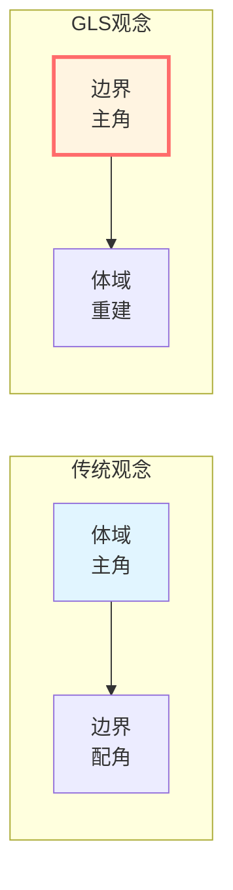
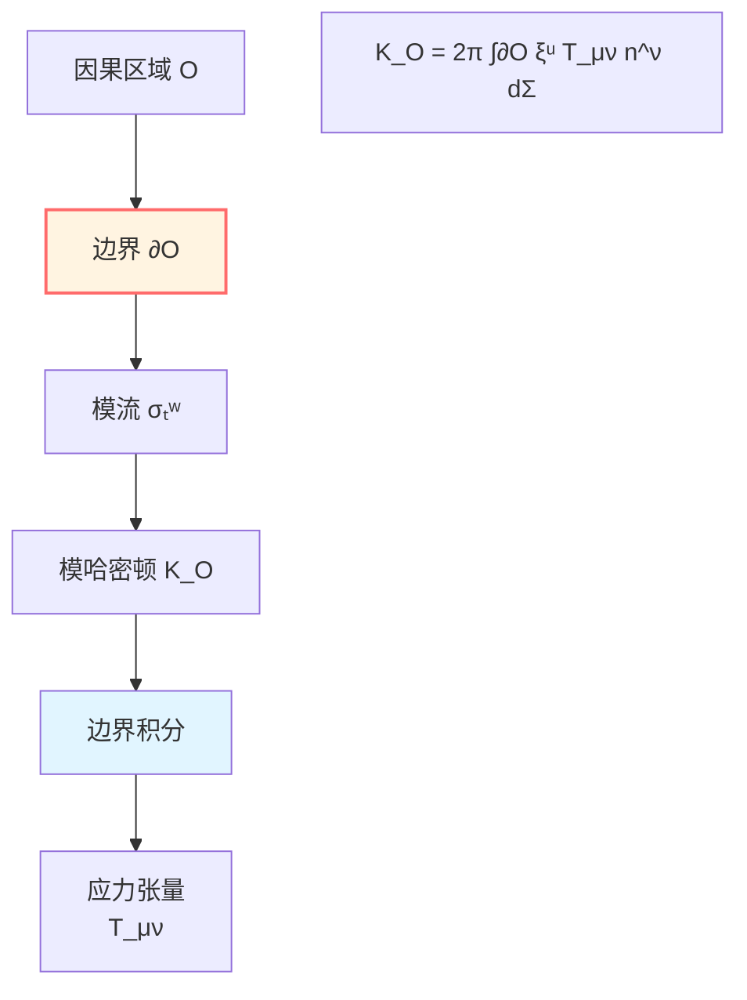
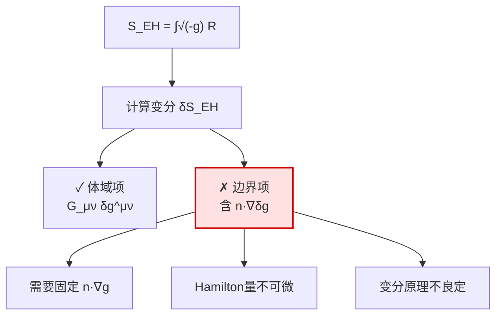
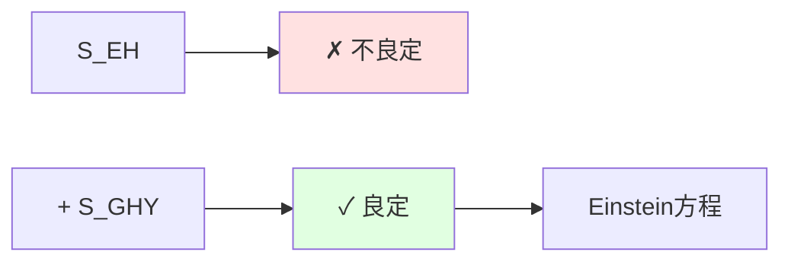
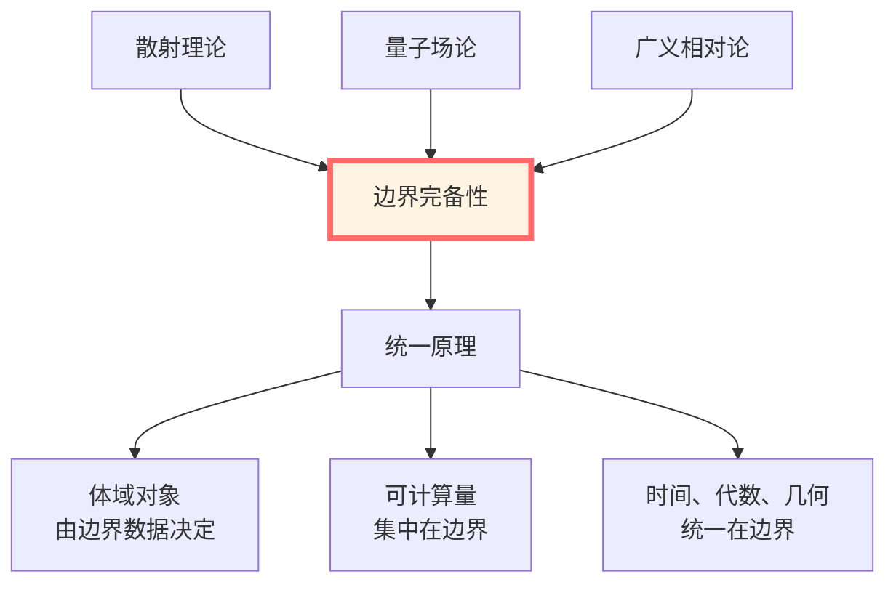
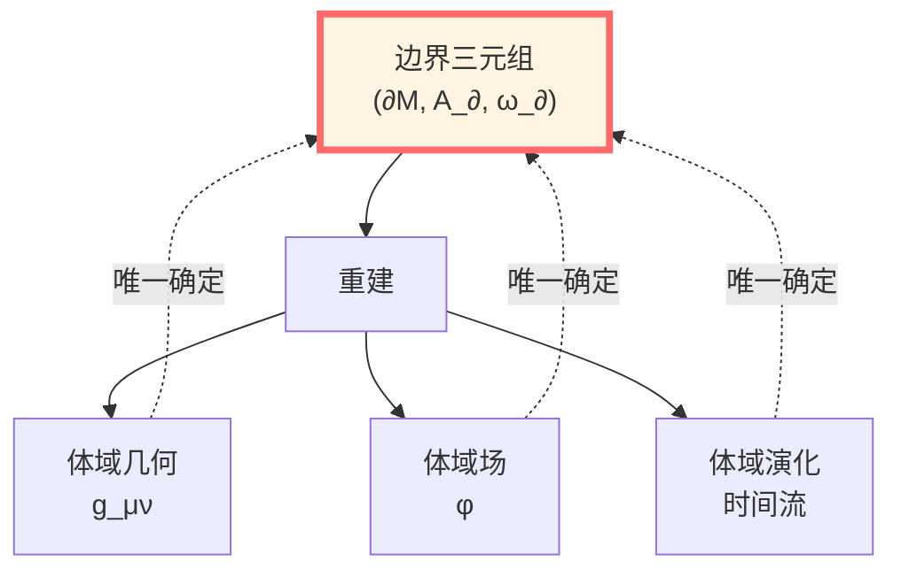
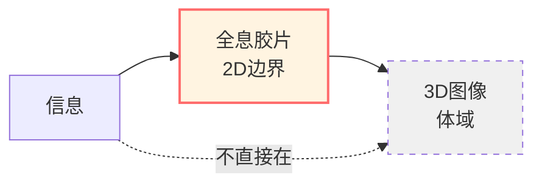
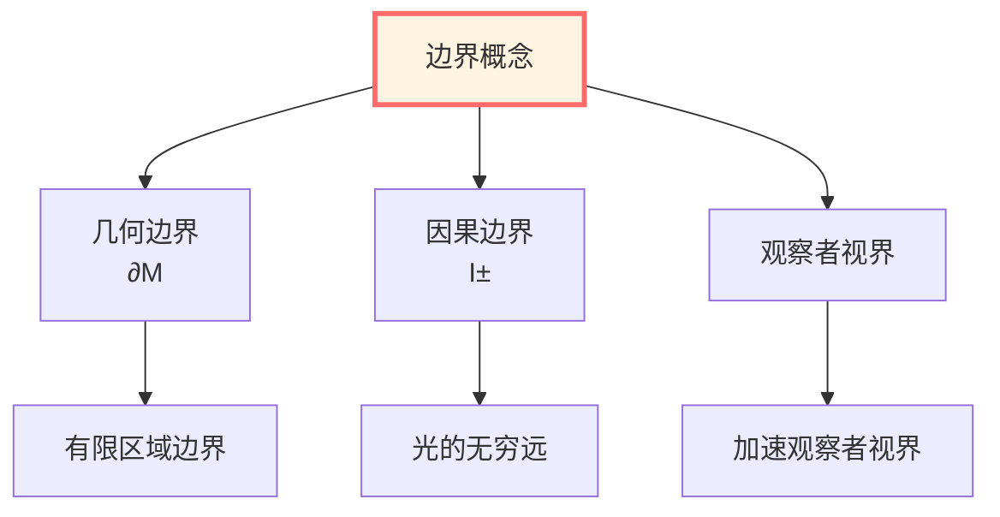
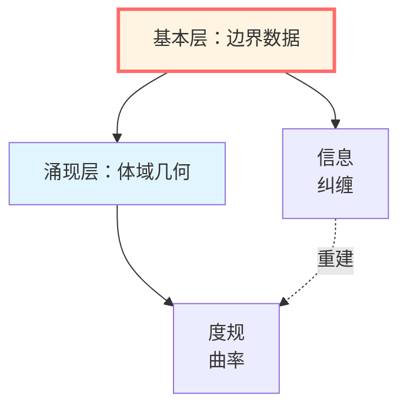

# 为什么是边界？从体域到边界的范式转移

> *"真正可计算的物理对象往往集中在边界，而体域更像边界数据的重建或演化结果。"*

## 🎯 核心问题

**问题**：为什么物理必须在边界上定义？

**答案预告**：因为所有可测量的物理量都通过边界实现！

## 💡 直观图像：房间的比喻

想象一个场景：

**传统物理观念（体域中心）**：
- 物理发生在房间内部
- 边界（墙壁）只是限制条件
- 要理解房间，必须知道内部每一点发生什么

**GLS边界观念（边界中心）**：
- 物理本质在墙壁上！
- 房间内部只是墙壁信息的"投影"
- 要理解房间，只需知道墙壁上的数据

**关键洞察**：
- 你只能通过墙壁测量房间！
- 墙壁上的声音、光线、温度完全确定房间内部
- 内部是墙壁数据的必然结果

## 📜 历史证据：三大范式的转变

### 1. 散射理论：$S$-矩阵在无穷远边界

**历史**：1940-60年代，Heisenberg、Wheeler提出$S$-矩阵理论

**核心观念**：
- 实验只能测量渐近粒子（$t \to \pm\infty$）
- 散射矩阵 $S$ 在时空无穷远边界定义
- 体域相互作用细节无法直接观测

**数学表达**：

$$S: \mathcal{H}_{\mathrm{in}} \to \mathcal{H}_{\mathrm{out}}$$

其中 $\mathcal{H}_{\mathrm{in/out}}$ 是渐近自由态的Hilbert空间，定义在时空边界 $\mathcal{I}^\pm$。

**Birman-Kreĭn公式的边界本质**：

在统一时间篇，我们学过：

$$\det S(\omega) = \exp(-2\pi i \xi(\omega))$$

**现在的新理解**：
- $\xi(\omega)$：谱移函数，体域谱变化
- $\det S(\omega)$：散射行列式，边界数据
- **Birman-Kreĭn恒等式说：体积谱变化可由边界散射数据读出！**

**物理含义**：
$$\boxed{\text{体域信息（谱）} = \text{边界数据（}S\text{-矩阵）的函数}}$$

### 2. 量子场论：模流在区域边界局域化

**历史**：1970年代，Tomita-Takesaki模理论；2010年代，边界模哈密顿量

**核心观念**：
- 给定区域 $O$ 与态 $\omega$，存在典范一参数自同构群（模流）
- Bisognano-Wichmann定理：真空态的模流就是该区域边界的Lorentz变换
- 模哈密顿量可写成边界应力张量的局域积分

**Bisognano-Wichmann定理**（楔形区域）：

对Rindler楔 $W = \{(t,x,y,z) : |t| < x\}$，Minkowski真空态 $|0\rangle$ 限制到 $\mathcal{A}(W)$ 的模流为：

$$\sigma_s^{\omega_0}(A) = U_{\mathrm{boost}}(s) \, A \, U_{\mathrm{boost}}^{-1}(s)$$

即沿楔边界的双曲旋转（Lorentz boost）！

**数学表达**（球形区域）：

对球形因果钻石 $D$，模哈密顿量为：

$$K_D = 2\pi \int_{\partial D} \xi^\mu T_{\mu\nu} n^\nu \, \mathrm{d}\Sigma$$

其中 $\xi^\mu$ 是边界上的共形Killing矢量，$n^\nu$ 是法向。

**物理含义**：
$$\boxed{\text{代数内禀时间（模流）} = \text{边界几何生成元}}$$

**Null-Modular双覆盖**（更深刻的边界结构）：

对因果钻石 $D = J^+(p) \cap J^-(q)$，边界由两个零超曲面组成：

$$\partial D = \mathcal{N}^+ \cup \mathcal{N}^-$$

模哈密顿量可完全局域化在这两个**零测度边界**上：

$$K_D = 2\pi \sum_{\sigma=\pm} \int_{E^\sigma} g_\sigma(\lambda, x_\perp) \, T_{\sigma\sigma}(\lambda, x_\perp) \, \mathrm{d}\lambda \, \mathrm{d}^{d-2}x$$

这是**纯边界表达**，不需要体域积分！

### 3. 广义相对论：GHY边界项的必要性

**历史**：1977年，Gibbons-Hawking-York发现Einstein-Hilbert作用不良定

**问题发现**：

Einstein-Hilbert作用：

$$S_{\mathrm{EH}} = \frac{1}{16\pi G} \int_{\mathcal{M}} \sqrt{-g}\, R\, \mathrm{d}^4x$$

计算变分：

$$\delta S_{\mathrm{EH}} = \frac{1}{16\pi G} \int_{\mathcal{M}} \sqrt{-g}\, G_{\mu\nu}\, \delta g^{\mu\nu}+ \boxed{\text{边界项}}$$

**问题**：边界项包含 $n^\rho \nabla_\rho \delta g_{\alpha\beta}$（度规的法向导数）！

**后果**：
- 固定边界诱导度规 $h_{ab}$ 不足以使变分良定
- 还需要固定 $n^\rho \nabla_\rho g_{\alpha\beta}$（不自然的边界条件）
- Hamilton量泛函不可微

**GHY解决方案**：

加入边界项：

$$S_{\mathrm{GHY}} = \frac{\varepsilon}{8\pi G} \int_{\partial\mathcal{M}} \sqrt{|h|}\, K\, \mathrm{d}^3x$$

其中：
- $h_{ab}$：诱导度规
- $K = h^{ab} K_{ab}$：外挠曲率的迹
- $\varepsilon = n^\mu n_\mu \in \{\pm 1\}$：取向因子

**神奇效果**：

$$\delta(S_{\mathrm{EH}} + S_{\mathrm{GHY}}) = \frac{1}{16\pi G} \int_{\mathcal{M}} \sqrt{-g}\, G_{\mu\nu}\, \delta g^{\mu\nu}$$

**边界项完全抵消！**

**物理含义**：
$$\boxed{\text{引力作用的可微性} = \text{边界项决定}}$$

**更深刻的理解**：

为什么需要边界项？因为Einstein方程是**二阶**偏微分方程，分部积分后产生边界项。这不是技术细节，而是几何必然：

**Gauss-Codazzi方程**：

$$R = \widehat{R} + K^{ab}K_{ab} - K^2 + 2\nabla_\mu(n^\nu \nabla_\nu n^\mu - n^\mu \nabla_\nu n^\nu)$$

最后一项是**全散度**，积分后产生边界项，正是GHY项的来源！

## 🔗 三个证据的统一

现在我们看到一个惊人的统一：

| 理论 | 体域对象 | 边界对象 | 联系 |
|------|---------|---------|------|
| **散射理论** | 谱移函数 $\xi(\omega)$ | $S$-矩阵 $S(\omega)$ | $\det S = e^{-2\pi i\xi}$ |
| **量子场论** | 区域代数 $\mathcal{A}(O)$ | 模哈密顿 $K_{\partial O}$ | 边界积分表示 |
| **广义相对论** | Einstein方程 $G_{\mu\nu}=0$ | GHY边界项 | 变分良定性 |

**共同主题**：
$$\boxed{\text{体域} = \text{边界的函数（或重建）}}$$

## 🌟 边界完备性原理

基于以上三大证据，我们提出：

**公设（边界完备性）**：

> 体域区域 $\mathcal{M}$ 的物理内容可由某个边界三元组 $(\partial\mathcal{M}, \mathcal{A}_\partial, \omega_\partial)$ 完全重建（在给定理论的适用范围内），即时间演化与响应算子均由边界一参数自同构群与态的演化确定。

**三种实现**：

1. **散射理论**：波算子与$S$-矩阵重建Hamiltonian
2. **AdS/CFT**：边界CFT完全确定体域AdS几何
3. **Hamilton-Jacobi**：边界数据重建体域Einstein方程解

## 🔍 为什么传统物理是"体域中心"？

**历史原因**：

1. **牛顿力学**：点粒子在空间中运动，空间是舞台
2. **场论早期**：场定义在每个时空点上
3. **数学习惯**：偏微分方程在区域内求解

**测量现实**：

- 你永远测不到"体域深处"
- 所有探测器都在某个"边界"
- 信号总要传播到观察者（边界）

**范式锁定**：

- 教材延续"场在时空点"的语言
- 但量子场论早已转向算子代数（边界观点）
- 广义相对论必须加GHY项（边界修正）

## 💎 体域的新角色：边界数据的幻影

**传统观念**：体域是真实的，边界是附加的

**GLS观念**：边界是真实的，体域是重建的

**比喻**：全息图

- 你看到的3D图像（体域）
- 实际存储在2D胶片上（边界）
- 破坏胶片的一小块，整个3D图像模糊但不消失
- **信息在边界，显示在体域**

**数学类比**：
- **边界数据**：Cauchy数据（初值）
- **体域解**：演化出的场
- **唯一性定理**：适当的边界数据唯一确定体域解

## 🎯 三个层次的边界

根据物理内容，边界有三个层次：

### 第一层：几何边界

**定义**：流形 $\mathcal{M}$ 的拓扑边界 $\partial\mathcal{M}$

**例子**：
- 有限时空区域的边界
- 黑洞视界
- 宇宙学视界
- AdS时空的共形边界

### 第二层：因果边界

**定义**：渐近结构 $\mathcal{I}^\pm$（过去/未来零无穷）

**物理意义**：
- 散射理论的自然边界
- 光信号最终到达之处
- 零测地线的终点

### 第三层：观察者视界

**定义**：观察者可及域的边界

**例子**：
- Rindler视界（加速观察者）
- de Sitter视界（宇宙学）
- 因果钻石边界（局域观察者）

**统一理解**：

所有这些边界都可以用边界三元组 $(\partial\mathcal{M}, \mathcal{A}_\partial, \omega_\partial)$ 描述：
- $\partial\mathcal{M}$：选定的几何边界
- $\mathcal{A}_\partial$：该边界上可观测量的代数
- $\omega_\partial$：边界上的态（定义"真空"或热态）

## 🔬 实验证据

边界观点不仅是理论优雅，还有实验支持：

### 1. 散射实验

**所有高能物理实验**都是边界测量：
- 粒子加速器：入射粒子准备，出射粒子探测
- 探测器：环绕碰撞点的"球面边界"
- 数据：$S$-矩阵元，即边界-边界振幅

### 2. 黑洞热力学

**Hawking辐射**：
- 视界作为边界
- 热辐射从边界发出
- 熵 $S = \mathcal{A}/(4G)$ 正比于边界面积（而非体积！）

### 3. 宇宙学观测

**CMB（宇宙微波背景）**：
- 我们看到的是"最后散射面"（过去光锥边界）
- 宇宙学参数从这个2D边界提取
- 未来观测被de Sitter视界限制

### 4. AdS/CFT对应

**理论预言，数值验证**：
- 强耦合等离子体性质（RHIC实验）
- 用边界CFT计算，与实验符合
- 凝聚态系统的全息对偶

## 🤔 哲学反思

### 问题：为什么自然选择边界？

**可能的答案**：

1. **因果性**：信息传播需要时间，最终到达边界
2. **测量理论**：测量设备必在有限区域（某种边界）
3. **量子纠缠**：边界上的纠缠熵决定体域性质
4. **全息原理**：引力理论天然少一维（边界低一维）

### 问题：体域还有意义吗？

**回答**：有，但角色改变

- **传统角色**：物理发生的舞台
- **新角色**：边界数据的便利表示
- **比喻**：地图（边界）vs.领土（体域），但地图已经包含全部信息！

### 问题：这是否意味着"空间不存在"？

**回答**：不，而是"空间是涌现的"

- **基本层面**：边界数据（信息论）
- **涌现层面**：体域几何（经典描述）
- **关系**：几何从纠缠结构涌现

## 📝 本篇总结

我们回答了核心问题：**为什么物理必须在边界上定义？**

### 三大证据

1. **散射理论**：$S$-矩阵在无穷远边界，Birman-Kreĭn公式联系体域谱与边界数据
2. **量子场论**：模流在区域边界局域化，Bisognano-Wichmann定理
3. **广义相对论**：GHY边界项使变分良定，边界决定作用可微性

### 核心洞察

$$\boxed{\text{可计算物理} = \text{边界数据的函数}}$$

### 范式转移

| 传统观念 | GLS边界观念 |
|---------|------------|
| 体域是主角 | 边界是主角 |
| 边界是限制 | 边界是本质 |
| 几何在时空点 | 几何从边界涌现 |
| 测量采样体域 | 测量定义在边界 |

### 边界完备性原理

> 体域物理内容可由边界三元组 $(\partial\mathcal{M}, \mathcal{A}_\partial, \omega_\partial)$ 完全重建。

---

**下一步**：既然边界如此基本，下一篇我们将详细定义**边界数据三元组**。

**导航**：
- 上一篇：[00-边界理论总览](00-boundary-overview.md)
- 下一篇：[02-边界数据三元组](02-boundary-data-triple.md)
- 本篇概览：[边界理论篇](00-boundary-overview.md)
