# Why Boundary? Paradigm Shift from Bulk to Boundary

> *"Truly computable physical objects are often concentrated on the boundary, while the bulk is more like reconstruction or evolution from boundary data."*

## 🎯 Core Question

**Question**: Why must physics be defined on the boundary?

**Answer Preview**: Because all measurable physical quantities are realized through the boundary!

## 💡 Intuitive Image: Room Analogy

Imagine a scenario:

**Traditional Physics View (Bulk-Centered)**:
- Physics happens inside the room
- Boundary (walls) is just a constraint
- To understand the room, must know what happens at every point inside

**GLS Boundary View (Boundary-Centered)**:
- Physics essence is on the walls!
- Room interior is just "projection" of wall information
- To understand the room, only need to know data on walls

**Key Insight**:
- You can only measure the room through walls!
- Sound, light, temperature on walls completely determine room interior
- Interior is a necessary consequence of wall data

## 📜 Historical Evidence: Three Major Paradigm Shifts

### 1. Scattering Theory: $S$-Matrix at Asymptotic Boundary

**History**: 1940s-60s, Heisenberg, Wheeler proposed $S$-matrix theory

**Core Concept**:
- Experiments can only measure asymptotic particles ($t \to \pm\infty$)
- Scattering matrix $S$ defined at spacetime asymptotic boundary
- Bulk interaction details cannot be directly observed

**Mathematical Expression**:

$$S: \mathcal{H}_{\mathrm{in}} \to \mathcal{H}_{\mathrm{out}}$$

where $\mathcal{H}_{\mathrm{in/out}}$ are Hilbert spaces of asymptotic free states, defined on spacetime boundaries $\mathcal{I}^\pm$.

```mermaid
graph LR
    IN["Incoming Particles<br/>I⁻ (Past Boundary)"] --> INT["?<br/>Interaction Region"]
    INT --> OUT["Outgoing Particles<br/>I⁺ (Future Boundary)"]

    S["S-Matrix"] -.->|"Direct Connection"| IN
    S -.->|"Direct Connection"| OUT

    INT -.->|"Cannot Directly Measure"| S

    style IN fill:#e1f5ff
    style OUT fill:#e1f5ff
    style INT fill:#f0f0f0,stroke-dasharray: 5 5
    style S fill:#fff4e1,stroke:#ff6b6b,stroke-width:2px
```

**Boundary Nature of Birman-Kreĭn Formula**:

In Unified Time chapter, we learned:

$$\det S(\omega) = \exp(-2\pi i \xi(\omega))$$

**New Understanding Now**:
- $\xi(\omega)$: spectral shift function, bulk spectral change
- $\det S(\omega)$: scattering determinant, boundary data
- **Birman-Kreĭn identity says: bulk spectral change can be read from boundary scattering data!**

**Physical Meaning**:
$$\boxed{\text{Bulk Information (Spectrum)} = \text{Function of Boundary Data (}S\text{-Matrix)}}$$

### 2. Quantum Field Theory: Modular Flow Localized on Regional Boundary

**History**: 1970s, Tomita-Takesaki modular theory; 2010s, boundary modular Hamiltonian

**Core Concept**:
- Given region $O$ and state $\omega$, there exists canonical one-parameter automorphism group (modular flow)
- Bisognano-Wichmann theorem: modular flow of vacuum state is Lorentz transformation on that region's boundary
- Modular Hamiltonian can be written as local integral of boundary stress tensor

**Bisognano-Wichmann Theorem** (Wedge Region):

For Rindler wedge $W = \{(t,x,y,z) : |t| < x\}$, modular flow of Minkowski vacuum $|0\rangle$ restricted to $\mathcal{A}(W)$ is:

$$\sigma_s^{\omega_0}(A) = U_{\mathrm{boost}}(s) \, A \, U_{\mathrm{boost}}^{-1}(s)$$

That is, hyperbolic rotation (Lorentz boost) along wedge boundary!

```mermaid
graph TB
    REGION["Causal Region O"] --> BOUNDARY["Boundary ∂O"]
    BOUNDARY --> FLOW["Modular Flow σₜʷ"]

    FLOW --> HAM["Modular Hamiltonian K_O"]
    HAM --> INTEGRAL["Boundary Integral"]

    INTEGRAL --> STRESS["Stress Tensor<br/>T_μν"]

    FORMULA["K_O = 2π ∫∂O ξᵘ T_μν n^ν dΣ"]

    style BOUNDARY fill:#fff4e1,stroke:#ff6b6b,stroke-width:2px
    style INTEGRAL fill:#e1f5ff
```

**Mathematical Expression** (Spherical Region):

For spherical causal diamond $D$, modular Hamiltonian is:

$$K_D = 2\pi \int_{\partial D} \xi^\mu T_{\mu\nu} n^\nu \, \mathrm{d}\Sigma$$

where $\xi^\mu$ is conformal Killing vector on boundary, $n^\nu$ is normal.

**Physical Meaning**:
$$\boxed{\text{Algebraic Intrinsic Time (Modular Flow)} = \text{Boundary Geometric Generator}}$$

**Null-Modular Double Cover** (Deeper Boundary Structure):

For causal diamond $D = J^+(p) \cap J^-(q)$, boundary consists of two null hypersurfaces:

$$\partial D = \mathcal{N}^+ \cup \mathcal{N}^-$$

Modular Hamiltonian can be completely localized on these two **null boundaries**:

$$K_D = 2\pi \sum_{\sigma=\pm} \int_{E^\sigma} g_\sigma(\lambda, x_\perp) \, T_{\sigma\sigma}(\lambda, x_\perp) \, \mathrm{d}\lambda \, \mathrm{d}^{d-2}x$$

This is **pure boundary expression**, no bulk integral needed!

### 3. General Relativity: Necessity of GHY Boundary Term

**History**: 1977, Gibbons-Hawking-York discovered Einstein-Hilbert action is ill-defined

**Problem Discovery**:

Einstein-Hilbert action:

$$S_{\mathrm{EH}} = \frac{1}{16\pi G} \int_{\mathcal{M}} \sqrt{-g}\, R\, \mathrm{d}^4x$$

Computing variation:

$$\delta S_{\mathrm{EH}} = \frac{1}{16\pi G} \int_{\mathcal{M}} \sqrt{-g}\, G_{\mu\nu}\, \delta g^{\mu\nu}+ \boxed{\text{Boundary Term}}$$

**Problem**: Boundary term contains $n^\rho \nabla_\rho \delta g_{\alpha\beta}$ (normal derivative of metric)!

**Consequences**:
- Fixing boundary induced metric $h_{ab}$ is insufficient for well-defined variation
- Also need to fix $n^\rho \nabla_\rho g_{\alpha\beta}$ (unnatural boundary condition)
- Hamiltonian functional is not differentiable

```mermaid
graph TB
    SEH["S_EH = ∫√(-g) R"] --> VAR["Compute Variation δS_EH"]
    VAR --> BULK["✓ Bulk Term<br/>G_μν δg^μν"]
    VAR --> BOUND["✗ Boundary Term<br/>Contains n·∇δg"]

    BOUND --> BAD1["Need to Fix n·∇g"]
    BOUND --> BAD2["Hamiltonian Not Differentiable"]
    BOUND --> BAD3["Variational Principle Ill-Defined"]

    style BOUND fill:#ffe1e1,stroke:#cc0000,stroke-width:2px
```

**GHY Solution**:

Add boundary term:

$$S_{\mathrm{GHY}} = \frac{\varepsilon}{8\pi G} \int_{\partial\mathcal{M}} \sqrt{|h|}\, K\, \mathrm{d}^3x$$

where:
- $h_{ab}$: induced metric
- $K = h^{ab} K_{ab}$: trace of extrinsic curvature
- $\varepsilon = n^\mu n_\mu \in \{\pm 1\}$: orientation factor

**Magical Effect**:

$$\delta(S_{\mathrm{EH}} + S_{\mathrm{GHY}}) = \frac{1}{16\pi G} \int_{\mathcal{M}} \sqrt{-g}\, G_{\mu\nu}\, \delta g^{\mu\nu}$$

**Boundary terms completely cancel!**

```mermaid
graph LR
    SEH["S_EH"] --> NOTOK["✗ Ill-Defined"]
    SGHY["+ S_GHY"] --> OK["✓ Well-Defined"]

    OK --> EIN["Einstein Equations"]

    style NOTOK fill:#ffe1e1
    style OK fill:#e1ffe1
```

**Physical Meaning**:
$$\boxed{\text{Differentiability of Gravitational Action} = \text{Determined by Boundary Term}}$$

**Deeper Understanding**:

Why is boundary term needed? Because Einstein equations are **second-order** partial differential equations, integration by parts produces boundary terms. This is not a technical detail, but geometric necessity:

**Gauss-Codazzi Equation**:

$$R = \widehat{R} + K^{ab}K_{ab} - K^2 + 2\nabla_\mu(n^\nu \nabla_\nu n^\mu - n^\mu \nabla_\nu n^\nu)$$

The last term is a **total divergence**, integrated produces boundary term, exactly the source of GHY term!

## 🔗 Unification of Three Evidences

Now we see an astonishing unification:

| Theory | Bulk Object | Boundary Object | Connection |
|--------|------------|----------------|------------|
| **Scattering Theory** | Spectral shift $\xi(\omega)$ | $S$-matrix $S(\omega)$ | $\det S = e^{-2\pi i\xi}$ |
| **Quantum Field Theory** | Regional algebra $\mathcal{A}(O)$ | Modular Hamiltonian $K_{\partial O}$ | Boundary integral representation |
| **General Relativity** | Einstein equations $G_{\mu\nu}=0$ | GHY boundary term | Variational well-definedness |

**Common Theme**:
$$\boxed{\text{Bulk} = \text{Function (or Reconstruction) of Boundary}}$$

## 🌟 Boundary Completeness Principle

Based on the three major evidences above, we propose:

**Postulate (Boundary Completeness)**:

> Physical content of bulk region $\mathcal{M}$ can be completely reconstructed from some boundary triple $(\partial\mathcal{M}, \mathcal{A}_\partial, \omega_\partial)$ (within the applicable range of the given theory), i.e., time evolution and response operators are all determined by boundary one-parameter automorphism groups and state evolution.

**Three Realizations**:

1. **Scattering Theory**: Wave operators and $S$-matrix reconstruct Hamiltonian
2. **AdS/CFT**: Boundary CFT completely determines bulk AdS geometry
3. **Hamilton-Jacobi**: Boundary data reconstruct bulk Einstein equation solutions

```mermaid
graph TB
    BOUNDARY["Boundary Triple<br/>(∂M, A_∂, ω_∂)"] --> RECON["Reconstruction"]

    RECON --> BULK1["Bulk Geometry<br/>g_μν"]
    RECON --> BULK2["Bulk Fields<br/>φ"]
    RECON --> BULK3["Bulk Evolution<br/>Time Flow"]

    BULK1 -.->|"Uniquely Determined"| BOUNDARY
    BULK2 -.->|"Uniquely Determined"| BOUNDARY
    BULK3 -.->|"Uniquely Determined"| BOUNDARY

    style BOUNDARY fill:#fff4e1,stroke:#ff6b6b,stroke-width:4px
```

## 🔍 Why Is Traditional Physics "Bulk-Centered"?

**Historical Reasons**:

1. **Newtonian Mechanics**: Point particles move in space, space is the stage
2. **Early Field Theory**: Fields defined at each spacetime point
3. **Mathematical Habit**: Partial differential equations solved in regions

**Measurement Reality**:

- You can never measure "deep in bulk"
- All detectors are on some "boundary"
- Signals must propagate to observer (boundary)

**Paradigm Lock**:

- Textbooks continue "field at spacetime point" language
- But quantum field theory already shifted to operator algebras (boundary view)
- General relativity must add GHY term (boundary correction)

## 💎 New Role of Bulk: Phantom of Boundary Data

**Traditional View**: Bulk is real, boundary is additional

**GLS View**: Boundary is real, bulk is reconstructed

**Analogy**: Hologram

- 3D image you see (bulk)
- Actually stored on 2D film (boundary)
- Destroy a small piece of film, entire 3D image blurs but doesn't disappear
- **Information on boundary, displayed in bulk**

**Mathematical Analogy**:
- **Boundary Data**: Cauchy data (initial values)
- **Bulk Solution**: Evolved fields
- **Uniqueness Theorem**: Appropriate boundary data uniquely determines bulk solution

## 🎯 Three Levels of Boundaries

According to physical content, boundaries have three levels:

### Level 1: Geometric Boundary

**Definition**: Topological boundary $\partial\mathcal{M}$ of manifold $\mathcal{M}$

**Examples**:
- Boundary of finite spacetime region
- Black hole horizon
- Cosmological horizon
- Conformal boundary of AdS spacetime

### Level 2: Causal Boundary

**Definition**: Asymptotic structure $\mathcal{I}^\pm$ (past/future null infinity)

**Physical Meaning**:
- Natural boundary of scattering theory
- Where light signals ultimately arrive
- Endpoints of null geodesics

### Level 3: Observer Horizon

**Definition**: Boundary of observer's accessible domain

**Examples**:
- Rindler horizon (accelerating observer)
- de Sitter horizon (cosmology)
- Causal diamond boundary (local observer)

```mermaid
graph TB
    BOUND["Boundary Concept"] --> GEO["Geometric Boundary<br/>∂M"]
    BOUND --> CAUSAL["Causal Boundary<br/>I±"]
    BOUND --> OBS["Observer Horizon"]

    GEO --> EX1["Finite Region Boundary"]
    CAUSAL --> EX2["Light Infinity"]
    OBS --> EX3["Accelerating Observer Horizon"]

    style BOUND fill:#fff4e1,stroke:#ff6b6b,stroke-width:3px
```

**Unified Understanding**:

All these boundaries can be described by boundary triple $(\partial\mathcal{M}, \mathcal{A}_\partial, \omega_\partial)$:
- $\partial\mathcal{M}$: chosen geometric boundary
- $\mathcal{A}_\partial$: algebra of observables on that boundary
- $\omega_\partial$: state on boundary (defines "vacuum" or thermal state)

## 🔬 Experimental Evidence

Boundary view is not just theoretical elegance, but has experimental support:

### 1. Scattering Experiments

**All high-energy physics experiments** are boundary measurements:
- Particle accelerators: incoming particle preparation, outgoing particle detection
- Detectors: "spherical boundary" surrounding collision point
- Data: $S$-matrix elements, i.e., boundary-boundary amplitudes

### 2. Black Hole Thermodynamics

**Hawking Radiation**:
- Horizon as boundary
- Thermal radiation emitted from boundary
- Entropy $S = \mathcal{A}/(4G)$ proportional to boundary area (not volume!)

### 3. Cosmological Observations

**CMB (Cosmic Microwave Background)**:
- What we see is "last scattering surface" (past light cone boundary)
- Cosmological parameters extracted from this 2D boundary
- Future observations limited by de Sitter horizon

### 4. AdS/CFT Correspondence

**Theoretical Prediction, Numerical Verification**:
- Strongly coupled plasma properties (RHIC experiments)
- Calculated using boundary CFT, matches experiments
- Holographic duals of condensed matter systems

## 🤔 Philosophical Reflection

### Question: Why Does Nature Choose Boundary?

**Possible Answers**:

1. **Causality**: Information propagation takes time, ultimately reaches boundary
2. **Measurement Theory**: Measurement devices must be in finite region (some boundary)
3. **Quantum Entanglement**: Entanglement entropy on boundary determines bulk properties
4. **Holographic Principle**: Gravitational theories naturally have one less dimension (boundary one dimension lower)

### Question: Does Bulk Still Have Meaning?

**Answer**: Yes, but role changes

- **Traditional Role**: Stage where physics happens
- **New Role**: Convenient representation of boundary data
- **Analogy**: Map (boundary) vs. territory (bulk), but map already contains all information!

### Question: Does This Mean "Space Doesn't Exist"?

**Answer**: No, rather "space is emergent"

- **Fundamental Level**: Boundary data (information theory)
- **Emergent Level**: Bulk geometry (classical description)
- **Relation**: Geometry emerges from entanglement structure

## 📝 Chapter Summary

We answered the core question: **Why must physics be defined on boundary?**

### Three Major Evidences

1. **Scattering Theory**: $S$-matrix at asymptotic boundary, Birman-Kreĭn formula connects bulk spectrum with boundary data
2. **Quantum Field Theory**: Modular flow localized on regional boundary, Bisognano-Wichmann theorem
3. **General Relativity**: GHY boundary term makes variation well-defined, boundary determines action differentiability

### Core Insight

$$\boxed{\text{Computable Physics} = \text{Function of Boundary Data}}$$

### Paradigm Shift

| Traditional View | GLS Boundary View |
|-----------------|-------------------|
| Bulk is main character | Boundary is main character |
| Boundary is constraint | Boundary is essence |
| Geometry at spacetime points | Geometry emerges from boundary |
| Measurement samples bulk | Measurement defined on boundary |

### Boundary Completeness Principle

> Bulk physical content can be completely reconstructed from boundary triple $(\partial\mathcal{M}, \mathcal{A}_\partial, \omega_\partial)$.

---

**Next Step**: Since boundary is so fundamental, next article we will define **boundary data triple** in detail.

**Navigation**:
- Previous: [00-boundary-overview_en.md](00-boundary-overview_en.md)
- Next: [02-boundary-data-triple_en.md](02-boundary-data-triple_en.md)
- Chapter Overview: [Boundary Theory Chapter](00-boundary-overview_en.md)

