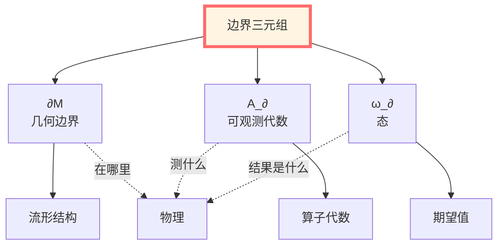
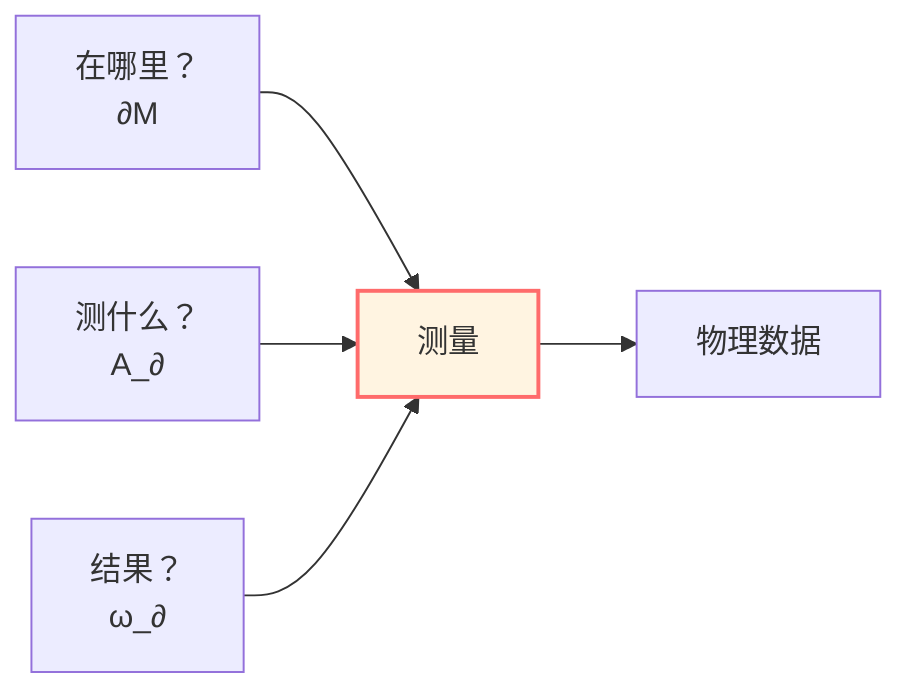
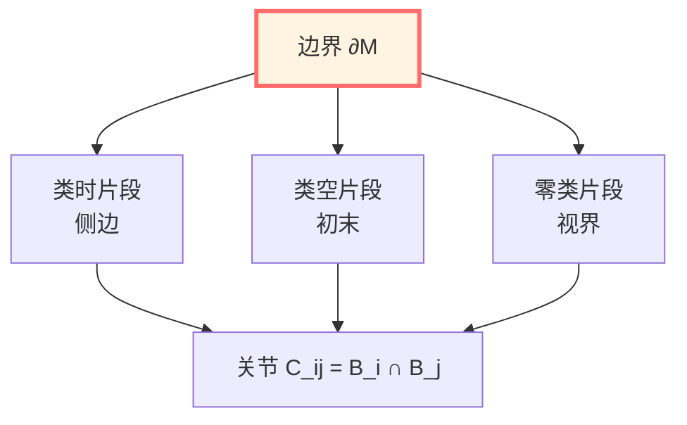
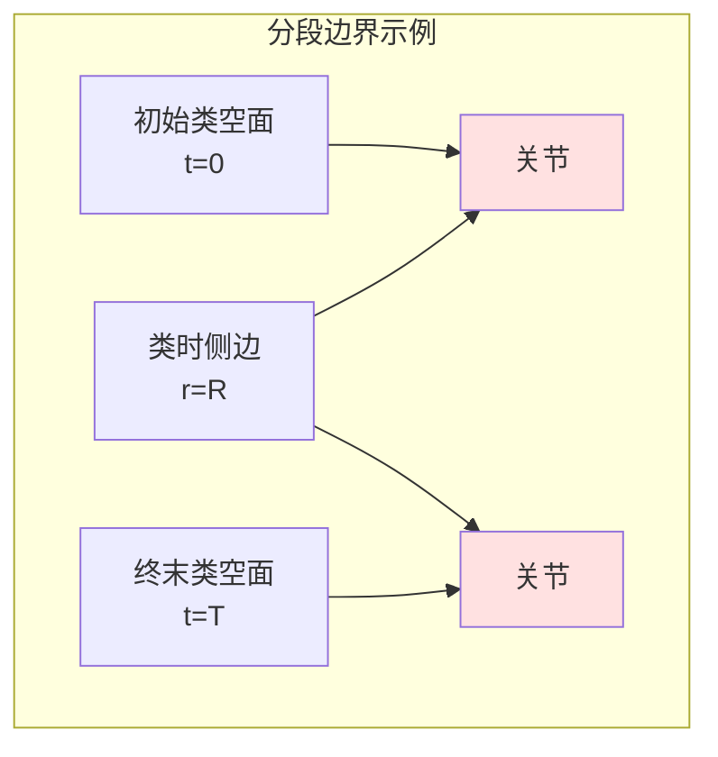
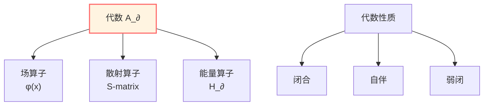
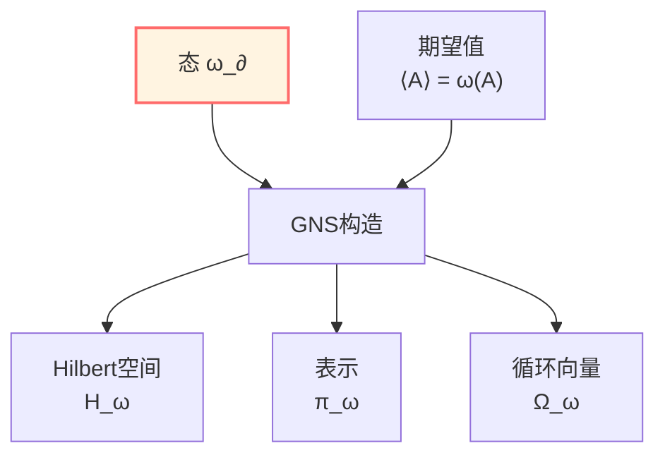
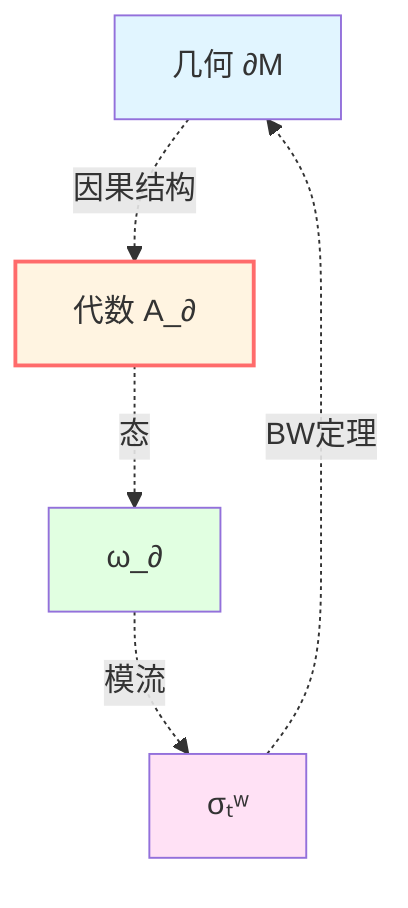
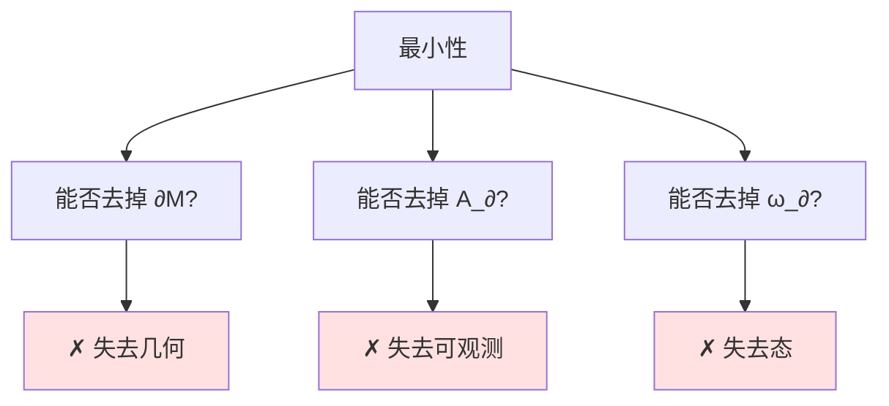
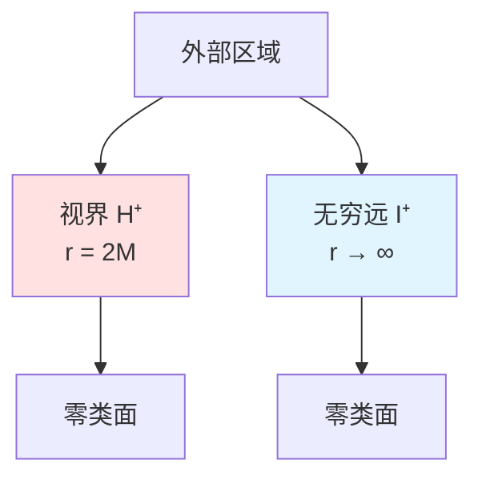

# 边界数据三元组：物理的完整编码

> *"三个数据，编码一切。"*

## 🎯 核心思想

在上一篇我们知道：**物理被视为在边界**。

现在的问题：**边界上需要什么数据？**

**答案**：理论上核心包含三个对象：

$$\boxed{(\partial\mathcal{M}, \mathcal{A}_\partial, \omega_\partial)}$$

## 💡 直观图像：测量的三要素

想象你在做实验：

### 第一要素：在哪里测量？

**几何边界 $\partial\mathcal{M}$**

就像实验室的墙壁：
- 有位置（空间）
- 有形状（几何）
- 可能有多个片段（分段边界）

**例子**：
- 粒子探测器的位置：球面 $r = R$
- 黑洞视界：零类面 $r = 2M$
- 宇宙视界：过去光锥

### 第二要素：测量什么？

**可观测代数 $\mathcal{A}_\partial$**

就像实验仪器：
- 可以测能量 $\hat{E}$
- 可以测动量 $\hat{p}$
- 可以测各种场 $\hat{\phi}(x)$

**关键**：不是任意函数，而是**算子**！

### 第三要素：测量结果是什么？

**态 $\omega_\partial$**

就像实验设置与结果：
- 初态准备（真空？热态？）
- 测量期望值 $\langle A \rangle = \omega(A)$
- 统计涨落 $\langle A^2 \rangle - \langle A \rangle^2$

**三者缺一不可！**
- 没有 $\partial\mathcal{M}$：不知道在哪里
- 没有 $\mathcal{A}_\partial$：不知道测什么
- 没有 $\omega_\partial$：不知道结果

## 📐 第一组分：几何边界 $\partial\mathcal{M}$

### 定义

$\partial\mathcal{M}$ 是三维流形（当 $\mathcal{M}$ 为四维时空），可分解为：

$$\partial\mathcal{M} = \bigcup_i \mathcal{B}_i$$

其中每个 $\mathcal{B}_i$ 可以是：
- **类时片段**（timelike）：$n^2 = +1$
- **类空片段**（spacelike）：$n^2 = -1$
- **零类片段**（null）：$\ell^2 = 0$

### 几何数据

每个片段携带：

#### 非零类片段 $(n^2 = \pm 1)$

- **诱导度规**：
  $$h_{ab} = g_{ab} - \varepsilon n_a n_b, \quad \varepsilon = n^2$$

- **外挠曲率**：
  $$K_{ab} = h_a{}^\mu h_b{}^\nu \nabla_\mu n_\nu$$

- **内禀曲率**：
  $$\widehat{R}_{abcd}[\gamma]$$
  
  （用 $h_{ab}$ 计算的Riemann张量）

#### 零类片段 $(\ell^2 = 0)$

- **横截度规**：
  $$\gamma_{AB} \quad (A,B = 2,3)$$

- **膨胀**：
  $$\theta = \gamma^{AB} W_{AB}, \quad W_{AB} = \gamma_A{}^\mu \gamma_B{}^\nu \nabla_\mu \ell_\nu$$

- **表面引力**：
  $$\kappa = -k_\mu \ell^\nu \nabla_\nu \ell^\mu \quad (\ell \cdot k = -1)$$

### 关节（Corners）

片段交界处 $\mathcal{C}_{ij} = \mathcal{B}_i \cap \mathcal{B}_j$ 是二维面，携带：

- **诱导度规**：$\sigma_{ab}$（继承自 $h_{ab}$）
- **角**（angle）：$\eta$ 或对数量角 $a$

**例子**：

## 🔬 第二组分：可观测代数 $\mathcal{A}_\partial$

### 定义

$\mathcal{A}_\partial$ 是作用在Hilbert空间 $\mathcal{H}$ 上的von Neumann代数，包含：

- 边界场算子：$\hat{\phi}(x), \, x \in \partial\mathcal{M}$
- 散射算子：入射/出射通道
- 准局域能量算子

### 代数结构

**闭合性**：
$$A, B \in \mathcal{A}_\partial \Rightarrow AB, \,  A + B, \,  \alpha A \in \mathcal{A}_\partial$$

**自伴性**：
$$A \in \mathcal{A}_\partial \Rightarrow A^\dagger \in \mathcal{A}_\partial$$

**弱闭性**：
$$A_n \to A \text{ 弱} \Rightarrow A \in \mathcal{A}_\partial$$

### 三种实现

根据物理语境，$\mathcal{A}_\partial$ 有不同实现：

#### 1. 散射端

$$\mathcal{A}_\partial^{\mathrm{scatt}} = \text{span}\{a_{\mathrm{in}}^\dagger(k), a_{\mathrm{out}}^\dagger(k'), \ldots\}$$

- 入射/出射产生湮灭算子
- $S$-矩阵：$S: \mathcal{H}_{\mathrm{in}} \to \mathcal{H}_{\mathrm{out}}$
- 边界时间测度：$\mathrm{d}\mu_\partial^{\mathrm{scatt}} = \frac{1}{2\pi}\operatorname{tr}Q(\omega)\, \mathrm{d}\omega$

#### 2. 区域代数端

$$\mathcal{A}_\partial = \mathcal{A}(\partial O)$$

- 因果区域 $O$ 边界 $\partial O$ 上的局域代数
- 满足因果性：$[\mathcal{A}(O_1), \mathcal{A}(O_2)] = 0$ 当 $O_1, O_2$ 类空分离
- 模流自同构群：$\sigma_t^\omega: \mathcal{A}_\partial \to \mathcal{A}_\partial$

#### 3. 引力端

$$\mathcal{A}_\partial^{\mathrm{grav}} = \{h_{ab}, \pi^{ab}, \ldots\}$$

- 边界度规 $h_{ab}$ 及其共轭动量 $\pi^{ab}$
- Brown-York准局域能量算子
- 边界Killing向量生成的代数

## 🌟 第三组分：态 $\omega_\partial$

### 定义

$\omega_\partial$ 是 $\mathcal{A}_\partial$ 上的态（state），即满足：

1. **正性**：$\omega(A^\dagger A) \geq 0$ 对所有 $A \in \mathcal{A}_\partial$
2. **归一性**：$\omega(\mathbb{I}) = 1$
3. **线性**：$\omega(\alpha A + \beta B) = \alpha \omega(A) + \beta \omega(B)$

**物理意义**：$\omega(A)$ 给出算子 $A$ 的期望值。

### GNS构造

给定 $(\mathcal{A}_\partial, \omega_\partial)$，存在唯一三元组：

$$(\pi_\omega, \mathcal{H}_\omega, \Omega_\omega)$$

其中：
- $\mathcal{H}_\omega$：GNS Hilbert空间
- $\pi_\omega: \mathcal{A}_\partial \to \mathcal{B}(\mathcal{H}_\omega)$：表示
- $\Omega_\omega \in \mathcal{H}_\omega$：循环向量

使得：
$$\omega(A) = \langle \Omega_\omega, \pi_\omega(A) \Omega_\omega \rangle$$

### 三种重要态

#### 1. 真空态 $\omega_0$

**定义**：Poincaré不变态（Minkowski时空）

**性质**：
- 能量最低：$\omega_0(H) = 0$
- Reeh-Schlieder性质：$\Omega_0$ 对区域代数循环
- 模流 = 几何对称：Bisognano-Wichmann定理

#### 2. KMS态 $\omega_\beta$

**定义**：温度 $T = 1/\beta$ 的热平衡态

**KMS条件**：
$$\omega_\beta(AB) = \omega_\beta(B \sigma_{i\beta}^\omega(A))$$

**例子**：
- Hawking辐射：$\beta_H = 8\pi M$（Schwarzschild黑洞）
- Unruh效应：$\beta = 2\pi/a$（加速度 $a$）

#### 3. 相对态 $\omega_\rho$

**定义**：给定密度矩阵 $\rho$ 的态

**相对熵**：
$$S(\omega_\rho \| \omega) = \operatorname{Tr}(\rho \ln \rho) - \operatorname{Tr}(\rho \ln \sigma)$$

其中 $\sigma$ 对应于 $\omega$ 的密度矩阵。

## 🔗 三元组的内在联系

三个组分不是独立的，而是紧密相关：

### 1. 几何决定代数

**因果性**：$\partial\mathcal{M}$ 的因果结构被认为决定代数的局域性

$$O_1 \perp O_2 \quad (\text{类空分离}) \Rightarrow [\mathcal{A}(O_1), \mathcal{A}(O_2)] = 0$$

### 2. 态诱导模流

**Tomita-Takesaki理论**：$(\mathcal{A}_\partial, \omega_\partial)$ 唯一确定模流

$$\sigma_t^\omega(A) = \Delta_\omega^{it} A \Delta_\omega^{-it}$$

其中 $\Delta_\omega$ 是模算子（modular operator）。

### 3. 几何与态的对偶

**Bisognano-Wichmann定理**：真空态 $\omega_0$ 限制到楔区 $W$ 的模流就是沿楔边界的Lorentz boost

$$\sigma_s^{\omega_0}|_{\mathcal{A}(W)} = \operatorname{Ad}(U_{\mathrm{boost}}(2\pi s))$$

## 🌟 边界完备性的数学表述

现在我们可以精确表述边界完备性：

**命题（边界重建）**：

给定边界三元组 $(\partial\mathcal{M}, \mathcal{A}_\partial, \omega_\partial)$ 与适当的正则性条件，理论上存在唯一（在自然等价意义下）体域理论 $(\mathcal{M}, \mathcal{A}, \omega)$ 使得：

1. $\mathcal{A}_\partial \subset \mathcal{A}$ 是边界子代数
2. $\omega|_{\mathcal{A}_\partial} = \omega_\partial$
3. $\partial\mathcal{M}$ 是 $\mathcal{M}$ 的因果边界

**证明思路**（不同语境）：

### 散射理论

- **给定**：$S(\omega)$ 矩阵（边界数据）
- **重建**：Hamiltonian $H$ 与势 $V$（体域）
- **唯一性**：逆散射理论

### AdS/CFT

- **给定**：边界CFT数据 $(T^{ab}, J^\mu, \ldots)$
- **重建**：体域AdS度规 $g_{\mu\nu}$
- **唯一性**：全息重整化群

### Hamilton-Jacobi

- **给定**：边界 $(h_{ab}, \pi^{ab})$（Cauchy数据）
- **重建**：体域 $g_{\mu\nu}$ 满足Einstein方程
- **唯一性**：双曲PDE的唯一性定理

## 📊 三种语境中的三元组

| 组分 | 散射理论 | 量子场论 | 引力理论 |
|------|---------|---------|---------|
| $\partial\mathcal{M}$ | 无穷远 $\mathcal{I}^\pm$ | 区域边界 $\partial O$ | 类时/空边界 $\mathcal{B}$ |
| $\mathcal{A}_\partial$ | 渐近场算子 | 局域代数 $\mathcal{A}(\partial O)$ | $(h_{ab}, \pi^{ab})$ |
| $\omega_\partial$ | 真空或散射态 | Minkowski真空 | 给定Cauchy数据 |

**统一刻度**：

在所有三种语境下，时间刻度密度 $\kappa(\omega)$ 可由边界数据提取：

$$\kappa(\omega) = \frac{\varphi'(\omega)}{\pi} = \rho_{\mathrm{rel}}(\omega) = \frac{1}{2\pi}\operatorname{tr}Q(\omega)$$

（详见统一时间篇）

## 🎯 边界数据的最小性

**问题**：三元组是最小的吗？能否用更少数据？

**回答**：理论上不能。三个组分被认为各有不可替代性。

### 为什么需要 $\partial\mathcal{M}$？

**反例**：没有几何，代数无法定义局域性

- 代数的局域结构编码在 $\partial\mathcal{M}$ 的因果结构中
- 没有几何，无法区分"类空分离"与"类时相关"

### 为什么需要 $\mathcal{A}_\partial$？

**反例**：只有几何，不知道测量什么

- 几何只给"舞台"
- 代数给"演员"（算子）
- 没有算子，态无从定义

### 为什么需要 $\omega_\partial$？

**反例**：只有代数，不知道处于什么状态

- 代数给所有可能的算子
- 态选择一个具体"实现"
- 没有态，期望值无定义

## 🔍 实例：Schwarzschild黑洞的边界三元组

### 几何边界

在区域 $r_+ < r < \infty$（外部区域）：

$$\partial\mathcal{M} = \mathcal{H}^+ \cup \mathcal{I}^+$$

其中：
- $\mathcal{H}^+$：未来视界（零类）
- $\mathcal{I}^+$：未来零无穷（零类）

### 可观测代数

$$\mathcal{A}_\partial = \mathcal{A}(\mathcal{H}^+) \otimes \mathcal{A}(\mathcal{I}^+)$$

- 视界上的出射模式
- 无穷远的散射态

### 态

**Hartle-Hawking态** $\omega_{\mathrm{HH}}$：
- 在过去视界上：Minkowski真空
- 在未来视界上：温度 $T_H = 1/(8\pi M)$ 的热态
- KMS条件成立

**Hawking辐射**：
- 视界发出热辐射
- 无穷远观察者测得黑体谱
- 熵 $S = \mathcal{A}_{\mathcal{H}^+}/(4G) = 4\pi M^2/G$

## 🤔 练习题

### 1. 基础理解

**问题**：为什么边界三元组需要恰好三个组分？

**提示**：分别尝试去掉每一个，看会失去什么物理信息。

### 2. 计算练习

**问题**：对一维散射问题，写出边界三元组 $(\partial\mathcal{M}, \mathcal{A}_\partial, \omega_\partial)$。

**提示**：
- $\partial\mathcal{M} = \{x = -\infty\} \cup \{x = +\infty\}$
- $\mathcal{A}_\partial$ 包含什么算子？
- $\omega_\partial$ 如何定义期望值？

### 3. 概念深化

**问题**：AdS/CFT对应中，边界三元组如何体现？

**提示**：
- $\partial\mathcal{M}$：AdS边界（共形边界）
- $\mathcal{A}_\partial$：边界CFT的算子代数
- $\omega_\partial$：CFT真空或有限温度态

### 4. 哲学思考

**问题**：边界三元组是否蕴含"观察者依赖"的物理？

**提示**：不同边界对应不同观察者（如Rindler vs. Minkowski），但物理规律不变。

## 📝 本篇总结

### 核心定义

**边界三元组**：

$$(\partial\mathcal{M}, \mathcal{A}_\partial, \omega_\partial)$$

- $\partial\mathcal{M}$：几何边界（在哪里）
- $\mathcal{A}_\partial$：可观测代数（测什么）
- $\omega_\partial$：态（结果是什么）

### 完备性定理

边界三元组被认为完全编码物理内容：
- 体域理论上可由边界重建
- 时间演化由边界自同构群确定
- 可观测量的期望值由边界态给出

### 三种实现

| 语境 | 边界 | 代数 | 态 |
|------|------|------|-----|
| 散射 | $\mathcal{I}^\pm$ | 渐近场 | 真空/散射态 |
| QFT | $\partial O$ | 局域代数 | Minkowski真空 |
| 引力 | $\mathcal{B}$ | $(h, \pi)$ | Cauchy数据 |

### 最小性

三个组分缺一不可：
- 去掉几何：失去因果结构
- 去掉代数：失去可观测量
- 去掉态：失去期望值

---

**下一步**：有了边界三元组，我们需要使作用量在边界上良定。这就是GHY边界项的作用！

**导航**：
- 上一篇：[01-为什么边界](01-why-boundary.md)
- 下一篇：[03-GHY边界项](03-ghy-boundary-term.md)
- 概览：[00-边界理论总览](00-boundary-overview.md)
