# Boundary Data Triple: Complete Encoding of Physics

> *"Three data, encoding everything."*

## 🎯 Core Idea

In the previous article, we learned: **Physics is on the boundary**.

Now the question: **What data is needed on the boundary?**

**Answer**: Exactly three objects:

$$\boxed{(\partial\mathcal{M}, \mathcal{A}_\partial, \omega_\partial)}$$

```mermaid
graph TB
    TRIPLE["Boundary Triple"] --> GEO["∂M<br/>Geometric Boundary"]
    TRIPLE --> ALG["A_∂<br/>Observable Algebra"]
    TRIPLE --> STATE["ω_∂<br/>State"]

    GEO --> EX1["Manifold Structure"]
    ALG --> EX2["Operator Algebra"]
    STATE --> EX3["Expectation Values"]

    GEO -.->|"Where"| PHYS["Physics"]
    ALG -.->|"What to Measure"| PHYS
    STATE -.->|"What Result"| PHYS

    style TRIPLE fill:#fff4e1,stroke:#ff6b6b,stroke-width:4px
```

## 💡 Intuitive Image: Three Elements of Measurement

Imagine you're doing an experiment:

### First Element: Where to Measure?

**Geometric Boundary $\partial\mathcal{M}$**

Like the walls of a laboratory:
- Has position (space)
- Has shape (geometry)
- May have multiple pieces (piecewise boundary)

**Examples**:
- Particle detector position: sphere $r = R$
- Black hole horizon: null surface $r = 2M$
- Cosmic horizon: past light cone

### Second Element: What to Measure?

**Observable Algebra $\mathcal{A}_\partial$**

Like experimental instruments:
- Can measure energy $\hat{E}$
- Can measure momentum $\hat{p}$
- Can measure various fields $\hat{\phi}(x)$

**Key**: Not arbitrary functions, but **operators**!

### Third Element: What is the Measurement Result?

**State $\omega_\partial$**

Like experimental setup and results:
- Initial state preparation (vacuum? thermal state?)
- Measurement expectation value $\langle A \rangle = \omega(A)$
- Statistical fluctuations $\langle A^2 \rangle - \langle A \rangle^2$

```mermaid
graph LR
    WHERE["Where?<br/>∂M"] --> MEASURE["Measurement"]
    WHAT["What?<br/>A_∂"] --> MEASURE
    RESULT["Result?<br/>ω_∂"] --> MEASURE

    MEASURE --> DATA["Physical Data"]

    style MEASURE fill:#fff4e1,stroke:#ff6b6b,stroke-width:2px
```

**All three are indispensable!**
- Without $\partial\mathcal{M}$: don't know where
- Without $\mathcal{A}_\partial$: don't know what to measure
- Without $\omega_\partial$: don't know result

## 📐 First Component: Geometric Boundary $\partial\mathcal{M}$

### Definition

$\partial\mathcal{M}$ is a three-dimensional manifold (when $\mathcal{M}$ is four-dimensional spacetime), decomposable as:

$$\partial\mathcal{M} = \bigcup_i \mathcal{B}_i$$

where each $\mathcal{B}_i$ can be:
- **Timelike piece** (timelike): $n^2 = +1$
- **Spacelike piece** (spacelike): $n^2 = -1$
- **Null piece** (null): $\ell^2 = 0$

```mermaid
graph TB
    BOUND["Boundary ∂M"] --> TIME["Timelike Piece<br/>Side"]
    BOUND --> SPACE["Spacelike Piece<br/>Initial/Final"]
    BOUND --> NULL["Null Piece<br/>Horizon"]

    JOINT["Corner C_ij = B_i ∩ B_j"]

    TIME --> JOINT
    SPACE --> JOINT
    NULL --> JOINT

    style BOUND fill:#fff4e1,stroke:#ff6b6b,stroke-width:3px
```

### Geometric Data

Each piece carries:

#### Non-Null Pieces $(n^2 = \pm 1)$

- **Induced Metric**:
  $$h_{ab} = g_{ab} - \varepsilon n_a n_b, \quad \varepsilon = n^2$$

- **Extrinsic Curvature**:
  $$K_{ab} = h_a{}^\mu h_b{}^\nu \nabla_\mu n_\nu$$

- **Intrinsic Curvature**:
  $$\widehat{R}_{abcd}[\gamma]$$
  
  (Riemann tensor computed with $h_{ab}$)

#### Null Pieces $(\ell^2 = 0)$

- **Transverse Metric**:
  $$\gamma_{AB} \quad (A,B = 2,3)$$

- **Expansion**:
  $$\theta = \gamma^{AB} W_{AB}, \quad W_{AB} = \gamma_A{}^\mu \gamma_B{}^\nu \nabla_\mu \ell_\nu$$

- **Surface Gravity**:
  $$\kappa = -k_\mu \ell^\nu \nabla_\nu \ell^\mu \quad (\ell \cdot k = -1)$$

### Corners

Intersection $\mathcal{C}_{ij} = \mathcal{B}_i \cap \mathcal{B}_j$ is a two-dimensional surface, carrying:

- **Induced Metric**: $\sigma_{ab}$ (inherited from $h_{ab}$)
- **Angle**: $\eta$ or logarithmic angle $a$

**Example**:

## 🔬 Second Component: Observable Algebra $\mathcal{A}_\partial$

### Definition

$\mathcal{A}_\partial$ is a von Neumann algebra acting on Hilbert space $\mathcal{H}$, containing:

- Boundary field operators: $\hat{\phi}(x), \, x \in \partial\mathcal{M}$
- Scattering operators: incoming/outgoing channels
- Quasi-local energy operators

### Algebraic Structure

**Closure**:
$$A, B \in \mathcal{A}_\partial \Rightarrow AB, \,  A + B, \,  \alpha A \in \mathcal{A}_\partial$$

**Self-Adjointness**:
$$A \in \mathcal{A}_\partial \Rightarrow A^\dagger \in \mathcal{A}_\partial$$

**Weak Closure**:
$$A_n \to A \text{ weakly} \Rightarrow A \in \mathcal{A}_\partial$$

```mermaid
graph TB
    ALG["Algebra A_∂"] --> FIELD["Field Operators<br/>φ(x)"]
    ALG --> SCATTER["Scattering Operators<br/>S-matrix"]
    ALG --> ENERGY["Energy Operators<br/>H_∂"]

    PROP["Algebraic Properties"] --> CLOSE["Closure"]
    PROP --> SELF["Self-Adjoint"]
    PROP --> WEAK["Weak Closure"]

    style ALG fill:#fff4e1,stroke:#ff6b6b,stroke-width:2px
```

### Three Realizations

Depending on physical context, $\mathcal{A}_\partial$ has different realizations:

#### 1. Scattering End

$$\mathcal{A}_\partial^{\mathrm{scatt}} = \text{span}\{a_{\mathrm{in}}^\dagger(k), a_{\mathrm{out}}^\dagger(k'), \ldots\}$$

- Incoming/outgoing creation-annihilation operators
- $S$-matrix: $S: \mathcal{H}_{\mathrm{in}} \to \mathcal{H}_{\mathrm{out}}$
- Boundary time measure: $\mathrm{d}\mu_\partial^{\mathrm{scatt}} = \frac{1}{2\pi}\operatorname{tr}Q(\omega)\, \mathrm{d}\omega$

#### 2. Regional Algebra End

$$\mathcal{A}_\partial = \mathcal{A}(\partial O)$$

- Local algebra on boundary $\partial O$ of causal region $O$
- Satisfies causality: $[\mathcal{A}(O_1), \mathcal{A}(O_2)] = 0$ when $O_1, O_2$ spacelike separated
- Modular flow automorphism group: $\sigma_t^\omega: \mathcal{A}_\partial \to \mathcal{A}_\partial$

#### 3. Gravitational End

$$\mathcal{A}_\partial^{\mathrm{grav}} = \{h_{ab}, \pi^{ab}, \ldots\}$$

- Boundary metric $h_{ab}$ and its conjugate momentum $\pi^{ab}$
- Brown-York quasi-local energy operators
- Algebra generated by boundary Killing vectors

## 🌟 Third Component: State $\omega_\partial$

### Definition

$\omega_\partial$ is a state on $\mathcal{A}_\partial$, i.e., satisfying:

1. **Positivity**: $\omega(A^\dagger A) \geq 0$ for all $A \in \mathcal{A}_\partial$
2. **Normalization**: $\omega(\mathbb{I}) = 1$
3. **Linearity**: $\omega(\alpha A + \beta B) = \alpha \omega(A) + \beta \omega(B)$

**Physical Meaning**: $\omega(A)$ gives the expectation value of operator $A$.

### GNS Construction

Given $(\mathcal{A}_\partial, \omega_\partial)$, there exists unique triple:

$$(\pi_\omega, \mathcal{H}_\omega, \Omega_\omega)$$

where:
- $\mathcal{H}_\omega$: GNS Hilbert space
- $\pi_\omega: \mathcal{A}_\partial \to \mathcal{B}(\mathcal{H}_\omega)$: representation
- $\Omega_\omega \in \mathcal{H}_\omega$: cyclic vector

such that:
$$\omega(A) = \langle \Omega_\omega, \pi_\omega(A) \Omega_\omega \rangle$$

```mermaid
graph TB
    STATE["State ω_∂"] --> GNS["GNS Construction"]

    GNS --> HIL["Hilbert Space<br/>H_ω"]
    GNS --> REP["Representation<br/>π_ω"]
    GNS --> VEC["Cyclic Vector<br/>Ω_ω"]

    EXPECT["Expectation Value<br/>⟨A⟩ = ω(A)"] --> GNS

    style STATE fill:#fff4e1,stroke:#ff6b6b,stroke-width:2px
```

### Three Important States

#### 1. Vacuum State $\omega_0$

**Definition**: Poincaré-invariant state (Minkowski spacetime)

**Properties**:
- Lowest energy: $\omega_0(H) = 0$
- Reeh-Schlieder property: $\Omega_0$ cyclic for regional algebras
- Modular flow = geometric symmetry: Bisognano-Wichmann theorem

#### 2. KMS State $\omega_\beta$

**Definition**: Thermal equilibrium state at temperature $T = 1/\beta$

**KMS Condition**:
$$\omega_\beta(AB) = \omega_\beta(B \sigma_{i\beta}^\omega(A))$$

**Examples**:
- Hawking radiation: $\beta_H = 8\pi M$ (Schwarzschild black hole)
- Unruh effect: $\beta = 2\pi/a$ (acceleration $a$)

#### 3. Relative State $\omega_\rho$

**Definition**: State given density matrix $\rho$

**Relative Entropy**:
$$S(\omega_\rho \| \omega) = \operatorname{Tr}(\rho \ln \rho) - \operatorname{Tr}(\rho \ln \sigma)$$

where $\sigma$ is the density matrix corresponding to $\omega$.

## 🔗 Intrinsic Connections of the Triple

The three components are not independent, but closely related:

### 1. Geometry Determines Algebra

**Causality**: Causal structure of $\partial\mathcal{M}$ determines locality of algebra

$$O_1 \perp O_2 \quad (\text{spacelike separated}) \Rightarrow [\mathcal{A}(O_1), \mathcal{A}(O_2)] = 0$$

### 2. State Induces Modular Flow

**Tomita-Takesaki Theory**: $(\mathcal{A}_\partial, \omega_\partial)$ uniquely determines modular flow

$$\sigma_t^\omega(A) = \Delta_\omega^{it} A \Delta_\omega^{-it}$$

where $\Delta_\omega$ is the modular operator.

### 3. Duality Between Geometry and State

**Bisognano-Wichmann Theorem**: Modular flow of vacuum state $\omega_0$ restricted to wedge $W$ is Lorentz boost along wedge boundary

$$\sigma_s^{\omega_0}|_{\mathcal{A}(W)} = \operatorname{Ad}(U_{\mathrm{boost}}(2\pi s))$$

```mermaid
graph TB
    GEO["Geometry ∂M"] -.->|"Causal Structure"| ALG["Algebra A_∂"]
    ALG -.->|"State"| STATE["ω_∂"]
    STATE -.->|"Modular Flow"| MOD["σₜʷ"]
    MOD -.->|"BW Theorem"| GEO

    style GEO fill:#e1f5ff
    style ALG fill:#fff4e1,stroke:#ff6b6b,stroke-width:2px
    style STATE fill:#e1ffe1
    style MOD fill:#ffe1f5
```

## 🌟 Mathematical Formulation of Boundary Completeness

Now we can precisely formulate boundary completeness:

**Theorem (Boundary Reconstruction)**:

Given boundary triple $(\partial\mathcal{M}, \mathcal{A}_\partial, \omega_\partial)$ with appropriate regularity conditions, there exists unique (up to natural equivalence) bulk theory $(\mathcal{M}, \mathcal{A}, \omega)$ such that:

1. $\mathcal{A}_\partial \subset \mathcal{A}$ is boundary subalgebra
2. $\omega|_{\mathcal{A}_\partial} = \omega_\partial$
3. $\partial\mathcal{M}$ is causal boundary of $\mathcal{M}$

**Proof Outline** (different contexts):

### Scattering Theory

- **Given**: $S(\omega)$ matrix (boundary data)
- **Reconstruct**: Hamiltonian $H$ and potential $V$ (bulk)
- **Uniqueness**: Inverse scattering theory

### AdS/CFT

- **Given**: Boundary CFT data $(T^{ab}, J^\mu, \ldots)$
- **Reconstruct**: Bulk AdS metric $g_{\mu\nu}$
- **Uniqueness**: Holographic renormalization group

### Hamilton-Jacobi

- **Given**: Boundary $(h_{ab}, \pi^{ab})$ (Cauchy data)
- **Reconstruct**: Bulk $g_{\mu\nu}$ satisfying Einstein equations
- **Uniqueness**: Uniqueness theorem for hyperbolic PDEs

## 📊 Triple in Three Contexts

| Component | Scattering Theory | Quantum Field Theory | Gravitational Theory |
|-----------|------------------|---------------------|---------------------|
| $\partial\mathcal{M}$ | Infinity $\mathcal{I}^\pm$ | Regional boundary $\partial O$ | Timelike/spacelike boundary $\mathcal{B}$ |
| $\mathcal{A}_\partial$ | Asymptotic field operators | Local algebra $\mathcal{A}(\partial O)$ | $(h_{ab}, \pi^{ab})$ |
| $\omega_\partial$ | Vacuum or scattering state | Minkowski vacuum | Given Cauchy data |

**Unified Scale**:

In all three contexts, time scale density $\kappa(\omega)$ can be extracted from boundary data:

$$\kappa(\omega) = \frac{\varphi'(\omega)}{\pi} = \rho_{\mathrm{rel}}(\omega) = \frac{1}{2\pi}\operatorname{tr}Q(\omega)$$

(See Unified Time chapter for details)

## 🎯 Minimality of Boundary Data

**Question**: Is the triple minimal? Can we use less data?

**Answer**: No! Each of the three components is irreplaceable.

### Why Do We Need $\partial\mathcal{M}$?

**Counterexample**: Without geometry, algebra cannot define locality

- Locality structure of algebra encoded in causal structure of $\partial\mathcal{M}$
- Without geometry, cannot distinguish "spacelike separated" from "timelike related"

### Why Do We Need $\mathcal{A}_\partial$?

**Counterexample**: With only geometry, don't know what to measure

- Geometry only gives "stage"
- Algebra gives "actors" (operators)
- Without operators, state cannot be defined

### Why Do We Need $\omega_\partial$?

**Counterexample**: With only algebra, don't know what state we're in

- Algebra gives all possible operators
- State chooses a specific "realization"
- Without state, expectation values undefined

```mermaid
graph TB
    MIN["Minimality"] --> Q1["Can Remove ∂M?"]
    MIN --> Q2["Can Remove A_∂?"]
    MIN --> Q3["Can Remove ω_∂?"]

    Q1 --> NO1["✗ Lose Geometry"]
    Q2 --> NO2["✗ Lose Observables"]
    Q3 --> NO3["✗ Lose State"]

    style NO1 fill:#ffe1e1
    style NO2 fill:#ffe1e1
    style NO3 fill:#ffe1e1
```

## 🔍 Example: Boundary Triple of Schwarzschild Black Hole

### Geometric Boundary

In region $r_+ < r < \infty$ (exterior):

$$\partial\mathcal{M} = \mathcal{H}^+ \cup \mathcal{I}^+$$

where:
- $\mathcal{H}^+$: future horizon (null)
- $\mathcal{I}^+$: future null infinity (null)

```mermaid
graph TB
    EXTERIOR["Exterior Region"] --> HORIZON["Horizon H⁺<br/>r = 2M"]
    EXTERIOR --> INFINITY["Infinity I⁺<br/>r → ∞"]

    HORIZON --> NULL1["Null Surface"]
    INFINITY --> NULL2["Null Surface"]

    style HORIZON fill:#ffe1e1
    style INFINITY fill:#e1f5ff
```

### Observable Algebra

$$\mathcal{A}_\partial = \mathcal{A}(\mathcal{H}^+) \otimes \mathcal{A}(\mathcal{I}^+)$$

- Outgoing modes on horizon
- Scattering states at infinity

### State

**Hartle-Hawking State** $\omega_{\mathrm{HH}}$:
- On past horizon: Minkowski vacuum
- On future horizon: thermal state at temperature $T_H = 1/(8\pi M)$
- KMS condition holds

**Hawking Radiation**:
- Horizon emits thermal radiation
- Observer at infinity measures blackbody spectrum
- Entropy $S = \mathcal{A}_{\mathcal{H}^+}/(4G) = 4\pi M^2/G$

## 🤔 Exercises

### 1. Basic Understanding

**Question**: Why does boundary triple need exactly three components?

**Hint**: Try removing each one separately, see what physical information is lost.

### 2. Calculation Exercise

**Question**: For one-dimensional scattering problem, write boundary triple $(\partial\mathcal{M}, \mathcal{A}_\partial, \omega_\partial)$.

**Hint**:
- $\partial\mathcal{M} = \{x = -\infty\} \cup \{x = +\infty\}$
- What operators does $\mathcal{A}_\partial$ contain?
- How to define expectation values for $\omega_\partial$?

### 3. Conceptual Deepening

**Question**: How is boundary triple embodied in AdS/CFT correspondence?

**Hint**:
- $\partial\mathcal{M}$: AdS boundary (conformal boundary)
- $\mathcal{A}_\partial$: Operator algebra of boundary CFT
- $\omega_\partial$: CFT vacuum or finite temperature state

### 4. Philosophical Reflection

**Question**: Does boundary triple imply "observer-dependent" physics?

**Hint**: Different boundaries correspond to different observers (e.g., Rindler vs. Minkowski), but physical laws unchanged.

## 📝 Chapter Summary

### Core Definition

**Boundary Triple**:

$$(\partial\mathcal{M}, \mathcal{A}_\partial, \omega_\partial)$$

- $\partial\mathcal{M}$: geometric boundary (where)
- $\mathcal{A}_\partial$: observable algebra (what to measure)
- $\omega_\partial$: state (what result)

### Completeness Theorem

Boundary triple completely encodes physical content:
- Bulk can be reconstructed from boundary
- Time evolution determined by boundary automorphism groups
- Expectation values of observables given by boundary state

### Three Realizations

| Context | Boundary | Algebra | State |
|---------|----------|---------|-------|
| Scattering | $\mathcal{I}^\pm$ | Asymptotic fields | Vacuum/scattering state |
| QFT | $\partial O$ | Local algebra | Minkowski vacuum |
| Gravity | $\mathcal{B}$ | $(h, \pi)$ | Cauchy data |

### Minimality

All three components are indispensable:
- Remove geometry: lose causal structure
- Remove algebra: lose observables
- Remove state: lose expectation values

---

**Next Step**: With boundary triple, we need to make action well-defined on boundary. This is the role of GHY boundary term!

**Navigation**:
- Previous: [01-why-boundary_en.md](01-why-boundary_en.md)
- Next: [03-ghy-boundary-term_en.md](03-ghy-boundary-term_en.md)
- Overview: [00-boundary-overview_en.md](00-boundary-overview_en.md)

