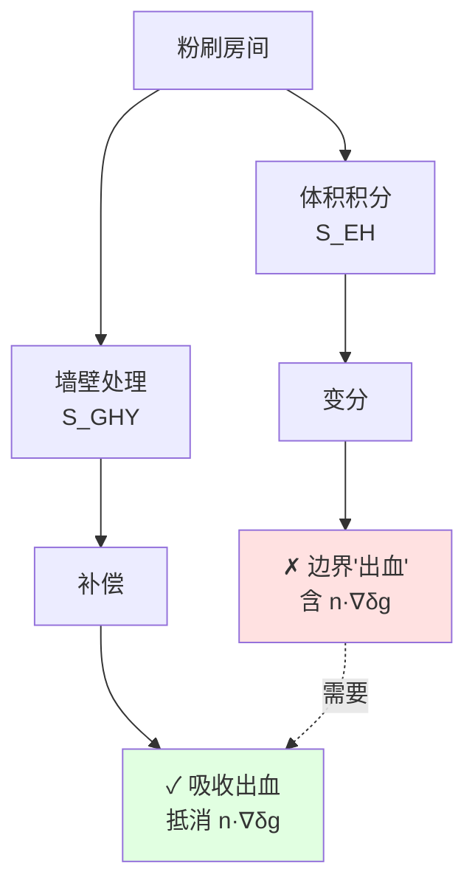
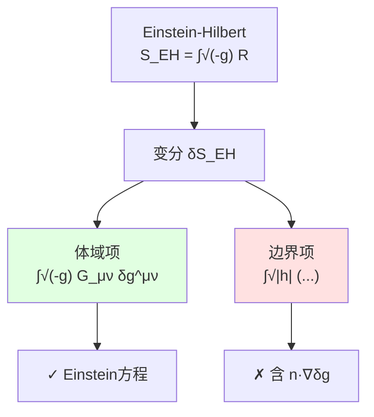
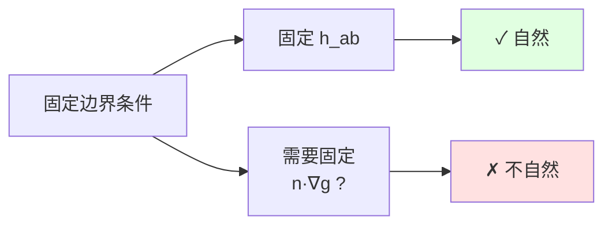
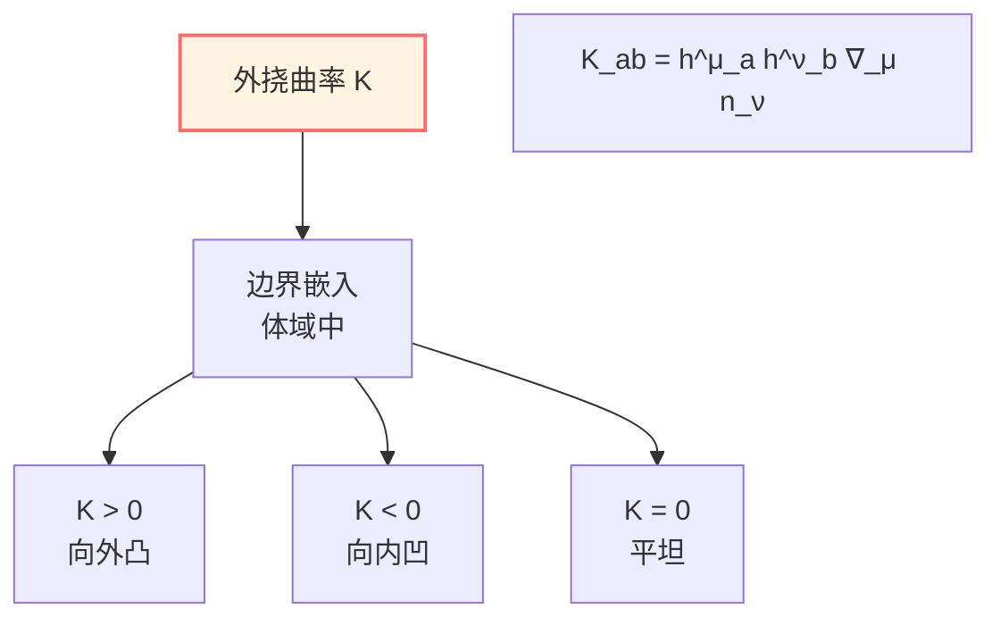
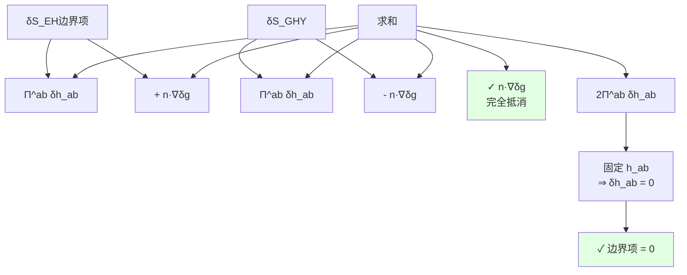
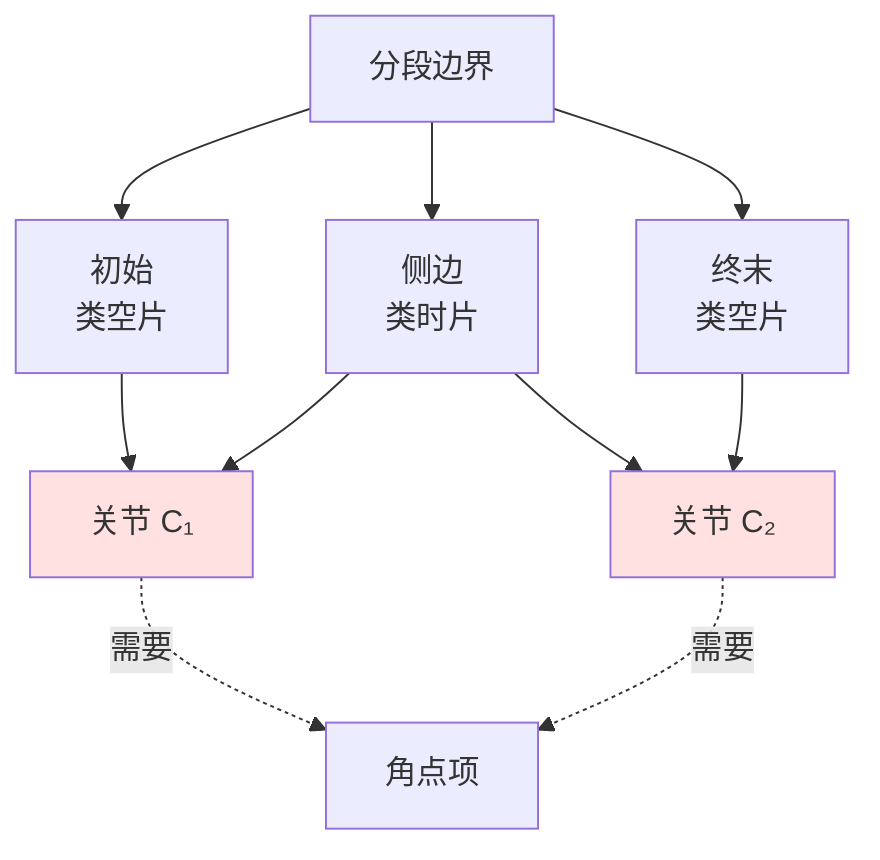
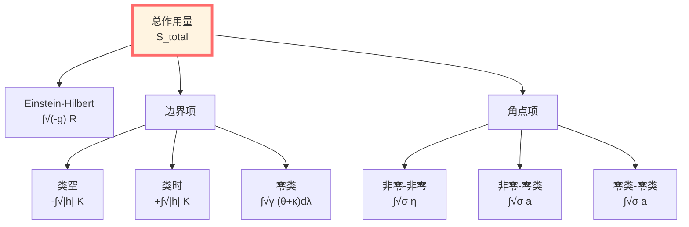

# GHY边界项：使引力作用良定的必要补充

> *"边界项不是修正，而是完备性的要求。"*

## 🎯 核心问题

**问题**：为什么Einstein-Hilbert作用需要边界项？

**简短答案**：因为单独的体作用在固定边界度规下变分不良定！

**本篇目标**：
1. 理解为什么需要GHY边界项
2. 完整推导GHY项的形式
3. 验证边界项的抵消机制
4. 推广到分段边界和零类边界

## 💡 直观图像：积分分部的必然性

### 比喻：房间的粉刷

想象你要粉刷房间：

**只看体积（体作用）**：
- 计算需要多少油漆
- 公式：体积 × 厚度
- 但变分时...墙壁会"出血"！

**加上墙壁（边界项）**：
- 墙壁吸收"出血"
- 边界条件变得自然
- 变分良定

**数学本质**：
- Einstein方程是**二阶**微分方程
- 作用量包含**一阶导数的平方**（$\Gamma \cdot \Gamma \sim (\partial g)^2$）
- 变分时分部积分产生**边界项**
- 不加边界项，边界有"不可控"的导数项

## 📜 Einstein-Hilbert作用的变分

### 原始作用量

$$S_{\mathrm{EH}} = \frac{1}{16\pi G} \int_{\mathcal{M}} \sqrt{-g}\, R\, \mathrm{d}^4x$$

其中：
- $g = \det(g_{\mu\nu})$
- $R = g^{\mu\nu} R_{\mu\nu}$：Ricci标量
- $G$：Newton引力常数

### 变分的三个步骤

#### 步骤1：度规行列式的变分

$$\delta \sqrt{-g} = -\frac{1}{2} \sqrt{-g}\, g_{\mu\nu}\, \delta g^{\mu\nu}$$

**推导**：
$$\delta g = g\, g^{\mu\nu}\, \delta g_{\mu\nu} = -g\, g_{\mu\nu}\, \delta g^{\mu\nu}$$

#### 步骤2：Ricci标量的变分

这是关键！Ricci标量包含Christoffel符号：

$$R = g^{\mu\nu} R_{\mu\nu} = g^{\mu\nu}\left(\partial_\rho \Gamma^\rho_{\mu\nu} - \partial_\nu \Gamma^\rho_{\mu\rho} + \Gamma^\rho_{\rho\sigma}\Gamma^\sigma_{\mu\nu} - \Gamma^\rho_{\nu\sigma}\Gamma^\sigma_{\mu\rho}\right)$$

变分得到：

$$\delta R = R_{\mu\nu}\, \delta g^{\mu\nu} + g^{\mu\nu}\, \delta R_{\mu\nu}$$

**Palatini恒等式**：

$$g^{\mu\nu} \delta R_{\mu\nu} = \nabla_\mu \left(g^{\alpha\beta} \delta\Gamma^\mu_{\alpha\beta} - g^{\mu\alpha} \delta\Gamma^\beta_{\alpha\beta}\right)$$

这是**全散度**！

#### 步骤3：总变分

$$\delta S_{\mathrm{EH}} = \frac{1}{16\pi G} \int_{\mathcal{M}} \sqrt{-g}\left[R_{\mu\nu} - \frac{1}{2}R g_{\mu\nu}\right] \delta g^{\mu\nu}\, \mathrm{d}^4x + \boxed{\text{边界项}}$$

**体域项**给出Einstein张量 $G_{\mu\nu} = R_{\mu\nu} - \frac{1}{2}R g_{\mu\nu}$，这很好！

**问题**：边界项是什么？

### 边界项的显式形式

使用Stokes定理：

$$\int_{\mathcal{M}} \nabla_\mu V^\mu\, \sqrt{-g}\, \mathrm{d}^4x = \int_{\partial\mathcal{M}} V^\mu n_\mu\, \sqrt{|h|}\, \mathrm{d}^3x$$

其中 $n^\mu$ 是单位法向向量，$h$ 是诱导度规的行列式。

边界项变为：

$$\delta S_{\mathrm{EH}}^{\mathrm{boundary}} = \frac{1}{16\pi G} \int_{\partial\mathcal{M}} \sqrt{|h|}\, n^\mu \left(g^{\alpha\beta} \delta\Gamma^\rho_{\alpha\beta} - g^{\rho\alpha} \delta\Gamma^\beta_{\alpha\beta}\right)_{\rho=\mu}\, \mathrm{d}^3x$$

## 🔍 边界项的详细分析

### 投影到切向和法向

将边界项分解为切向和法向：

$$h_\mu{}^\nu = \delta_\mu{}^\nu - \varepsilon n_\mu n^\nu, \quad \varepsilon = n^\mu n_\mu \in \{\pm 1\}$$

- $\varepsilon = -1$：类空边界（初末时间片）
- $\varepsilon = +1$：类时边界（空间边界）

经过繁复的指标操作（见附录A），边界项可写为：

$$\delta S_{\mathrm{EH}}^{\mathrm{boundary}} = \frac{1}{16\pi G} \int_{\partial\mathcal{M}} \sqrt{|h|}\left[\Pi^{ab} \delta h_{ab} + n^\rho h^{\mu\alpha} h^{\nu\beta} \nabla_\rho \delta g_{\alpha\beta}\right] \mathrm{d}^3x$$

其中：
- $\Pi^{ab} = K^{ab} - K h^{ab}$（与外挠曲率相关的"动量"）
- 第二项是**不可控的法向导数项**！

### 不良定性的本质

**问题**：固定诱导度规 $h_{ab}$ 时，$\delta h_{ab} = 0$，但：

$$n^\rho h^{\mu\alpha} h^{\nu\beta} \nabla_\rho \delta g_{\alpha\beta} \neq 0$$

这意味着：
1. **需要固定** $n^\rho \nabla_\rho g_{\alpha\beta}$（法向导数）
2. 这是**非自然的边界条件**
3. Hamilton量**不可微**

## ⭐ GHY边界项：完美的解决方案

### Gibbons-Hawking-York项

**定义**：

$$\boxed{S_{\mathrm{GHY}} = \frac{\varepsilon}{8\pi G} \int_{\partial\mathcal{M}} \sqrt{|h|}\, K\, \mathrm{d}^3x}$$

其中：
- $K = h^{ab} K_{ab}$：外挠曲率的迹
- $K_{ab} = h_a{}^\mu h_b{}^\nu \nabla_\mu n_\nu$：外挠曲率
- $\varepsilon = n^\mu n_\mu$：取向因子

**物理意义**：
- $K$ 测量边界如何"弯曲"在体域中
- $K > 0$：边界向外凸
- $K < 0$：边界向内凹

### GHY项的变分

**关键计算**：

$$\delta(\sqrt{|h|} K) = \sqrt{|h|}\left(\delta K + \frac{1}{2} K h^{ab} \delta h_{ab}\right)$$

其中：

$$\delta K = h^{ab} \delta K_{ab} - K^{ab} \delta h_{ab}$$

而：

$$\delta K_{ab} = h_a{}^\mu h_b{}^\nu \left(\nabla_\mu \delta n_\nu + \delta\Gamma^\rho_{\mu\nu} n_\rho\right)$$

**单位法向规范**：固定嵌入，仅变度规，则：

$$\boxed{\delta n_\mu = \frac{1}{2} \varepsilon n_\mu n^\alpha n^\beta \delta g_{\alpha\beta}}$$

**神奇的事情发生了**：

将这个代入 $\delta K_{ab}$，其中的 $\nabla_\mu \delta n_\nu$ 项恰好产生：

$$-\varepsilon n^\rho h^{\mu\alpha} h^{\nu\beta} \nabla_\rho \delta g_{\alpha\beta}$$

这**正好抵消** $\delta S_{\mathrm{EH}}$ 的不良定项！

## ✨ 抵消机制的完整证明

### 定理（GHY抵消）

对固定诱导度规 $\delta h_{ab} = 0$ 的变分族：

$$\delta(S_{\mathrm{EH}} + S_{\mathrm{GHY}}) = \frac{1}{16\pi G} \int_{\mathcal{M}} \sqrt{-g}\, G_{\mu\nu}\, \delta g^{\mu\nu}\, \mathrm{d}^4x$$

**边界项完全抵消！**

### 证明骨架

**步骤1**：$\delta S_{\mathrm{EH}}$ 的边界项

$$\delta S_{\mathrm{EH}}^{\mathrm{bdy}} = \frac{1}{16\pi G} \int_{\partial\mathcal{M}} \sqrt{|h|}\left[\Pi^{ab} \delta h_{ab} + n^\rho h^{\mu\alpha} h^{\nu\beta} \nabla_\rho \delta g_{\alpha\beta}\right] \mathrm{d}^3x$$

**步骤2**：$\delta S_{\mathrm{GHY}}$ 的计算

$$\delta S_{\mathrm{GHY}} = \frac{\varepsilon}{8\pi G} \int_{\partial\mathcal{M}} \sqrt{|h|}\left(\delta K + \frac{1}{2} K h^{ab} \delta h_{ab}\right) \mathrm{d}^3x$$

$$= \frac{\varepsilon}{8\pi G} \int_{\partial\mathcal{M}} \sqrt{|h|}\left(h^{ab} \delta K_{ab} - K^{ab} \delta h_{ab} + \frac{1}{2} K h^{ab} \delta h_{ab}\right) \mathrm{d}^3x$$

$$= \frac{\varepsilon}{8\pi G} \int_{\partial\mathcal{M}} \sqrt{|h|}\left[\Pi^{ab} \delta h_{ab} + h^{ab} \nabla_a \delta n_b\right] \mathrm{d}^3x$$

**步骤3**：代入 $\delta n_\mu$

$$h^{ab} \nabla_a \delta n_b = \frac{\varepsilon}{2} h^{ab} \nabla_a (n_b n^\alpha n^\beta \delta g_{\alpha\beta})$$

利用投影关系和Christoffel符号的变分，这一项给出：

$$-\frac{\varepsilon}{2} n^\rho h^{\mu\alpha} h^{\nu\beta} \nabla_\rho \delta g_{\alpha\beta}$$

**步骤4**：求和

$$\delta S_{\mathrm{EH}}^{\mathrm{bdy}} + \delta S_{\mathrm{GHY}} = \frac{1}{16\pi G} \int_{\partial\mathcal{M}} \sqrt{|h|}\, 2\Pi^{ab} \delta h_{ab}\, \mathrm{d}^3x$$

当 $\delta h_{ab} = 0$ 时，边界项为零！

## 🔢 具体例子：球面边界

### 设置

考虑Schwarzschild时空截断在 $r = R$：

$$\mathrm{d}s^2 = -f(r)\, \mathrm{d}t^2 + f(r)^{-1}\, \mathrm{d}r^2 + r^2\, \mathrm{d}\Omega_2^2$$

其中 $f(r) = 1 - 2M/r$。

边界 $\mathcal{B}$ 在 $r = R$ 的类时超曲面。

### 法向向量

外向单位法向：

$$n^\mu = \left(0, \sqrt{f(R)}, 0, 0\right)$$

$$n_\mu = \left(0, \frac{1}{\sqrt{f(R)}}, 0, 0\right)$$

$$\varepsilon = n^\mu n_\mu = +1$$

（类时）

### 诱导度规

$$h_{ab}\, \mathrm{d}x^a \mathrm{d}x^b = -f(R)\, \mathrm{d}t^2 + R^2\, \mathrm{d}\Omega_2^2$$

$$\sqrt{|h|} = R^2 \sqrt{f(R)} \sin\theta$$

### 外挠曲率

计算 $K_{ab} = h_a{}^\mu h_b{}^\nu \nabla_\mu n_\nu$：

**时间-时间分量**：
$$K_{tt} = -f(R) \nabla_r n_t = 0$$

（由对称性）

**角度分量**：
$$K_{\theta\theta} = R^2 \nabla_r n_\theta = R \sqrt{f(R)}$$

$$K_{\phi\phi} = R^2 \sin^2\theta \nabla_r n_\phi = R \sqrt{f(R)} \sin^2\theta$$

**迹**：
$$K = h^{ab} K_{ab} = \frac{2\sqrt{f(R)}}{R} + \frac{f'(R)}{2\sqrt{f(R)}}$$

其中我们用了：
$$\nabla_r n_r = \frac{1}{2} \partial_r \ln f(R) = \frac{f'(R)}{2f(R)}$$

### GHY项

$$S_{\mathrm{GHY}} = \frac{1}{8\pi G} \int_{\mathcal{B}} \sqrt{|h|}\, K\, \mathrm{d}^3x$$

$$= \frac{1}{8\pi G} \int \mathrm{d}t\, \mathrm{d}\Omega_2\, R^2 \sqrt{f(R)}\left[\frac{2\sqrt{f(R)}}{R} + \frac{f'(R)}{2\sqrt{f(R)}}\right]$$

$$= \frac{1}{8\pi G} \cdot 4\pi R^2 \cdot T \left[2f(R) + \frac{R f'(R)}{2}\right]$$

对于大 $R$（$f \to 1$）：
$$K \to \frac{2}{R} + O(M/R^2)$$

**物理意义**：
- $2/R$ 项：球面的固有曲率
- $M/R^2$ 项：引力场的修正

## 🧩 分段边界：角点项的必要性

### 问题：边界有"角"

当边界分段时，如初末类空片 + 类时侧边：

$$\partial\mathcal{M} = \mathcal{B}_{\text{initial}} \cup \mathcal{B}_{\text{side}} \cup \mathcal{B}_{\text{final}}$$

在交界处（角点/关节）$\mathcal{C}$，GHY项**不够**！

### 角点项的形式

对非零类边界的关节 $\mathcal{C}_{ij}$：

$$S_{\mathrm{corner}} = \frac{1}{8\pi G} \int_{\mathcal{C}} \sqrt{\sigma}\, \eta\, \mathrm{d}^2x$$

其中 $\eta$ 是**角**（angle）：

- **两类空片**：$\eta = \operatorname{arccosh}(-n_1 \cdot n_2)$
- **两类时片**：$\eta = \arccos(n_1 \cdot n_2)$
- **混合**：$\eta = \operatorname{arcsinh}(n_T \cdot n_S)$

**物理意义**：
- $\eta$ 测量两个边界片段的"夹角"
- 角点项补偿GHY项在关节处的跳跃

### 可加性定理

**定理**：加入角点项后，作用量满足可加性：

$$S[\mathcal{M}_1 \cup_\Sigma \mathcal{M}_2] = S[\mathcal{M}_1] + S[\mathcal{M}_2]$$

其中 $\Sigma$ 是公共边界。

**证明思路**：
- 两个区域在 $\Sigma$ 处粘合
- GHY项在 $\Sigma$ 两侧符号相反，但不完全抵消（因为法向相反）
- 角点项恰好弥补这个差额

## 🌌 零类边界：$(\theta + \kappa)$ 结构

### 零类边界的特殊性

当边界是零类面（如视界）时，$n^2 = 0$，上述公式失效！

**新的度规结构**：

零类边界由零生成矢量 $\ell^\mu$ 生成（$\ell \cdot \ell = 0$），配合辅助向量 $k^\mu$（满足 $\ell \cdot k = -1$）。

横截二维度规：
$$\gamma_{AB}\, \mathrm{d}x^A \mathrm{d}x^B$$

### 零类边界项

**Lehner-Myers-Poisson-Sorkin公式**：

$$\boxed{S_{\mathcal{N}} = \frac{1}{8\pi G} \int_{\mathcal{N}} \sqrt{\gamma}\, (\theta + \kappa)\, \mathrm{d}\lambda\, \mathrm{d}^2x}$$

其中：
- $\theta = \gamma^{AB} W_{AB}$：膨胀（expansion）
- $W_{AB} = \gamma_A{}^\mu \gamma_B{}^\nu \nabla_\mu \ell_\nu$：形算子
- $\kappa = -k_\mu \ell^\nu \nabla_\nu \ell^\mu$：表面引力
- $\lambda$：沿 $\ell$ 的仿射参数

**物理意义**：
- $\theta$：零测地线束的膨胀率
- $\kappa$：视界的"加速度"

### 重标度不变性

**关键性质**：在常数重标度 $\ell \to e^\alpha \ell$、$k \to e^{-\alpha} k$ 下：

$$\theta \to e^\alpha \theta, \quad \kappa \to e^\alpha \kappa$$

$$\int \sqrt{\gamma}\, (\theta + \kappa)\, \mathrm{d}\lambda \to \int \sqrt{\gamma}\, e^\alpha(\theta + \kappa)\, e^{-\alpha}\mathrm{d}\lambda' = \text{不变}$$

这保证了物理的**规范不变性**！

## 📊 三类边界的统一

| 边界类型 | 法向 | 边界项权重 | 角点项 |
|---------|------|-----------|--------|
| 类空 | $n^2 = -1$ | $-\int \sqrt{\|h\|}\, K$ | $\int \sqrt{\sigma}\, \eta$ |
| 类时 | $n^2 = +1$ | $+\int \sqrt{\|h\|}\, K$ | $\int \sqrt{\sigma}\, \eta$ |
| 零类 | $\ell^2 = 0$ | $\int \sqrt{\gamma}\, (\theta + \kappa)\, \mathrm{d}\lambda$ | $\int \sqrt{\sigma}\, a$ |

统一公式：

$$S_{\mathrm{total}} = S_{\mathrm{EH}} + \sum_i S_{\mathrm{boundary}}^{(i)} + \sum_{ij} S_{\mathrm{corner}}^{(ij)}$$

## 🎓 本篇总结

### 核心结论

**GHY边界项是必要的**：

$$S_{\mathrm{GHY}} = \frac{\varepsilon}{8\pi G} \int_{\partial\mathcal{M}} \sqrt{|h|}\, K\, \mathrm{d}^3x$$

使得：
$$\delta(S_{\mathrm{EH}} + S_{\mathrm{GHY}}) = \frac{1}{16\pi G} \int_{\mathcal{M}} \sqrt{-g}\, G_{\mu\nu}\, \delta g^{\mu\nu}$$

边界项完全抵消！

### 三个层次的边界

1. **非零类边界**：GHY项 $\propto K$
2. **角点**：角项 $\propto \eta$ 或 $a$
3. **零类边界**：$(\theta + \kappa)$ 项

### 物理意义

- **变分良定性**：固定自然边界数据（$h_{ab}$）即可
- **Hamilton量可微**：正则形式良好定义
- **可加性**：作用量满足区域可加性

### 与统一时间的联系

GHY边界项中的外挠曲率 $K$ 直接关联到边界时间：
- Brown-York准局域能量：$T^{ab}_{\mathrm{BY}} \propto (K^{ab} - K h^{ab})$
- 边界时间生成元：来自 $K$ 的变分
- 模哈密顿量在边界的局域化

---

**下一步**：有了GHY边界项，我们可以定义Brown-York准局域能量，这是边界时间生成元的具体实现！

**导航**：
- 上一篇：[02-边界数据三元组](02-boundary-data-triple.md)
- 下一篇：[04-Brown-York准局域能量](04-brown-york-energy.md)
- 概览：[00-边界理论总览](00-boundary-overview.md)
