# GHY Boundary Term: Theoretical Proposal for Differentiability of Gravitational Action
$$\boxed{\text{Differentiability of Gravitational Action} \leftarrow \text{Determined by Boundary Term}}$$
> *"Boundary terms are viewed as requirements of completeness, not merely corrections."*

## 🎯 Core Problem

**Question**: Why does Einstein-Hilbert action need a boundary term?

**Short Answer**: Because the bulk action alone is typically ill-defined for variations fixing boundary metric!

**Goals of This Article**:
1. Understand why GHY boundary term is needed
2. Complete derivation of GHY term form
3. Verify cancellation mechanism of boundary terms
4. Generalize to piecewise boundaries and null boundaries

## 💡 Intuitive Image: Necessity of Integration by Parts

### Analogy: Painting a Room

Imagine you want to paint a room:

**Only Volume (Bulk Action)**:
- Calculate how much paint needed
- Formula: volume × thickness
- But when varying... walls "bleed"!

**Add Walls (Boundary Term)**:
- Walls absorb "bleeding"
- Boundary conditions become natural
- Variation well-defined

```mermaid
graph TB
    PAINT["Painting Room"] --> VOL["Volume Integral<br/>S_EH"]
    PAINT --> WALL["Wall Treatment<br/>S_GHY"]

    VOL --> VAR1["Variation"]
    VAR1 --> BLEED["✗ Boundary 'Bleeding'<br/>Contains n·∇δg"]

    WALL --> VAR2["Compensation"]
    VAR2 --> ABSORB["✓ Absorb Bleeding<br/>Cancel n·∇δg"]

    BLEED -.->|"Needs"| ABSORB

    style BLEED fill:#ffe1e1
    style ABSORB fill:#e1ffe1
```

**Mathematical Essence**:
- Einstein equations are **second-order** differential equations
- Action contains **square of first derivatives** ($\Gamma \cdot \Gamma \sim (\partial g)^2$)
- Variation with integration by parts produces **boundary terms**
- Without boundary term, boundary has "uncontrollable" derivative terms

## 📜 Variation of Einstein-Hilbert Action

### Original Action

$$S_{\mathrm{EH}} = \frac{1}{16\pi G} \int_{\mathcal{M}} \sqrt{-g}\, R\, \mathrm{d}^4x$$

where:
- $g = \det(g_{\mu\nu})$
- $R = g^{\mu\nu} R_{\mu\nu}$: Ricci scalar
- $G$: Newton's gravitational constant

### Three Steps of Variation

#### Step 1: Variation of Metric Determinant

$$\delta \sqrt{-g} = -\frac{1}{2} \sqrt{-g}\, g_{\mu\nu}\, \delta g^{\mu\nu}$$

**Derivation**:
$$\delta g = g\, g^{\mu\nu}\, \delta g_{\mu\nu} = -g\, g_{\mu\nu}\, \delta g^{\mu\nu}$$

#### Step 2: Variation of Ricci Scalar

This is key! Ricci scalar contains Christoffel symbols:

$$R = g^{\mu\nu} R_{\mu\nu} = g^{\mu\nu}\left(\partial_\rho \Gamma^\rho_{\mu\nu} - \partial_\nu \Gamma^\rho_{\mu\rho} + \Gamma^\rho_{\rho\sigma}\Gamma^\sigma_{\mu\nu} - \Gamma^\rho_{\nu\sigma}\Gamma^\sigma_{\mu\rho}\right)$$

Variation gives:

$$\delta R = R_{\mu\nu}\, \delta g^{\mu\nu} + g^{\mu\nu}\, \delta R_{\mu\nu}$$

**Palatini Identity**:

$$g^{\mu\nu} \delta R_{\mu\nu} = \nabla_\mu \left(g^{\alpha\beta} \delta\Gamma^\mu_{\alpha\beta} - g^{\mu\alpha} \delta\Gamma^\beta_{\alpha\beta}\right)$$

This is a **total divergence**!

#### Step 3: Total Variation

$$\delta S_{\mathrm{EH}} = \frac{1}{16\pi G} \int_{\mathcal{M}} \sqrt{-g}\left[R_{\mu\nu} - \frac{1}{2}R g_{\mu\nu}\right] \delta g^{\mu\nu}\, \mathrm{d}^4x + \boxed{\text{Boundary Term}}$$

**Bulk Term** gives Einstein tensor $G_{\mu\nu} = R_{\mu\nu} - \frac{1}{2}R g_{\mu\nu}$, which is good!

**Problem**: What is the boundary term?

### Explicit Form of Boundary Term

Using Stokes' theorem:

$$\int_{\mathcal{M}} \nabla_\mu V^\mu\, \sqrt{-g}\, \mathrm{d}^4x = \int_{\partial\mathcal{M}} V^\mu n_\mu\, \sqrt{|h|}\, \mathrm{d}^3x$$

where $n^\mu$ is unit normal vector, $h$ is determinant of induced metric.

Boundary term becomes:

$$\delta S_{\mathrm{EH}}^{\mathrm{boundary}} = \frac{1}{16\pi G} \int_{\partial\mathcal{M}} \sqrt{|h|}\, n^\mu \left(g^{\alpha\beta} \delta\Gamma^\rho_{\alpha\beta} - g^{\rho\alpha} \delta\Gamma^\beta_{\alpha\beta}\right)_{\rho=\mu}\, \mathrm{d}^3x$$

```mermaid
graph TB
    EH["Einstein-Hilbert<br/>S_EH = ∫√(-g) R"] --> VAR["Variation δS_EH"]

    VAR --> BULK["Bulk Term<br/>∫√(-g) G_μν δg^μν"]
    VAR --> BOUND["Boundary Term<br/>∫√|h| (...)"]

    BULK --> GOOD["✓ Einstein Equations"]
    BOUND --> BAD["✗ Contains n·∇δg"]

    style BULK fill:#e1ffe1
    style BOUND fill:#ffe1e1
```

## 🔍 Detailed Analysis of Boundary Term

### Projection onto Tangential and Normal

Decompose boundary term into tangential and normal:

$$h_\mu{}^\nu = \delta_\mu{}^\nu - \varepsilon n_\mu n^\nu, \quad \varepsilon = n^\mu n_\mu \in \{\pm 1\}$$

- $\varepsilon = -1$: spacelike boundary (initial/final time slices)
- $\varepsilon = +1$: timelike boundary (spatial boundary)

After tedious index manipulation (see Appendix A), boundary term can be written as:

$$\delta S_{\mathrm{EH}}^{\mathrm{boundary}} = \frac{1}{16\pi G} \int_{\partial\mathcal{M}} \sqrt{|h|}\left[\Pi^{ab} \delta h_{ab} + n^\rho h^{\mu\alpha} h^{\nu\beta} \nabla_\rho \delta g_{\alpha\beta}\right] \mathrm{d}^3x$$

where:
- $\Pi^{ab} = K^{ab} - K h^{ab}$ ("momentum" related to extrinsic curvature)
- Second term is **uncontrollable normal derivative term**!

### Essence of Ill-Definedness

**Problem**: When fixing induced metric $h_{ab}$, $\delta h_{ab} = 0$, but:

$$n^\rho h^{\mu\alpha} h^{\nu\beta} \nabla_\rho \delta g_{\alpha\beta} \neq 0$$

This means:
1. **Need to fix** $n^\rho \nabla_\rho g_{\alpha\beta}$ (normal derivative)
2. This is **unnatural boundary condition**
3. Hamiltonian **not differentiable**

```mermaid
graph LR
    FIX["Fix Boundary Condition"] --> H["Fix h_ab"]
    FIX --> DERIV["Need to Fix<br/>n·∇g ?"]

    H --> NAT["✓ Natural"]
    DERIV --> UNNAT["✗ Unnatural"]

    style NAT fill:#e1ffe1
    style UNNAT fill:#ffe1e1
```

## ⭐ GHY Boundary Term: Perfect Solution

### Gibbons-Hawking-York Term

**Definition**:

$$\boxed{S_{\mathrm{GHY}} = \frac{\varepsilon}{8\pi G} \int_{\partial\mathcal{M}} \sqrt{|h|}\, K\, \mathrm{d}^3x}$$

where:
- $K = h^{ab} K_{ab}$: trace of extrinsic curvature
- $K_{ab} = h_a{}^\mu h_b{}^\nu \nabla_\mu n_\nu$: extrinsic curvature
- $\varepsilon = n^\mu n_\mu$: orientation factor

**Physical Meaning**:
- $K$ measures how boundary "curves" in bulk
- $K > 0$: boundary convex outward
- $K < 0$: boundary concave inward

### Variation of GHY Term

**Key Calculation**:

$$\delta(\sqrt{|h|} K) = \sqrt{|h|}\left(\delta K + \frac{1}{2} K h^{ab} \delta h_{ab}\right)$$

where:

$$\delta K = h^{ab} \delta K_{ab} - K^{ab} \delta h_{ab}$$

and:

$$\delta K_{ab} = h_a{}^\mu h_b{}^\nu \left(\nabla_\mu \delta n_\nu + \delta\Gamma^\rho_{\mu\nu} n_\rho\right)$$

**Unit Normal Gauge**: Fix embedding, vary only metric, then:

$$\boxed{\delta n_\mu = \frac{1}{2} \varepsilon n_\mu n^\alpha n^\beta \delta g_{\alpha\beta}}$$

**Something magical happens**:

Substituting this into $\delta K_{ab}$, the $\nabla_\mu \delta n_\nu$ term exactly produces:

$$-\varepsilon n^\rho h^{\mu\alpha} h^{\nu\beta} \nabla_\rho \delta g_{\alpha\beta}$$

This **exactly cancels** the ill-defined term in $\delta S_{\mathrm{EH}}$!

## ✨ Complete Proof of Cancellation Mechanism

### Proposition (GHY Cancellation Mechanism)

For variation families fixing induced metric $\delta h_{ab} = 0$:

$$\delta(S_{\mathrm{EH}} + S_{\mathrm{GHY}}) = \frac{1}{16\pi G} \int_{\mathcal{M}} \sqrt{-g}\, G_{\mu\nu}\, \delta g^{\mu\nu}\, \mathrm{d}^4x$$

**Boundary terms completely cancel!**

### Proof Skeleton

**Step 1**: Boundary term of $\delta S_{\mathrm{EH}}$

$$\delta S_{\mathrm{EH}}^{\mathrm{bdy}} = \frac{1}{16\pi G} \int_{\partial\mathcal{M}} \sqrt{|h|}\left[\Pi^{ab} \delta h_{ab} + n^\rho h^{\mu\alpha} h^{\nu\beta} \nabla_\rho \delta g_{\alpha\beta}\right] \mathrm{d}^3x$$

**Step 2**: Calculation of $\delta S_{\mathrm{GHY}}$

$$\delta S_{\mathrm{GHY}} = \frac{\varepsilon}{8\pi G} \int_{\partial\mathcal{M}} \sqrt{|h|}\left(\delta K + \frac{1}{2} K h^{ab} \delta h_{ab}\right) \mathrm{d}^3x$$

$$= \frac{\varepsilon}{8\pi G} \int_{\partial\mathcal{M}} \sqrt{|h|}\left(h^{ab} \delta K_{ab} - K^{ab} \delta h_{ab} + \frac{1}{2} K h^{ab} \delta h_{ab}\right) \mathrm{d}^3x$$

$$= \frac{\varepsilon}{8\pi G} \int_{\partial\mathcal{M}} \sqrt{|h|}\left[\Pi^{ab} \delta h_{ab} + h^{ab} \nabla_a \delta n_b\right] \mathrm{d}^3x$$

**Step 3**: Substitute $\delta n_\mu$

$$h^{ab} \nabla_a \delta n_b = \frac{\varepsilon}{2} h^{ab} \nabla_a (n_b n^\alpha n^\beta \delta g_{\alpha\beta})$$

Using projection relations and variation of Christoffel symbols, this term gives:

$$-\frac{\varepsilon}{2} n^\rho h^{\mu\alpha} h^{\nu\beta} \nabla_\rho \delta g_{\alpha\beta}$$

**Step 4**: Sum

$$\delta S_{\mathrm{EH}}^{\mathrm{bdy}} + \delta S_{\mathrm{GHY}} = \frac{1}{16\pi G} \int_{\partial\mathcal{M}} \sqrt{|h|}\, 2\Pi^{ab} \delta h_{ab}\, \mathrm{d}^3x$$

When $\delta h_{ab} = 0$, boundary term is zero!

```mermaid
graph TB
    EH_BDY["δS_EH Boundary Term"] --> TERM1["Π^ab δh_ab"]
    EH_BDY --> TERM2["+ n·∇δg"]

    GHY["δS_GHY"] --> COMP1["Π^ab δh_ab"]
    GHY --> COMP2["- n·∇δg"]

    SUM["Sum"] --> TERM1
    SUM --> TERM2
    SUM --> COMP1
    SUM --> COMP2

    SUM --> CANCEL1["✓ n·∇δg<br/>Completely Canceled"]
    SUM --> REMAIN["2Π^ab δh_ab"]

    REMAIN --> FIXED["Fix h_ab<br/>⇒ δh_ab = 0"]
    FIXED --> ZERO["✓ Boundary Term = 0"]

    style CANCEL1 fill:#e1ffe1
    style ZERO fill:#e1ffe1
```

## 🔢 Concrete Example: Spherical Boundary

### Setup

Consider Schwarzschild spacetime truncated at $r = R$:

$$\mathrm{d}s^2 = -f(r)\, \mathrm{d}t^2 + f(r)^{-1}\, \mathrm{d}r^2 + r^2\, \mathrm{d}\Omega_2^2$$

where $f(r) = 1 - 2M/r$.

Boundary $\mathcal{B}$ is timelike hypersurface at $r = R$.

### Normal Vector

Outward unit normal:

$$n^\mu = \left(0, \sqrt{f(R)}, 0, 0\right)$$

$$n_\mu = \left(0, \frac{1}{\sqrt{f(R)}}, 0, 0\right)$$

$$\varepsilon = n^\mu n_\mu = +1$$

(timelike)

### Induced Metric

$$h_{ab}\, \mathrm{d}x^a \mathrm{d}x^b = -f(R)\, \mathrm{d}t^2 + R^2\, \mathrm{d}\Omega_2^2$$

$$\sqrt{|h|} = R^2 \sqrt{f(R)} \sin\theta$$

### Extrinsic Curvature

Calculate $K_{ab} = h_a{}^\mu h_b{}^\nu \nabla_\mu n_\nu$:

**Time-Time Component**:
$$K_{tt} = -f(R) \nabla_r n_t = 0$$

(by symmetry)

**Angular Components**:
$$K_{\theta\theta} = R^2 \nabla_r n_\theta = R \sqrt{f(R)}$$

$$K_{\phi\phi} = R^2 \sin^2\theta \nabla_r n_\phi = R \sqrt{f(R)} \sin^2\theta$$

**Trace**:
$$K = h^{ab} K_{ab} = \frac{2\sqrt{f(R)}}{R} + \frac{f'(R)}{2\sqrt{f(R)}}$$

where we used:
$$\nabla_r n_r = \frac{1}{2} \partial_r \ln f(R) = \frac{f'(R)}{2f(R)}$$

### GHY Term

$$S_{\mathrm{GHY}} = \frac{1}{8\pi G} \int_{\mathcal{B}} \sqrt{|h|}\, K\, \mathrm{d}^3x$$

$$= \frac{1}{8\pi G} \int \mathrm{d}t\, \mathrm{d}\Omega_2\, R^2 \sqrt{f(R)}\left[\frac{2\sqrt{f(R)}}{R} + \frac{f'(R)}{2\sqrt{f(R)}}\right]$$

$$= \frac{1}{8\pi G} \cdot 4\pi R^2 \cdot T \left[2f(R) + \frac{R f'(R)}{2}\right]$$

For large $R$ ($f \to 1$):
$$K \to \frac{2}{R} + O(M/R^2)$$

**Physical Meaning**:
- $2/R$ term: intrinsic curvature of sphere
- $M/R^2$ term: correction from gravitational field

## 🧩 Piecewise Boundaries: Necessity of Corner Terms

### Problem: Boundaries Have "Corners"

When boundary is piecewise, e.g., initial/final spacelike slices + timelike sides:

$$\partial\mathcal{M} = \mathcal{B}_{\text{initial}} \cup \mathcal{B}_{\text{side}} \cup \mathcal{B}_{\text{final}}$$

At intersections (corners/joints) $\mathcal{C}$, GHY term is **insufficient**!

```mermaid
graph TB
    BOUND["Piecewise Boundary"] --> INIT["Initial<br/>Spacelike Piece"]
    BOUND --> SIDE["Side<br/>Timelike Piece"]
    BOUND --> FINAL["Final<br/>Spacelike Piece"]

    INIT --> CORNER1["Corner C₁"]
    SIDE --> CORNER1
    SIDE --> CORNER2["Corner C₂"]
    FINAL --> CORNER2

    CORNER1 -.->|"Need"| TERM["Corner Term"]
    CORNER2 -.->|"Need"| TERM

    style CORNER1 fill:#ffe1e1
    style CORNER2 fill:#ffe1e1
```

### Form of Corner Term

For joints $\mathcal{C}_{ij}$ of non-null boundaries:

$$S_{\mathrm{corner}} = \frac{1}{8\pi G} \int_{\mathcal{C}} \sqrt{\sigma}\, \eta\, \mathrm{d}^2x$$

where $\eta$ is the **angle**:

- **Two Spacelike Pieces**: $\eta = \operatorname{arccosh}(-n_1 \cdot n_2)$
- **Two Timelike Pieces**: $\eta = \arccos(n_1 \cdot n_2)$
- **Mixed**: $\eta = \operatorname{arcsinh}(n_T \cdot n_S)$

**Physical Meaning**:
- $\eta$ measures "angle" between two boundary pieces
- Corner term compensates jump of GHY term at joints

### Additivity Theorem

**Proposition**: After adding corner terms, action satisfies additivity:

$$S[\mathcal{M}_1 \cup_\Sigma \mathcal{M}_2] = S[\mathcal{M}_1] + S[\mathcal{M}_2]$$

where $\Sigma$ is common boundary.

**Proof Outline**:
- Two regions glued at $\Sigma$
- GHY terms on both sides of $\Sigma$ have opposite signs, but don't completely cancel (because normals opposite)
- Corner term exactly compensates this difference

## 🌌 Null Boundaries: $(\theta + \kappa)$ Structure

### Special Nature of Null Boundaries

When boundary is null surface (e.g., horizon), $n^2 = 0$, above formulas fail!

**New Metric Structure**:

Null boundary generated by null generating vector $\ell^\mu$ ($\ell \cdot \ell = 0$), with auxiliary vector $k^\mu$ (satisfying $\ell \cdot k = -1$).

Transverse 2D metric:
$$\gamma_{AB}\, \mathrm{d}x^A \mathrm{d}x^B$$

### Null Boundary Term

**Lehner-Myers-Poisson-Sorkin Formula**:

$$\boxed{S_{\mathcal{N}} = \frac{1}{8\pi G} \int_{\mathcal{N}} \sqrt{\gamma}\, (\theta + \kappa)\, \mathrm{d}\lambda\, \mathrm{d}^2x}$$

where:
- $\theta = \gamma^{AB} W_{AB}$: expansion
- $W_{AB} = \gamma_A{}^\mu \gamma_B{}^\nu \nabla_\mu \ell_\nu$: shape operator
- $\kappa = -k_\mu \ell^\nu \nabla_\nu \ell^\mu$: surface gravity
- $\lambda$: affine parameter along $\ell$

**Physical Meaning**:
- $\theta$: expansion rate of null geodesic bundle
- $\kappa$: "acceleration" of horizon

### Rescaling Invariance

**Key Property**: Under constant rescaling $\ell \to e^\alpha \ell$, $k \to e^{-\alpha} k$:

$$\theta \to e^\alpha \theta, \quad \kappa \to e^\alpha \kappa$$

$$\int \sqrt{\gamma}\, (\theta + \kappa)\, \mathrm{d}\lambda \to \int \sqrt{\gamma}\, e^\alpha(\theta + \kappa)\, e^{-\alpha}\mathrm{d}\lambda' = \text{invariant}$$

This ensures physical **gauge invariance**!

## 📊 Unification of Three Boundary Types

| Boundary Type | Normal | Boundary Term Weight | Corner Term |
|--------------|--------|---------------------|-------------|
| Spacelike | $n^2 = -1$ | $-\int \sqrt{\|h\|}\, K$ | $\int \sqrt{\sigma}\, \eta$ |
| Timelike | $n^2 = +1$ | $+\int \sqrt{\|h\|}\, K$ | $\int \sqrt{\sigma}\, \eta$ |
| Null | $\ell^2 = 0$ | $\int \sqrt{\gamma}\, (\theta + \kappa)\, \mathrm{d}\lambda$ | $\int \sqrt{\sigma}\, a$ |

Unified formula:

$$S_{\mathrm{total}} = S_{\mathrm{EH}} + \sum_i S_{\mathrm{boundary}}^{(i)} + \sum_{ij} S_{\mathrm{corner}}^{(ij)}$$

```mermaid
graph TB
    ACTION["Total Action<br/>S_total"] --> EH["Einstein-Hilbert<br/>∫√(-g) R"]
    ACTION --> BDY["Boundary Terms"]
    ACTION --> CORNER["Corner Terms"]

    BDY --> SPACE["Spacelike<br/>-∫√|h| K"]
    BDY --> TIME["Timelike<br/>+∫√|h| K"]
    BDY --> NULL["Null<br/>∫√γ (θ+κ)dλ"]

    CORNER --> NN["Non-Null-Non-Null<br/>∫√σ η"]
    CORNER --> NL["Non-Null-Null<br/>∫√σ a"]
    CORNER --> LL["Null-Null<br/>∫√σ a"]

    style ACTION fill:#fff4e1,stroke:#ff6b6b,stroke-width:4px
```

## 🎓 Chapter Summary

### Core Conclusion

**GHY Boundary Term is Considered Necessary**:

$$S_{\mathrm{GHY}} = \frac{\varepsilon}{8\pi G} \int_{\partial\mathcal{M}} \sqrt{|h|}\, K\, \mathrm{d}^3x$$

So that:
$$\delta(S_{\mathrm{EH}} + S_{\mathrm{GHY}}) = \frac{1}{16\pi G} \int_{\mathcal{M}} \sqrt{-g}\, G_{\mu\nu}\, \delta g^{\mu\nu}$$

Boundary terms completely cancel!

### Three Levels of Boundaries

1. **Non-Null Boundaries**: GHY term $\propto K$
2. **Corners**: Angle term $\propto \eta$ or $a$
3. **Null Boundaries**: $(\theta + \kappa)$ term

### Physical Meaning

- **Variational Well-Definedness**: Fix natural boundary data ($h_{ab}$) suffices
- **Hamiltonian Differentiable**: Canonical form well-defined
- **Additivity**: Action satisfies regional additivity

### Connection to Unified Time

Extrinsic curvature $K$ in GHY boundary term directly relates to boundary time:
- Brown-York quasi-local energy: $T^{ab}_{\mathrm{BY}} \propto (K^{ab} - K h^{ab})$
- Boundary time generator: from variation of $K$
- Localization of modular Hamiltonian on boundary

---

**Next Step**: With GHY boundary term, we can define Brown-York quasi-local energy, the concrete realization of boundary time generator!

**Navigation**:
- Previous: [02-boundary-data-triple_en.md](02-boundary-data-triple_en.md)
- Next: [04-brown-york-energy_en.md](04-brown-york-energy_en.md)
- Overview: [00-boundary-overview_en.md](00-boundary-overview_en.md)

