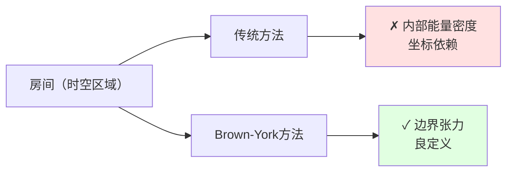
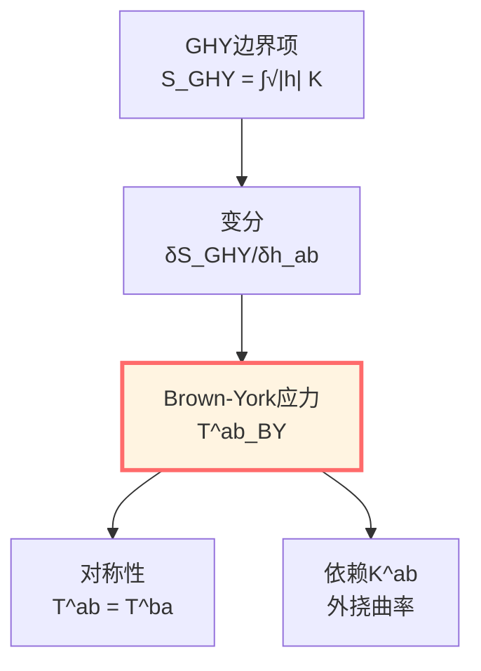
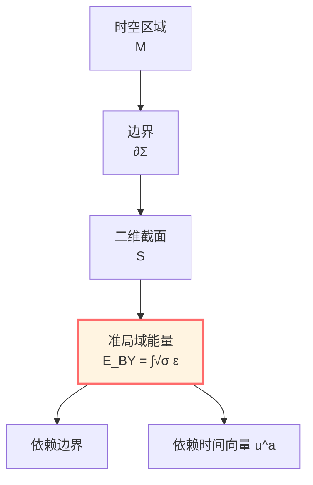
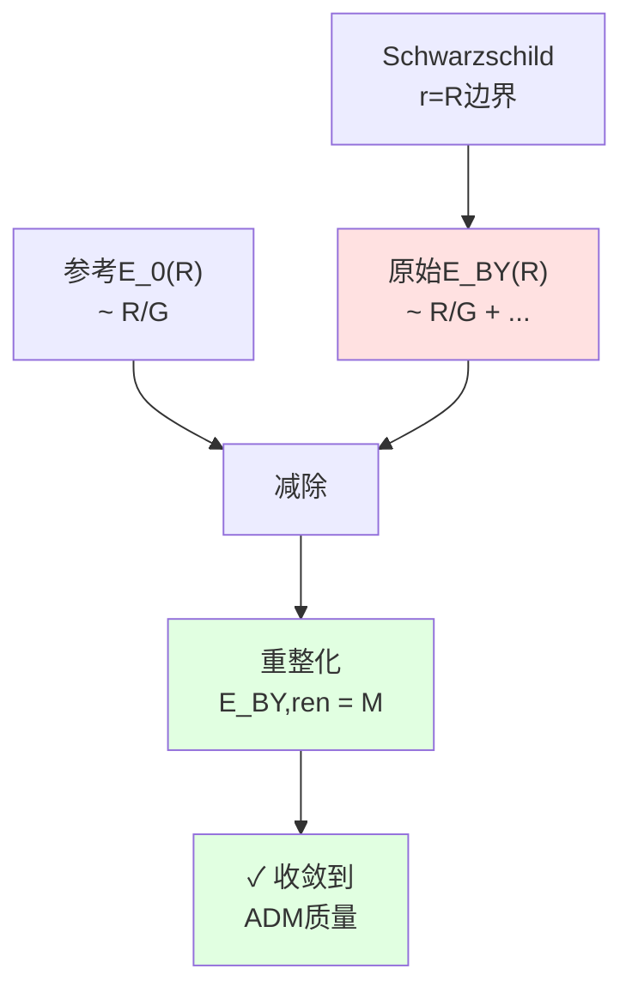
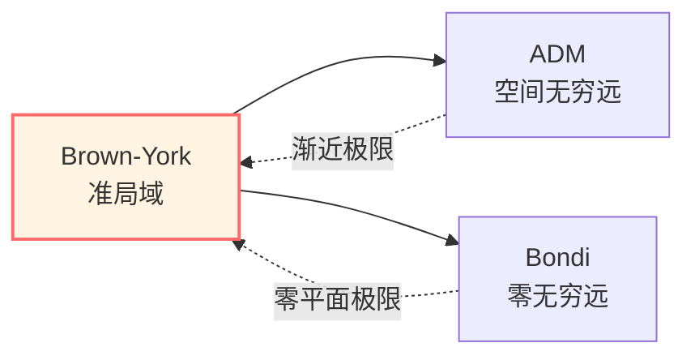
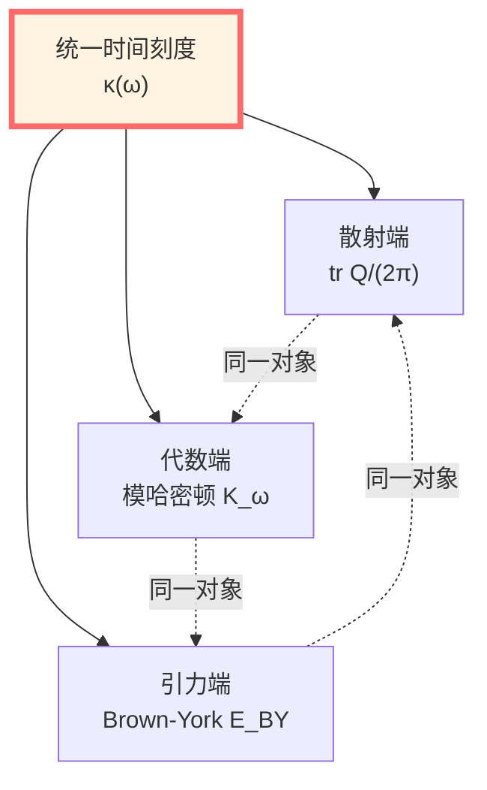
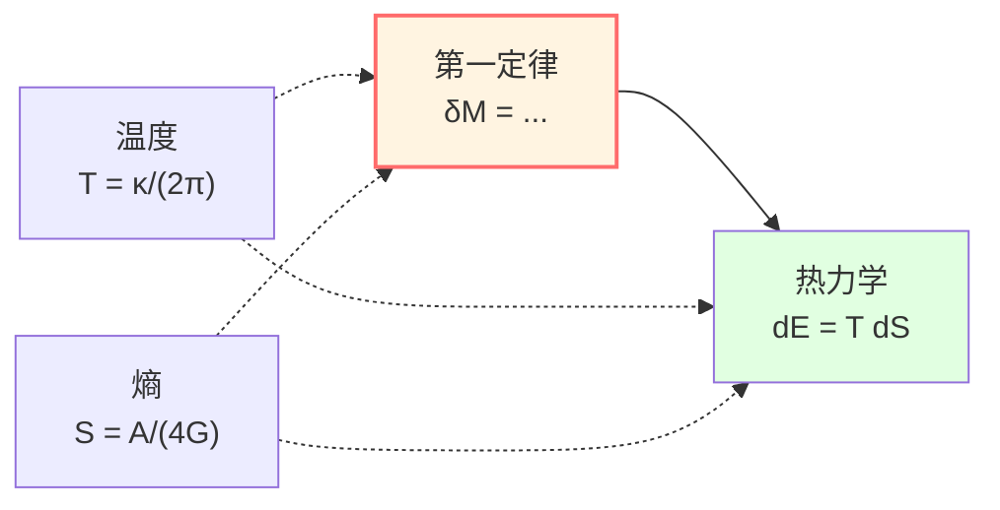

# Brown-York准局域能量：边界时间的生成元

> *"在弯曲时空，能量不在点，而在边界。"*

## 🎯 核心问题

**问题1**：在弯曲时空中如何定义"能量"？

**传统困难**：
- 没有全局时间平移对称（Killing矢量）
- 能量密度 $T_{00}$ 坐标依赖
- 无法积分得到"总能量"

**Brown-York解决方案**：在边界上定义准局域能量！

**问题2**：这个"准局域能量"与什么相关？

**答案**：它正是边界时间演化的生成元！

## 💡 直观图像：区域的"重量"

### 比喻：称一个房间的重量

**传统方法（失败）**：
- 在房间内每个点放一个秤
- 但秤的读数依赖于"如何放置"
- 无法简单相加

**Brown-York方法（成功）**：
- 只称房间的墙壁！
- 墙壁的"张力"告诉你房间的总能量
- 这是自然的、良定的

**关键洞察**：
- 能量不是"体积内的东西"
- 而是"边界的性质"
- 边界告诉你内部有多少能量

## 📜 从GHY到Brown-York

### GHY边界项的回顾

上一篇我们得到：

$$S_{\mathrm{total}} = S_{\mathrm{EH}} + S_{\mathrm{GHY}}$$

$$S_{\mathrm{GHY}} = \frac{\varepsilon}{8\pi G} \int_{\partial\mathcal{M}} \sqrt{|h|}\, K\, \mathrm{d}^3x$$

变分给出：

$$\delta S_{\mathrm{total}} = \frac{1}{16\pi G} \int_{\mathcal{M}} \sqrt{-g}\, G_{\mu\nu}\, \delta g^{\mu\nu} + \int_{\partial\mathcal{M}} \sqrt{|h|}\, \Pi^{ab}\, \delta h_{ab}$$

其中：

$$\boxed{\Pi^{ab} = \frac{1}{8\pi G}(K^{ab} - K h^{ab})}$$

这就是**正则动量**！

### Hamilton形式

在$(3+1)$分解中，类空超曲面$\Sigma$的诱导度规为$h_{ij}$，其共轭动量正是：

$$\pi^{ij} = \frac{\partial \mathcal{L}}{\partial \dot{h}_{ij}} = \frac{\sqrt{|h|}}{16\pi G}(K^{ij} - K h^{ij})$$

**正则对**：$(h_{ij}, \pi^{ij})$

**Hamilton量**：

$$H[\xi] = \int_\Sigma \left[N \mathcal{H} + N^i \mathcal{H}_i\right] \mathrm{d}^3x + \oint_{\partial\Sigma} \left(\text{边界项}\right) \mathrm{d}^2x$$

其中 $\mathcal{H}, \mathcal{H}_i$ 是约束（在壳上为零）。

边界项正是Brown-York能量的来源！

## ⭐ Brown-York表面应力张量

### 定义

**Brown-York表面应力张量**：

$$\boxed{T^{ab}_{\mathrm{BY}} = \frac{2}{\sqrt{|h|}}\frac{\delta S_{\mathrm{GHY}}}{\delta h_{ab}} = \frac{1}{8\pi G}(K^{ab} - K h^{ab})}$$

**物理意义**：
- $T^{ab}_{\mathrm{BY}}$ 是边界上的"应力"
- 对称张量：$T^{ab}_{\mathrm{BY}} = T^{ba}_{\mathrm{BY}}$
- 依赖于外挠曲率 $K^{ab}$

### 分量分解

在边界 $\partial\Sigma$ 上，选择：
- 时间样单位向量：$u^a$（沿边界时间方向）
- 空间样法向量：$n^a$（垂直于 $\partial\Sigma$ 在 $\Sigma$ 中）

二维诱导度规：
$$\sigma_{ab} = h_{ab} + u_a u_b$$

**能量密度**：
$$\varepsilon := u_a u_b T^{ab}_{\mathrm{BY}}$$

**动量密度**：
$$j_a := -\sigma_a{}^b u_c T^{bc}_{\mathrm{BY}}$$

**应力张量**：
$$\tau_{ab} := \sigma_a{}^c \sigma_b{}^d T^{cd}_{\mathrm{BY}}$$

## 🌟 Brown-York准局域能量

### 定义

对边界 $\partial\Sigma$ 的二维截面 $\mathcal{S}$：

$$\boxed{E_{\mathrm{BY}} = \int_{\mathcal{S}} \sqrt{\sigma}\, \varepsilon\, \mathrm{d}^2x = \int_{\mathcal{S}} \sqrt{\sigma}\, u_a u_b T^{ab}_{\mathrm{BY}}\, \mathrm{d}^2x}$$

**展开**：

$$E_{\mathrm{BY}} = \frac{1}{8\pi G} \int_{\mathcal{S}} \sqrt{\sigma}\, u_a u_b \left(K^{ab} - K h^{ab}\right)\, \mathrm{d}^2x$$

**物理意义**：
- $E_{\mathrm{BY}}$：区域在边界观察者看来的能量
- 依赖于边界的选择（准局域性）
- 依赖于时间方向的选择（$u^a$）

### 参考减除

**问题**：直接计算的 $E_{\mathrm{BY}}$ 通常发散（大$R$时）！

**解决**：减去参考背景的贡献

$$\boxed{E_{\mathrm{BY,ren}} = E_{\mathrm{BY}} - E_{\mathrm{ref}}}$$

通常选择：
- **渐近平坦**：参考为Minkowski空间
- **渐近AdS**：参考为纯AdS空间

**重整化能量**：

$$E_{\mathrm{BY,ren}} = \frac{1}{8\pi G} \int_{\mathcal{S}} \sqrt{\sigma}\, u_a u_b \left[(K^{ab} - K h^{ab}) - (K_0^{ab} - K_0 h_{ab})\right]\, \mathrm{d}^2x$$

其中 $K_0^{ab}$ 是参考背景的外挠曲率。

## 🔢 实例：Schwarzschild时空

### 设置

Schwarzschild度规：

$$\mathrm{d}s^2 = -f(r)\, \mathrm{d}t^2 + f(r)^{-1}\, \mathrm{d}r^2 + r^2 \mathrm{d}\Omega_2^2$$

其中 $f(r) = 1 - 2M/r$。

取边界为 $r = R$ 的球面，时间向量：

$$u^a = \frac{1}{\sqrt{f(R)}} (\partial_t)^a$$

### 外挠曲率

从上一篇，我们知道：

$$K = \frac{2\sqrt{f(R)}}{R} + \frac{f'(R)}{2\sqrt{f(R)}}$$

对于球对称，$K^{ab}$ 对角，关键分量：

$$K_{tt} = 0, \quad K_{\theta\theta} = R^2 \sqrt{f(R)}, \quad K_{\phi\phi} = R^2 \sin^2\theta \sqrt{f(R)}$$

### Brown-York应力

$$T^{ab}_{\mathrm{BY}} = \frac{1}{8\pi G}\left(K^{ab} - K h^{ab}\right)$$

能量密度：

$$\varepsilon = u_a u_b T^{ab}_{\mathrm{BY}} = \frac{1}{8\pi G} f(R)^{-1} \left(K_{tt} - K h_{tt}\right)$$

$$= \frac{1}{8\pi G} f(R)^{-1} \left(0 + K f(R)\right) = \frac{K}{8\pi G}$$

### 准局域能量

$$E_{\mathrm{BY}} = \int_{\mathcal{S}} \sqrt{\sigma}\, \varepsilon\, \mathrm{d}^2x = \frac{1}{8\pi G} \int_0^{2\pi}\!\mathrm{d}\phi \int_0^\pi\!\mathrm{d}\theta\, R^2 \sin\theta \cdot K$$

$$= \frac{1}{8\pi G} \cdot 4\pi R^2 \cdot K = \frac{R^2 K}{2G}$$

代入 $K$：

$$E_{\mathrm{BY}}(R) = \frac{R^2}{2G}\left[\frac{2\sqrt{f(R)}}{R} + \frac{f'(R)}{2\sqrt{f(R)}}\right]$$

$$= \frac{R}{G}\sqrt{f(R)} + \frac{R^2 f'(R)}{4G\sqrt{f(R)}}$$

对于 $f = 1 - 2M/r$：

$$f'(r) = \frac{2M}{r^2}$$

$$E_{\mathrm{BY}}(R) = \frac{R}{G}\sqrt{1-\frac{2M}{R}} + \frac{R^2}{4G\sqrt{1-2M/R}} \cdot \frac{2M}{R^2}$$

$$= \frac{R}{G}\sqrt{1-\frac{2M}{R}} + \frac{M}{2G\sqrt{1-2M/R}}$$

### 渐近行为

当 $R \to \infty$：

$$\sqrt{1-\frac{2M}{R}} = 1 - \frac{M}{R} + O(R^{-2})$$

$$E_{\mathrm{BY}}(R) = \frac{R}{G}\left(1 - \frac{M}{R}\right) + \frac{M}{2G}\left(1 + \frac{M}{R}\right) + O(R^{-1})$$

$$= \frac{R}{G} - M + \frac{M}{2G} + O(R^{-1}) = \frac{R}{G} - \frac{M}{2G} + O(R^{-1})$$

**发散！** 需要减除参考。

### 参考减除

Minkowski空间：$f_0 = 1$，$K_0 = 2/R$

$$E_0 = \frac{R^2}{2G} \cdot \frac{2}{R} = \frac{R}{G}$$

**重整化能量**：

$$\boxed{E_{\mathrm{BY,ren}}(R) = E_{\mathrm{BY}}(R) - E_0(R) = M}$$

**完美！** 收敛到ADM质量 $M$！

## 📊 三种质量的比较

| 质量概念 | 定义位置 | 适用条件 | 公式 |
|---------|---------|---------|------|
| **ADM质量** | 空间无穷远 | 渐近平坦 | $M_{\mathrm{ADM}} = \lim_{R\to\infty} \frac{1}{16\pi G}\oint (h^{ij,j} - h^{jj,i})$ |
| **Bondi质量** | 零无穷远 | 渐近平坦 | $M_{\mathrm{B}}(u) = \frac{1}{16\pi G}\oint_{S^2_u} (\cdots)$ |
| **Brown-York** | 任意边界 | 一般 | $E_{\mathrm{BY}} = \frac{1}{8\pi G}\int u_a u_b (K^{ab} - K h^{ab})$ |

**关系**：

在渐近平坦时空，适当重整化后：

$$\lim_{R\to\infty} E_{\mathrm{BY,ren}}(R) = M_{\mathrm{ADM}}$$

## 🔗 与边界时间生成元的联系

### Hamilton量的边界部分

在正则形式中，Hamilton量为：

$$H_\xi = \int_\Sigma (N \mathcal{H} + N^i \mathcal{H}_i)\, \mathrm{d}^3x + H_{\partial\Sigma}[\xi]$$

其中边界部分：

$$H_{\partial\Sigma}[\xi] = \int_{\partial\Sigma} \sqrt{\sigma}\, \xi^a j_a\, \mathrm{d}^2x$$

$j_a$ 是Brown-York应力的分量！

**当 $\xi = \partial_t$（时间平移Killing向量）**：

$$H_{\partial\Sigma}[\partial_t] = E_{\mathrm{BY}}$$

**物理意义**：
$$\boxed{\text{Brown-York能量} = \text{边界时间平移的生成元}}$$

### 与统一时间刻度的联系

回忆统一时间篇的时间刻度同一式：

$$\kappa(\omega) = \frac{\varphi'(\omega)}{\pi} = \rho_{\mathrm{rel}}(\omega) = \frac{1}{2\pi}\operatorname{tr}Q(\omega)$$

现在我们看到：**这个统一刻度在引力端由Brown-York能量实现！**

**边界三位一体**：

## 🌌 推广：非渐近平坦情况

### AdS时空

对渐近AdS时空，需要：

1. **反项（counterterms）**：

$$S_{\mathrm{ct}} = \frac{1}{8\pi G} \int_{\partial\mathcal{M}} \sqrt{|h|}\left(\frac{2}{L} + \frac{L}{2}\widehat{\mathcal{R}}\right)\, \mathrm{d}^3x$$

其中 $L$ 是AdS曲率半径，$\widehat{\mathcal{R}}$ 是边界内禀Ricci标量。

2. **重整化应力张量**：

$$T^{ab}_{\mathrm{BY,ren}} = T^{ab}_{\mathrm{BY}} + T^{ab}_{\mathrm{ct}} - T^{ab}_{\mathrm{ref}}$$

$$T^{ab}_{\mathrm{ct}} = \frac{2}{\sqrt{|h|}}\frac{\delta S_{\mathrm{ct}}}{\delta h_{ab}}$$

### de Sitter宇宙

对de Sitter时空，视界是零类面，需要使用零类Brown-York能量：

$$T^A{}_B\big|_{\mathcal{N}} = -\frac{1}{8\pi G}\left(W^A{}_B - \theta \delta^A{}_B\right)$$

其中 $W^A{}_B$ 是形算子，$\theta$ 是膨胀。

## 🎓 守恒律与第一定律

### 能量守恒

在时间独立（存在Killing向量 $\xi^a = (\partial_t)^a$）的情况下：

$$\frac{\mathrm{d} E_{\mathrm{BY}}}{\mathrm{d}t} = 0$$

**证明思路**：
- Hamilton演化：$\frac{\mathrm{d}h_{ab}}{\mathrm{d}t} = \{\ldots, H\}$
- 在壳上（Einstein方程满足时）：体域约束 $\mathcal{H} = \mathcal{H}_i = 0$
- 边界项不变（因为 $\xi$ 是Killing向量）

### 黑洞第一定律

对静态黑洞，定义：
- $M$：ADM质量（$= E_{\mathrm{BY,ren}}$ 在无穷远）
- $J$：角动量
- $\mathcal{A}_{\mathcal{H}}$：视界面积
- $\kappa_{\mathcal{H}}$：表面引力

**第一定律**：

$$\delta M = \frac{\kappa_{\mathcal{H}}}{8\pi G} \delta \mathcal{A}_{\mathcal{H}} + \Omega_{\mathcal{H}} \delta J$$

其中 $\Omega_{\mathcal{H}}$ 是视界角速度。

**热力学类比**：

$$\mathrm{d}E = T\, \mathrm{d}S + \text{功}$$

识别：
- $T = \kappa_{\mathcal{H}}/(2\pi)$：Hawking温度
- $S = \mathcal{A}_{\mathcal{H}}/(4G)$：Bekenstein-Hawking熵

## 💎 物理意义的深层理解

### 为什么叫"准局域"？

**局域（local）**：
- 定义在时空某一点
- 例子：能量密度 $T_{00}(x)$

**全局（global）**：
- 需要整个时空
- 例子：ADM质量（空间无穷远）

**准局域（quasilocal）**：
- 定义在有限边界
- 可以"移动"边界得到不同值
- Brown-York能量正是此类

### 为什么依赖边界？

**答案**：因为能量本质上是边界的性质！

**深层原因**：
1. **广义协变性**：没有优先坐标系，无法定义"同一时刻"
2. **等效原理**：局部总可以消去引力场，能量密度坐标依赖
3. **边界观察**：实验总在某个边界进行，准局域能量是自然的可观测量

### 为什么收敛到ADM质量？

**物理图像**：
- 边界越大，越远离引力源
- 远处时空趋于平坦
- 外挠曲率 $K \to K_0 + M/R^2$（只差来自质量）
- 积分后收敛到总质量

## 🤔 练习题

### 1. 概念理解

**问题**：为什么在Minkowski空间中，Brown-York能量为零（减除参考后）？

**提示**：Minkowski空间自己就是参考，$K = K_0$。

### 2. 计算练习

**问题**：计算Reissner-Nordström黑洞（带电）的Brown-York能量。

**提示**：
$$f(r) = 1 - \frac{2M}{r} + \frac{Q^2}{r^2}$$

### 3. 物理应用

**问题**：Hawking辐射如何改变Brown-York能量？

**提示**：Bondi质量沿零无穷远单调减少，联系到Brown-York能量的时间依赖。

### 4. 哲学思考

**问题**：Brown-York能量是"主观的"（依赖边界选择）还是"客观的"（物理实在）？

**提示**：就像速度依赖参考系但仍是物理量，准局域能量依赖边界但仍有物理意义。

## 📝 本篇总结

### 核心定义

**Brown-York表面应力张量**：

$$T^{ab}_{\mathrm{BY}} = \frac{1}{8\pi G}(K^{ab} - K h^{ab})$$

**准局域能量**：

$$E_{\mathrm{BY}} = \int_{\mathcal{S}} \sqrt{\sigma}\, u_a u_b T^{ab}_{\mathrm{BY}}\, \mathrm{d}^2x$$

### 核心性质

1. **良定义**：任意边界都可计算
2. **准局域**：依赖边界选择
3. **收敛性**：渐近极限给出ADM/Bondi质量
4. **生成元**：是边界时间平移的Hamilton量
5. **守恒律**：Killing情况下守恒

### 与统一框架的联系

**边界三位一体**：

$$\text{散射时间延迟} \Longleftrightarrow \text{模流参数} \Longleftrightarrow \text{Brown-York能量}$$

都是统一时间刻度 $\kappa(\omega)$ 的不同实现！

### 物理意义

- 能量在弯曲时空是**边界的性质**
- 准局域能量是**自然的可观测量**
- 边界时间演化的**生成元**
- 黑洞热力学的**基础**

---

**下一步**：我们已经看到边界数据、GHY项、Brown-York能量，现在该统一边界观察者的视角！

**导航**：
- 上一篇：[03-GHY边界项](./03-ghy-boundary-term.md)
- 下一篇：[05-边界观察者](./05-boundary-observables.md)
- 概览：[00-边界理论总览](./00-boundary-overview.md)
