# Brown-York Quasi-Local Energy: Generator of Boundary Time

> *"In curved spacetime, energy is considered not to be at points, but on boundaries."*

## 🎯 Core Problems

**Problem 1**: How to define "energy" in curved spacetime?

**Traditional Difficulties**:
- No global time translation symmetry (Killing vector)
- Energy density $T_{00}$ coordinate-dependent
- Cannot integrate to get "total energy"

**Brown-York Solution**: Define quasi-local energy on boundary!

**Problem 2**: What is this "quasi-local energy" related to?

**Answer**: It is proposed to be the generator of boundary time evolution.

## 💡 Intuitive Image: "Weight" of a Region

### Analogy: Weighing a Room

**Traditional Method (Fails)**:
- Place a scale at each point inside room
- But scale readings depend on "how to place"
- Cannot simply add

**Brown-York Method (Succeeds)**:
- Only weigh the walls!
- "Tension" of walls tells you total energy of room
- This is natural, well-defined

```mermaid
graph LR
    ROOM["Room (Spacetime Region)"] --> TRAD["Traditional Method"]
    ROOM --> BY["Brown-York Method"]

    TRAD --> FAIL["✗ Internal Energy Density<br/>Coordinate-Dependent"]
    BY --> SUCCESS["✓ Boundary Tension<br/>Well-Defined"]

    style FAIL fill:#ffe1e1
    style SUCCESS fill:#e1ffe1
```

**Key Insight**:
- Energy is viewed as not "something in volume"
- But "property of boundary"
- Boundary tells you how much energy is inside

## 📜 From GHY to Brown-York

### Review of GHY Boundary Term

From previous article:

$$S_{\mathrm{total}} = S_{\mathrm{EH}} + S_{\mathrm{GHY}}$$

$$S_{\mathrm{GHY}} = \frac{\varepsilon}{8\pi G} \int_{\partial\mathcal{M}} \sqrt{|h|}\, K\, \mathrm{d}^3x$$

Variation gives:

$$\delta S_{\mathrm{total}} = \frac{1}{16\pi G} \int_{\mathcal{M}} \sqrt{-g}\, G_{\mu\nu}\, \delta g^{\mu\nu} + \int_{\partial\mathcal{M}} \sqrt{|h|}\, \Pi^{ab}\, \delta h_{ab}$$

where:

$$\boxed{\Pi^{ab} = \frac{1}{8\pi G}(K^{ab} - K h^{ab})}$$

This is the **canonical momentum**!

### Hamiltonian Form

In $(3+1)$ decomposition, for spacelike hypersurface $\Sigma$ with induced metric $h_{ij}$, its conjugate momentum is exactly:

$$\pi^{ij} = \frac{\partial \mathcal{L}}{\partial \dot{h}_{ij}} = \frac{\sqrt{|h|}}{16\pi G}(K^{ij} - K h^{ij})$$

**Canonical Pair**: $(h_{ij}, \pi^{ij})$

**Hamiltonian**:

$$H[\xi] = \int_\Sigma \left[N \mathcal{H} + N^i \mathcal{H}_i\right] \mathrm{d}^3x + \oint_{\partial\Sigma} \left(\text{boundary term}\right) \mathrm{d}^2x$$

where $\mathcal{H}, \mathcal{H}_i$ are constraints (zero on-shell).

Boundary term is exactly the source of Brown-York energy!

## ⭐ Brown-York Surface Stress Tensor

### Definition

**Brown-York Surface Stress Tensor**:

$$\boxed{T^{ab}_{\mathrm{BY}} = \frac{2}{\sqrt{|h|}}\frac{\delta S_{\mathrm{GHY}}}{\delta h_{ab}} = \frac{1}{8\pi G}(K^{ab} - K h^{ab})}$$

**Physical Meaning**:
- $T^{ab}_{\mathrm{BY}}$ is "stress" on boundary
- Symmetric tensor: $T^{ab}_{\mathrm{BY}} = T^{ba}_{\mathrm{BY}}$
- Depends on extrinsic curvature $K^{ab}$

```mermaid
graph TB
    GHY["GHY Boundary Term<br/>S_GHY = ∫√|h| K"] --> VAR["Variation<br/>δS_GHY/δh_ab"]
    VAR --> TBY["Brown-York Stress<br/>T^ab_BY"]

    TBY --> SYMM["Symmetry<br/>T^ab = T^ba"]
    TBY --> CURV["Depends on K^ab<br/>Extrinsic Curvature"]

    style TBY fill:#fff4e1,stroke:#ff6b6b,stroke-width:3px
```

### Component Decomposition

On boundary $\partial\Sigma$, choose:
- Time-like unit vector: $u^a$ (along boundary time direction)
- Space-like normal vector: $n^a$ (perpendicular to $\partial\Sigma$ in $\Sigma$)

2D induced metric:
$$\sigma_{ab} = h_{ab} + u_a u_b$$

**Energy Density**:
$$\varepsilon := u_a u_b T^{ab}_{\mathrm{BY}}$$

**Momentum Density**:
$$j_a := -\sigma_a{}^b u_c T^{bc}_{\mathrm{BY}}$$

**Stress Tensor**:
$$\tau_{ab} := \sigma_a{}^c \sigma_b{}^d T^{cd}_{\mathrm{BY}}$$

## 🌟 Brown-York Quasi-Local Energy

### Definition

For 2D cross-section $\mathcal{S}$ of boundary $\partial\Sigma$:

$$\boxed{E_{\mathrm{BY}} = \int_{\mathcal{S}} \sqrt{\sigma}\, \varepsilon\, \mathrm{d}^2x = \int_{\mathcal{S}} \sqrt{\sigma}\, u_a u_b T^{ab}_{\mathrm{BY}}\, \mathrm{d}^2x}$$

**Expanded**:

$$E_{\mathrm{BY}} = \frac{1}{8\pi G} \int_{\mathcal{S}} \sqrt{\sigma}\, u_a u_b \left(K^{ab} - K h^{ab}\right)\, \mathrm{d}^2x$$

**Physical Meaning**:
- $E_{\mathrm{BY}}$: energy of region as seen by boundary observer
- Depends on choice of boundary (quasi-locality)
- Depends on choice of time direction ($u^a$)

```mermaid
graph TB
    REGION["Spacetime Region<br/>M"] --> BOUND["Boundary<br/>∂Σ"]
    BOUND --> SLICE["2D Cross-Section<br/>S"]

    SLICE --> ENERGY["Quasi-Local Energy<br/>E_BY = ∫√σ ε"]

    ENERGY --> DEP1["Depends on Boundary"]
    ENERGY --> DEP2["Depends on Time Vector u^a"]

    style ENERGY fill:#fff4e1,stroke:#ff6b6b,stroke-width:3px
```

### Reference Subtraction

**Problem**: Directly calculated $E_{\mathrm{BY}}$ usually diverges (at large $R$)!

**Solution**: Subtract reference background contribution

$$\boxed{E_{\mathrm{BY,ren}} = E_{\mathrm{BY}} - E_{\mathrm{ref}}}$$

Usually choose:
- **Asymptotically Flat**: Reference is Minkowski space
- **Asymptotically AdS**: Reference is pure AdS space

**Renormalized Energy**:

$$E_{\mathrm{BY,ren}} = \frac{1}{8\pi G} \int_{\mathcal{S}} \sqrt{\sigma}\, u_a u_b \left[(K^{ab} - K h^{ab}) - (K_0^{ab} - K_0 h_{ab})\right]\, \mathrm{d}^2x$$

where $K_0^{ab}$ is extrinsic curvature of reference background.

## 🔢 Example: Schwarzschild Spacetime

### Setup

Schwarzschild metric:

$$\mathrm{d}s^2 = -f(r)\, \mathrm{d}t^2 + f(r)^{-1}\, \mathrm{d}r^2 + r^2 \mathrm{d}\Omega_2^2$$

where $f(r) = 1 - 2M/r$.

Take boundary as sphere at $r = R$, time vector:

$$u^a = \frac{1}{\sqrt{f(R)}} (\partial_t)^a$$

### Extrinsic Curvature

From previous article:

$$K = \frac{2\sqrt{f(R)}}{R} + \frac{f'(R)}{2\sqrt{f(R)}}$$

For spherical symmetry, $K^{ab}$ diagonal, key components:

$$K_{tt} = 0, \quad K_{\theta\theta} = R^2 \sqrt{f(R)}, \quad K_{\phi\phi} = R^2 \sin^2\theta \sqrt{f(R)}$$

### Brown-York Stress

$$T^{ab}_{\mathrm{BY}} = \frac{1}{8\pi G}\left(K^{ab} - K h^{ab}\right)$$

Energy density:

$$\varepsilon = u_a u_b T^{ab}_{\mathrm{BY}} = \frac{1}{8\pi G} f(R)^{-1} \left(K_{tt} - K h_{tt}\right)$$

$$= \frac{1}{8\pi G} f(R)^{-1} \left(0 + K f(R)\right) = \frac{K}{8\pi G}$$

### Quasi-Local Energy

$$E_{\mathrm{BY}} = \int_{\mathcal{S}} \sqrt{\sigma}\, \varepsilon\, \mathrm{d}^2x = \frac{1}{8\pi G} \int_0^{2\pi}\!\mathrm{d}\phi \int_0^\pi\!\mathrm{d}\theta\, R^2 \sin\theta \cdot K$$

$$= \frac{1}{8\pi G} \cdot 4\pi R^2 \cdot K = \frac{R^2 K}{2G}$$

Substitute $K$:

$$E_{\mathrm{BY}}(R) = \frac{R^2}{2G}\left[\frac{2\sqrt{f(R)}}{R} + \frac{f'(R)}{2\sqrt{f(R)}}\right]$$

$$= \frac{R}{G}\sqrt{f(R)} + \frac{R^2 f'(R)}{4G\sqrt{f(R)}}$$

For $f = 1 - 2M/r$:

$$f'(r) = \frac{2M}{r^2}$$

$$E_{\mathrm{BY}}(R) = \frac{R}{G}\sqrt{1-\frac{2M}{R}} + \frac{R^2}{4G\sqrt{1-2M/R}} \cdot \frac{2M}{R^2}$$

$$= \frac{R}{G}\sqrt{1-\frac{2M}{R}} + \frac{M}{2G\sqrt{1-2M/R}}$$

### Asymptotic Behavior

As $R \to \infty$:

$$\sqrt{1-\frac{2M}{R}} = 1 - \frac{M}{R} + O(R^{-2})$$

$$E_{\mathrm{BY}}(R) = \frac{R}{G}\left(1 - \frac{M}{R}\right) + \frac{M}{2G}\left(1 + \frac{M}{R}\right) + O(R^{-1})$$

$$= \frac{R}{G} - M + \frac{M}{2G} + O(R^{-1}) = \frac{R}{G} - \frac{M}{2G} + O(R^{-1})$$

**Diverges!** Need reference subtraction.

### Reference Subtraction

Minkowski space: $f_0 = 1$, $K_0 = 2/R$

$$E_0 = \frac{R^2}{2G} \cdot \frac{2}{R} = \frac{R}{G}$$

**Renormalized Energy**:

$$\boxed{E_{\mathrm{BY,ren}}(R) = E_{\mathrm{BY}}(R) - E_0(R) = M}$$

**Perfect!** Converges to ADM mass $M$!

```mermaid
graph TB
    SCHW["Schwarzschild<br/>r=R Boundary"] --> RAW["Raw E_BY(R)<br/>~ R/G + ..."]
    REF["Reference E_0(R)<br/>~ R/G"] --> SUB["Subtract"]

    RAW --> SUB
    SUB --> REN["Renormalized<br/>E_BY,ren = M"]

    REN --> ADM["✓ Converges to<br/>ADM Mass"]

    style RAW fill:#ffe1e1
    style REN fill:#e1ffe1
    style ADM fill:#e1ffe1
```

## 📊 Comparison of Three Mass Concepts

| Mass Concept | Definition Location | Applicable Conditions | Formula |
|-------------|-------------------|----------------------|---------|
| **ADM Mass** | Spatial Infinity | Asymptotically Flat | $M_{\mathrm{ADM}} = \lim_{R\to\infty} \frac{1}{16\pi G}\oint (h^{ij,j} - h^{jj,i})$ |
| **Bondi Mass** | Null Infinity | Asymptotically Flat | $M_{\mathrm{B}}(u) = \frac{1}{16\pi G}\oint_{S^2_u} (\cdots)$ |
| **Brown-York** | Arbitrary Boundary | General | $E_{\mathrm{BY}} = \frac{1}{8\pi G}\int u_a u_b (K^{ab} - K h^{ab})$ |

**Relation**:

In asymptotically flat spacetime, after appropriate renormalization:

$$\lim_{R\to\infty} E_{\mathrm{BY,ren}}(R) = M_{\mathrm{ADM}}$$

## 🔗 Connection to Boundary Time Generator

### Boundary Part of Hamiltonian

In canonical form, Hamiltonian is:

$$H_\xi = \int_\Sigma (N \mathcal{H} + N^i \mathcal{H}_i)\, \mathrm{d}^3x + H_{\partial\Sigma}[\xi]$$

where boundary part:

$$H_{\partial\Sigma}[\xi] = \int_{\partial\Sigma} \sqrt{\sigma}\, \xi^a j_a\, \mathrm{d}^2x$$

$j_a$ is component of Brown-York stress!

**When $\xi = \partial_t$ (time translation Killing vector)**:

$$H_{\partial\Sigma}[\partial_t] = E_{\mathrm{BY}}$$

**Physical Meaning**:
$$\boxed{\text{Brown-York Energy} \cong \text{Generator of Boundary Time Translation}}$$

### Connection to Unified Time Scale

Recall Time Scale Identity from Unified Time chapter:

$$\kappa(\omega) = \frac{\varphi'(\omega)}{\pi} = \rho_{\mathrm{rel}}(\omega) = \frac{1}{2\pi}\operatorname{tr}Q(\omega)$$

Now we see: **This unified scale is considered to be realized in the gravitational end by Brown-York energy.**

**Boundary Trinity**:

```mermaid
graph TB
    UNITY["Unified Time Scale<br/>κ(ω)"] --> SCATTER["Scattering End<br/>tr Q/(2π)"]
    UNITY --> MOD["Algebraic End<br/>Modular Hamiltonian K_ω"]
    UNITY --> GRAV["Gravitational End<br/>Brown-York E_BY"]

    SCATTER -.->|"Same Object"| MOD
    MOD -.->|"Same Object"| GRAV
    GRAV -.->|"Same Object"| SCATTER

    style UNITY fill:#fff4e1,stroke:#ff6b6b,stroke-width:4px
```

## 🌌 Generalization: Non-Asymptotically Flat Cases

### AdS Spacetime

For asymptotically AdS spacetime, need:

1. **Counterterms**:

$$S_{\mathrm{ct}} = \frac{1}{8\pi G} \int_{\partial\mathcal{M}} \sqrt{|h|}\left(\frac{2}{L} + \frac{L}{2}\widehat{\mathcal{R}}\right)\, \mathrm{d}^3x$$

where $L$ is AdS curvature radius, $\widehat{\mathcal{R}}$ is intrinsic Ricci scalar of boundary.

2. **Renormalized Stress Tensor**:

$$T^{ab}_{\mathrm{BY,ren}} = T^{ab}_{\mathrm{BY}} + T^{ab}_{\mathrm{ct}} - T^{ab}_{\mathrm{ref}}$$

$$T^{ab}_{\mathrm{ct}} = \frac{2}{\sqrt{|h|}}\frac{\delta S_{\mathrm{ct}}}{\delta h_{ab}}$$

### de Sitter Universe

For de Sitter spacetime, horizon is null surface, need to use null Brown-York energy:

$$T^A{}_B\big|_{\mathcal{N}} = -\frac{1}{8\pi G}\left(W^A{}_B - \theta \delta^A{}_B\right)$$

where $W^A{}_B$ is shape operator, $\theta$ is expansion.

## 🎓 Conservation Laws and First Law

### Energy Conservation

In time-independent case (existence of Killing vector $\xi^a = (\partial_t)^a$):

$$\frac{\mathrm{d} E_{\mathrm{BY}}}{\mathrm{d}t} = 0$$

**Proof Outline**:
- Hamiltonian evolution: $\frac{\mathrm{d}h_{ab}}{\mathrm{d}t} = \{\ldots, H\}$
- On-shell (when Einstein equations satisfied): bulk constraints $\mathcal{H} = \mathcal{H}_i = 0$
- Boundary term unchanged (because $\xi$ is Killing vector)

### First Law of Black Holes

For static black holes, define:
- $M$: ADM mass ($= E_{\mathrm{BY,ren}}$ at infinity)
- $J$: angular momentum
- $\mathcal{A}_{\mathcal{H}}$: horizon area
- $\kappa_{\mathcal{H}}$: surface gravity

**First Law**:

$$\delta M = \frac{\kappa_{\mathcal{H}}}{8\pi G} \delta \mathcal{A}_{\mathcal{H}} + \Omega_{\mathcal{H}} \delta J$$

where $\Omega_{\mathcal{H}}$ is horizon angular velocity.

**Thermodynamic Analogy**:

$$\mathrm{d}E = T\, \mathrm{d}S + \text{work}$$

Identify:
- $T = \kappa_{\mathcal{H}}/(2\pi)$: Hawking temperature
- $S = \mathcal{A}_{\mathcal{H}}/(4G)$: Bekenstein-Hawking entropy

```mermaid
graph LR
    FIRST["First Law<br/>δM = ..."] --> THERMO["Thermodynamics<br/>dE = T dS"]

    TEMP["Temperature<br/>T = κ/(2π)"] -.-> FIRST
    ENT["Entropy<br/>S = A/(4G)"] -.-> FIRST

    TEMP -.-> THERMO
    ENT -.-> THERMO

    style FIRST fill:#fff4e1,stroke:#ff6b6b,stroke-width:2px
    style THERMO fill:#e1ffe1
```

## 💎 Deep Understanding of Physical Meaning

### Why "Quasi-Local"?

**Local**:
- Defined at a spacetime point
- Example: energy density $T_{00}(x)$

**Global**:
- Needs entire spacetime
- Example: ADM mass (spatial infinity)

**Quasi-Local**:
- Defined on finite boundary
- Can "move" boundary to get different values
- Brown-York energy is exactly this type

### Why Depends on Boundary?

**Answer**: Because energy is essentially considered a property of the boundary.

**Deep Reasons**:
1. **General Covariance**: No preferred coordinate system, cannot define "same moment"
2. **Equivalence Principle**: Locally can always eliminate gravitational field, energy density coordinate-dependent
3. **Boundary Observation**: Experiments always on some boundary, quasi-local energy is natural observable

### Why Converges to ADM Mass?

**Physical Image**:
- Larger boundary, farther from gravitational source
- Spacetime tends to flat at infinity
- Extrinsic curvature $K \to K_0 + M/R^2$ (only difference from mass)
- After integration, converges to total mass

## 🤔 Exercises

### 1. Conceptual Understanding

**Question**: Why is Brown-York energy zero in Minkowski space (after reference subtraction)?

**Hint**: Minkowski space itself is reference, $K = K_0$.

### 2. Calculation Exercise

**Question**: Calculate Brown-York energy for Reissner-Nordström black hole (charged).

**Hint**:
$$f(r) = 1 - \frac{2M}{r} + \frac{Q^2}{r^2}$$

### 3. Physical Application

**Question**: How does Hawking radiation change Brown-York energy?

**Hint**: Bondi mass monotonically decreases along null infinity, relates to time dependence of Brown-York energy.

### 4. Philosophical Reflection

**Question**: Is Brown-York energy "subjective" (depends on boundary choice) or "objective" (physical reality)?

**Hint**: Like velocity depends on reference frame but is still physical quantity, quasi-local energy depends on boundary but has physical meaning.

## 📝 Chapter Summary

### Core Definition

**Brown-York Surface Stress Tensor**:

$$T^{ab}_{\mathrm{BY}} = \frac{1}{8\pi G}(K^{ab} - K h^{ab})$$

**Quasi-Local Energy**:

$$E_{\mathrm{BY}} = \int_{\mathcal{S}} \sqrt{\sigma}\, u_a u_b T^{ab}_{\mathrm{BY}}\, \mathrm{d}^2x$$

### Core Properties

1. **Well-Defined**: Can calculate on any boundary
2. **Quasi-Local**: Depends on boundary choice
3. **Convergence**: Asymptotic limit gives ADM/Bondi mass
4. **Generator**: Is Hamiltonian of boundary time translation
5. **Conservation**: Conserved in Killing case

### Connection to Unified Framework

**Boundary Trinity**:

$$\text{Scattering Time Delay} \Longleftrightarrow \text{Modular Flow Parameter} \Longleftrightarrow \text{Brown-York Energy}$$

All are different realizations of unified time scale $\kappa(\omega)$!

### Physical Meaning

- Energy in curved spacetime is **property of boundary**
- Quasi-local energy is **natural observable**
- **Generator** of boundary time evolution
- **Foundation** of black hole thermodynamics

---

**Next Step**: We've seen boundary data, GHY term, Brown-York energy, now it's time to unify boundary observer perspectives!

**Navigation**:
- Previous: [03-ghy-boundary-term_en.md](03-ghy-boundary-term_en.md)
- Next: [05-boundary-observables_en.md](05-boundary-observables_en.md)
- Overview: [00-boundary-overview_en.md](00-boundary-overview_en.md)

