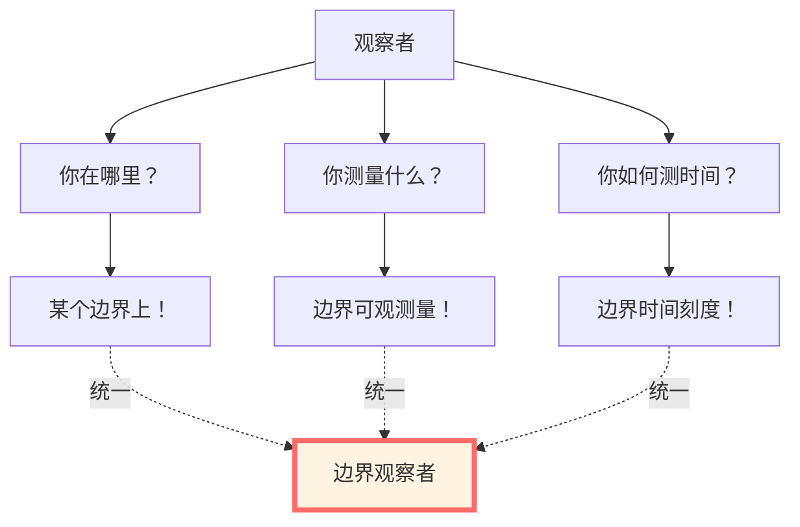
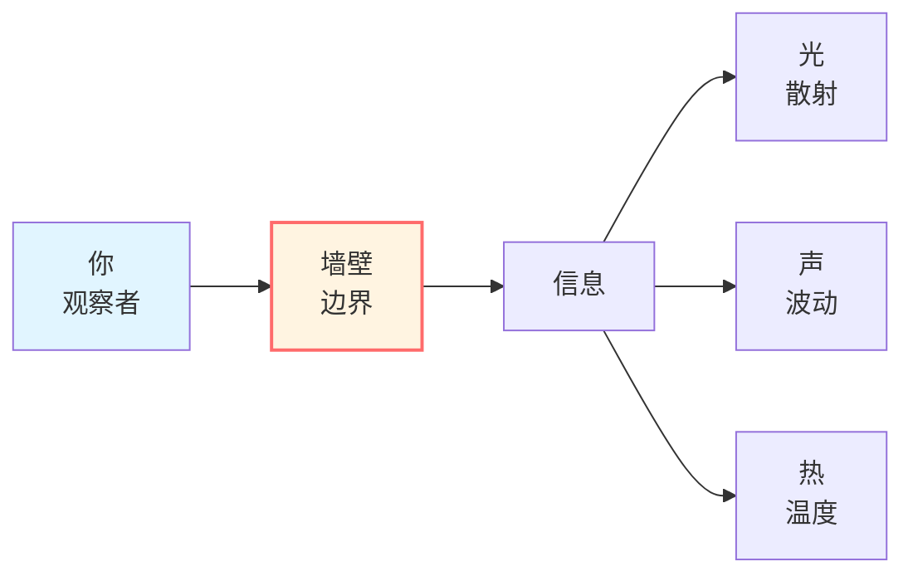
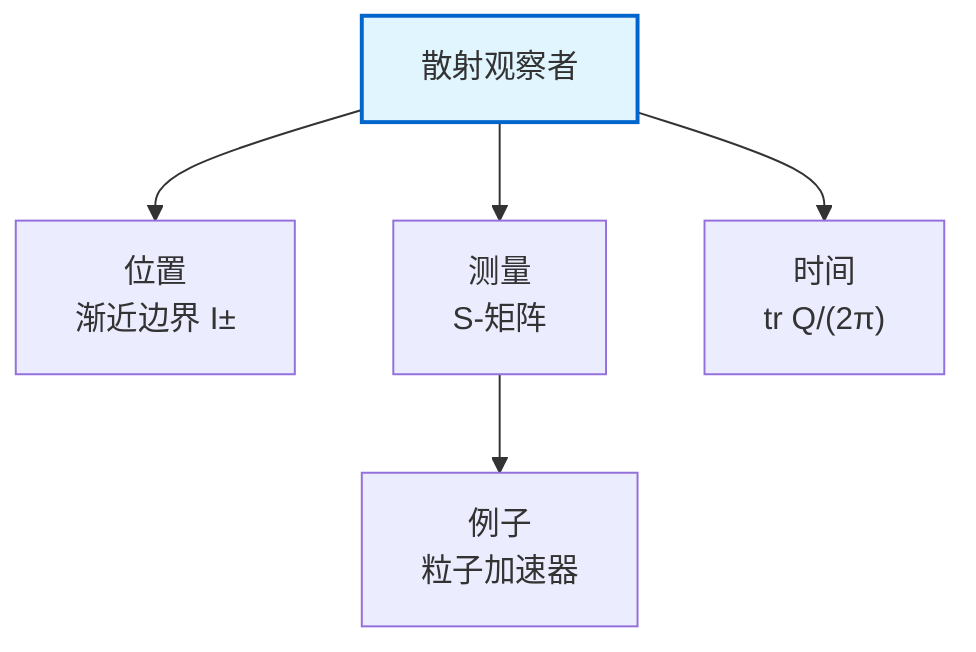
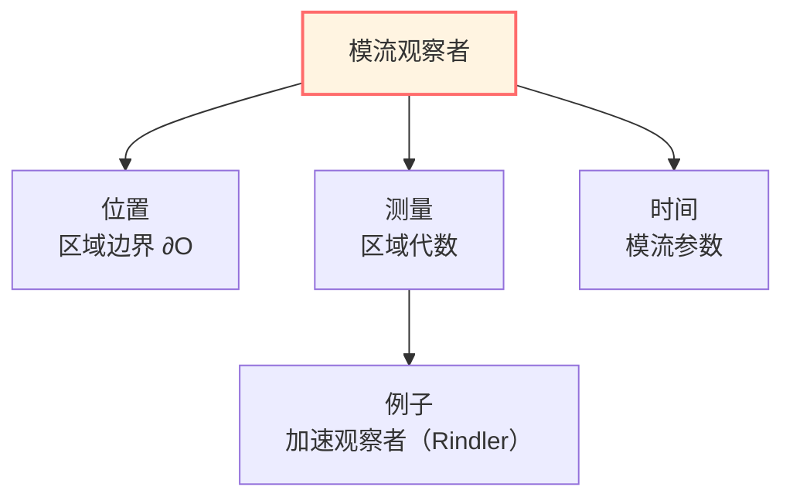
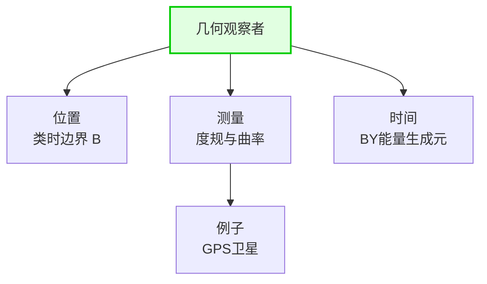
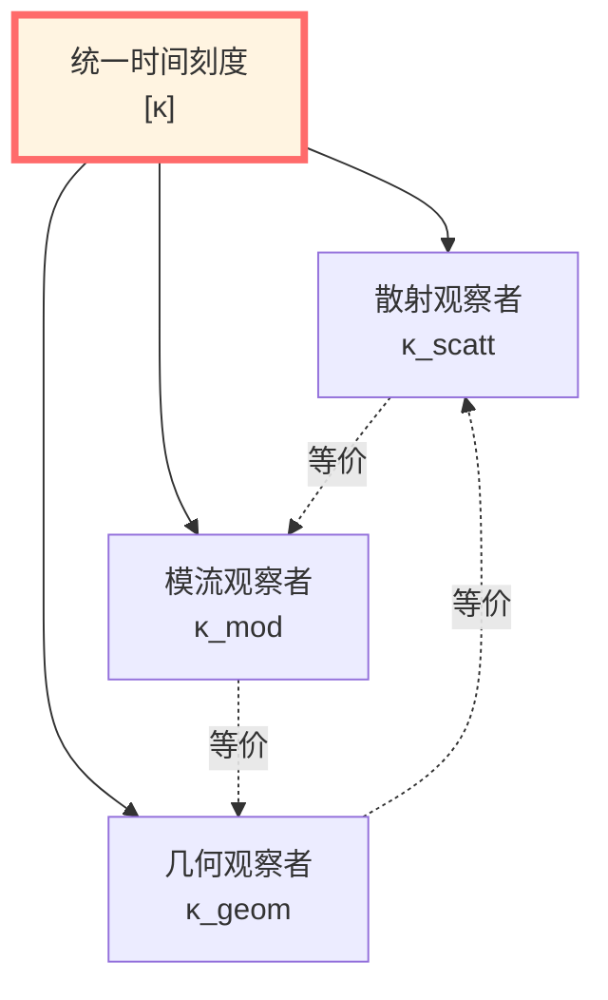
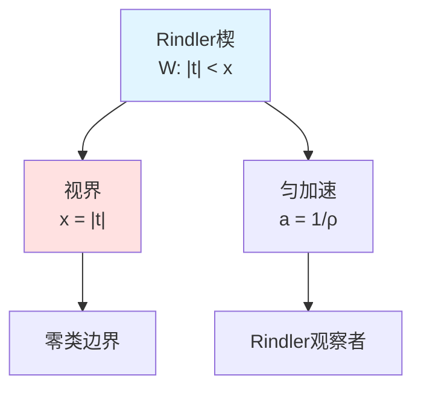
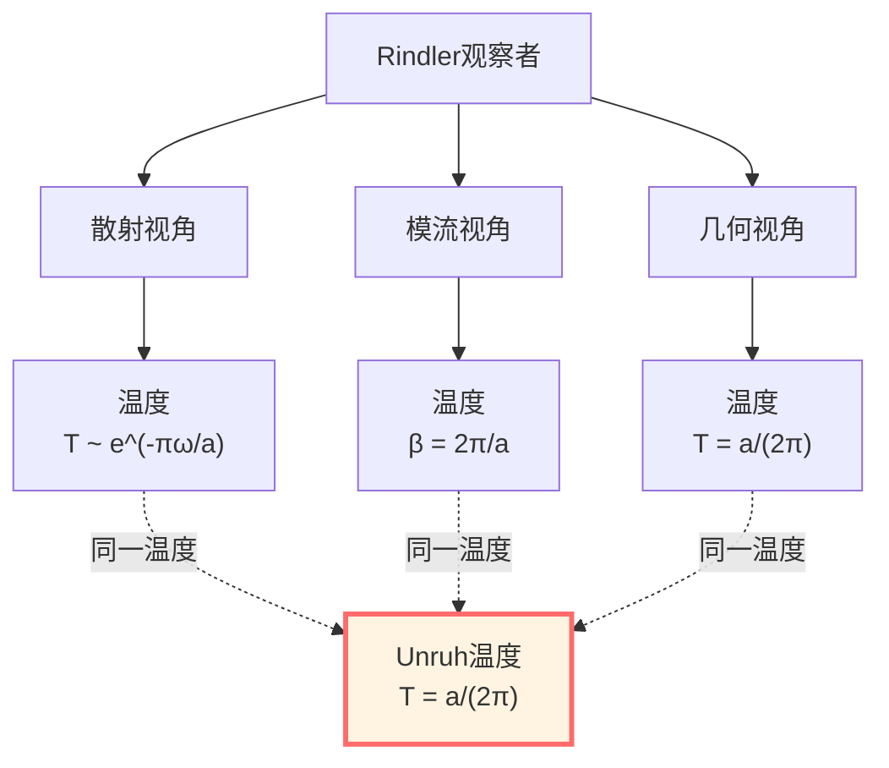
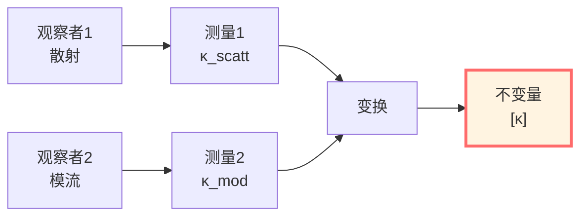

# 边界观察者：统一的测量视角

> *"所有观察者本质上都是边界观察者。"*

## 🎯 核心洞察

本篇将揭示一个深刻的事实：

**无论你在哪里，你都是一个"边界观察者"！**

## 💡 直观图像：观察者的处境

### 比喻：被困在房间里

想象你在一个房间里：

**你能做什么？**
- 触摸墙壁（边界）
- 看墙壁反射的光（散射）
- 感受墙壁的温度（热态）
- 听墙壁传来的声音（波动）

**你不能做什么？**
- 看穿墙壁外面（超越因果视界）
- 瞬间知道所有角落（非局域性）
- 脱离墙壁存在（观察者必在边界）

**关键认识**：
- 你永远在某个"房间"里（因果区域）
- 房间的"墙壁"就是边界
- 所有信息来自墙壁
- **你就是边界观察者！**

## 🌟 三种边界观察者

在GLS理论中，有三种等价的边界观察者视角：

### 1. 散射观察者（Scattering Observer）

**位置**：时空的渐近边界 $\mathcal{I}^\pm$

**测量**：
- 入射粒子状态：$|\mathrm{in}\rangle$
- 出射粒子状态：$|\mathrm{out}\rangle$
- 散射矩阵：$S: |\mathrm{in}\rangle \mapsto |\mathrm{out}\rangle$

**时间刻度**：

$$\kappa_{\mathrm{scatt}}(\omega) = \frac{\varphi'(\omega)}{\pi} = \frac{1}{2\pi}\operatorname{tr}Q(\omega)$$

其中 $Q(\omega)$ 是Wigner-Smith群延迟算子。

**实验例子**：
- **高能物理实验**：粒子加速器，探测器在远处
- **量子散射实验**：原子散射，测量角分布
- **天体观测**：我们在地球，观测宇宙边界（CMB）

### 2. 模流观察者（Modular Observer）

**位置**：因果区域$O$的边界$\partial O$

**测量**：
- 区域代数：$\mathcal{A}(O)$
- 模流：$\sigma_t^\omega(A) = \Delta_\omega^{it} A \Delta_\omega^{-it}$
- 相对熵：$S(\rho \| \omega)$

**时间刻度**：

$$\kappa_{\mathrm{mod}}(\lambda) = \frac{\mathrm{d}\lambda}{\mathrm{d}t}\bigg|_{\text{modular}}$$

其中$\lambda$是模哈密顿量$K_\omega$的谱参数。

**实验例子**：
- **Rindler观察者**：匀加速观察者，视界是Rindler地平线
- **黑洞外观察者**：视界外区域，视界是边界
- **de Sitter观察者**：宇宙学视界内的观察者

### 3. 几何观察者（Geometric Observer）

**位置**：类时边界$\mathcal{B}$

**测量**：
- 诱导度规：$h_{ab}$
- 外挠曲率：$K_{ab}$
- Brown-York能量：$E_{\mathrm{BY}}$

**时间刻度**：

$$\kappa_{\mathrm{geom}} = \frac{\delta E_{\mathrm{BY}}}{\delta T}\bigg|_{\text{boundary}}$$

其中$T$是边界时间参数。

**实验例子**：
- **GPS系统**：卫星测量地球引力场，边界在卫星轨道
- **引力波探测**：LIGO测量时空几何变化
- **宇宙学观测**：哈勃观测，边界是可观测宇宙

## 🔗 三种观察者的等价性

### 核心定理

**定理（边界观察者统一）**：

在适当的匹配条件下，三种边界观察者测量**同一个物理**：

$$\boxed{\kappa_{\mathrm{scatt}} \sim \kappa_{\mathrm{mod}} \sim \kappa_{\mathrm{geom}}}$$

即它们的时间刻度属于同一等价类$[\kappa]$！

### 匹配条件

**条件1**：散射与模流的匹配

在渐近区域，散射通道可嵌入边界代数：

$$\mathcal{A}_{\mathrm{scatt}} \hookrightarrow \mathcal{A}_\partial$$

散射相位与模哈密顿量的谱相位一致：

$$\varphi(\omega) \leftrightarrow \arg\det\left(\mathbb{I} + e^{-\beta K_\omega}\right)$$

**条件2**：模流与几何的匹配

通过半经典近似或全息对偶：

$$\langle T_{\mu\nu} \rangle_\omega \leftrightarrow \frac{\delta S_{\mathrm{grav}}}{\delta g^{\mu\nu}}$$

模哈密顿量与Brown-York能量关联：

$$K_\omega \leftrightarrow 2\pi \beta^{-1} H_{\mathrm{BY}}$$

**条件3**：几何与散射的闭合

通过Shapiro延迟、引力散射等联系：

$$\text{散射延迟} \leftrightarrow \text{几何路径延迟}$$

## 📊 三种观察者的对比

| 方面 | 散射观察者 | 模流观察者 | 几何观察者 |
|------|----------|----------|----------|
| **边界** | $\mathcal{I}^\pm$ | $\partial O$ | $\mathcal{B}$ |
| **代数** | 渐近场 | 局域代数$\mathcal{A}(O)$ | $(h_{ab}, \pi^{ab})$ |
| **态** | 真空/散射态 | KMS态$\omega_\beta$ | Cauchy数据 |
| **时间** | 散射相位$\varphi'$ | 模流参数$\lambda$ | 边界时间$t_\mathcal{B}$ |
| **刻度** | $\operatorname{tr}Q/(2\pi)$ | 模谱密度 | $\delta E_{\mathrm{BY}}/\delta T$ |
| **例子** | 加速器 | Rindler | GPS |

**统一公式**：

$$\kappa(\omega) = \frac{\varphi'(\omega)}{\pi} = \rho_{\mathrm{mod}}(\lambda) = \frac{\partial E_{\mathrm{BY}}}{\partial t_\mathcal{B}}$$

## 🌌 Rindler观察者：三合一的典范

### 设置

**Rindler楔**：Minkowski时空中的加速参考系

$$W = \{(t,x,y,z) : |t| < x\}$$

**Rindler坐标**：

$$t = \rho \sinh\tau, \quad x = \rho \cosh\tau$$

度规：

$$\mathrm{d}s^2 = -\rho^2 \mathrm{d}\tau^2 + \mathrm{d}\rho^2 + \mathrm{d}y^2 + \mathrm{d}z^2$$

**视界**：$x = |t|$（零类面）

### 作为散射观察者

**散射设置**：
- 入射：从 $I^-$ 进入Rindler楔
- 出射：从Rindler楔到 $I^+$
- 视界作为"散射中心"

**Bogoliubov变换**：

$$a_{\mathrm{R}} = \cosh r\, a_{\mathrm{M}} - \sinh r\, b_{\mathrm{M}}^\dagger$$

散射矩阵元包含 $\tanh r = e^{-\pi\omega/a}$，其中 $a$ 是固有加速度。

### 作为模流观察者

**Bisognano-Wichmann定理**：

Minkowski真空$|0_{\mathrm{M}}\rangle$限制到$\mathcal{A}(W)$的模流为：

$$\sigma_s^{\omega_0}(A) = U_{\mathrm{boost}}(2\pi s) A U_{\mathrm{boost}}^{-1}(2\pi s)$$

即沿Rindler地平线的boost！

**模哈密顿量**：

$$K_W = 2\pi \int_{\partial W} \xi^\mu T_{\mu\nu} n^\nu\, \mathrm{d}\Sigma$$

其中$\xi = \partial_\tau$是boost Killing向量。

### 作为几何观察者

**边界设置**：
- 边界：$\rho = \rho_0$（常加速度轨迹）
- 诱导度规：$h_{ab} = \mathrm{diag}(-\rho_0^2, 1, 1)$
- 外挠曲率：$K = 1/\rho_0$

**Brown-York能量**：

$$E_{\mathrm{BY}} = \frac{1}{8\pi G} \int_{\mathcal{S}} \sqrt{\sigma}\, K\, \mathrm{d}^2x \propto \rho_0$$

**Unruh温度**：

$$T_{\mathrm{Unruh}} = \frac{a}{2\pi} = \frac{1}{2\pi\rho_0}$$

### 三重统一

**结论**：
$$\boxed{T_{\mathrm{scatt}} = T_{\mathrm{mod}} = T_{\mathrm{geom}} = \frac{a}{2\pi}}$$

这是边界观察者统一的完美例证！

## 🎯 观察者依赖性vs.物理客观性

### 哲学问题

**问题**：不同边界观察者看到不同的物理，这是否意味着物理是"主观的"？

**回答**：不！这类似于相对论中的速度。

### 类比：相对论

| 概念 | 经典物理 | 相对论 | 边界观察者 |
|------|---------|--------|-----------|
| **绝对量** | 速度 | 无 | 无全局时间 |
| **相对量** | 无 | 速度 | 边界能量 |
| **不变量** | 位置 | 固有时$\tau$ | 刻度等价类$[\kappa]$ |
| **变换** | Galileo | Lorentz | 边界映射 |

**关键洞察**：
- **客观性**：不同观察者的测量可以相互转换（通过已知的变换规则）
- **协变性**：物理定律在变换下形式不变
- **不变量**：存在所有观察者都同意的量（如$[\kappa]$）

### 物理客观性的新理解

**传统观念**：物理量独立于观察者

**新观念**：物理量是观察者之间的**关系**

**边界观点**：
- 不同边界观察者是**同一物理的不同投影**
- 通过匹配条件可以**相互转换**
- 存在**不变的等价类**（如$[\kappa]$）

这不是主观性，而是**关系性的客观性**！

## 💎 实验验证

### 1. Unruh效应（原理验证）

**预言**：加速观察者测得Minkowski真空为温度$T = a/(2\pi)$的热浴

**状态**：直接探测困难（温度极低），但有间接证据：
- Hawking辐射（类比）
- 动态Casimir效应
- 圆周加速器中的辐射

### 2. Hawking辐射（黑洞视界）

**预言**：黑洞视界外观察者测得温度$T_H = \kappa/(2\pi)$

**状态**：
- 理论广泛接受
- 模拟系统（声学黑洞）已观测到类似效应
- 真实天体黑洞辐射过弱，未直接探测

### 3. 宇宙学视界（de Sitter）

**预言**：de Sitter宇宙中观察者测得视界温度

**状态**：
- CMB温度可能包含de Sitter贡献
- 精密宇宙学观测持续进行

### 4. 散射实验（高能物理）

**实现**：所有加速器实验都是边界观察

**验证**：
- $S$-矩阵幺正性
- 散射延迟测量（飞行时间）
- 与理论预言一致

## 🤔 练习题

### 1. 概念理解

**问题**：为什么"所有观察者都是边界观察者"？

**提示**：因果性限制，信息传播需要时间，最终总在某个视界。

### 2. 计算练习

**问题**：计算球对称坍缩形成黑洞时，不同半径处观察者测得的Brown-York能量。

**提示**：使用Schwarzschild-like度规，计算不同$r$处的$K$。

### 3. 物理应用

**问题**：GPS卫星如何体现"几何观察者"？

**提示**：卫星测量地球引力场，需要相对论修正（边界时间不同）。

### 4. 哲学思考

**问题**：边界观察者理论是否暗示"观察者创造现实"？

**提示**：不，观察者选择投影方式，但物理规律客观（协变）。

## 📝 本篇总结

### 三种边界观察者

1. **散射观察者**：在渐近边界$\mathcal{I}^\pm$，测量$S$-矩阵
2. **模流观察者**：在区域边界$\partial O$，测量模哈密顿量
3. **几何观察者**：在类时边界$\mathcal{B}$，测量Brown-York能量

### 核心定理

**边界观察者统一**：

$$\kappa_{\mathrm{scatt}} \sim \kappa_{\mathrm{mod}} \sim \kappa_{\mathrm{geom}} \in [\kappa]$$

所有观察者共享统一时间刻度等价类！

### 物理意义

- **关系性**：物理量是观察者之间的关系，不是"绝对存在"
- **协变性**：物理定律在观察者变换下形式不变
- **客观性**：不变量（如$[\kappa]$）是所有观察者都同意的

### Rindler典范

Rindler观察者完美展示三重统一：

$$T_{\mathrm{Unruh}} = \frac{a}{2\pi} \quad \text{（散射）} = \text{（模流）} = \text{（几何）}$$

---

**下一步**：我们已经完成边界理论的核心内容，最后一篇将总结完整图景！

**导航**：
- 上一篇：[04-Brown-York准局域能量](04-brown-york-energy.md)
- 下一篇：[06-边界理论总结](06-boundary-summary.md)
- 概览：[00-边界理论总览](00-boundary-overview.md)
