# Boundary Observers: Unified Measurement Perspective

> *"All observers can theoretically be viewed as boundary observers."*

## 🎯 Core Insight

This article will reveal a profound fact:

**No matter where you are, you can theoretically be modeled as a "boundary observer"!**

## 💡 Intuitive Image: Observer's Situation

### Analogy: Trapped in a Room

Imagine you're in a room:

**What Can You Do?**
- Touch walls (boundary)
- See light reflected from walls (scattering)
- Feel temperature of walls (thermal state)
- Hear sounds from walls (waves)

**What Can't You Do?**
- See through walls outside (beyond causal horizon)
- Instantly know all corners (non-locality)
- Exist without walls (observer must be on boundary)

**Key Realization**:
- You're always in some "room" (causal region)
- "Walls" of room are boundary
- All information comes from walls
- **You can be viewed as a boundary observer!**

## 🌟 Three Types of Boundary Observers

In GLS theory, there are three equivalent boundary observer perspectives:

### 1. Scattering Observer

**Location**: Asymptotic boundary $\mathcal{I}^\pm$ of spacetime

**Measurements**:
- Incoming particle states: $|\mathrm{in}\rangle$
- Outgoing particle states: $|\mathrm{out}\rangle$
- Scattering matrix: $S: |\mathrm{in}\rangle \mapsto |\mathrm{out}\rangle$

**Time Scale**:

$$\kappa_{\mathrm{scatt}}(\omega) = \frac{\varphi'(\omega)}{\pi} = \frac{1}{2\pi}\operatorname{tr}Q(\omega)$$

where $Q(\omega)$ is Wigner-Smith group delay operator.

**Experimental Examples**:
- **High-Energy Physics Experiments**: Particle accelerators, detectors far away
- **Quantum Scattering Experiments**: Atomic scattering, measuring angular distributions
- **Astronomical Observations**: We on Earth, observing cosmic boundary (CMB)

### 2. Modular Flow Observer

**Location**: Boundary $\partial O$ of causal region $O$

**Measurements**:
- Regional algebra: $\mathcal{A}(O)$
- Modular flow: $\sigma_t^\omega(A) = \Delta_\omega^{it} A \Delta_\omega^{-it}$
- Relative entropy: $S(\rho \| \omega)$

**Time Scale**:

$$\kappa_{\mathrm{mod}}(\lambda) = \frac{\mathrm{d}\lambda}{\mathrm{d}t}\bigg|_{\text{modular}}$$

where $\lambda$ is spectral parameter of modular Hamiltonian $K_\omega$.

```mermaid
graph TB
    MOD["Modular Flow Observer"] --> POS2["Location<br/>Regional Boundary ∂O"]
    MOD --> MEAS2["Measurement<br/>Regional Algebra"]
    MOD --> TIME2["Time<br/>Modular Flow Parameter"]

    MEAS2 --> EXAMPLE2["Example<br/>Accelerating Observer (Rindler)"]

    style MOD fill:#fff4e1,stroke:#ff6b6b,stroke-width:2px
```

**Experimental Examples**:
- **Rindler Observer**: Uniformly accelerating observer, horizon is Rindler horizon
- **Observer Outside Black Hole**: Region outside horizon, horizon is boundary
- **de Sitter Observer**: Observer inside cosmological horizon

### 3. Geometric Observer

**Location**: Timelike boundary $\mathcal{B}$

**Measurements**:
- Induced metric: $h_{ab}$
- Extrinsic curvature: $K_{ab}$
- Brown-York energy: $E_{\mathrm{BY}}$

**Time Scale**:

$$\kappa_{\mathrm{geom}} = \frac{\delta E_{\mathrm{BY}}}{\delta T}\bigg|_{\text{boundary}}$$

where $T$ is boundary time parameter.

**Experimental Examples**:
- **GPS System**: Satellites measure Earth's gravitational field, boundary at satellite orbit
- **Gravitational Wave Detection**: LIGO measures spacetime geometry changes
- **Cosmological Observations**: Hubble observations, boundary is observable universe

## 🔗 Equivalence of Three Observers

### Core Theorem

**Proposition (Boundary Observer Unification)**:

Under appropriate matching conditions, three boundary observers are considered to measure **the same physics**:

$$\boxed{\kappa_{\mathrm{scatt}} \sim \kappa_{\mathrm{mod}} \sim \kappa_{\mathrm{geom}}}$$

That is, their time scales belong to the same equivalence class $[\kappa]$!

```mermaid
graph TB
    UNITY["Unified Time Scale<br/>[κ]"] --> SCATTER["Scattering Observer<br/>κ_scatt"]
    UNITY --> MOD["Modular Flow Observer<br/>κ_mod"]
    UNITY --> GEOM["Geometric Observer<br/>κ_geom"]

    SCATTER -.->|"Equivalent"| MOD
    MOD -.->|"Equivalent"| GEOM
    GEOM -.->|"Equivalent"| SCATTER

    style UNITY fill:#fff4e1,stroke:#ff6b6b,stroke-width:4px
```

### Matching Conditions

**Condition 1**: Matching of Scattering and Modular Flow

In asymptotic region, scattering channels can be embedded in boundary algebra:

$$\mathcal{A}_{\mathrm{scatt}} \hookrightarrow \mathcal{A}_\partial$$

Scattering phase matches spectral phase of modular Hamiltonian:

$$\varphi(\omega) \leftrightarrow \arg\det\left(\mathbb{I} + e^{-\beta K_\omega}\right)$$

**Condition 2**: Matching of Modular Flow and Geometry

Through semiclassical approximation or holographic duality:

$$\langle T_{\mu\nu} \rangle_\omega \leftrightarrow \frac{\delta S_{\mathrm{grav}}}{\delta g^{\mu\nu}}$$

Modular Hamiltonian relates to Brown-York energy:

$$K_\omega \leftrightarrow 2\pi \beta^{-1} H_{\mathrm{BY}}$$

**Condition 3**: Closure of Geometry and Scattering

Through Shapiro delay, gravitational scattering, etc.:

$$\text{Scattering Delay} \leftrightarrow \text{Geometric Path Delay}$$

## 📊 Comparison of Three Observers

| Aspect | Scattering Observer | Modular Flow Observer | Geometric Observer |
|--------|-------------------|---------------------|-------------------|
| **Boundary** | $\mathcal{I}^\pm$ | $\partial O$ | $\mathcal{B}$ |
| **Algebra** | Asymptotic fields | Local algebra $\mathcal{A}(O)$ | $(h_{ab}, \pi^{ab})$ |
| **State** | Vacuum/scattering state | KMS state $\omega_\beta$ | Cauchy data |
| **Time** | Scattering phase $\varphi'$ | Modular flow parameter $\lambda$ | Boundary time $t_\mathcal{B}$ |
| **Scale** | $\operatorname{tr}Q/(2\pi)$ | Modular spectral density | $\delta E_{\mathrm{BY}}/\delta T$ |
| **Example** | Accelerator | Rindler | GPS |

**Unified Formula**:

$$\kappa(\omega) = \frac{\varphi'(\omega)}{\pi} = \rho_{\mathrm{mod}}(\lambda) = \frac{\partial E_{\mathrm{BY}}}{\partial t_\mathcal{B}}$$

## 🌌 Rindler Observer: Perfect Example of Trinity

### Setup

**Rindler Wedge**: Accelerating reference frame in Minkowski spacetime

$$W = \{(t,x,y,z) : |t| < x\}$$

**Rindler Coordinates**:

$$t = \rho \sinh\tau, \quad x = \rho \cosh\tau$$

Metric:

$$\mathrm{d}s^2 = -\rho^2 \mathrm{d}\tau^2 + \mathrm{d}\rho^2 + \mathrm{d}y^2 + \mathrm{d}z^2$$

**Horizon**: $x = |t|$ (null surface)

### As Scattering Observer

**Scattering Setup**:
- Incoming: from $I^-$ into Rindler wedge
- Outgoing: from Rindler wedge to $I^+$
- Horizon as "scattering center"

**Bogoliubov Transformation**:

$$a_{\mathrm{R}} = \cosh r\, a_{\mathrm{M}} - \sinh r\, b_{\mathrm{M}}^\dagger$$

Scattering matrix elements contain $\tanh r = e^{-\pi\omega/a}$, where $a$ is proper acceleration.

### As Modular Flow Observer

**Bisognano-Wichmann Theorem**:

Modular flow of Minkowski vacuum $|0_{\mathrm{M}}\rangle$ restricted to $\mathcal{A}(W)$ is:

$$\sigma_s^{\omega_0}(A) = U_{\mathrm{boost}}(2\pi s) A U_{\mathrm{boost}}^{-1}(2\pi s)$$

That is, boost along Rindler horizon!

**Modular Hamiltonian**:

$$K_W = 2\pi \int_{\partial W} \xi^\mu T_{\mu\nu} n^\nu\, \mathrm{d}\Sigma$$

where $\xi = \partial_\tau$ is boost Killing vector.

### As Geometric Observer

**Boundary Setup**:
- Boundary: $\rho = \rho_0$ (constant acceleration trajectory)
- Induced metric: $h_{ab} = \mathrm{diag}(-\rho_0^2, 1, 1)$
- Extrinsic curvature: $K = 1/\rho_0$

**Brown-York Energy**:

$$E_{\mathrm{BY}} = \frac{1}{8\pi G} \int_{\mathcal{S}} \sqrt{\sigma}\, K\, \mathrm{d}^2x \propto \rho_0$$

**Unruh Temperature**:

$$T_{\mathrm{Unruh}} = \frac{a}{2\pi} = \frac{1}{2\pi\rho_0}$$

### Triple Unification

```mermaid
graph TB
    RINDLER["Rindler Observer"] --> SCATTER["Scattering Perspective"]
    RINDLER --> MOD["Modular Flow Perspective"]
    RINDLER --> GEOM["Geometric Perspective"]

    SCATTER --> TEMP1["Temperature<br/>T ~ e^(-πω/a)"]
    MOD --> TEMP2["Temperature<br/>β = 2π/a"]
    GEOM --> TEMP3["Temperature<br/>T = a/(2π)"]

    TEMP1 -.->|"Same Temperature"| UNITY["Unruh Temperature<br/>T = a/(2π)"]
    TEMP2 -.->|"Same Temperature"| UNITY
    TEMP3 -.->|"Same Temperature"| UNITY

    style UNITY fill:#fff4e1,stroke:#ff6b6b,stroke-width:3px
```

**Conclusion**:
$$\boxed{T_{\mathrm{scatt}} = T_{\mathrm{mod}} = T_{\mathrm{geom}} = \frac{a}{2\pi}}$$

This is a perfect example of boundary observer unification!

## 🎯 Observer Dependence vs. Physical Objectivity

### Philosophical Question

**Question**: Different boundary observers see different physics, does this mean physics is "subjective"?

**Answer**: No! This is similar to velocity in relativity.

### Analogy: Relativity

| Concept | Classical Physics | Relativity | Boundary Observer |
|---------|------------------|-----------|------------------|
| **Absolute Quantity** | Velocity | None | No global time |
| **Relative Quantity** | None | Velocity | Boundary energy |
| **Invariant** | Position | Proper time $\tau$ | Scale equivalence class $[\kappa]$ |
| **Transformation** | Galileo | Lorentz | Boundary mapping |

**Key Insight**:
- **Objectivity**: Measurements by different observers can be converted (through known transformation rules)
- **Covariance**: Physical laws invariant in form under transformations
- **Invariants**: Quantities all observers agree on (like $[\kappa]$)

```mermaid
graph LR
    OBS1["Observer 1<br/>Scattering"] --> MEAS1["Measurement 1<br/>κ_scatt"]
    OBS2["Observer 2<br/>Modular Flow"] --> MEAS2["Measurement 2<br/>κ_mod"]

    MEAS1 --> TRANS["Transformation"]
    MEAS2 --> TRANS

    TRANS --> INV["Invariant<br/>[κ]"]

    style INV fill:#fff4e1,stroke:#ff6b6b,stroke-width:3px
```

### New Understanding of Physical Objectivity

**Traditional View**: Physical quantities independent of observer

**New View**: Physical quantities are **relations** between observers

**Boundary Perspective**:
- Different boundary observers are **different projections of same physics**
- Can **convert** through matching conditions
- Exist **invariant equivalence classes** (like $[\kappa]$)

This is considered not subjectivity, but **relational objectivity**!

## 💎 Experimental Verification

### 1. Unruh Effect (Principle Verification)

**Prediction**: Accelerating observer measures Minkowski vacuum as thermal bath at temperature $T = a/(2\pi)$

**Status**: Direct detection difficult (temperature extremely low), but indirect evidence:
- Hawking radiation (analogy)
- Dynamic Casimir effect
- Radiation in circular accelerators

### 2. Hawking Radiation (Black Hole Horizon)

**Prediction**: Observer outside black hole horizon measures temperature $T_H = \kappa/(2\pi)$

**Status**:
- Theory widely accepted
- Analog systems (acoustic black holes) have observed similar effects
- Real astrophysical black hole radiation too weak, not directly detected

### 3. Cosmological Horizon (de Sitter)

**Prediction**: Observer in de Sitter universe measures horizon temperature

**Status**:
- CMB temperature may contain de Sitter contribution
- Precision cosmological observations ongoing

### 4. Scattering Experiments (High-Energy Physics)

**Realization**: All accelerator experiments are boundary observations

**Verification**:
- $S$-matrix unitarity
- Scattering delay measurements (time of flight)
- Consistent with theoretical predictions

## 🤔 Exercises

### 1. Conceptual Understanding

**Question**: Why are "all observers boundary observers"?

**Hint**: Causality constraints, information propagation takes time, always on some horizon.

### 2. Calculation Exercise

**Question**: Calculate Brown-York energy measured by observers at different radii during spherically symmetric collapse forming black hole.

**Hint**: Use Schwarzschild-like metric, calculate $K$ at different $r$.

### 3. Physical Application

**Question**: How do GPS satellites embody "geometric observer"?

**Hint**: Satellites measure Earth's gravitational field, need relativistic corrections (boundary time different).

### 4. Philosophical Reflection

**Question**: Does boundary observer theory imply "observer creates reality"?

**Hint**: No, observer chooses projection method, but physical laws objective (covariant).

## 📝 Chapter Summary

### Three Types of Boundary Observers

1. **Scattering Observer**: At asymptotic boundary $\mathcal{I}^\pm$, measures $S$-matrix
2. **Modular Flow Observer**: At regional boundary $\partial O$, measures modular Hamiltonian
3. **Geometric Observer**: At timelike boundary $\mathcal{B}$, measures Brown-York energy

### Core Theorem

**Boundary Observer Unification**:

$$\kappa_{\mathrm{scatt}} \sim \kappa_{\mathrm{mod}} \sim \kappa_{\mathrm{geom}} \in [\kappa]$$

All observers are considered to share unified time scale equivalence class!

### Physical Meaning

- **Relationality**: Physical quantities are relations between observers, not "absolute existence"
- **Covariance**: Physical laws invariant in form under observer transformations
- **Objectivity**: Invariants (like $[\kappa]$) are agreed upon by all observers

### Rindler Paradigm

Rindler observer perfectly demonstrates triple unification:

$$T_{\mathrm{Unruh}} = \frac{a}{2\pi} \quad \text{(Scattering)} = \text{(Modular Flow)} = \text{(Geometric)}$$

---

**Next Step**: We've completed core content of boundary theory, final article will summarize complete picture!

**Navigation**:
- Previous: [04-brown-york-energy_en.md](04-brown-york-energy_en.md)
- Next: [06-boundary-summary_en.md](06-boundary-summary_en.md)
- Overview: [00-boundary-overview_en.md](00-boundary-overview_en.md)

