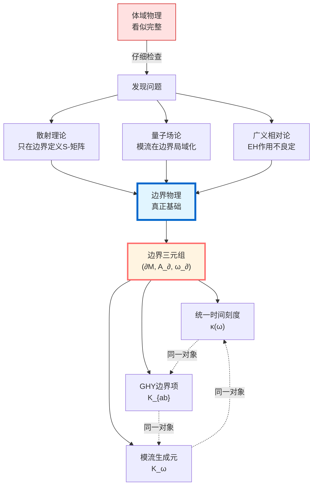
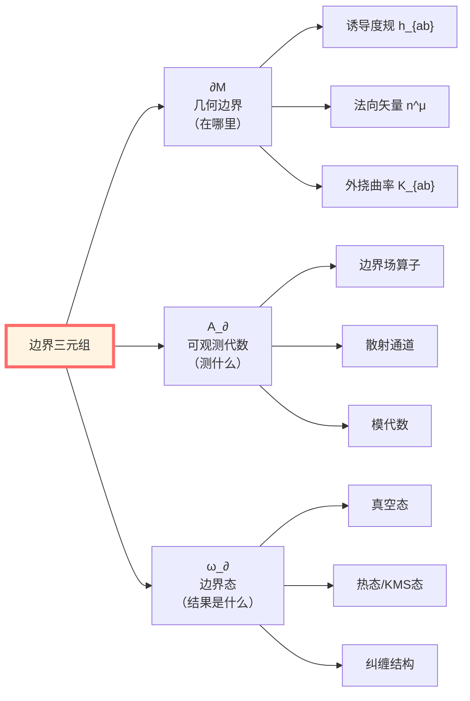
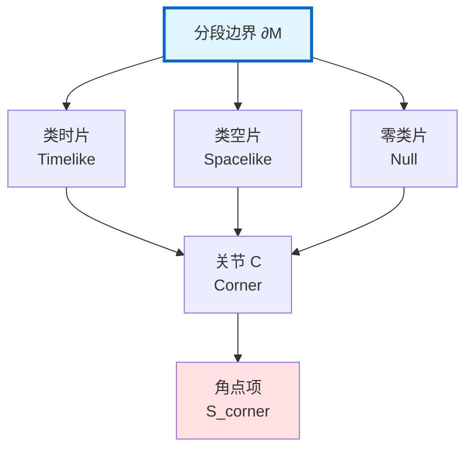
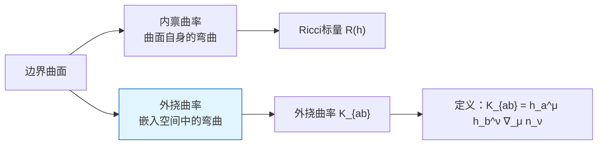
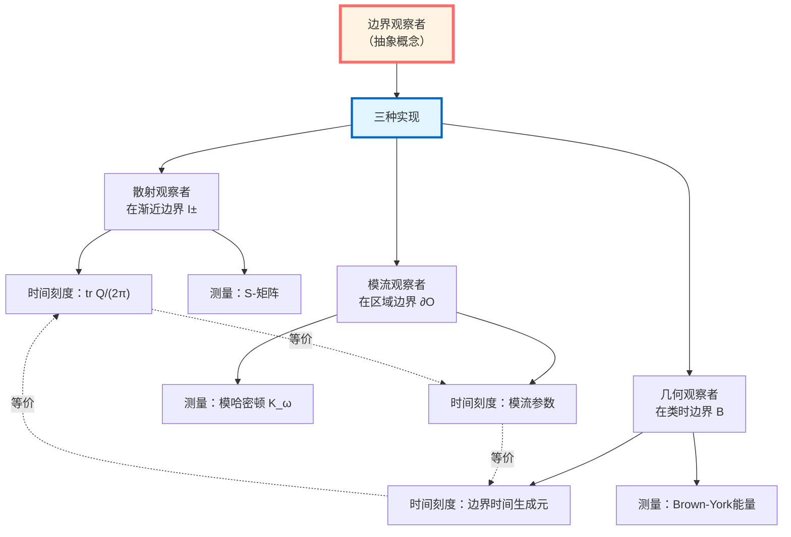
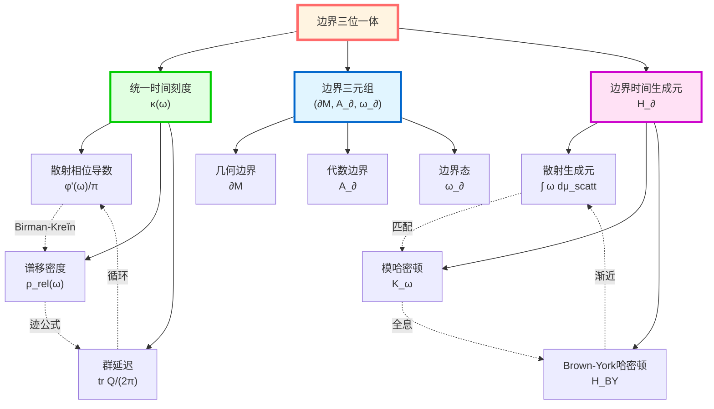
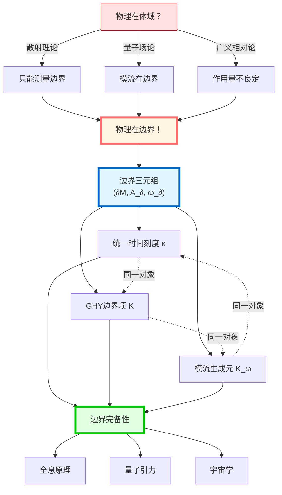

# 边界理论总结：物理的边界本质

> *"体域是边界数据的幻影，真实的物理对象全都活在边界上。"*

## 🎯 核心回顾

在本篇中，我们完成了一场**从体域到边界的范式革命**。让我们回顾这个惊人的旅程。

### 核心洞察

## 第一步：三大历史证据

在[01-为什么边界](01-why-boundary.md)中，我们看到了三个独立的历史证据，它们都指向同一个结论：

### 证据1：散射理论（量子力学）

**比喻**：想象你在一个完全漆黑的房间里扔球，你只能在门口测量进出的球。房间内部发生了什么？你永远看不见！

**数学**：

$$\boxed{S\text{-矩阵定义在无穷远边界}\quad \mathcal{I}^\pm}$$

**关键公式**：

$$S(\omega) = \Omega_+^\dagger \Omega_-$$

其中 $\Omega_\pm$ 是波算子，它们的定义需要**渐近边界条件**。

**洞察**：体域的谱信息完全由边界散射数据确定！

### 证据2：量子场论（模流理论）

**比喻**：房间的温度计不在房间里，而是钉在墙上。墙才是测量的地方！

**数学**：

$$\boxed{\text{模哈密顿量}\ K_\omega\ \text{在区域边界}\ \partial O\ \text{上局域化}}$$

**关键公式**（Bisognano-Wichmann定理）：

$$\sigma_t^\omega(A) = e^{2\pi i K_\mathrm{boost} t} A e^{-2\pi i K_\mathrm{boost} t}$$

对楔区 $W$，模流等于 Lorentz boost，其生成元在**楔的边界（Rindler视界）**上局域化。

**洞察**：相对熵、纠缠熵等信息论量全都在边界上定义！

### 证据3：广义相对论（变分原理）

**比喻**：想象你要给一个有盖子的盒子定义能量。如果你只看盒子内部，能量的定义是**不完整的**——你必须考虑盖子（边界）！

**数学**：

$$\boxed{\delta S_{\mathrm{EH}} = \text{体积项} + \text{边界项（含法向导数）}}$$

Einstein-Hilbert作用单独**不能**给出良定的变分原理！

**GHY拯救**：

$$S = S_{\mathrm{EH}} + S_{\mathrm{GHY}}$$

$$S_{\mathrm{GHY}} = \frac{\varepsilon}{8\pi G}\int_{\partial\mathcal{M}}\sqrt{|h|}\, K\, \mathrm{d}^3x$$

现在边界项完全抵消！

**洞察**：引力的作用量原理本质上是**边界变分原理**！

## 第二步：边界数据三元组

在[02-边界数据三元组](02-boundary-data-triple.md)中，我们构造了统一的边界描述：

### 定义（边界三元组）

$$\boxed{(\partial\mathcal{M}, \mathcal{A}_\partial, \omega_\partial)}$$

**三个组成部分**：

### 边界完备性原理

**命题**：给定边界三元组 $(\partial\mathcal{M}, \mathcal{A}_\partial, \omega_\partial)$，体域物理内容可以**完全重建**。

**三个层次的重建**：

| 层次 | 边界数据 | 重建对象 | 机制 |
|------|----------|----------|------|
| **散射** | $S$-矩阵 | 体域谱 | Birman-Kreĭn公式 |
| **代数** | 边界CFT | 体域几何 | AdS/CFT全息 |
| **几何** | 边界度规+能量 | 体域度规 | Hamilton-Jacobi |

### 边界可以分段

**重要性**：真实的边界往往不是光滑的！

**关节项必要性**：在边界不同片段的交界处（关节），需要额外的**角点项**来确保作用量的可微性。

## 第三步：GHY边界项的深层含义

在[03-GHY边界项](03-ghy-boundary-term.md)中，我们揭示了GHY边界项的必要性：

### 核心定理（GHY抵消机制）

**定理**：对Einstein-Hilbert作用加上GHY边界项：

$$S_{\mathrm{total}} = S_{\mathrm{EH}} + S_{\mathrm{GHY}}$$

在固定边界诱导度规 $h_{ab}$ 的变分下，边界项完全抵消：

$$\boxed{\delta(S_{\mathrm{EH}} + S_{\mathrm{GHY}}) = \frac{1}{16\pi G}\int_{\mathcal{M}}\sqrt{-g}\, G_{\mu\nu}\, \delta g^{\mu\nu}}$$

**物理意义**：
- 左边：只有体域Einstein张量
- 右边：边界项为零
- 结论：变分原理**良定**！

### 外挠曲率的几何意义

**直观理解**：外挠曲率 $K_{ab}$ 测量的是边界"向外"弯曲的程度。

**公式**：

$$K_{ab} = h_a{}^\mu h_b{}^\nu \nabla_\mu n_\nu$$

其中：
- $h_a{}^\mu$：边界到体域的嵌入映射
- $n^\nu$：单位法向矢量
- $\nabla_\mu$：体域协变导数

**迹**：

$$K = h^{ab} K_{ab}$$

### 零类边界的特殊性

对零类边界（如黑洞视界），GHY项形式不同：

$$S_{\mathcal{N}} = \frac{1}{8\pi G}\int_{\mathcal{N}}\sqrt{\gamma}\, (\theta + \kappa)\, \mathrm{d}\lambda\, \mathrm{d}^2x$$

其中：
- $\gamma_{AB}$：横截二维度规
- $\theta$：膨胀（expansion）
- $\kappa$：表面引力
- $\lambda$：仿射参数

**物理直觉**：零测地不能用外挠曲率描述（因为法向矢量是零矢量！），必须用膨胀和表面引力。

## 第四步：Brown-York准局域能量

在[04-Brown-York能量](04-brown-york-energy.md)中，我们定义了边界时间的生成元：

### 定义（Brown-York应力张量）

$$\boxed{T^{ab}_{\mathrm{BY}} = \frac{1}{8\pi G}(K^{ab} - K h^{ab})}$$

这是**边界应力-能量张量**，完全由边界几何数据确定！

### 准局域能量

给定边界上的单位时间样矢量 $u^a$ 和二维截面 $\mathcal{S}$：

$$\boxed{E_{\mathrm{BY}} = \int_{\mathcal{S}} \sqrt{\sigma}\, u_a u_b\, T^{ab}_{\mathrm{BY}}\, \mathrm{d}^2x}$$

**"准局域"的含义**：
- 不是真正局域（依赖于边界选择）
- 但比ADM质量更局域（不需要渐近平坦）
- 是"最佳可能"的局域能量定义

### 渐近极限

**定理**：在渐近平坦时空中，Brown-York能量收敛到ADM质量：

$$\lim_{r \to \infty} E_{\mathrm{BY}}(\mathcal{S}_r) = M_{\mathrm{ADM}}$$

### 实例：Schwarzschild黑洞

对Schwarzschild黑洞，在半径 $r$ 的二维球面上：

$$E_{\mathrm{BY}}(r) = \frac{r}{2G}\left(1 - \sqrt{1 - \frac{2GM}{r}}\right)$$

**渐近行为**：
- $r \to \infty$：$E_{\mathrm{BY}} \to M$（ADM质量）
- $r \to 2GM$：$E_{\mathrm{BY}} \to M$（视界能量）

**关键洞察**：
$$\boxed{\text{Brown-York能量} = \text{边界时间平移的生成元}}$$

## 第五步：边界观察者的统一

在[05-边界观察者](05-boundary-observables.md)中，我们实现了终极统一：

### 核心定理（边界观察者统一）

**定理**：以下三种"边界观察者"本质上等价：

$$\boxed{\kappa_{\mathrm{scatt}} \sim \kappa_{\mathrm{mod}} \sim \kappa_{\mathrm{geom}}}$$

### 三种观察者的细节

| 观察者类型 | 位置 | 测量对象 | 时间刻度 |
|------------|------|----------|----------|
| **散射** | 渐近边界 $\mathcal{I}^\pm$ | 散射矩阵 $S(\omega)$ | $\kappa_{\mathrm{scatt}} = \varphi'(\omega)/\pi$ |
| **模流** | 区域边界 $\partial O$ | 模哈密顿量 $K_\omega$ | $\kappa_{\mathrm{mod}} = \rho_{\mathrm{rel}}(\omega)$ |
| **几何** | 类时边界 $\mathcal{B}$ | Brown-York能量 $E_{\mathrm{BY}}$ | $\kappa_{\mathrm{geom}} = \operatorname{tr}Q(\omega)/(2\pi)$ |

### 统一刻度等价类

**定义**：时间刻度等价类 $[\kappa]$ 是所有相差常数因子和允许重标的刻度密度的等价类。

**定理**：在边界三元组 $(\partial\mathcal{M}, \mathcal{A}_\partial, \omega_\partial)$ 中，存在唯一的刻度等价类 $[\kappa]$，使得：

$$\boxed{\kappa_{\mathrm{scatt}} = \kappa_{\mathrm{mod}} = \kappa_{\mathrm{geom}} = \kappa(\omega)}$$

（在同一能窗内）

### 完美示例：Rindler观察者

**场景**：匀加速观察者（加速度 $a$）

**三位一体**：
1. **散射端**：Rindler模式的散射相移
2. **模流端**：Rindler楔的模哈密顿量
3. **几何端**：Rindler视界的Brown-York能量

**共同温度**：

$$\boxed{T = \frac{a}{2\pi}}$$

这是Unruh温度，它**同时**是：
- 散射相位导数
- 模流逆温度
- 边界时间刻度

## 🌟 边界三位一体：终极统一

现在我们可以展示完整的统一图景：

### 主结果总结

**定理A（散射端刻度同一式）**：

$$\boxed{\frac{\varphi'(\omega)}{\pi} = \rho_{\mathrm{rel}}(\omega) = \frac{1}{2\pi}\operatorname{tr}Q(\omega)}$$

**定理B（模流端局域化）**：模哈密顿量可以在边界上完全局域化：

$$K_\partial = 2\pi \int_{\partial O} \xi^\mu T_{\mu\nu} n^\nu\, \mathrm{d}\Sigma$$

**定理C（GHY良定性）**：

$$\delta(S_{\mathrm{EH}} + S_{\mathrm{GHY}}) = \frac{1}{16\pi G}\int_{\mathcal{M}}\sqrt{-g}\, G_{\mu\nu}\, \delta g^{\mu\nu}$$

边界项完全抵消！

**定理D（边界三位一体）**：存在统一边界时间生成元 $H_\partial$，使得：

$$H_\partial = \int \omega\, \mathrm{d}\mu_\partial^{\mathrm{scatt}}(\omega) = c_1 K_D = c_2 H_\partial^{\mathrm{grav}}$$

## 📊 核心公式总汇

### 边界数据三元组

$$\boxed{(\partial\mathcal{M}, \mathcal{A}_\partial, \omega_\partial)}$$

### GHY边界项

**类时/类空边界**：

$$\boxed{S_{\mathrm{GHY}} = \frac{\varepsilon}{8\pi G}\int_{\partial\mathcal{M}}\sqrt{|h|}\, K\, \mathrm{d}^3x}$$

其中 $\varepsilon = n^\mu n_\mu \in \{\pm 1\}$，$K = h^{ab}K_{ab}$

**零类边界**：

$$\boxed{S_{\mathcal{N}} = \frac{1}{8\pi G}\int_{\mathcal{N}}\sqrt{\gamma}\, (\theta + \kappa)\, \mathrm{d}\lambda\, \mathrm{d}^2x}$$

### Brown-York应力张量与能量

$$\boxed{T^{ab}_{\mathrm{BY}} = \frac{1}{8\pi G}(K^{ab} - K h^{ab})}$$

$$\boxed{E_{\mathrm{BY}} = \int_{\mathcal{S}} \sqrt{\sigma}\, u_a u_b\, T^{ab}_{\mathrm{BY}}\, \mathrm{d}^2x}$$

### 统一时间刻度

$$\boxed{\kappa(\omega) = \frac{\varphi'(\omega)}{\pi} = \rho_{\mathrm{rel}}(\omega) = \frac{1}{2\pi}\operatorname{tr}Q(\omega)}$$

### 外挠曲率

$$\boxed{K_{ab} = h_a{}^\mu h_b{}^\nu \nabla_\mu n_\nu}$$

$$\boxed{K = h^{ab} K_{ab}}$$

## 🔗 与其他篇的联系

### 回溯：统一时间篇（第5篇）

在统一时间篇中，我们证明了时间刻度同一式：

$$\kappa(\omega) = \varphi'(\omega)/\pi = \rho_{\mathrm{rel}}(\omega) = \operatorname{tr}Q(\omega)/(2\pi)$$

现在我们看到：**这个统一刻度完全是边界现象**！

- 散射相位 $\varphi'(\omega)$：在渐近边界定义
- 谱移函数 $\rho_{\mathrm{rel}}(\omega)$：由边界散射数据确定
- 群延迟 $\operatorname{tr}Q(\omega)$：边界通道延迟的和

### 回溯：IGVP框架篇（第4篇）

IGVP变分原理需要边界理论才完整：

**关键洞察**：
- 广义熵在**小因果菱形的边界**上定义
- 一阶极值 → Einstein方程
- 二阶变分 → QNEC/QFC
- 边界项 → Brown-York能量

### 前瞻：因果结构篇（第7篇）

边界理论为因果结构奠基：

**因果钻石**：

$$D(p,q) = J^+(p) \cap J^-(q)$$

其边界由**未来零超曲面**和**过去零超曲面**组成！

**Null-Modular双覆盖**：

$$\widetilde{E}_D = E^+ \sqcup E^-$$

其中 $E^\pm$ 是因果钻石的两个零类边界叶片。

**模哈密顿量**：

$$K_D = 2\pi \sum_{\sigma = \pm} \int_{E^\sigma} g_\sigma(\lambda, x_\perp)\, T_{\sigma\sigma}(\lambda, x_\perp)\, \mathrm{d}\lambda\, \mathrm{d}^{d-2}x$$

完全在**零类边界**上定义！

### 前瞻：矩阵宇宙篇（第10篇）

边界理论揭示了全息原理的本质：

**AdS/CFT对应**：

$$\boxed{\text{边界CFT} \Longleftrightarrow \text{体域AdS几何}}$$

这是边界完备性原理的**终极体现**！

**心-宇宙等价**：观察者的"内在体验"（心）等价于"外在宇宙"（宇宙），因为两者都是**边界数据的不同投影**。

## 💡 深层哲学含义

### 1. 物理的边界本质

**传统观念**：
- 体域是基本的
- 边界是技术性补充
- 观察在体域内进行

**边界革命**：
- 边界是基本的
- 体域是边界数据的重建
- 所有观察本质上在边界进行

### 2. 测量的边界解释

**量子测量**：测量不是"观察体域"，而是**在边界上投影**！

**洞察**：
- 我们永远看不到"真正的体域"
- 我们只能看到"边界投影"
- 体域的重建是间接的

### 3. 观察者的本质

**定理**：任何观察者都是**边界观察者**。

**三个层次**：
1. **散射观察者**：在渐近边界测量进出粒子
2. **模流观察者**：在区域边界定义相对熵
3. **几何观察者**：在类时边界测量准局域能量

**统一**：这三种观察者**本质上等价**，只是同一边界结构的不同投影！

## 🎓 思考题

### 问题1：为什么不能在Minkowski空间定义"局域能量"？

**提示**：能量守恒需要时间平移对称性。Minkowski空间有全局时间平移，但能量密度 $T_{00}$ 不是张量...

**答案**：在弯曲时空中，没有全局时间平移对称性，因此没有全局能量。Brown-York准局域能量是最佳替代，它在**边界**上定义，不依赖全局对称性。

### 问题2：外挠曲率 $K_{ab}$ 和Ricci曲率 $R_{ab}$ 有什么区别？

**提示**：一个是"内禀"的，一个是"外在"的。

**答案**：
- **Ricci曲率 $R_{ab}$**：内禀曲率，只依赖于曲面自身的度规
- **外挠曲率 $K_{ab}$**：外在曲率，依赖于曲面如何嵌入到周围空间

类比：一张纸可以卷成圆柱（外挠曲率≠0），但纸自身是平的（内禀曲率=0）。

### 问题3：为什么零类边界需要特殊处理？

**提示**：法向矢量 $n^\mu$ 满足什么条件？

**答案**：对零类边界，法向矢量是**零矢量**：$n^\mu n_\mu = 0$。因此：
- 不能用 $n^\mu$ 归一化
- 外挠曲率的定义需要修改
- 必须用膨胀 $\theta$ 和表面引力 $\kappa$ 代替 $K$

### 问题4：边界完备性原理的极限是什么？

**提示**：在什么情况下边界数据不足以重建体域？

**开放问题**：
- 拓扑变化（例如baby universe形成）
- 量子引力效应
- 奇点附近
- 宇宙学视界之外

这些是当前研究的前沿！

## 🌟 本篇的独特贡献

与传统广义相对论和量子场论教材相比，本篇的独特之处：

### 1. 统一视角

**传统**：
- GHY边界项（GR）
- 模流（QFT）
- 散射理论（QM）

分别在不同课程中讲授，互不关联。

**本篇**：
将三者统一为**边界三位一体**，揭示它们是同一对象的不同投影。

### 2. 边界完备性

**传统**：边界是技术性的边界条件。

**本篇**：边界是物理本质，体域是边界数据的重建。

### 3. 通俗解释

**传统**：纯技术推导，难以理解物理直觉。

**本篇**：多层次解释
- **比喻层**：房间、墙、测量
- **概念层**：边界、观察者、时间刻度
- **数学层**：公式、定理、证明
- **源理论层**：连接原始文献

### 4. 前后连贯

**传统**：各个主题孤立讲授。

**本篇**：
- 承接**统一时间篇**（时间刻度）
- 服务于**IGVP框架**（变分原理）
- 引向**因果结构篇**（因果钻石）
- 支持**矩阵宇宙篇**（全息原理）

## 🔮 未来展望

边界理论为许多前沿问题奠定了基础：

### 1. 黑洞信息悖论

**问题**：黑洞蒸发时，信息去哪了？

**边界视角**：
- 信息从不在黑洞"内部"
- 信息总是在**视界（边界）**上编码
- 黑洞蒸发是**边界演化**

### 2. 全息原理

**AdS/CFT**：

$$\text{$(d+1)$维引力} \Longleftrightarrow \text{$d$维CFT}$$

这是边界完备性的**终极版本**：体域的所有自由度都在边界上！

### 3. 量子引力

**路径积分**：

$$Z = \int \mathcal{D}g\, e^{iS[g]}$$

在边界理论框架下，这应该改写为：

$$Z = \int \mathcal{D}(\text{边界数据})\, e^{iS_{\mathrm{boundary}}}$$

体域度规 $g$ 只是边界数据的函数！

### 4. 宇宙学视界

**de Sitter宇宙**：有宇宙学视界。

**问题**：视界之外发生了什么？

**边界回答**：视界是真正的边界！没有"之外"。所有可观测的物理都在**视界（边界）**上定义。

## 📚 进一步学习

### 核心文献

1. **GHY边界项**：
   - Gibbons & Hawking (1977): Action integrals and partition functions
   - York (1972): Role of conformal three-geometry

2. **Brown-York能量**：
   - Brown & York (1993): Quasilocal energy and conserved charges

3. **模流理论**：
   - Bisognano & Wichmann (1975): On the duality condition
   - Casini et al. (2011): Towards a derivation of holographic entanglement entropy

4. **边界CFT**：
   - Maldacena (1998): The large N limit of superconformal field theories
   - JLMS (Jensen et al.): Entropy in AdS/CFT

### 源理论文档

本教程基于以下源理论：
- `docs/euler-gls-paper-bondary/boundary-as-unified-stage.md`
- `docs/euler-gls-paper-bondary/trinity-master-scale-boundary-time-geometry-null-modular-unification.md`
- `docs/euler-gls-extend/ghy-boundary-terms-variational-completeness.md`

建议深入阅读以获得更严格的数学推导。

## ✨ 总结：从体域到边界的革命

让我们回顾这场革命的核心洞察：

### 核心命题

**边界三位一体原理**：

$$\boxed{
\begin{aligned}
&\text{散射时间刻度} = \varphi'(\omega)/\pi \\
&\text{模流时间刻度} = \rho_{\mathrm{rel}}(\omega) \\
&\text{几何时间刻度} = \operatorname{tr}Q(\omega)/(2\pi) \\
&\Downarrow \\
&\text{统一边界时间刻度 } \kappa(\omega)
\end{aligned}
}$$

**GHY良定性原理**：

$$\boxed{\delta(S_{\mathrm{EH}} + S_{\mathrm{GHY}}) = \frac{1}{16\pi G}\int_{\mathcal{M}}\sqrt{-g}\, G_{\mu\nu}\, \delta g^{\mu\nu}}$$

**边界完备性原理**：

$$\boxed{\text{体域物理} = F[\text{边界三元组 } (\partial\mathcal{M}, \mathcal{A}_\partial, \omega_\partial)]}$$

其中 $F$ 是某个重建泛函。

---

**物理不在体域，而在边界。**

这不是比喻，而是**深刻的物理事实**。所有可计算的物理对象——散射相位、纠缠熵、能量动量——都集中在边界上。体域只是边界数据投射出的"幻影"。

边界理论揭示了物理的真正本质：
- **时间**不是背景，而是边界刻度
- **空间**不是容器，而是边界投影
- **观察者**不在体域，而在边界

下一篇，我们将看到边界如何通过**因果结构**组织起来，形成因果钻石与Null-Modular双覆盖的精妙结构。

---

**完成度**：本篇（06-边界理论）已完成 ✅

**下一篇**：[07-因果结构篇](../07-causal-structure/00-causal-overview.md) - 边界的因果组织

**返回**：[边界理论篇总览](00-boundary-overview.md) | [GLS理论完整教程](../index.md)
