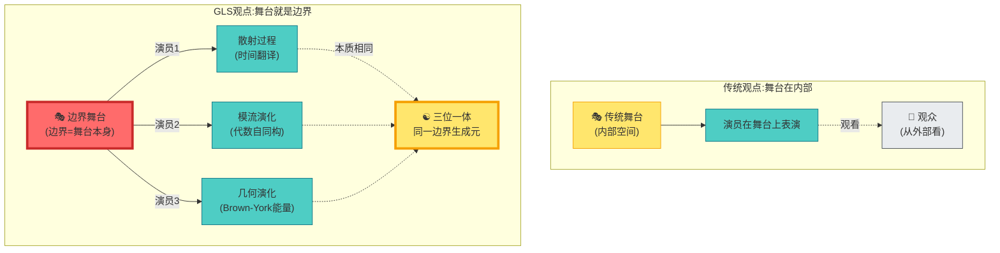
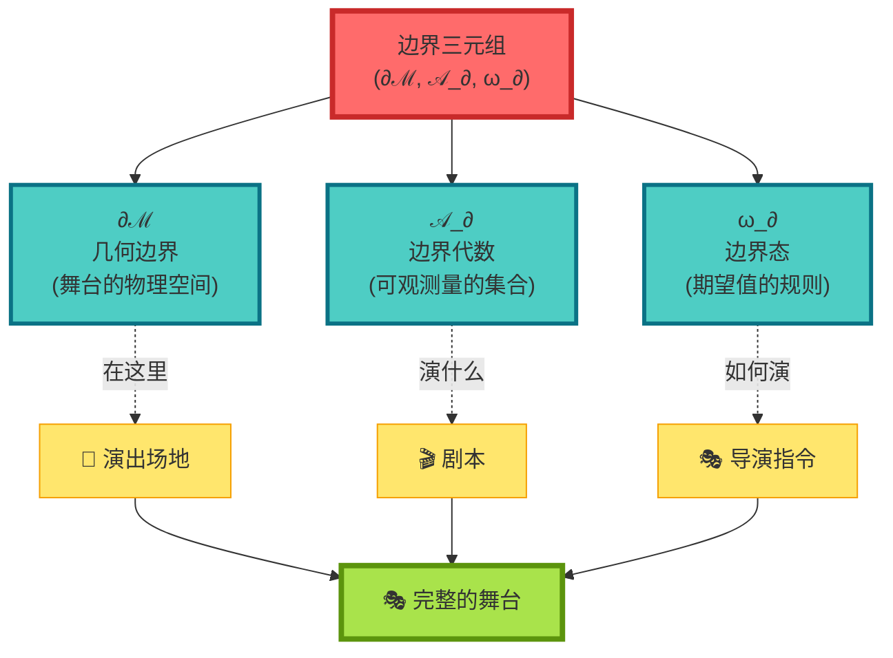
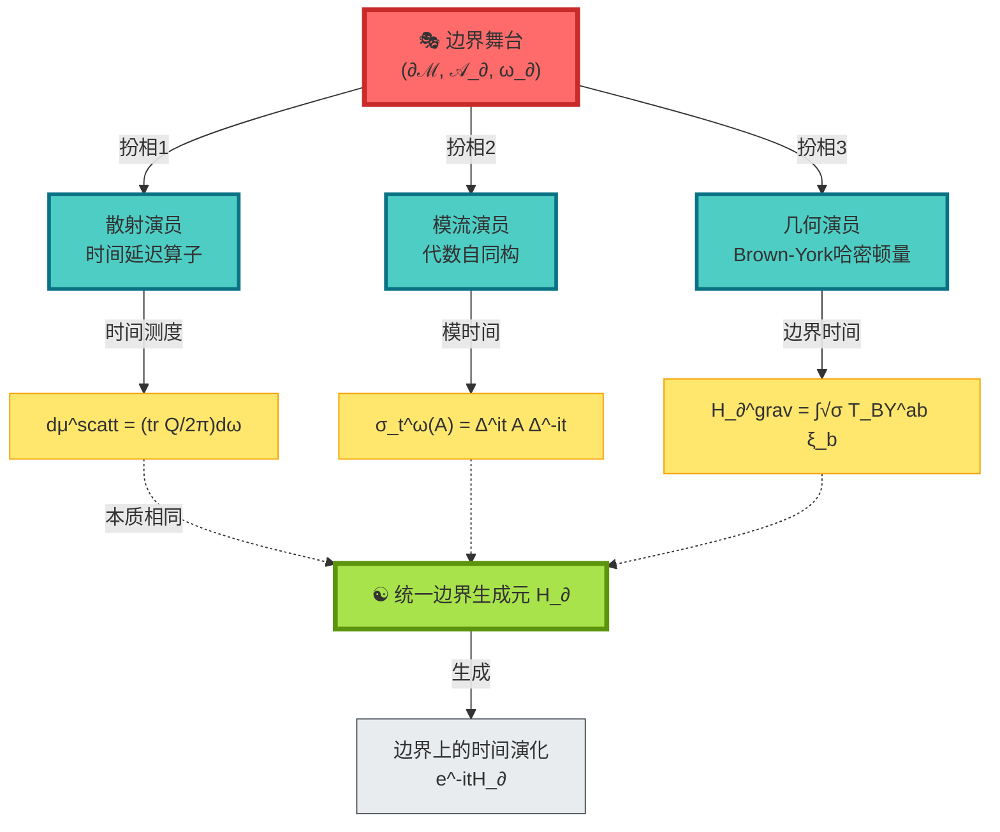
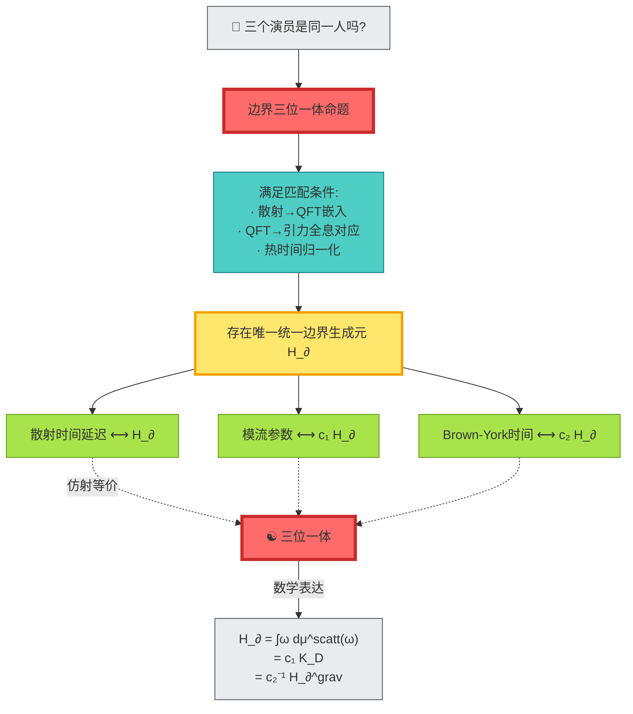
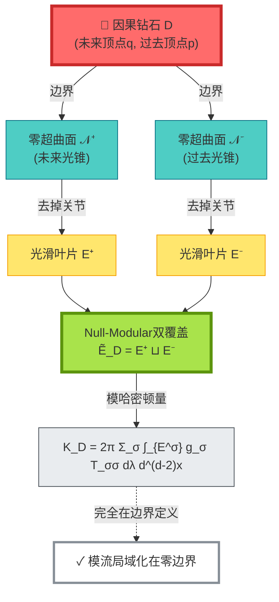
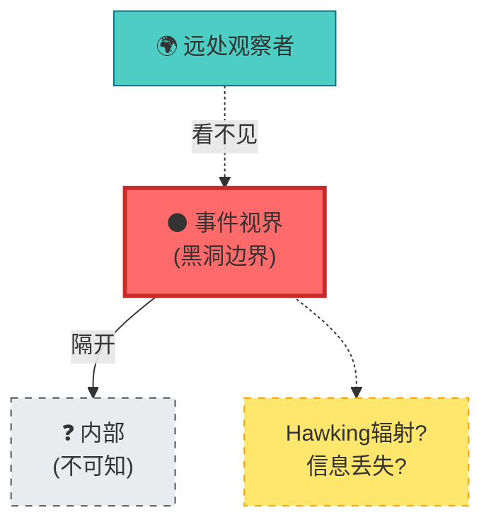
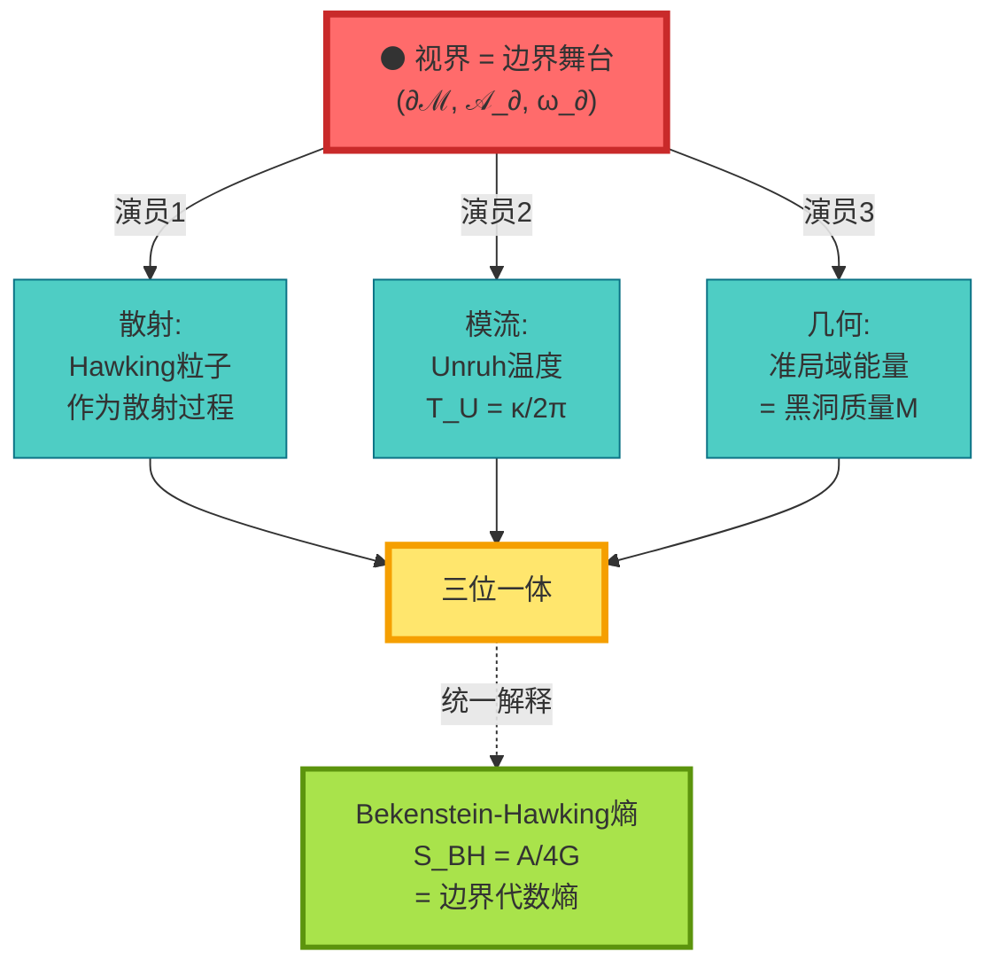
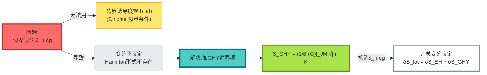
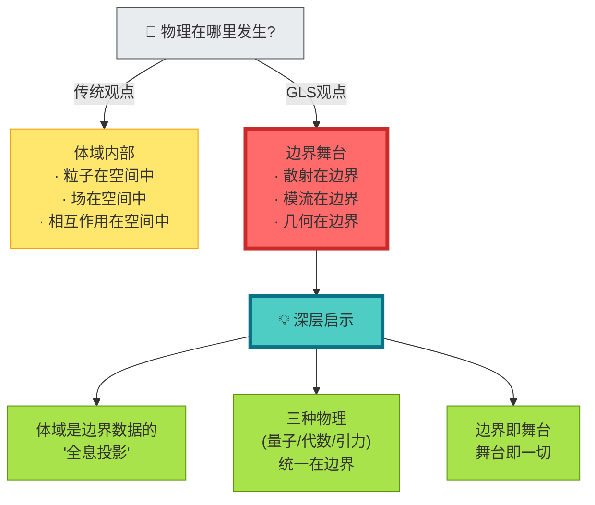
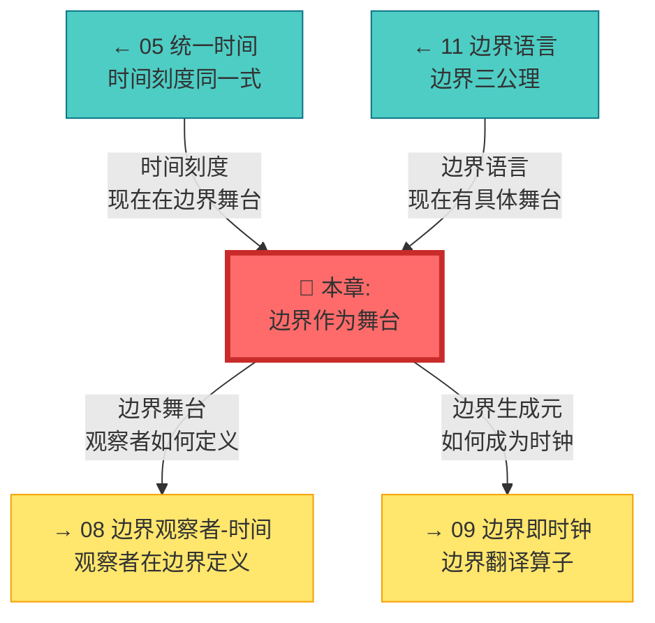

# 07 边界作为舞台:物理发生在"哪里"?

## 核心思想

在完成了统一时间理论(第5章)之后,我们现在要问一个更根本的问题:

> **物理发生在哪里?**

传统观点认为:**物理发生在空间内部**。粒子在空间中运动,场在空间中演化,力在空间中作用。

但GLS理论给出了颠覆性的答案:

> **物理的核心过程被认为发生在边界。体域内部被视为边界数据的"投影"或"全息像"。**

这就是**边界作为统一舞台**的核心思想。

---

## 日常类比:戏剧的舞台

想象你在看一出戏剧:

**关键洞察**:

- **传统观点**:舞台是内部的三维空间,演员在其中表演
- **GLS观点**:舞台**被视为边界**,所有"演员"(物理过程)在边界上表演
- 三个看似不同的"演员"(散射、模流、几何)其实是**同一个边界生成元的三种扮相**

---

## 边界三元组:统一的舞台设定

要定义"边界舞台",我们需要三个基本要素:

### 要素1:几何边界 ∂ℳ

**物理意义**:物理舞台的"地板"

**具体例子**:
- **散射理论**:时空的无穷远边界(入射/出射粒子从这里来/去)
- **黑洞**:事件视界(信息的最后边界)
- **AdS时空**:共形边界(全息CFT生活的地方)
- **宇宙学**:宇宙视界(我们能观察到的极限)

---

### 要素2:边界代数 𝒜_∂

**物理意义**:"剧本"——能观测什么

**构成**:
$$
\mathcal{A}_\partial = \text{边界上可观测量的全体}
$$

包括:
- 散射通道的创生/湮灭算符
- 边界场算符
- 准局域能量算符
- 边界应力张量

**数学结构**:von Neumann代数(带$*$运算的算符代数)

---

### 要素3:边界态 ω_∂

**物理意义**:"导演指令"——如何计算期望值

**定义**:
$$
\omega_\partial: \mathcal{A}_\partial \to \mathbb{C}
$$

满足:
- **正性**: $\omega_\partial(A^*A) \geq 0$
- **归一性**: $\omega_\partial(\mathbf{1}) = 1$
- **线性**: $\omega_\partial(aA + bB) = a\omega_\partial(A) + b\omega_\partial(B)$

**物理例子**:
- 真空态 $|0\rangle$
- KMS热平衡态(温度$\beta$)
- 相干态、压缩态等

---

## 三位演员,同一舞台

边界舞台上有三个"演员",看似不同,实则本质相同:

### 演员1:散射时间延迟(微观量子)

**角色设定**:

在边界(无穷远)测量入射/出射粒子

**关键道具**:

- **散射矩阵** $S(\omega)$
- **Wigner-Smith时间延迟算子** $Q(\omega) = -iS(\omega)^\dagger \partial_\omega S(\omega)$
- **Birman-Kreĭn谱移函数** $\xi(\omega)$

**台词**(刻度同一式):

$$
\frac{\varphi'(\omega)}{\pi} = \xi'(\omega) = \frac{1}{2\pi}\mathrm{tr}\,Q(\omega)
$$

**物理意义**:

粒子在散射区"停留"的时间 = 相位导数 = 谱密度变化

---

### 演员2:模流自同构(代数结构)

**角色设定**:

边界代数的自然演化

**关键道具**:

- **Tomita算符** $S$
- **模算符** $\Delta$
- **模流** $\sigma_t^\omega(A) = \Delta^{it} A \Delta^{-it}$

**台词**(模流公式):

$$
K_\partial = -\log \Delta, \quad \sigma_t^\omega = \Delta^{it}(\cdot)\Delta^{-it}
$$

**物理意义**:

模流参数 = **内禀时间**(由代数-态对自然诱导)

---

### 演员3:Brown-York边界能量(宏观引力)

**角色设定**:

边界上的准局域能量

**关键道具**:

- **GHY边界项** $S_{\mathrm{GHY}} = \frac{1}{8\pi G}\int_{\partial M}\sqrt{|h|}\,K$
- **Brown-York应力张量** $T_{\mathrm{BY}}^{ab} = \frac{2}{\sqrt{-h}}\frac{\delta S}{\delta h_{ab}}$
- **边界哈密顿量** $H_\partial^{\mathrm{grav}}[\xi] = \int \sqrt{\sigma}\,u_a T_{\mathrm{BY}}^{ab}\xi_b$

**台词**(准局域能量):

$$
H_\partial^{\mathrm{grav}}[\xi] = \int_{B} \sqrt{\sigma}\,u_a T_{\mathrm{BY}}^{ab}\xi_b\,\mathrm{d}^2x
$$

**物理意义**:

边界时间平移的生成元 = 准局域能量

---

## 边界三位一体定理

现在我们揭示这三个"演员"的秘密:

**命题内容**:

在满足匹配条件的前提下,理论上存在唯一的统一边界时间生成元 $H_\partial$(至仿射变换),使得:

$$
\text{散射时间} \Longleftrightarrow \text{模流时间} \Longleftrightarrow \text{Brown-York时间}
$$

在共同定义域内**等价**。

**日常比喻**:

- 三个演员是**同一人的三种扮相**
- 换不同服装(散射、模流、几何)
- 但本质是**同一个边界生成元**
- 就像Clark Kent = Superman = Kal-El

---

## Null-Modular双覆盖:零边界的特殊舞台

对于**零类边界**(null boundary,光锥),有一个特别优雅的结构:

**物理图像**:

想象一个**钻石**:
- 上顶点 = 未来某时刻
- 下顶点 = 过去某时刻
- 钻石表面 = 光锥(零类超曲面)

**Null-Modular双覆盖**:

将钻石表面分成两片"叶片":
- $E^+$ = 未来光锥(去掉尖端)
- $E^-$ = 过去光锥(去掉尖端)

**模哈密顿量**:

$$
K_D = 2\pi \sum_{\sigma=\pm} \int_{E^\sigma} g_\sigma(\lambda, x_\perp)\,T_{\sigma\sigma}(\lambda, x_\perp)\,\mathrm{d}\lambda\,\mathrm{d}^{d-2}x
$$

其中:
- $T_{++}, T_{--}$ = 沿两组零方向的应力张量分量
- $g_\sigma$ = 几何权函数(仅由钻石形状决定)

**关键**:模哈密顿量**完全定义在零边界**上!

---

## 具体例子:黑洞视界

### 传统观点:视界很神秘

### 边界舞台观点:视界是完整的舞台

**边界舞台解读**:

1. **散射视角**:
   - Hawking辐射 = 视界上的散射过程
   - 粒子创生 = $S$-矩阵的非对角元

2. **模流视角**:
   - Unruh温度 $T_U = \kappa/2\pi$ = 模流的周期
   - KMS条件 → 热平衡

3. **几何视角**:
   - 准局域能量 = 黑洞质量 $M$
   - Brown-York张量 → 视界应力

**统一结果**:

Bekenstein-Hawking熵:
$$
S_{\mathrm{BH}} = \frac{A}{4G} = \text{边界代数的von Neumann熵}
$$

**不需要知道黑洞内部!** 一切信息都在视界(边界)上。

---

## GHY边界项:为什么引力需要边界

### 问题:Einstein-Hilbert作用量不完整

考虑Einstein-Hilbert作用量:

$$
S_{\mathrm{EH}} = \frac{1}{16\pi G}\int_M \sqrt{-g}\,R\,\mathrm{d}^4x
$$

**变分**:

$$
\delta S_{\mathrm{EH}} = \text{(体积分)} + \text{(边界项)}
$$

边界项包含 $\partial_n \delta g$(度规变分的法向导数)!

**GHY边界项**:

$$
S_{\mathrm{GHY}} = \frac{1}{8\pi G}\int_{\partial M} \sqrt{|h|}\,K\,\mathrm{d}^3x
$$

其中:
- $h_{ab}$ = 边界诱导度规
- $K = K_{ab}h^{ab}$ = 外在曲率的迹

**加上GHY项后**:

$$
\delta(S_{\mathrm{EH}} + S_{\mathrm{GHY}}) = \frac{1}{16\pi G}\int_M \sqrt{-g}\,G_{\mu\nu}\delta g^{\mu\nu} + \frac{1}{16\pi G}\int_{\partial M}\sqrt{|h|}(K_{ab} - Kh_{ab})\delta h^{ab}
$$

- 体积项 → Einstein方程
- 边界项 → Brown-York应力张量

**深层意义**:

**引力被认为从根本上具有边界理论的特征！** 没有边界项,连变分都无法定义。

---

## 哲学意义:舞台即一切

**核心洞见**:

1. **全息原理的数学实现**:
   - 't Hooft/Susskind:三维信息可编码在二维表面
   - GLS:边界三元组 $(\partial\mathcal{M}, \mathcal{A}_\partial, \omega_\partial)$ 完全决定体域

2. **时间-代数-几何统一**:
   - 不是三个独立理论
   - 而是同一边界生成元的三种表示
   - $H_\partial = \int \omega\,\mathrm{d}\mu^{\mathrm{scatt}} = c_1 K_D = c_2^{-1} H_\partial^{\mathrm{grav}}$

3. **边界优先原则**:
   - 先定义边界
   - 体域是边界的"延拓"或"重建"
   - 可观测量都在边界

---

## 本章小结

**核心洞见**:

> **物理的真正舞台被认为是边界,而非体域。散射时间延迟、模流演化、Brown-York边界能量被视为同一边界生成元的三种扮相,统一在边界三元组(∂ℳ, 𝒜_∂, ω_∂)上。**

**关键公式**:

边界三元组:
$$
(\partial\mathcal{M}, \mathcal{A}_\partial, \omega_\partial)
$$

边界三位一体:
$$
\frac{\varphi'(\omega)}{\pi} = \xi'(\omega) = \frac{1}{2\pi}\mathrm{tr}\,Q(\omega) \Longleftrightarrow K_D \Longleftrightarrow H_\partial^{\mathrm{grav}}
$$

Null-Modular双覆盖:
$$
K_D = 2\pi \sum_{\sigma=\pm} \int_{E^\sigma} g_\sigma\,T_{\sigma\sigma}\,\mathrm{d}\lambda\,\mathrm{d}^{d-2}x
$$

GHY边界项:
$$
S_{\mathrm{GHY}} = \frac{1}{8\pi G}\int_{\partial M} \sqrt{|h|}\,K\,\mathrm{d}^3x
$$

**日常比喻**:

- **戏剧舞台**:演员在舞台(边界)上表演
- **三种扮相**:同一演员(边界生成元)的不同装扮
- **钻石双面**:Null-Modular双覆盖 = 钻石的两片光滑叶片

**三位一体**:

| 视角 | 舞台元素 | 时间生成元 |
|------|----------|------------|
| 散射 | $S(\omega), Q(\omega)$ | $\mathrm{tr}\,Q/2\pi$ |
| 模流 | $\Delta, \sigma_t^\omega$ | $K_D = -\log\Delta$ |
| 几何 | $T_{\mathrm{BY}}^{ab}$ | $H_\partial^{\mathrm{grav}}$ |

**哲学启示**:

宇宙不是一个"盒子"(体域),而是一个"舞台"(边界)。我们看到的三维空间,只是边界数据的全息投影。

---

## 与其他章节的联系

---

## 延伸阅读

**源理论文献**:
- `docs/euler-gls-paper-bondary/boundary-as-unified-stage.md` - 边界作为统一舞台的完整数学框架

**相关章节**:
- [05 统一时间](../05-unified-time/) - 时间刻度理论基础
- [11 边界语言](../05-unified-time/11-boundary-language.md) - 边界语言三公理
- [01 为什么是边界](./01-why-boundary.md) - 边界优先的动机
- [04 Brown-York能量](./04-brown-york-energy.md) - 准局域能量详解

---

*下一章,我们将探讨**边界观察者与时间**,看看观察者如何在边界舞台上定义。*
