# 07 Boundary as Stage: Where Does Physics Happen?

## Core Idea

After completing unified time theory (Chapter 5), we now ask a more fundamental question:

> **Where does physics happen?**

Traditional view holds: **Physics happens in spatial interior**. Particles move in space, fields evolve in space, forces act in space.

But GLS theory gives a subversive answer:

> **The place where physics truly happens is considered to be the boundary. The bulk interior is viewed as a "projection" or "holographic image" of boundary data.**

This is the core idea of **boundary as unified stage**.

---

## Everyday Analogy: Theater Stage

Imagine you're watching a play:

**Key Insight**:

- **Traditional View**: Stage is three-dimensional interior space, actors perform within it
- **GLS View**: Stage **is viewed as the boundary**, all "actors" (physical processes) perform on the boundary
- Three seemingly different "actors" (scattering, modular flow, geometry) are actually **three guises of the same boundary generator**

---

## Boundary Triple: Unified Stage Setting

To define "boundary stage," we need three basic elements:

```mermaid
graph TB
    Triple["Boundary Triple<br/>(∂ℳ, 𝒜_∂, ω_∂)"]

    Triple --> Element1["∂ℳ<br/>Geometric Boundary<br/>(Physical Space of Stage)"]
    Triple --> Element2["𝒜_∂<br/>Boundary Algebra<br/>(Set of Observables)"]
    Triple --> Element3["ω_∂<br/>Boundary State<br/>(Rule for Expectation Values)"]

    Element1 -.->|"Where"| Where["📍 Performance Venue"]
    Element2 -.->|"What"| What["🎬 Script"]
    Element3 -.->|"How"| How["🎭 Director's Instructions"]

    Where --> Stage["🎭 Complete Stage"]
    What --> Stage
    How --> Stage

    style Triple fill:#ff6b6b,stroke:#c92a2a,stroke-width:4px
    style Element1 fill:#4ecdc4,stroke:#0b7285,stroke-width:3px
    style Element2 fill:#4ecdc4,stroke:#0b7285,stroke-width:3px
    style Element3 fill:#4ecdc4,stroke:#0b7285,stroke-width:3px
    style Where fill:#ffe66d,stroke:#f59f00
    style What fill:#ffe66d,stroke:#f59f00
    style How fill:#ffe66d,stroke:#f59f00
    style Stage fill:#a9e34b,stroke:#5c940d,stroke-width:4px
```

### Element 1: Geometric Boundary ∂ℳ

**Physical Meaning**: "Floor" of physical stage

**Concrete Examples**:
- **Scattering Theory**: Spacetime infinity boundary (incoming/outgoing particles come/go from here)
- **Black Hole**: Event horizon (final boundary of information)
- **AdS Spacetime**: Conformal boundary (where holographic CFT lives)
- **Cosmology**: Cosmological horizon (limit of what we can observe)

---

### Element 2: Boundary Algebra 𝒜_∂

**Physical Meaning**: "Script"—what can be observed

**Composition**:
$$
\mathcal{A}_\partial = \text{All Observables on Boundary}
$$

Including:
- Creation/annihilation operators of scattering channels
- Boundary field operators
- Quasi-local energy operators
- Boundary stress tensor

**Mathematical Structure**: von Neumann algebra (operator algebra with $*$ operation)

---

### Element 3: Boundary State ω_∂

**Physical Meaning**: "Director's Instructions"—how to compute expectation values

**Definition**:
$$
\omega_\partial: \mathcal{A}_\partial \to \mathbb{C}
$$

Satisfying:
- **Positivity**: $\omega_\partial(A^*A) \geq 0$
- **Normalization**: $\omega_\partial(\mathbf{1}) = 1$
- **Linearity**: $\omega_\partial(aA + bB) = a\omega_\partial(A) + b\omega_\partial(B)$

**Physical Examples**:
- Vacuum state $|0\rangle$
- KMS thermal equilibrium state (temperature $\beta$)
- Coherent states, squeezed states, etc.

---

## Three Actors, One Stage

On the boundary stage, there are three "actors," seemingly different, but essentially the same:

```mermaid
graph TB
    Stage["🎭 Boundary Stage<br/>(∂ℳ, 𝒜_∂, ω_∂)"]

    Stage -->|"Guise 1"| Actor1["Scattering Actor<br/>Time Delay Operator"]
    Stage -->|"Guise 2"| Actor2["Modular Flow Actor<br/>Algebra Automorphism"]
    Stage -->|"Guise 3"| Actor3["Geometric Actor<br/>Brown-York Hamiltonian"]

    Actor1 -->|"Time Measure"| Time1["dμ^scatt = (tr Q/2π)dω"]
    Actor2 -->|"Modular Time"| Time2["σ_t^ω(A) = Δ^it A Δ^-it"]
    Actor3 -->|"Boundary Time"| Time3["H_∂^grav = ∫√σ T_BY^ab ξ_b"]

    Time1 -.->|"Same Essence"| Unity["☯️ Unified Boundary Generator H_∂"]
    Time2 -.-> Unity
    Time3 -.-> Unity

    Unity -->|"Generates"| Evolution["Time Evolution on Boundary<br/>e^-itH_∂"]

    style Stage fill:#ff6b6b,stroke:#c92a2a,stroke-width:4px
    style Actor1 fill:#4ecdc4,stroke:#0b7285,stroke-width:3px
    style Actor2 fill:#4ecdc4,stroke:#0b7285,stroke-width:3px
    style Actor3 fill:#4ecdc4,stroke:#0b7285,stroke-width:3px
    style Time1 fill:#ffe66d,stroke:#f59f00
    style Time2 fill:#ffe66d,stroke:#f59f00
    style Time3 fill:#ffe66d,stroke:#f59f00
    style Unity fill:#a9e34b,stroke:#5c940d,stroke-width:4px
    style Evolution fill:#e9ecef,stroke:#495057
```

### Actor 1: Scattering Time Delay (Microscopic Quantum)

**Character Setting**:

Measure incoming/outgoing particles at boundary (infinity)

**Key Props**:

- **Scattering matrix** $S(\omega)$
- **Wigner-Smith time delay operator** $Q(\omega) = -iS(\omega)^\dagger \partial_\omega S(\omega)$
- **Birman-Kreĭn spectral shift function** $\xi(\omega)$

**Lines** (scale identity):

$$
\frac{\varphi'(\omega)}{\pi} = \xi'(\omega) = \frac{1}{2\pi}\mathrm{tr}\,Q(\omega)
$$

**Physical Meaning**:

Time particles "dwell" in scattering region = phase derivative = spectral density change

---

### Actor 2: Modular Flow Automorphism (Algebraic Structure)

**Character Setting**:

Natural evolution of boundary algebra

**Key Props**:

- **Tomita operator** $S$
- **Modular operator** $\Delta$
- **Modular flow** $\sigma_t^\omega(A) = \Delta^{it} A \Delta^{-it}$

**Lines** (modular flow formula):

$$
K_\partial = -\log \Delta, \quad \sigma_t^\omega = \Delta^{it}(\cdot)\Delta^{-it}
$$

**Physical Meaning**:

Modular flow parameter = **intrinsic time** (naturally induced by algebra-state pair)

---

### Actor 3: Brown-York Boundary Energy (Macroscopic Gravity)

**Character Setting**:

Quasi-local energy on boundary

**Key Props**:

- **GHY boundary term** $S_{\mathrm{GHY}} = \frac{1}{8\pi G}\int_{\partial M}\sqrt{|h|}\,K$
- **Brown-York stress tensor** $T_{\mathrm{BY}}^{ab} = \frac{2}{\sqrt{-h}}\frac{\delta S}{\delta h_{ab}}$
- **Boundary Hamiltonian** $H_\partial^{\mathrm{grav}}[\xi] = \int \sqrt{\sigma}\,u_a T_{\mathrm{BY}}^{ab}\xi_b$

**Lines** (quasi-local energy):

$$
H_\partial^{\mathrm{grav}}[\xi] = \int_{B} \sqrt{\sigma}\,u_a T_{\mathrm{BY}}^{ab}\xi_b\,\mathrm{d}^2x
$$

**Physical Meaning**:

Generator of boundary time translation = quasi-local energy

---

## Boundary Trinity Theorem

Now we reveal the secret of these three "actors":

```mermaid
graph TB
    Question["🤔 Are Three Actors the Same Person?"]

    Question --> Theorem["Boundary Trinity Proposition"]

    Theorem --> Condition["Satisfy Matching Conditions:<br/>· Scattering→QFT Embedding<br/>· QFT→Gravity Holographic Correspondence<br/>· Thermal Time Normalization"]

    Condition --> Result["Unique Unified Boundary Generator H_∂ Exists"]

    Result --> R1["Scattering Time Delay ⟷ H_∂"]
    Result --> R2["Modular Flow Parameter ⟷ c₁ H_∂"]
    Result --> R3["Brown-York Time ⟷ c₂ H_∂"]

    R1 -.->|"Affine Equivalent"| Unity["☯️ Trinity"]
    R2 -.-> Unity
    R3 -.-> Unity

    Unity -->|"Mathematical Expression"| Formula["H_∂ = ∫ω dμ^scatt(ω)<br/>= c₁ K_D<br/>= c₂⁻¹ H_∂^grav"]

    style Question fill:#e9ecef,stroke:#495057
    style Theorem fill:#ff6b6b,stroke:#c92a2a,stroke-width:4px
    style Condition fill:#4ecdc4,stroke:#0b7285
    style Result fill:#ffe66d,stroke:#f59f00,stroke-width:3px
    style R1 fill:#a9e34b,stroke:#5c940d
    style R2 fill:#a9e34b,stroke:#5c940d
    style R3 fill:#a9e34b,stroke:#5c940d
    style Unity fill:#ff6b6b,stroke:#c92a2a,stroke-width:4px
    style Formula fill:#e9ecef,stroke:#495057
```

**Proposition Content**:

Under the premise of satisfying matching conditions, there theoretically exists a unique unified boundary time generator $H_\partial$ (up to affine transformation) such that:

$$
\text{Scattering Time} \Longleftrightarrow \text{Modular Flow Time} \Longleftrightarrow \text{Brown-York Time}
$$

Are **equivalent** in common domain.

**Everyday Analogy**:

- Three actors are **three guises of the same person**
- Change different costumes (scattering, modular flow, geometry)
- But essence is **the same boundary generator**
- Like Clark Kent = Superman = Kal-El

---

## Null-Modular Double Cover: Special Stage of Null Boundary

For **null boundaries** (light cones), there is a particularly elegant structure:

```mermaid
graph TB
    Diamond["💎 Causal Diamond D<br/>(Future Vertex q, Past Vertex p)"]

    Diamond -->|"Boundary"| Null1["Null Hypersurface 𝒩⁺<br/>(Future Light Cone)"]
    Diamond -->|"Boundary"| Null2["Null Hypersurface 𝒩⁻<br/>(Past Light Cone)"]

    Null1 -->|"Remove Joint"| E1["Smooth Leaf E⁺"]
    Null2 -->|"Remove Joint"| E2["Smooth Leaf E⁻"]

    Cover["Null-Modular Double Cover<br/>Ẽ_D = E⁺ ⊔ E⁻"]

    E1 --> Cover
    E2 --> Cover

    Cover -->|"Modular Hamiltonian"| ModH["K_D = 2π Σ_σ ∫_{E^σ} g_σ T_σσ dλ d^(d-2)x"]

    ModH -.->|"Completely Defined on Boundary"| Boundary["✓ Modular Flow Localized on Null Boundary"]

    style Diamond fill:#ff6b6b,stroke:#c92a2a,stroke-width:4px
    style Null1 fill:#4ecdc4,stroke:#0b7285
    style Null2 fill:#4ecdc4,stroke:#0b7285
    style E1 fill:#ffe66d,stroke:#f59f00
    style E2 fill:#ffe66d,stroke:#f59f00
    style Cover fill:#a9e34b,stroke:#5c940d,stroke-width:4px
    style ModH fill:#e9ecef,stroke:#495057
    style Boundary fill:#fff,stroke:#868e96,stroke-width:3px
```

**Physical Image**:

Imagine a **diamond**:
- Top vertex = some future time
- Bottom vertex = some past time
- Diamond surface = light cone (null hypersurface)

**Null-Modular Double Cover**:

Divide diamond surface into two "leaves":
- $E^+$ = Future light cone (remove tip)
- $E^-$ = Past light cone (remove tip)

**Modular Hamiltonian**:

$$
K_D = 2\pi \sum_{\sigma=\pm} \int_{E^\sigma} g_\sigma(\lambda, x_\perp)\,T_{\sigma\sigma}(\lambda, x_\perp)\,\mathrm{d}\lambda\,\mathrm{d}^{d-2}x
$$

Where:
- $T_{++}, T_{--}$ = Stress tensor components along two sets of null directions
- $g_\sigma$ = Geometric weight function (determined only by diamond shape)

**Key**: Modular Hamiltonian is **completely defined on null boundary**!

---

## Concrete Example: Black Hole Horizon

### Traditional View: Horizon is Mysterious

```mermaid
graph TB
    Far["🌍 Distant Observer"]
    Horizon["⚫ Event Horizon<br/>(Black Hole Boundary)"]
    Inside["❓ Interior<br/>(Unknown)"]

    Far -.->|"Cannot See"| Horizon
    Horizon -->|"Separates"| Inside

    Hawking["Hawking Radiation?<br/>Information Loss?"]

    Horizon -.-> Hawking

    style Far fill:#4ecdc4,stroke:#0b7285
    style Horizon fill:#ff6b6b,stroke:#c92a2a,stroke-width:3px
    style Inside fill:#e9ecef,stroke:#495057,stroke-dasharray: 5 5
    style Hawking fill:#ffe66d,stroke:#f59f00,stroke-dasharray: 5 5
```

### Boundary Stage View: Horizon is Complete Stage

```mermaid
graph TB
    Horizon2["⚫ Horizon = Boundary Stage<br/>(∂ℳ, 𝒜_∂, ω_∂)"]

    Horizon2 -->|"Actor 1"| Scatt["Scattering:<br/>Hawking Particles<br/>As Scattering Process"]

    Horizon2 -->|"Actor 2"| Mod["Modular Flow:<br/>Unruh Temperature<br/>T_U = κ/2π"]

    Horizon2 -->|"Actor 3"| Geom["Geometry:<br/>Quasi-Local Energy<br/>= Black Hole Mass M"]

    Trinity["Trinity"]

    Scatt --> Trinity
    Mod --> Trinity
    Geom --> Trinity

    Trinity -.->|"Unified Explanation"| Result["Bekenstein-Hawking Entropy<br/>S_BH = A/4G<br/>= Boundary Algebra Entropy"]

    style Horizon2 fill:#ff6b6b,stroke:#c92a2a,stroke-width:4px
    style Scatt fill:#4ecdc4,stroke:#0b7285
    style Mod fill:#4ecdc4,stroke:#0b7285
    style Geom fill:#4ecdc4,stroke:#0b7285
    style Trinity fill:#ffe66d,stroke:#f59f00,stroke-width:4px
    style Result fill:#a9e34b,stroke:#5c940d,stroke-width:3px
```

**Boundary Stage Interpretation**:

1. **Scattering Perspective**:
   - Hawking radiation = Scattering process on horizon
   - Particle creation = Off-diagonal elements of $S$-matrix

2. **Modular Flow Perspective**:
   - Unruh temperature $T_U = \kappa/2\pi$ = Period of modular flow
   - KMS condition → Thermal equilibrium

3. **Geometric Perspective**:
   - Quasi-local energy = Black hole mass $M$
   - Brown-York tensor → Horizon stress

**Unified Result**:

Bekenstein-Hawking entropy:
$$
S_{\mathrm{BH}} = \frac{A}{4G} = \text{von Neumann Entropy of Boundary Algebra}
$$

**No need to know black hole interior!** All information is on horizon (boundary).

---

## GHY Boundary Term: Why Gravity Needs Boundary

### Problem: Einstein-Hilbert Action is Incomplete

Consider Einstein-Hilbert action:

$$
S_{\mathrm{EH}} = \frac{1}{16\pi G}\int_M \sqrt{-g}\,R\,\mathrm{d}^4x
$$

**Variation**:

$$
\delta S_{\mathrm{EH}} = \text{(Volume Integral)} + \text{(Boundary Term)}
$$

Boundary term contains $\partial_n \delta g$ (normal derivative of metric variation)!

```mermaid
graph LR
    Problem["Problem:<br/>Boundary Term Contains ∂_n δg"]

    Problem -->|"Cannot Use"| Boundary["Boundary Induced Metric h_ab<br/>(Dirichlet Boundary Conditions)"]

    Problem -->|"Causes"| Issue["Variation Ill-Defined<br/>Hamiltonian Form Doesn't Exist"]

    Solution["Solution: Add GHY Boundary Term"]

    Issue --> Solution

    Solution --> GHY["S_GHY = (1/8πG)∫_∂M √|h| K"]

    GHY -.->|"Cancels ∂_n δg"| Fixed["✓ Total Variation Well-Defined<br/>δS_tot = δS_EH + δS_GHY"]

    style Problem fill:#ff6b6b,stroke:#c92a2a,stroke-width:3px
    style Boundary fill:#ffe66d,stroke:#f59f00
    style Issue fill:#e9ecef,stroke:#495057
    style Solution fill:#4ecdc4,stroke:#0b7285,stroke-width:4px
    style GHY fill:#a9e34b,stroke:#5c940d,stroke-width:3px
    style Fixed fill:#fff,stroke:#868e96,stroke-width:3px
```

**GHY Boundary Term**:

$$
S_{\mathrm{GHY}} = \frac{1}{8\pi G}\int_{\partial M} \sqrt{|h|}\,K\,\mathrm{d}^3x
$$

Where:
- $h_{ab}$ = Boundary induced metric
- $K = K_{ab}h^{ab}$ = Trace of extrinsic curvature

**After Adding GHY Term**:

$$
\delta(S_{\mathrm{EH}} + S_{\mathrm{GHY}}) = \frac{1}{16\pi G}\int_M \sqrt{-g}\,G_{\mu\nu}\delta g^{\mu\nu} + \frac{1}{16\pi G}\int_{\partial M}\sqrt{|h|}(K_{ab} - Kh_{ab})\delta h^{ab}
$$

- Volume term → Einstein equations
- Boundary term → Brown-York stress tensor

**Deep Meaning**:

**Gravity is considered to be fundamentally a boundary theory!** Without boundary term, even variation cannot be defined.

---

## Philosophical Meaning: Stage Is Everything

```mermaid
graph TB
    Question["🤔 Where Does Physics Happen?"]

    Question -->|"Traditional View"| Bulk["Bulk Interior<br/>· Particles in Space<br/>· Fields in Space<br/>· Interactions in Space"]

    Question -->|"GLS View"| Boundary["Boundary Stage<br/>· Scattering on Boundary<br/>· Modular Flow on Boundary<br/>· Geometry on Boundary"]

    Boundary --> Insight["💡 Deep Revelations"]

    Insight --> I1["Bulk is 'Holographic<br/>Projection' of Boundary Data"]
    Insight --> I2["Three Physics<br/>(Quantum/Algebra/Gravity)<br/>Unified on Boundary"]
    Insight --> I3["Boundary is Stage<br/>Stage is Everything"]

    style Question fill:#e9ecef,stroke:#495057
    style Bulk fill:#ffe66d,stroke:#f59f00
    style Boundary fill:#ff6b6b,stroke:#c92a2a,stroke-width:4px
    style Insight fill:#4ecdc4,stroke:#0b7285,stroke-width:4px
    style I1 fill:#a9e34b,stroke:#5c940d
    style I2 fill:#a9e34b,stroke:#5c940d
    style I3 fill:#a9e34b,stroke:#5c940d
```

**Core Insights**:

1. **Mathematical Realization of Holographic Principle**:
   - 't Hooft/Susskind: Three-dimensional information can be encoded on two-dimensional surface
   - GLS: Boundary triple $(\partial\mathcal{M}, \mathcal{A}_\partial, \omega_\partial)$ completely determines bulk

2. **Time-Algebra-Geometry Unification**:
   - Not three independent theories
   - But three representations of the same boundary generator
   - $H_\partial = \int \omega\,\mathrm{d}\mu^{\mathrm{scatt}} = c_1 K_D = c_2^{-1} H_\partial^{\mathrm{grav}}$

3. **Boundary Priority Principle**:
   - Define boundary first
   - Bulk is "extension" or "reconstruction" of boundary
   - All observables are on boundary

---

## Chapter Summary

**Core Insight**:

> **The true stage of physics is considered to be the boundary, not the bulk. Scattering time delay, modular flow evolution, and Brown-York boundary energy are viewed as three guises of the same boundary generator, unified on boundary triple (∂ℳ, 𝒜_∂, ω_∂).**

**Key Formulas**:

Boundary triple:
$$
(\partial\mathcal{M}, \mathcal{A}_\partial, \omega_\partial)
$$

Boundary trinity:
$$
\frac{\varphi'(\omega)}{\pi} = \xi'(\omega) = \frac{1}{2\pi}\mathrm{tr}\,Q(\omega) \Longleftrightarrow K_D \Longleftrightarrow H_\partial^{\mathrm{grav}}
$$

Null-Modular double cover:
$$
K_D = 2\pi \sum_{\sigma=\pm} \int_{E^\sigma} g_\sigma\,T_{\sigma\sigma}\,\mathrm{d}\lambda\,\mathrm{d}^{d-2}x
$$

GHY boundary term:
$$
S_{\mathrm{GHY}} = \frac{1}{8\pi G}\int_{\partial M} \sqrt{|h|}\,K\,\mathrm{d}^3x
$$

**Everyday Analogies**:

- **Theater stage**: Actors perform on stage (boundary)
- **Three guises**: Same actor (boundary generator) in different costumes
- **Diamond double face**: Null-Modular double cover = two smooth leaves of diamond

**Trinity**:

| Perspective | Stage Element | Time Generator |
|------------|--------------|----------------|
| Scattering | $S(\omega), Q(\omega)$ | $\mathrm{tr}\,Q/2\pi$ |
| Modular Flow | $\Delta, \sigma_t^\omega$ | $K_D = -\log\Delta$ |
| Geometry | $T_{\mathrm{BY}}^{ab}$ | $H_\partial^{\mathrm{grav}}$ |

**Philosophical Revelation**:

The universe is not a "box" (bulk), but a "stage" (boundary). The three-dimensional space we see is just a holographic projection of boundary data.

---

## Connections to Other Chapters

```mermaid
graph TB
    Current["📍 This Chapter:<br/>Boundary as Stage"]

    Prev1["← 05 Unified Time<br/>Time Scale Identity"]
    Prev2["← 11 Boundary Language<br/>Three Boundary Axioms"]

    Next1["→ 08 Boundary Observer-Time<br/>Observer Defined on Boundary"]
    Next2["→ 09 Boundary as Clock<br/>Boundary Translation Operator"]

    Prev1 -->|"Time Scale<br/>Now on Boundary Stage"| Current
    Prev2 -->|"Boundary Language<br/>Now Has Concrete Stage"| Current

    Current -->|"Boundary Stage<br/>How Observer Defined"| Next1
    Current -->|"Boundary Generator<br/>How Becomes Clock"| Next2

    style Current fill:#ff6b6b,stroke:#c92a2a,stroke-width:4px
    style Prev1 fill:#4ecdc4,stroke:#0b7285
    style Prev2 fill:#4ecdc4,stroke:#0b7285
    style Next1 fill:#ffe66d,stroke:#f59f00
    style Next2 fill:#ffe66d,stroke:#f59f00
```

---

## Extended Reading

**Source Theoretical Literature**:
- `docs/euler-gls-paper-bondary/boundary-as-unified-stage.md` - Complete mathematical framework of boundary as unified stage

**Related Chapters**:
- [05 Unified Time](../05-unified-time/) - Theoretical foundation of time scale
- [11 Boundary Language](../05-unified-time/11-boundary-language_en.md) - Three axioms of boundary language
- [01 Why Boundary](./01-why-boundary_en.md) - Motivation for boundary priority
- [04 Brown-York Energy](./04-brown-york-energy_en.md) - Detailed explanation of quasi-local energy

---

*In the next chapter, we will explore **boundary observer and time**, seeing how observers are defined on the boundary stage.*

