# 08 边界、观察者与时间:谁在"看"?谁在"流动"?

## 核心思想

在第07章我们知道**物理发生在边界**,但还有一个更深问题:

- 没有观察者时,边界是什么样?
- 观察者"看"到的世界是什么数学对象?
- **时间是观察者"注意力"的产物吗?**

答案令人震撼:**时间轴被建模为观察者注意力在边界截面族上选择的测地线。**

## 日常类比:电影放映与观众视角

想象你在电影院:

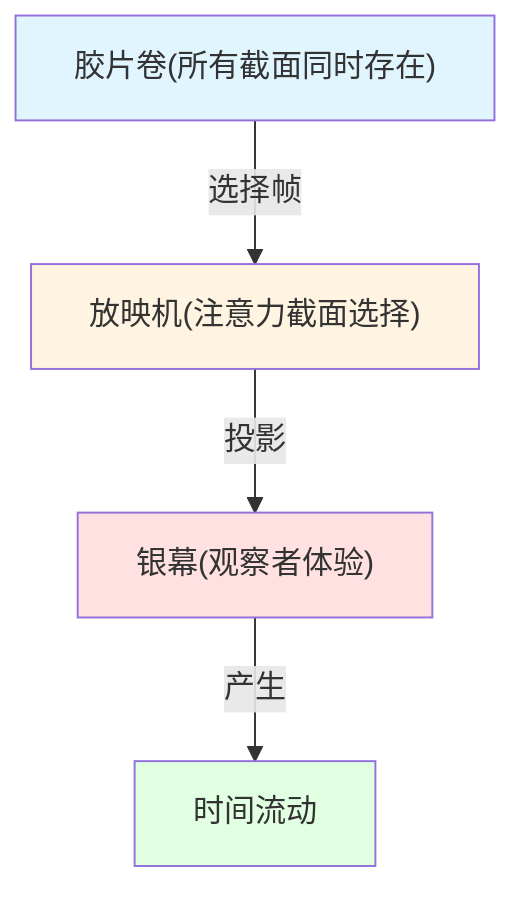

**关键理解:**

1. **胶片卷=边界宇宙**: 所有可能的"截面"(电影帧)同时存在
2. **放映机=观察者注意力**: 每次只选一帧投影到银幕
3. **银幕图像=经验世界**: 观察者"看到"的单一截面
4. **时间流动=放映速度**: 注意力在截面族上的移动参数

**没有观察者时:** 胶片卷静静躺在片库,所有帧同时存在,**被认为没有"时间流动"。**

**有观察者时:** 放映机开始工作,一帧帧播放,观众"感受"到时间。

## 三个关键概念

### 1. 边界时间几何(BTG):时间的三位一体

回顾第05章,时间刻度同一式:

$$
\kappa(\omega) = \frac{\varphi'(\omega)}{\pi} = \rho_{\text{rel}}(\omega) = \frac{1}{2\pi}\operatorname{tr}Q(\omega)
$$

这告诉我们:**时间刻度已经编码在边界数据中**,但有无数种方式选择"哪个刻度当时间轴"!

类比:
- **刻度母尺** = 城市地图上的比例尺(每cm=100m)
- **时间轴** = 你实际行走的路线(选择的测地线)

**无观察者时:** 地图与比例尺都存在,但没有"哪条路是你的路"。

**有观察者时:** 你选择一条路线,这条路的长度用比例尺测量,成为"你的时间"。

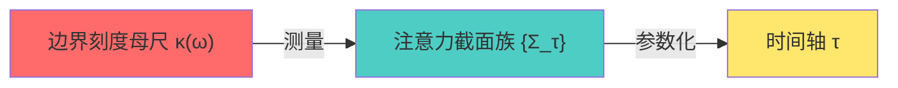

### 2. 观察者三元组:谁在看?

在BTG框架中,**观察者**不是一个"点",而是三件事的组合:

$$
\mathcal{O} = (\gamma, \Lambda, \mathcal{A}_{\gamma,\Lambda})
$$

1. **世界线 $\gamma$**: 观察者在时空中的轨迹(你走的路)
2. **分辨率 $\Lambda$**: 观察者能"看清"的最小尺度(眼睛分辨率)
3. **可观测代数 $\mathcal{A}_{\gamma,\Lambda}$**: 观察者能测量的物理量(你有的仪器)

**日常类比:** 你去看画展

- $\gamma$ = 你在展厅走的路线
- $\Lambda$ = 你的视力(近视需要戴眼镜)
- $\mathcal{A}_{\gamma,\Lambda}$ = 你能看到的那些画(有些太高/太远看不到)

**不同观察者** = 不同的$(\gamma,\Lambda,\mathcal{A})$组合 → 看到**不同的"世界截面"**!

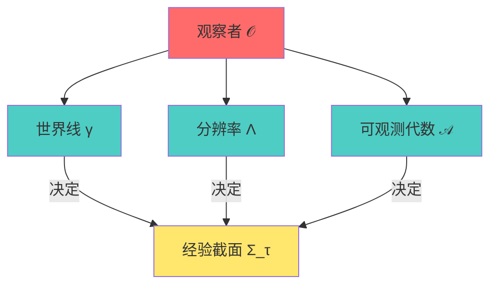

### 3. 注意力截面与时间轴:如何"选择"时间?

在给定观察者$\mathcal{O}$的每个本征时间$\tau$,定义**世界截面**:

$$
\Sigma_\tau = (\gamma(\tau), \mathcal{A}_{\gamma,\Lambda}(\tau), \rho_{\gamma,\Lambda}(\tau))
$$

这是观察者在$\tau$时刻"看到"的世界:

- $\gamma(\tau)$ = 你在时空中的位置
- $\mathcal{A}_{\gamma,\Lambda}(\tau)$ = 你此刻能测量的物理量
- $\rho_{\gamma,\Lambda}(\tau)$ = 这些物理量的量子态

**但关键问题:**

$\tau$本身是什么?如何确定?

**答案(注意力测地线命题):**

时间轴$\tau$必须同时满足两个条件:

1. **刻度条件**: 相对于边界刻度母尺$\kappa(\omega)$的读数保持一致
   $$
   \frac{d\tau}{d\lambda} = \int \kappa(\omega) w_\lambda(\omega) d\omega
   $$

2. **广义熵测地线条件**: 截面族$\{\sigma(\tau)\}$满足
   - 每个截面$\sigma(\tau)$是广义熵$S_{\text{gen}}$的驻点
   - 沿截面族,量子膨胀$\Theta(\lambda)$单调不增

**日常类比:** 爬山选路

1. **刻度条件** = 用GPS测量行走距离(必须沿地表,不能隧穿)
2. **测地线条件** = 选最省力的路(最短/最平路径)

**你的时间** = 沿最优路径,用GPS刻度测量的参数!

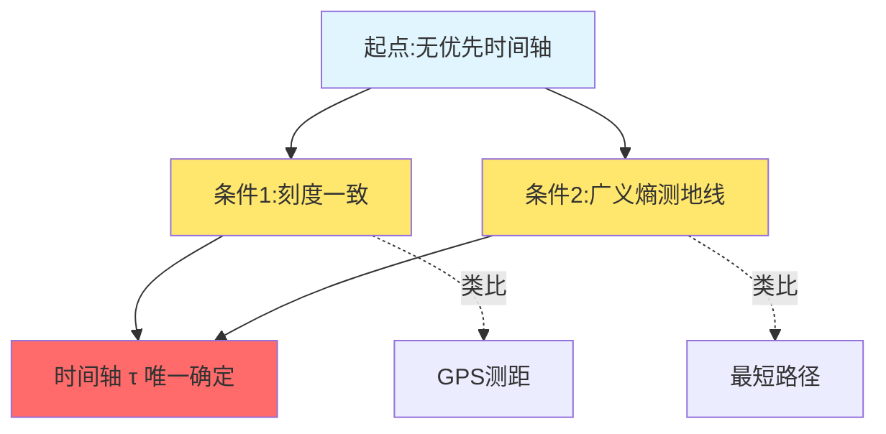

## 核心定理与推论

### 命题1:无观察者时间命题

**陈述:**

若不选定任何注意力截面族$\{\Sigma_\tau\}$与可访问代数族$\{\mathcal{A}_{\Sigma_\tau}^\Lambda\}$,则:

1. 全局刻度母尺$\kappa(\omega)$存在,但**没有单一时间参数**$\tau$
2. 所有"演化"都可重述为边界态的自同构(坐标重标)

**直白翻译:**

**没有观察者时,时间被认为不存在。** 只有一个"刻度场",但没人选择"哪个方向是时间"。

**日常类比:** 仓库里的电影胶片

- 所有帧同时存在(边界截面族)
- 每帧都有编号(刻度母尺)
- 但没人放映,**没有"播放"的概念** → 没有时间流动!

### 命题2:注意力测地线命题

**陈述:**

若存在注意力映射$\mathcal{E}_{\tau,\Lambda}$满足:

1. 截面$\sigma(\tau)$使广义熵驻定:$\delta S_{\text{gen}}=0$
2. 量子膨胀单调不增:$\frac{d\Theta}{d\lambda} \le 0$
3. 时间读数由刻度母尺给出

则注意力时间轴等价于某一有效几何上的**测地线**!

**直白翻译:**

满足两个条件(熵极值+量子聚焦)的注意力截面族,就是**时空中的最优路径**。

观察者的时间 = 沿这条最优路径的参数!

**日常类比:** 航空公司选航线

- **广义熵驻点** = 燃料消耗最小
- **量子膨胀单调** = 气流阻力递减
- **刻度母尺** = 飞行里程计

→ 最优航线是唯一的测地线,飞行时间由里程计读数确定!

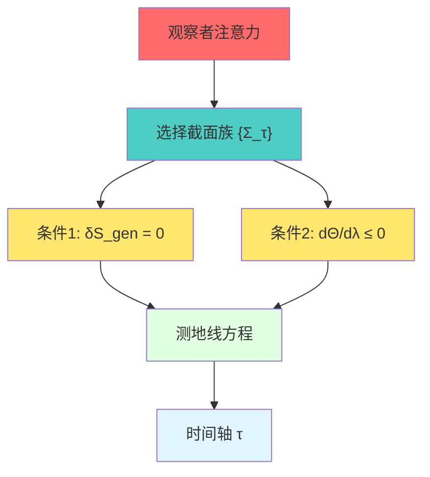

### 推论:截面宇宙与观测分支

**陈述:**

可以构造一个**截面宇宙空间**$\mathfrak{S}$,其点为等价类$[\Sigma,\mathcal{A}_\Sigma^\Lambda,\omega_\Sigma^\Lambda]$。

每个观察者的体验 = $\mathfrak{S}$上的一条路径。

不同观察者 = $\mathfrak{S}$上的不同测地线。

**直白翻译:**

所有可能的"观测截面"构成一个庞大空间(截面宇宙)。

你的人生 = 这个空间中的一条曲线!

**日常类比:** 图书馆与阅读路径

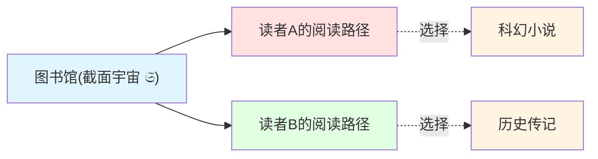

- **图书馆** = 截面宇宙(所有可能截面同时存在)
- **读者A** = 观察者1,选择读科幻路径
- **读者B** = 观察者2,选择读历史路径

两个读者在同一图书馆(宇宙),但"阅读历史"(体验时间轴)完全不同!

## 实验验证与应用

### 1. 双缝干涉的截面解释

回顾经典双缝实验:

- **无探测器:** 电子通过双缝,屏上出现干涉条纹
- **有探测器:** 电子被"观测",干涉消失

**传统困惑:** "观测改变了过去"?粒子"知道"被观测?

**BTG解释:**

两种情况对应截面宇宙中**不同的注意力路径**!

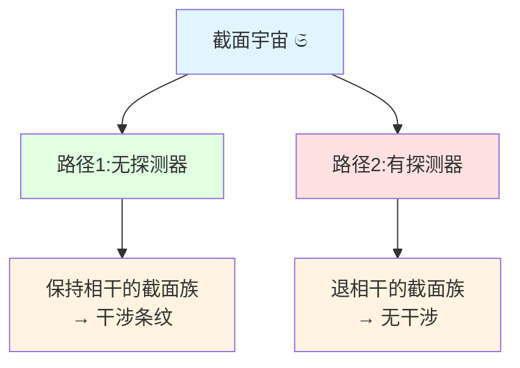

**关键理解:**

- **无探测器时:** 注意力截面族$\{\Sigma_\tau^{\text{free}}\}$对应保持跨缝相干的可访问代数
- **有探测器时:** 注意力映射$\mathcal{E}_{\tau,\Lambda}^{\text{path}}$将代数压缩到路径可辨的子代数

**不是"观测改变过去",而是"选择了不同截面路径"!**

宇宙结构上同时容纳两条路径,观察者只是选择其一。

### 2. 延迟选择实验的无逆因果定理

Wheeler的思想实验:粒子通过双缝后,实验者再决定是否测量路径。

**问题:** 事后选择能"改写"粒子过去的行为吗?

**BTG答案:不能!**

**命题(无逆因果):**

后时刻测量设置$C$与结果$y$,**不会改变**先时刻探测屏事件$x$的非条件分布$p(x)$。

$$
p_C(x) = \sum_y p_C(x,y) = p(x) \quad \text{(与$C$无关!)}
$$

延迟选择只改变**条件概率**$p(x|y)$的分解,不改变边缘分布!

**日常类比:** 翻看旧照片

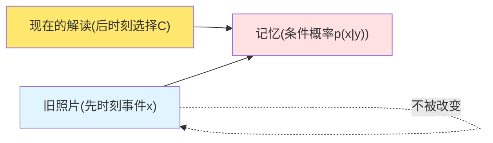

- **旧照片本身不变** = $p(x)$不变
- **你现在的解读改变** = $p(x|y)$改变

你今天看童年照片,想起开心/难过不同回忆 → 不同的"条件化"

但**照片本身没变**!

### 3. 时间双缝:时间域的干涉

空间双缝:粒子在**空间**上走两条路

时间双缝:粒子在**时间**上走两条路!

**实验设置:**

用两个极短脉冲(阿秒级)在$t_1$和$t_2$时刻"打开时间窗"。

电子波函数在时间轴上自干涉 → 出射**能谱**出现振荡条纹!

**统一公式:**

空间双缝与时间双缝在BTG中**完全等价**:

$$
\Delta E \cdot \Delta t \approx 2\pi\hbar
$$

- 空间双缝:位置分布$P(x)$有条纹
- 时间双缝:能量分布$P(E)$有条纹

两者通过Wigner–Smith时间延迟与傅里叶对偶联系!

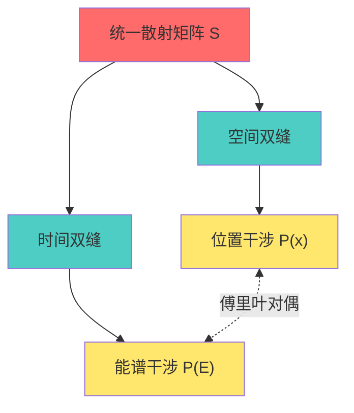

**深刻意义:**

时间被视为不是"绝对背景",而是**边界散射的动力学自由度**。

与空间一样,时间也可以产生干涉!

## 哲学意涵:块宇宙与注意力

### 块宇宙图景

在BTG中,完整的图景是:

**无观察者时:**

- 边界几何与刻度母尺存在
- 所有可能截面在截面宇宙$\mathfrak{S}$中同时存在
- **没有优先的时间方向,没有"流动"**

就像整卷胶片静静躺着,所有帧都"在那里",但没有播放。

**有观察者时:**

- 观察者的注意力$\mathcal{E}_{\tau,\Lambda}$选择一族截面$\{\Sigma_\tau\}$
- 这族截面满足广义熵测地线条件 → 形成时间轴$\tau$
- 观察者"体验"沿$\tau$的演化,感受到"时间流动"

就像放映机开始工作,一帧帧播放,观众"看到"电影。

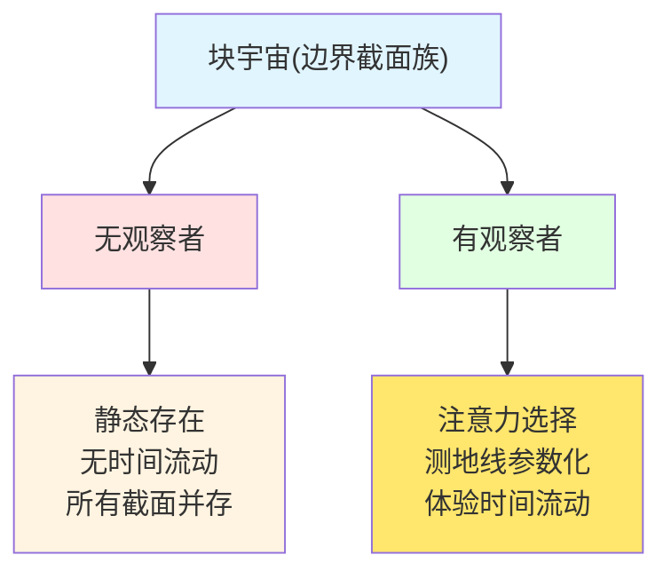

### 自由意志与注意力

**问题:** 观察者能"自由选择"注意力路径吗?

**BTG答案:** 部分自由,部分约束

1. **约束部分:**
   - 必须满足广义熵测地线条件(物理定律)
   - 必须与刻度母尺一致(时间刻度约束)
   - 必须满足因果一致性(不能选"逆因果"截面)

2. **自由部分:**
   - 在满足约束的前提下,有多条可能测地线
   - 选择不同分辨率$\Lambda$ → 不同粗粒化 → 不同体验
   - 选择不同可观测代数 → "看到"不同侧面

**日常类比:** 城市导航

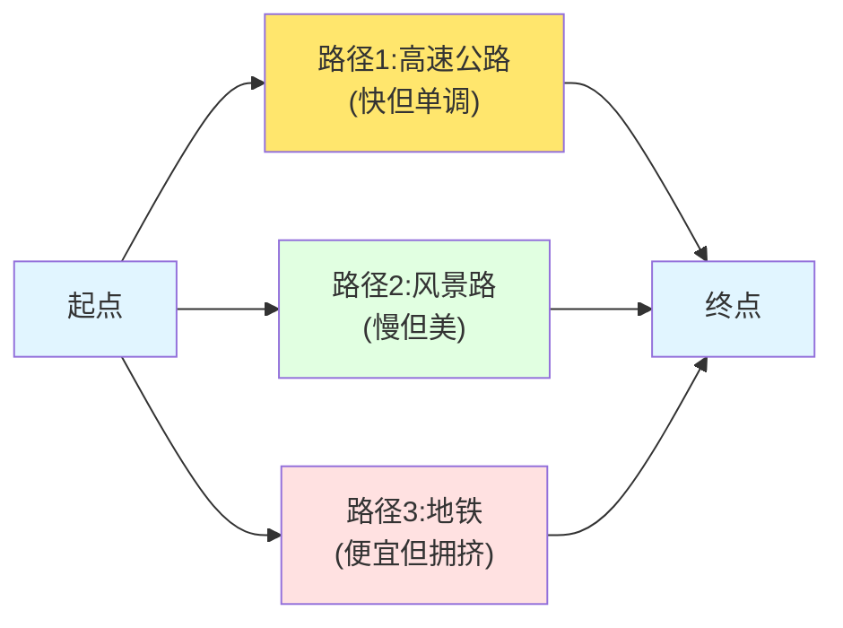

- **物理约束** = 必须沿道路(不能直接隧穿)
- **自由选择** = 可选高速/风景路/地铁

观察者的"自由意志" = 在物理约束下的测地线选择!

### 多观察者共识

**问题:** 不同观察者选择不同截面路径,他们的世界"一致"吗?

**答案:** 在**边界数据**上一致!

虽然不同观察者走不同测地线,但他们的:

- 刻度母尺$\kappa(\omega)$相同(物理定律)
- 边界三元组$(∂M, \mathcal{A}_∂, ω_∂)$相同(客观实在)
- 只是选择了不同的"投影方向"

**日常类比:** 盲人摸象(重访!)

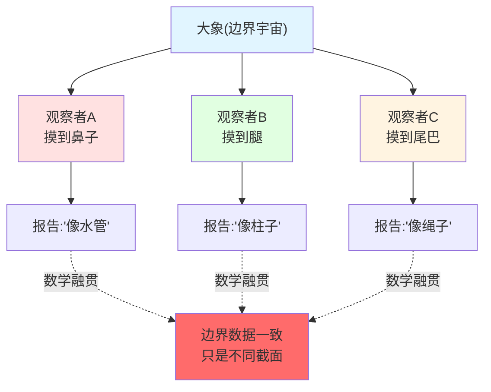

不同观察者的报告"矛盾",但在边界语言中**数学融贯**:

$$
H_∂ = \int\omega d\mu^{\text{scatt}} = c_1 K_D = c_2^{-1} H_∂^{\text{grav}}
$$

所有观察者的时间生成元,在边界上等价(仿射变换)!

## 与前后章节的联系

### 回顾第05章:统一时间

第05章建立刻度同一式:

$$
\kappa(\omega) = \frac{\varphi'(\omega)}{\pi} = \rho_{\text{rel}}(\omega) = \frac{1}{2\pi}\operatorname{tr}Q(\omega)
$$

**本章扩展:**

- 第05章:时间刻度**存在**
- 第08章:观察者如何**选择**时间刻度成为时间轴

**类比:** 地图与路线

- 第05章 = 地图上印刷比例尺(客观存在)
- 第08章 = 你选择具体路线,用比例尺测量路程(主观选择)

### 回顾第07章:边界作为舞台

第07章:物理发生在边界,体域是投影

**本章扩展:**

- 第07章:舞台(边界)在哪里
- 第08章:**谁**在舞台上演出(观察者),**如何**演出(注意力测地线)

**类比:**

- 第07章 = 剧院的舞台建筑
- 第08章 = 演员(观察者)如何在舞台上走位(截面选择)

### 预告第09章:边界钟

下一章将讨论:**如何实际构造边界钟来测量时间?**

- 第08章(本章):时间轴的**理论定义**(注意力测地线)
- 第09章(下章):时间轴的**物理实现**(边界钟装置)

**类比:**

- 第08章 = GPS定位的数学原理
- 第09章 = 如何造GPS卫星与接收器

### 预告第10章:三位一体母尺

第10章将深入**刻度母尺$\kappa(\omega)$的三个等价定义**如何在边界上完美对齐:

$$
\kappa(\omega) \xleftrightarrow{\text{散射}} \frac{\varphi'(\omega)}{\pi} \xleftrightarrow{\text{模流}} \text{tr}Q(\omega) \xleftrightarrow{\text{引力}} H_∂^{\text{grav}}
$$

## 参考文献指引

**核心理论来源:**

1. **边界观察者注意力时间:** `boundary-observer-attention-time.md`
   - 注意力截面的数学定义
   - 广义熵测地线定理
   - 截面宇宙构造

2. **观察者世界截面结构:** `observer-world-section-structure-causality-delayed-choice-time-double-slit.md`
   - 因果一致截面判据
   - 延迟选择无逆因果定理
   - 时间双缝统一模型

3. **边界语言统一框架:** `boundary-language-unified-framework.md`(第05-11章)
   - 边界三公理
   - 三位一体实现

**实验验证:**

- Wheeler延迟选择实验:维基百科"Delayed-choice quantum eraser"
- 阿秒时间双缝:arXiv 物理论文
- Wigner–Smith矩阵测量:电磁散射网络实验

---

**下一章预告:**

第09章《边界钟:如何测量时间?》将讨论如何物理实现边界时间的测量装置,包括:

- 窗口化时钟解决负延迟问题
- DPSS谱窗口与误差控制
- 原子钟网络作为分布式边界钟

**核心问题:** 理论上的"时间刻度",如何在实验室中用仪器读出来?
