# 08 Boundary, Observer, and Time: Who is "Looking"? Who is "Flowing"?

## Core Ideas

In Chapter 07, we learned that **physics happens at the boundary**, but there is a deeper question:

- What is the boundary like without an observer?
- What mathematical object is the world that the observer "sees"?
- **Is time a product of the observer's "attention"?**

The answer is stunning: **Time axis = geodesic chosen by observer attention on the boundary section family!**

## Daily Analogy: Film Projection and Audience Perspective

Imagine you are in a movie theater:

**Key Understanding:**

1. **Film Reel = Boundary Universe**: All possible "sections" (film frames) exist simultaneously
2. **Projector = Observer Attention**: Selects one frame at a time to project onto the screen
3. **Screen Image = Experiential World**: The single section the observer "sees"
4. **Time Flow = Projection Speed**: Parameter for attention movement on the section family

**Without an observer:** The film reel lies quietly in the archive, all frames exist simultaneously, **there is no "time flow"!**

**With an observer:** The projector starts working, frame by frame playback, the audience "feels" time.

## Three Key Concepts

### 1. Boundary Time Geometry (BTG): The Trinity of Time

Recall from Chapter 05, the time scale identity:

$$
\kappa(\omega) = \frac{\varphi'(\omega)}{\pi} = \rho_{\text{rel}}(\omega) = \frac{1}{2\pi}\operatorname{tr}Q(\omega)
$$

This tells us: **Time scales are already encoded in boundary data**, but there are countless ways to choose "which scale becomes the time axis"!

Analogy:
- **Scale Master Ruler** = Scale on a city map (each cm = 100m)
- **Time Axis** = The actual route you walk (chosen geodesic)

**Without an observer:** The map and scale both exist, but there is no "which road is your road."

**With an observer:** You choose a route, the length of this road measured by the scale becomes "your time."

```mermaid
graph LR
    Scale["Boundary Scale Master κ(ω)"]
    Path["Attention Section Family {Σ_τ}"]
    Time["Time Axis τ"]

    Scale -->|Measure| Path
    Path -->|Parameterize| Time

    style Scale fill:#ff6b6b
    style Path fill:#4ecdc4
    style Time fill:#ffe66d
```

### 2. Observer Triplet: Who is Looking?

In the BTG framework, an **observer** is not a "point", but a combination of three things:

$$
\mathcal{O} = (\gamma, \Lambda, \mathcal{A}_{\gamma,\Lambda})
$$

1. **Worldline $\gamma$**: Observer's trajectory in spacetime (the path you walk)
2. **Resolution $\Lambda$**: The smallest scale the observer can "see clearly" (eye resolution)
3. **Observable Algebra $\mathcal{A}_{\gamma,\Lambda}$**: Physical quantities the observer can measure (instruments you have)

**Daily Analogy:** You visit an art exhibition

- $\gamma$ = The route you walk in the gallery
- $\Lambda$ = Your eyesight (nearsightedness requires glasses)
- $\mathcal{A}_{\gamma,\Lambda}$ = The paintings you can see (some too high/far to see)

**Different observers** = Different $(\gamma,\Lambda,\mathcal{A})$ combinations → See **different "world sections"**!

### 3. Attention Sections and Time Axis: How to "Choose" Time?

At each proper time $\tau$ of a given observer $\mathcal{O}$, define the **world section**:

$$
\Sigma_\tau = (\gamma(\tau), \mathcal{A}_{\gamma,\Lambda}(\tau), \rho_{\gamma,\Lambda}(\tau))
$$

This is the world the observer "sees" at time $\tau$:

- $\gamma(\tau)$ = Your position in spacetime
- $\mathcal{A}_{\gamma,\Lambda}(\tau)$ = Physical quantities you can measure at this moment
- $\rho_{\gamma,\Lambda}(\tau)$ = Quantum state of these physical quantities

**But the key question:**

What is $\tau$ itself? How is it determined?

**Answer (Attention Geodesic Theorem):**

The time axis $\tau$ must simultaneously satisfy two conditions:

1. **Scale Condition**: Reading consistency relative to the boundary scale master $\kappa(\omega)$
   $$
   \frac{d\tau}{d\lambda} = \int \kappa(\omega) w_\lambda(\omega) d\omega
   $$

2. **Generalized Entropy Geodesic Condition**: The section family $\{\sigma(\tau)\}$ satisfies
   - Each section $\sigma(\tau)$ is a stationary point of generalized entropy $S_{\text{gen}}$
   - Along the section family, quantum expansion $\Theta(\lambda)$ is monotonically non-increasing

**Daily Analogy:** Mountain Climbing Route Selection

1. **Scale Condition** = Using GPS to measure walking distance (must follow the surface, cannot tunnel)
2. **Geodesic Condition** = Choose the most energy-efficient route (shortest/flattest path)

**Your time** = Parameter measured by GPS scale along the optimal path!

## Core Theorems and Corollaries

### Theorem 1: No-Observer Time Theorem

**Statement:**

If no attention section family $\{\Sigma_\tau\}$ and accessible algebra family $\{\mathcal{A}_{\Sigma_\tau}^\Lambda\}$ are selected, then:

1. Global scale master $\kappa(\omega)$ exists, but **there is no single time parameter** $\tau$
2. All "evolution" can be restated as automorphisms of boundary states (coordinate rescaling)

**Plain Translation:**

**Without an observer, time does not exist!** There is only a "scale field", but no one chooses "which direction is time."

**Daily Analogy:** Movie film in storage

- All frames exist simultaneously (boundary section family)
- Each frame has a number (scale master)
- But no one projects, **no concept of "playback"** → no time flow!

### Theorem 2: Attention Geodesic Theorem

**Statement:**

If there exists an attention map $\mathcal{E}_{\tau,\Lambda}$ satisfying:

1. Section $\sigma(\tau)$ makes generalized entropy stationary: $\delta S_{\text{gen}}=0$
2. Quantum expansion is monotonically non-increasing: $\frac{d\Theta}{d\lambda} \le 0$
3. Time reading is given by the scale master

Then the attention time axis is equivalent to a **geodesic** on some effective geometry!

**Plain Translation:**

An attention section family satisfying two conditions (entropy extremum + quantum focusing) is the **optimal path in spacetime**.

Observer's time = Parameter along this optimal path!

**Daily Analogy:** Airline Route Selection

- **Generalized Entropy Stationary Point** = Minimum fuel consumption
- **Quantum Expansion Monotonic** = Decreasing air resistance
- **Scale Master** = Flight odometer

→ Optimal route is the unique geodesic, flight time determined by odometer reading!

```mermaid
graph TB
    A["Observer Attention"]
    B["Select Section Family {Σ_τ}"]
    C1["Condition 1: δS_gen = 0"]
    C2["Condition 2: dΘ/dλ ≤ 0"]
    D["Geodesic Equation"]
    E["Time Axis τ"]

    A --> B
    B --> C1
    B --> C2
    C1 --> D
    C2 --> D
    D --> E

    style A fill:#ff6b6b
    style B fill:#4ecdc4
    style C1 fill:#ffe66d
    style C2 fill:#ffe66d
    style D fill:#e1ffe1
    style E fill:#e1f5ff
```

### Corollary: Section Universe and Observation Branches

**Statement:**

One can construct a **section universe space** $\mathfrak{S}$, whose points are equivalence classes $[\Sigma,\mathcal{A}_\Sigma^\Lambda,\omega_\Sigma^\Lambda]$.

Each observer's experience = A path on $\mathfrak{S}$.

Different observers = Different geodesics on $\mathfrak{S}$.

**Plain Translation:**

All possible "observation sections" form a vast space (section universe).

Your life = A curve in this space!

**Daily Analogy:** Library and Reading Paths

- **Library** = Section universe (all possible sections exist simultaneously)
- **Reader A** = Observer 1, chooses science fiction reading path
- **Reader B** = Observer 2, chooses historical reading path

Two readers in the same library (universe), but "reading history" (experienced time axis) completely different!

## Experimental Verification and Applications

### 1. Section Interpretation of Double-Slit Interference

Recall the classic double-slit experiment:

- **No Detector:** Electrons pass through double slits, interference fringes appear on screen
- **With Detector:** Electrons are "observed", interference disappears

**Traditional Confusion:** "Observation changed the past"? Particles "know" they are observed?

**BTG Explanation:**

The two cases correspond to **different attention paths** in the section universe!

```mermaid
graph TB
    Universe["Section Universe 𝔖"]
    Path1["Path 1: No Detector"]
    Path2["Path 2: With Detector"]

    Universe --> Path1
    Universe --> Path2

    Path1 --> Result1["Coherence-Preserving Section Family<br>→ Interference Fringes"]
    Path2 --> Result2["Decoherent Section Family<br>→ No Interference"]

    style Universe fill:#e1f5ff
    style Path1 fill:#e1ffe1
    style Path2 fill:#ffe1e1
    style Result1 fill:#fff4e1
    style Result2 fill:#fff4e1
```

**Key Understanding:**

- **Without Detector:** Attention section family $\{\Sigma_\tau^{\text{free}}\}$ corresponds to accessible algebra preserving cross-slit coherence
- **With Detector:** Attention map $\mathcal{E}_{\tau,\Lambda}^{\text{path}}$ compresses algebra to path-distinguishable subalgebra

**Not "observation changes the past", but "chose a different section path"!**

The universe structure simultaneously accommodates both paths, observers just choose one.

### 2. No-Retro-Causality Theorem for Delayed Choice Experiment

Wheeler's thought experiment: After particles pass through double slits, experimenter decides whether to measure the path.

**Question:** Can post-choice "rewrite" the particle's past behavior?

**BTG Answer: No!**

**Theorem (No Retro-Causality):**

Later-time measurement setting $C$ and result $y$ **do not change** the unconditional distribution $p(x)$ of earlier-time detection screen event $x$.

$$
p_C(x) = \sum_y p_C(x,y) = p(x) \quad \text{(Independent of $C$!)}
$$

Delayed choice only changes the decomposition of **conditional probability** $p(x|y)$, not the marginal distribution!

**Daily Analogy:** Looking at Old Photos

- **Old Photo Itself Unchanged** = $p(x)$ unchanged
- **Your Current Interpretation Changes** = $p(x|y)$ changes

You look at childhood photos today, recall happy/sad different memories → Different "conditioning"

But **the photo itself hasn't changed**!

### 3. Time Double-Slit: Interference in the Time Domain

Spatial double-slit: Particles take two paths in **space**

Time double-slit: Particles take two paths in **time**!

**Experimental Setup:**

Use two extremely short pulses (attosecond scale) to "open time windows" at times $t_1$ and $t_2$.

Electron wavefunction self-interferes on the time axis → **Energy spectrum** of outgoing beam shows oscillating fringes!

**Unified Formula:**

Spatial and temporal double-slits are **completely equivalent** in BTG:

$$
\Delta E \cdot \Delta t \approx 2\pi\hbar
$$

- Spatial double-slit: Position distribution $P(x)$ has fringes
- Time double-slit: Energy distribution $P(E)$ has fringes

The two are connected via Wigner–Smith time delay and Fourier duality!

**Profound Meaning:**

Time is not an "absolute background", but a **dynamical degree of freedom of boundary scattering**!

Like space, time can also produce interference!

## Philosophical Implications: Block Universe and Attention

### Block Universe Picture

In BTG, the complete picture is:

**Without an observer:**

- Boundary geometry and scale master exist
- All possible sections exist simultaneously in section universe $\mathfrak{S}$
- **No preferred time direction, no "flow"**

Like a whole film reel lying quietly, all frames are "there", but not playing.

**With an observer:**

- Observer's attention $\mathcal{E}_{\tau,\Lambda}$ selects a section family $\{\Sigma_\tau\}$
- This family satisfies generalized entropy geodesic conditions → Forms time axis $\tau$
- Observer "experiences" evolution along $\tau$, feels "time flow"

Like a projector starting to work, frame by frame playback, audience "sees" the movie.

### Free Will and Attention

**Question:** Can observers "freely choose" attention paths?

**BTG Answer:** Partially free, partially constrained

1. **Constrained Part:**
   - Must satisfy generalized entropy geodesic conditions (physical laws)
   - Must be consistent with scale master (time scale constraints)
   - Must satisfy causal consistency (cannot choose "retro-causal" sections)

2. **Free Part:**
   - Under constraints, there are multiple possible geodesics
   - Choose different resolution $\Lambda$ → Different coarse-graining → Different experience
   - Choose different observable algebras → "See" different aspects

**Daily Analogy:** City Navigation

- **Physical Constraints** = Must follow roads (cannot directly tunnel)
- **Free Choice** = Can choose highway/scenic route/subway

Observer's "free will" = Geodesic selection under physical constraints!

### Multi-Observer Consensus

**Question:** Different observers choose different section paths, are their worlds "consistent"?

**Answer:** Consistent on **boundary data**!

Although different observers follow different geodesics, their:

- Scale master $\kappa(\omega)$ is the same (physical laws)
- Boundary triplet $(∂M, \mathcal{A}_∂, ω_∂)$ is the same (objective reality)
- Only chose different "projection directions"

**Daily Analogy:** Blind Men Touching an Elephant (Revisited!)

Different observers' reports are "contradictory", but **mathematically coherent** in boundary language:

$$
H_∂ = \int\omega d\mu^{\text{scatt}} = c_1 K_D = c_2^{-1} H_∂^{\text{grav}}
$$

All observers' time generators are equivalent on the boundary (affine transformation)!

## Connections with Previous and Following Chapters

### Review Chapter 05: Unified Time

Chapter 05 established the scale identity:

$$
\kappa(\omega) = \frac{\varphi'(\omega)}{\pi} = \rho_{\text{rel}}(\omega) = \frac{1}{2\pi}\operatorname{tr}Q(\omega)
$$

**This Chapter Extends:**

- Chapter 05: Time scale **exists**
- Chapter 08: How observers **choose** time scale to become time axis

**Analogy:** Map and Route

- Chapter 05 = Scale printed on map (objectively exists)
- Chapter 08 = You choose specific route, measure distance with scale (subjective choice)

### Review Chapter 07: Boundary as Stage

Chapter 07: Physics happens at boundary, bulk is projection

**This Chapter Extends:**

- Chapter 07: Where is the stage (boundary)
- Chapter 08: **Who** performs on stage (observer), **how** to perform (attention geodesic)

**Analogy:**

- Chapter 07 = Theater stage building
- Chapter 08 = How actors (observers) move on stage (section selection)

### Preview Chapter 09: Boundary Clock

Next chapter will discuss: **How to actually construct boundary clocks to measure time?**

- Chapter 08 (this chapter): **Theoretical definition** of time axis (attention geodesic)
- Chapter 09 (next chapter): **Physical implementation** of time axis (boundary clock device)

**Analogy:**

- Chapter 08 = Mathematical principles of GPS positioning
- Chapter 09 = How to build GPS satellites and receivers

### Preview Chapter 10: Trinity Master Scale

Chapter 10 will deeply explore how the **three equivalent definitions of scale master $\kappa(\omega)$** perfectly align on the boundary:

$$
\kappa(\omega) \xleftrightarrow{\text{Scattering}} \frac{\varphi'(\omega)}{\pi} \xleftrightarrow{\text{Modular Flow}} \text{tr}Q(\omega) \xleftrightarrow{\text{Gravity}} H_∂^{\text{grav}}
$$

## Reference Guide

**Core Theoretical Sources:**

1. **Boundary Observer Attention Time:** `boundary-observer-attention-time.md`
   - Mathematical definition of attention sections
   - Generalized entropy geodesic theorem
   - Section universe construction

2. **Observer World Section Structure:** `observer-world-section-structure-causality-delayed-choice-time-double-slit.md`
   - Causally consistent section criteria
   - Delayed choice no-retro-causality theorem
   - Time double-slit unified model

3. **Boundary Language Unified Framework:** `boundary-language-unified-framework.md` (Chapters 05-11)
   - Boundary three axioms
   - Trinity implementation

**Experimental Verification:**

- Wheeler delayed choice experiment: Wikipedia "Delayed-choice quantum eraser"
- Attosecond time double-slit: arXiv physics papers
- Wigner–Smith matrix measurement: Electromagnetic scattering network experiments

---

**Next Chapter Preview:**

Chapter 09 "Boundary Clock: How to Measure Time?" will discuss how to physically implement boundary time measurement devices, including:

- Windowed clocks solving negative delay problems
- DPSS spectral windows and error control
- Atomic clock networks as distributed boundary clocks

**Core Question:** How can the theoretical "time scale" be read out with instruments in the laboratory?

