# 09 边界钟:如何"测量"时间?

## 核心思想

前两章我们知道:

- 第07章:物理发生在**边界**(舞台在哪里)
- 第08章:**观察者**选择注意力测地线作为时间轴(谁在演出)

但还缺最关键一环:**如何用仪器实际读出时间?**

答案:**边界钟=用窗口化谱读数直接测量刻度母尺$\kappa(\omega)$!**

## 日常类比:用手表测时间

想象你要测量"一天有多长":

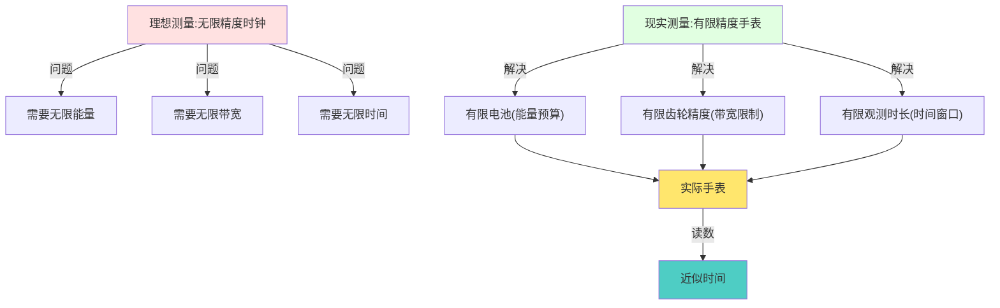

**理想时钟问题:**

- 需要从$t=-\infty$到$t=+\infty$运行(无限时间)
- 需要测量所有频率$\omega\in\mathbb{R}$(无限带宽)
- 需要无限能量驱动

→ **物理上不可实现!**

**实际手表解决:**

- 只在$[0, T]$时间窗内测量(有限时间)
- 只测量可见光/机械振动频段(有限带宽)
- 电池供电(有限能量)

→ **用"窗口化读数"近似理想时间!**

**边界钟的核心:**

用**最优窗函数**(PSWF/DPSS)在有限资源下最小化误差!

## 三个关键概念

### 1. 理想读数vs窗口化读数:为何需要"开窗"?

回顾统一时间刻度母尺:

$$
\kappa(\omega) = \frac{\varphi'(\omega)}{\pi} = \rho_{\text{rel}}(\omega) = \frac{1}{2\pi}\operatorname{tr}Q(\omega)
$$

**理想读数:**

测量所有频率$\omega$,得到完整的$\kappa(\omega)$:

$$
\mathcal{R}_{\text{ideal}} = \int_{-\infty}^{+\infty} \kappa(\omega) f(\omega) d\omega
$$

**问题:** 需要无限时间+无限频带 → 不可实现!

**窗口化读数:**

只在有限时间$[-T,T]$和有限频带$[-W,W]$内测量:

$$
\mathcal{R}_{\text{window}} = \int_{-W}^{+W} W(\omega) \kappa(\omega) f(\omega) d\omega
$$

其中$W(\omega)$是**窗函数**(相当于给频谱戴上"有色眼镜")。

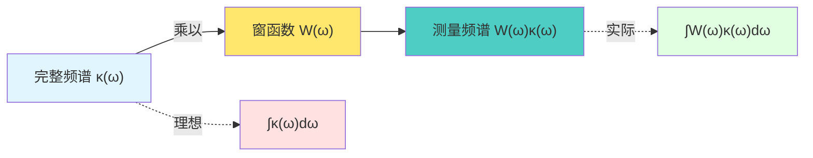

**日常类比:** 通过窗户看风景

- **完整风景** = 完整频谱$\kappa(\omega)$
- **窗户** = 窗函数$W(\omega)$(只能看到窗框内的部分)
- **你看到的** = 窗口化频谱$W(\omega)\kappa(\omega)$

**误差:**

$$
\text{Err} = \mathcal{R}_{\text{ideal}} - \mathcal{R}_{\text{window}}
$$

**问题:** 如何选择窗函数$W(\omega)$使误差最小?

### 2. PSWF/DPSS:最优窗函数

**关键定理(Slepian):**

在给定时间窗$[-T,T]$和频带$[-W,W]$约束下,**能量集中度最优**的窗函数族是:

**Prolate Spheroidal Wave Functions (PSWF)**

定义为积分算子特征函数:

$$
\int_{-T}^{T} \frac{\sin W(t-s)}{\pi(t-s)} \psi_n(s) ds = \lambda_n \psi_n(t)
$$

**性质:**

1. **正交完备:** $\{\psi_n(t)\}$在$[-T,T]$上构成正交基
2. **能量集中度:** 特征值$\lambda_n$表示频带内能量占比
   $$
   \lambda_n = \frac{\int_{-W}^{+W} |\widehat{\psi}_n(\omega)|^2 d\omega}{\int_{-\infty}^{+\infty} |\widehat{\psi}_n(\omega)|^2 d\omega}
   $$
3. **最优性:** 任何其他窗函数族的能量集中度总和≤ PSWF族

**特征值规律:**

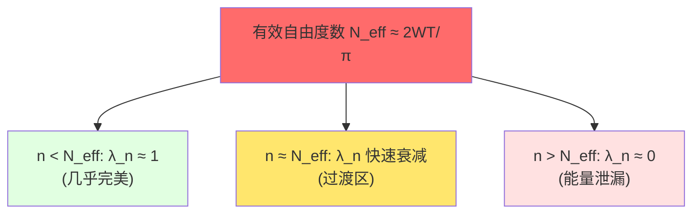

**日常类比:** 选购相机镜头

- **广角镜头**(大$W$) = 看得宽,但边缘模糊(频带外泄漏多)
- **长焦镜头**(小$W$) = 看得清,但视野窄(频带内能量少)
- **PSWF镜头** = 在给定预算下,视野与清晰度最优平衡!

### 3. 离散情形:DPSS窗序列

实际测量是**离散**的(每隔$\Delta t$采样一次),需要离散版本:

**Discrete Prolate Spheroidal Sequences (DPSS)**

定义为Toeplitz矩阵特征向量:

$$
\sum_{n=0}^{N-1} K_{mn} v_n^{(k)} = \lambda_k v_m^{(k)}
$$

其中

$$
K_{mn} = \frac{\sin 2\pi W(m-n)}{\pi(m-n)}
$$

**性质:**

- $v^{(k)} = [v_0^{(k)}, v_1^{(k)}, \ldots, v_{N-1}^{(k)}]$是长度$N$的序列
- $\lambda_k$是离散频带$[-W, W]$内的能量集中度
- 在所有长度$N$,带宽$W$的序列族中,DPSS能量集中度最优

**有效自由度:**

$$
N_{\text{eff}} \approx 2NW
$$

当$k < N_{\text{eff}}$时,$\lambda_k \approx 1$(几乎完美)

当$k > N_{\text{eff}}$时,$\lambda_k \to 0$(快速衰减)

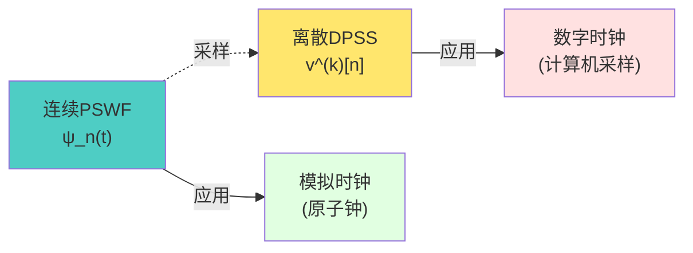

## 核心定理与推论

### 定理1:时间-频率-复杂性自由度上界

**陈述:**

在有限复杂性预算$T$和有限频带$W$约束下,可可靠读出的独立模式数量:

$$
N_{\text{eff}} = \frac{2WT}{\pi} + O(\log(1/\varepsilon))
$$

其中$\varepsilon$是误差容忍度。

**直白翻译:**

**你能测量的"独立信息"数量,由时间窗×频带宽度决定!**

想测更多? → 要么延长时间$T$,要么增加带宽$W$!

**日常类比:** 拍照的像素数

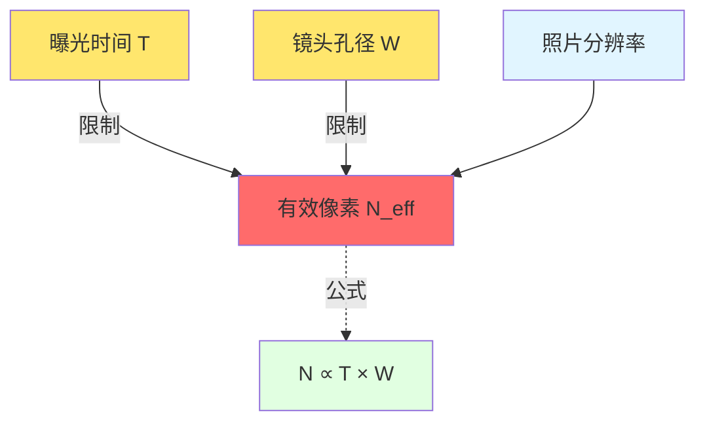

- **曝光时间**$T$ = 时间窗口
- **镜头孔径**$W$ = 频带宽度
- **像素数** = 有效自由度$N_{\text{eff}}$

→ 想要高清照片?要么长时间曝光,要么用大光圈!

### 定理2:PSWF/DPSS作为最优窗的变分极值

**陈述:**

在给定时间-频率-复杂性约束下,最小化读数误差$\mathcal{E}_{\text{win}}$的窗函数族,恰好是PSWF/DPSS!

$$
\min_{W(\omega)} \mathcal{E}_{\text{win}}(W) \Longrightarrow W^*(\omega) = \sum_{k=0}^{K-1} c_k \psi_k(\omega)
$$

其中$\{\psi_k\}$是前$K$个PSWF。

**直白翻译:**

**在有限资源下,PSWF/DPSS窗是"误差最小"的唯一最优解!**

用其他窗函数? → 必定误差更大!

**日常类比:** 最省油的驾驶方式

给定:

- 起点到终点的距离(时间窗$T$)
- 最高限速(频带$W$)
- 油箱容量(复杂性预算)

**问题:** 如何开车最省油(误差最小)?

**答案:** 遵循"最优速度曲线"(PSWF轨迹)!

- 加速太猛 → 浪费油(频带外泄漏)
- 开太慢 → 到不了(能量不足)
- **PSWF速度曲线** → 恰好最省油!

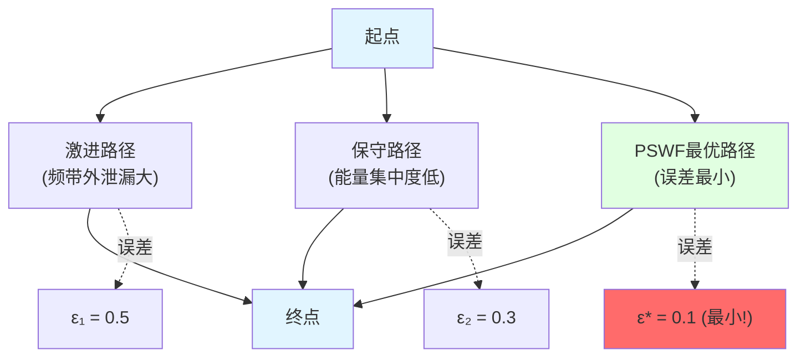

### 推论:窗口化时钟解决负延迟问题

在某些散射系统中,Wigner-Smith时间延迟$Q(\omega)$可能出现**负本征值** → 负延迟!

**物理困惑:** 粒子"提前"到达?违反因果律?

**BTG解释:** 负延迟只是**局域相位效应**,不是真正"超光速"!

**解决方案:窗口化时钟**

定义窗口化时间刻度:

$$
\Theta_\Delta(\omega) = (\rho_{\text{rel}} * P_\Delta)(\omega)
$$

其中$P_\Delta(\omega)$是宽度$\Delta$的PSWF窗。

**关键性质:**

$$
\text{当} \quad \Delta > \Gamma_{\min} \quad \Rightarrow \quad \Theta_\Delta(\omega) > 0
$$

**直白翻译:**

**只要窗口宽度足够大,负延迟被"平滑掉",时钟始终正向!**

**日常类比:** 视频慢放看快动作

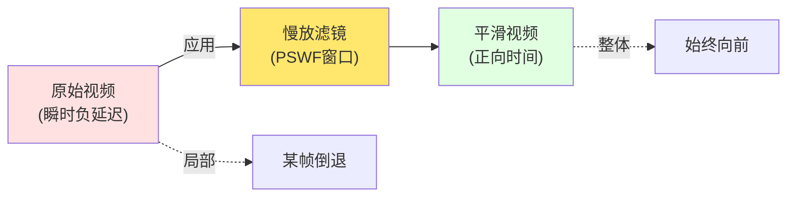

- **原始视频** = 瞬时时间延迟(可能负)
- **慢放滤镜** = 窗口化平滑(PSWF)
- **平滑视频** = 窗口化时钟(始终正)

## 实验验证与应用

### 1. 原子钟网络:分布式边界钟

**实验设置:**

- 多个原子钟分布在不同空间位置(边界上的"测站")
- 每个钟测量局域时间刻度$\kappa_i(\omega)$
- 通过光纤/卫星链路同步

**BTG解释:**

每个原子钟对应边界上的一个"局域截面"$\Sigma_i$。

整体时间 = 所有局域截面的一致化:

$$
\kappa_{\text{global}}(\omega) = \text{consensus}(\{\kappa_i(\omega)\}_{i=1}^N)
$$

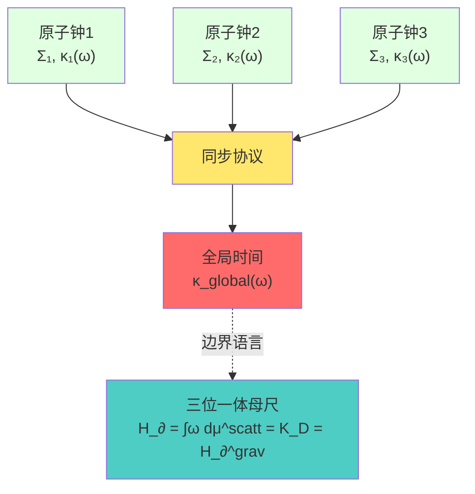

**关键技术:**

- 用DPSS窗函数处理每个钟的读数
- 通过相对熵最小化实现共识
- 容忍个别钟的故障(鲁棒性)

### 2. 电磁散射网络:微波腔边界钟

**实验设置:**

- 多端口微波腔(人工"时空")
- 测量散射矩阵$S(\omega)$
- 计算Wigner-Smith矩阵$Q(\omega) = -iS^\dagger \partial_\omega S$

**测量时间刻度:**

$$
\kappa(\omega) = \frac{1}{2\pi} \text{tr} Q(\omega)
$$

**验证刻度同一式:**

1. **散射端:** 测量相位导数$\varphi'(\omega)/\pi$
2. **延迟端:** 测量群延迟$\text{tr}Q(\omega)/2\pi$
3. **验证:** 两者是否相等?

**实验挑战:**

- 频域采样有限 → 用DPSS窗优化
- 相位解缠绕(unwrapping)
- 噪声抑制

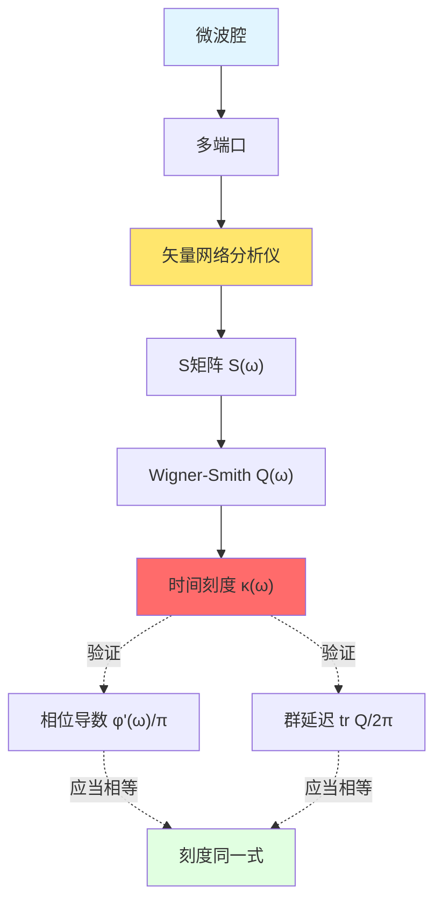

### 3. FRB快速射电暴:宇宙级边界钟

**观测对象:**

快速射电暴(Fast Radio Burst)穿越宇宙学距离的信号。

**测量量:**

- 色散延迟$\tau_{\text{DM}}(\omega)$
- 散射宽化$\tau_{\text{scatt}}(\omega)$
- 相位残差$\Phi_{\text{residual}}(\omega)$

**BTG解释:**

FRB传播 = 穿越宇宙边界的**巨型散射实验**!

相位残差$\Phi_{\text{residual}}(\omega)$编码了:

- 真空极化效应
- 引力透镜
- 未知新物理

**窗口化上限:**

用PSWF窗函数处理FRB频谱:

$$
R_{\text{FRB}} = \int_{\Omega_{\text{FRB}}} W_{\text{FRB}}(\omega) \Phi_{\text{residual}}(\omega) d\omega
$$

若观测到$|R_{\text{FRB}}| < \varepsilon_{\text{obs}}$,则得到统一时间刻度扰动上界:

$$
|\delta\kappa(\omega)| < \frac{\varepsilon_{\text{obs}}}{|W_{\text{FRB}}| C_{\text{FRB}}}
$$

**意义:**

- FRB = 宇宙尺度的时间刻度标准器!
- 可以检验统一时间刻度的微小偏离
- 寻找超越标准模型的新物理

### 4. δ-环散射:实验室精密标尺

**实验设置:**

一维环(周长$L$)上放置δ势:

$$
V(x) = \alpha_\delta \delta(x)
$$

加上Aharonov-Bohm磁通$\theta$。

**谱量化方程:**

$$
\cos(kL) + \frac{\alpha_\delta}{k}\sin(kL) = \cos\theta
$$

**测量:**

1. 改变磁通$\theta$
2. 观测能谱$\{k_n(\theta)\}$的移动
3. 反推$\alpha_\delta$和$\theta$

**BTG应用:**

δ-环散射 = 可控的"实验室边界钟"!

- 已知几何参数$(L, \theta)$
- 精确可调的$\alpha_\delta$
- 用于**校准**统一时间刻度

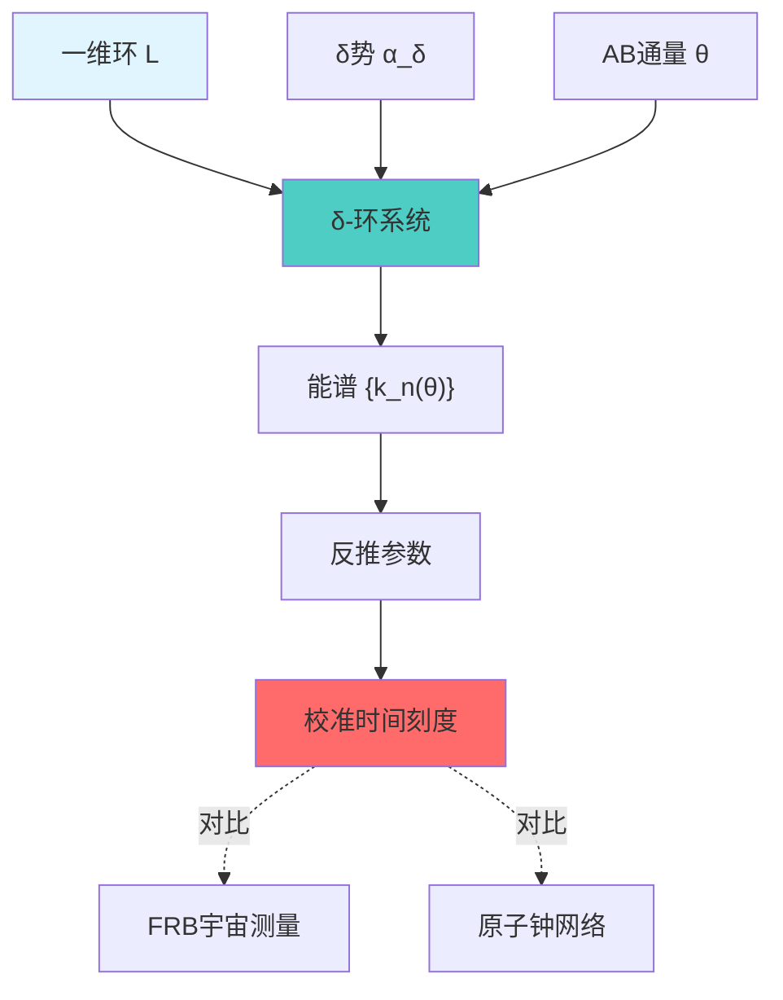

**跨平台刻度同一:**

- FRB: 宇宙尺度($\sim$ Gpc)
- 原子钟: 地球尺度($\sim$ km)
- δ-环: 实验室尺度($\sim$ mm)

**三者在统一时间刻度$\kappa(\omega)$上应当一致!**

## 哲学意涵:时间的可测性

### 时间是"实在"还是"读数"?

**传统观点:**

时间是"绝对实在",钟只是"测量"它。

**BTG观点:**

时间**就是**刻度母尺$\kappa(\omega)$的读数!

- 没有读数 → 没有时间(参见第08章无观察者定理)
- 有读数 → 时间出现(注意力测地线)

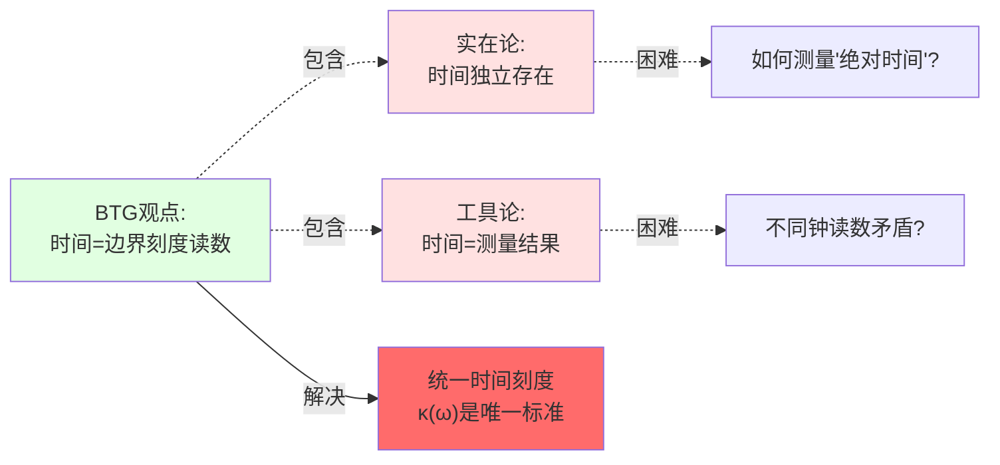

**关键理解:**

1. **边界刻度$\kappa(\omega)$客观存在**(无观察者时也在)
2. **时间轴$\tau$需要观察者选择**(注意力测地线)
3. **钟的读数必须通过窗口化**(PSWF/DPSS)

→ 时间既**客观**(刻度在),又**主观**(需选择),还**工具**(需测量)!

### 有限性的哲学:你不能测量"一切"

**深刻洞察:**

时间-频率-复杂性自由度上界:

$$
N_{\text{eff}} \lesssim \frac{2WT}{\pi}
$$

告诉我们:**在有限资源下,你只能知道有限的信息!**

**推论:**

1. **不可能同时精确测量所有频率**(频带限制)
2. **不可能测量无限长时间**(时间窗限制)
3. **不可能用有限仪器读无限数据**(复杂性限制)

**日常类比:** 图书馆的阅读时间

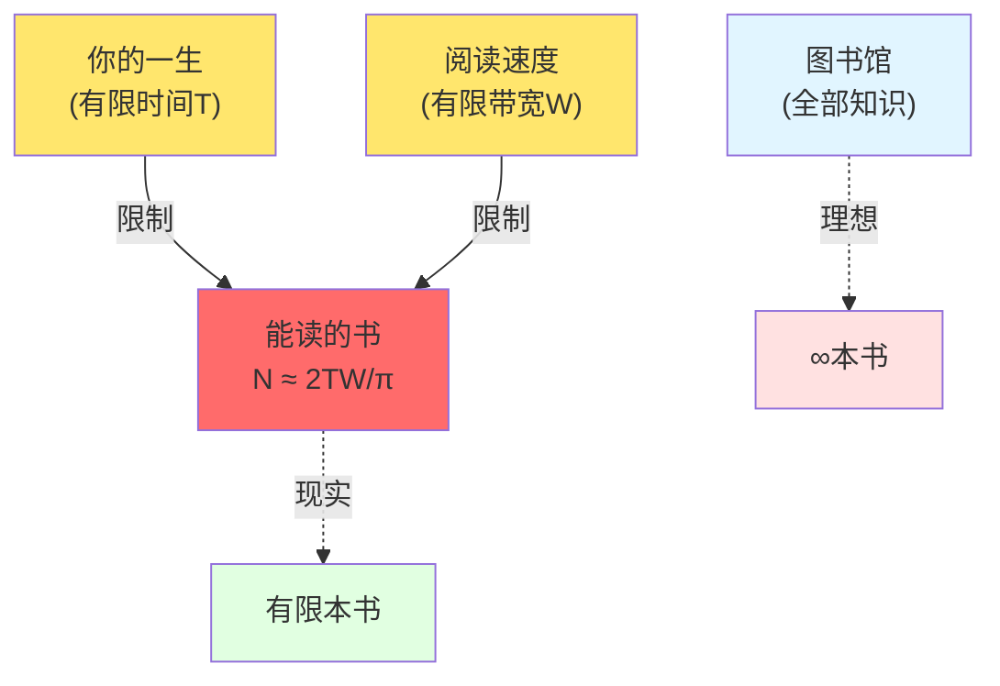

- **图书馆** = 完整时间刻度$\kappa(\omega)$
- **你的一生** = 时间窗$T$
- **阅读速度** = 频带$W$
- **能读的书** = 有效自由度$N_{\text{eff}}$

→ 你不可能读完图书馆!只能选最重要的书读(最优窗函数)!

**这不是遗憾,而是物理定律!**

## 与前后章节的联系

### 回顾第07-08章:从舞台到时钟

**递进关系:**

- 第07章:**边界是舞台**(物理发生在哪里)
- 第08章:**观察者选时间轴**(谁在舞台上,如何选路径)
- 第09章(本章):**边界钟测时间**(如何用仪器读数)

**类比:** 演出的三要素

### 预告第10章:三位一体母尺

下一章将揭示**刻度母尺$\kappa(\omega)$的三个等价定义如何在边界上完美统一**:

$$
\kappa(\omega) \xleftrightarrow{\text{散射}} \frac{\varphi'(\omega)}{\pi} \xleftrightarrow{\text{模流}} \frac{1}{2\pi}\text{tr}Q(\omega) \xleftrightarrow{\text{引力}} H_∂^{\text{grav}}
$$

**类比预告:**

- 第09章(本章): 如何**用仪器**测$\kappa(\omega)$(工程实现)
- 第10章(下章): **为什么**三种定义等价(数学证明)

**问题预告:**

- 散射相位、模流、引力时间看起来完全不同,为何等价?
- 这种等价是偶然的,还是深刻的几何必然?

## 参考文献指引

**核心理论来源:**

1. **误差控制与谱窗化读数:** `error-control-spectral-windowing-readout.md`
   - PSWF/DPSS定义与性质
   - 时间-频率-复杂性自由度上界
   - 窗函数变分极值性

2. **相位-频率统一计量:** `phase-frequency-unified-metrology-experimental-testbeds.md`
   - FRB真空极化窗化上限
   - δ-环散射可辨识性
   - 跨平台刻度同一条件

3. **统一时间刻度域与可解模型:** `unified-time-scale-geometry-domains-solvable-models.md`(第05-12章)
   - 窗口化时钟解决负延迟
   - 三大定义域

**数学工具:**

- Slepian等人关于PSWF的经典论文
- DPSS在多窗口谱估计中的应用(Thomson方法)
- 时间-频率分析教材

---

**下一章预告:**

第10章《三位一体母尺:时间的统一定义》将深入数学证明,说明散射、模流、引力三种时间定义如何在边界上完美对齐,构成统一时间刻度的**三位一体**结构。

**核心问题:** 三种完全不同的物理过程,为何给出相同的时间刻度?这背后有怎样的深刻几何原理?
