# 09 Boundary Clock: How to "Measure" Time?

## Core Ideas

From the previous two chapters, we know:

- Chapter 07: Physics happens at the **boundary** (where is the stage)
- Chapter 08: **Observer** chooses attention geodesic as time axis (who is performing)

But the most crucial link is missing: **How to actually read out time with instruments?**

Answer: **Boundary Clock is designed to directly measure scale master $\kappa(\omega)$ using windowed spectral readings.**

## Daily Analogy: Measuring Time with a Watch

Imagine you want to measure "how long is a day":

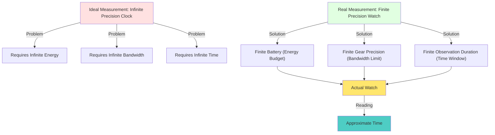

**Ideal Clock Problems:**

- Needs to run from $t=-\infty$ to $t=+\infty$ (infinite time)
- Needs to measure all frequencies $\omega\in\mathbb{R}$ (infinite bandwidth)
- Needs infinite energy to drive

→ **Considered physically impossible to strictly realize.**

**Actual Watch Solution:**

- Only measure in time window $[0, T]$ (finite time)
- Only measure visible light/mechanical vibration bands (finite bandwidth)
- Battery powered (finite energy)

→ **Approximate theoretical ideal time using "windowed readings".**

**Core of Boundary Clock:**

Use **optimal window functions** (PSWF/DPSS) to minimize error under finite resources!

## Three Key Concepts

### 1. Ideal Reading vs Windowed Reading: Why "Windowing"?

Recall the unified time scale master:

$$
\kappa(\omega) = \frac{\varphi'(\omega)}{\pi} = \rho_{\text{rel}}(\omega) = \frac{1}{2\pi}\operatorname{tr}Q(\omega)
$$

**Ideal Reading:**

Measure all frequencies $\omega$, get complete $\kappa(\omega)$:

$$
\mathcal{R}_{\text{ideal}} = \int_{-\infty}^{+\infty} \kappa(\omega) f(\omega) d\omega
$$

**Problem:** Requires infinite time + infinite frequency band → Impossible!

**Windowed Reading:**

Only measure in finite time $[-T,T]$ and finite frequency band $[-W,W]$:

$$
\mathcal{R}_{\text{window}} = \int_{-W}^{+W} W(\omega) \kappa(\omega) f(\omega) d\omega
$$

where $W(\omega)$ is the **window function** (equivalent to putting "colored glasses" on the spectrum).

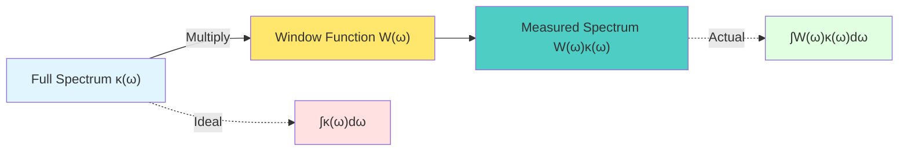

**Daily Analogy:** Looking at scenery through a window

- **Full Scenery** = Complete spectrum $\kappa(\omega)$
- **Window** = Window function $W(\omega)$ (can only see part within frame)
- **What You See** = Windowed spectrum $W(\omega)\kappa(\omega)$

**Error:**

$$
\text{Err} = \mathcal{R}_{\text{ideal}} - \mathcal{R}_{\text{window}}
$$

**Question:** How to choose window function $W(\omega)$ to minimize error?

### 2. PSWF/DPSS: Optimal Window Functions

**Key Theorem (Slepian):**

Under constraints of given time window $[-T,T]$ and frequency band $[-W,W]$, the window function family with **optimal energy concentration** is:

**Prolate Spheroidal Wave Functions (PSWF)**

Defined as eigenfunctions of integral operator:

$$
\int_{-T}^{T} \frac{\sin W(t-s)}{\pi(t-s)} \psi_n(s) ds = \lambda_n \psi_n(t)
$$

**Properties:**

1. **Orthogonal Complete:** $\{\psi_n(t)\}$ forms orthogonal basis on $[-T,T]$
2. **Energy Concentration:** Eigenvalue $\lambda_n$ represents energy ratio within frequency band
   $$
   \lambda_n = \frac{\int_{-W}^{+W} |\widehat{\psi}_n(\omega)|^2 d\omega}{\int_{-\infty}^{+\infty} |\widehat{\psi}_n(\omega)|^2 d\omega}
   $$
3. **Optimality:** Sum of energy concentration of any other window function family ≤ PSWF family

**Eigenvalue Pattern:**

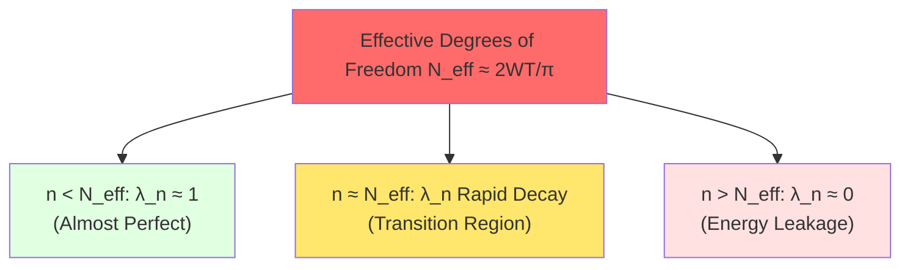

**Daily Analogy:** Choosing camera lens

- **Wide-angle lens** (large $W$) = See wide, but edges blurry (more out-of-band leakage)
- **Telephoto lens** (small $W$) = See clearly, but narrow field (less in-band energy)
- **PSWF lens** = Optimal balance of field and clarity under given budget!

### 3. Discrete Case: DPSS Window Sequences

Actual measurements are **discrete** (sampling every $\Delta t$), need discrete version:

**Discrete Prolate Spheroidal Sequences (DPSS)**

Defined as eigenvectors of Toeplitz matrix:

$$
\sum_{n=0}^{N-1} K_{mn} v_n^{(k)} = \lambda_k v_m^{(k)}
$$

where

$$
K_{mn} = \frac{\sin 2\pi W(m-n)}{\pi(m-n)}
$$

**Properties:**

- $v^{(k)} = [v_0^{(k)}, v_1^{(k)}, \ldots, v_{N-1}^{(k)}]$ is a sequence of length $N$
- $\lambda_k$ is energy concentration in discrete frequency band $[-W, W]$
- Among all sequence families of length $N$, bandwidth $W$, DPSS has optimal energy concentration

**Effective Degrees of Freedom:**

$$
N_{\text{eff}} \approx 2NW
$$

When $k < N_{\text{eff}}$, $\lambda_k \approx 1$ (almost perfect)

When $k > N_{\text{eff}}$, $\lambda_k \to 0$ (rapid decay)

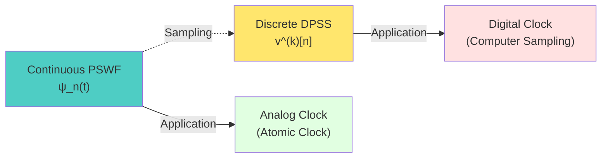

## Core Theorems and Corollaries

### Proposition 1: Time-Frequency-Complexity Degrees of Freedom Upper Bound

**Statement:**

Under constraints of finite complexity budget $T$ and finite frequency band $W$, the number of independent modes that can be reliably read:

$$
N_{\text{eff}} = \frac{2WT}{\pi} + O(\log(1/\varepsilon))
$$

where $\varepsilon$ is error tolerance.

**Plain Translation:**

**The amount of "independent information" you can measure is theoretically determined by time window × frequency band width.**

Want to measure more? → Either extend time $T$, or increase bandwidth $W$!

**Daily Analogy:** Pixel count in photography

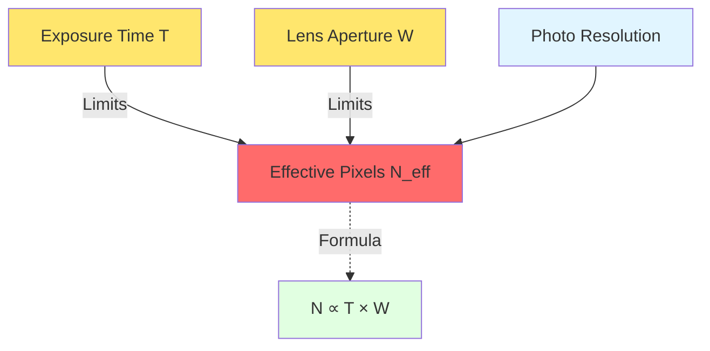

- **Exposure Time** $T$ = Time window
- **Lens Aperture** $W$ = Frequency band width
- **Pixel Count** = Effective degrees of freedom $N_{\text{eff}}$

→ Want high-resolution photos? Either long exposure, or use large aperture!

### Proposition 2: PSWF/DPSS as Variational Extremum of Optimal Windows

**Statement:**

Under given time-frequency-complexity constraints, the window function family minimizing reading error $\mathcal{E}_{\text{win}}$ is exactly PSWF/DPSS!

$$
\min_{W(\omega)} \mathcal{E}_{\text{win}}(W) \Longrightarrow W^*(\omega) = \sum_{k=0}^{K-1} c_k \psi_k(\omega)
$$

where $\{\psi_k\}$ are the first $K$ PSWFs.

**Plain Translation:**

**Under finite resources, PSWF/DPSS windows are the unique optimal solution with "minimum error"!**

Use other window functions? → Error must be larger!

**Daily Analogy:** Most fuel-efficient driving

Given:

- Distance from start to end (time window $T$)
- Maximum speed limit (frequency band $W$)
- Fuel tank capacity (complexity budget)

**Question:** How to drive most fuel-efficiently (minimum error)?

**Answer:** Follow "optimal speed curve" (PSWF trajectory)!

- Accelerate too hard → Waste fuel (out-of-band leakage)
- Drive too slow → Can't arrive (insufficient energy)
- **PSWF speed curve** → Exactly most fuel-efficient!

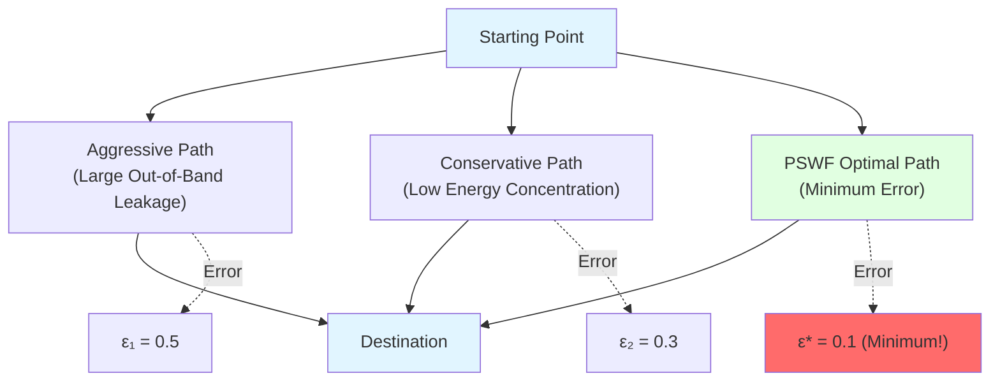

### Corollary: Windowed Clock Solves Negative Delay Problem

In some scattering systems, Wigner-Smith time delay $Q(\omega)$ may have **negative eigenvalues** → Negative delay!

**Physical Confusion:** Particles "arrive early"? Violate causality?

**BTG Explanation:** Negative delay is just a **local phase effect**, not true "superluminal"!

**Solution: Windowed Clock**

Define windowed time scale:

$$
\Theta_\Delta(\omega) = (\rho_{\text{rel}} * P_\Delta)(\omega)
$$

where $P_\Delta(\omega)$ is a PSWF window of width $\Delta$.

**Key Property:**

$$
\text{When} \quad \Delta > \Gamma_{\min} \quad \Rightarrow \quad \Theta_\Delta(\omega) > 0
$$

**Plain Translation:**

**Theoretically, as long as window width is large enough, negative delay is "smoothed out", keeping clock reading positive.**

**Daily Analogy:** Slow-motion video of fast action

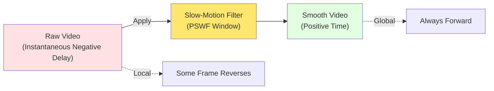

- **Raw Video** = Instantaneous time delay (may be negative)
- **Slow-Motion Filter** = Windowed smoothing (PSWF)
- **Smooth Video** = Windowed clock (always positive)

## Experimental Verification and Applications

### 1. Atomic Clock Network: Distributed Boundary Clock

**Experimental Setup:**

- Multiple atomic clocks distributed at different spatial positions ("stations" on boundary)
- Each clock measures local time scale $\kappa_i(\omega)$
- Synchronize via fiber/satellite links

**BTG Explanation:**

Each atomic clock corresponds to a "local section" $\Sigma_i$ on the boundary.

Global time = Consensus of all local sections:

$$
\kappa_{\text{global}}(\omega) = \text{consensus}(\{\kappa_i(\omega)\}_{i=1}^N)
$$

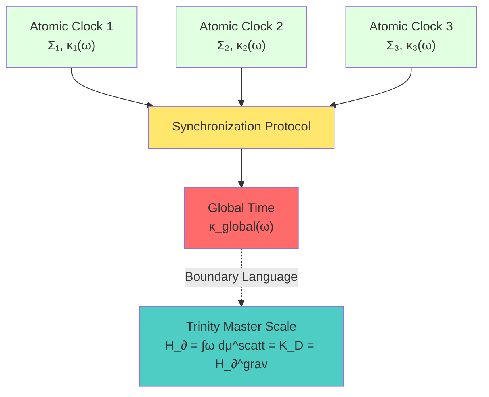

**Key Technologies:**

- Use DPSS window functions to process each clock's readings
- Achieve consensus via relative entropy minimization
- Tolerate individual clock failures (robustness)

### 2. Electromagnetic Scattering Network: Microwave Cavity Boundary Clock

**Experimental Setup:**

- Multi-port microwave cavity (artificial "spacetime")
- Measure scattering matrix $S(\omega)$
- Calculate Wigner-Smith matrix $Q(\omega) = -iS^\dagger \partial_\omega S$

**Measure Time Scale:**

$$
\kappa(\omega) = \frac{1}{2\pi} \text{tr} Q(\omega)
$$

**Verify Scale Identity:**

1. **Scattering Side:** Measure phase derivative $\varphi'(\omega)/\pi$
2. **Delay Side:** Measure group delay $\text{tr}Q(\omega)/2\pi$
3. **Verify:** Are the two equal?

**Experimental Challenges:**

- Finite frequency domain sampling → Optimize with DPSS windows
- Phase unwrapping
- Noise suppression

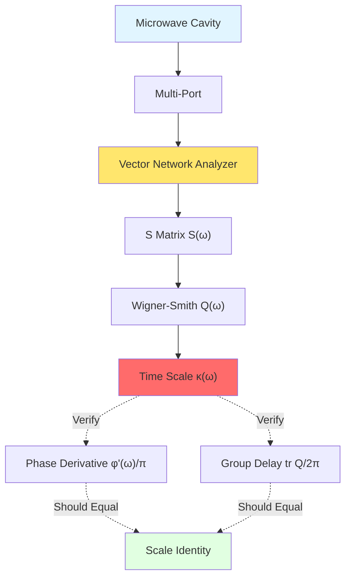

### 3. FRB Fast Radio Burst: Cosmic-Scale Boundary Clock

**Observation Object:**

Fast Radio Burst (FRB) signals traversing cosmological distances.

**Measured Quantities:**

- Dispersion delay $\tau_{\text{DM}}(\omega)$
- Scattering broadening $\tau_{\text{scatt}}(\omega)$
- Phase residual $\Phi_{\text{residual}}(\omega)$

**BTG Explanation:**

FRB propagation = **Giant scattering experiment** traversing cosmic boundary!

Phase residual $\Phi_{\text{residual}}(\omega)$ encodes:

- Vacuum polarization effects
- Gravitational lensing
- Unknown new physics

**Windowed Upper Bound:**

Process FRB spectrum with PSWF window function:

$$
R_{\text{FRB}} = \int_{\Omega_{\text{FRB}}} W_{\text{FRB}}(\omega) \Phi_{\text{residual}}(\omega) d\omega
$$

If observation shows $|R_{\text{FRB}}| < \varepsilon_{\text{obs}}$, then get unified time scale perturbation upper bound:

$$
||\delta\kappa(\omega)| < \frac{\varepsilon_{\text{obs}}}{|W_{\text{FRB}}| C_{\text{FRB}}}
$$

**Significance:**

- FRB = Cosmic-scale time scale standard!
- Can test tiny deviations from unified time scale
- Search for new physics beyond standard model

### 4. δ-Ring Scattering: Laboratory Precision Ruler

**Experimental Setup:**

One-dimensional ring (circumference $L$) with δ potential:

$$
V(x) = \alpha_\delta \delta(x)
$$

Plus Aharonov-Bohm magnetic flux $\theta$.

**Spectral Quantization Equation:**

$$
\cos(kL) + \frac{\alpha_\delta}{k}\sin(kL) = \cos\theta
$$

**Measurement:**

1. Change magnetic flux $\theta$
2. Observe shift of energy spectrum $\{k_n(\theta)\}$
3. Invert to get $\alpha_\delta$ and $\theta$

**BTG Application:**

δ-ring scattering = Controllable "laboratory boundary clock"!

- Known geometric parameters $(L, \theta)$
- Precisely tunable $\alpha_\delta$
- Used to **calibrate** unified time scale

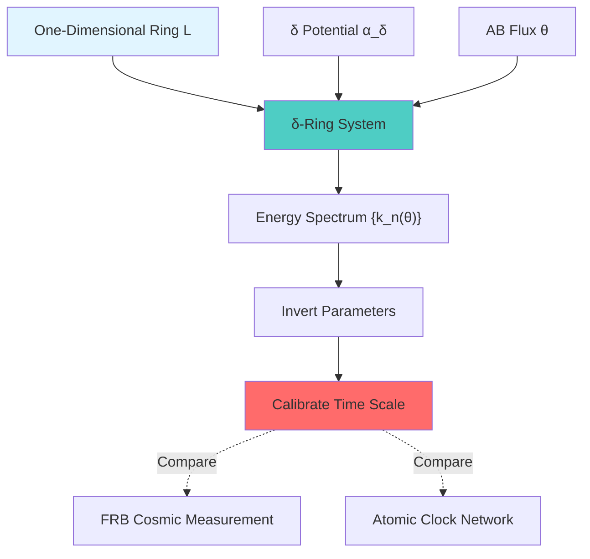

**Cross-Platform Scale Identity:**

- FRB: Cosmic scale ($\sim$ Gpc)
- Atomic Clock: Earth scale ($\sim$ km)
- δ-ring: Laboratory scale ($\sim$ mm)

**All three should agree on unified time scale $\kappa(\omega)$!**

## Philosophical Implications: Measurability of Time

### Is Time "Reality" or "Reading"?

**Traditional View:**

Time is "absolute reality", clocks just "measure" it.

**BTG View:**

Time **is defined as** the reading of scale master $\kappa(\omega)$.

- No reading → No time (see Chapter 08 no-observer theorem)
- With reading → Time appears (attention geodesic)

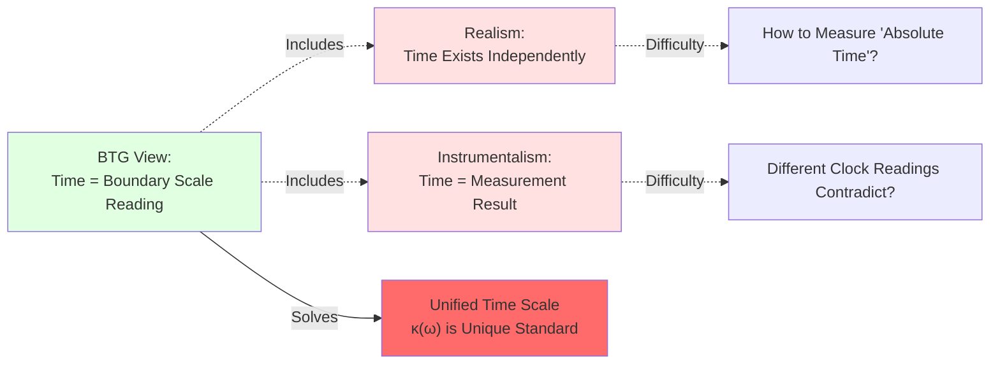

**Key Understanding:**

1. **Boundary scale $\kappa(\omega)$ objectively exists** (exists even without observer)
2. **Time axis $\tau$ requires observer selection** (attention geodesic)
3. **Clock readings must be windowed** (PSWF/DPSS)

→ Time is both **objective** (scale exists), **subjective** (needs selection), and **instrumental** (needs measurement)!

### Philosophy of Finiteness: You Cannot Measure "Everything"

**Profound Insight:**

Time-frequency-complexity degrees of freedom upper bound:

$$
N_{\text{eff}} \lesssim \frac{2WT}{\pi}
$$

Tells us: **Under finite resources, you can only know finite information!**

**Corollaries:**

1. **Cannot simultaneously precisely measure all frequencies** (frequency band limit)
2. **Cannot measure infinite time** (time window limit)
3. **Cannot read infinite data with finite instruments** (complexity limit)

**Daily Analogy:** Reading time in library

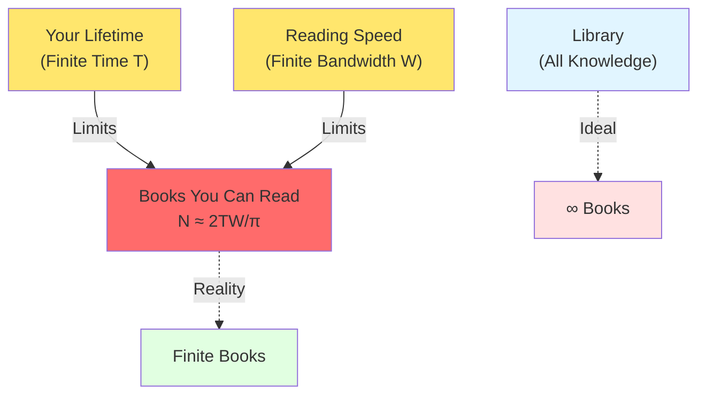

- **Library** = Complete time scale $\kappa(\omega)$
- **Your Lifetime** = Time window $T$
- **Reading Speed** = Frequency band $W$
- **Books You Can Read** = Effective degrees of freedom $N_{\text{eff}}$

→ You cannot finish the library! Can only choose most important books to read (optimal window function)!

**This is viewed as an intrinsic limitation of physical laws.**

## Connections with Previous and Following Chapters

### Review Chapters 07-08: From Stage to Clock

**Progressive Relationship:**

- Chapter 07: **Boundary is stage** (where physics happens)
- Chapter 08: **Observer chooses time axis** (who is on stage, how to choose path)
- Chapter 09 (this chapter): **Boundary clock measures time** (how to read with instruments)

**Analogy:** Three elements of performance

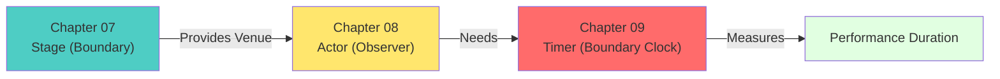

### Preview Chapter 10: Trinity Master Scale

Next chapter will reveal **how the three equivalent definitions of scale master $\kappa(\omega)$ perfectly unify on the boundary**:

$$
\kappa(\omega) \xleftrightarrow{\text{Scattering}} \frac{\varphi'(\omega)}{\pi} \xleftrightarrow{\text{Modular Flow}} \frac{1}{2\pi}\text{tr}Q(\omega) \xleftrightarrow{\text{Gravity}} H_∂^{\text{grav}}
$$

**Analogy Preview:**

- Chapter 09 (this chapter): How to **use instruments** to measure $\kappa(\omega)$ (engineering implementation)
- Chapter 10 (next chapter): **Why** three definitions are equivalent (mathematical proof)

**Question Preview:**

- Scattering phase, modular flow, gravitational time look completely different, why are they equivalent?
- Is this equivalence accidental, or profound geometric necessity?

## Reference Guide

**Core Theoretical Sources:**

1. **Error Control and Spectral Windowing Readout:** `error-control-spectral-windowing-readout.md`
   - PSWF/DPSS definitions and properties
   - Time-frequency-complexity degrees of freedom upper bound
   - Window function variational extremality

2. **Phase-Frequency Unified Metrology:** `phase-frequency-unified-metrology-experimental-testbeds.md`
   - FRB vacuum polarization windowed upper bound
   - δ-ring scattering identifiability
   - Cross-platform scale identity conditions

3. **Unified Time Scale Geometry Domains and Solvable Models:** `unified-time-scale-geometry-domains-solvable-models.md` (Chapters 05-12)
   - Windowed clock solves negative delay
   - Three major definition domains

**Mathematical Tools:**

- Classic papers by Slepian et al. on PSWF
- DPSS applications in multi-window spectral estimation (Thomson method)
- Time-frequency analysis textbooks

---

**Next Chapter Preview:**

Chapter 10 "Trinity Master Scale: Unified Definition of Time" will deeply explore mathematical proofs, explaining how scattering, modular flow, and gravitational time definitions perfectly align on the boundary, forming the **trinity** structure of unified time scale.

**Core Question:** Three completely different physical processes, why do they give the same time scale? What profound geometric principles underlie this?

