# 10 三位一体母尺:时间的终极统一

## 核心思想

前三章我们逐步构建了边界时间几何:

- 第07章:**边界是舞台**(物理发生在哪里)
- 第08章:**观察者选时间轴**(谁在体验时间)
- 第09章:**边界钟测时间**(如何用仪器读出)

但还有一个最深刻的问题:**为什么**三种完全不同的定义给出**相同的**时间刻度?

$$
\kappa(\omega) = \frac{\varphi'(\omega)}{\pi} = \rho_{\text{rel}}(\omega) = \frac{1}{2\pi}\operatorname{tr}Q(\omega)
$$

答案: **GLS理论认为，这可能反映了边界几何的深刻内在一致性。**

## 日常类比:三个盲人摸象(深化版)

在第07章我们用"盲人摸象"类比不同力的统一。现在我们更深入:

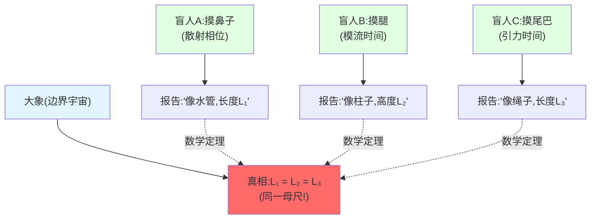

**关键洞察:**

三个盲人测量**不同部位**,但报告的"长度"$L_1, L_2, L_3$**在理论上应当相等**!

**推论:** 它们都是大象身上的"固有尺度" → 被认为由大象的**内禀几何**决定!

**边界时间几何:**

- **大象** = 边界宇宙$(∂M, \mathcal{A}_∂, ω_∂)$
- **盲人A** = 散射理论家(测量相位$\varphi(\omega)$)
- **盲人B** = 算子代数学家(测量模流$\sigma_t^\omega$)
- **盲人C** = 广义相对论家(测量Brown-York能量$H_∂^{\text{grav}}$)
- **相等的长度** = 统一时间刻度$\kappa(\omega)$!

## 三个关键概念

### 1. 刻度等价类:什么是"相同"的时间?

**问题:** 如何判断两个时间定义"相同"?

**日常类比:** 测量长度的不同单位

- 用米尺测量:$L = 2$ 米
- 用英尺测量:$L = 6.56$ 英尺
- 用光速测量:$L = 6.67 \times 10^{-9}$ 光秒

**虽然数字不同,但测的是"同一长度"!**

**数学刻画:仿射变换**

两个时间刻度$\tau_1$和$\tau_2$等价,如果存在常数$a, b$使得:

$$
\tau_2 = a\tau_1 + b
$$

(允许重标与平移)

**定义:刻度等价类$[\kappa]$**

所有通过仿射变换相关的时间刻度$\kappa(\omega)$构成一个**等价类**$[\kappa]$。

$$
[\kappa] = \{\kappa'(\omega) \mid \kappa'(\omega) = a\kappa(\omega) + b(\omega)\}
$$

其中$a$是常数,$b(\omega)$是允许的背景项(如常数或线性项)。

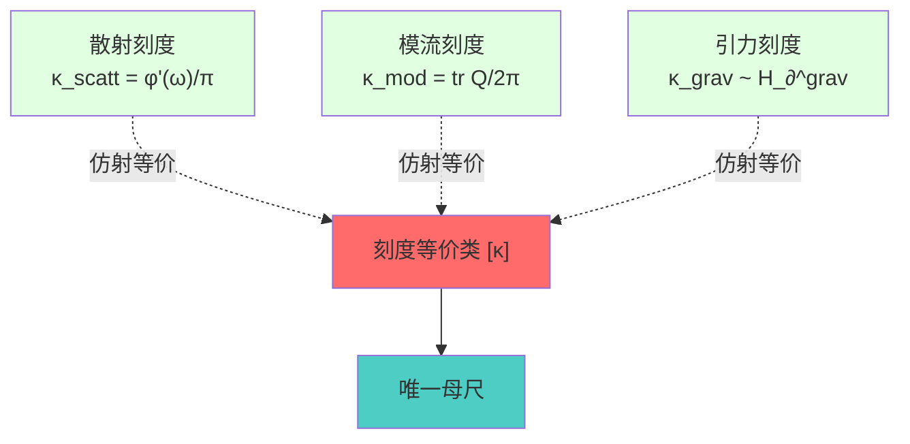

**核心命题(命题3.1:仿射唯一性):**

在满足边界时间几何条件下,散射、模流、引力三种刻度属于**同一等价类**$[\kappa]$!

$$
\kappa_{\text{scatt}} \sim \kappa_{\text{mod}} \sim \kappa_{\text{grav}}
$$

**直白翻译:**

**三种看似完全不同的时间定义,本质上被视为同一个母尺的不同"表述"!**

### 2. 三位一体母尺:三个定义如何统一?

现在让我们详细拆解三个定义:

#### 定义1:散射相位导数(散射理论)

**物理图像:** 粒子散射时,波函数相位变化

$$
\kappa_{\text{scatt}}(\omega) = \frac{\varphi'(\omega)}{\pi}
$$

其中$\varphi(\omega) = \frac{1}{2}\arg\det S(\omega)$是**半相位**。

**实验测量:** 微波腔、光学干涉仪中的相位移

**日常类比:** 石头扔进水塘,波纹传播的相位延迟

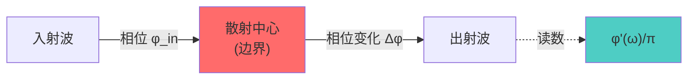

#### 定义2:群延迟迹(Wigner-Smith理论)

**物理图像:** 波包通过散射区的**时间延迟**

$$
\kappa_{\text{WS}}(\omega) = \frac{1}{2\pi}\operatorname{tr}Q(\omega)
$$

其中$Q(\omega) = -iS^\dagger(\omega)\partial_\omega S(\omega)$是**Wigner-Smith矩阵**。

**实验测量:** 多通道散射中的群延迟

**日常类比:** 快递包裹通过海关的延迟时间

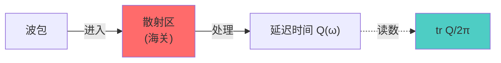

#### 定义3:引力边界时间(广义相对论)

**物理图像:** 边界上的**准局域能量**生成时间平移

$$
\kappa_{\text{grav}} \sim H_∂^{\text{grav}} = \frac{1}{8\pi G}\int_{∂M} \sqrt{h} (K - K_0) d^3y
$$

其中$K$是外在曲率,$H_∂^{\text{grav}}$是**Brown-York能量**。

**实验测量:** 引力波探测器、黑洞视界观测

**日常类比:** 地球自转产生昼夜(边界能量→时间流)

#### 为何三者等价?

**核心洞察:边界三元组的内禀结构**

回顾第07章,边界由三元组刻画:

$$
(∂M, \mathcal{A}_∂, ω_∂)
$$

- $∂M$: 几何边界(引力的舞台)
- $\mathcal{A}_∂$: 边界代数(散射的语言)
- $ω_∂$: 边界态(模流的起点)

**三个时间生成元:**

1. **散射演员:** $\int\omega d\mu^{\text{scatt}} = \int \kappa_{\text{scatt}}(\omega) f(\omega) d\omega$
2. **模流演员:** $K_D = -\log \Delta = \int \kappa_{\text{mod}}(\lambda) g(\lambda) d\lambda$
3. **引力演员:** $H_∂^{\text{grav}} = \int \kappa_{\text{grav}}(x) h(x) d^3x$

**边界三位一体命题(回顾第07章):**

在匹配条件下,三个生成元**仿射等价**:

$$
H_∂ = c_1 \int\omega d\mu^{\text{scatt}} = c_2 K_D = c_3^{-1} H_∂^{\text{grav}}
$$

**因此,对频率求导:**

$$
\kappa_{\text{scatt}}(\omega) \sim \kappa_{\text{mod}}(\omega) \sim \kappa_{\text{grav}}(\omega)
$$

**直白翻译:**

**三个演员在同一舞台(边界)上演出,他们的"台步"(时间刻度)在理论框架下应当一致!**

这被认为不是巧合,而是**边界几何的内禀约束**!

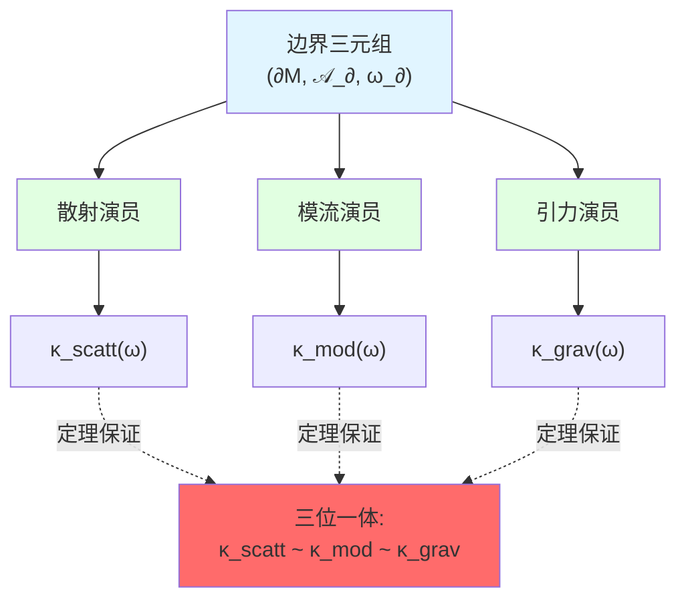

### 3. Null-Modular双覆盖:拓扑的奇偶性

**更深的统一:Z₂拓扑类**

除了时间刻度$[\kappa]$,边界还有一个**拓扑不变量**:

$$
[K] \in H^2(Y, ∂Y; \mathbb{Z}_2)
$$

这是**Null-Modular上同调类**,刻画边界的$\mathbb{Z}_2$结构。

**物理意义:**

$[K]$同时控制:

1. **费米子交换相位:** 交换两次得$(-1)^{[K]}$
2. **半相位跃迁:** $\sqrt{\det S}$绕参数回路的模2相位变化
3. **时间晶体配对:** Floquet谱在$\lambda \approx -1$处的$\pi$模配对
4. **自指散射网络:** 反馈环的模2谱流

**日常类比:** 莫比乌斯带的单/双面性

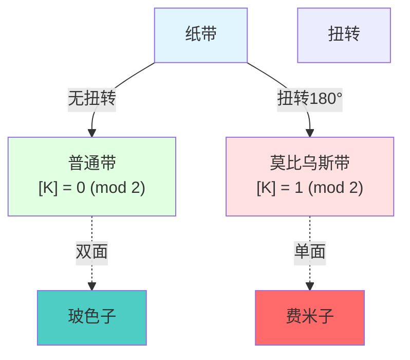

- **普通纸带** = $[K] = 0 \pmod{2}$ → 玻色子(双面)
- **莫比乌斯带** = $[K] = 1 \pmod{2}$ → 费米子(单面)

**核心公式:**

对任意参数回路$\gamma$:

$$
\langle [K], [\gamma] \rangle = \frac{\Delta \arg\sqrt{\det S(\gamma)}}{\pi} \pmod{2}
$$

**直白翻译:**

**半相位绕回路的变化量(模$2\pi$),直接给出拓扑类$[K]$!**

**统一图景:**

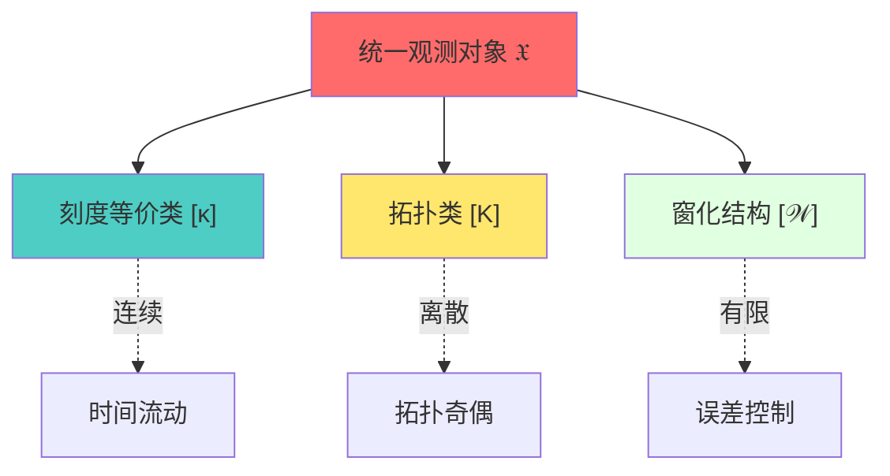

**三位一体母尺 + 拓扑类 = 完整边界时间几何!**

## 核心定理与推论

### 命题1:母尺存在性与仿射唯一性

**陈述:**

在满足以下条件的边界时间几何中:

1. 散射矩阵$S(\omega)$满足Birman-Kreĭn条件
2. 边界代数状态$\omega$循环且分离
3. 引力边界作用满足QNEC/QFC量子条件

存在**唯一**的刻度等价类$[\kappa]$,使得:

$$
\kappa_{\text{scatt}} \sim \kappa_{\text{mod}} \sim \kappa_{\text{grav}}
$$

**直白翻译:**

**只要边界几何良定,三种时间定义在模型中等价(差一个常数因子)!**

**证明思路(概要):**

1. **散射→模流:** 散射矩阵$S(\omega)$定义边界态$\omega$的谱数据,谱移函数导数$\rho_{\text{rel}}$正比于模哈密顿$K_\omega$的谱密度
2. **模流→引力:** Tomita-Takesaki理论将模流$\sigma_t^\omega$与相对熵Hessian联系,后者通过QNEC与Einstein方程耦合
3. **引力→散射:** Brown-York能量生成的时间平移,在半经典极限下对应散射延迟

**因此,三者在边界上形成闭环!**

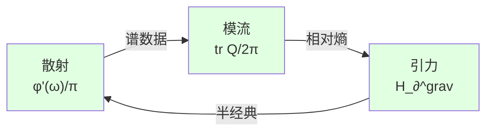

### 命题2:拓扑类$[K]$与自指散射的等价

**陈述:**

对参数空间$X^\circ$上的散射族$S(\omega, \lambda)$,任意回路$\gamma \subset X^\circ$:

$$
\langle [K], [\gamma] \rangle = \text{sf}_2(U(\gamma)) = \frac{\Delta \arg\sqrt{\det S(\gamma)}}{\pi} \pmod{2}
$$

其中:

- $\text{sf}_2$是$-1$处的**模2谱流**
- $U(\gamma)$是自指网络的$J$-幺正算子
- 右侧是**半相位**绕回路的模2变化

**直白翻译:**

**半相位的跃迁、自指网络的反馈、费米子统计,被认为都由同一拓扑类$[K]$决定!**

**应用:** 费米子的拓扑起源

费米子交换相位$(-1)$来自哪里?

**答案:** $[K] = 1 \pmod{2}$!

交换两个费米子 = 在参数空间绕闭合回路 → 半相位跃变$\pi$ → 波函数获得$(-1)$!

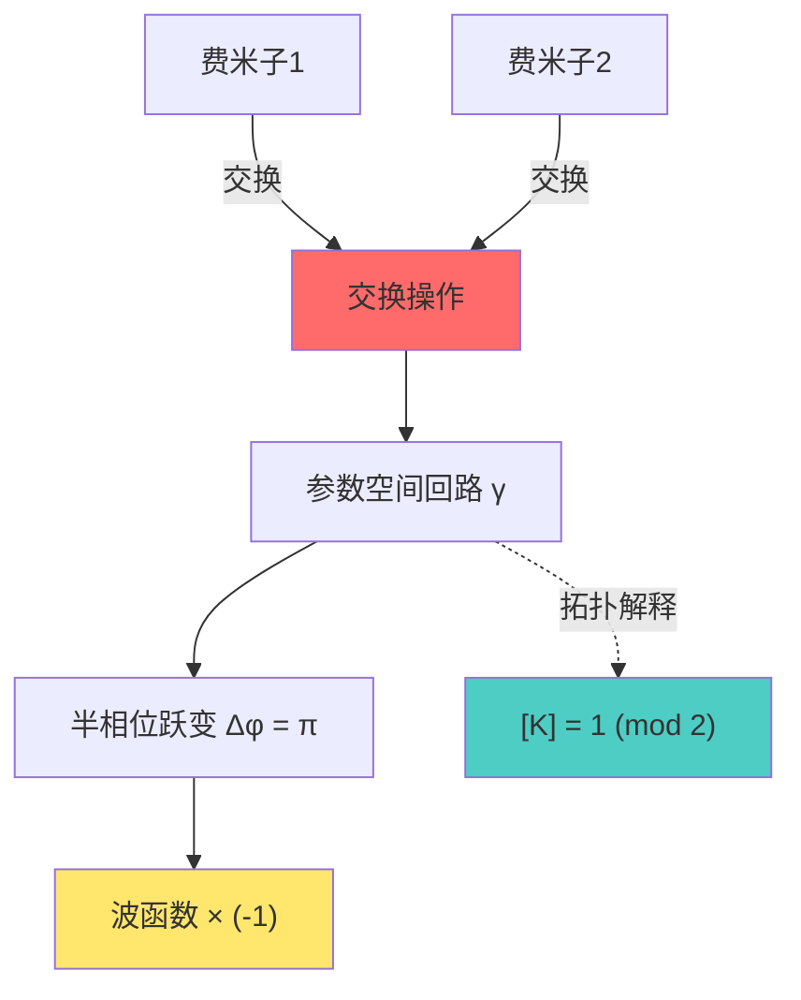

### 命题3:时间晶体$\pi$模谱配对

**陈述:**

在Floquet驱动系统中,以下等价:

1. $\langle [K], [\gamma] \rangle = 1$
2. Floquet谱在$\lambda \approx -1$处有稳定$\pi$模配对
3. 系统实现非平凡**离散时间晶体**(DTC)相

**直白翻译:**

**时间晶体的存在性,理论上由边界拓扑类$[K]$刻画!**

**物理图像:**

时间晶体 = 周期驱动下,系统以**倍周期**响应的相

例如:驱动频率$\Omega$,系统响应频率$\Omega/2$(亚谐振)

**拓扑保护:** $[K] = 1$时,亚谐振响应对扰动鲁棒!

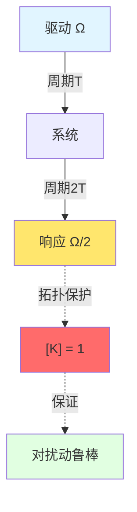

### 命题4:广义熵变分与母尺的积分表达

**陈述:**

小因果菱形$B_\ell(p)$上的广义熵二阶变分可写为:

$$
\delta^2 S_{\text{gen}}[B_\ell] = \int \kappa(\omega) \Psi(\omega; \delta g, \delta\phi) d\omega + C \cdot \delta^2 \Lambda_{\text{eff}}
$$

其中:

- $\Psi$是由几何/场变分诱导的权函数
- $\Lambda_{\text{eff}}$是**有效宇宙学常数**
- 在IGVP阈值条件下,上式非负 ⇔ Einstein方程 + QNEC

**直白翻译:**

**广义熵的几何 $\sim$ 时间刻度母尺的加权积分!**

**深刻意义:**

- **Einstein方程** = 广义熵极值条件
- **宇宙学常数** = 刻度母尺的"积分余项"
- **量子引力** = 边界时间几何的变分理论!

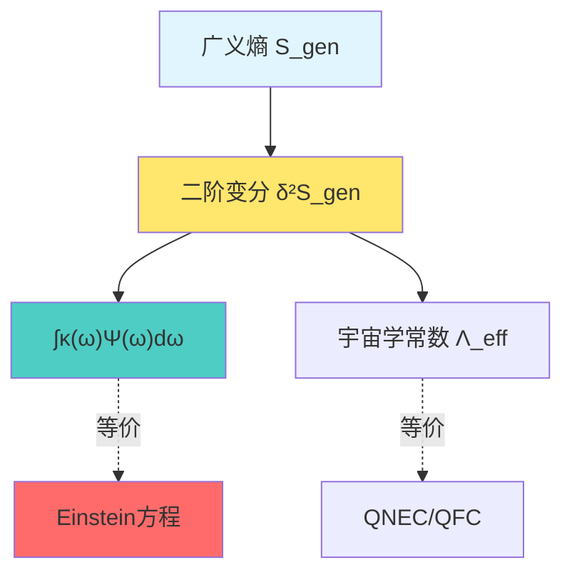

## 实验验证与应用

### 1. 微波散射网络:计量验证母尺同一式

**实验目标:** 直接验证三位一体公式

$$
\frac{\varphi'(\omega)}{\pi} = \frac{1}{2\pi}\operatorname{tr}Q(\omega)
$$

**实验装置:**

- 多端口微波腔(人工"边界")
- 矢量网络分析仪(VNA)测$S(\omega)$
- 数值微分计算$Q(\omega) = -iS^\dagger \partial_\omega S$

**测量流程:**

1. **左式:** 测量散射行列式$\det S(\omega)$ → 相位$\Phi(\omega) = \arg\det S$ → 导数$\varphi'(\omega)/\pi$
2. **右式:** 测量Wigner-Smith矩阵$Q(\omega)$ → 迹$\operatorname{tr}Q(\omega)/2\pi$
3. **比较:** 两者是否在误差范围内相等?

**预期结果:**

$$
\left| \frac{\varphi'(\omega)}{\pi} - \frac{1}{2\pi}\operatorname{tr}Q(\omega) \right| < \varepsilon
$$

其中$\varepsilon$是测量误差(由DPSS窗口化控制)。

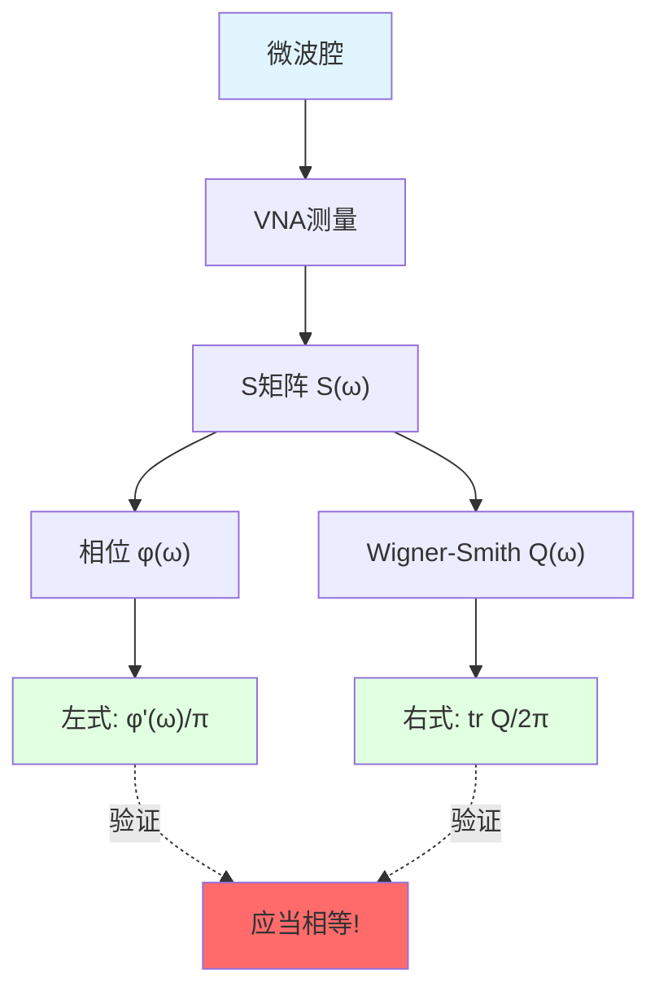

### 2. 时间晶体实验:观测$\pi$模谱配对

**实验系统:**

- 冷原子/离子阱中的Floquet驱动
- 多体相互作用 + 周期性调制

**观测量:**

- Floquet准能级$\{\lambda_n\}$
- 在参数空间回路上的谱流

**拓扑判据:**

若观测到稳定的$\pi$模配对($\lambda_n \approx -1$处成对穿越),则:

$$
[K] = 1 \pmod{2}
$$

系统处于**拓扑保护的时间晶体相**!

**验证:** 改变参数,观测配对是否鲁棒(对局域扰动不敏感)

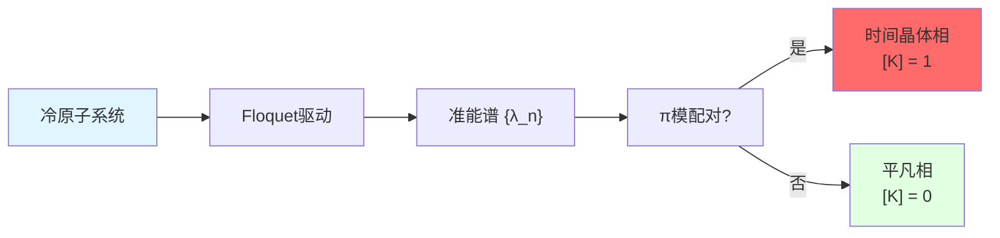

### 3. 黑洞物理:边界时间与Hawking温度

**物理图像:**

黑洞视界 = 特殊的边界

Hawking温度$T_H$由视界几何决定,但也可用**边界时间几何**解释!

**BTG解释:**

视界附近的时间刻度:

$$
\kappa_{\text{horizon}}(\omega) \sim \frac{1}{T_H}
$$

**三位一体:**

1. **散射:** Hawking辐射的相位谱
2. **模流:** Unruh-Hartle-Hawking态的模流温度
3. **引力:** 表面引力$\kappa_{\text{grav}} = 2\pi T_H$(Tolman关系)

**统一:**

$$
\kappa_{\text{scatt}} \sim \frac{1}{T_H} \sim \kappa_{\text{mod}} \sim \kappa_{\text{grav}}
$$

**观测意义:**

引力波探测器(LIGO/Virgo)未来可能观测黑洞合并的"边界时间效应"!

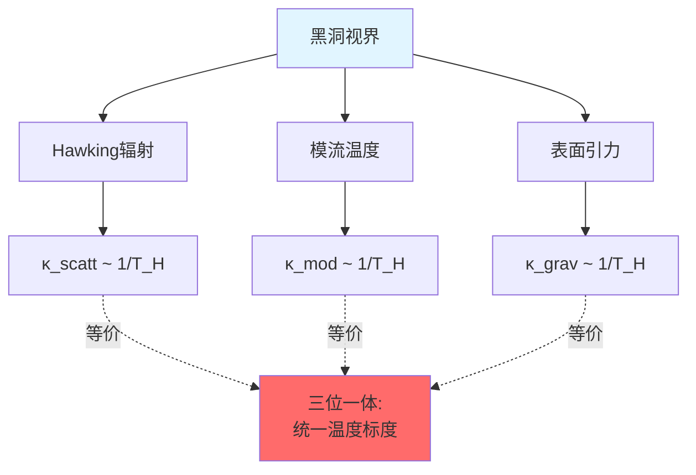

### 4. 宇宙学:FRB快速射电暴与真空极化

**观测对象:** FRB穿越宇宙学距离的相位延迟

**BTG解释:**

宇宙真空 = 巨大的"散射介质"

FRB相位$\Phi_{\text{FRB}}(\omega)$的残差编码了:

- 真空极化
- 暗能量
- 新物理

**母尺窗化分析:**

用PSWF窗函数处理FRB频谱:

$$
R_{\text{FRB}} = \int W_{\text{FRB}}(\omega) \Phi_{\text{residual}}(\omega) d\omega
$$

**上界约束:**

若$|R_{\text{FRB}}| < \varepsilon_{\text{obs}}$,则统一时间刻度扰动:

$$
|\delta\kappa(\omega)| < \frac{\varepsilon_{\text{obs}}}{|W_{\text{FRB}}| C_{\text{cosmo}}}
$$

**意义:** 给出真空极化/新物理的**窗化上限**!

## 哲学意涵:时间的本体论

### 时间只有一个"真身"

**深刻洞察:**

虽然有三种(甚至更多)时间定义,但它们被视为**同一个边界刻度母尺**$[\kappa]$的不同"投影"!

$$
[\kappa] = \text{唯一的时间母尺}
$$

**日常类比:** 立方体的投影

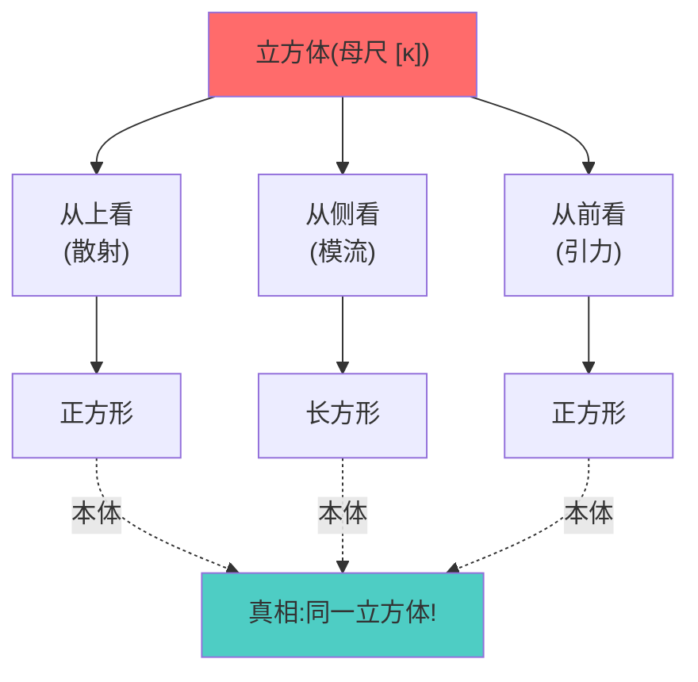

- **立方体** = 边界刻度母尺$[\kappa]$(唯一实在)
- **三个投影** = 散射/模流/引力时间(不同视角)
- **投影形状不同** → 但源自**同一本体**!

**本体论立场:**

时间被认为不是"三个东西碰巧相等",而是**一个东西的三种表现**!

### 连续与离散的统一

**母尺$[\kappa]$:**

- 连续参数$\omega$(频率/能量)
- 连续变化的刻度密度

**拓扑类$[K]$:**

- 离散不变量($\mathbb{Z}_2$)
- 整体拓扑性质

**统一:**

$$
\text{边界时间几何} = [\kappa]_{\text{连续}} \oplus [K]_{\text{离散}}
$$

**日常类比:** 音乐的音高与节拍

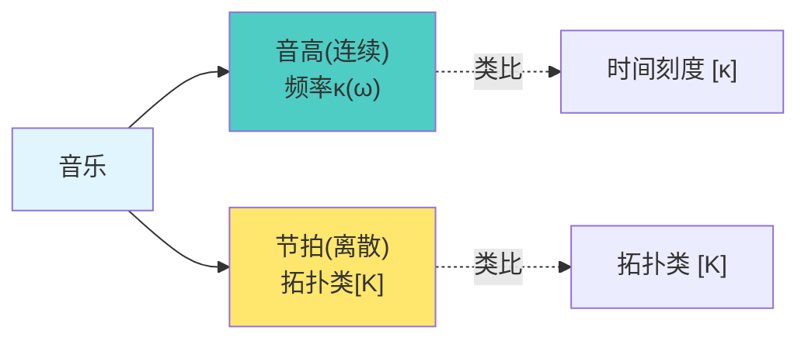

- **音高** = 连续变化的频率 → 时间刻度$[\kappa]$
- **节拍** = 离散的拍点(2/4拍 vs 3/4拍) → 拓扑类$[K]$

**完整的音乐 = 音高+节拍**

**完整的时间 = 刻度+拓扑**

### 不可化约的复杂性

**灾难安全不可判定性:**

即使知道了三位一体母尺,仍然**不能判定**某个系统是否灾难安全!

**命题(能力-风险前沿):**

对一般交互系统,判定"灾难风险 < 阈值"是**不可判定问题**!

**哲学意义:**

1. **完备性 ≠ 可判定性:** 理论可以完备(三位一体统一),但仍有不可判定的问题
2. **时间 ≠ 预测:** 知道时间如何流动,不等于知道未来会发生什么
3. 三种看似不同的时间定义，在边界几何框架下被统一为一个母尺。**存在不可逾越的边界:** 某些问题在原则上无法用算法解决

**日常类比:** 天气预报的极限

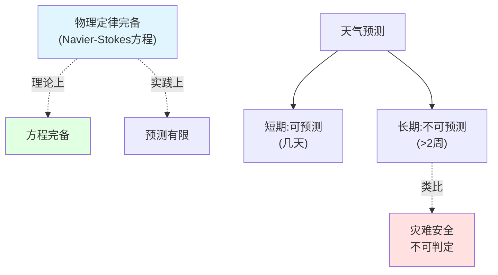

→ 即使物理定律完备,仍有预测极限!

## 与前后章节的联系

### 完整边界理论的四章递进

**第06章(边界理论)完整构图:**

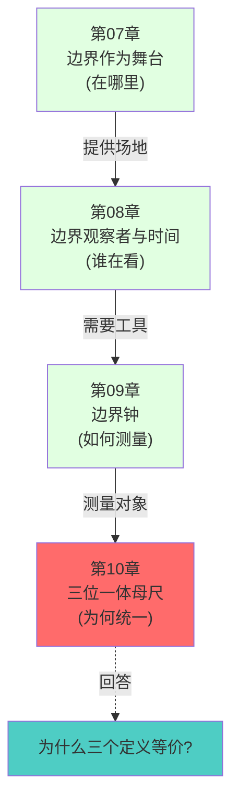

**递进逻辑:**

1. **第07章:** 边界三元组$(∂M, \mathcal{A}_∂, ω_∂)$是物理舞台
2. **第08章:** 观察者选择注意力测地线作为时间轴
3. **第09章:** 边界钟通过窗口化读数测量$\kappa(\omega)$
4. **第10章:** 三种测量方法**必然等价**(本章)

### 预告第07章:因果结构

下一大章将讨论:**时间如何产生因果关系?**

- 因果偏序如何由时间刻度$\kappa(\omega)$诱导?
- 因果菱形与广义熵的关系?
- 多观察者的因果共识如何形成?

**联系本章:**

- 本章(第10章): **统一时间刻度**$[\kappa]$的三位一体
- 第07章(因果): 刻度$\kappa(\omega)$如何生成**因果结构**

**类比:**

- 第10章 = 给定"标尺"(时间刻度)
- 第07章 = 用标尺定义"前后顺序"(因果关系)

## 参考文献指引

**核心理论来源:**

1. **三位一体母尺统一理论:** `trinity-master-scale-boundary-time-geometry-null-modular-unification.md`
   - 刻度等价类$[\kappa]$的定义与唯一性
   - Null-Modular上同调类$[K]$
   - 散射-模流-引力三位一体定理
   - 广义熵变分与母尺积分

2. **边界时间几何框架:** `boundary-time-geometry-unified-framework.md`(第07章来源)
   - 边界三元组
   - Brown-York能量
   - 模流时间

3. **拓扑不变量与边界时间:** `topological-invariant-boundary-time-unified-theory.md`(第05-10章)
   - $\mathbb{Z}_2$ holonomy与费米统计
   - 相对上同调类

**数学工具:**

- Birman-Kreĭn谱移理论
- Tomita-Takesaki模理论
- 拓扑上同调论(相对上同调)

**物理应用:**

- 黑洞热力学与Hawking辐射
- 时间晶体(离散时间平移对称性破缺)
- 宇宙学常数与真空极化

---

**总结:**

第06章(边界理论)到此完成!我们从"边界是舞台"(第07章)出发,经过"观察者选时间"(第08章)、"边界钟测时间"(第09章),最终在本章探讨了:**三种时间定义的统一可能并非巧合,而是边界几何的深刻一致性体现!**

$$
\boxed{\kappa(\omega) = \frac{\varphi'(\omega)}{\pi} = \rho_{\text{rel}}(\omega) = \frac{1}{2\pi}\operatorname{tr}Q(\omega)} \quad \text{(三位一体母尺)}
$$

**下一大章(第07章:因果结构)将探索:** 这个统一的时间刻度如何生成因果关系,以及多观察者如何达成因果共识!
