# 10 Trinity Master Scale: The Ultimate Unification of Time

## Core Ideas

In the previous three chapters, we gradually constructed boundary time geometry:

- Chapter 07: **Boundary is the stage** (where physics happens)
- Chapter 08: **Observer chooses time axis** (who experiences time)
- Chapter 09: **Boundary clock measures time** (how to read with instruments)

But there is still the most profound question: **Why** do three completely different definitions give the **same** time scale?

$$
\kappa(\omega) = \frac{\varphi'(\omega)}{\pi} = \rho_{\text{rel}}(\omega) = \frac{1}{2\pi}\operatorname{tr}Q(\omega)
$$

The answer is stunning: **This is not coincidence, but profound necessity of boundary geometry!**

## Daily Analogy: Three Blind Men Touching an Elephant (Deepened Version)

In Chapter 07, we used "blind men touching an elephant" to analogize unification of different forces. Now we go deeper:

```mermaid
graph TB
    Elephant["Elephant (Boundary Universe)"]

    Blind1["Blind Man A: Touch Trunk<br>(Scattering Phase)"]
    Blind2["Blind Man B: Touch Leg<br>(Modular Flow Time)"]
    Blind3["Blind Man C: Touch Tail<br>(Gravitational Time)"]

    Blind1 --> Report1["Report: 'Like Water Pipe, Length L₁'"]
    Blind2 --> Report2["Report: 'Like Pillar, Height L₂'"]
    Blind3 --> Report3["Report: 'Like Rope, Length L₃'"]

    Elephant --> Truth["Truth: L₁ = L₂ = L₃<br>(Same Master Scale!)"]

    Report1 -.->|Mathematical Theorem| Truth
    Report2 -.->|Mathematical Theorem| Truth
    Report3 -.->|Mathematical Theorem| Truth

    style Elephant fill:#e1f5ff
    style Truth fill:#ff6b6b
    style Blind1 fill:#e1ffe1
    style Blind2 fill:#e1ffe1
    style Blind3 fill:#e1ffe1
```

**Key Insight:**

Three blind men measure **different parts**, but the "lengths" $L_1, L_2, L_3$ they report **must be equal**!

**Reason:** They are all "intrinsic scales" on the elephant → Determined by the elephant's **intrinsic geometry**!

**Boundary Time Geometry:**

- **Elephant** = Boundary universe $(∂M, \mathcal{A}_∂, ω_∂)$
- **Blind Man A** = Scattering theorist (measures phase $\varphi(\omega)$)
- **Blind Man B** = Operator algebraist (measures modular flow $\sigma_t^\omega$)
- **Blind Man C** = General relativist (measures Brown-York energy $H_∂^{\text{grav}}$)
- **Equal Lengths** = Unified time scale $\kappa(\omega)$!

## Three Key Concepts

### 1. Scale Equivalence Class: What is "the Same" Time?

**Question:** How to judge whether two time definitions are "the same"?

**Daily Analogy:** Different units for measuring length

- Measure with meter stick: $L = 2$ meters
- Measure with feet: $L = 6.56$ feet
- Measure with light speed: $L = 6.67 \times 10^{-9}$ light-seconds

**Although numbers differ, measuring "the same length"!**

**Mathematical Characterization: Affine Transformation**

Two time scales $\tau_1$ and $\tau_2$ are equivalent if there exist constants $a, b$ such that:

$$
\tau_2 = a\tau_1 + b
$$

(Allowing rescaling and translation)

**Definition: Scale Equivalence Class $[\kappa]$**

All time scales $\kappa(\omega)$ related by affine transformation form an **equivalence class** $[\kappa]$.

$$
[\kappa] = \{\kappa'(\omega) \mid \kappa'(\omega) = a\kappa(\omega) + b(\omega)\}
$$

where $a$ is a constant, $b(\omega)$ is an allowed background term (such as constant or linear term).

```mermaid
graph TB
    Class["Scale Equivalence Class [κ]"]

    K1["Scattering Scale<br>κ_scatt = φ'(ω)/π"]
    K2["Modular Flow Scale<br>κ_mod = tr Q/2π"]
    K3["Gravitational Scale<br>κ_grav ~ H_∂^grav"]

    K1 -.->|Affine Equivalent| Class
    K2 -.->|Affine Equivalent| Class
    K3 -.->|Affine Equivalent| Class

    Class --> Unity["Unique Master Scale"]

    style Class fill:#ff6b6b
    style K1 fill:#e1ffe1
    style K2 fill:#e1ffe1
    style K3 fill:#e1ffe1
    style Unity fill:#4ecdc4
```

**Key Theorem (Theorem 3.1: Affine Uniqueness):**

Under boundary time geometry conditions, scattering, modular flow, and gravitational scales belong to the **same equivalence class** $[\kappa]$!

$$
\kappa_{\text{scatt}} \sim \kappa_{\text{mod}} \sim \kappa_{\text{grav}}
$$

**Plain Translation:**

**Three seemingly completely different time definitions are essentially different "expressions" of the same master scale!**

### 2. Trinity Master Scale: How Do Three Definitions Unify?

Now let us break down the three definitions in detail:

#### Definition 1: Scattering Phase Derivative (Scattering Theory)

**Physical Picture:** When particles scatter, wavefunction phase changes

$$
\kappa_{\text{scatt}}(\omega) = \frac{\varphi'(\omega)}{\pi}
$$

where $\varphi(\omega) = \frac{1}{2}\arg\det S(\omega)$ is the **half-phase**.

**Experimental Measurement:** Phase shifts in microwave cavities, optical interferometers

**Daily Analogy:** Stone thrown into pond, phase delay of wave propagation

```mermaid
graph LR
    Input["Incident Wave"]
    Scatter["Scattering Center<br>(Boundary)"]
    Output["Outgoing Wave"]

    Input -->|Phase φ_in| Scatter
    Scatter -->|Phase Change Δφ| Output
    Output -.->|Reading| Phase["φ'(ω)/π"]

    style Scatter fill:#ff6b6b
    style Phase fill:#4ecdc4
```

#### Definition 2: Group Delay Trace (Wigner-Smith Theory)

**Physical Picture:** **Time delay** of wave packet through scattering region

$$
\kappa_{\text{WS}}(\omega) = \frac{1}{2\pi}\operatorname{tr}Q(\omega)
$$

where $Q(\omega) = -iS^\dagger(\omega)\partial_\omega S(\omega)$ is the **Wigner-Smith matrix**.

**Experimental Measurement:** Group delay in multi-channel scattering

**Daily Analogy:** Delay time of package through customs

```mermaid
graph LR
    Package["Wave Packet"]
    Customs["Scattering Region<br>(Customs)"]
    Delay["Delay Time Q(ω)"]

    Package -->|Enter| Customs
    Customs -->|Process| Delay
    Delay -.->|Reading| Trace["tr Q/2π"]

    style Customs fill:#ff6b6b
    style Trace fill:#4ecdc4
```

#### Definition 3: Gravitational Boundary Time (General Relativity)

**Physical Picture:** **Quasi-local energy** on boundary generates time translation

$$
\kappa_{\text{grav}} \sim H_∂^{\text{grav}} = \frac{1}{8\pi G}\int_{∂M} \sqrt{h} (K - K_0) d^3y
$$

where $K$ is extrinsic curvature, $H_∂^{\text{grav}}$ is **Brown-York energy**.

**Experimental Measurement:** Gravitational wave detectors, black hole horizon observations

**Daily Analogy:** Earth's rotation produces day and night (boundary energy → time flow)

```mermaid
graph LR
    Boundary["Boundary ∂M"]
    Curvature["Extrinsic Curvature K"]
    Energy["Brown-York Energy<br>H_∂^grav"]
    Time["Time Generation"]

    Boundary -->|Measure| Curvature
    Curvature -->|Integrate| Energy
    Energy -->|Generate| Time

    style Boundary fill:#ff6b6b
    style Energy fill:#4ecdc4
    style Time fill:#e1ffe1
```

#### Why Are the Three Equivalent?

**Core Insight: Intrinsic Structure of Boundary Triplet**

Recall Chapter 07, boundary is characterized by triplet:

$$
(∂M, \mathcal{A}_∂, ω_∂)
$$

- $∂M$: Geometric boundary (stage of gravity)
- $\mathcal{A}_∂$: Boundary algebra (language of scattering)
- $ω_∂$: Boundary state (starting point of modular flow)

**Three Time Generators:**

1. **Scattering Actor:** $\int\omega d\mu^{\text{scatt}} = \int \kappa_{\text{scatt}}(\omega) f(\omega) d\omega$
2. **Modular Flow Actor:** $K_D = -\log \Delta = \int \kappa_{\text{mod}}(\lambda) g(\lambda) d\lambda$
3. **Gravitational Actor:** $H_∂^{\text{grav}} = \int \kappa_{\text{grav}}(x) h(x) d^3x$

**Boundary Trinity Theorem (Recall Chapter 07):**

Under matching conditions, three generators are **affine equivalent**:

$$
H_∂ = c_1 \int\omega d\mu^{\text{scatt}} = c_2 K_D = c_3^{-1} H_∂^{\text{grav}}
$$

**Therefore, taking derivative with respect to frequency:**

$$
\kappa_{\text{scatt}}(\omega) \sim \kappa_{\text{mod}}(\omega) \sim \kappa_{\text{grav}}(\omega)
$$

**Plain Translation:**

**Three actors perform on the same stage (boundary), their "stage steps" (time scales) must be consistent!**

This is not coincidence, but **intrinsic constraint of boundary geometry**!

```mermaid
graph TB
    Boundary["Boundary Triplet<br>(∂M, 𝒜_∂, ω_∂)"]

    Actor1["Scattering Actor"]
    Actor2["Modular Flow Actor"]
    Actor3["Gravitational Actor"]

    Boundary --> Actor1
    Boundary --> Actor2
    Boundary --> Actor3

    Actor1 --> Time1["κ_scatt(ω)"]
    Actor2 --> Time2["κ_mod(ω)"]
    Actor3 --> Time3["κ_grav(ω)"]

    Trinity["Trinity:<br>κ_scatt ~ κ_mod ~ κ_grav"]

    Time1 -.->|Theorem Guarantees| Trinity
    Time2 -.->|Theorem Guarantees| Trinity
    Time3 -.->|Theorem Guarantees| Trinity

    style Boundary fill:#e1f5ff
    style Trinity fill:#ff6b6b
    style Actor1 fill:#e1ffe1
    style Actor2 fill:#e1ffe1
    style Actor3 fill:#e1ffe1
```

### 3. Null-Modular Double Cover: Topology's Parity

**Deeper Unification: $\mathbb{Z}_2$ Topological Class**

Besides time scale $[\kappa]$, boundary also has a **topological invariant**:

$$
[K] \in H^2(Y, ∂Y; \mathbb{Z}_2)
$$

This is the **Null-Modular cohomology class**, characterizing the $\mathbb{Z}_2$ structure of boundary.

**Physical Meaning:**

$[K]$ simultaneously controls:

1. **Fermion Exchange Phase:** Exchanging twice gives $(-1)^{[K]}$
2. **Half-Phase Transition:** Mod 2 phase change of $\sqrt{\det S}$ around parameter loop
3. **Time Crystal Pairing:** $\pi$ mod pairing of Floquet spectrum at $\lambda \approx -1$
4. **Self-Referential Scattering Network:** Mod 2 spectral flow of feedback loops

**Daily Analogy:** Single/double-sidedness of Möbius strip

```mermaid
graph TB
    Strip["Paper Strip"]
    Twist["Twist"]
    Mobius["Möbius Strip"]

    Strip -->|No Twist| NormalBand["Normal Band<br>[K] = 0 (mod 2)"]
    Strip -->|180° Twist| Mobius["Möbius Strip<br>[K] = 1 (mod 2)"]

    NormalBand -.->|Double-Sided| Boson["Boson"]
    Mobius -.->|Single-Sided| Fermion["Fermion"]

    style Strip fill:#e1f5ff
    style NormalBand fill:#e1ffe1
    style Mobius fill:#ffe1e1
    style Boson fill:#4ecdc4
    style Fermion fill:#ff6b6b
```

- **Normal Paper Strip** = $[K] = 0 \pmod{2}$ → Boson (double-sided)
- **Möbius Strip** = $[K] = 1 \pmod{2}$ → Fermion (single-sided)

**Core Formula:**

For any parameter loop $\gamma$:

$$
\langle [K], [\gamma] \rangle = \frac{\Delta \arg\sqrt{\det S(\gamma)}}{\pi} \pmod{2}
$$

**Plain Translation:**

**Mod $2\pi$ change of half-phase around loop directly gives topological class $[K]$!**

**Unified Picture:**

```mermaid
graph TB
    UnifiedObject["Unified Observational Object 𝔛"]

    Kappa["Scale Equivalence Class [κ]"]
    K["Topological Class [K]"]
    Window["Windowing Structure [𝒲]"]

    UnifiedObject --> Kappa
    UnifiedObject --> K
    UnifiedObject --> Window

    Kappa -.->|Continuous| TimeFlow["Time Flow"]
    K -.->|Discrete| Topology["Topological Parity"]
    Window -.->|Finite| ErrorControl["Error Control"]

    style UnifiedObject fill:#ff6b6b
    style Kappa fill:#4ecdc4
    style K fill:#ffe66d
    style Window fill:#e1ffe1
```

**Trinity Master Scale + Topological Class = Complete Boundary Time Geometry!**

## Core Theorems and Corollaries

### Theorem 1: Master Scale Existence and Affine Uniqueness

**Statement:**

In boundary time geometry satisfying:

1. Scattering matrix $S(\omega)$ satisfies Birman-Kreĭn conditions
2. Boundary algebra state $\omega$ is cyclic and separating
3. Gravitational boundary action satisfies QNEC/QFC quantum conditions

There exists a **unique** scale equivalence class $[\kappa]$ such that:

$$
\kappa_{\text{scatt}} \sim \kappa_{\text{mod}} \sim \kappa_{\text{grav}}
$$

**Plain Translation:**

**As long as boundary geometry is well-defined, three time definitions must be equivalent (differ by constant factor)!**

**Proof Outline:**

1. **Scattering → Modular Flow:** Scattering matrix $S(\omega)$ defines spectral data of boundary state $\omega$, derivative of spectral shift function $\rho_{\text{rel}}$ is proportional to spectral density of modular Hamiltonian $K_\omega$
2. **Modular Flow → Gravity:** Tomita-Takesaki theory relates modular flow $\sigma_t^\omega$ to relative entropy Hessian, which couples to Einstein equation via QNEC
3. **Gravity → Scattering:** Time translation generated by Brown-York energy corresponds to scattering delay in semiclassical limit

**Therefore, the three form a closed loop on the boundary!**

```mermaid
graph LR
    Scattering["Scattering<br>φ'(ω)/π"]
    Modular["Modular Flow<br>tr Q/2π"]
    Gravity["Gravity<br>H_∂^grav"]

    Scattering -->|Spectral Data| Modular
    Modular -->|Relative Entropy| Gravity
    Gravity -->|Semiclassical| Scattering

    style Scattering fill:#e1ffe1
    style Modular fill:#e1ffe1
    style Gravity fill:#e1ffe1
```

### Theorem 2: Equivalence of Topological Class $[K]$ and Self-Referential Scattering

**Statement:**

For scattering family $S(\omega, \lambda)$ on parameter space $X^\circ$, any loop $\gamma \subset X^\circ$:

$$
\langle [K], [\gamma] \rangle = \text{sf}_2(U(\gamma)) = \frac{\Delta \arg\sqrt{\det S(\gamma)}}{\pi} \pmod{2}
$$

where:

- $\text{sf}_2$ is **mod 2 spectral flow** at $-1$
- $U(\gamma)$ is $J$-unitary operator of self-referential network
- Right side is **half-phase** mod 2 change around loop

**Plain Translation:**

**Half-phase transition, self-referential network feedback, fermion statistics, all determined by the same topological class $[K]$!**

**Application:** Topological Origin of Fermions

Where does fermion exchange phase $(-1)$ come from?

**Answer:** $[K] = 1 \pmod{2}$!

Exchanging two fermions = Going around closed loop in parameter space → Half-phase jump $\pi$ → Wavefunction acquires $(-1)$!

```mermaid
graph TB
    Fermion1["Fermion 1"]
    Fermion2["Fermion 2"]

    Exchange["Exchange Operation"]

    Fermion1 -->|Exchange| Exchange
    Fermion2 -->|Exchange| Exchange

    Exchange --> Loop["Parameter Space Loop γ"]
    Loop --> Phase["Half-Phase Jump Δφ = π"]
    Phase --> Sign["Wavefunction × (-1)"]

    Loop -.->|Topological Explanation| K["[K] = 1 (mod 2)"]

    style Exchange fill:#ff6b6b
    style K fill:#4ecdc4
    style Sign fill:#ffe66d
```

### Theorem 3: Time Crystal $\pi$ Mod Spectral Pairing

**Statement:**

In Floquet-driven systems, the following are equivalent:

1. $\langle [K], [\gamma] \rangle = 1$
2. Floquet spectrum has stable $\pi$ mod pairing at $\lambda \approx -1$
3. System realizes non-trivial **discrete time crystal** (DTC) phase

**Plain Translation:**

**Existence of time crystal is determined by boundary topological class $[K]$!**

**Physical Picture:**

Time crystal = Phase where system responds with **double period** under periodic driving

For example: Driving frequency $\Omega$, system response frequency $\Omega/2$ (subharmonic)

**Topological Protection:** When $[K] = 1$, subharmonic response is robust to perturbations!

```mermaid
graph TB
    Drive["Drive Ω"]
    System["System"]
    Response["Response Ω/2"]

    Drive -->|Period T| System
    System -->|Period 2T| Response

    Response -.->|Topological Protection| KClass["[K] = 1"]
    KClass -.->|Guarantees| Robust["Robust to Perturbations"]

    style Drive fill:#e1f5ff
    style Response fill:#ffe66d
    style KClass fill:#ff6b6b
    style Robust fill:#e1ffe1
```

### Theorem 4: Generalized Entropy Variation and Integral Expression of Master Scale

**Statement:**

Second-order variation of generalized entropy on small causal diamond $B_\ell(p)$ can be written as:

$$
\delta^2 S_{\text{gen}}[B_\ell] = \int \kappa(\omega) \Psi(\omega; \delta g, \delta\phi) d\omega + C \cdot \delta^2 \Lambda_{\text{eff}}
$$

where:

- $\Psi$ is weight function induced by geometry/field variations
- $\Lambda_{\text{eff}}$ is **effective cosmological constant**
- Under IGVP threshold conditions, above is non-negative ⇔ Einstein equation + QNEC

**Plain Translation:**

**Geometry of generalized entropy = weighted integral of time scale master!**

**Profound Meaning:**

- **Einstein Equation** = Extremum condition of generalized entropy
- **Cosmological Constant** = "integral remainder" of scale master
- **Quantum Gravity** = Variational theory of boundary time geometry!

```mermaid
graph TB
    Entropy["Generalized Entropy S_gen"]
    Variation["Second-Order Variation δ²S_gen"]
    Integral["∫κ(ω)Ψ(ω)dω"]
    Cosmological["Cosmological Constant Λ_eff"]

    Entropy --> Variation
    Variation --> Integral
    Variation --> Cosmological

    Integral -.->|Equivalent| Einstein["Einstein Equation"]
    Cosmological -.->|Equivalent| QNEC["QNEC/QFC"]

    style Entropy fill:#e1f5ff
    style Variation fill:#ffe66d
    style Integral fill:#4ecdc4
    style Einstein fill:#ff6b6b
```

## Experimental Verification and Applications

### 1. Microwave Scattering Network: Metrological Verification of Master Scale Identity

**Experimental Goal:** Directly verify trinity formula

$$
\frac{\varphi'(\omega)}{\pi} = \frac{1}{2\pi}\operatorname{tr}Q(\omega)
$$

**Experimental Setup:**

- Multi-port microwave cavity (artificial "boundary")
- Vector network analyzer (VNA) measures $S(\omega)$
- Numerical differentiation calculates $Q(\omega) = -iS^\dagger \partial_\omega S$

**Measurement Procedure:**

1. **Left Side:** Measure scattering determinant $\det S(\omega)$ → Phase $\Phi(\omega) = \arg\det S$ → Derivative $\varphi'(\omega)/\pi$
2. **Right Side:** Measure Wigner-Smith matrix $Q(\omega)$ → Trace $\operatorname{tr}Q(\omega)/2\pi$
3. **Compare:** Are the two equal within error?

**Expected Result:**

$$
\left| \frac{\varphi'(\omega)}{\pi} - \frac{1}{2\pi}\operatorname{tr}Q(\omega) \right| < \varepsilon
$$

where $\varepsilon$ is measurement error (controlled by DPSS windowing).

```mermaid
graph TB
    MicrowaveCavity["Microwave Cavity"]
    VNA["VNA Measurement"]
    SMatrix["S Matrix S(ω)"]

    MicrowaveCavity --> VNA
    VNA --> SMatrix

    SMatrix --> Phase["Phase φ(ω)"]
    SMatrix --> Q["Wigner-Smith Q(ω)"]

    Phase --> LHS["Left Side: φ'(ω)/π"]
    Q --> RHS["Right Side: tr Q/2π"]

    LHS -.->|Verify| Equal["Should Be Equal!"]
    RHS -.->|Verify| Equal

    style MicrowaveCavity fill:#e1f5ff
    style Equal fill:#ff6b6b
    style LHS fill:#e1ffe1
    style RHS fill:#e1ffe1
```

### 2. Time Crystal Experiment: Observing $\pi$ Mod Spectral Pairing

**Experimental System:**

- Floquet driving in cold atom/ion traps
- Many-body interactions + periodic modulation

**Observables:**

- Floquet quasi-energy levels $\{\lambda_n\}$
- Spectral flow on parameter space loops

**Topological Criterion:**

If stable $\pi$ mod pairing is observed (paired crossings at $\lambda_n \approx -1$), then:

$$
[K] = 1 \pmod{2}
$$

System is in **topologically protected time crystal phase**!

**Verification:** Change parameters, observe whether pairing is robust (insensitive to local perturbations)

```mermaid
graph LR
    Atoms["Cold Atom System"]
    Drive["Floquet Drive"]
    Spectrum["Quasi-Energy Spectrum {λ_n}"]

    Atoms --> Drive
    Drive --> Spectrum

    Spectrum --> Pairing["π Mod Pairing?"]
    Pairing -->|Yes| DTC["Time Crystal Phase<br>[K] = 1"]
    Pairing -->|No| Trivial["Trivial Phase<br>[K] = 0"]

    style Atoms fill:#e1f5ff
    style DTC fill:#ff6b6b
    style Trivial fill:#e1ffe1
```

### 3. Black Hole Physics: Boundary Time and Hawking Temperature

**Physical Picture:**

Black hole horizon = Special boundary

Hawking temperature $T_H$ is determined by horizon geometry, but can also be explained using **boundary time geometry**!

**BTG Explanation:**

Time scale near horizon:

$$
\kappa_{\text{horizon}}(\omega) \sim \frac{1}{T_H}
$$

**Trinity:**

1. **Scattering:** Phase spectrum of Hawking radiation
2. **Modular Flow:** Modular flow temperature of Unruh-Hartle-Hawking state
3. **Gravity:** Surface gravity $\kappa_{\text{grav}} = 2\pi T_H$ (Tolman relation)

**Unification:**

$$
\kappa_{\text{scatt}} \sim \frac{1}{T_H} \sim \kappa_{\text{mod}} \sim \kappa_{\text{grav}}
$$

**Observational Significance:**

Gravitational wave detectors (LIGO/Virgo) may observe "boundary time effects" of black hole mergers in the future!

```mermaid
graph TB
    BlackHole["Black Hole Horizon"]
    Hawking["Hawking Radiation"]
    Modular["Modular Flow Temperature"]
    Gravity["Surface Gravity"]

    BlackHole --> Hawking
    BlackHole --> Modular
    BlackHole --> Gravity

    Hawking --> T1["κ_scatt ~ 1/T_H"]
    Modular --> T2["κ_mod ~ 1/T_H"]
    Gravity --> T3["κ_grav ~ 1/T_H"]

    Trinity["Trinity:<br>Unified Temperature Scale"]

    T1 -.->|Equivalent| Trinity
    T2 -.->|Equivalent| Trinity
    T3 -.->|Equivalent| Trinity

    style BlackHole fill:#e1f5ff
    style Trinity fill:#ff6b6b
```

### 4. Cosmology: FRB Fast Radio Burst and Vacuum Polarization

**Observation Object:** Phase delay of FRB traversing cosmological distances

**BTG Explanation:**

Cosmic vacuum = Huge "scattering medium"

FRB phase $\Phi_{\text{FRB}}(\omega)$ residual encodes:

- Vacuum polarization
- Dark energy
- New physics

**Master Scale Windowing Analysis:**

Process FRB spectrum with PSWF window function:

$$
R_{\text{FRB}} = \int W_{\text{FRB}}(\omega) \Phi_{\text{residual}}(\omega) d\omega
$$

**Upper Bound Constraint:**

If $|R_{\text{FRB}}| < \varepsilon_{\text{obs}}$, then unified time scale perturbation:

$$
||\delta\kappa(\omega)| < \frac{\varepsilon_{\text{obs}}}{|W_{\text{FRB}}| C_{\text{cosmo}}}
$$

**Significance:** Gives **windowed upper bound** for vacuum polarization/new physics!

```mermaid
graph LR
    FRB["FRB Signal"]
    Universe["Cosmic Vacuum"]
    Phase["Phase Residual Φ_residual"]

    FRB -->|Traverse| Universe
    Universe -->|Scatter| Phase

    Phase --> Window["PSWF Windowing"]
    Window --> Bound["Time Scale Upper Bound<br>δκ < ε"]

    Bound -.->|Constrains| NewPhysics["New Physics?"]

    style FRB fill:#e1f5ff
    style Universe fill:#ffe1e1
    style Bound fill:#ff6b6b
```

## Philosophical Implications: Ontology of Time

### Time Has Only One "True Form"

**Profound Insight:**

Although there are three (or more) time definitions, they are all different "projections" of the **same boundary scale master** $[\kappa]$!

$$
[\kappa] = \text{unique time master scale}
$$

**Daily Analogy:** Projection of cube

```mermaid
graph TB
    Cube["Cube (Master Scale [κ])"]

    Proj1["From Above<br>(Scattering)"]
    Proj2["From Side<br>(Modular Flow)"]
    Proj3["From Front<br>(Gravity)"]

    Cube --> Proj1
    Cube --> Proj2
    Cube --> Proj3

    Proj1 --> Shape1["Square"]
    Proj2 --> Shape2["Rectangle"]
    Proj3 --> Shape3["Square"]

    Truth["Truth: Same Cube!"]

    Shape1 -.->|Ontology| Truth
    Shape2 -.->|Ontology| Truth
    Shape3 -.->|Ontology| Truth

    style Cube fill:#ff6b6b
    style Truth fill:#4ecdc4
```

- **Cube** = Boundary scale master $[\kappa]$ (unique reality)
- **Three Projections** = Scattering/modular flow/gravitational time (different perspectives)
- **Projection Shapes Differ** → But originate from **same ontology**!

**Ontological Position:**

Time is not "three things coincidentally equal", but **three manifestations of one thing**!

### Unification of Continuous and Discrete

**Master Scale $[\kappa]$:**

- Continuous parameter $\omega$ (frequency/energy)
- Continuously varying scale density

**Topological Class $[K]$:**

- Discrete invariant ($\mathbb{Z}_2$)
- Global topological property

**Unification:**

$$
\text{Boundary Time Geometry} = [\kappa]_{\text{Continuous}} \oplus [K]_{\text{Discrete}}
$$

**Daily Analogy:** Pitch and beat of music

- **Pitch** = Continuously varying frequency → Time scale $[\kappa]$
- **Beat** = Discrete beats (2/4 time vs 3/4 time) → Topological class $[K]$

**Complete Music = Pitch + Beat**

**Complete Time = Scale + Topology**

### Irreducible Complexity

**Catastrophe Safety Undecidability:**

Even knowing the trinity master scale, one still **cannot decide** whether a system is catastrophe-safe!

**Theorem (Capability-Risk Frontier):**

For general interactive systems, deciding "catastrophe risk < threshold" is an **undecidable problem**!

**Philosophical Meaning:**

1. **Completeness ≠ Decidability:** Theory can be complete (trinity unified), but still has undecidable problems
2. **Time ≠ Prediction:** Knowing how time flows does not mean knowing what will happen in the future
3. **Insurmountable Boundaries Exist:** Some problems cannot be solved by algorithms in principle

**Daily Analogy:** Limits of weather forecasting

→ Even if physics laws are complete, prediction limits still exist!

## Connections with Previous and Following Chapters

### Complete Four-Chapter Progression of Boundary Theory

**Complete Picture of Chapter 06 (Boundary Theory):**

**Progressive Logic:**

1. **Chapter 07:** Boundary triplet $(∂M, \mathcal{A}_∂, ω_∂)$ is the physical stage
2. **Chapter 08:** Observer chooses attention geodesic as time axis
3. **Chapter 09:** Boundary clock measures $\kappa(\omega)$ through windowed readings
4. **Chapter 10:** Three measurement methods **must be equivalent** (this chapter)

### Preview Chapter 07: Causal Structure

Next major chapter will discuss: **How does time generate causality?**

- How is causal partial order induced by time scale $\kappa(\omega)$?
- Relationship between causal diamond and generalized entropy?
- How do multiple observers form causal consensus?

**Connection with This Chapter:**

- This chapter (Chapter 10): **Unified time scale** $[\kappa]$ trinity
- Chapter 07 (Causality): How scale $\kappa(\omega)$ generates **causal structure**

**Analogy:**

- Chapter 10 = Given "ruler" (time scale)
- Chapter 07 = Use ruler to define "before/after order" (causality)

## Reference Guide

**Core Theoretical Sources:**

1. **Trinity Master Scale Unification Theory:** `trinity-master-scale-boundary-time-geometry-null-modular-unification.md`
   - Definition and uniqueness of scale equivalence class $[\kappa]$
   - Null-Modular cohomology class $[K]$
   - Scattering-modular flow-gravity trinity theorem
   - Generalized entropy variation and master scale integral

2. **Boundary Time Geometry Framework:** `boundary-time-geometry-unified-framework.md` (Chapter 07 source)
   - Boundary triplet
   - Brown-York energy
   - Modular flow time

3. **Topological Invariants and Boundary Time:** `topological-invariant-boundary-time-unified-theory.md` (Chapters 05-10)
   - $\mathbb{Z}_2$ holonomy and fermion statistics
   - Relative cohomology classes

**Mathematical Tools:**

- Birman-Kreĭn spectral shift theory
- Tomita-Takesaki modular theory
- Topological cohomology theory (relative cohomology)

**Physical Applications:**

- Black hole thermodynamics and Hawking radiation
- Time crystals (discrete time translation symmetry breaking)
- Cosmological constant and vacuum polarization

---

**Summary:**

Chapter 06 (Boundary Theory) is now complete! Starting from "boundary is the stage" (Chapter 07), through "observer chooses time" (Chapter 08), "boundary clock measures time" (Chapter 09), we finally reveal in this chapter: **The unification of three time definitions is not coincidence, but profound necessity of boundary geometry!**

$$
\boxed{\kappa(\omega) = \frac{\varphi'(\omega)}{\pi} = \rho_{\text{rel}}(\omega) = \frac{1}{2\pi}\operatorname{tr}Q(\omega)} \quad \text{(Trinity Master Scale)}
$$

**Next Major Chapter (Chapter 07: Causal Structure) will explore:** How this unified time scale generates causality, and how multiple observers reach causal consensus!

