# Boundary Theory Summary: Boundary Nature of Physics

> *"From the GLS perspective, the bulk is viewed as a projection of boundary data; physical objects are primarily defined on the boundary."*

## 🎯 Core Review

In this chapter, we explored a **paradigm shift from bulk to boundary**. Let's review this theoretical journey.

### Core Insight

## Step 1: Three Major Historical Evidences

In [01-Why Boundary](01-why-boundary_en.md), we saw three independent historical evidences, all pointing to the same conclusion:

### Evidence 1: Scattering Theory (Quantum Mechanics)

**Analogy**: Imagine you're throwing balls in a completely dark room, you can only measure balls entering/exiting at the door. What happens inside the room? You'll never see it!

**Mathematics**:

$$\boxed{S\text{-Matrix Defined at Asymptotic Boundary}\quad \mathcal{I}^\pm}$$

**Key Formula**:

$$S(\omega) = \Omega_+^\dagger \Omega_-$$

where $\Omega_\pm$ are wave operators, their definition requires **asymptotic boundary conditions**.

**Insight**: Bulk spectral information completely determined by boundary scattering data!

### Evidence 2: Quantum Field Theory (Modular Flow Theory)

**Analogy**: Room's thermometer is not in the room, but nailed on the wall. Wall is where measurement happens!

**Mathematics**:

$$\boxed{\text{Modular Hamiltonian}\ K_\omega\ \text{Localized on Regional Boundary}\ \partial O}$$

**Key Formula** (Bisognano-Wichmann Theorem):

$$\sigma_t^\omega(A) = e^{2\pi i K_\mathrm{boost} t} A e^{-2\pi i K_\mathrm{boost} t}$$

For wedge $W$, modular flow equals Lorentz boost, its generator localized on **wedge boundary (Rindler horizon)**.

**Insight**: Relative entropy, entanglement entropy and other information-theoretic quantities all defined on boundary!

### Evidence 3: General Relativity (Variational Principle)

**Analogy**: Imagine defining energy for a box with a lid. If you only look inside the box, energy definition is **incomplete**—you must consider the lid (boundary)!

**Mathematics**:

$$\boxed{\delta S_{\mathrm{EH}} = \text{Volume Term} + \text{Boundary Term (Contains Normal Derivatives)}}$$

Einstein-Hilbert action alone **cannot** give well-defined variational principle!

**GHY Rescue**:

$$S = S_{\mathrm{EH}} + S_{\mathrm{GHY}}$$

$$S_{\mathrm{GHY}} = \frac{\varepsilon}{8\pi G}\int_{\partial\mathcal{M}}\sqrt{|h|}\, K\, \mathrm{d}^3x$$

Now boundary terms completely cancel!

**Insight**: Gravitational action principle is essentially a **boundary variational principle**!

## Step 2: Boundary Data Triple

In [02-Boundary Data Triple](02-boundary-data-triple_en.md), we constructed unified boundary description:

### Definition (Boundary Triple)

$$\boxed{(\partial\mathcal{M}, \mathcal{A}_\partial, \omega_\partial)}$$

**Three Components**:

```mermaid
graph LR
    TRIPLE["Boundary Triple"] --> GEO["∂M<br/>Geometric Boundary<br/>(Where)"]
    TRIPLE --> ALG["A_∂<br/>Observable Algebra<br/>(What to Measure)"]
    TRIPLE --> STATE["ω_∂<br/>Boundary State<br/>(What Result)"]

    GEO --> METRIC["Induced Metric h_{ab}"]
    GEO --> NORMAL["Normal Vector n^μ"]
    GEO --> EXTRINSIC["Extrinsic Curvature K_{ab}"]

    ALG --> FIELD["Boundary Field Operators"]
    ALG --> SCATTER["Scattering Channels"]
    ALG --> MODULAR["Modular Algebra"]

    STATE --> VACUUM["Vacuum State"]
    STATE --> THERMAL["Thermal/KMS State"]
    STATE --> ENTANGLE["Entanglement Structure"]

    style TRIPLE fill:#fff4e1,stroke:#ff6b6b,stroke-width:4px
```

### Boundary Completeness Principle

**Proposition (Boundary Completeness Hypothesis)**: Given boundary triple $(\partial\mathcal{M}, \mathcal{A}_\partial, \omega_\partial)$, bulk physical content can theoretically be **completely reconstructed**.

**Three Levels of Reconstruction**:

| Level | Boundary Data | Reconstructed Object | Mechanism |
|-------|--------------|---------------------|-----------|
| **Scattering** | $S$-matrix | Bulk spectrum | Birman-Kreĭn formula |
| **Algebraic** | Boundary CFT | Bulk geometry | AdS/CFT holography |
| **Geometric** | Boundary metric + energy | Bulk metric | Hamilton-Jacobi |

### Boundaries Can Be Piecewise

**Importance**: Real boundaries are often not smooth!

```mermaid
graph TB
    BOUNDARY["Piecewise Boundary ∂M"] --> TL["Timelike Piece<br/>Timelike"]
    BOUNDARY --> SL["Spacelike Piece<br/>Spacelike"]
    BOUNDARY --> NL["Null Piece<br/>Null"]

    TL --> C1["Corner C<br/>Corner"]
    SL --> C1
    NL --> C1

    C1 --> CORNER["Corner Term<br/>S_corner"]

    style BOUNDARY fill:#e1f5ff,stroke:#0066cc,stroke-width:3px
    style CORNER fill:#ffe1e1
```

**Necessity of Corner Terms**: At intersections (corners/joints) of different boundary pieces, additional **corner terms** are needed to ensure action differentiability.

## Step 3: Deep Meaning of GHY Boundary Term

In [03-GHY Boundary Term](03-ghy-boundary-term_en.md), we revealed necessity of GHY boundary term:

### Core Theorem (GHY Cancellation Mechanism)

**Proposition (GHY Cancellation Mechanism)**: For Einstein-Hilbert action plus GHY boundary term:

$$S_{\mathrm{total}} = S_{\mathrm{EH}} + S_{\mathrm{GHY}}$$

Under variation fixing boundary induced metric $h_{ab}$, boundary terms completely cancel:

$$\boxed{\delta(S_{\mathrm{EH}} + S_{\mathrm{GHY}}) = \frac{1}{16\pi G}\int_{\mathcal{M}}\sqrt{-g}\, G_{\mu\nu}\, \delta g^{\mu\nu}}$$

**Physical Meaning**:
- Left side: only bulk Einstein tensor
- Right side: boundary term is zero
- Conclusion: variational principle **well-defined**!

### Geometric Meaning of Extrinsic Curvature

**Intuitive Understanding**: Extrinsic curvature $K_{ab}$ measures how boundary "curves outward".

```mermaid
graph LR
    SURFACE["Boundary Surface"] --> INTRINSIC["Intrinsic Curvature<br/>Curvature of Surface Itself"]
    SURFACE --> EXTRINSIC["Extrinsic Curvature<br/>Curvature in Embedding Space"]

    INTRINSIC --> R["Ricci Scalar R(h)"]
    EXTRINSIC --> K["Extrinsic Curvature K_{ab}"]

    K --> DEF["Definition: K_{ab} = h_a^μ h_b^ν ∇_μ n_ν"]

    style EXTRINSIC fill:#e1f5ff,stroke:#0066cc
```

**Formula**:

$$K_{ab} = h_a{}^\mu h_b{}^\nu \nabla_\mu n_\nu$$

where:
- $h_a{}^\mu$: embedding map from boundary to bulk
- $n^\nu$: unit normal vector
- $\nabla_\mu$: bulk covariant derivative

**Trace**:

$$K = h^{ab} K_{ab}$$

### Special Nature of Null Boundaries

For null boundaries (e.g., black hole horizon), GHY term has different form:

$$S_{\mathcal{N}} = \frac{1}{8\pi G}\int_{\mathcal{N}}\sqrt{\gamma}\, (\theta + \kappa)\, \mathrm{d}\lambda\, \mathrm{d}^2x$$

where:
- $\gamma_{AB}$: transverse 2D metric
- $\theta$: expansion
- $\kappa$: surface gravity
- $\lambda$: affine parameter

**Physical Intuition**: Null geodesics cannot be described by extrinsic curvature (because normal vector is null vector!), must use expansion and surface gravity.

## Step 4: Brown-York Quasi-Local Energy

In [04-Brown-York Energy](04-brown-york-energy_en.md), we defined generator of boundary time:

### Definition (Brown-York Stress Tensor)

$$\boxed{T^{ab}_{\mathrm{BY}} = \frac{1}{8\pi G}(K^{ab} - K h^{ab})}$$

This is **boundary stress-energy tensor**, completely determined by boundary geometric data!

### Quasi-Local Energy

Given time-like unit vector $u^a$ on boundary and 2D cross-section $\mathcal{S}$:

$$\boxed{E_{\mathrm{BY}} = \int_{\mathcal{S}} \sqrt{\sigma}\, u_a u_b\, T^{ab}_{\mathrm{BY}}\, \mathrm{d}^2x}$$

**Meaning of "Quasi-Local"**:
- Not truly local (depends on boundary choice)
- But more local than ADM mass (doesn't need asymptotically flat)
- Is "best possible" local energy definition

### Asymptotic Limit

**Property**: In asymptotically flat spacetime, Brown-York energy converges to ADM mass:

$$\lim_{r \to \infty} E_{\mathrm{BY}}(\mathcal{S}_r) = M_{\mathrm{ADM}}$$

### Example: Schwarzschild Black Hole

For Schwarzschild black hole, on 2D sphere at radius $r$:

$$E_{\mathrm{BY}}(r) = \frac{r}{2G}\left(1 - \sqrt{1 - \frac{2GM}{r}}\right)$$

**Asymptotic Behavior**:
- $r \to \infty$: $E_{\mathrm{BY}} \to M$ (ADM mass)
- $r \to 2GM$: $E_{\mathrm{BY}} \to M$ (horizon energy)

**Key Insight**:
$$\boxed{\text{Brown-York Energy} = \text{Generator of Boundary Time Translation}}$$

## Step 5: Unification of Boundary Observers

In [05-Boundary Observers](05-boundary-observables_en.md), we achieved ultimate unification:

### Core Theorem (Boundary Observer Unification)

**Proposition**: The following three "boundary observers" are essentially equivalent within the theoretical framework:

$$\boxed{\kappa_{\mathrm{scatt}} \sim \kappa_{\mathrm{mod}} \sim \kappa_{\mathrm{geom}}}$$

```mermaid
graph TB
    OBSERVER["Boundary Observer<br/>(Abstract Concept)"] --> THREE["Three Realizations"]

    THREE --> SCATTER["Scattering Observer<br/>At Asymptotic Boundary I±"]
    THREE --> MODULAR["Modular Flow Observer<br/>At Regional Boundary ∂O"]
    THREE --> GEOMETRIC["Geometric Observer<br/>At Timelike Boundary B"]

    SCATTER --> S1["Measurement: S-Matrix"]
    SCATTER --> S2["Time Scale: tr Q/(2π)"]

    MODULAR --> M1["Measurement: Modular Hamiltonian K_ω"]
    MODULAR --> M2["Time Scale: Modular Flow Parameter"]

    GEOMETRIC --> G1["Measurement: Brown-York Energy"]
    GEOMETRIC --> G2["Time Scale: Boundary Time Generator"]

    S2 -.->|"Equivalent"| M2
    M2 -.->|"Equivalent"| G2
    G2 -.->|"Equivalent"| S2

    style OBSERVER fill:#fff4e1,stroke:#ff6b6b,stroke-width:4px
    style THREE fill:#e1f5ff,stroke:#0066cc,stroke-width:3px
```

### Details of Three Observers

| Observer Type | Location | Measurement Object | Time Scale |
|--------------|----------|-------------------|------------|
| **Scattering** | Asymptotic boundary $\mathcal{I}^\pm$ | Scattering matrix $S(\omega)$ | $\kappa_{\mathrm{scatt}} = \varphi'(\omega)/\pi$ |
| **Modular Flow** | Regional boundary $\partial O$ | Modular Hamiltonian $K_\omega$ | $\kappa_{\mathrm{mod}} = \rho_{\mathrm{rel}}(\omega)$ |
| **Geometric** | Timelike boundary $\mathcal{B}$ | Brown-York energy $E_{\mathrm{BY}}$ | $\kappa_{\mathrm{geom}} = \operatorname{tr}Q(\omega)/(2\pi)$ |

### Unified Scale Equivalence Class

**Definition**: Time scale equivalence class $[\kappa]$ is equivalence class of all scale densities differing by constant factors and allowed rescalings.

**Proposition**: In boundary triple $(\partial\mathcal{M}, \mathcal{A}_\partial, \omega_\partial)$, there exists unique scale equivalence class $[\kappa]$ such that:

$$\boxed{\kappa_{\mathrm{scatt}} = \kappa_{\mathrm{mod}} = \kappa_{\mathrm{geom}} = \kappa(\omega)}$$

(within same energy window)

### Perfect Example: Rindler Observer

**Scenario**: Uniformly accelerating observer (acceleration $a$)

**Trinity**:
1. **Scattering End**: Scattering phase shift of Rindler modes
2. **Modular Flow End**: Modular Hamiltonian of Rindler wedge
3. **Geometric End**: Brown-York energy of Rindler horizon

**Common Temperature**:

$$\boxed{T = \frac{a}{2\pi}}$$

This is Unruh temperature, which is **simultaneously**:
- Scattering phase derivative
- Modular flow inverse temperature
- Boundary time scale

## 🌟 Boundary Trinity: Ultimate Unification

Now we can show complete unified picture:

### Main Results Summary

**Proposition A (Scattering End Scale Identity)**:

$$\boxed{\frac{\varphi'(\omega)}{\pi} = \rho_{\mathrm{rel}}(\omega) = \frac{1}{2\pi}\operatorname{tr}Q(\omega)}$$

**Proposition B (Modular Flow End Localization)**: Modular Hamiltonian can be completely localized on boundary:

$$K_\partial = 2\pi \int_{\partial O} \xi^\mu T_{\mu\nu} n^\nu\, \mathrm{d}\Sigma$$

**Proposition C (GHY Well-Definedness)**:

$$\delta(S_{\mathrm{EH}} + S_{\mathrm{GHY}}) = \frac{1}{16\pi G}\int_{\mathcal{M}}\sqrt{-g}\, G_{\mu\nu}\, \delta g^{\mu\nu}$$

Boundary terms completely cancel!

**Proposition D (Boundary Trinity)**: There exists unified boundary time generator $H_\partial$ such that:

$$H_\partial = \int \omega\, \mathrm{d}\mu_\partial^{\mathrm{scatt}}(\omega) = c_1 K_D = c_2 H_\partial^{\mathrm{grav}}$$

## 📊 Core Formulas Summary

### Boundary Data Triple

$$\boxed{(\partial\mathcal{M}, \mathcal{A}_\partial, \omega_\partial)}$$

### GHY Boundary Term

**Timelike/Spacelike Boundaries**:

$$\boxed{S_{\mathrm{GHY}} = \frac{\varepsilon}{8\pi G}\int_{\partial\mathcal{M}}\sqrt{|h|}\, K\, \mathrm{d}^3x}$$

where $\varepsilon = n^\mu n_\mu \in \{\pm 1\}$, $K = h^{ab}K_{ab}$

**Null Boundaries**:

$$\boxed{S_{\mathcal{N}} = \frac{1}{8\pi G}\int_{\mathcal{N}}\sqrt{\gamma}\, (\theta + \kappa)\, \mathrm{d}\lambda\, \mathrm{d}^2x}$$

### Brown-York Stress Tensor and Energy

$$\boxed{T^{ab}_{\mathrm{BY}} = \frac{1}{8\pi G}(K^{ab} - K h^{ab})}$$

$$\boxed{E_{\mathrm{BY}} = \int_{\mathcal{S}} \sqrt{\sigma}\, u_a u_b\, T^{ab}_{\mathrm{BY}}\, \mathrm{d}^2x}$$

### Unified Time Scale

$$\boxed{\kappa(\omega) = \frac{\varphi'(\omega)}{\pi} = \rho_{\mathrm{rel}}(\omega) = \frac{1}{2\pi}\operatorname{tr}Q(\omega)}$$

### Extrinsic Curvature

$$\boxed{K_{ab} = h_a{}^\mu h_b{}^\nu \nabla_\mu n_\nu}$$

$$\boxed{K = h^{ab} K_{ab}}$$

## 🔗 Connections to Other Chapters

### Looking Back: Unified Time Chapter (Chapter 5)

In Unified Time chapter, we proved Time Scale Identity:

$$\kappa(\omega) = \varphi'(\omega)/\pi = \rho_{\mathrm{rel}}(\omega) = \operatorname{tr}Q(\omega)/(2\pi)$$

Now we see: **This unified scale is entirely a boundary phenomenon**!

- Scattering phase $\varphi'(\omega)$: defined at asymptotic boundary
- Spectral shift function $\rho_{\mathrm{rel}}(\omega)$: determined by boundary scattering data
- Group delay $\operatorname{tr}Q(\omega)$: sum of boundary channel delays

### Looking Back: IGVP Framework Chapter (Chapter 4)

IGVP variational principle needs boundary theory to be complete:

**Key Insight**:
- Generalized entropy defined on **boundary of small causal diamond**
- First-order extremum → Einstein equations
- Second-order variation → QNEC/QFC
- Boundary term → Brown-York energy

### Looking Forward: Causal Structure Chapter (Chapter 7)

Boundary theory provides foundation for causal structure:

**Causal Diamond**:

$$D(p,q) = J^+(p) \cap J^-(q)$$

Its boundary consists of **future null hypersurface** and **past null hypersurface**!

**Null-Modular Double Cover**:

$$\widetilde{E}_D = E^+ \sqcup E^-$$

where $E^\pm$ are two null boundary pieces of causal diamond.

**Modular Hamiltonian**:

$$K_D = 2\pi \sum_{\sigma = \pm} \int_{E^\sigma} g_\sigma(\lambda, x_\perp)\, T_{\sigma\sigma}(\lambda, x_\perp)\, \mathrm{d}\lambda\, \mathrm{d}^{d-2}x$$

Completely defined on **null boundaries**!

### Looking Forward: Matrix Universe Chapter (Chapter 10)

Boundary theory reveals essence of holographic principle:

**AdS/CFT Correspondence**:

$$\boxed{\text{Boundary CFT} \Longleftrightarrow \text{Bulk AdS Geometry}}$$

This is **ultimate manifestation** of boundary completeness principle!

**Heart-Universe Equivalence**: Observer's "inner experience" (heart) equivalent to "external universe" (universe), because both are **different projections of boundary data**.

## 💡 Deep Philosophical Implications

### 1. Boundary Nature of Physics

**Traditional View**:
- Bulk is fundamental
- Boundary is technical supplement
- Observation happens in bulk

**Boundary Revolution**:
- Boundary is fundamental
- Bulk is reconstruction from boundary data
- All observation essentially happens on boundary

### 2. Boundary Interpretation of Measurement

**Quantum Measurement**: Measurement is not "observing bulk", but **projecting on boundary**!

**Insight**:
- We never see "true bulk"
- We only see "boundary projection"
- Bulk reconstruction is indirect

### 3. Essence of Observers

**Viewpoint**: Any observer can theoretically be modeled as a **boundary observer**.

**Three Levels**:
1. **Scattering Observer**: Measures incoming/outgoing particles at asymptotic boundary
2. **Modular Flow Observer**: Defines relative entropy on regional boundary
3. **Geometric Observer**: Measures quasi-local energy on timelike boundary

**Unification**: These three observers are **essentially equivalent**, just different projections of same boundary structure!

## 🎓 Thought Questions

### Question 1: Why Can't We Define "Local Energy" in Minkowski Space?

**Hint**: Energy conservation requires time translation symmetry. Minkowski space has global time translation, but energy density $T_{00}$ is not a tensor...

**Answer**: In curved spacetime, there's no global time translation symmetry, hence no global energy. Brown-York quasi-local energy is best alternative, defined on **boundary**, doesn't depend on global symmetry.

### Question 2: What's the Difference Between Extrinsic Curvature $K_{ab}$ and Ricci Curvature $R_{ab}$?

**Hint**: One is "intrinsic", one is "extrinsic".

**Answer**:
- **Ricci Curvature $R_{ab}$**: Intrinsic curvature, only depends on metric of surface itself
- **Extrinsic Curvature $K_{ab}$**: Extrinsic curvature, depends on how surface embeds in surrounding space

Analogy: A piece of paper can be rolled into cylinder (extrinsic curvature ≠ 0), but paper itself is flat (intrinsic curvature = 0).

### Question 3: Why Do Null Boundaries Need Special Treatment?

**Hint**: What condition does normal vector $n^\mu$ satisfy?

**Answer**: For null boundaries, normal vector is **null vector**: $n^\mu n_\mu = 0$. Therefore:
- Cannot normalize $n^\mu$
- Definition of extrinsic curvature needs modification
- Must use expansion $\theta$ and surface gravity $\kappa$ instead of $K$

### Question 4: What Are the Limits of Boundary Completeness Principle?

**Hint**: Under what circumstances is boundary data insufficient to reconstruct bulk?

**Open Questions**:
- Topological changes (e.g., baby universe formation)
- Quantum gravity effects
- Near singularities
- Beyond cosmological horizon

These are current research frontiers!

## 🌟 Unique Contributions of This Chapter

Compared to traditional general relativity and quantum field theory textbooks, unique aspects of this chapter:

### 1. Unified Perspective

**Traditional**:
- GHY boundary term (GR)
- Modular flow (QFT)
- Scattering theory (QM)

Taught separately in different courses, unrelated.

**This Chapter**:
Unifies three as **boundary trinity**, reveals they are different projections of same object.

### 2. Boundary Completeness

**Traditional**: Boundary is technical boundary condition.

**This Chapter**: Boundary is physical essence, bulk is reconstruction from boundary data.

### 3. Accessible Explanations

**Traditional**: Pure technical derivation, hard to understand physical intuition.

**This Chapter**: Multi-level explanations
- **Analogy Level**: Room, wall, measurement
- **Concept Level**: Boundary, observer, time scale
- **Mathematical Level**: Formulas, theorems, proofs
- **Source Theory Level**: Links to original literature

### 4. Coherence

**Traditional**: Topics taught in isolation.

**This Chapter**:
- Follows **Unified Time Chapter** (time scale)
- Serves **IGVP Framework** (variational principle)
- Leads to **Causal Structure Chapter** (causal diamond)
- Supports **Matrix Universe Chapter** (holographic principle)

## 🔮 Future Prospects

Boundary theory provides foundation for many frontier problems:

### 1. Black Hole Information Paradox

**Problem**: When black hole evaporates, where does information go?

**Boundary Perspective**:
- Information never in black hole "interior"
- Information always encoded on **horizon (boundary)**
- Black hole evaporation is **boundary evolution**

### 2. Holographic Principle

**AdS/CFT**:

$$\text{$(d+1)$-Dimensional Gravity} \Longleftrightarrow \text{$d$-Dimensional CFT}$$

This is **ultimate version** of boundary completeness: all bulk degrees of freedom on boundary!

### 3. Quantum Gravity

**Path Integral**:

$$Z = \int \mathcal{D}g\, e^{iS[g]}$$

Under boundary theory framework, should be rewritten as:

$$Z = \int \mathcal{D}(\text{Boundary Data})\, e^{iS_{\mathrm{boundary}}}$$

Bulk metric $g$ is just function of boundary data!

### 4. Cosmological Horizon

**de Sitter Universe**: Has cosmological horizon.

**Question**: What happens beyond horizon?

**Boundary Answer**: Horizon is true boundary! There's no "beyond". All observable physics defined on **horizon (boundary)**.

## 📚 Further Learning

### Core Literature

1. **GHY Boundary Term**:
   - Gibbons & Hawking (1977): Action integrals and partition functions
   - York (1972): Role of conformal three-geometry

2. **Brown-York Energy**:
   - Brown & York (1993): Quasilocal energy and conserved charges

3. **Modular Flow Theory**:
   - Bisognano & Wichmann (1975): On the duality condition
   - Casini et al. (2011): Towards a derivation of holographic entanglement entropy

4. **Boundary CFT**:
   - Maldacena (1998): The large N limit of superconformal field theories
   - JLMS (Jensen et al.): Entropy in AdS/CFT

### Source Theory Documents

This tutorial is based on following source theories:
- `docs/euler-gls-paper-bondary/boundary-as-unified-stage.md`
- `docs/euler-gls-paper-bondary/trinity-master-scale-boundary-time-geometry-null-modular-unification.md`
- `docs/euler-gls-extend/ghy-boundary-terms-variational-completeness.md`

Recommend deep reading for more rigorous mathematical derivations.

## ✨ Summary: Revolution from Bulk to Boundary

Let's review core insights of this revolution:

```mermaid
graph TB
    START["Physics in Bulk?"] -->|"Scattering Theory"| SCATTER["Can Only Measure Boundary"]
    START -->|"Quantum Field Theory"| QFT["Modular Flow on Boundary"]
    START -->|"General Relativity"| GR["Action Ill-Defined"]

    SCATTER --> INSIGHT["Physics on Boundary!"]
    QFT --> INSIGHT
    GR --> INSIGHT

    INSIGHT --> TRIPLE["Boundary Triple<br/>(∂M, A_∂, ω_∂)"]

    TRIPLE --> TIME["Unified Time Scale κ"]
    TRIPLE --> GEO["GHY Boundary Term K"]
    TRIPLE --> ALG["Modular Flow Generator K_ω"]

    TIME -.->|"Same Object"| GEO
    GEO -.->|"Same Object"| ALG
    ALG -.->|"Same Object"| TIME

    TIME --> COMPLETE["Boundary Completeness"]
    GEO --> COMPLETE
    ALG --> COMPLETE

    COMPLETE --> HOLO["Holographic Principle"]
    COMPLETE --> QUANTUM["Quantum Gravity"]
    COMPLETE --> COSMO["Cosmology"]

    style START fill:#ffe1e1,stroke:#cc0000
    style INSIGHT fill:#fff4e1,stroke:#ff6b6b,stroke-width:4px
    style TRIPLE fill:#e1f5ff,stroke:#0066cc,stroke-width:4px
    style COMPLETE fill:#e1ffe1,stroke:#00cc00,stroke-width:4px
```

### Core Propositions

**Boundary Trinity Proposition**:

$$\boxed{
\begin{aligned}
&\text{Scattering Time Scale} = \varphi'(\omega)/\pi \\
&\text{Modular Flow Time Scale} = \rho_{\mathrm{rel}}(\omega) \\
&\text{Geometric Time Scale} = \operatorname{tr}Q(\omega)/(2\pi) \\
&\Downarrow \\
&\text{Unified Boundary Time Scale } \kappa(\omega)
\end{aligned}
}$$

**GHY Well-Definedness Proposition**:

$$\boxed{\delta(S_{\mathrm{EH}} + S_{\mathrm{GHY}}) = \frac{1}{16\pi G}\int_{\mathcal{M}}\sqrt{-g}\, G_{\mu\nu}\, \delta g^{\mu\nu}}$$

**Boundary Completeness Proposition**:

$$\boxed{\text{Bulk Physics} = F[\text{Boundary Triple } (\partial\mathcal{M}, \mathcal{A}_\partial, \omega_\partial)]}$$

where $F$ is some reconstruction functional.

---

**Physics is not in bulk, but on boundary.**

This is not a metaphor, but a **profound physical insight**. All computable physical objects—scattering phases, entanglement entropy, energy-momentum—are concentrated on boundary. Bulk is viewed as a "reconstruction" projected from boundary data.

Boundary theory reveals true nature of physics:
- **Time** is not background, but boundary scale
- **Space** is not container, but boundary projection
- **Observer** is not in bulk, but on boundary

Next chapter, we'll see how boundaries organize through **causal structure**, forming exquisite structure of causal diamonds and Null-Modular double cover.

---

**Completion**: This chapter (06-Boundary Theory) completed ✅

**Next Chapter**: [07-Causal Structure Chapter](../07-causal-structure/00-causal-overview_en.md) - Causal Organization of Boundaries

**Back**: [Boundary Theory Chapter Overview](00-boundary-overview_en.md) | [Complete GLS Theory Tutorial](../index_en.md)

