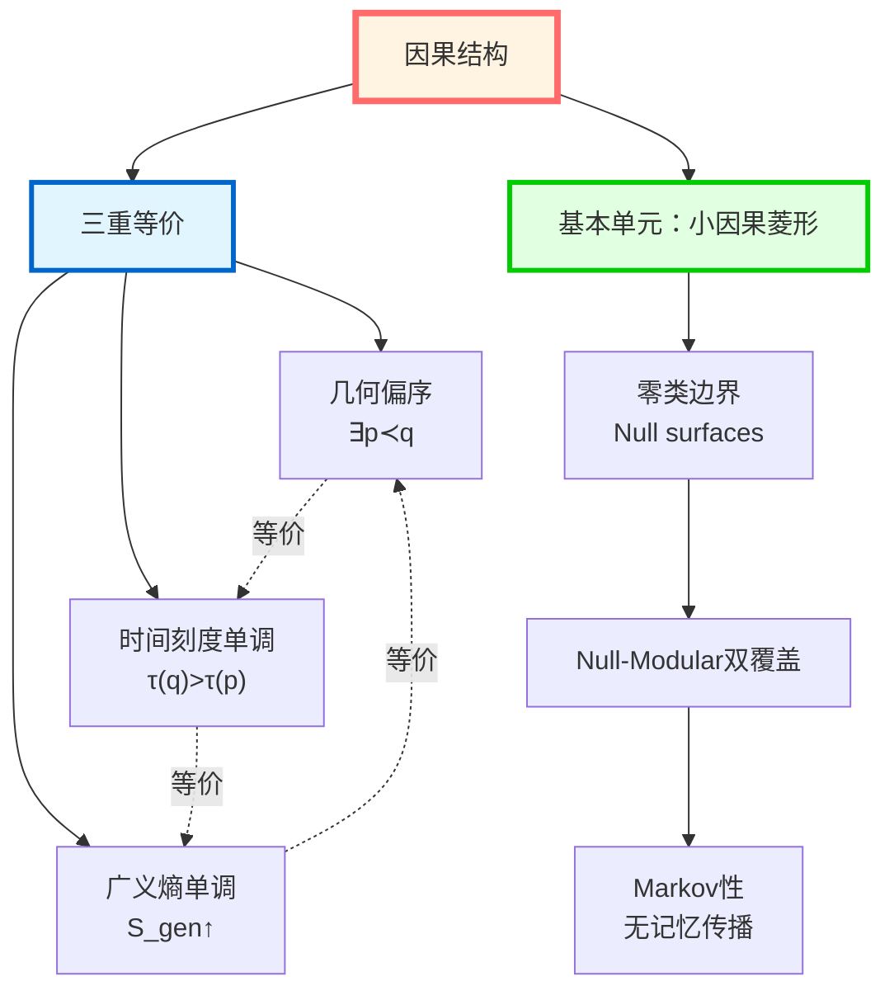
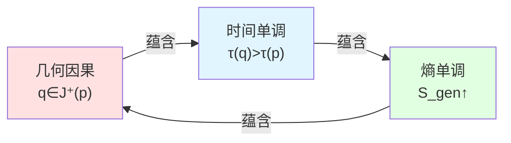
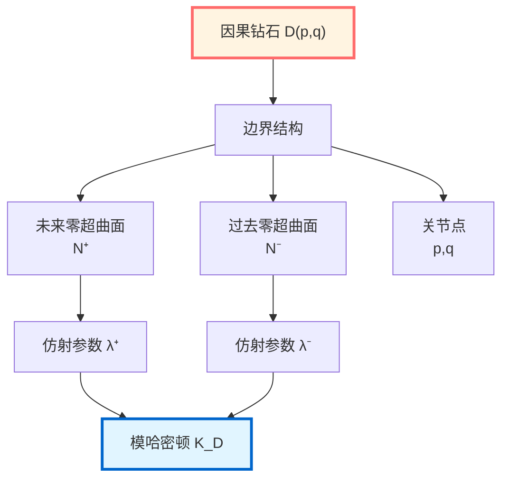
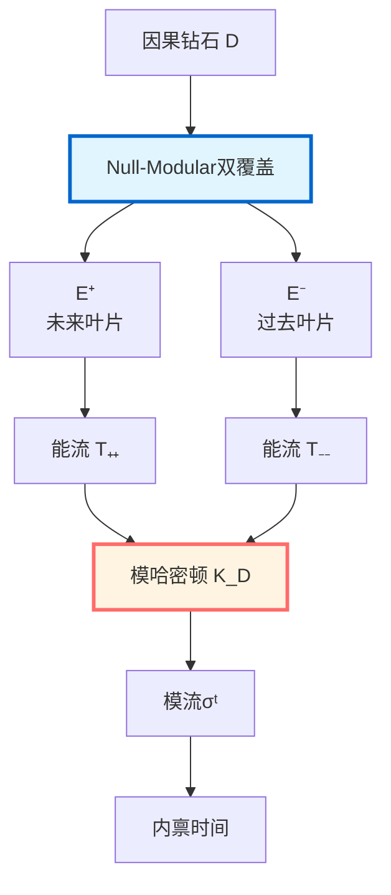
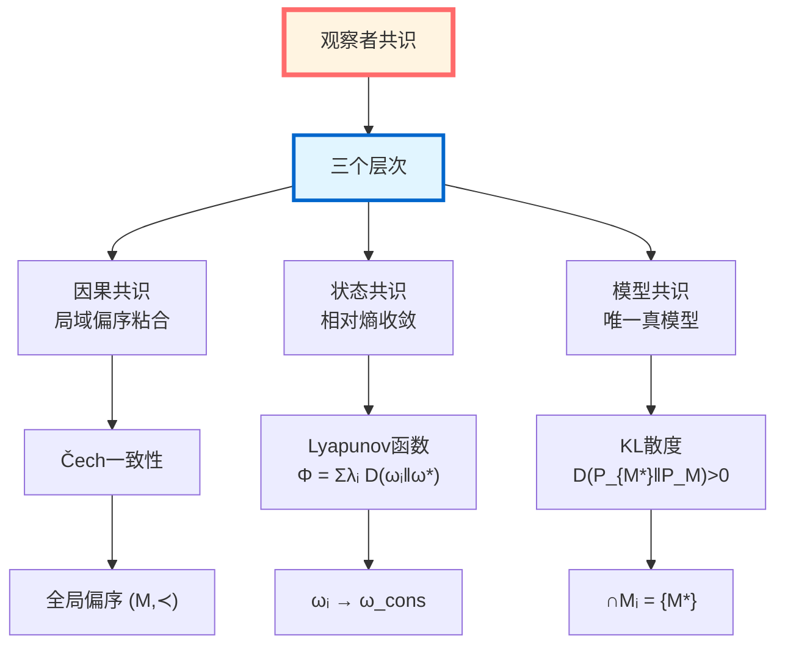
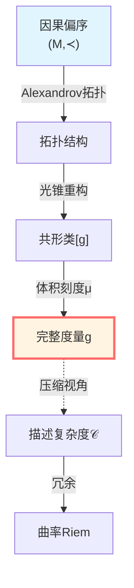
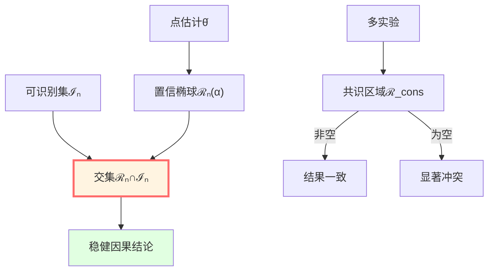
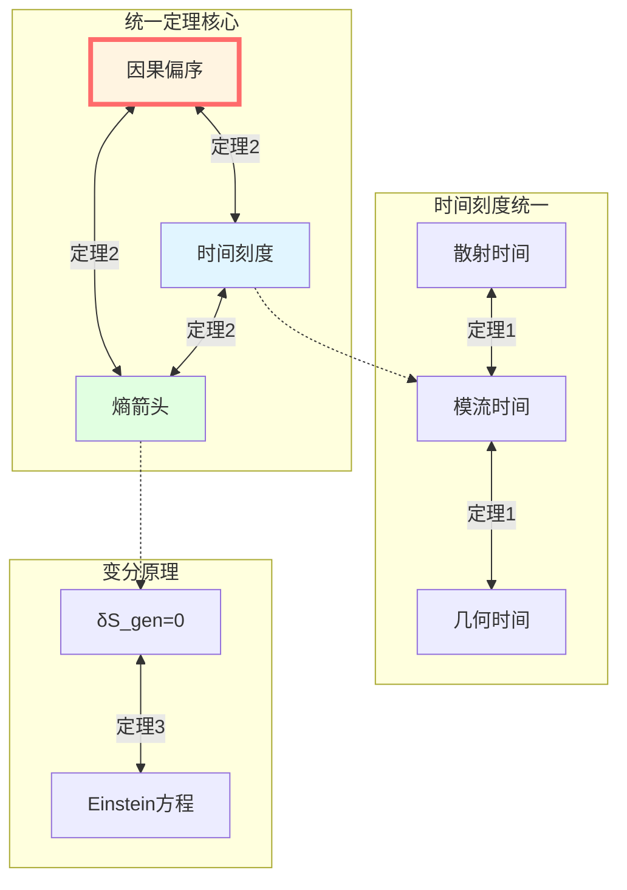
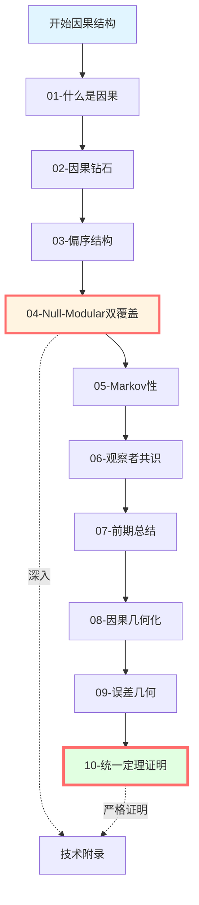

# 因果结构篇：总览

> *"因果不是关系，而是结构；不是附加的，而是本质的。"*

## 🎯 本篇核心思想

在GLS理论中，**因果**从不是一个简单的"原因→结果"关系，而是一个**三重统一的数学结构**：

**核心洞察**：

$$\boxed{\text{因果} = \text{偏序} = \text{时间} = \text{熵}}$$

这不是三个不同的东西，而是**同一结构的三个投影**！

## 📚 本篇内容地图

本篇共10篇文章，揭示因果结构的完整图景：

### 第1篇：什么是因果？

**核心问题**：因果到底是什么？

**三个等价定义**：

1. **几何定义**：$q \in J^+(p)$（光锥内）
2. **时间定义**：$\tau(q) > \tau(p)$（时间刻度递增）
3. **熵定义**：$S_{\mathrm{gen}}$ 沿路径单调不减

**惊人定理**：这三个定义**完全等价**！

### 第2篇：因果钻石的几何

**核心对象**：小因果菱形（causal diamond）

$$D(p,q) = J^+(p) \cap J^-(q)$$

**为什么重要**：
- 是**最小的因果完备区域**
- IGVP变分在这里定义
- 广义熵在这里极值
- Null-Modular双覆盖在这里展开

**结构**：

### 第3篇：偏序结构

**核心概念**：偏序 $(M, \prec)$

**三个性质**：
1. **反身性**：$p \preceq p$
2. **反对称性**：$p \preceq q$ 且 $q \preceq p$ ⇒ $p = q$
3. **传递性**：$p \preceq q$ 且 $q \preceq r$ ⇒ $p \preceq r$

**物理实现**：
- **相对论**：光锥结构 $J^+(p)$
- **量子场论**：算子对易性（微因果性）
- **因果集理论**：离散偏序集 $(C, \prec)$

**粘合问题**：多个观察者的局域偏序如何组合成全局偏序？

**Čech一致性条件**：

$$\boxed{\text{局域偏序在交叠区域必须一致}}$$

### 第4篇：Null-Modular双覆盖

**核心构造**：

对因果钻石 $D$，其零类边界分解为：

$$\widetilde{E}_D = E^+ \sqcup E^-$$

其中 $E^+$ 是未来叶片，$E^-$ 是过去叶片。

**模哈密顿量局域化**：

$$\boxed{K_D = 2\pi \sum_{\sigma = \pm} \int_{E^\sigma} g_\sigma(\lambda, x_\perp)\, T_{\sigma\sigma}(\lambda, x_\perp)\, \mathrm{d}\lambda\, \mathrm{d}^{d-2}x_\perp}$$

**深层含义**：
- 模流**完全在零类边界上**局域化
- 时间演化由**零边界能流**生成
- 体域动力学是**边界数据的投影**

### 第5篇：Markov性与信息传播

**核心定理**（Casini-Teste-Torroba）：

因果钻石链上的信息传播满足**Markov性**：

$$\boxed{I(A:C|B) = 0}$$

**物理含义**：
- 信息传播**无额外记忆**
- 中间状态$B$**完全屏蔽**$A$与$C$
- 因果链是**一阶Markov过程**

**容斥公式**：

$$K_{\cup_j D_j} = \sum_{k \geq 1} (-1)^{k-1} \sum_{j_1 < \cdots < j_k} K_{D_{j_1} \cap \cdots \cap D_{j_k}}$$

模哈密顿量满足完美的容斥结构！

### 第6篇：观察者共识几何

**核心问题**：多个观察者如何在同一宇宙因果网上达成共识？

**观察者形式化**：

$$O_i = (C_i, \prec_i, \Lambda_i, \mathcal{A}_i, \omega_i, \mathcal{M}_i, U_i, u_i, \{\mathcal{C}_{ij}\})$$

包含：几何域、偏序、分辨率、代数、状态、模型、更新、效用、通信。

**三种共识**：

**状态共识定理**：在通信图强连通、权重矩阵原始且存在共同不动点 $\omega_*$ 的条件下，

$$\lim_{t \to \infty} \omega_i^{(t)} = \omega_*, \quad \forall i$$

### 第7篇：因果结构前期总结

对前6篇内容进行第一次总结，建立因果-时间-熵-边界的初步联系。

### 第8篇：因果几何化——时空作为最小无损压缩

**核心思想**：时空几何 = 因果约束的最小无损压缩

**三步重构定理**：
1. **因果偏序 → 拓扑**：Alexandrov拓扑由因果结构唯一确定
2. **因果 + 时间定向 → 共形类**：光锥结构重构共形几何
3. **因果 + 体积刻度 → 完整度量**：$(M, g) \Longleftrightarrow (M, \prec, \mu)$

**描述复杂度-曲率泛函**：

$$\mathcal{F}[g] = \mathcal{C}(\text{Reach}(g)) + \lambda \int_M |\text{Riem}(g)|^2 \, \mathrm{dVol}_g$$

**曲率的因果诠释**：曲率 = 因果约束之间无法局域消除的相关性冗余密度

### 第9篇：误差几何与因果稳健性

**核心思想**：误差 = 几何边界，稳健性 = 几何不变性

**置信椭球（可信区域）**：

$$\mathcal{R}_n(\alpha) = \left\{ \theta : n(\theta - \hat{\theta}_n)^\top I(\hat{\theta}_n) (\theta - \hat{\theta}_n) \leq \chi^2_{d,1-\alpha} \right\}$$

**几何稳健判据**：因果结论应基于可信区域与可识别集的交集

$$\mathcal{C}_n(\alpha) := \{\psi(\theta) : \theta \in \mathcal{R}_n(\alpha) \cap \mathcal{I}_n\}$$

**多实验共识区域**：

$$\mathcal{R}_{\text{cons}} := \bigcap_{k=1}^K \mathcal{R}_k(\alpha_k)$$

### 第10篇：统一定理完整证明

**核心定理**：在半经典-全息窗口内，三者完全等价：

$$\boxed{
\begin{aligned}
&\text{几何因果: } q \in J^+(p) \\
&\text{时间单调: } \tau(q) > \tau(p) \\
&\text{熵箭头: } S_{\text{gen}}[\Sigma_q] \geq S_{\text{gen}}[\Sigma_p]
\end{aligned}
}$$

**统一时间刻度等价类**：

$$[\tau] = \{\tau_{\text{scatt}}, \tau_{\text{mod}}, \tau_{\text{geom}}\} / \sim$$

**IGVP与Einstein方程的等价性**：

$$\delta S_{\text{gen}} = 0 \Longleftrightarrow G_{\mu\nu} + \Lambda g_{\mu\nu} = 8\pi G T_{\mu\nu}$$

**Markov性质与包含-排斥公式**：

$$K_{\cup_j D_j} = \sum_{k \geq 1} (-1)^{k-1} \sum_{j_1 < \cdots < j_k} K_{D_{j_1} \cap \cdots \cap D_{j_k}}$$

**完整图景**：

回顾整个因果结构的统一图景：

$$\boxed{\text{偏序} \Longleftrightarrow \text{时间刻度} \Longleftrightarrow \text{广义熵} \Longleftrightarrow \text{Einstein方程}}$$

**最深刻的洞察**：

因果不是一个外加的结构，而是**时间、几何、熵三者统一的内在结构**，并通过严格的数学定理得到证明。

## 🔗 与其他篇的联系

### 回溯：边界理论篇（第6篇）

在边界理论中，我们看到：
- GHY边界项在零类边界上的形式
- Brown-York能量作为边界时间生成元
- 边界观察者的三位一体

**现在的深化**：
- 零类边界不是附加的，而是**因果钻石的本质组成**
- Null-Modular双覆盖给出**模流的几何实现**
- 观察者共识几何揭示**因果如何被多观察者重建**

### 回溯：统一时间篇（第5篇）

在统一时间篇中，我们证明了：

$$\kappa(\omega) = \frac{\varphi'(\omega)}{\pi} = \rho_{\mathrm{rel}}(\omega) = \frac{1}{2\pi}\operatorname{tr}Q(\omega)$$

**现在的深化**：
- 这个统一刻度**定义了因果偏序的方向**
- 时间刻度单调性**等价于**因果偏序
- 统一时间是**因果结构的坐标**

### 前瞻：拓扑约束篇（第8篇）

因果结构为拓扑约束奠基：

**因果拓扑**：由因果关系诱导的拓扑结构

**Alexandrov拓扑**：以因果钻石为开集基底的拓扑

**拓扑异常**：$\mathbb{Z}_2$ 扇区 $[K] \in H^2(Y, \partial Y; \mathbb{Z}_2)$

**不可判定性**：某些因果结构问题本质上不可判定

## 💡 学习路线图

### 推荐阅读顺序

**快速通道**（抓住核心）：
1. 01-什么是因果（三重等价）
2. 04-Null-Modular双覆盖（核心构造）
3. 08-因果几何化（压缩视角）
4. 10-统一定理证明（完整图景）

**深入学习**（完整理解）：
按顺序阅读01-10，配合源理论文档

**技术研究**（严格推导）：
重点阅读：
- 03-偏序结构的粘合定理
- 04-Null-Modular的局域化证明
- 08-描述复杂度-曲率泛函
- 09-Fisher信息几何
- 10-统一定理的完整证明（公理G/S/M/B/E/T）

## 🎓 核心结论预告

学完本篇后，你将理解：

### 1. 因果的三重等价定理

**定理**：以下三个命题等价：

1. **几何因果**：$q \in J^+(p)$
2. **时间单调**：存在 $\tau \in [\tau]$ 使 $\tau(q) > \tau(p)$
3. **熵单调**：沿路径 $S_{\mathrm{gen}}$ 单调不减

**证明思路**：
- $(1) \Rightarrow (2)$：时间函数存在性
- $(2) \Rightarrow (3)$：QNEC + 广义熵变分
- $(3) \Rightarrow (1)$：熵单调排除闭因果曲线

### 2. Null-Modular双覆盖定理

**定理**：因果钻石 $D$ 的模哈密顿量可以在零类边界上完全局域化：

$$K_D = 2\pi \sum_{\sigma = \pm} \int_{E^\sigma} g_\sigma(\lambda, x_\perp)\, T_{\sigma\sigma}(\lambda, x_\perp)\, \mathrm{d}\lambda\, \mathrm{d}^{d-2}x_\perp$$

其中 $E^\sigma$ 是因果钻石的两个零类边界叶片。

**物理意义**：
- 模流**不需要体域**，只需要边界
- 时间演化由**零边界能流**完全确定
- 全息原理的**信息论基础**

### 3. Markov性定理

**定理**（Casini-Teste-Torroba）：零平面上的因果钻石链满足：

1. **容斥公式**：

   $$K_{\cup_j D_j} = \sum_{k \geq 1} (-1)^{k-1} \sum_{j_1 < \cdots < j_k} K_{D_{j_1} \cap \cdots \cap D_{j_k}}$$

2. **Markov性**：对嵌套区域 $A \subset B \subset C$，

   $$I(A:C|B) = 0$$

**物理含义**：因果链上的信息传播是**无记忆的一阶Markov过程**。

### 4. 观察者共识定理

**定理**（因果共识）：局域偏序族 $\{(C_i, \prec_i)\}$ 可以粘合为全局偏序 $(M, \prec)$ 当且仅当满足：

1. **覆盖性**：$\bigcup_i C_i = M$
2. **有限交叠**：每个点只被有限多个$C_i$覆盖
3. **Čech一致性**：在所有交叠区域上局域偏序一致

**定理**（状态共识）：在通信图强连通、权重矩阵原始且存在共同不动点的条件下，状态迭代收敛到唯一共识：

$$\lim_{t \to \infty} \omega_i^{(t)} = \omega_*, \quad \forall i$$

**Lyapunov函数**：

$$\Phi^{(t)} = \sum_i \lambda_i D(\omega_i^{(t)} \| \omega_*)$$

严格单调递减！

## 🤔 思考题（章节预览）

### 问题1：为什么因果等价于时间？

**提示**：回忆稳定因果性与时间函数的关系。

**答案见**：01-什么是因果，03-偏序结构

### 问题2：为什么模哈密顿量可以完全在零边界上局域化？

**提示**：想想Bisognano-Wichmann定理与零生成元的关系。

**答案见**：04-Null-Modular双覆盖

### 问题3：为什么信息传播满足Markov性？

**提示**：强次可加性饱和意味着什么？

**答案见**：05-Markov性

### 问题4：如果局域偏序不一致会怎样？

**提示**：想象三个观察者形成因果环。

**答案见**：06-观察者共识（附录中的三节点环例子）

## 📖 符号约定

本篇使用以下核心符号：

### 几何符号
- $(M, g)$：时空流形与度规
- $J^+(p)$：点$p$的未来光锥
- $J^-(q)$：点$q$的过去光锥
- $D(p,q) = J^+(p) \cap J^-(q)$：因果钻石

### 偏序符号
- $(M, \prec)$：偏序集
- $p \prec q$：$p$在$q$的因果过去
- $p \preceq q$：$p \prec q$ 或 $p = q$

### 因果钻石边界
- $\mathcal{N}^+$：未来零超曲面
- $\mathcal{N}^-$：过去零超曲面
- $E^+, E^-$：Null-Modular双覆盖的两个叶片
- $\lambda$：零测地线的仿射参数

### 模流与代数
- $\mathcal{A}(D)$：因果钻石$D$的局域代数
- $\omega$：状态
- $K_\omega$：模哈密顿量
- $\sigma_t^\omega$：模流
- $T_{\sigma\sigma}$：零方向应力-能量分量

### 观察者符号
- $O_i$：第$i$个观察者
- $C_i$：观察者$i$的因果域
- $\prec_i$：局域偏序
- $\mathcal{A}_i$：可观测代数
- $\omega_i$：局域状态

### 共识符号
- $\mathcal{A}_{\mathrm{com}} = \bigcap_i \mathcal{A}_i$：公共代数
- $\omega_*$：共识状态
- $D(\omega_i \| \omega_*)$：相对熵（Umegaki）
- $W = (w_{ij})$：通信权重矩阵

## 🔍 本篇的独特贡献

与传统因果理论相比，本篇：

### 1. 统一三个视角

**传统**：
- 几何：光锥与偏序
- 代数：微因果性与对易
- 信息：熵与时间箭头

分别讨论，互不关联。

**本篇**：
将三者统一为**因果的三重等价**，揭示它们是同一结构的不同投影。

### 2. 强调Null-Modular双覆盖

**传统**：零类边界是技术性边界条件。

**本篇**：Null-Modular双覆盖是**因果钻石的本质结构**，模流在此完全局域化。

### 3. 引入观察者共识几何

**传统**：因果结构是客观给定的。

**本篇**：多观察者如何从局域偏序**重建全局因果网**？Čech一致性、状态共识、模型共识。

### 4. 连接Markov性与因果

**传统**：Markov性是概率论概念。

**本篇**：Markov性是**因果链的本质属性**，由容斥公式严格刻画。

## 🌟 为什么这一篇重要？

因果结构篇是GLS理论的**中枢**，因为：

### 理论层面
- 揭示因果、时间、几何、熵的**四位一体**
- 提供从局域到全局的**粘合框架**
- 给出信息传播的**Markov结构**

### 应用层面
- 量子引力：因果集理论的基础
- 全息原理：边界如何编码体域因果
- 量子计算：因果网络与信息处理

### 哲学层面
- **因果的本质是什么？**
- **多个观察者如何共享同一因果世界？**
- **信息如何在因果网上传播？**

---

**准备好了吗？**

让我们开始这场从偏序到Markov、从局域到全局、从观察者到共识的因果之旅！

**下一篇**：[01-什么是因果](01-what-is-causality.md) - 因果的三重等价定义

**返回**：[GLS理论完整教程](../index.md)
