# Causal Structure Chapter: Overview

> *"Causality is not a relation, but a structure; not additional, but essential."*

## 🎯 Core Ideas of This Chapter

In GLS theory, **causality** is never a simple "cause→effect" relation, but a **triply unified mathematical structure**:

```mermaid
graph TB
    CAUSALITY["Causal Structure"] --> THREE["Triple Equivalence"]

    THREE --> ORDER["Geometric Partial Order<br/>∃p≺q"]
    THREE --> TIME["Time Scale Monotonicity<br/>τ(q)>τ(p)"]
    THREE --> ENTROPY["Generalized Entropy Monotonicity<br/>S_gen↑"]

    ORDER -.->|"Equivalent"| TIME
    TIME -.->|"Equivalent"| ENTROPY
    ENTROPY -.->|"Equivalent"| ORDER

    CAUSALITY --> DIAMOND["Basic Unit: Small Causal Lozenge"]
    DIAMOND --> NULL["Null Boundaries<br/>Null surfaces"]
    NULL --> MODULAR["Null-Modular Double Cover"]

    MODULAR --> MARKOV["Markov Property<br/>Memoryless Propagation"]

    style CAUSALITY fill:#fff4e1,stroke:#ff6b6b,stroke-width:4px
    style THREE fill:#e1f5ff,stroke:#0066cc,stroke-width:3px
    style DIAMOND fill:#e1ffe1,stroke:#00cc00,stroke-width:3px
```

**Core Insight**:

$$\boxed{\text{Causality} = \text{Partial Order} = \text{Time} = \text{Entropy}}$$

These are not three different things, but **three projections of the same structure**!

## 📚 Chapter Content Map

This chapter consists of 7 articles, revealing complete picture of causal structure:

### Article 1: What is Causality?

**Core Question**: What exactly is causality?

**Three Equivalent Definitions**:

1. **Geometric Definition**: $q \in J^+(p)$ (inside light cone)
2. **Time Definition**: $\tau(q) > \tau(p)$ (time scale increasing)
3. **Entropy Definition**: $S_{\mathrm{gen}}$ monotonically non-decreasing along path

**Amazing Theorem**: These three definitions are **completely equivalent**!

```mermaid
graph LR
    GEO["Geometric Causality<br/>q∈J⁺(p)"] -->|"Implies"| TIME["Time Monotonicity<br/>τ(q)>τ(p)"]
    TIME -->|"Implies"| ENT["Entropy Monotonicity<br/>S_gen↑"]
    ENT -->|"Implies"| GEO

    style GEO fill:#ffe1e1
    style TIME fill:#e1f5ff
    style ENT fill:#e1ffe1
```

### Article 2: Geometry of Causal Diamonds

**Core Object**: Small causal lozenge (causal diamond)

$$D(p,q) = J^+(p) \cap J^-(q)$$

**Why Important**:
- Is **smallest causally complete region**
- IGVP variation defined here
- Generalized entropy extremized here
- Null-Modular double cover unfolds here

**Structure**:

```mermaid
graph TB
    DIAMOND["Causal Diamond D(p,q)"] --> BOUNDARY["Boundary Structure"]

    BOUNDARY --> FUTURE["Future Null Hypersurface<br/>N⁺"]
    BOUNDARY --> PAST["Past Null Hypersurface<br/>N⁻"]
    BOUNDARY --> CORNER["Corner Points<br/>p,q"]

    FUTURE --> AFFINE1["Affine Parameter λ⁺"]
    PAST --> AFFINE2["Affine Parameter λ⁻"]

    AFFINE1 --> MODULAR["Modular Hamiltonian K_D"]
    AFFINE2 --> MODULAR

    style DIAMOND fill:#fff4e1,stroke:#ff6b6b,stroke-width:3px
    style MODULAR fill:#e1f5ff,stroke:#0066cc,stroke-width:3px
```

### Article 3: Partial Order Structure

**Core Concept**: Partial order $(M, \prec)$

**Three Properties**:
1. **Reflexivity**: $p \preceq p$
2. **Antisymmetry**: $p \preceq q$ and $q \preceq p$ ⇒ $p = q$
3. **Transitivity**: $p \preceq q$ and $q \preceq r$ ⇒ $p \preceq r$

**Physical Realizations**:
- **Relativity**: Light cone structure $J^+(p)$
- **Quantum Field Theory**: Operator commutativity (microcausality)
- **Causal Set Theory**: Discrete partial order set $(C, \prec)$

**Gluing Problem**: How do local partial orders of multiple observers combine into global partial order?

**Čech Consistency Condition**:

$$\boxed{\text{Local partial orders must agree on overlapping regions}}$$

### Article 4: Null-Modular Double Cover

**Core Construction**:

For causal diamond $D$, its null boundary decomposes as:

$$\widetilde{E}_D = E^+ \sqcup E^-$$

where $E^+$ is future leaf, $E^-$ is past leaf.

**Modular Hamiltonian Localization**:

$$\boxed{K_D = 2\pi \sum_{\sigma = \pm} \int_{E^\sigma} g_\sigma(\lambda, x_\perp)\, T_{\sigma\sigma}(\lambda, x_\perp)\, \mathrm{d}\lambda\, \mathrm{d}^{d-2}x_\perp}$$

**Deep Meaning**:
- Modular flow **completely localized on null boundaries**
- Time evolution generated by **null boundary energy flux**
- Bulk dynamics is **projection of boundary data**

```mermaid
graph TB
    DIAMOND["Causal Diamond D"] --> COVER["Null-Modular Double Cover"]

    COVER --> FUT["E⁺<br/>Future Leaf"]
    COVER --> PAST["E⁻<br/>Past Leaf"]

    FUT --> FLUX1["Energy Flux T₊₊"]
    PAST --> FLUX2["Energy Flux T₋₋"]

    FLUX1 --> KD["Modular Hamiltonian K_D"]
    FLUX2 --> KD

    KD --> MODULAR["Modular Flow σᵗ"]
    MODULAR --> TIME["Intrinsic Time"]

    style COVER fill:#e1f5ff,stroke:#0066cc,stroke-width:3px
    style KD fill:#fff4e1,stroke:#ff6b6b,stroke-width:3px
```

### Article 5: Markov Property and Information Propagation

**Core Theorem** (Casini-Teste-Torroba):

Information propagation on causal diamond chains satisfies **Markov property**:

$$\boxed{I(A:C|B) = 0}$$

**Physical Meaning**:
- Information propagation **memoryless**
- Intermediate state $B$ **completely screens** $A$ from $C$
- Causal chain is **first-order Markov process**

**Inclusion-Exclusion Formula**:

$$K_{\cup_j D_j} = \sum_{k \geq 1} (-1)^{k-1} \sum_{j_1 < \cdots < j_k} K_{D_{j_1} \cap \cdots \cap D_{j_k}}$$

Modular Hamiltonian satisfies perfect inclusion-exclusion structure!

### Article 6: Observer Consensus Geometry

**Core Question**: How do multiple observers reach consensus on same cosmic causal network?

**Observer Formalization**:

$$O_i = (C_i, \prec_i, \Lambda_i, \mathcal{A}_i, \omega_i, \mathcal{M}_i, U_i, u_i, \{\mathcal{C}_{ij}\})$$

Contains: geometric domain, partial order, resolution, algebra, state, model, update, utility, communication.

**Three Types of Consensus**:

```mermaid
graph TB
    CONSENSUS["Observer Consensus"] --> THREE["Three Levels"]

    THREE --> CAUSAL["Causal Consensus<br/>Local Partial Order Gluing"]
    THREE --> STATE["State Consensus<br/>Relative Entropy Convergence"]
    THREE --> MODEL["Model Consensus<br/>Unique True Model"]

    CAUSAL --> CECH["Čech Consistency"]
    CECH --> GLOBAL["Global Partial Order (M,≺)"]

    STATE --> LYAP["Lyapunov Function<br/>Φ = Σλᵢ D(ωᵢ‖ω*)"]
    LYAP --> CONVERGE["ωᵢ → ω_cons"]

    MODEL --> KL["KL Divergence<br/>D(P_{M*}‖P_M)>0"]
    KL --> UNIQUE["∩Mᵢ = {M*}"]

    style CONSENSUS fill:#fff4e1,stroke:#ff6b6b,stroke-width:4px
    style THREE fill:#e1f5ff,stroke:#0066cc,stroke-width:3px
```

**State Consensus Theorem**: Under conditions of strongly connected communication graph, primitive weight matrix and existence of common fixed point $\omega_*$,

$$\lim_{t \to \infty} \omega_i^{(t)} = \omega_*, \quad \forall i$$

### Article 7: Causal Structure Summary

Review complete unified picture of causal structure:

$$\boxed{\text{Partial Order} \Longleftrightarrow \text{Time Scale} \Longleftrightarrow \text{Generalized Entropy} \Longleftrightarrow \text{Einstein Equations}}$$

**Deepest Insight**:

Causality is not an additional structure, but **intrinsic structure unifying time, geometry, and entropy**.

## 🔗 Connections to Other Chapters

### Looking Back: Boundary Theory Chapter (Chapter 6)

In boundary theory, we saw:
- Form of GHY boundary term on null boundaries
- Brown-York energy as boundary time generator
- Trinity of boundary observers

**Now Deepened**:
- Null boundaries not additional, but **essential components of causal diamonds**
- Null-Modular double cover gives **geometric realization of modular flow**
- Observer consensus geometry reveals **how causality is reconstructed by multiple observers**

### Looking Back: Unified Time Chapter (Chapter 5)

In Unified Time chapter, we proved:

$$\kappa(\omega) = \frac{\varphi'(\omega)}{\pi} = \rho_{\mathrm{rel}}(\omega) = \frac{1}{2\pi}\operatorname{tr}Q(\omega)$$

**Now Deepened**:
- This unified scale **defines direction of causal partial order**
- Time scale monotonicity **equivalent to** causal partial order
- Unified time is **coordinate of causal structure**

### Looking Forward: Topological Constraints Chapter (Chapter 8)

Causal structure provides foundation for topological constraints:

**Causal Topology**: Topological structure induced by causal relations

**Alexandrov Topology**: Topology with causal diamonds as open set basis

**Topological Anomaly**: $\mathbb{Z}_2$ sector $[K] \in H^2(Y, \partial Y; \mathbb{Z}_2)$

**Undecidability**: Some causal structure problems essentially undecidable

## 💡 Learning Roadmap

### Recommended Reading Order

**Fast Track** (grasp core):
1. 01-What is Causality (triple equivalence)
2. 04-Null-Modular Double Cover (core construction)
3. 05-Markov Property (information propagation)
4. 07-Summary (complete picture)

**Deep Learning** (complete understanding):
Read 01-07 in order, with source theory documents

**Technical Research** (rigorous derivation):
Focus on gluing theorem in 03-Partial Order Structure, localization proof in 04-Null-Modular

## 🎓 Core Conclusions Preview

After completing this chapter, you will understand:

### 1. Triple Equivalence Theorem of Causality

**Theorem**: The following three propositions are equivalent:

1. **Geometric Causality**: $q \in J^+(p)$
2. **Time Monotonicity**: Exists $\tau \in [\tau]$ such that $\tau(q) > \tau(p)$
3. **Entropy Monotonicity**: $S_{\mathrm{gen}}$ monotonically non-decreasing along path

**Proof Outline**:
- $(1) \Rightarrow (2)$: Existence of time function
- $(2) \Rightarrow (3)$: QNEC + generalized entropy variation
- $(3) \Rightarrow (1)$: Entropy monotonicity excludes closed causal curves

### 2. Null-Modular Double Cover Theorem

**Theorem**: Modular Hamiltonian of causal diamond $D$ can be completely localized on null boundaries:

$$K_D = 2\pi \sum_{\sigma = \pm} \int_{E^\sigma} g_\sigma(\lambda, x_\perp)\, T_{\sigma\sigma}(\lambda, x_\perp)\, \mathrm{d}\lambda\, \mathrm{d}^{d-2}x_\perp$$

where $E^\sigma$ are two null boundary leaves of causal diamond.

**Physical Meaning**:
- Modular flow **doesn't need bulk**, only boundary
- Time evolution completely determined by **null boundary energy flux**
- **Information-theoretic foundation** of holographic principle

### 3. Markov Property Theorem

**Theorem** (Casini-Teste-Torroba): Causal diamond chains on null planes satisfy:

1. **Inclusion-Exclusion Formula**:

   $$K_{\cup_j D_j} = \sum_{k \geq 1} (-1)^{k-1} \sum_{j_1 < \cdots < j_k} K_{D_{j_1} \cap \cdots \cap D_{j_k}}$$

2. **Markov Property**: For nested regions $A \subset B \subset C$,

   $$I(A:C|B) = 0$$

**Physical Meaning**: Information propagation on causal chains is **memoryless first-order Markov process**.

### 4. Observer Consensus Theorem

**Theorem** (Causal Consensus): Local partial order family $\{(C_i, \prec_i)\}$ can be glued into global partial order $(M, \prec)$ if and only if:

1. **Covering**: $\bigcup_i C_i = M$
2. **Finite Overlap**: Each point covered by finitely many $C_i$
3. **Čech Consistency**: Local partial orders agree on all overlapping regions

**Theorem** (State Consensus): Under conditions of strongly connected communication graph, primitive weight matrix and existence of common fixed point, state iteration converges to unique consensus:

$$\lim_{t \to \infty} \omega_i^{(t)} = \omega_*, \quad \forall i$$

**Lyapunov Function**:

$$\Phi^{(t)} = \sum_i \lambda_i D(\omega_i^{(t)} \| \omega_*)$$

Strictly monotonically decreasing!

## 🤔 Thought Questions (Chapter Preview)

### Question 1: Why is Causality Equivalent to Time?

**Hint**: Recall relationship between stable causality and time function.

**Answer in**: 01-What is Causality, 03-Partial Order Structure

### Question 2: Why Can Modular Hamiltonian Be Completely Localized on Null Boundaries?

**Hint**: Think about relationship between Bisognano-Wichmann theorem and null generators.

**Answer in**: 04-Null-Modular Double Cover

### Question 3: Why Does Information Propagation Satisfy Markov Property?

**Hint**: What does strong subadditivity saturation mean?

**Answer in**: 05-Markov Property

### Question 4: What Happens if Local Partial Orders Are Inconsistent?

**Hint**: Imagine three observers forming causal loop.

**Answer in**: 06-Observer Consensus (three-node loop example in appendix)

## 📖 Notation Conventions

This chapter uses following core symbols:

### Geometric Symbols
- $(M, g)$: Spacetime manifold and metric
- $J^+(p)$: Future light cone of point $p$
- $J^-(q)$: Past light cone of point $q$
- $D(p,q) = J^+(p) \cap J^-(q)$: Causal diamond

### Partial Order Symbols
- $(M, \prec)$: Partially ordered set
- $p \prec q$: $p$ in causal past of $q$
- $p \preceq q$: $p \prec q$ or $p = q$

### Causal Diamond Boundaries
- $\mathcal{N}^+$: Future null hypersurface
- $\mathcal{N}^-$: Past null hypersurface
- $E^+, E^-$: Two leaves of Null-Modular double cover
- $\lambda$: Affine parameter along null geodesic

### Modular Flow and Algebra
- $\mathcal{A}(D)$: Local algebra of causal diamond $D$
- $\omega$: State
- $K_\omega$: Modular Hamiltonian
- $\sigma_t^\omega$: Modular flow
- $T_{\sigma\sigma}$: Null-direction stress-energy component

### Observer Symbols
- $O_i$: $i$-th observer
- $C_i$: Causal domain of observer $i$
- $\prec_i$: Local partial order
- $\mathcal{A}_i$: Observable algebra
- $\omega_i$: Local state

### Consensus Symbols
- $\mathcal{A}_{\mathrm{com}} = \bigcap_i \mathcal{A}_i$: Common algebra
- $\omega_*$: Consensus state
- $D(\omega_i \| \omega_*)$: Relative entropy (Umegaki)
- $W = (w_{ij})$: Communication weight matrix

## 🔍 Unique Contributions of This Chapter

Compared to traditional causal theory, this chapter:

### 1. Unifies Three Perspectives

**Traditional**:
- Geometry: Light cones and partial orders
- Algebra: Microcausality and commutativity
- Information: Entropy and time arrow

Discussed separately, unrelated.

**This Chapter**:
Unifies three as **triple equivalence of causality**, reveals they are different projections of same structure.

### 2. Emphasizes Null-Modular Double Cover

**Traditional**: Null boundaries are technical boundary conditions.

**This Chapter**: Null-Modular double cover is **essential structure of causal diamonds**, modular flow completely localized here.

### 3. Introduces Observer Consensus Geometry

**Traditional**: Causal structure is objectively given.

**This Chapter**: How do multiple observers **reconstruct global causal network** from local partial orders? Čech consistency, state consensus, model consensus.

### 4. Connects Markov Property and Causality

**Traditional**: Markov property is probabilistic concept.

**This Chapter**: Markov property is **essential attribute of causal chains**, strictly characterized by inclusion-exclusion formula.

## 🌟 Why This Chapter Matters

Causal Structure chapter is **hub** of GLS theory, because:

### Theoretical Level
- Reveals **four-in-one** of causality, time, geometry, entropy
- Provides **gluing framework** from local to global
- Gives **Markov structure** of information propagation

### Application Level
- Quantum Gravity: Foundation of causal set theory
- Holographic Principle: How boundaries encode bulk causality
- Quantum Computing: Causal networks and information processing

### Philosophical Level
- **What is essence of causality?**
- **How do multiple observers share same causal world?**
- **How does information propagate on causal network?**

---

**Ready?**

Let's begin this causal journey from partial orders to Markov, from local to global, from observers to consensus!

**Next Article**: [01-what-is-causality_en.md](01-what-is-causality_en.md) - Triple Equivalent Definitions of Causality

**Back**: [Complete GLS Theory Tutorial](../index_en.md)

