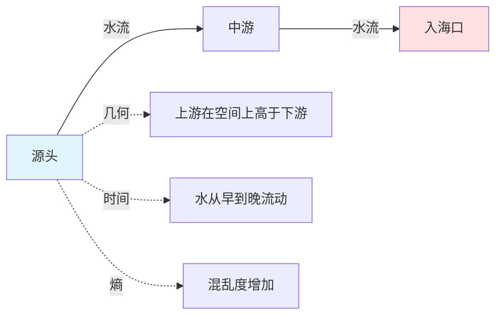
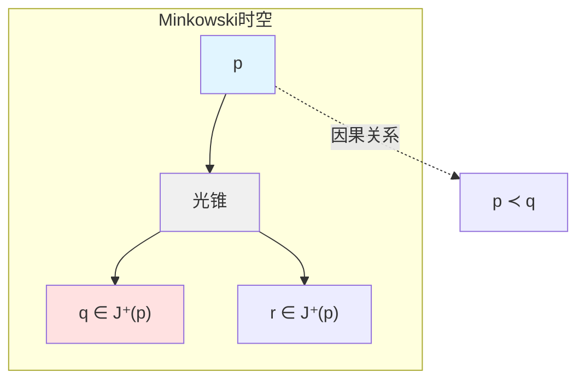
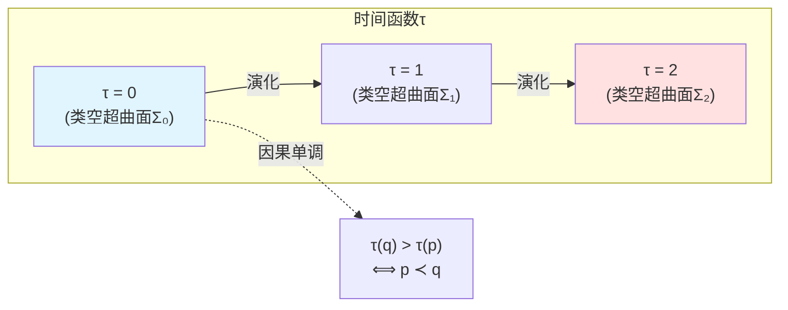
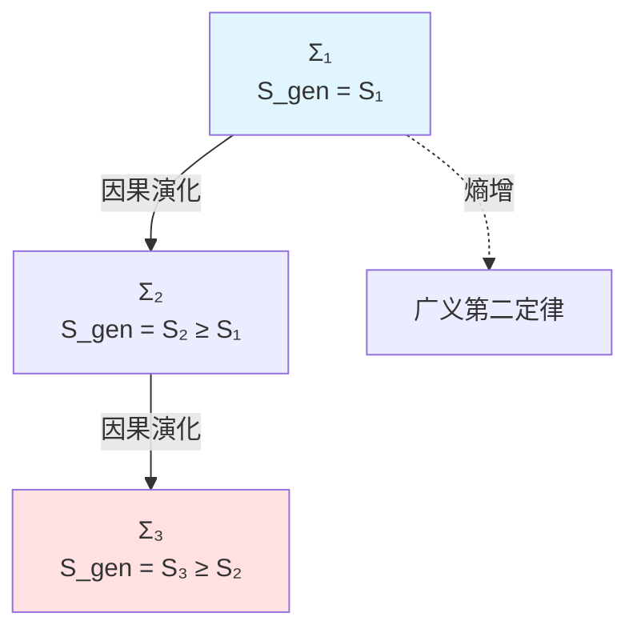
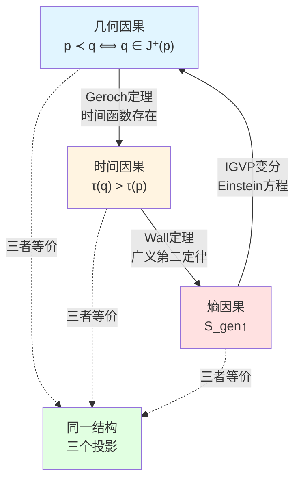
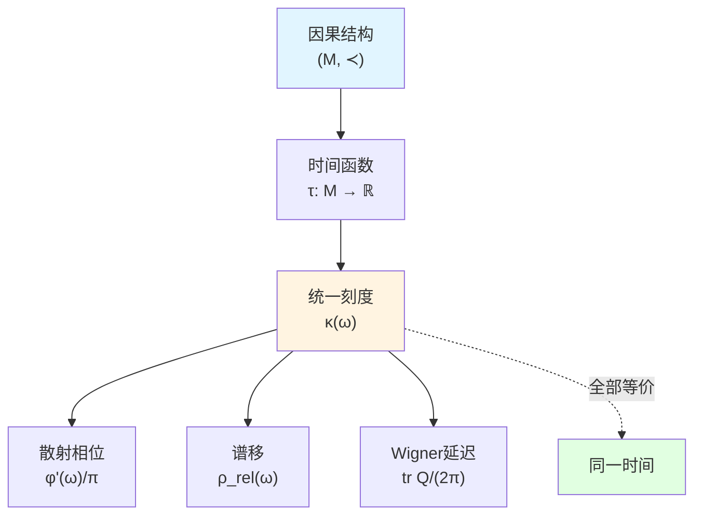
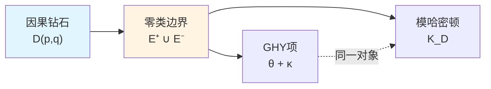

# 什么是因果？

> *"因果不是关系，而是结构。"*

## 🎯 本文核心

在GLS理论中，**因果**不再是简单的"原因导致结果"这种朴素概念，而是一个**三位一体的数学结构**：

$$
\boxed{\text{因果结构} = \text{几何偏序} = \text{时间单调} = \text{熵增}}
$$

这三个看似不同的概念，实际上是**同一个对象在不同视角下的投影**！

本文将揭示这个深刻的等价性。

## 🌊 比喻：河流中的因果

想象一条河流：

在这个比喻中：
- **几何因果**：上游在下游的"过去光锥"中（重力势能高）
- **时间因果**：时间沿河流单调增加
- **熵因果**：水流过程中熵不断增加（从规整到混沌）

**关键洞察**：这三个描述是**等价的**！你可以用任何一个来定义"因果"，其他两个自动成立。

## 📐 定义一：几何因果（偏序结构）

### 经典定义

在时空 $(M, g_{\mu\nu})$ 中，因果关系被定义为一个**偏序** $\prec$：

$$
p \prec q \quad \Longleftrightarrow \quad q \in J^+(p)
$$

其中：
- $J^+(p)$：点 $p$ 的**因果未来**（causal future）
- $J^-(q)$：点 $q$ 的**因果过去**（causal past）

### 偏序公理

因果偏序 $\prec$ 必须满足：

1. **自反性**（Reflexivity）：$p \prec p$
   - 物理意义：任何事件都在自己的因果锥中

2. **传递性**（Transitivity）：$p \prec q \land q \prec r \Rightarrow p \prec r$
   - 物理意义：因果链可以传递

3. **反对称性**（Antisymmetry）：$p \prec q \land q \prec p \Rightarrow p = q$
   - 物理意义：无因果闭环（除非同一事件）

### 光锥结构

几何因果由光锥结构完全确定：

$$
J^+(p) = \{q \in M \mid \exists \gamma: p \to q, \dot{\gamma}^\mu \dot{\gamma}_\mu \leq 0\}
$$

其中 $\gamma$ 是**非类空曲线**（null or timelike curve）。

**直观理解**：
- 光锥内：可以通过"信号"（光速或亚光速）传递信息
- 光锥外：因果不可达，无法传递信息

## ⏰ 定义二：时间因果（时间单调性）

### 时间函数

如果存在一个**时间函数** $\tau: M \to \mathbb{R}$，使得：

$$
p \prec q \quad \Longleftrightarrow \quad \tau(q) > \tau(p)
$$

则称时空具有**时间取向**（time orientation）。

### 时间刻度与因果

回忆统一时间篇（第5篇）的核心结果：

$$
\kappa(\omega) = \frac{\varphi'(\omega)}{\pi} = \rho_{\mathrm{rel}}(\omega) = \frac{1}{2\pi}\operatorname{tr}Q(\omega)
$$

这个**统一时间刻度** $\kappa(\omega)$ 完全由因果结构确定！

**关键定理**（时间函数存在）：

对于**全局双曲时空**（globally hyperbolic spacetime），存在一个光滑时间函数 $\tau$，使得每个等时超曲面 $\{\tau = t\}$ 都是**Cauchy超曲面**。

**物理含义**：
- Cauchy超曲面：时空的"完整时间切片"
- 时间函数存在 $\Longleftrightarrow$ 时空具有良定的因果结构

### 固有时与时间因果

对于**类时曲线** $\gamma$，固有时 $\tau_{\mathrm{proper}}$ 沿曲线单调增加：

$$
\tau_{\mathrm{proper}}[\gamma] = \int_\gamma \sqrt{-g_{\mu\nu}\dot{x}^\mu \dot{x}^\nu}\, \mathrm{d}\lambda
$$

这给出另一种时间因果定义：

$$
p \prec q \quad \Longleftrightarrow \quad \exists \gamma: p \to q, \quad \tau_{\mathrm{proper}}[\gamma] > 0
$$

## 📈 定义三：熵因果（广义熵单调性）

### 广义熵

在GLS理论中，**广义熵**定义为：

$$
S_{\mathrm{gen}}[\Sigma] = \frac{A(\partial\Sigma)}{4G} + S_{\mathrm{matter}}[\Sigma]
$$

其中：
- $A(\partial\Sigma)$：边界面积
- $S_{\mathrm{matter}}$：物质熵

### 熵因果原理

**核心思想**：熵沿因果方向单调增加。

如果 $\Sigma_1 \prec \Sigma_2$（即 $\Sigma_2$ 在 $\Sigma_1$ 的因果未来），则：

$$
S_{\mathrm{gen}}[\Sigma_2] \geq S_{\mathrm{gen}}[\Sigma_1]
$$

### QNEC与熵因果

**量子零能条件**（Quantum Null Energy Condition, QNEC）提供了熵因果的微分形式：

$$
\langle T_{kk} \rangle \geq \frac{\hbar}{2\pi A'} S''
$$

其中：
- $T_{kk}$：应力张量在零方向的分量
- $A'$：面积的一阶导数
- $S''$：von Neumann熵的二阶导数

**物理意义**：
- QNEC将几何（$A'$）、物质（$T_{kk}$）、熵（$S''$）统一起来
- 熵的凸性 $\Longrightarrow$ 能量条件 $\Longrightarrow$ 因果结构的稳定性

## 🔄 三位一体：等价性证明

现在我们证明三个定义的等价性。

### 第一步：几何 $\Rightarrow$ 时间

**定理**（Geroch 1970）：对于全局双曲时空 $(M, g_{\mu\nu})$，存在光滑时间函数 $\tau: M \to \mathbb{R}$，使得：

$$
p \prec q \quad \Longleftrightarrow \quad \tau(q) > \tau(p)
$$

**证明思路**：
1. 选择任意Cauchy超曲面 $\Sigma_0$
2. 定义 $\tau(p)$ 为从 $\Sigma_0$ 到 $p$ 的固有时
3. 由全局双曲性，这个函数良定且单调

### 第二步：时间 $\Rightarrow$ 熵

**定理**（广义第二定律）：如果 $\tau(q) > \tau(p)$，则：

$$
S_{\mathrm{gen}}[\Sigma_q] \geq S_{\mathrm{gen}}[\Sigma_p]
$$

其中 $\Sigma_p$、$\Sigma_q$ 是等时超曲面 $\{\tau = \mathrm{const}\}$。

**证明依据**：
- 量子聚焦定理（Quantum Focusing Theorem）
- Wall的广义第二定律证明（2011）
- QNEC作为微分形式

### 第三步：熵 $\Rightarrow$ 几何

**定理**（逆向蕴含）：如果对所有Cauchy超曲面 $\Sigma_1 \prec \Sigma_2$ 都有 $S_{\mathrm{gen}}[\Sigma_2] \geq S_{\mathrm{gen}}[\Sigma_1]$，则时空的因果结构由Einstein方程确定：

$$
G_{\mu\nu} = 8\pi G\, T_{\mu\nu}
$$

**证明思路**（来自IGVP框架）：
1. 广义熵的极值变分：$\delta S_{\mathrm{gen}} = 0$
2. 导出Einstein方程作为一阶条件
3. QNEC/QFC作为二阶条件，保证因果结构稳定

**完整循环**：

$$
\text{几何偏序} \xrightarrow[\text{Geroch}]{\text{时间函数}} \text{时间单调} \xrightarrow[\text{Wall}]{\text{广义第二定律}} \text{熵增} \xrightarrow[\text{IGVP}]{\text{变分原理}} \text{Einstein方程}
$$

## 🌍 物理实例

### 实例1：Minkowski时空

**几何因果**：
$$
p \prec q \quad \Longleftrightarrow \quad (t_q - t_p)^2 \geq (\mathbf{x}_q - \mathbf{x}_p)^2
$$

**时间因果**：
$$
\tau(p) = t_p \quad (\text{惯性观察者的固有时})
$$

**熵因果**：
$$
S_{\mathrm{gen}}[\Sigma_t] = S_{\mathrm{matter}}[\Sigma_t] \quad (\text{无引力熵})
$$

三者完美一致！

### 实例2：Schwarzschild黑洞

**几何因果**：
- 视界 $r = 2M$ 是**零类超曲面**（null hypersurface）
- 内部：所有类时曲线终结于奇点 $r = 0$

**时间因果**：
- Kruskal时间 $T$ 单调增加穿越视界
- Schwarzschild时间 $t$ 在视界处发散（坐标奇异）

**熵因果**：
- Bekenstein-Hawking熵：$S_{\mathrm{BH}} = \frac{A}{4G} = 4\pi M^2$
- 视界面积定理（Hawking 1971）：$\delta A \geq 0$

### 实例3：宇宙学（FLRW度规）

**几何因果**：
- 粒子视界（particle horizon）：$d_{\mathrm{hor}} = a(t)\int_0^t \frac{\mathrm{d}t'}{a(t')}$
- 宇宙学红移定义因果结构

**时间因果**：
- 宇宙固有时 $t$
- 共形时间 $\eta = \int \frac{\mathrm{d}t}{a(t)}$

**熵因果**：
- 宇宙学视界熵：$S_{\mathrm{hor}} \sim A_{\mathrm{hor}}/4G$
- Gibbons-Hawking温度：$T_{\mathrm{GH}} \sim H$

## 🔗 与统一时间篇的联系

在统一时间篇（第5篇）中，我们证明了：

$$
\kappa(\omega) = \frac{\varphi'(\omega)}{\pi} = \rho_{\mathrm{rel}}(\omega) = \frac{1}{2\pi}\operatorname{tr}Q(\omega)
$$

现在我们看到：**这个统一时间刻度完全由因果结构确定！**

**深刻洞察**：
- 因果结构 $\Longrightarrow$ 时间函数存在
- 时间函数 $\Longrightarrow$ 统一时间刻度
- 时间刻度 $\Longrightarrow$ 所有物理时间（散射、谱移、模流、几何）

**因此**：物理中的**所有时间概念都源于因果结构**！

## 🔗 与边界理论篇的联系

在边界理论篇（第6篇）中，我们学习了：
- GHY边界项：$S_{\mathrm{GHY}} = \frac{\varepsilon}{8\pi G}\int_{\partial M} \sqrt{|h|}\, K\, \mathrm{d}^3x$
- Brown-York准局域能量：$E_{\mathrm{BY}} = \int \sqrt{\sigma}\, u_a u_b\, T^{ab}_{\mathrm{BY}}\, \mathrm{d}^2x$

**因果与边界的联系**：

在本篇后续文章中，我们将看到：
- **因果钻石**（causal diamond）的边界是**零类超曲面**
- **模哈密顿量**完全局域化在这些零类边界上
- **GHY边界项**在零类边界上的形式：$(\\theta + \kappa)$ 结构

## 💡 关键要点总结

### 1. 三位一体定义

因果有三个等价定义：
- **几何**：$p \prec q \Leftrightarrow q \in J^+(p)$
- **时间**：$p \prec q \Leftrightarrow \tau(q) > \tau(p)$
- **熵**：$p \prec q \Rightarrow S_{\mathrm{gen}}[\Sigma_q] \geq S_{\mathrm{gen}}[\Sigma_p]$

### 2. 数学结构

因果结构是**偏序** $(M, \prec)$，满足：
- 自反性、传递性、反对称性
- 由光锥结构 $J^\pm(p)$ 完全确定
- 等价于时间函数的存在（全局双曲时空）

### 3. 物理意义

因果结构决定：
- 信息传递的可能性（光锥内 vs 光锥外）
- 时间演化的方向（时间箭头）
- 熵增的必然性（广义第二定律）

### 4. 统一框架

因果结构是GLS理论的核心：
- 几何 ↔ 时间 ↔ 熵 的统一
- 统一时间刻度的源头
- 边界理论的基础（零类边界）

## 🤔 思考题

### 问题1：为什么因果闭环是禁止的？

**提示**：如果 $p \prec q \prec p$，对时间函数 $\tau$ 意味着什么？

**答案**：这意味着 $\tau(p) < \tau(q) < \tau(p)$，矛盾！因此全局双曲时空不能有因果闭环（closed timelike curves, CTC）。

### 问题2：Schwarzschild时间在视界处为何发散？

**提示**：这是真实的奇异性还是坐标选择？

**答案**：这是**坐标奇异性**，不是真实奇异性。用Kruskal坐标可以消除。因果结构本身在视界处光滑。

### 问题3：AdS/CFT中如何体现因果等价性？

**提示**：边界CFT的时间如何对应体域AdS的因果结构？

**答案**：边界CFT的**共形时间**直接对应AdS体域的**径向坐标**，而AdS的因果结构由边界共形结构完全确定（下篇详述）。

### 问题4：量子场论中因果如何定义？

**提示**：回忆对易子 $[\\phi(x), \\phi(y)]$。

**答案**：如果 $x - y$ 是类空分离，则 $[\\phi(x), \\phi(y)] = 0$（微观因果性）。这等价于**没有超光速信号传递**。

## 📖 源理论出处

本文内容主要来自以下源理论：

### 核心源理论

**文档**：`docs/euler-gls-causal/unified-theory-causal-structure-time-scale-partial-order-generalized-entropy.md`

**关键内容**：
- 因果结构的三重等价性
- 时间刻度同一式的因果起源
- 小因果钻石与模哈密顿量
- IGVP框架与Einstein方程

**重要定理**：
> "偏序结构 $\prec$、时间刻度单调性、广义熵增三者等价，共同定义因果结构。"

### 支持源理论

**文档**：`docs/euler-gls-causal/observer-properties-consensus-geometry-causal-network.md`

**关键内容**：
- 观察者的因果结构定义
- Čech型一致性条件
- 局域偏序的整体粘合

## 🎯 下一步

我们已经理解了**什么是因果**（三位一体定义），下一篇将深入**因果钻石的几何结构**：

**下一篇**：[02-因果钻石](./02-causal-diamond.md) - 小因果菱形的几何与拓扑

在那里，我们将看到：
- 因果钻石 $D(p,q) = J^+(p) \cap J^-(q)$ 的完整几何
- 零类边界 $E^+$ 与 $E^-$ 的结构
- 边界面积与体域体积的关系
- 为什么因果钻石是GLS理论的"原子"

**返回**：[因果结构篇总览](./00-causal-overview.md)
