# What is Causality?

> *"Causality is not a relation, but a structure."*

## 🎯 Core of This Article

In GLS theory, **causality** is no longer a simple naive concept of "cause leads to effect", but a **trinitarian mathematical structure**:

$$\boxed{\text{Causal Structure} = \text{Geometric Partial Order} = \text{Time Monotonicity} = \text{Entropy Increase}}$$

These three seemingly different concepts are actually **projections of the same object from different perspectives**!

This article will reveal this profound equivalence.

## 🌊 Analogy: Causality in a River

Imagine a river:

In this analogy:
- **Geometric Causality**: Upstream is in "past light cone" of downstream (higher gravitational potential)
- **Time Causality**: Time monotonically increases along river
- **Entropy Causality**: Entropy continuously increases during water flow (from ordered to chaotic)

**Key Insight**: These three descriptions are **equivalent**! You can use any one to define "causality", and the other two automatically hold.

## 📐 Definition One: Geometric Causality (Partial Order Structure)

### Classical Definition

In spacetime $(M, g_{\mu\nu})$, causal relation is defined as a **partial order** $\prec$:

$$p \prec q \quad \Longleftrightarrow \quad q \in J^+(p)$$

where:
- $J^+(p)$: **Causal future** of point $p$
- $J^-(q)$: **Causal past** of point $q$

```mermaid
graph TB
    subgraph "Minkowski Spacetime"
        P["p"] --> LIGHT["Light Cone"]
        LIGHT --> Q["q ∈ J⁺(p)"]
        LIGHT --> R["r ∈ J⁺(p)"]
    end

    P -.->|"Causal Relation"| REL["p ≺ q"]

    style P fill:#e1f5ff
    style Q fill:#ffe1e1
    style LIGHT fill:#f0f0f0
```

### Partial Order Axioms

Causal partial order $\prec$ must satisfy:

1. **Reflexivity**: $p \prec p$
   - Physical meaning: Any event is in its own causal cone

2. **Transitivity**: $p \prec q \land q \prec r \Rightarrow p \prec r$
   - Physical meaning: Causal chains can propagate

3. **Antisymmetry**: $p \prec q \land q \prec p \Rightarrow p = q$
   - Physical meaning: No causal loops (unless same event)

### Light Cone Structure

Geometric causality is completely determined by light cone structure:

$$J^+(p) = \{q \in M \mid \exists \gamma: p \to q, \dot{\gamma}^\mu \dot{\gamma}_\mu \leq 0\}$$

where $\gamma$ is a **non-spacelike curve** (null or timelike).

**Intuitive Understanding**:
- Inside light cone: Can transmit information via "signals" (light speed or sub-light speed)
- Outside light cone: Causally unreachable, cannot transmit information

## ⏰ Definition Two: Time Causality (Time Monotonicity)

### Time Function

If there exists a **time function** $\tau: M \to \mathbb{R}$ such that:

$$p \prec q \quad \Longleftrightarrow \quad \tau(q) > \tau(p)$$

then spacetime is said to have **time orientation**.

```mermaid
graph LR
    subgraph "Time Function τ"
        T0["τ = 0<br/>(Spacelike Hypersurface Σ₀)"] -->|"Evolution"| T1["τ = 1<br/>(Spacelike Hypersurface Σ₁)"]
        T1 -->|"Evolution"| T2["τ = 2<br/>(Spacelike Hypersurface Σ₂)"]
    end

    T0 -.->|"Causal Monotonicity"| MONO["τ(q) > τ(p)<br/>⟺ p ≺ q"]

    style T0 fill:#e1f5ff
    style T2 fill:#ffe1e1
```

### Time Scale and Causality

Recall core result from Unified Time chapter (Chapter 5):

$$\kappa(\omega) = \frac{\varphi'(\omega)}{\pi} = \rho_{\mathrm{rel}}(\omega) = \frac{1}{2\pi}\operatorname{tr}Q(\omega)$$

This **unified time scale** $\kappa(\omega)$ is completely determined by causal structure!

**Key Theorem** (Existence of Time Function):

For **globally hyperbolic spacetime**, there exists a smooth time function $\tau$ such that each constant-time hypersurface $\{\tau = t\}$ is a **Cauchy hypersurface**.

**Physical Meaning**:
- Cauchy hypersurface: "Complete time slice" of spacetime
- Existence of time function $\Longleftrightarrow$ Spacetime has well-defined causal structure

### Proper Time and Time Causality

For **timelike curve** $\gamma$, proper time $\tau_{\mathrm{proper}}$ monotonically increases along curve:

$$\tau_{\mathrm{proper}}[\gamma] = \int_\gamma \sqrt{-g_{\mu\nu}\dot{x}^\mu \dot{x}^\nu}\, \mathrm{d}\lambda$$

This gives another definition of time causality:

$$p \prec q \quad \Longleftrightarrow \quad \exists \gamma: p \to q, \quad \tau_{\mathrm{proper}}[\gamma] > 0$$

## 📈 Definition Three: Entropy Causality (Generalized Entropy Monotonicity)

### Generalized Entropy

In GLS theory, **generalized entropy** is defined as:

$$S_{\mathrm{gen}}[\Sigma] = \frac{A(\partial\Sigma)}{4G} + S_{\mathrm{matter}}[\Sigma]$$

where:
- $A(\partial\Sigma)$: Boundary area
- $S_{\mathrm{matter}}$: Matter entropy

### Entropy Causality Principle

**Core Idea**: Entropy monotonically increases along causal direction.

If $\Sigma_1 \prec \Sigma_2$ (i.e., $\Sigma_2$ is in causal future of $\Sigma_1$), then:

$$S_{\mathrm{gen}}[\Sigma_2] \geq S_{\mathrm{gen}}[\Sigma_1]$$

```mermaid
graph TB
    SIGMA1["Σ₁<br/>S_gen = S₁"] -->|"Causal Evolution"| SIGMA2["Σ₂<br/>S_gen = S₂ ≥ S₁"]
    SIGMA2 -->|"Causal Evolution"| SIGMA3["Σ₃<br/>S_gen = S₃ ≥ S₂"]

    SIGMA1 -.->|"Entropy Increase"| LAW["Generalized Second Law"]

    style SIGMA1 fill:#e1f5ff
    style SIGMA3 fill:#ffe1e1
```

### QNEC and Entropy Causality

**Quantum Null Energy Condition** (QNEC) provides differential form of entropy causality:

$$\langle T_{kk} \rangle \geq \frac{\hbar}{2\pi A'} S''$$

where:
- $T_{kk}$: Component of stress tensor in null direction
- $A'$: First derivative of area
- $S''$: Second derivative of von Neumann entropy

**Physical Meaning**:
- QNEC unifies geometry ($A'$), matter ($T_{kk}$), entropy ($S''$)
- Convexity of entropy $\Longrightarrow$ Energy condition $\Longrightarrow$ Stability of causal structure

## 🔄 Trinity: Equivalence Proof

Now we prove equivalence of three definitions.

### Step One: Geometry $\Rightarrow$ Time

**Theorem** (Geroch 1970): For globally hyperbolic spacetime $(M, g_{\mu\nu})$, there exists smooth time function $\tau: M \to \mathbb{R}$ such that:

$$p \prec q \quad \Longleftrightarrow \quad \tau(q) > \tau(p)$$

**Proof Outline**:
1. Choose arbitrary Cauchy hypersurface $\Sigma_0$
2. Define $\tau(p)$ as proper time from $\Sigma_0$ to $p$
3. By global hyperbolicity, this function is well-defined and monotonic

### Step Two: Time $\Rightarrow$ Entropy

**Theorem** (Generalized Second Law): If $\tau(q) > \tau(p)$, then:

$$S_{\mathrm{gen}}[\Sigma_q] \geq S_{\mathrm{gen}}[\Sigma_p]$$

where $\Sigma_p$, $\Sigma_q$ are constant-time hypersurfaces $\{\tau = \mathrm{const}\}$.

**Proof Basis**:
- Quantum Focusing Theorem
- Wall's proof of Generalized Second Law (2011)
- QNEC as differential form

### Step Three: Entropy $\Rightarrow$ Geometry

**Theorem** (Reverse Implication): If for all Cauchy hypersurfaces $\Sigma_1 \prec \Sigma_2$ we have $S_{\mathrm{gen}}[\Sigma_2] \geq S_{\mathrm{gen}}[\Sigma_1]$, then causal structure of spacetime is determined by Einstein equations:

$$G_{\mu\nu} = 8\pi G\, T_{\mu\nu}$$

**Proof Outline** (from IGVP framework):
1. Extremal variation of generalized entropy: $\delta S_{\mathrm{gen}} = 0$
2. Derive Einstein equations as first-order condition
3. QNEC/QFC as second-order condition, ensuring causal structure stability

**Complete Cycle**:

$$\text{Geometric Partial Order} \xrightarrow[\text{Geroch}]{\text{Time Function}} \text{Time Monotonicity} \xrightarrow[\text{Wall}]{\text{Generalized Second Law}} \text{Entropy Increase} \xrightarrow[\text{IGVP}]{\text{Variational Principle}} \text{Einstein Equations}$$

```mermaid
graph TB
    GEO["Geometric Causality<br/>p ≺ q ⟺ q ∈ J⁺(p)"] -->|"Geroch Theorem<br/>Time Function Exists"| TIME["Time Causality<br/>τ(q) > τ(p)"]
    TIME -->|"Wall Theorem<br/>Generalized Second Law"| ENT["Entropy Causality<br/>S_gen↑"]
    ENT -->|"IGVP Variation<br/>Einstein Equations"| GEO

    GEO -.->|"Three Equivalent"| EQUIV["Same Structure<br/>Three Projections"]
    TIME -.->|"Three Equivalent"| EQUIV
    ENT -.->|"Three Equivalent"| EQUIV

    style GEO fill:#e1f5ff
    style TIME fill:#fff4e1
    style ENT fill:#ffe1e1
    style EQUIV fill:#e1ffe1
```

## 🌍 Physical Examples

### Example 1: Minkowski Spacetime

**Geometric Causality**:
$$p \prec q \quad \Longleftrightarrow \quad (t_q - t_p)^2 \geq (\mathbf{x}_q - \mathbf{x}_p)^2$$

**Time Causality**:
$$\tau(p) = t_p \quad (\text{proper time of inertial observer})$$

**Entropy Causality**:
$$S_{\mathrm{gen}}[\Sigma_t] = S_{\mathrm{matter}}[\Sigma_t] \quad (\text{no gravitational entropy})$$

All three perfectly consistent!

### Example 2: Schwarzschild Black Hole

**Geometric Causality**:
- Horizon $r = 2M$ is **null hypersurface**
- Interior: All timelike curves terminate at singularity $r = 0$

**Time Causality**:
- Kruskal time $T$ monotonically increases crossing horizon
- Schwarzschild time $t$ diverges at horizon (coordinate singularity)

**Entropy Causality**:
- Bekenstein-Hawking entropy: $S_{\mathrm{BH}} = \frac{A}{4G} = 4\pi M^2$
- Horizon area theorem (Hawking 1971): $\delta A \geq 0$

### Example 3: Cosmology (FLRW Metric)

**Geometric Causality**:
- Particle horizon: $d_{\mathrm{hor}} = a(t)\int_0^t \frac{\mathrm{d}t'}{a(t')}$
- Cosmological redshift defines causal structure

**Time Causality**:
- Cosmic proper time $t$
- Conformal time $\eta = \int \frac{\mathrm{d}t}{a(t)}$

**Entropy Causality**:
- Cosmological horizon entropy: $S_{\mathrm{hor}} \sim A_{\mathrm{hor}}/4G$
- Gibbons-Hawking temperature: $T_{\mathrm{GH}} \sim H$

## 🔗 Connection to Unified Time Chapter

In Unified Time chapter (Chapter 5), we proved:

$$\kappa(\omega) = \frac{\varphi'(\omega)}{\pi} = \rho_{\mathrm{rel}}(\omega) = \frac{1}{2\pi}\operatorname{tr}Q(\omega)$$

Now we see: **This unified time scale is completely determined by causal structure!**

**Profound Insight**:
- Causal structure $\Longrightarrow$ Time function exists
- Time function $\Longrightarrow$ Unified time scale
- Time scale $\Longrightarrow$ All physical times (scattering, spectral shift, modular flow, geometry)

**Therefore**: All time concepts in physics **originate from causal structure**!

## 🔗 Connection to Boundary Theory Chapter

In Boundary Theory chapter (Chapter 6), we learned:
- GHY boundary term: $S_{\mathrm{GHY}} = \frac{\varepsilon}{8\pi G}\int_{\partial M} \sqrt{|h|}\, K\, \mathrm{d}^3x$
- Brown-York quasi-local energy: $E_{\mathrm{BY}} = \int \sqrt{\sigma}\, u_a u_b\, T^{ab}_{\mathrm{BY}}\, \mathrm{d}^2x$

**Connection Between Causality and Boundary**:

In subsequent articles of this chapter, we will see:
- Boundary of **causal diamond** is **null hypersurfaces**
- **Modular Hamiltonian** completely localized on these null boundaries
- Form of **GHY boundary term** on null boundaries: $(\theta + \kappa)$ structure

```mermaid
graph LR
    DIAMOND["Causal Diamond<br/>D(p,q)"] --> BOUNDARY["Null Boundaries<br/>E⁺ ∪ E⁻"]
    BOUNDARY --> GHY["GHY Term<br/>θ + κ"]
    BOUNDARY --> MOD["Modular Hamiltonian<br/>K_D"]

    GHY -.->|"Same Object"| MOD

    style DIAMOND fill:#e1f5ff
    style BOUNDARY fill:#fff4e1
```

## 💡 Key Points Summary

### 1. Trinitarian Definition

Causality has three equivalent definitions:
- **Geometry**: $p \prec q \Leftrightarrow q \in J^+(p)$
- **Time**: $p \prec q \Leftrightarrow \tau(q) > \tau(p)$
- **Entropy**: $p \prec q \Rightarrow S_{\mathrm{gen}}[\Sigma_q] \geq S_{\mathrm{gen}}[\Sigma_p]$

### 2. Mathematical Structure

Causal structure is **partial order** $(M, \prec)$, satisfying:
- Reflexivity, transitivity, antisymmetry
- Completely determined by light cone structure $J^\pm(p)$
- Equivalent to existence of time function (globally hyperbolic spacetime)

### 3. Physical Meaning

Causal structure determines:
- Possibility of information transmission (inside vs outside light cone)
- Direction of time evolution (time arrow)
- Necessity of entropy increase (generalized second law)

### 4. Unified Framework

Causal structure is core of GLS theory:
- Unification of geometry ↔ time ↔ entropy
- Source of unified time scale
- Foundation of boundary theory (null boundaries)

## 🤔 Thought Questions

### Question 1: Why Are Causal Loops Forbidden?

**Hint**: If $p \prec q \prec p$, what does this mean for time function $\tau$?

**Answer**: This means $\tau(p) < \tau(q) < \tau(p)$, contradiction! Therefore globally hyperbolic spacetime cannot have causal loops (closed timelike curves, CTC).

### Question 2: Why Does Schwarzschild Time Diverge at Horizon?

**Hint**: Is this real singularity or coordinate choice?

**Answer**: This is **coordinate singularity**, not real singularity. Can be removed using Kruskal coordinates. Causal structure itself is smooth at horizon.

### Question 3: How Is Causal Equivalence Embodied in AdS/CFT?

**Hint**: How does boundary CFT time correspond to causal structure of bulk AdS?

**Answer**: **Conformal time** of boundary CFT directly corresponds to **radial coordinate** of AdS bulk, and causal structure of AdS is completely determined by boundary conformal structure (detailed in next chapter).

### Question 4: How Is Causality Defined in Quantum Field Theory?

**Hint**: Recall commutator $[\phi(x), \phi(y)]$.

**Answer**: If $x - y$ is spacelike separated, then $[\phi(x), \phi(y)] = 0$ (microcausality). This is equivalent to **no superluminal signal transmission**.

## 📖 Source Theory References

Content of this article mainly from following source theories:

### Core Source Theory

**Document**: `docs/euler-gls-causal/unified-theory-causal-structure-time-scale-partial-order-generalized-entropy.md`

**Key Content**:
- Triple equivalence of causal structure
- Causal origin of time scale identity
- Small causal diamonds and modular Hamiltonian
- IGVP framework and Einstein equations

**Important Theorem**:
> "Partial order structure $\prec$, time scale monotonicity, generalized entropy increase are equivalent, together defining causal structure."

### Supporting Source Theory

**Document**: `docs/euler-gls-causal/observer-properties-consensus-geometry-causal-network.md`

**Key Content**:
- Observer's definition of causal structure
- Čech-type consistency conditions
- Global gluing of local partial orders

## 🎯 Next Steps

We've understood **what causality is** (trinitarian definition), next article will delve into **geometric structure of causal diamonds**:

**Next Article**: [02-causal-diamond_en.md](02-causal-diamond_en.md) - Geometry and Topology of Small Causal Lozenge

There, we will see:
- Complete geometry of causal diamond $D(p,q) = J^+(p) \cap J^-(q)$
- Structure of null boundaries $E^+$ and $E^-$
- Relationship between boundary area and bulk volume
- Why causal diamonds are "atoms" of GLS theory

**Back**: [Causal Structure Chapter Overview](00-causal-overview_en.md)

