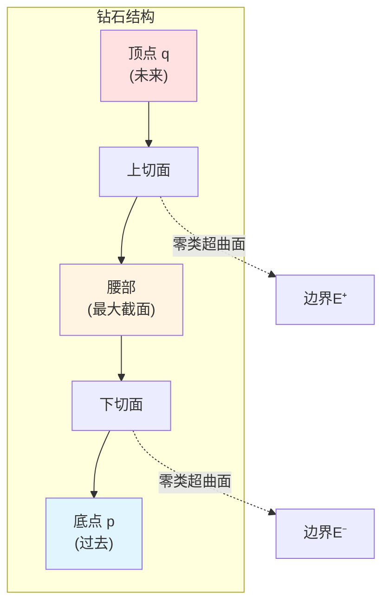
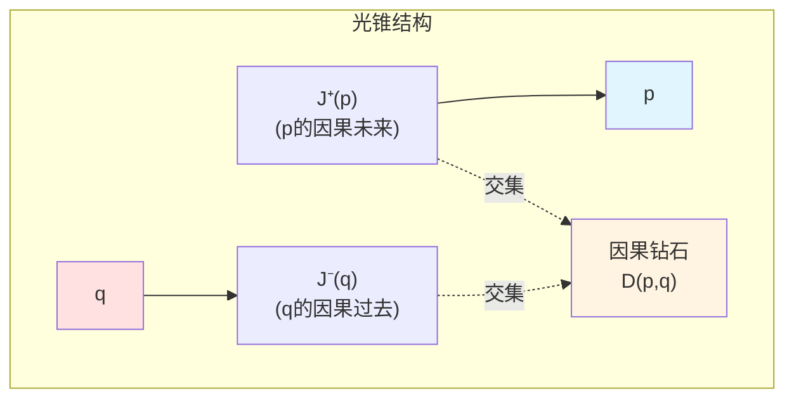
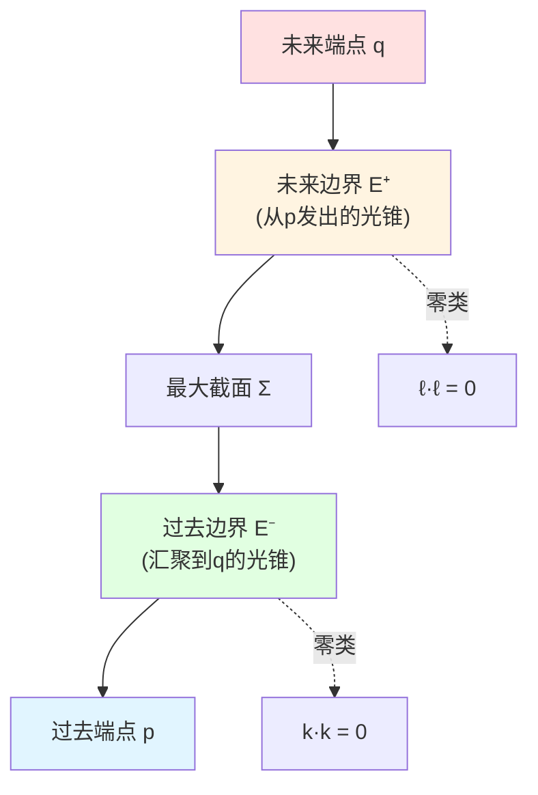
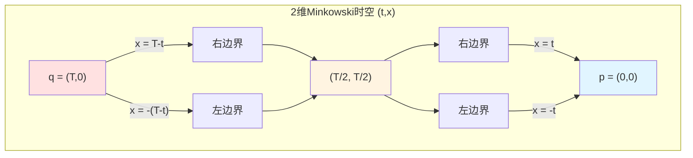
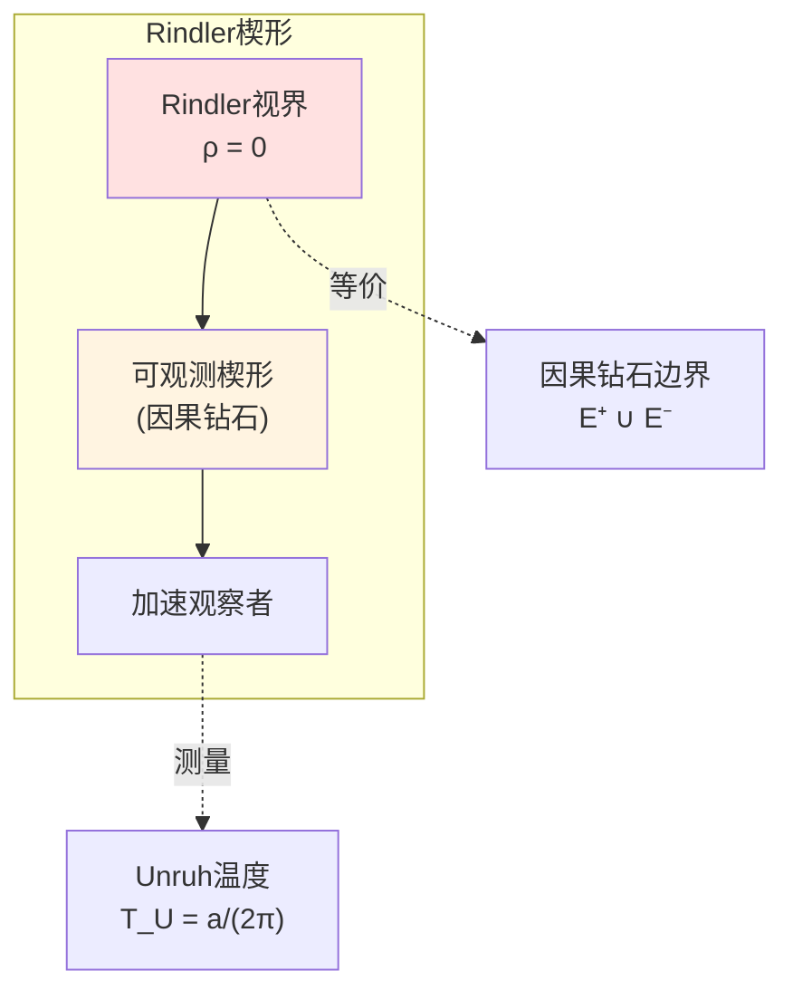
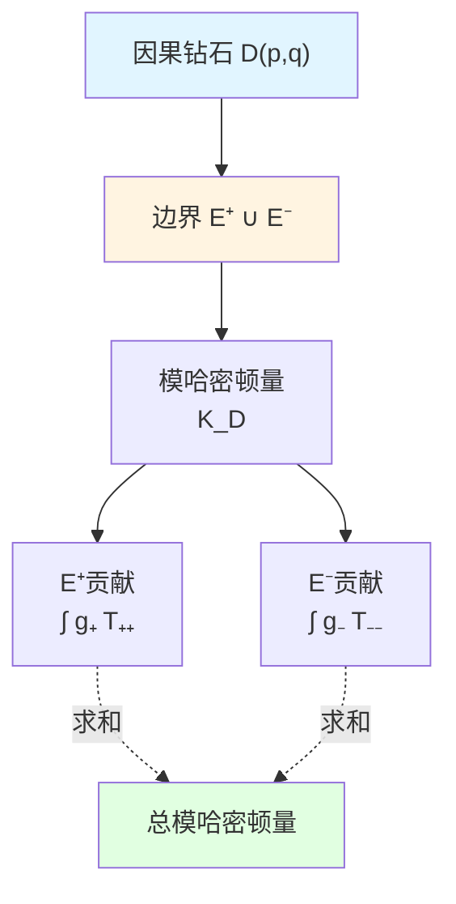
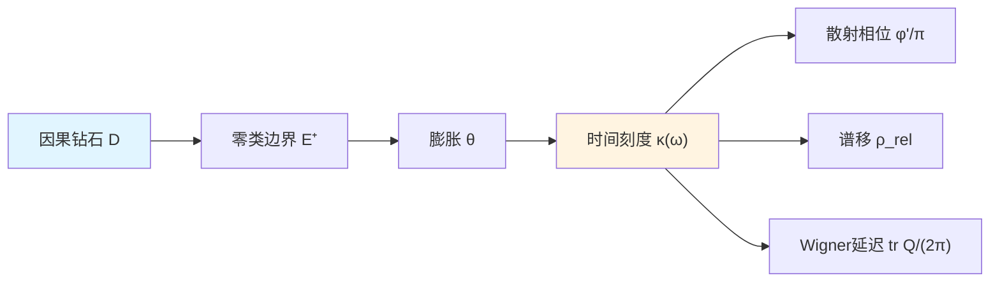
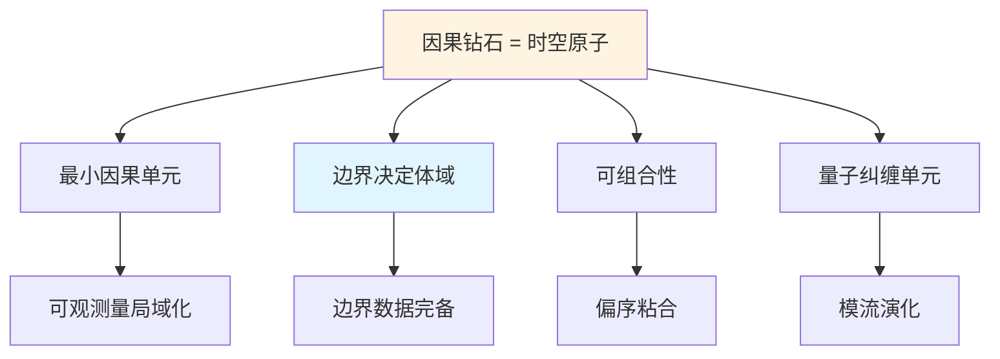

# 因果钻石：时空的原子

> *"因果钻石是时空的原子，所有物理都在其边界上定义。"*

## 🎯 本文核心

在GLS理论中，最基本的几何对象不是时空流形 $M$，而是**因果钻石**（causal diamond，也称**小因果菱形** small causal lozenge）：

$$
\boxed{D(p,q) = J^+(p) \cap J^-(q)}
$$

其中 $p \prec q$ 是两个因果相关的事件。

**核心洞察**：
- 所有可观测量都局域化在因果钻石的**边界**上
- 体域信息完全由边界零类面确定
- 模哈密顿量完全定义在边界上

这是**全息原理在因果层次的体现**！

## 🔷 比喻：钻石的切面

想象一颗钻石：

**钻石的物理类比**：
- **顶点 $q$**：未来观察事件
- **底点 $p$**：过去制备事件
- **上切面 $E^+$**：向未来的零类超曲面（光前锥）
- **下切面 $E^-$**：向过去的零类超曲面（光后锥）
- **腰部**：最大类空截面（Cauchy超曲面）

**关键洞察**：
- 钻石的价值不在体域，而在**切面**（边界）
- 物理信息编码在**零类边界** $E^+ \cup E^-$ 上
- 体域只是边界数据的重建

## 📐 精确定义

### 因果未来与因果过去

给定时空中一点 $p$，定义：

**因果未来**（Causal Future）：
$$
J^+(p) := \{x \in M \mid p \prec x\} = \{x \mid \exists \gamma: p \to x, \dot{\gamma}^2 \leq 0\}
$$

**因果过去**（Causal Past）：
$$
J^-(q) := \{x \in M \mid x \prec q\} = \{x \mid \exists \gamma: x \to q, \dot{\gamma}^2 \leq 0\}
$$

其中 $\gamma$ 是**非类空曲线**（null or timelike）。

### 因果钻石定义

对于因果相关的两点 $p \prec q$，定义**因果钻石**：

$$
D(p, q) := J^+(p) \cap J^-(q)
$$

**几何意义**：
- $D(p,q)$ 是所有**同时在 $p$ 未来和 $q$ 过去**的事件集合
- 这是一个**紧致**的因果相关区域
- 边界由两个**零类超曲面**组成

### 零类边界

因果钻石的边界分为两部分：

**未来边界**（Future Null Boundary）：
$$
E^+(p,q) := \partial J^+(p) \cap D(p,q)
$$

**过去边界**（Past Null Boundary）：
$$
E^-(p,q) := \partial J^-(q) \cap D(p,q)
$$

**完整边界**：
$$
\partial D(p,q) = E^+(p,q) \cup E^-(p,q)
$$

## 🌍 Minkowski时空中的因果钻石

### 坐标表示

在Minkowski时空 $(t, \mathbf{x})$ 中，设：
- $p = (0, \mathbf{0})$（原点）
- $q = (T, \mathbf{0})$（时间轴上）

则因果钻石：

$$
D(p,q) = \{(t, \mathbf{x}) \mid 0 \leq t \leq T, \, |\mathbf{x}| \leq \min(t, T-t)\}
$$

### 几何形状

在 $d$ 维Minkowski时空中：
- **2维**（$1+1$）：菱形（diamond）
- **3维**（$2+1$）：双锥体（double cone）
- **4维**（$3+1$）：双超锥体（double hypercone）

### 零类生成矢量

未来边界 $E^+$ 的生成矢量：
$$
\ell^\mu = (1, \hat{\mathbf{n}}) \quad (\text{单位时间方向} + \text{空间径向})
$$

过去边界 $E^-$ 的生成矢量：
$$
k^\mu = (1, -\hat{\mathbf{n}}) \quad (\text{单位时间方向} - \text{空间径向})
$$

验证零类性：
$$
\ell \cdot \ell = -1 + 1 = 0, \quad k \cdot k = -1 + 1 = 0
$$

## 📊 边界面积与体域体积

### 面积计算

对于Minkowski时空中的因果钻石 $D(p,q)$，设 $p$、$q$ 的固有时间隔为 $\tau$。

**边界面积**（在最大截面处）：
$$
A(\partial D) = \Omega_{d-2}\, \tau^{d-2}
$$

其中 $\Omega_{d-2}$ 是 $(d-2)$ 维球面的体积。

**体域体积**：
$$
V(D) \sim \tau^{d-1}
$$

### 全息缩放

关键观察：

$$
\frac{V(D)}{A(\partial D)} \sim \tau
$$

**物理意义**：
- 体域体积 $\sim$ 边界面积 $\times$ 特征长度
- 边界面积的增长率比体域体积低一个维度
- 这是**全息原理**的几何体现

在量子引力中（Planck单位 $\ell_P = \sqrt{G}$）：

$$
\frac{\text{体域自由度}}{\text{边界自由度}} \sim \frac{V/\ell_P^{d-1}}{A/\ell_P^{d-2}} \sim \frac{\tau}{\ell_P} \gg 1 \quad (\text{经典极限})
$$

但在普朗克尺度 $\tau \sim \ell_P$ 时：

$$
\text{体域自由度} \sim \text{边界自由度}
$$

这暗示**边界自由度可以编码体域信息**！

## 🔬 黑洞中的因果钻石

### Schwarzschild黑洞

考虑Schwarzschild时空：
$$
\mathrm{d}s^2 = -\left(1 - \frac{2M}{r}\right)\mathrm{d}t^2 + \left(1 - \frac{2M}{r}\right)^{-1}\mathrm{d}r^2 + r^2 \mathrm{d}\Omega^2
$$

设：
- $p$：视界外某点
- $q$：$p$ 未来的另一点

**视界附近的因果钻石**：
- 边界 $E^+$、$E^-$ 接近视界 $r = 2M$
- 视界是**零类超曲面**，类似因果钻石的边界
- 黑洞视界可以看作"极限因果钻石"的边界

### Rindler视界

在加速观察者（Rindler坐标）中：
$$
\mathrm{d}s^2 = -\rho^2 \mathrm{d}\eta^2 + \mathrm{d}\rho^2 + \mathrm{d}x_\perp^2
$$

**Rindler视界** $\rho = 0$ 是因果钻石边界的特殊情况：
- 加速观察者只能访问因果钻石 $D$
- 边界 $\rho = 0$ 是零类超曲面
- Unruh温度：$T_U = \frac{a}{2\pi}$（$a$ 是加速度）

**与因果钻石的联系**：
- Rindler视界 = 因果钻石的边界
- Unruh辐射 = 边界上的热效应
- 模哈密顿量 $K_D$ = Rindler推进生成元

## 🧮 模哈密顿量的边界局域化

### 核心定理（Null-Modular双覆盖）

**定理**（下篇详述）：对于因果钻石 $D(p,q)$，其模哈密顿量 $K_D$ **完全局域化在零类边界** $E^+ \cup E^-$ 上：

$$
K_D = 2\pi \sum_{\sigma = \pm} \int_{E^\sigma} g_\sigma(\lambda, x_\perp)\, T_{\sigma\sigma}(\lambda, x_\perp)\, \mathrm{d}\lambda\, \mathrm{d}^{d-2}x_\perp
$$

其中：
- $\lambda$：沿零测地线的仿射参数
- $x_\perp$：横截坐标
- $g_\sigma$：调制函数（modulation function）
- $T_{\sigma\sigma}$：应力张量在零方向的分量

### 物理意义

这个公式揭示：

1. **边界完备性**：体域算符 $K_D$ 完全由边界数据 $T_{\sigma\sigma}|_{E^\pm}$ 确定
2. **零类局域化**：只有**零类方向**的能量-动量 $T_{\sigma\sigma}$ 贡献
3. **调制函数**：$g_\sigma(\lambda, x_\perp)$ 编码几何信息（类似Radon变换）

**与边界理论的联系**（第6篇）：
- GHY边界项在零类边界上：$S_{\mathrm{GHY}}|_{\text{null}} \sim \int (\theta + \kappa)$
- Brown-York能量：$E_{\mathrm{BY}} \sim \int K$（外挠曲率）
- 模哈密顿量：$K_D \sim \int g T$

**三者统一**：

$$
\text{模哈密顿量} \longleftrightarrow \text{GHY边界项} \longleftrightarrow \text{Brown-York能量}
$$

## 🔗 与统一时间篇的联系

在统一时间篇（第5篇），我们学到：

$$
\kappa(\omega) = \frac{\varphi'(\omega)}{\pi} = \rho_{\mathrm{rel}}(\omega) = \frac{1}{2\pi}\operatorname{tr}Q(\omega)
$$

**因果钻石如何产生时间刻度？**

答案：通过**边界膨胀** $\theta$！

对于零类边界 $E^+$，定义**膨胀**（expansion）：
$$
\theta := \nabla_\mu \ell^\mu
$$

物理意义：零类测地线束的"发散率"。

**关键联系**：

$$
\kappa(\omega) \longleftrightarrow \theta + \kappa_{\mathrm{surf}}
$$

其中 $\kappa_{\mathrm{surf}}$ 是**表面引力**（surface gravity）。

**深刻洞察**：
- 因果钻石的**几何**（膨胀 $\theta$）
- 决定了**时间刻度** $\kappa(\omega)$
- 进而决定了所有物理时间（散射、谱、模流）

这是**因果 → 时间**的具体机制！

## 🔗 因果钻石是GLS理论的"原子"

### 为什么称为"原子"？

1. **最小因果单元**
   - 因果钻石是最小的**因果完备区域**
   - 任何可观测量必须在某个因果钻石内定义

2. **边界决定体域**
   - 边界数据 $(E^+, E^-, T_{\sigma\sigma})$ 完全确定体域
   - 这是全息原理的体现

3. **可组合性**
   - 多个因果钻石可以通过**粘合**（gluing）构造更大区域
   - 偏序结构由局域因果钻石诱导（下篇详述）

4. **量子纠缠单元**
   - 因果钻石边界定义**纠缠楔形**（entanglement wedge）
   - 模哈密顿量 $K_D$ 生成边界态的纠缠演化

### 与AdS/CFT的联系

在AdS/CFT对应中：
- **体域AdS**：连续的因果钻石叠加
- **边界CFT**：因果钻石边界的共形场论
- **纠缠楔形重建**：因果钻石边界重建体域

**RT公式**（Ryu-Takayanagi）：
$$
S(A) = \frac{\text{Area}(\gamma_A)}{4G}
$$

其中 $\gamma_A$ 是**极值曲面**，本质上是因果钻石边界的推广！

## 💡 关键要点总结

### 1. 因果钻石定义

$$
D(p,q) = J^+(p) \cap J^-(q), \quad p \prec q
$$

- 所有同时在 $p$ 未来和 $q$ 过去的事件
- 紧致的因果完备区域

### 2. 零类边界结构

$$
\partial D = E^+(p,q) \cup E^-(p,q)
$$

- $E^+$：向未来的光锥
- $E^-$：向过去的光锥
- 两者都是**零类超曲面**

### 3. 全息缩放

$$
\frac{V(D)}{A(\partial D)} \sim \tau \quad \Rightarrow \quad \text{边界自由度} \sim \text{体域自由度}
$$

### 4. 模哈密顿量边界局域化

$$
K_D = 2\pi \sum_{\sigma = \pm} \int_{E^\sigma} g_\sigma\, T_{\sigma\sigma}\, \mathrm{d}\lambda\, \mathrm{d}^{d-2}x_\perp
$$

- 体域算符完全由边界确定
- 零类方向的能量-动量贡献

### 5. 时空的"原子"

- 最小因果单元
- 边界决定体域
- 可组合成更大结构
- 量子纠缠的基本单元

## 🤔 思考题

### 问题1：为什么因果钻石的边界必须是零类的？

**提示**：考虑因果未来 $J^+(p)$ 的边界 $\partial J^+(p)$，它由什么曲线生成？

**答案**：$\partial J^+(p)$ 由从 $p$ 出发的**零测地线**生成。任何类时曲线都在 $J^+(p)$ 内部，任何类空分离的点都不在 $J^+(p)$ 中。因此边界恰好是零类超曲面。

### 问题2：为什么模哈密顿量只依赖 $T_{\sigma\sigma}$，而不是 $T_{\mu\nu}$ 的所有分量？

**提示**：回忆零类超曲面的特殊性质，以及模流的几何意义。

**答案**：零类超曲面的法向量 $\ell^\mu$ 同时也是切向量（$\ell \cdot \ell = 0$）。模流对应沿零方向的"boost"，因此只有 $T_{\ell\ell} := T_{\mu\nu}\ell^\mu \ell^\nu$ 这个不变量贡献。其他分量对应横截或混合方向，不参与模流。

### 问题3：在Minkowski时空中，如何显式写出调制函数 $g_\sigma(\lambda, x_\perp)$？

**提示**：考虑Rindler坐标与Minkowski坐标的关系。

**答案**：对于标准Rindler楔形，调制函数为：
$$
g(\rho, \eta, x_\perp) = \frac{2\pi}{\beta}\, \rho
$$
其中 $\beta = 2\pi/a$（逆Unruh温度），$\rho$ 是Rindler径向坐标。这对应线性调制（类似三角形权重）。

### 问题4：黑洞视界是因果钻石的边界吗？

**提示**：考虑"极限"因果钻石，其中一个端点趋于视界。

**答案**：是的！黑洞视界可以看作一系列因果钻石的边界在极限下的结果。更精确地说，视界是**Killing视界**，对应于模流不动点集的边界。因此视界与因果钻石边界有深刻联系。

## 📖 源理论出处

本文内容主要来自以下源理论：

### 核心源理论

**文档**：`docs/euler-gls-causal/unified-theory-causal-structure-time-scale-partial-order-generalized-entropy.md`

**关键内容**：
- 因果钻石的定义 $D(p,q) = J^+(p) \cap J^-(q)$
- 零类边界 $E^+ \cup E^-$ 的结构
- 模哈密顿量的边界局域化公式
- Null-Modular双覆盖定理

**重要公式**：
> $$K_D = 2\pi \sum_{\sigma = \pm} \int_{E^\sigma} g_\sigma(\lambda, x_\perp)\, T_{\sigma\sigma}(\lambda, x_\perp)\, \mathrm{d}\lambda\, \mathrm{d}^{d-2}x_\perp$$

### 支持理论

**边界理论篇**（第6篇）：
- GHY边界项在零类边界上的形式
- Brown-York能量的几何意义
- 边界三元组 $(\partial M, \mathcal{A}_\partial, \omega_\partial)$

**统一时间篇**（第5篇）：
- 统一时间刻度 $\kappa(\omega)$ 的定义
- 膨胀 $\theta$ 与时间刻度的联系
- 散射相位、谱移、Wigner延迟的统一

## 🎯 下一步

我们已经理解了**因果钻石的几何结构**，下一篇将探讨如何用局域因果钻石**粘合**成全局**偏序结构**：

**下一篇**：[03-偏序结构与粘合](03-partial-order.md) - 从局域到全局的因果网络

在那里，我们将看到：
- 偏序 $(M, \prec)$ 的公理化定义
- Čech型一致性条件
- 局域因果钻石如何粘合成全局时空
- 观察者共识的数学基础

**返回**：[因果结构篇总览](00-causal-overview.md)

**上一篇**：[01-什么是因果](01-what-is-causality.md)
