# Causal Diamond: Atom of Spacetime

> *"Causal diamonds are atoms of spacetime; all physics is defined on their boundaries."*

## 🎯 Core of This Article

In GLS theory, the most fundamental geometric object is not spacetime manifold $M$, but **causal diamond** (also called **small causal lozenge**):

$$\boxed{D(p,q) = J^+(p) \cap J^-(q)}$$

where $p \prec q$ are two causally related events.

**Core Insight**:
- All observables localized on **boundary** of causal diamond
- Bulk information completely determined by boundary null surfaces
- Modular Hamiltonian completely defined on boundary

This is **manifestation of holographic principle at causal level**!

## 🔷 Analogy: Facets of a Diamond

Imagine a diamond:

```mermaid
graph TB
    subgraph "Diamond Structure"
        TOP["Vertex q<br/>(Future)"] --> FACET1["Upper Facet"]
        FACET1 --> MID["Waist<br/>(Maximum Cross-Section)"]
        MID --> FACET2["Lower Facet"]
        FACET2 --> BOTTOM["Bottom p<br/>(Past)"]
    end

    FACET1 -.->|"Null Hypersurface"| NULL["Boundary E⁺"]
    FACET2 -.->|"Null Hypersurface"| NULL2["Boundary E⁻"]

    style TOP fill:#ffe1e1
    style BOTTOM fill:#e1f5ff
    style MID fill:#fff4e1
```

**Physical Analogy of Diamond**:
- **Vertex $q$**: Future observation event
- **Bottom $p$**: Past preparation event
- **Upper Facet $E^+$**: Future-directed null hypersurface (forward light cone)
- **Lower Facet $E^-$**: Past-directed null hypersurface (backward light cone)
- **Waist**: Maximum spacelike cross-section (Cauchy hypersurface)

**Key Insight**:
- Diamond's value not in bulk, but in **facets** (boundary)
- Physical information encoded on **null boundaries** $E^+ \cup E^-$
- Bulk is just reconstruction from boundary data

## 📐 Precise Definition

### Causal Future and Causal Past

Given a point $p$ in spacetime, define:

**Causal Future**:
$$J^+(p) := \{x \in M \mid p \prec x\} = \{x \mid \exists \gamma: p \to x, \dot{\gamma}^2 \leq 0\}$$

**Causal Past**:
$$J^-(q) := \{x \in M \mid x \prec q\} = \{x \mid \exists \gamma: x \to q, \dot{\gamma}^2 \leq 0\}$$

where $\gamma$ is a **non-spacelike curve** (null or timelike).

### Causal Diamond Definition

For causally related points $p \prec q$, define **causal diamond**:

$$D(p, q) := J^+(p) \cap J^-(q)$$

**Geometric Meaning**:
- $D(p,q)$ is set of all events **simultaneously in future of $p$ and past of $q$**
- This is a **compact** causally related region
- Boundary consists of two **null hypersurfaces**

### Null Boundaries

Boundary of causal diamond divides into two parts:

**Future Boundary** (Future Null Boundary):
$$E^+(p,q) := \partial J^+(p) \cap D(p,q)$$

**Past Boundary** (Past Null Boundary):
$$E^-(p,q) := \partial J^-(q) \cap D(p,q)$$

**Complete Boundary**:
$$\partial D(p,q) = E^+(p,q) \cup E^-(p,q)$$

```mermaid
graph TB
    Q["Future Endpoint q"] --> EPLUS["Future Boundary E⁺<br/>(Light Cone from p)"]
    EPLUS --> MID["Maximum Cross-Section Σ"]
    MID --> EMINUS["Past Boundary E⁻<br/>(Light Cone Converging to q)"]
    EMINUS --> P["Past Endpoint p"]

    EPLUS -.->|"Null"| NULLPLUS["ℓ·ℓ = 0"]
    EMINUS -.->|"Null"| NULLMINUS["k·k = 0"]

    style Q fill:#ffe1e1
    style P fill:#e1f5ff
    style EPLUS fill:#fff4e1
    style EMINUS fill:#e1ffe1
```

## 🌍 Causal Diamonds in Minkowski Spacetime

### Coordinate Representation

In Minkowski spacetime $(t, \mathbf{x})$, set:
- $p = (0, \mathbf{0})$ (origin)
- $q = (T, \mathbf{0})$ (on time axis)

Then causal diamond:

$$D(p,q) = \{(t, \mathbf{x}) \mid 0 \leq t \leq T, \, |\mathbf{x}| \leq \min(t, T-t)\}$$

### Geometric Shape

In $d$-dimensional Minkowski spacetime:
- **2D** ($1+1$): Diamond
- **3D** ($2+1$): Double cone
- **4D** ($3+1$): Double hypercone

### Null Generating Vectors

Generating vector of future boundary $E^+$:
$$\ell^\mu = (1, \hat{\mathbf{n}}) \quad (\text{unit time direction} + \text{spatial radial})$$

Generating vector of past boundary $E^-$:
$$k^\mu = (1, -\hat{\mathbf{n}}) \quad (\text{unit time direction} - \text{spatial radial})$$

Verify null property:
$$\ell \cdot \ell = -1 + 1 = 0, \quad k \cdot k = -1 + 1 = 0$$

## 📊 Boundary Area and Bulk Volume

### Area Calculation

For causal diamond $D(p,q)$ in Minkowski spacetime, let proper time interval between $p$ and $q$ be $\tau$.

**Boundary Area** (at maximum cross-section):
$$A(\partial D) = \Omega_{d-2}\, \tau^{d-2}$$

where $\Omega_{d-2}$ is volume of $(d-2)$-dimensional sphere.

**Bulk Volume**:
$$V(D) \sim \tau^{d-1}$$

### Holographic Scaling

Key observation:

$$\frac{V(D)}{A(\partial D)} \sim \tau$$

**Physical Meaning**:
- Bulk volume $\sim$ boundary area $\times$ characteristic length
- Growth rate of boundary area one dimension lower than bulk volume
- This is geometric manifestation of **holographic principle**

In quantum gravity (Planck units $\ell_P = \sqrt{G}$):

$$\frac{\text{Bulk Degrees of Freedom}}{\text{Boundary Degrees of Freedom}} \sim \frac{V/\ell_P^{d-1}}{A/\ell_P^{d-2}} \sim \frac{\tau}{\ell_P} \gg 1 \quad (\text{classical limit})$$

But at Planck scale $\tau \sim \ell_P$:

$$\text{Bulk Degrees of Freedom} \sim \text{Boundary Degrees of Freedom}$$

This suggests **boundary degrees of freedom can encode bulk information**!

## 🔬 Causal Diamonds in Black Holes

### Schwarzschild Black Hole

Consider Schwarzschild spacetime:
$$\mathrm{d}s^2 = -\left(1 - \frac{2M}{r}\right)\mathrm{d}t^2 + \left(1 - \frac{2M}{r}\right)^{-1}\mathrm{d}r^2 + r^2 \mathrm{d}\Omega^2$$

Set:
- $p$: Some point outside horizon
- $q$: Another point in future of $p$

**Causal Diamond Near Horizon**:
- Boundaries $E^+$, $E^-$ approach horizon $r = 2M$
- Horizon is **null hypersurface**, similar to causal diamond boundary
- Black hole horizon can be seen as boundary of "limiting causal diamond"

### Rindler Horizon

In accelerating observer (Rindler coordinates):
$$\mathrm{d}s^2 = -\rho^2 \mathrm{d}\eta^2 + \mathrm{d}\rho^2 + \mathrm{d}x_\perp^2$$

**Rindler Horizon** $\rho = 0$ is special case of causal diamond boundary:
- Accelerating observer can only access causal diamond $D$
- Boundary $\rho = 0$ is null hypersurface
- Unruh temperature: $T_U = \frac{a}{2\pi}$ ($a$ is acceleration)

**Connection to Causal Diamond**:
- Rindler horizon = boundary of causal diamond
- Unruh radiation = thermal effect on boundary
- Modular Hamiltonian $K_D$ = Rindler boost generator

```mermaid
graph TB
    subgraph "Rindler Wedge"
        HORIZON["Rindler Horizon<br/>ρ = 0"] --> WEDGE["Observable Wedge<br/>(Causal Diamond)"]
        WEDGE --> OBSERVER["Accelerating Observer"]
    end

    HORIZON -.->|"Equivalent"| BOUNDARY["Causal Diamond Boundary<br/>E⁺ ∪ E⁻"]
    OBSERVER -.->|"Measures"| UNRUH["Unruh Temperature<br/>T_U = a/(2π)"]

    style HORIZON fill:#ffe1e1
    style WEDGE fill:#fff4e1
```

## 🧮 Boundary Localization of Modular Hamiltonian

### Core Theorem (Null-Modular Double Cover)

**Theorem** (detailed in next article): For causal diamond $D(p,q)$, its modular Hamiltonian $K_D$ is **completely localized on null boundaries** $E^+ \cup E^-$:

$$K_D = 2\pi \sum_{\sigma = \pm} \int_{E^\sigma} g_\sigma(\lambda, x_\perp)\, T_{\sigma\sigma}(\lambda, x_\perp)\, \mathrm{d}\lambda\, \mathrm{d}^{d-2}x_\perp$$

where:
- $\lambda$: Affine parameter along null geodesic
- $x_\perp$: Transverse coordinates
- $g_\sigma$: Modulation function
- $T_{\sigma\sigma}$: Component of stress tensor in null direction

```mermaid
graph TB
    DIAMOND["Causal Diamond D(p,q)"] --> BOUNDARY["Boundary E⁺ ∪ E⁻"]
    BOUNDARY --> MOD["Modular Hamiltonian<br/>K_D"]

    MOD --> EPLUS["E⁺ Contribution<br/>∫ g₊ T₊₊"]
    MOD --> EMINUS["E⁻ Contribution<br/>∫ g₋ T₋₋"]

    EPLUS -.->|"Sum"| TOTAL["Total Modular Hamiltonian"]
    EMINUS -.->|"Sum"| TOTAL

    style DIAMOND fill:#e1f5ff
    style BOUNDARY fill:#fff4e1
    style TOTAL fill:#e1ffe1
```

### Physical Meaning

This formula reveals:

1. **Boundary Completeness**: Bulk operator $K_D$ completely determined by boundary data $T_{\sigma\sigma}|_{E^\pm}$
2. **Null Localization**: Only energy-momentum in **null direction** $T_{\sigma\sigma}$ contributes
3. **Modulation Function**: $g_\sigma(\lambda, x_\perp)$ encodes geometric information (similar to Radon transform)

**Connection to Boundary Theory** (Chapter 6):
- GHY boundary term on null boundaries: $S_{\mathrm{GHY}}|_{\text{null}} \sim \int (\theta + \kappa)$
- Brown-York energy: $E_{\mathrm{BY}} \sim \int K$ (extrinsic curvature)
- Modular Hamiltonian: $K_D \sim \int g T$

**Unification of Three**:

$$\text{Modular Hamiltonian} \longleftrightarrow \text{GHY Boundary Term} \longleftrightarrow \text{Brown-York Energy}$$

## 🔗 Connection to Unified Time Chapter

In Unified Time chapter (Chapter 5), we learned:

$$\kappa(\omega) = \frac{\varphi'(\omega)}{\pi} = \rho_{\mathrm{rel}}(\omega) = \frac{1}{2\pi}\operatorname{tr}Q(\omega)$$

**How Do Causal Diamonds Generate Time Scale?**

Answer: Through **boundary expansion** $\theta$!

For null boundary $E^+$, define **expansion**:

$$\theta := \nabla_\mu \ell^\mu$$

Physical meaning: "Divergence rate" of null geodesic bundle.

**Key Connection**:

$$\kappa(\omega) \longleftrightarrow \theta + \kappa_{\mathrm{surf}}$$

where $\kappa_{\mathrm{surf}}$ is **surface gravity**.

```mermaid
graph LR
    DIAMOND["Causal Diamond D"] --> BOUNDARY["Null Boundary E⁺"]
    BOUNDARY --> EXPANSION["Expansion θ"]
    EXPANSION --> TIMESCALE["Time Scale κ(ω)"]

    TIMESCALE --> PHASE["Scattering Phase φ'/π"]
    TIMESCALE --> SPECTRAL["Spectral Shift ρ_rel"]
    TIMESCALE --> WIGNER["Wigner Delay tr Q/(2π)"]

    style DIAMOND fill:#e1f5ff
    style TIMESCALE fill:#fff4e1
```

**Profound Insight**:
- **Geometry** of causal diamond (expansion $\theta$)
- Determines **time scale** $\kappa(\omega)$
- Which determines all physical times (scattering, spectral, modular flow)

This is concrete mechanism of **Causality → Time**!

## 🔗 Causal Diamonds Are "Atoms" of GLS Theory

### Why Called "Atoms"?

1. **Smallest Causal Units**
   - Causal diamonds are smallest **causally complete regions**
   - Any observable must be defined within some causal diamond

2. **Boundary Determines Bulk**
   - Boundary data $(E^+, E^-, T_{\sigma\sigma})$ completely determines bulk
   - This is manifestation of holographic principle

3. **Composability**
   - Multiple causal diamonds can construct larger regions through **gluing**
   - Partial order structure induced by local causal diamonds (detailed in next article)

4. **Quantum Entanglement Units**
   - Causal diamond boundaries define **entanglement wedges**
   - Modular Hamiltonian $K_D$ generates entanglement evolution of boundary states

### Connection to AdS/CFT

In AdS/CFT correspondence:
- **Bulk AdS**: Continuous superposition of causal diamonds
- **Boundary CFT**: Conformal field theory on causal diamond boundaries
- **Entanglement Wedge Reconstruction**: Causal diamond boundaries reconstruct bulk

**RT Formula** (Ryu-Takayanagi):
$$S(A) = \frac{\text{Area}(\gamma_A)}{4G}$$

where $\gamma_A$ is **extremal surface**, essentially generalization of causal diamond boundary!

## 💡 Key Points Summary

### 1. Causal Diamond Definition

$$D(p,q) = J^+(p) \cap J^-(q), \quad p \prec q$$

- All events simultaneously in future of $p$ and past of $q$
- Compact causally complete region

### 2. Null Boundary Structure

$$\partial D = E^+(p,q) \cup E^-(p,q)$$

- $E^+$: Forward light cone
- $E^-$: Backward light cone
- Both are **null hypersurfaces**

### 3. Holographic Scaling

$$\frac{V(D)}{A(\partial D)} \sim \tau \quad \Rightarrow \quad \text{Boundary Degrees of Freedom} \sim \text{Bulk Degrees of Freedom}$$

### 4. Boundary Localization of Modular Hamiltonian

$$K_D = 2\pi \sum_{\sigma = \pm} \int_{E^\sigma} g_\sigma\, T_{\sigma\sigma}\, \mathrm{d}\lambda\, \mathrm{d}^{d-2}x_\perp$$

- Bulk operator completely determined by boundary
- Energy-momentum in null direction contributes

### 5. "Atoms" of Spacetime

- Smallest causal units
- Boundary determines bulk
- Composable into larger structures
- Basic units of quantum entanglement

## 🤔 Thought Questions

### Question 1: Why Must Boundaries of Causal Diamonds Be Null?

**Hint**: Consider boundary $\partial J^+(p)$ of causal future $J^+(p)$, what curves generate it?

**Answer**: $\partial J^+(p)$ is generated by **null geodesics** from $p$. Any timelike curve is in interior of $J^+(p)$, any spacelike separated point is not in $J^+(p)$. Therefore boundary is exactly null hypersurface.

### Question 2: Why Does Modular Hamiltonian Only Depend on $T_{\sigma\sigma}$, Not All Components of $T_{\mu\nu}$?

**Hint**: Recall special properties of null hypersurfaces, and geometric meaning of modular flow.

**Answer**: Normal vector $\ell^\mu$ of null hypersurface is also tangent vector ($\ell \cdot \ell = 0$). Modular flow corresponds to "boost" along null direction, so only invariant $T_{\ell\ell} := T_{\mu\nu}\ell^\mu \ell^\nu$ contributes. Other components correspond to transverse or mixed directions, don't participate in modular flow.

### Question 3: In Minkowski Spacetime, How to Explicitly Write Modulation Function $g_\sigma(\lambda, x_\perp)$?

**Hint**: Consider relationship between Rindler coordinates and Minkowski coordinates.

**Answer**: For standard Rindler wedge, modulation function is:
$$g(\rho, \eta, x_\perp) = \frac{2\pi}{\beta}\, \rho$$
where $\beta = 2\pi/a$ (inverse Unruh temperature), $\rho$ is Rindler radial coordinate. This corresponds to linear modulation (similar to triangular weight).

### Question 4: Is Black Hole Horizon Boundary of Causal Diamond?

**Hint**: Consider "limiting" causal diamond, where one endpoint tends to horizon.

**Answer**: Yes! Black hole horizon can be seen as boundary of series of causal diamonds in limit. More precisely, horizon is **Killing horizon**, corresponding to boundary of fixed point set of modular flow. Therefore horizon has deep connection with causal diamond boundaries.

## 📖 Source Theory References

Content of this article mainly from following source theories:

### Core Source Theory

**Document**: `docs/euler-gls-causal/unified-theory-causal-structure-time-scale-partial-order-generalized-entropy.md`

**Key Content**:
- Definition of causal diamond $D(p,q) = J^+(p) \cap J^-(q)$
- Structure of null boundaries $E^+ \cup E^-$
- Boundary localization formula of modular Hamiltonian
- Null-Modular double cover theorem

**Important Formula**:
> $$K_D = 2\pi \sum_{\sigma = \pm} \int_{E^\sigma} g_\sigma(\lambda, x_\perp)\, T_{\sigma\sigma}(\lambda, x_\perp)\, \mathrm{d}\lambda\, \mathrm{d}^{d-2}x_\perp$$

### Supporting Theories

**Boundary Theory Chapter** (Chapter 6):
- Form of GHY boundary term on null boundaries
- Geometric meaning of Brown-York energy
- Boundary triple $(\partial M, \mathcal{A}_\partial, \omega_\partial)$

**Unified Time Chapter** (Chapter 5):
- Definition of unified time scale $\kappa(\omega)$
- Connection between expansion $\theta$ and time scale
- Unification of scattering phase, spectral shift, Wigner delay

## 🎯 Next Steps

We've understood **geometric structure of causal diamonds**, next article will explore how to **glue** local causal diamonds into global **partial order structure**:

**Next Article**: [03-partial-order_en.md](03-partial-order_en.md) - Causal Network from Local to Global

There, we will see:
- Axiomatic definition of partial order $(M, \prec)$
- Čech-type consistency conditions
- How local causal diamonds glue into global spacetime
- Mathematical foundation of observer consensus

**Back**: [Causal Structure Chapter Overview](00-causal-overview_en.md)

**Previous**: [01-what-is-causality_en.md](01-what-is-causality_en.md)

