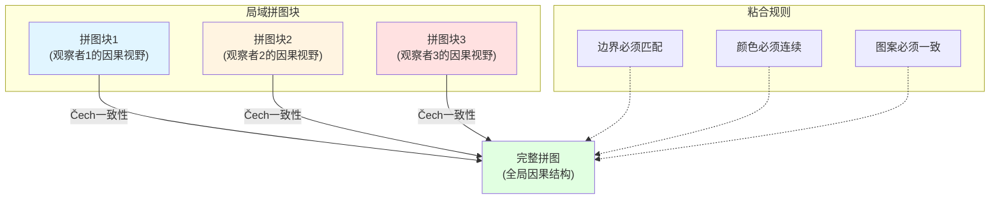
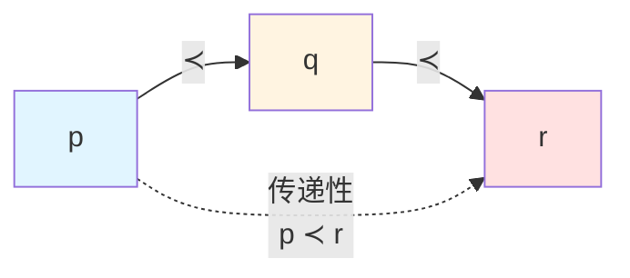
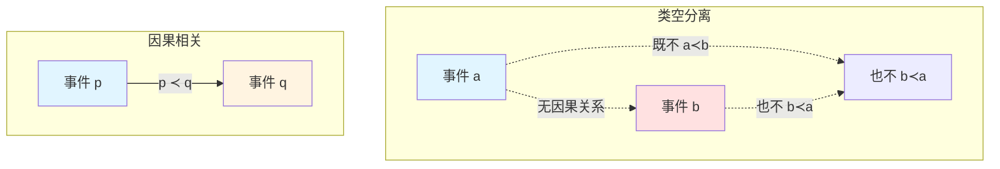
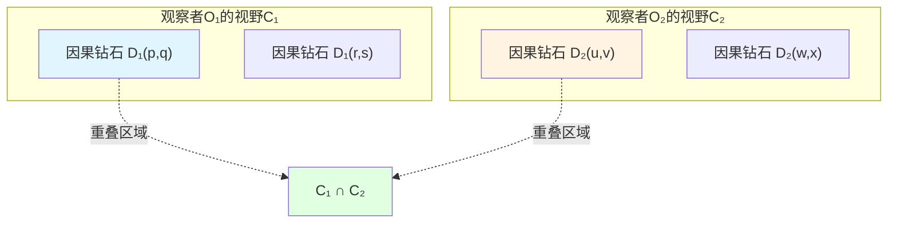
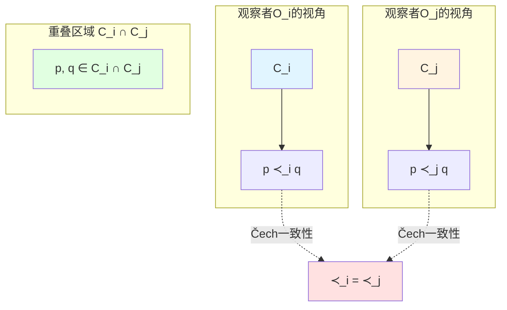
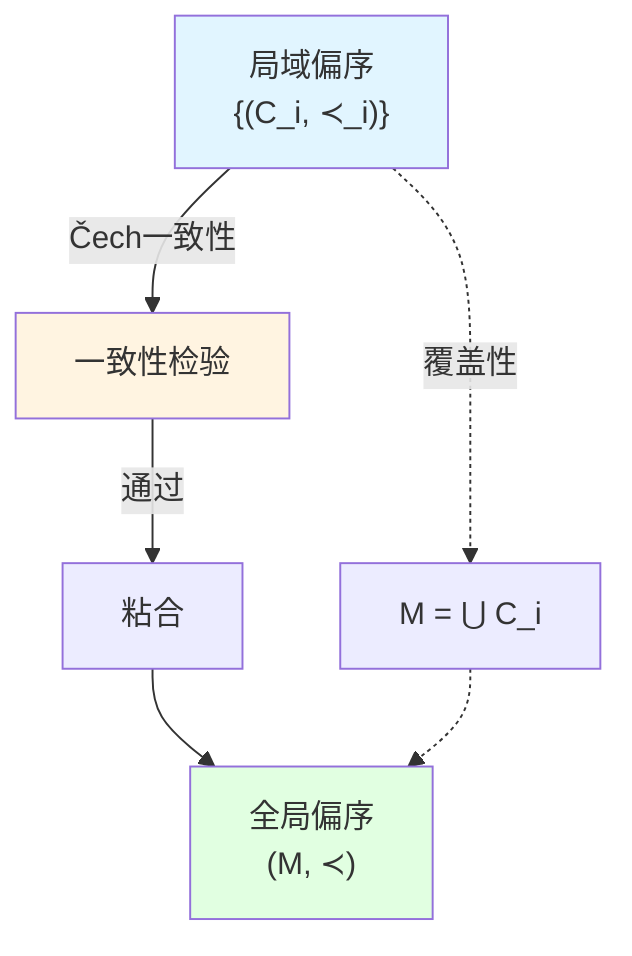
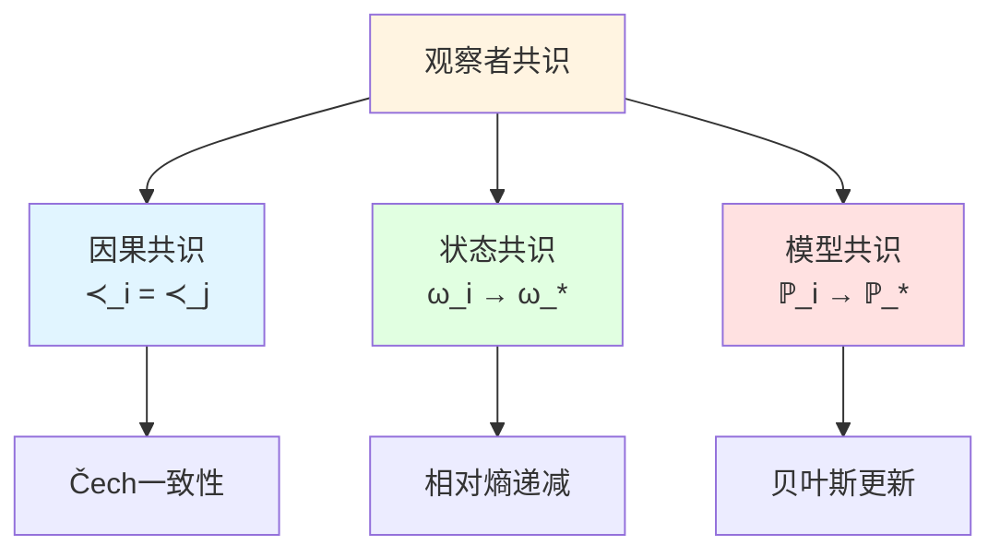
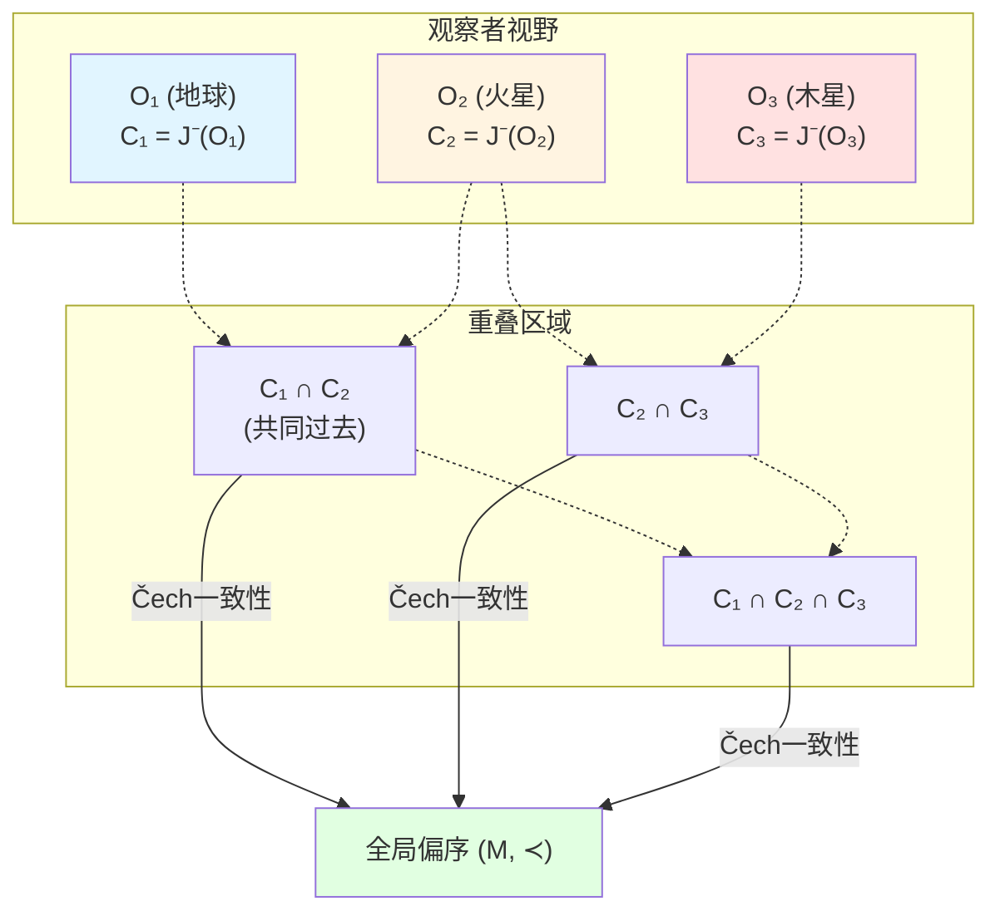
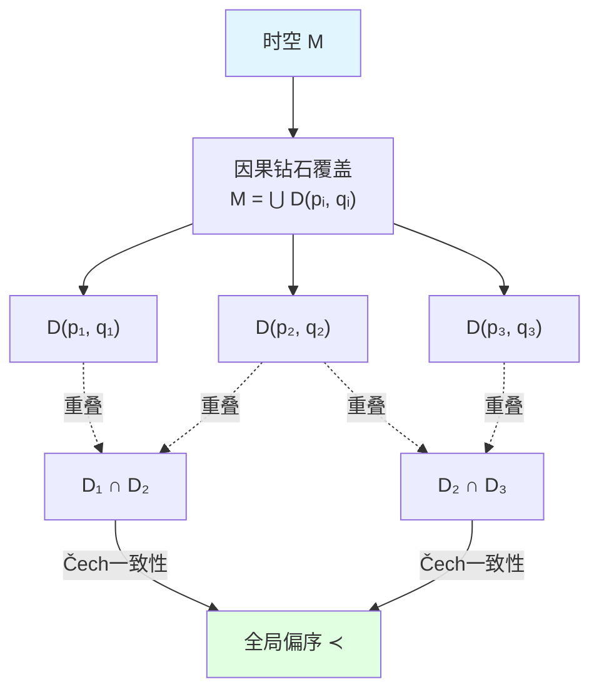

# 偏序结构与粘合

> *"局域因果钻石通过一致性条件粘合成全局因果结构。"*

## 🎯 本文核心

在前两篇中，我们学到：
- 因果关系是三位一体的（几何、时间、熵）
- 因果钻石 $D(p,q)$ 是时空的"原子"

现在的关键问题是：**如何从局域因果钻石构造全局时空？**

答案：通过**偏序粘合**（partial order gluing）！

$$
\boxed{\text{全局因果结构} = \text{局域偏序} + \text{Čech一致性}}
$$

这个粘合过程不仅是数学构造，更是**多观察者共识的数学表达**。

## 🧩 比喻：拼图游戏

想象你在玩一个拼图游戏：

**拼图类比**：
- **拼图块**：每个观察者的局域因果钻石
- **边界**：因果钻石的零类边界
- **粘合规则**：Čech一致性条件
- **完整拼图**：全局时空的因果结构

**关键洞察**：
- 你不需要从一开始就知道完整拼图的样子
- 只要每块拼图都遵守局域规则，完整图案自然浮现
- 这就是**观察者共识**的几何意义！

## 📐 偏序的公理化定义

### 什么是偏序？

一个**偏序**（partial order）是一个集合 $M$ 加上一个关系 $\prec$，满足三个公理：

### 公理1：自反性（Reflexivity）

$$
\forall p \in M, \quad p \prec p
$$

**物理意义**：任何事件都在自己的因果锥中。

**直观理解**：你总是能影响你自己的未来（至少作为同一事件）。

### 公理2：传递性（Transitivity）

$$
p \prec q \land q \prec r \quad \Longrightarrow \quad p \prec r
$$

**物理意义**：因果关系可以传递。

**直观理解**：
- 如果 $p$ 能影响 $q$
- 且 $q$ 能影响 $r$
- 则 $p$ 能影响 $r$（通过 $q$ 作为中介）

### 公理3：反对称性（Antisymmetry）

$$
p \prec q \land q \prec p \quad \Longrightarrow \quad p = q
$$

**物理意义**：没有因果闭环（除非是同一事件）。

**直观理解**：
- 如果 $p$ 能影响 $q$
- 且 $q$ 能影响 $p$
- 则它们必须是同一事件

**时间箭头**：反对称性禁止了**闭类时曲线**（closed timelike curves, CTC），保证时间演化的单向性。

### 偏序 vs 全序

**偏序**（partial order）：不是所有元素都可比较
- 例：$p$ 和 $q$ 可能**类空分离**，既不 $p \prec q$ 也不 $q \prec p$

**全序**（total order）：任意两个元素都可比较
- 例：实数 $\mathbb{R}$ 上的 $\leq$ 关系

**时空的因果结构是偏序，不是全序！**

## 🔗 局域偏序的定义

### 观察者的因果视野

每个观察者 $O_i$ 只能访问一个**有限的因果区域** $C_i \subset M$：

$$
C_i = \text{观察者 } O_i \text{ 的因果视野}
$$

在这个区域内，观察者定义一个**局域偏序** $\prec_i$：

$$
\prec_i \,\subset C_i \times C_i
$$

满足自反性、传递性、反对称性。

### 局域因果钻石

观察者 $O_i$ 可以在其视野 $C_i$ 内定义许多因果钻石：

$$
D_i(p,q) = J^+(p) \cap J^-(q) \cap C_i, \quad p, q \in C_i
$$

这些因果钻石是观察者能够**直接测量**的最小单元。

## 🧮 Čech一致性条件

### 粘合问题

如果有多个观察者，每个都定义了自己的局域偏序 $\prec_i$，如何粘合成全局偏序 $\prec$？

**关键要求**：在重叠区域，局域偏序必须**一致**！

### Čech-型一致性

受代数拓扑中**Čech上同调**启发，我们要求：

**一致性条件**：对于任意两个观察者 $O_i$、$O_j$，在重叠区域 $C_i \cap C_j$ 上：

$$
\prec_i \,|_{C_i \cap C_j} = \prec_j \,|_{C_i \cap C_j}
$$

即：两个观察者在共同可见区域内对因果关系的判断**必须一致**。

**数学表述**：

对于 $p, q \in C_i \cap C_j$：

$$
p \prec_i q \quad \Longleftrightarrow \quad p \prec_j q
$$

### 高阶一致性

对于三个观察者 $O_i$、$O_j$、$O_k$，还需要满足**三重重叠一致性**：

在 $C_i \cap C_j \cap C_k$ 上：

$$
\prec_i = \prec_j = \prec_k
$$

这确保了粘合的**良定性**（well-definedness）。

**一般形式**（$n$ 个观察者）：

在 $\bigcap_{l \in I} C_l$ 上，所有 $\prec_l$ 一致，其中 $I$ 是任意观察者指标集。

## 🔨 偏序的粘合定理

### 定理陈述

**定理**（局域到全局粘合）：给定一族观察者 $\{O_i\}_{i \in I}$，每个定义局域偏序 $(C_i, \prec_i)$，满足：

1. **覆盖性**：$M = \bigcup_{i \in I} C_i$
2. **Čech一致性**：对所有 $i, j$，在 $C_i \cap C_j$ 上 $\prec_i = \prec_j$

则存在唯一的全局偏序 $(M, \prec)$，使得：

$$
\prec\,|_{C_i} = \prec_i, \quad \forall i \in I
$$

### 证明思路

**构造**：对于 $p, q \in M$，定义：

$$
p \prec q \quad \Longleftrightarrow \quad \exists i \in I: p, q \in C_i \land p \prec_i q
$$

**良定性验证**：
- 如果 $p, q \in C_i \cap C_j$，则 $p \prec_i q \Leftrightarrow p \prec_j q$（Čech一致性）
- 因此定义不依赖于 $i$ 的选择

**公理验证**：
1. **自反性**：$p \prec_i p \Rightarrow p \prec p$
2. **传递性**：若 $p \prec q$ 且 $q \prec r$，则存在 $i, j$ 使得 $p \prec_i q$ 且 $q \prec_j r$。由覆盖性和一致性，存在某个 $k$ 使得 $p, q, r \in C_k$，故 $p \prec_k r$，即 $p \prec r$
3. **反对称性**：若 $p \prec q$ 且 $q \prec p$，则存在 $i$ 使得 $p \prec_i q$ 且 $q \prec_i p$，故 $p = q$（局域反对称性）

## 🌐 观察者共识的数学化

### 共识的三个层次

在GLS理论中，观察者共识体现在三个层次：

#### 1. 因果共识（Causal Consensus）

不同观察者对**因果关系**的判断一致：

$$
\forall i, j, \, \forall p, q \in C_i \cap C_j: \quad p \prec_i q \Leftrightarrow p \prec_j q
$$

**数学结构**：Čech一致性的偏序粘合

#### 2. 状态共识（State Consensus）

不同观察者的**量子态**在共同区域趋于一致：

定义**相对熵Lyapunov函数**：

$$
\Phi^{(t)} := \sum_{i} \lambda_i\, D(\omega_i^{(t)} \| \omega_*)
$$

其中 $\omega_*$ 是**共识态**（consensus state）。

**共识收敛**：$\Phi^{(t)}$ 单调递减，最终 $\omega_i^{(t)} \to \omega_*$

#### 3. 模型共识（Model Consensus）

不同观察者的**物理模型**（哈密顿量、作用量）趋于一致：

通过**贝叶斯推断**和**大偏差理论**，观察者更新模型使得：

$$
D_{\mathrm{KL}}(\mathbb{P}_i \| \mathbb{P}_*) \to 0
$$

其中 $\mathbb{P}_i$ 是观察者 $i$ 的预测分布，$\mathbb{P}_*$ 是共识分布。

### 观察者形式化

一个**观察者** $O_i$ 被形式化为九元组：

$$
O_i = (C_i, \prec_i, \Lambda_i, \mathcal{A}_i, \omega_i, \mathcal{M}_i, U_i, u_i, \{\mathcal{C}_{ij}\})
$$

其中：
- $C_i$：因果视野
- $\prec_i$：局域偏序
- $\Lambda_i$：事件划分（分辨率）
- $\mathcal{A}_i$：可观测代数
- $\omega_i$：量子态
- $\mathcal{M}_i$：物理模型（先验）
- $U_i$：效用函数
- $u_i$：四速度
- $\{\mathcal{C}_{ij}\}$：通信图

**完整观察者网络**：

$$
\mathcal{N} = \{O_1, O_2, \ldots, O_N\} \cup \{\mathcal{C}_{ij}\}_{i,j}
$$

## 📊 例子：多观察者的因果网络

### 场景：三个观察者

设有三个观察者：
- $O_1$：地球上的观察者
- $O_2$：火星上的观察者
- $O_3$：木星上的观察者

每个观察者只能看到自己的**过去光锥**：

$$
C_i = J^-(O_i)
$$

### 局域偏序

- $O_1$ 定义 $\prec_1$ 在 $C_1$ 上
- $O_2$ 定义 $\prec_2$ 在 $C_2$ 上
- $O_3$ 定义 $\prec_3$ 在 $C_3$ 上

### 重叠区域

$$
C_1 \cap C_2 = J^-(O_1) \cap J^-(O_2)
$$

这是两个观察者的**共同过去**。

**Čech一致性要求**：在 $C_1 \cap C_2$ 上，$O_1$ 和 $O_2$ 对因果关系的判断一致。

### 信息传播

观察者之间通过**光信号**交换信息。

通信图 $\mathcal{C}_{ij}$ 描述：
- $\mathcal{C}_{12}$：地球 $\leftrightarrow$ 火星（光速延迟 ~3-22分钟）
- $\mathcal{C}_{23}$：火星 $\leftrightarrow$ 木星（光速延迟 ~32-52分钟）
- $\mathcal{C}_{13}$：地球 $\leftrightarrow$ 木星（光速延迟 ~35-52分钟）

**共识形成**：
1. 观察者交换测量数据
2. 检验Čech一致性
3. 如有冲突，通过贝叶斯更新修正
4. 最终收敛到共识偏序 $\prec$

## 🔗 与因果钻石的联系

### 因果钻石作为粘合单元

回忆因果钻石：

$$
D(p,q) = J^+(p) \cap J^-(q)
$$

**关键观察**：全局时空可以由**因果钻石网络**覆盖！

选择一族点 $\{p_i, q_i\}_{i \in I}$，使得：

$$
M = \bigcup_{i \in I} D(p_i, q_i)
$$

每个因果钻石 $D(p_i, q_i)$ 带有诱导偏序：

$$
\prec_i := \prec\,|_{D(p_i, q_i)}
$$

**Čech一致性自动满足**（在弯曲时空中）！

因为偏序由度规 $g_{\mu\nu}$ 的光锥结构确定，不同因果钻石在重叠区域看到同一个度规，故偏序自然一致。

### 从离散到连续

有趣的是，我们可以从**离散的因果钻石网络**重建**连续时空**！

**重建步骤**：
1. 选择离散的点集 $\{p_i\}_{i=1}^N$
2. 定义因果关系矩阵：$M_{ij} = 1$ 当且仅当 $p_i \prec p_j$
3. 用Čech一致性粘合
4. 取连续极限 $N \to \infty$

**量子引力视角**：
- 离散网络：量子时空的微观结构
- 连续极限：经典时空的宏观浮现

这是**因果集理论**（causal set theory）的核心思想！

## 💡 关键要点总结

### 1. 偏序公理

$$
\begin{aligned}
&\text{自反性:} \quad p \prec p \\
&\text{传递性:} \quad p \prec q \land q \prec r \Rightarrow p \prec r \\
&\text{反对称性:} \quad p \prec q \land q \prec p \Rightarrow p = q
\end{aligned}
$$

### 2. Čech一致性条件

$$
\prec_i\,|_{C_i \cap C_j} = \prec_j\,|_{C_i \cap C_j}
$$

在重叠区域，局域偏序必须一致。

### 3. 粘合定理

给定满足Čech一致性的局域偏序族 $\{(C_i, \prec_i)\}$，存在唯一全局偏序 $(M, \prec)$。

### 4. 观察者共识

观察者共识体现为三个层次：
- 因果共识（偏序粘合）
- 状态共识（相对熵递减）
- 模型共识（贝叶斯收敛）

### 5. 因果钻石网络

时空可以由因果钻石网络覆盖，通过Čech一致性粘合成全局结构。

## 🤔 思考题

### 问题1：如果违反Čech一致性会怎样？

**提示**：考虑两个观察者对同一对事件 $p, q$ 的因果判断不一致。

**答案**：无法粘合成全局偏序！这意味着：
- 要么观察者的测量有误
- 要么时空不存在全局因果结构（如有因果病理，例如CTC）
- 要么需要修正观察者的模型（通过贝叶斯更新）

### 问题2：偏序与度规的关系？

**提示**：给定度规 $g_{\mu\nu}$，如何定义偏序？反之呢？

**答案**：
- **度规 → 偏序**：通过光锥结构 $J^+(p) = \{q \mid \exists \gamma: p \to q, \dot{\gamma}^2 \leq 0\}$
- **偏序 → 度规**：更微妙！偏序只能确定**共形类** $[g_{\mu\nu}]$，不能唯一确定度规本身。需要额外的"体积元"信息（例如Lorentz距离）

### 问题3：量子纠缠如何体现在偏序结构中？

**提示**：回忆模哈密顿量 $K_D$ 定义在因果钻石边界上。

**答案**：量子纠缠通过**模流**（modular flow）反映偏序：
- 如果 $A \prec B$（$B$ 在 $A$ 的因果未来），则区域 $A$ 与 $B$ 的纠缠由模哈密顿量 $K_{A \cup B}$ 编码
- 模流 $\sigma_t^\omega$ 是"沿因果方向的演化"
- 纠缠熵 $S(A)$ 与因果钻石边界面积相关（RT公式）

### 问题4：如何在实验中检验Čech一致性？

**提示**：考虑多个探测器在不同位置测量同一物理过程。

**答案**：
1. 在多个位置放置探测器（对应不同观察者）
2. 测量事件的发生时间和因果顺序
3. 检查不同探测器对因果关系的判断是否一致
4. 如有偏差，要么是测量误差，要么是相对论效应未正确修正

例：GPS卫星网络必须考虑广义相对论修正以保持时间同步，这正是Čech一致性的应用！

## 📖 源理论出处

本文内容主要来自以下源理论：

### 核心源理论

**文档**：`docs/euler-gls-causal/observer-properties-consensus-geometry-causal-network.md`

**关键内容**：
- 观察者形式化为九元组
- Čech型一致性条件
- 偏序的粘合定理
- 观察者共识的三个层次（因果、状态、模型）
- 通信图与信息传播

**重要定理**：
> "给定满足Čech一致性的局域偏序族，存在唯一的全局偏序使得每个局域偏序是其限制。"

### 支持理论

**文档**：`docs/euler-gls-causal/unified-theory-causal-structure-time-scale-partial-order-generalized-entropy.md`

**关键内容**：
- 偏序的三个公理
- 因果钻石网络覆盖
- 偏序与时间函数的关系

## 🎯 下一步

我们已经理解了**偏序结构及其粘合**，下一篇将深入探讨GLS理论最核心的结构：**Null-Modular双覆盖**！

**下一篇**：[04-Null-Modular双覆盖](./04-null-modular-cover.md) - 模哈密顿量的边界局域化（核心）

在那里，我们将看到：
- 零类边界 $E^+ \cup E^-$ 的双覆盖构造
- 模哈密顿量 $K_D$ 的完整公式
- 调制函数 $g_\sigma(\lambda, x_\perp)$ 的几何意义
- 为什么"物理在边界上"

这是GLS理论最技术性也最深刻的一篇！

**返回**：[因果结构篇总览](./00-causal-overview.md)

**上一篇**：[02-因果钻石](./02-causal-diamond.md)
