# Partial Order Structure and Gluing

> *"Local causal diamonds glue into global causal structure through consistency conditions."*

## 🎯 Core of This Article

In previous two articles, we learned:
- Causality is trinitarian (geometry, time, entropy)
- Causal diamond $D(p,q)$ is "atom" of spacetime

Now the key question: **How to construct global spacetime from local causal diamonds?**

Answer: Through **partial order gluing**!

$$\boxed{\text{Global Causal Structure} = \text{Local Partial Order} + \text{Čech Consistency}}$$

This gluing process is not just mathematical construction, but **mathematical expression of multi-observer consensus**.

## 🧩 Analogy: Jigsaw Puzzle

Imagine playing a jigsaw puzzle:

**Jigsaw Analogy**:
- **Puzzle Pieces**: Each observer's local causal diamonds
- **Boundaries**: Null boundaries of causal diamonds
- **Gluing Rules**: Čech consistency conditions
- **Complete Puzzle**: Causal structure of global spacetime

**Key Insight**:
- You don't need to know complete puzzle from start
- As long as each piece follows local rules, complete pattern naturally emerges
- This is geometric meaning of **observer consensus**!

## 📐 Axiomatic Definition of Partial Order

### What is Partial Order?

A **partial order** is a set $M$ plus a relation $\prec$, satisfying three axioms:

### Axiom 1: Reflexivity

$$\forall p \in M, \quad p \prec p$$

**Physical Meaning**: Any event is in its own causal cone.

**Intuitive Understanding**: You can always affect your own future (at least as same event).

### Axiom 2: Transitivity

$$p \prec q \land q \prec r \quad \Longrightarrow \quad p \prec r$$

**Physical Meaning**: Causal relations can propagate.

**Intuitive Understanding**:
- If $p$ can affect $q$
- And $q$ can affect $r$
- Then $p$ can affect $r$ (through $q$ as intermediary)

```mermaid
graph LR
    P["p"] -->|"≺"| Q["q"]
    Q -->|"≺"| R["r"]
    P -.->|"Transitivity<br/>p ≺ r"| R

    style P fill:#e1f5ff
    style Q fill:#fff4e1
    style R fill:#ffe1e1
```

### Axiom 3: Antisymmetry

$$p \prec q \land q \prec p \quad \Longrightarrow \quad p = q$$

**Physical Meaning**: No causal loops (unless same event).

**Intuitive Understanding**:
- If $p$ can affect $q$
- And $q$ can affect $p$
- Then they must be same event

**Time Arrow**: Antisymmetry forbids **closed timelike curves** (CTC), ensuring unidirectionality of time evolution.

### Partial Order vs Total Order

**Partial Order**: Not all elements are comparable
- Example: $p$ and $q$ may be **spacelike separated**, neither $p \prec q$ nor $q \prec p$

**Total Order**: Any two elements are comparable
- Example: $\leq$ relation on real numbers $\mathbb{R}$

**Causal structure of spacetime is partial order, not total order!**

## 🔗 Definition of Local Partial Order

### Observer's Causal View

Each observer $O_i$ can only access a **finite causal region** $C_i \subset M$:

$$C_i = \text{Causal View of Observer } O_i$$

In this region, observer defines a **local partial order** $\prec_i$:

$$\prec_i \,\subset C_i \times C_i$$

Satisfying reflexivity, transitivity, antisymmetry.

### Local Causal Diamonds

Observer $O_i$ can define many causal diamonds within view $C_i$:

$$D_i(p,q) = J^+(p) \cap J^-(q) \cap C_i, \quad p, q \in C_i$$

These causal diamonds are smallest units observer can **directly measure**.

```mermaid
graph TB
    subgraph "Observer O₁'s View C₁"
        D1["Causal Diamond D₁(p,q)"]
        D2["Causal Diamond D₁(r,s)"]
    end

    subgraph "Observer O₂'s View C₂"
        D3["Causal Diamond D₂(u,v)"]
        D4["Causal Diamond D₂(w,x)"]
    end

    D1 -.->|"Overlapping Region"| OVERLAP["C₁ ∩ C₂"]
    D3 -.->|"Overlapping Region"| OVERLAP

    style D1 fill:#e1f5ff
    style D3 fill:#fff4e1
    style OVERLAP fill:#e1ffe1
```

## 🧮 Čech Consistency Conditions

### Gluing Problem

If there are multiple observers, each defining own local partial order $\prec_i$, how to glue into global partial order $\prec$?

**Key Requirement**: In overlapping regions, local partial orders must **agree**!

### Čech-Type Consistency

Inspired by **Čech cohomology** in algebraic topology, we require:

**Consistency Condition**: For any two observers $O_i$, $O_j$, on overlapping region $C_i \cap C_j$:

$$\prec_i \,|_{C_i \cap C_j} = \prec_j \,|_{C_i \cap C_j}$$

That is: Two observers' judgments of causal relations in commonly visible region **must agree**.

**Mathematical Formulation**:

For $p, q \in C_i \cap C_j$:

$$p \prec_i q \quad \Longleftrightarrow \quad p \prec_j q$$

```mermaid
graph TB
    subgraph "Observer O_i's Perspective"
        Ci["C_i"] --> RELi["p ≺_i q"]
    end

    subgraph "Observer O_j's Perspective"
        Cj["C_j"] --> RELj["p ≺_j q"]
    end

    subgraph "Overlapping Region C_i ∩ C_j"
        OVERLAP["p, q ∈ C_i ∩ C_j"]
    end

    RELi -.->|"Čech Consistency"| CONSISTENT["≺_i = ≺_j"]
    RELj -.->|"Čech Consistency"| CONSISTENT

    style Ci fill:#e1f5ff
    style Cj fill:#fff4e1
    style OVERLAP fill:#e1ffe1
    style CONSISTENT fill:#ffe1e1
```

### Higher-Order Consistency

For three observers $O_i$, $O_j$, $O_k$, need to satisfy **triple overlap consistency**:

On $C_i \cap C_j \cap C_k$:

$$\prec_i = \prec_j = \prec_k$$

This ensures **well-definedness** of gluing.

**General Form** ($n$ observers):

On $\bigcap_{l \in I} C_l$, all $\prec_l$ agree, where $I$ is any observer index set.

## 🔨 Gluing Theorem for Partial Orders

### Theorem Statement

**Theorem** (Local to Global Gluing): Given family of observers $\{O_i\}_{i \in I}$, each defining local partial order $(C_i, \prec_i)$, satisfying:

1. **Covering**: $M = \bigcup_{i \in I} C_i$
2. **Čech Consistency**: For all $i, j$, on $C_i \cap C_j$ we have $\prec_i = \prec_j$

Then there exists unique global partial order $(M, \prec)$ such that:

$$\prec\,|_{C_i} = \prec_i, \quad \forall i \in I$$

### Proof Outline

**Construction**: For $p, q \in M$, define:

$$p \prec q \quad \Longleftrightarrow \quad \exists i \in I: p, q \in C_i \land p \prec_i q$$

**Well-Definedness Verification**:
- If $p, q \in C_i \cap C_j$, then $p \prec_i q \Leftrightarrow p \prec_j q$ (Čech consistency)
- Therefore definition doesn't depend on choice of $i$

**Axiom Verification**:
1. **Reflexivity**: $p \prec_i p \Rightarrow p \prec p$
2. **Transitivity**: If $p \prec q$ and $q \prec r$, then exist $i, j$ such that $p \prec_i q$ and $q \prec_j r$. By covering and consistency, exists some $k$ such that $p, q, r \in C_k$, hence $p \prec_k r$, i.e., $p \prec r$
3. **Antisymmetry**: If $p \prec q$ and $q \prec p$, then exists $i$ such that $p \prec_i q$ and $q \prec_i p$, hence $p = q$ (local antisymmetry)

```mermaid
graph TB
    LOCAL["Local Partial Orders<br/>{(C_i, ≺_i)}"] -->|"Čech Consistency"| CHECK["Consistency Check"]
    CHECK -->|"Pass"| GLUE["Gluing"]
    GLUE --> GLOBAL["Global Partial Order<br/>(M, ≺)"]

    LOCAL -.->|"Covering"| COVER["M = ⋃ C_i"]
    COVER -.-> GLOBAL

    style LOCAL fill:#e1f5ff
    style GLOBAL fill:#e1ffe1
    style CHECK fill:#fff4e1
```

## 🌐 Mathematization of Observer Consensus

### Three Levels of Consensus

In GLS theory, observer consensus manifests at three levels:

#### 1. Causal Consensus

Different observers' judgments of **causal relations** agree:

$$\forall i, j, \, \forall p, q \in C_i \cap C_j: \quad p \prec_i q \Leftrightarrow p \prec_j q$$

**Mathematical Structure**: Partial order gluing with Čech consistency

#### 2. State Consensus

Different observers' **quantum states** converge in common region:

Define **relative entropy Lyapunov function**:

$$\Phi^{(t)} := \sum_{i} \lambda_i\, D(\omega_i^{(t)} \| \omega_*)$$

where $\omega_*$ is **consensus state**.

**Consensus Convergence**: $\Phi^{(t)}$ monotonically decreases, eventually $\omega_i^{(t)} \to \omega_*$

#### 3. Model Consensus

Different observers' **physical models** (Hamiltonians, actions) converge:

Through **Bayesian inference** and **large deviation theory**, observers update models such that:

$$D_{\mathrm{KL}}(\mathbb{P}_i \| \mathbb{P}_*) \to 0$$

where $\mathbb{P}_i$ is prediction distribution of observer $i$, $\mathbb{P}_*$ is consensus distribution.

```mermaid
graph TB
    CONSENSUS["Observer Consensus"] --> CAUSAL["Causal Consensus<br/>≺_i = ≺_j"]
    CONSENSUS --> STATE["State Consensus<br/>ω_i → ω_*"]
    CONSENSUS --> MODEL["Model Consensus<br/>ℙ_i → ℙ_*"]

    CAUSAL --> CECH["Čech Consistency"]
    STATE --> LYAP["Relative Entropy Decrease"]
    MODEL --> BAYES["Bayesian Update"]

    style CONSENSUS fill:#fff4e1
    style CAUSAL fill:#e1f5ff
    style STATE fill:#e1ffe1
    style MODEL fill:#ffe1e1
```

### Observer Formalization

An **observer** $O_i$ is formalized as 9-tuple:

$$O_i = (C_i, \prec_i, \Lambda_i, \mathcal{A}_i, \omega_i, \mathcal{M}_i, U_i, u_i, \{\mathcal{C}_{ij}\})$$

where:
- $C_i$: Causal view
- $\prec_i$: Local partial order
- $\Lambda_i$: Event partition (resolution)
- $\mathcal{A}_i$: Observable algebra
- $\omega_i$: Quantum state
- $\mathcal{M}_i$: Physical model (prior)
- $U_i$: Utility function
- $u_i$: Four-velocity
- $\{\mathcal{C}_{ij}\}$: Communication graph

**Complete Observer Network**:

$$\mathcal{N} = \{O_1, O_2, \ldots, O_N\} \cup \{\mathcal{C}_{ij}\}_{i,j}$$

## 📊 Example: Multi-Observer Causal Network

### Scenario: Three Observers

Consider three observers:
- $O_1$: Observer on Earth
- $O_2$: Observer on Mars
- $O_3$: Observer on Jupiter

Each observer can only see own **past light cone**:

$$C_i = J^-(O_i)$$

### Local Partial Orders

- $O_1$ defines $\prec_1$ on $C_1$
- $O_2$ defines $\prec_2$ on $C_2$
- $O_3$ defines $\prec_3$ on $C_3$

### Overlapping Regions

$$C_1 \cap C_2 = J^-(O_1) \cap J^-(O_2)$$

This is **common past** of two observers.

**Čech Consistency Requirement**: On $C_1 \cap C_2$, judgments of $O_1$ and $O_2$ about causal relations must agree.

```mermaid
graph TB
    subgraph "Observer Views"
        O1["O₁ (Earth)<br/>C₁ = J⁻(O₁)"]
        O2["O₂ (Mars)<br/>C₂ = J⁻(O₂)"]
        O3["O₃ (Jupiter)<br/>C₃ = J⁻(O₃)"]
    end

    subgraph "Overlapping Regions"
        C12["C₁ ∩ C₂<br/>(Common Past)"]
        C23["C₂ ∩ C₃"]
        C123["C₁ ∩ C₂ ∩ C₃"]
    end

    O1 -.-> C12
    O2 -.-> C12
    O2 -.-> C23
    O3 -.-> C23
    C12 -.-> C123
    C23 -.-> C123

    C12 -->|"Čech Consistency"| GLOBAL["Global Partial Order (M, ≺)"]
    C23 -->|"Čech Consistency"| GLOBAL
    C123 -->|"Čech Consistency"| GLOBAL

    style O1 fill:#e1f5ff
    style O2 fill:#fff4e1
    style O3 fill:#ffe1e1
    style GLOBAL fill:#e1ffe1
```

### Information Propagation

Observers exchange information through **light signals**.

Communication graph $\mathcal{C}_{ij}$ describes:
- $\mathcal{C}_{12}$: Earth $\leftrightarrow$ Mars (light speed delay ~3-22 minutes)
- $\mathcal{C}_{23}$: Mars $\leftrightarrow$ Jupiter (light speed delay ~32-52 minutes)
- $\mathcal{C}_{13}$: Earth $\leftrightarrow$ Jupiter (light speed delay ~35-52 minutes)

**Consensus Formation**:
1. Observers exchange measurement data
2. Test Čech consistency
3. If conflicts, correct through Bayesian update
4. Eventually converge to consensus partial order $\prec$

## 🔗 Connection to Causal Diamonds

### Causal Diamonds as Gluing Units

Recall causal diamond:

$$D(p,q) = J^+(p) \cap J^-(q)$$

**Key Observation**: Global spacetime can be covered by **causal diamond network**!

Choose family of points $\{p_i, q_i\}_{i \in I}$ such that:

$$M = \bigcup_{i \in I} D(p_i, q_i)$$

Each causal diamond $D(p_i, q_i)$ carries induced partial order:

$$\prec_i := \prec\,|_{D(p_i, q_i)}$$

**Čech Consistency Automatically Satisfied** (in curved spacetime)!

Because partial order determined by light cone structure of metric $g_{\mu\nu}$, different causal diamonds see same metric in overlapping regions, so partial orders naturally agree.

```mermaid
graph TB
    SPACETIME["Spacetime M"] --> COVER["Causal Diamond Cover<br/>M = ⋃ D(pᵢ, qᵢ)"]
    COVER --> D1["D(p₁, q₁)"]
    COVER --> D2["D(p₂, q₂)"]
    COVER --> D3["D(p₃, q₃)"]

    D1 -.->|"Overlap"| OVERLAP12["D₁ ∩ D₂"]
    D2 -.->|"Overlap"| OVERLAP12
    D2 -.->|"Overlap"| OVERLAP23["D₂ ∩ D₃"]
    D3 -.->|"Overlap"| OVERLAP23

    OVERLAP12 -->|"Čech Consistency"| GLOBAL["Global Partial Order ≺"]
    OVERLAP23 -->|"Čech Consistency"| GLOBAL

    style SPACETIME fill:#e1f5ff
    style GLOBAL fill:#e1ffe1
```

### From Discrete to Continuous

Interestingly, we can reconstruct **continuous spacetime** from **discrete causal diamond network**!

**Reconstruction Steps**:
1. Choose discrete point set $\{p_i\}_{i=1}^N$
2. Define causal relation matrix: $M_{ij} = 1$ if and only if $p_i \prec p_j$
3. Glue with Čech consistency
4. Take continuous limit $N \to \infty$

**Quantum Gravity Perspective**:
- Discrete network: Microscopic structure of quantum spacetime
- Continuous limit: Macroscopic emergence of classical spacetime

This is core idea of **causal set theory**!

## 💡 Key Points Summary

### 1. Partial Order Axioms

$$\begin{aligned}
&\text{Reflexivity:} \quad p \prec p \\
&\text{Transitivity:} \quad p \prec q \land q \prec r \Rightarrow p \prec r \\
&\text{Antisymmetry:} \quad p \prec q \land q \prec p \Rightarrow p = q
\end{aligned}$$

### 2. Čech Consistency Condition

$$\prec_i\,|_{C_i \cap C_j} = \prec_j\,|_{C_i \cap C_j}$$

In overlapping regions, local partial orders must agree.

### 3. Gluing Theorem

Given family of local partial orders $\{(C_i, \prec_i)\}$ satisfying Čech consistency, there exists unique global partial order $(M, \prec)$.

### 4. Observer Consensus

Observer consensus manifests at three levels:
- Causal consensus (partial order gluing)
- State consensus (relative entropy decrease)
- Model consensus (Bayesian convergence)

### 5. Causal Diamond Network

Spacetime can be covered by causal diamond network, glued into global structure through Čech consistency.

## 🤔 Thought Questions

### Question 1: What Happens if Čech Consistency Is Violated?

**Hint**: Consider two observers' causal judgments about same pair of events $p, q$ being inconsistent.

**Answer**: Cannot glue into global partial order! This means:
- Either observers' measurements are wrong
- Or spacetime has no global causal structure (e.g., causal pathologies like CTC)
- Or need to correct observers' models (through Bayesian update)

### Question 2: Relationship Between Partial Order and Metric?

**Hint**: Given metric $g_{\mu\nu}$, how to define partial order? Conversely?

**Answer**:
- **Metric → Partial Order**: Through light cone structure $J^+(p) = \{q \mid \exists \gamma: p \to q, \dot{\gamma}^2 \leq 0\}$
- **Partial Order → Metric**: More subtle! Partial order can only determine **conformal class** $[g_{\mu\nu}]$, cannot uniquely determine metric itself. Need additional "volume element" information (e.g., Lorentz distance)

### Question 3: How Is Quantum Entanglement Reflected in Partial Order Structure?

**Hint**: Recall modular Hamiltonian $K_D$ defined on causal diamond boundary.

**Answer**: Quantum entanglement reflects partial order through **modular flow**:
- If $A \prec B$ ($B$ in causal future of $A$), then entanglement between regions $A$ and $B$ encoded by modular Hamiltonian $K_{A \cup B}$
- Modular flow $\sigma_t^\omega$ is "evolution along causal direction"
- Entanglement entropy $S(A)$ related to causal diamond boundary area (RT formula)

### Question 4: How to Experimentally Test Čech Consistency?

**Hint**: Consider multiple detectors at different locations measuring same physical process.

**Answer**:
1. Place detectors at multiple locations (corresponding to different observers)
2. Measure occurrence times and causal order of events
3. Check if different detectors' judgments of causal relations agree
4. If deviations, either measurement errors or relativistic effects not correctly corrected

Example: GPS satellite network must consider general relativistic corrections to maintain time synchronization, this is application of Čech consistency!

## 📖 Source Theory References

Content of this article mainly from following source theories:

### Core Source Theory

**Document**: `docs/euler-gls-causal/observer-properties-consensus-geometry-causal-network.md`

**Key Content**:
- Observer formalized as 9-tuple
- Čech-type consistency conditions
- Gluing theorem for partial orders
- Three levels of observer consensus (causal, state, model)
- Communication graph and information propagation

**Important Theorem**:
> "Given family of local partial orders satisfying Čech consistency, there exists unique global partial order such that each local partial order is its restriction."

### Supporting Theory

**Document**: `docs/euler-gls-causal/unified-theory-causal-structure-time-scale-partial-order-generalized-entropy.md`

**Key Content**:
- Three axioms of partial order
- Causal diamond network covering
- Relationship between partial order and time function

## 🎯 Next Steps

We've understood **partial order structure and its gluing**, next article will delve into most core structure of GLS theory: **Null-Modular Double Cover**!

**Next Article**: [04-null-modular-cover_en.md](04-null-modular-cover_en.md) - Boundary Localization of Modular Hamiltonian (Core)

There, we will see:
- Double cover construction of null boundaries $E^+ \cup E^-$
- Complete formula of modular Hamiltonian $K_D$
- Geometric meaning of modulation function $g_\sigma(\lambda, x_\perp)$
- Why "physics is on boundary"

This is most technical and profound article of GLS theory!

**Back**: [Causal Structure Chapter Overview](00-causal-overview_en.md)

**Previous**: [02-causal-diamond_en.md](02-causal-diamond_en.md)

