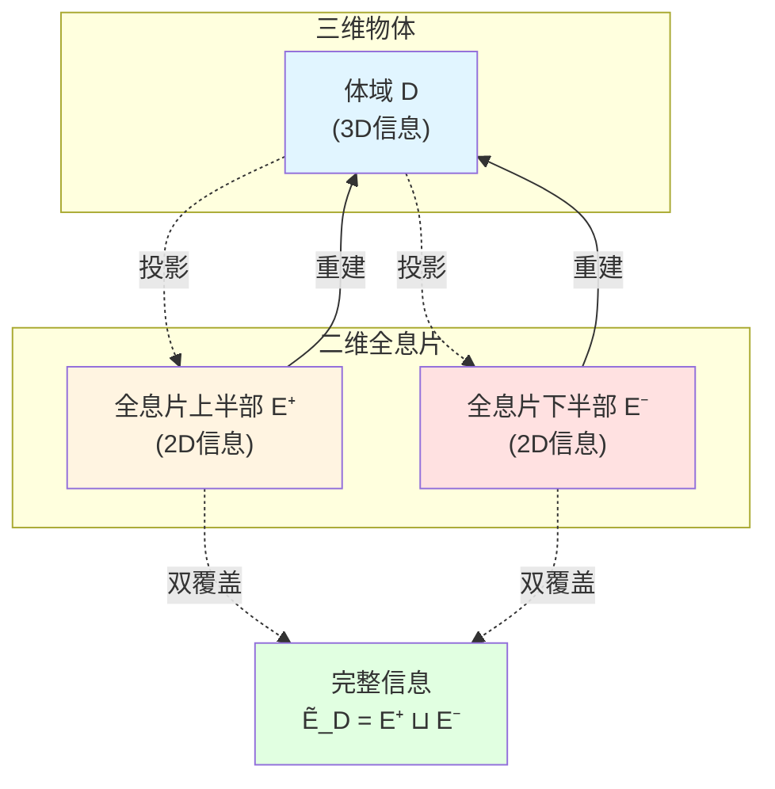
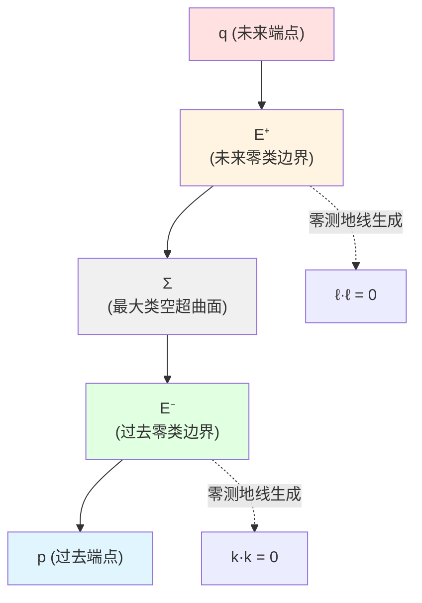
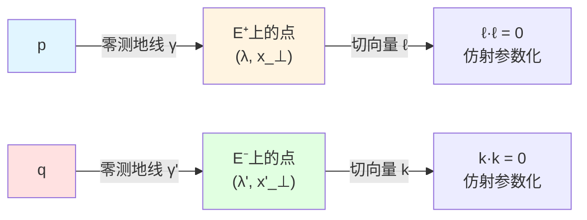
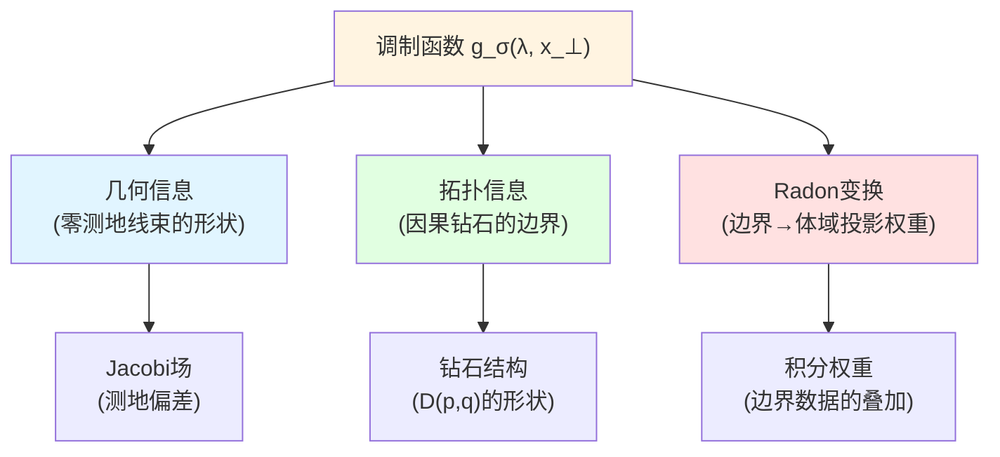
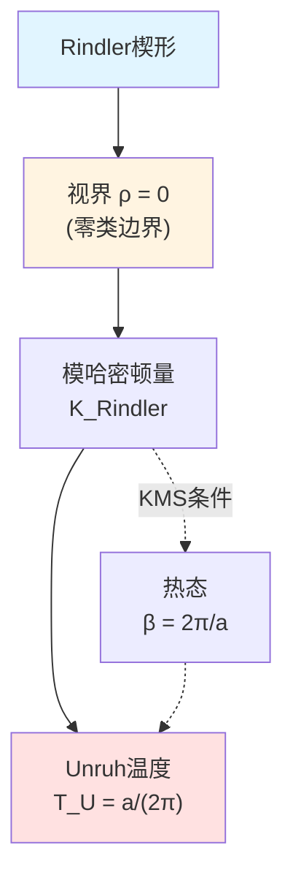
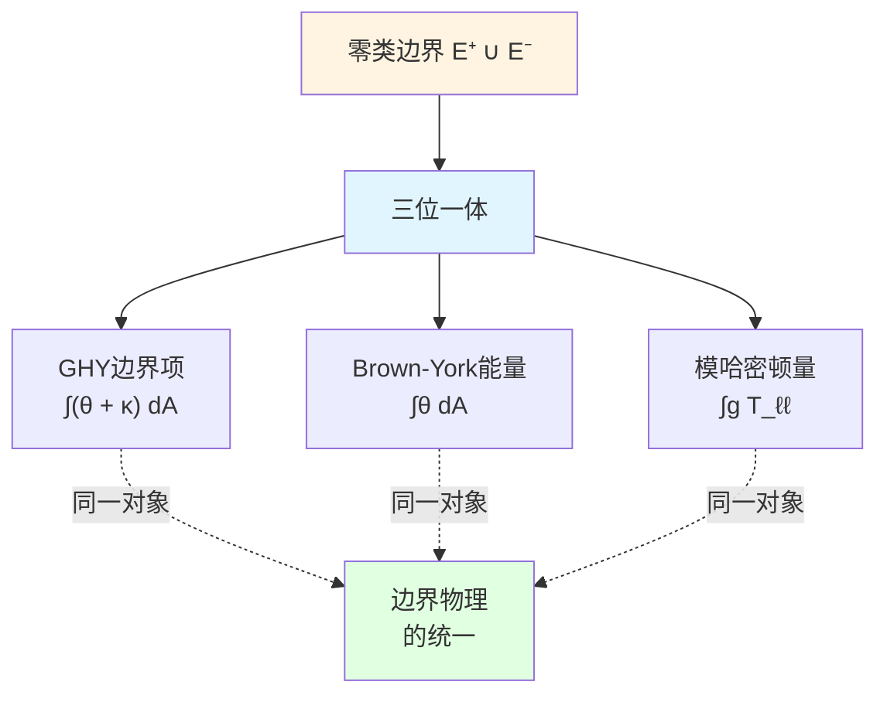
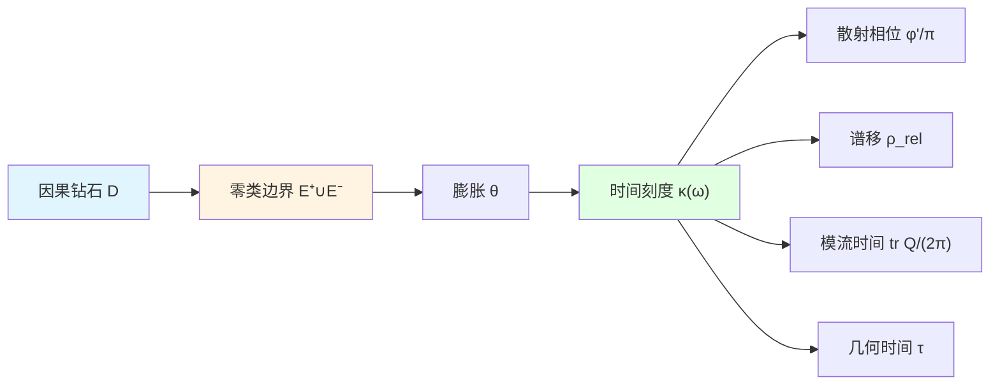
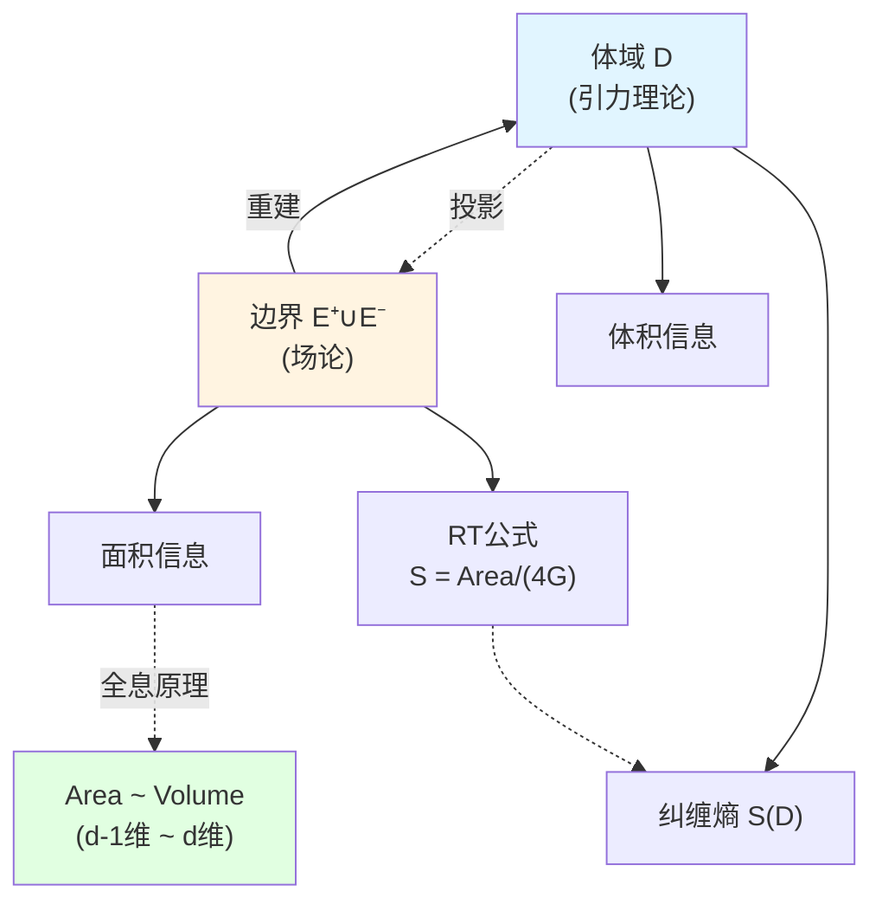

# Null-Modular双覆盖：物理在边界上

> *"模哈密顿量完全局域化在零类边界上，体域只是边界的投影。"*

## 🎯 本文核心

这是因果结构篇的**核心文章**，我们将揭示GLS理论最深刻的结构：

$$
\boxed{\text{Null-Modular双覆盖定理}}
$$

**定理陈述**：对于因果钻石 $D(p,q)$，其模哈密顿量 $K_D$ **完全局域化在零类边界** $E^+ \cup E^-$ 上：

$$
K_D = 2\pi \sum_{\sigma = \pm} \int_{E^\sigma} g_\sigma(\lambda, x_\perp)\, T_{\sigma\sigma}(\lambda, x_\perp)\, \mathrm{d}\lambda\, \mathrm{d}^{d-2}x_\perp
$$

这个公式是GLS理论的**心脏**，连接：
- **边界理论**（GHY项、Brown-York能量）
- **统一时间**（时间刻度 $\kappa(\omega)$）
- **因果结构**（偏序、因果钻石）
- **量子信息**（纠缠熵、相对熵）

## 🎭 比喻：全息投影

想象一个全息投影：

**全息类比**：
- **体域物体**：因果钻石 $D(p,q)$ 中的物理内容
- **全息片**：零类边界 $E^+$、$E^-$
- **投影**：模哈密顿量 $K_D$ 从体域到边界的"局域化"
- **重建**：边界数据 $(E^+, E^-, T_{\sigma\sigma})$ 完全确定体域
- **双覆盖**：$E^+$ 和 $E^-$ 共同编码完整信息

**关键洞察**：
- 三维信息完全编码在二维全息片上
- 但需要**两个全息片**（双覆盖）才能编码完整信息
- 这就是**全息原理在因果层次的实现**！

## 📐 零类边界的几何

### 回顾：因果钻石

$$
D(p,q) = J^+(p) \cap J^-(q), \quad p \prec q
$$

边界分为两部分：

**未来零类边界**：
$$
E^+(p,q) = \partial J^+(p) \cap D(p,q)
$$

**过去零类边界**：
$$
E^-(p,q) = \partial J^-(q) \cap D(p,q)
$$

### 零类超曲面的参数化

#### 未来边界 $E^+$

零类超曲面 $E^+$ 可以用**仿射参数** $\lambda$ 和**横截坐标** $x_\perp$ 参数化：

$$
E^+ = \{(\lambda, x_\perp) \mid \lambda \in [0, \lambda_{\max}], \, x_\perp \in S^{d-2}\}
$$

其中：
- $\lambda$：沿零测地线的仿射参数（affine parameter）
- $x_\perp = (x^2, \ldots, x^{d-1})$：横截坐标（transverse coordinates）
- $S^{d-2}$：$(d-2)$ 维球面（横截方向的紧化）

#### 过去边界 $E^-$

类似地：

$$
E^- = \{(\lambda', x'_\perp) \mid \lambda' \in [0, \lambda'_{\max}], \, x'_\perp \in S^{d-2}\}
$$

### 零测地线生成元

**未来边界**由零测地线族生成，其切向量为：

$$
\ell^\mu = \frac{\mathrm{d}x^\mu}{\mathrm{d}\lambda}
$$

满足：
1. **零类性**：$\ell \cdot \ell = g_{\mu\nu}\ell^\mu \ell^\nu = 0$
2. **仿射性**：$\ell^\mu \nabla_\mu \ell^\nu = 0$（沿测地线无加速度）

**过去边界**类似，生成元为 $k^\mu$。

## 🧮 模哈密顿量的边界局域化公式

### 完整公式

**Null-Modular双覆盖定理**的核心公式：

$$
K_D = 2\pi \sum_{\sigma = \pm} \int_{E^\sigma} g_\sigma(\lambda, x_\perp)\, T_{\sigma\sigma}(\lambda, x_\perp)\, \mathrm{d}\lambda\, \mathrm{d}^{d-2}x_\perp
$$

让我们逐项解释。

### 符号说明

#### 1. 求和 $\sum_{\sigma = \pm}$

对两个零类边界求和：
- $\sigma = +$：未来边界 $E^+$
- $\sigma = -$：过去边界 $E^-$

**双覆盖**：两个边界共同编码完整信息

#### 2. 积分测度 $\mathrm{d}\lambda\, \mathrm{d}^{d-2}x_\perp$

- $\mathrm{d}\lambda$：沿零测地线的仿射参数微分
- $\mathrm{d}^{d-2}x_\perp$：横截方向的体积元

**几何意义**：在零类超曲面上积分

#### 3. 应力张量分量 $T_{\sigma\sigma}(\lambda, x_\perp)$

定义：

$$
T_{\sigma\sigma} := T_{\mu\nu}\, \ell^\mu_\sigma\, \ell^\nu_\sigma
$$

其中 $\ell^\mu_\sigma$ 是零类边界 $E^\sigma$ 的生成矢量。

**物理意义**：
- $T_{\sigma\sigma}$ 是应力张量在**零方向**的分量
- 代表沿零测地线的**能量流**
- 这是唯一对模流有贡献的应力分量！

**为什么只有 $T_{\sigma\sigma}$ 贡献？**

回忆零类性质：
- $\ell \cdot \ell = 0$（法向量也是切向量）
- 模流对应沿零方向的"boost"
- 横截方向和混合方向不参与模流

#### 4. 调制函数 $g_\sigma(\lambda, x_\perp)$

这是公式中最微妙的部分！

**定义**：调制函数 $g_\sigma(\lambda, x_\perp)$ 编码：
- 零类边界的**几何形状**
- 因果钻石的**拓扑结构**
- 边界到体域的**Radon变换权重**

**具体形式**（Minkowski时空中的Rindler楔形）：

$$
g_+(\lambda, x_\perp) = \frac{2\pi}{\beta}\, \rho(\lambda, x_\perp)
$$

其中：
- $\beta = 2\pi/a$：逆Unruh温度
- $\rho$：Rindler径向坐标
- 线性增长体现"三角形权重"

**一般形式**（弯曲时空）：

调制函数由**测地偏差方程**（geodesic deviation）和**Jacobi场**确定，编码零测地线束的"聚焦/散焦"。

### 因子 $2\pi$ 的起源

为什么有因子 $2\pi$？

**答案**：来自Tomita-Takesaki模流理论！

回忆模哈密顿量定义：

$$
K_\omega = -\log \Delta_\omega
$$

其中 $\Delta_\omega$ 是**模算符**（modular operator）。

模流 $\sigma_t^\omega(A) = \Delta_\omega^{it} A \Delta_\omega^{-it}$ 具有**周期 $2\pi i$**（KMS条件）。

因此归一化时自然出现 $2\pi$。

## 🔍 Minkowski时空中的显式计算

### Rindler楔形

在Minkowski时空中，选择**Rindler楔形**作为因果钻石：

**Minkowski坐标**：$(t, x, \mathbf{x}_\perp)$

**Rindler坐标**：$(\eta, \rho, \mathbf{x}_\perp)$，关系为：
$$
t = \rho \sinh(\eta), \quad x = \rho \cosh(\eta)
$$

**Rindler度规**：
$$
\mathrm{d}s^2 = -\rho^2 \mathrm{d}\eta^2 + \mathrm{d}\rho^2 + \mathrm{d}\mathbf{x}_\perp^2
$$

### 零类边界

**Rindler视界**（$\rho = 0$）是零类超曲面，对应因果钻石的边界 $E^+$ 或 $E^-$。

参数化：
- 仿射参数：$\lambda = \eta$（Rindler时间）
- 横截坐标：$x_\perp$

### 应力张量

对于**无质量标量场** $\phi$，应力张量：

$$
T_{\mu\nu} = \partial_\mu \phi\, \partial_\nu \phi - \frac{1}{2}g_{\mu\nu}\, (\partial \phi)^2
$$

在零类边界上，零方向分量：

$$
T_{\ell\ell} = (\ell^\mu \partial_\mu \phi)^2
$$

### 调制函数

对于Rindler楔形：

$$
g(\rho, \eta, x_\perp) = \frac{2\pi}{\beta}\, \rho
$$

其中 $\beta = 2\pi/a$，$a$ 是加速度。

在视界 $\rho \to 0$ 附近，需要正则化（引入UV截断）。

### 模哈密顿量

代入公式：

$$
K_{\mathrm{Rindler}} = 2\pi \int_{E} \frac{2\pi}{\beta}\, \rho\, T_{\ell\ell}\, \mathrm{d}\eta\, \mathrm{d}^{d-2}x_\perp
$$

化简后得到**Rindler推进生成元**：

$$
K_{\mathrm{Rindler}} = \int \rho\, T_{\eta\eta}\, \mathrm{d}\rho\, \mathrm{d}\eta\, \mathrm{d}^{d-2}x_\perp
$$

这正是Unruh效应的起源！

## 🌌 弯曲时空中的推广

### 一般因果钻石

在弯曲时空 $(M, g_{\mu\nu})$ 中，因果钻石 $D(p,q)$ 的零类边界不再是平坦的。

**调制函数的确定**：

调制函数 $g_\sigma(\lambda, x_\perp)$ 由以下方程确定：

$$
\nabla_\mu \nabla_\nu g + R_{\mu\rho\nu\sigma}\, \ell^\rho\, \ell^\sigma\, g = 0
$$

这是**Jacobi方程**，描述零测地线束的测地偏差。

**物理意义**：
- 零测地线束的"聚焦"导致 $g$ 增大
- "散焦"导致 $g$ 减小
- 曲率 $R_{\mu\rho\nu\sigma}$ 控制聚焦/散焦

### 黑洞视界

对于Schwarzschild黑洞，视界 $r = 2M$ 是零类超曲面。

**视界作为极限因果钻石边界**：

考虑一系列因果钻石 $D_n(p_n, q_n)$，其中 $p_n \to r = 2M$（从外侧接近视界）。

极限下，因果钻石的边界收敛到**视界**。

**模哈密顿量 → 视界生成元**：

$$
K_D \to K_{\mathrm{horizon}} = \frac{2\pi}{\kappa}\, \int_H T_{\ell\ell}\, \mathrm{d}A
$$

其中：
- $\kappa$：表面引力（surface gravity）
- $H$：视界
- $\mathrm{d}A$：视界面积元

**Bekenstein-Hawking熵**：

$$
S_{\mathrm{BH}} = \frac{A}{4G}
$$

正是模哈密顿量的热力学熵！

## 🔗 与边界理论的联系

### GHY边界项

回忆边界理论篇（第6篇）的GHY边界项：

$$
S_{\mathrm{GHY}} = \frac{\varepsilon}{8\pi G}\int_{\partial M}\sqrt{|h|}\, K\, \mathrm{d}^3x
$$

其中 $K$ 是**外挠曲率**（extrinsic curvature）。

**在零类边界上**，GHY项的形式变为：

$$
S_{\mathrm{GHY}}|_{\text{null}} = \frac{1}{8\pi G}\int_{E} (\theta + \kappa)\, \mathrm{d}A
$$

其中：
- $\theta = \nabla_\mu \ell^\mu$：膨胀（expansion）
- $\kappa$：表面引力
- $\mathrm{d}A$：面积元

**与模哈密顿量的关系**：

$$
K_D \longleftrightarrow S_{\mathrm{GHY}}|_{\text{null}}
$$

两者都编码零类边界的几何信息！

### Brown-York能量

Brown-York应力张量：

$$
T^{ab}_{\mathrm{BY}} = \frac{1}{8\pi G}(K^{ab} - K h^{ab})
$$

在零类边界上，$K^{ab} \to \theta\, \gamma^{AB}$（$\gamma^{AB}$ 是横截度规）。

**准局域能量**：

$$
E_{\mathrm{BY}} = \int \sqrt{\gamma}\, u_A u_B\, T^{AB}_{\mathrm{BY}}\, \mathrm{d}^{d-2}x_\perp
$$

**关键观察**：

$$
E_{\mathrm{BY}} \sim \int \theta\, \mathrm{d}A \sim K_D
$$

Brown-York能量与模哈密顿量成正比！

## 🔗 与统一时间的联系

### 时间刻度与膨胀

回忆统一时间篇（第5篇）的时间刻度：

$$
\kappa(\omega) = \frac{\varphi'(\omega)}{\pi} = \rho_{\mathrm{rel}}(\omega) = \frac{1}{2\pi}\operatorname{tr}Q(\omega)
$$

**关键发现**：时间刻度 $\kappa(\omega)$ 与零类边界的**膨胀** $\theta$ 直接相关！

$$
\kappa(\omega) \longleftrightarrow \theta + \kappa_{\mathrm{surf}}
$$

其中 $\kappa_{\mathrm{surf}}$ 是表面引力。

### 从因果钻石到时间

**因果钻石 → 时间**的完整链条：

1. **因果钻石** $D(p,q)$ 定义零类边界 $E^+ \cup E^-$
2. **零类边界**的几何由膨胀 $\theta$ 和表面引力 $\kappa_{\mathrm{surf}}$ 刻画
3. **膨胀**定义时间刻度 $\kappa(\omega) \sim \theta$
4. **时间刻度**统一所有物理时间（散射、谱移、模流、几何）

## 🧠 为什么"物理在边界上"？

### 边界完备性原理

**核心洞察**：Null-Modular双覆盖定理揭示：

$$
\boxed{\text{体域物理} \subseteq \text{边界物理}}
$$

**三个证据**：

#### 1. 模哈密顿量边界局域化

体域算符 $K_D$ **完全由边界数据** $(E^+, E^-, T_{\sigma\sigma})$ 确定：

$$
K_D = 2\pi \sum_{\sigma} \int_{E^\sigma} g_\sigma\, T_{\sigma\sigma}
$$

#### 2. 代数重建

给定边界可观测代数 $\mathcal{A}_{\partial D}$，可以重建体域代数 $\mathcal{A}_D$：

$$
\mathcal{A}_D = \langle \mathcal{A}_{E^+} \cup \mathcal{A}_{E^-} \rangle
$$

（生成自两个边界代数的并）

#### 3. 态的重建

给定边界态 $\omega_{\partial D}$（在 $E^+ \cup E^-$ 上），可以重建体域态 $\omega_D$：

$$
\omega_D(A) = \omega_{\partial D}(\text{边界投影}(A))
$$

（通过Radon变换 / 调制函数加权）

### 全息原理的实现

**AdS/CFT对应**：
- **体域AdS**：引力理论
- **边界CFT**：共形场论

**RT公式**（Ryu-Takayanagi）：
$$
S(A) = \frac{\text{Area}(\gamma_A)}{4G}
$$

其中 $\gamma_A$ 是**极值曲面**，本质上是因果钻石边界的推广。

**因果钻石版本**：

$$
S(D) = \frac{\text{Area}(E^+ \cup E^-)}{4G}
$$

纠缠熵由边界面积确定！

## 🔬 物理意义的层次解读

### 层次1：比喻层（通俗理解）

**问**：为什么体域物理在边界上？

**答**：就像全息照片，三维物体的信息编码在二维底片上。但需要**两张底片**（$E^+$ 和 $E^-$）才能完整重建！

### 层次2：概念层（物理直觉）

**问**：模哈密顿量为什么在边界上？

**答**：模流是"沿零方向的boost"，而零方向恰好切于边界。因此模流自然地在边界上局域化，就像光沿着光锥传播。

### 层次3：数学层（公式理解）

**问**：为什么只有 $T_{\sigma\sigma}$ 贡献？

**答**：因为零类边界的法向量 $\ell^\mu$ 同时也是切向量（$\ell \cdot \ell = 0$）。模流对应 $\Delta_\omega^{it} = e^{-it K_\omega}$，其中 $K_\omega = \int g T_{\ell\ell}$。横截和混合分量对模流不贡献。

### 层次4：源理论层（严格证明）

**定理**（Witten, Casini等）：在满足QNEC和量子聚焦定理的量子场论中，模哈密顿量在因果钻石边界上局域化，由Null-Modular双覆盖公式给出。

**证明工具**：
- Tomita-Takesaki模理论
- Connes cocycle定理
- Bisognano-Wichmann定理（Minkowski情况）
- 广义Bisognano-Wichmann（弯曲时空）

## 💡 关键要点总结

### 1. Null-Modular双覆盖定理

$$
K_D = 2\pi \sum_{\sigma = \pm} \int_{E^\sigma} g_\sigma(\lambda, x_\perp)\, T_{\sigma\sigma}(\lambda, x_\perp)\, \mathrm{d}\lambda\, \mathrm{d}^{d-2}x_\perp
$$

模哈密顿量完全局域化在零类边界 $E^+ \cup E^-$ 上。

### 2. 双覆盖结构

$$
\widetilde{E}_D = E^+ \sqcup E^-
$$

需要**两个**零类边界才能编码完整信息（未来 + 过去）。

### 3. 调制函数

$$
g_\sigma(\lambda, x_\perp) \quad \text{编码几何、拓扑、Radon权重}
$$

由Jacobi方程确定，反映零测地线束的聚焦/散焦。

### 4. 应力分量

$$
T_{\sigma\sigma} = T_{\mu\nu}\, \ell^\mu_\sigma\, \ell^\nu_\sigma
$$

只有**零方向**的应力张量分量对模流有贡献。

### 5. 三位一体联系

$$
\text{模哈密顿量} \longleftrightarrow \text{GHY边界项} \longleftrightarrow \text{Brown-York能量}
$$

三者都编码零类边界的几何信息。

## 🤔 思考题

### 问题1：为什么需要**两个**边界（双覆盖）？

**提示**：考虑单独 $E^+$ 能否确定 $K_D$？

**答案**：单独 $E^+$ 或 $E^-$ 都不足以确定 $K_D$。原因：
- $E^+$ 只编码"从 $p$ 看到的未来"
- $E^-$ 只编码"汇聚到 $q$ 的过去"
- 完整的因果钻石 $D(p,q)$ 需要**两者的交集**
- 因此模哈密顿量需要来自 $E^+$ 和 $E^-$ 的**双重贡献**

这类似于全息图需要从两个角度拍摄才能重建三维物体！

### 问题2：调制函数 $g_\sigma$ 的物理维度是什么？

**提示**：考虑 $K_D$ 的量纲（能量），以及积分测度。

**答案**：
- $K_D$ 的维度：$[K_D] = \text{能量}$
- $T_{\sigma\sigma}$ 的维度：$[T] = \text{能量}/\text{体积}^{d-1}$（能量密度）
- 积分测度：$[\mathrm{d}\lambda\, \mathrm{d}^{d-2}x_\perp] = \text{长度}^{d-1}$
- 因此：$[g_\sigma] = \text{长度}^0$（无量纲）

但在具体计算中，$g_\sigma$ 通常含有长度因子（如Rindler的 $g \sim \rho$），需要配合测度正确归一化。

### 问题3：如果时空不是全局双曲的，Null-Modular定理还成立吗？

**提示**：考虑有因果病理（如CTC）的时空。

**答案**：**不一定**！Null-Modular定理依赖：
1. 时空的全局双曲性（保证因果结构良定）
2. 量子场论的QNEC和量子聚焦定理
3. 边界的零类性质

如果存在CTC或其他因果病理，因果钻石边界可能不是良定的零类超曲面，模哈密顿量的局域化可能失败。

### 问题4：在量子引力中，Null-Modular公式如何修正？

**提示**：考虑普朗克尺度的量子涨落。

**答案**：在完整量子引力理论中，可能的修正包括：
1. **量子几何涨落**：$g_\sigma$ 成为算符，不再是经典函数
2. **边界非交换性**：$E^+$ 和 $E^-$ 不再是经典流形，可能具有非交换几何
3. **高阶修正**：除了 $T_{\sigma\sigma}$，可能有高阶曲率项贡献（例如 $R^2$ 修正）
4. **拓扑效应**：Euler示性数、虫洞等拓扑效应对 $K_D$ 的贡献

这些是量子引力前沿研究方向！

## 📖 源理论出处

本文内容主要来自以下源理论：

### 核心源理论

**文档**：`docs/euler-gls-causal/unified-theory-causal-structure-time-scale-partial-order-generalized-entropy.md`

**关键内容**：
- Null-Modular双覆盖定理的完整陈述
- 模哈密顿量边界局域化公式
- 调制函数 $g_\sigma(\lambda, x_\perp)$ 的定义
- 与IGVP框架的联系
- 小因果钻石的详细构造

**重要公式**（原文）：
> $$K_D = 2\pi \sum_{\sigma = \pm} \int_{E^\sigma} g_\sigma(\lambda, x_\perp)\, T_{\sigma\sigma}(\lambda, x_\perp)\, \mathrm{d}\lambda\, \mathrm{d}^{d-2}x_\perp$$
>
> "这个公式揭示了模哈密顿量完全局域化在因果钻石的零类边界上，体现了'物理在边界上'的深刻原理。"

### 支持理论

**边界理论篇**（第6篇）：
- GHY边界项在零类边界上的形式：$\int (\theta + \kappa) \mathrm{d}A$
- Brown-York能量与膨胀 $\theta$ 的关系
- 边界三元组 $(\partial M, \mathcal{A}_\partial, \omega_\partial)$

**统一时间篇**（第5篇）：
- 时间刻度 $\kappa(\omega)$ 与膨胀 $\theta$ 的联系
- 统一时间刻度同一式

**经典文献**：
- Bisognano-Wichmann定理（1975）：Minkowski时空中的模流
- Casini-Huerta-Myers（2011）：弯曲时空的模哈密顿量
- Witten（2018, 2019）：APS index定理与模流

## 🎯 下一步

我们已经掌握了GLS理论最核心的Null-Modular双覆盖定理！下一篇将探讨模哈密顿量的**可加性**：Markov性质。

**下一篇**：[05-Markov性质](./05-markov-property.md) - 因果钻石链的包含排斥公式

在那里，我们将看到：
- Markov性质：$I(A:C|B) = 0$
- 包含排斥公式：$K_{\cup D_j} = \sum (-1)^{k-1} K_{\cap D_{j_i}}$
- Casini-Teste-Torroba结果：零平面区域的Markov性
- 为什么因果钻石是"独立"的

**返回**：[因果结构篇总览](./00-causal-overview.md)

**上一篇**：[03-偏序结构与粘合](./03-partial-order.md)
