# Null-Modular Double Cover: Physics on Boundary

> *"Modular Hamiltonian completely localized on null boundaries; bulk is just projection of boundary."*

## 🎯 Core of This Article

This is the **core article** of Causal Structure chapter, we will reveal the most profound structure of GLS theory:

$$\boxed{\text{Null-Modular Double Cover Theorem}}$$

**Theorem Statement**: For causal diamond $D(p,q)$, its modular Hamiltonian $K_D$ is **completely localized on null boundaries** $E^+ \cup E^-$:

$$K_D = 2\pi \sum_{\sigma = \pm} \int_{E^\sigma} g_\sigma(\lambda, x_\perp)\, T_{\sigma\sigma}(\lambda, x_\perp)\, \mathrm{d}\lambda\, \mathrm{d}^{d-2}x_\perp$$

This formula is the **heart** of GLS theory, connecting:
- **Boundary Theory** (GHY term, Brown-York energy)
- **Unified Time** (time scale $\kappa(\omega)$)
- **Causal Structure** (partial order, causal diamonds)
- **Quantum Information** (entanglement entropy, relative entropy)

## 🎭 Analogy: Holographic Projection

Imagine a holographic projection:

```mermaid
graph TB
    subgraph "3D Object"
        BULK["Bulk D<br/>(3D Information)"]
    end

    subgraph "2D Holographic Plates"
        HOLO1["Upper Plate E⁺<br/>(2D Information)"]
        HOLO2["Lower Plate E⁻<br/>(2D Information)"]
    end

    BULK -.->|"Projection"| HOLO1
    BULK -.->|"Projection"| HOLO2

    HOLO1 -->|"Reconstruction"| BULK
    HOLO2 -->|"Reconstruction"| BULK

    HOLO1 -.->|"Double Cover"| COVER["Complete Information<br/>Ẽ_D = E⁺ ⊔ E⁻"]
    HOLO2 -.->|"Double Cover"| COVER

    style BULK fill:#e1f5ff
    style HOLO1 fill:#fff4e1
    style HOLO2 fill:#ffe1e1
    style COVER fill:#e1ffe1
```

**Holographic Analogy**:
- **Bulk Object**: Physical content in causal diamond $D(p,q)$
- **Holographic Plates**: Null boundaries $E^+$, $E^-$
- **Projection**: "Localization" of modular Hamiltonian $K_D$ from bulk to boundary
- **Reconstruction**: Boundary data $(E^+, E^-, T_{\sigma\sigma})$ completely determines bulk
- **Double Cover**: $E^+$ and $E^-$ together encode complete information

**Key Insight**:
- 3D information completely encoded on 2D holographic plates
- But need **two plates** (double cover) to encode complete information
- This is **realization of holographic principle at causal level**!

## 📐 Geometry of Null Boundaries

### Review: Causal Diamond

$$D(p,q) = J^+(p) \cap J^-(q), \quad p \prec q$$

Boundary divides into two parts:

**Future Null Boundary**:
$$E^+(p,q) = \partial J^+(p) \cap D(p,q)$$

**Past Null Boundary**:
$$E^-(p,q) = \partial J^-(q) \cap D(p,q)$$

```mermaid
graph TB
    Q["q (Future Endpoint)"] --> EPLUS["E⁺<br/>(Future Null Boundary)"]
    EPLUS --> SIGMA["Σ<br/>(Maximum Spacelike Hypersurface)"]
    SIGMA --> EMINUS["E⁻<br/>(Past Null Boundary)"]
    EMINUS --> P["p (Past Endpoint)"]

    EPLUS -.->|"Generated by Null Geodesics"| NULL1["ℓ·ℓ = 0"]
    EMINUS -.->|"Generated by Null Geodesics"| NULL2["k·k = 0"]

    style Q fill:#ffe1e1
    style P fill:#e1f5ff
    style EPLUS fill:#fff4e1
    style EMINUS fill:#e1ffe1
    style SIGMA fill:#f0f0f0
```

### Parameterization of Null Hypersurfaces

#### Future Boundary $E^+$

Null hypersurface $E^+$ can be parameterized by **affine parameter** $\lambda$ and **transverse coordinates** $x_\perp$:

$$E^+ = \{(\lambda, x_\perp) \mid \lambda \in [0, \lambda_{\max}], \, x_\perp \in S^{d-2}\}$$

where:
- $\lambda$: Affine parameter along null geodesic
- $x_\perp = (x^2, \ldots, x^{d-1})$: Transverse coordinates
- $S^{d-2}$: $(d-2)$-dimensional sphere (compactification of transverse direction)

#### Past Boundary $E^-$

Similarly:

$$E^- = \{(\lambda', x'_\perp) \mid \lambda' \in [0, \lambda'_{\max}], \, x'_\perp \in S^{d-2}\}$$

### Null Geodesic Generators

**Future Boundary** generated by family of null geodesics, tangent vector:

$$\ell^\mu = \frac{\mathrm{d}x^\mu}{\mathrm{d}\lambda}$$

Satisfying:
1. **Null Property**: $\ell \cdot \ell = g_{\mu\nu}\ell^\mu \ell^\nu = 0$
2. **Affine Property**: $\ell^\mu \nabla_\mu \ell^\nu = 0$ (no acceleration along geodesic)

**Past Boundary** similar, generator is $k^\mu$.

```mermaid
graph LR
    P["p"] -->|"Null Geodesic γ"| EPLUS["Point on E⁺<br/>(λ, x_⊥)"]
    EPLUS -->|"Tangent Vector ℓ"| TANGENT["ℓ·ℓ = 0<br/>Affine Parameterization"]

    Q["q"] -->|"Null Geodesic γ'"| EMINUS["Point on E⁻<br/>(λ', x'_⊥)"]
    EMINUS -->|"Tangent Vector k"| TANGENT2["k·k = 0<br/>Affine Parameterization"]

    style P fill:#e1f5ff
    style Q fill:#ffe1e1
    style EPLUS fill:#fff4e1
    style EMINUS fill:#e1ffe1
```

## 🧮 Boundary Localization Formula for Modular Hamiltonian

### Complete Formula

Core formula of **Null-Modular Double Cover Theorem**:

$$K_D = 2\pi \sum_{\sigma = \pm} \int_{E^\sigma} g_\sigma(\lambda, x_\perp)\, T_{\sigma\sigma}(\lambda, x_\perp)\, \mathrm{d}\lambda\, \mathrm{d}^{d-2}x_\perp$$

Let's explain term by term.

### Symbol Explanation

#### 1. Sum $\sum_{\sigma = \pm}$

Sum over two null boundaries:
- $\sigma = +$: Future boundary $E^+$
- $\sigma = -$: Past boundary $E^-$

**Double Cover**: Two boundaries together encode complete information

#### 2. Integration Measure $\mathrm{d}\lambda\, \mathrm{d}^{d-2}x_\perp$

- $\mathrm{d}\lambda$: Differential of affine parameter along null geodesic
- $\mathrm{d}^{d-2}x_\perp$: Volume element in transverse direction

**Geometric Meaning**: Integration on null hypersurface

#### 3. Stress Tensor Component $T_{\sigma\sigma}(\lambda, x_\perp)$

Definition:

$$T_{\sigma\sigma} := T_{\mu\nu}\, \ell^\mu_\sigma\, \ell^\nu_\sigma$$

where $\ell^\mu_\sigma$ is generating vector of null boundary $E^\sigma$.

**Physical Meaning**:
- $T_{\sigma\sigma}$ is component of stress tensor in **null direction**
- Represents **energy flux** along null geodesic
- This is only stress component contributing to modular flow!

**Why Only $T_{\sigma\sigma}$ Contributes?**

Recall null property:
- $\ell \cdot \ell = 0$ (normal vector is also tangent vector)
- Modular flow corresponds to "boost" along null direction
- Transverse and mixed directions don't participate in modular flow

#### 4. Modulation Function $g_\sigma(\lambda, x_\perp)$

This is most subtle part of formula!

**Definition**: Modulation function $g_\sigma(\lambda, x_\perp)$ encodes:
- **Geometric shape** of null boundary
- **Topological structure** of causal diamond
- **Radon transform weight** from boundary to bulk

**Specific Form** (Rindler wedge in Minkowski spacetime):

$$g_+(\lambda, x_\perp) = \frac{2\pi}{\beta}\, \rho(\lambda, x_\perp)$$

where:
- $\beta = 2\pi/a$: Inverse Unruh temperature
- $\rho$: Rindler radial coordinate
- Linear growth reflects "triangular weight"

**General Form** (curved spacetime):

Modulation function determined by **geodesic deviation equation** and **Jacobi fields**, encoding "focusing/defocusing" of null geodesic bundle.

### Origin of Factor $2\pi$

Why factor $2\pi$?

**Answer**: From Tomita-Takesaki modular flow theory!

Recall modular Hamiltonian definition:

$$K_\omega = -\log \Delta_\omega$$

where $\Delta_\omega$ is **modular operator**.

Modular flow $\sigma_t^\omega(A) = \Delta_\omega^{it} A \Delta_\omega^{-it}$ has **period $2\pi i$** (KMS condition).

Therefore $2\pi$ naturally appears in normalization.

## 🔍 Explicit Calculation in Minkowski Spacetime

### Rindler Wedge

In Minkowski spacetime, choose **Rindler wedge** as causal diamond:

**Minkowski Coordinates**: $(t, x, \mathbf{x}_\perp)$

**Rindler Coordinates**: $(\eta, \rho, \mathbf{x}_\perp)$, relation:
$$t = \rho \sinh(\eta), \quad x = \rho \cosh(\eta)$$

**Rindler Metric**:
$$\mathrm{d}s^2 = -\rho^2 \mathrm{d}\eta^2 + \mathrm{d}\rho^2 + \mathrm{d}\mathbf{x}_\perp^2$$

### Null Boundaries

**Rindler Horizon** ($\rho = 0$) is null hypersurface, corresponding to boundary $E^+$ or $E^-$ of causal diamond.

Parameterization:
- Affine parameter: $\lambda = \eta$ (Rindler time)
- Transverse coordinates: $x_\perp$

### Stress Tensor

For **massless scalar field** $\phi$, stress tensor:

$$T_{\mu\nu} = \partial_\mu \phi\, \partial_\nu \phi - \frac{1}{2}g_{\mu\nu}\, (\partial \phi)^2$$

On null boundary, null-direction component:

$$T_{\ell\ell} = (\ell^\mu \partial_\mu \phi)^2$$

### Modulation Function

For Rindler wedge:

$$g(\rho, \eta, x_\perp) = \frac{2\pi}{\beta}\, \rho$$

where $\beta = 2\pi/a$, $a$ is acceleration.

Near horizon $\rho \to 0$, need regularization (introduce UV cutoff).

### Modular Hamiltonian

Substitute into formula:

$$K_{\mathrm{Rindler}} = 2\pi \int_{E} \frac{2\pi}{\beta}\, \rho\, T_{\ell\ell}\, \mathrm{d}\eta\, \mathrm{d}^{d-2}x_\perp$$

After simplification, get **Rindler boost generator**:

$$K_{\mathrm{Rindler}} = \int \rho\, T_{\eta\eta}\, \mathrm{d}\rho\, \mathrm{d}\eta\, \mathrm{d}^{d-2}x_\perp$$

This is origin of Unruh effect!

```mermaid
graph TB
    RINDLER["Rindler Wedge"] --> HORIZON["Horizon ρ = 0<br/>(Null Boundary)"]
    HORIZON --> MODULAR["Modular Hamiltonian<br/>K_Rindler"]
    MODULAR --> UNRUH["Unruh Temperature<br/>T_U = a/(2π)"]

    MODULAR -.->|"KMS Condition"| THERMAL["Thermal State<br/>β = 2π/a"]
    THERMAL -.-> UNRUH

    style RINDLER fill:#e1f5ff
    style HORIZON fill:#fff4e1
    style UNRUH fill:#ffe1e1
```

## 🌌 Generalization to Curved Spacetime

### General Causal Diamond

In curved spacetime $(M, g_{\mu\nu})$, null boundaries of causal diamond $D(p,q)$ are no longer flat.

**Determination of Modulation Function**:

Modulation function $g_\sigma(\lambda, x_\perp)$ determined by following equation:

$$\nabla_\mu \nabla_\nu g + R_{\mu\rho\nu\sigma}\, \ell^\rho\, \ell^\sigma\, g = 0$$

This is **Jacobi equation**, describing geodesic deviation of null geodesic bundle.

**Physical Meaning**:
- "Focusing" of null geodesic bundle causes $g$ to increase
- "Defocusing" causes $g$ to decrease
- Curvature $R_{\mu\rho\nu\sigma}$ controls focusing/defocusing

### Black Hole Horizon

For Schwarzschild black hole, horizon $r = 2M$ is null hypersurface.

**Horizon as Limiting Causal Diamond Boundary**:

Consider series of causal diamonds $D_n(p_n, q_n)$, where $p_n \to r = 2M$ (approaching horizon from outside).

In limit, boundaries of causal diamonds converge to **horizon**.

**Modular Hamiltonian → Horizon Generator**:

$$K_D \to K_{\mathrm{horizon}} = \frac{2\pi}{\kappa}\, \int_H T_{\ell\ell}\, \mathrm{d}A$$

where:
- $\kappa$: Surface gravity
- $H$: Horizon
- $\mathrm{d}A$: Horizon area element

**Bekenstein-Hawking Entropy**:

$$S_{\mathrm{BH}} = \frac{A}{4G}$$

Exactly thermodynamic entropy of modular Hamiltonian!

## 🔗 Connection to Boundary Theory

### GHY Boundary Term

Recall GHY boundary term from Boundary Theory chapter (Chapter 6):

$$S_{\mathrm{GHY}} = \frac{\varepsilon}{8\pi G}\int_{\partial M}\sqrt{|h|}\, K\, \mathrm{d}^3x$$

where $K$ is **extrinsic curvature**.

**On Null Boundaries**, form of GHY term becomes:

$$S_{\mathrm{GHY}}|_{\text{null}} = \frac{1}{8\pi G}\int_{E} (\theta + \kappa)\, \mathrm{d}A$$

where:
- $\theta = \nabla_\mu \ell^\mu$: Expansion
- $\kappa$: Surface gravity
- $\mathrm{d}A$: Area element

**Connection to Modular Hamiltonian**:

$$K_D \longleftrightarrow S_{\mathrm{GHY}}|_{\text{null}}$$

Both encode geometric information of null boundaries!

### Brown-York Energy

Brown-York stress tensor:

$$T^{ab}_{\mathrm{BY}} = \frac{1}{8\pi G}(K^{ab} - K h^{ab})$$

On null boundaries, $K^{ab} \to \theta\, \gamma^{AB}$ ($\gamma^{AB}$ is transverse metric).

**Quasi-Local Energy**:

$$E_{\mathrm{BY}} = \int \sqrt{\gamma}\, u_A u_B\, T^{AB}_{\mathrm{BY}}\, \mathrm{d}^{d-2}x_\perp$$

**Key Observation**:

$$E_{\mathrm{BY}} \sim \int \theta\, \mathrm{d}A \sim K_D$$

Brown-York energy proportional to modular Hamiltonian!

```mermaid
graph TB
    NULL["Null Boundaries E⁺ ∪ E⁻"] --> THREE["Trinity"]

    THREE --> GHY["GHY Boundary Term<br/>∫(θ + κ) dA"]
    THREE --> BY["Brown-York Energy<br/>∫θ dA"]
    THREE --> MOD["Modular Hamiltonian<br/>∫g T_ℓℓ"]

    GHY -.->|"Same Object"| UNIFIED["Unification of<br/>Boundary Physics"]
    BY -.->|"Same Object"| UNIFIED
    MOD -.->|"Same Object"| UNIFIED

    style NULL fill:#fff4e1
    style THREE fill:#e1f5ff
    style UNIFIED fill:#e1ffe1
```

## 🔗 Connection to Unified Time

### Time Scale and Expansion

Recall time scale from Unified Time chapter (Chapter 5):

$$\kappa(\omega) = \frac{\varphi'(\omega)}{\pi} = \rho_{\mathrm{rel}}(\omega) = \frac{1}{2\pi}\operatorname{tr}Q(\omega)$$

**Key Discovery**: Time scale $\kappa(\omega)$ directly related to **expansion** $\theta$ of null boundaries!

$$\kappa(\omega) \longleftrightarrow \theta + \kappa_{\mathrm{surf}}$$

where $\kappa_{\mathrm{surf}}$ is surface gravity.

### From Causal Diamond to Time

**Complete Chain: Causal Diamond → Time**:

1. **Causal Diamond** $D(p,q)$ defines null boundaries $E^+ \cup E^-$
2. **Geometry** of null boundaries characterized by expansion $\theta$ and surface gravity $\kappa_{\mathrm{surf}}$
3. **Expansion** defines time scale $\kappa(\omega) \sim \theta$
4. **Time Scale** unifies all physical times (scattering, spectral shift, modular flow, geometry)

```mermaid
graph LR
    DIAMOND["Causal Diamond D"] --> NULL["Null Boundaries E⁺∪E⁻"]
    NULL --> EXPANSION["Expansion θ"]
    EXPANSION --> TIMESCALE["Time Scale κ(ω)"]

    TIMESCALE --> PHASE["Scattering Phase φ'/π"]
    TIMESCALE --> SPECTRAL["Spectral Shift ρ_rel"]
    TIMESCALE --> MODULAR["Modular Flow Time tr Q/(2π)"]
    TIMESCALE --> GEOMETRIC["Geometric Time τ"]

    style DIAMOND fill:#e1f5ff
    style NULL fill:#fff4e1
    style TIMESCALE fill:#e1ffe1
```

## 🧠 Why "Physics on Boundary"?

### Boundary Completeness Principle

**Core Insight**: Null-Modular Double Cover Theorem reveals:

$$\boxed{\text{Bulk Physics} \subseteq \text{Boundary Physics}}$$

**Three Evidences**:

#### 1. Boundary Localization of Modular Hamiltonian

Bulk operator $K_D$ **completely determined by boundary data** $(E^+, E^-, T_{\sigma\sigma})$:

$$K_D = 2\pi \sum_{\sigma} \int_{E^\sigma} g_\sigma\, T_{\sigma\sigma}$$

#### 2. Algebraic Reconstruction

Given boundary observable algebra $\mathcal{A}_{\partial D}$, can reconstruct bulk algebra $\mathcal{A}_D$:

$$\mathcal{A}_D = \langle \mathcal{A}_{E^+} \cup \mathcal{A}_{E^-} \rangle$$

(generated by union of two boundary algebras)

#### 3. State Reconstruction

Given boundary state $\omega_{\partial D}$ (on $E^+ \cup E^-$), can reconstruct bulk state $\omega_D$:

$$\omega_D(A) = \omega_{\partial D}(\text{boundary projection}(A))$$

(through Radon transform / modulation function weighting)

### Realization of Holographic Principle

**AdS/CFT Correspondence**:
- **Bulk AdS**: Gravitational theory
- **Boundary CFT**: Conformal field theory

**RT Formula** (Ryu-Takayanagi):
$$S(A) = \frac{\text{Area}(\gamma_A)}{4G}$$

where $\gamma_A$ is **extremal surface**, essentially generalization of causal diamond boundary.

**Causal Diamond Version**:

$$S(D) = \frac{\text{Area}(E^+ \cup E^-)}{4G}$$

Entanglement entropy determined by boundary area!

```mermaid
graph TB
    BULK["Bulk D<br/>(Gravitational Theory)"] -.->|"Projection"| BOUNDARY["Boundary E⁺∪E⁻<br/>(Field Theory)"]
    BOUNDARY -->|"Reconstruction"| BULK

    BULK --> VOLUME["Volume Information"]
    BOUNDARY --> AREA["Area Information"]

    AREA -.->|"Holographic Principle"| HOLO["Area ~ Volume<br/>(d-1 dim ~ d dim)"]

    BULK --> ENTROPY["Entanglement Entropy S(D)"]
    BOUNDARY --> RT["RT Formula<br/>S = Area/(4G)"]
    RT -.-> ENTROPY

    style BULK fill:#e1f5ff
    style BOUNDARY fill:#fff4e1
    style HOLO fill:#e1ffe1
```

## 🔬 Hierarchical Interpretation of Physical Meaning

### Level 1: Analogy Layer (Popular Understanding)

**Q**: Why is bulk physics on boundary?

**A**: Like holographic photo, information of 3D object encoded on 2D plate. But need **two plates** ($E^+$ and $E^-$) to completely reconstruct!

### Level 2: Concept Layer (Physical Intuition)

**Q**: Why is modular Hamiltonian on boundary?

**A**: Modular flow is "boost along null direction", and null direction exactly tangent to boundary. Therefore modular flow naturally localized on boundary, like light propagating along light cone.

### Level 3: Mathematical Layer (Formula Understanding)

**Q**: Why only $T_{\sigma\sigma}$ contributes?

**A**: Because normal vector $\ell^\mu$ of null boundary is also tangent vector ($\ell \cdot \ell = 0$). Modular flow corresponds to $\Delta_\omega^{it} = e^{-it K_\omega}$, where $K_\omega = \int g T_{\ell\ell}$. Transverse and mixed components don't contribute to modular flow.

### Level 4: Source Theory Layer (Rigorous Proof)

**Theorem** (Witten, Casini, etc.): In quantum field theories satisfying QNEC and quantum focusing theorem, modular Hamiltonian localized on causal diamond boundary, given by Null-Modular double cover formula.

**Proof Tools**:
- Tomita-Takesaki modular theory
- Connes cocycle theorem
- Bisognano-Wichmann theorem (Minkowski case)
- Generalized Bisognano-Wichmann (curved spacetime)

## 💡 Key Points Summary

### 1. Null-Modular Double Cover Theorem

$$K_D = 2\pi \sum_{\sigma = \pm} \int_{E^\sigma} g_\sigma(\lambda, x_\perp)\, T_{\sigma\sigma}(\lambda, x_\perp)\, \mathrm{d}\lambda\, \mathrm{d}^{d-2}x_\perp$$

Modular Hamiltonian completely localized on null boundaries $E^+ \cup E^-$.

### 2. Double Cover Structure

$$\widetilde{E}_D = E^+ \sqcup E^-$$

Need **two** null boundaries to encode complete information (future + past).

### 3. Modulation Function

$$g_\sigma(\lambda, x_\perp) \quad \text{encodes geometry, topology, Radon weight}$$

Determined by Jacobi equation, reflecting focusing/defocusing of null geodesic bundle.

### 4. Stress Component

$$T_{\sigma\sigma} = T_{\mu\nu}\, \ell^\mu_\sigma\, \ell^\nu_\sigma$$

Only stress tensor component in **null direction** contributes to modular flow.

### 5. Trinitarian Connection

$$\text{Modular Hamiltonian} \longleftrightarrow \text{GHY Boundary Term} \longleftrightarrow \text{Brown-York Energy}$$

All three encode geometric information of null boundaries.

## 🤔 Thought Questions

### Question 1: Why Need **Two** Boundaries (Double Cover)?

**Hint**: Consider whether $E^+$ alone can determine $K_D$?

**Answer**: Neither $E^+$ nor $E^-$ alone sufficient to determine $K_D$. Reasons:
- $E^+$ only encodes "future seen from $p$"
- $E^-$ only encodes "past converging to $q$"
- Complete causal diamond $D(p,q)$ needs **intersection of both**
- Therefore modular Hamiltonian needs **double contribution** from $E^+$ and $E^-$

This is like hologram needing two angles to reconstruct 3D object!

### Question 2: What Is Physical Dimension of Modulation Function $g_\sigma$?

**Hint**: Consider dimension of $K_D$ (energy), and integration measure.

**Answer**:
- Dimension of $K_D$: $[K_D] = \text{energy}$
- Dimension of $T_{\sigma\sigma}$: $[T] = \text{energy}/\text{volume}^{d-1}$ (energy density)
- Integration measure: $[\mathrm{d}\lambda\, \mathrm{d}^{d-2}x_\perp] = \text{length}^{d-1}$
- Therefore: $[g_\sigma] = \text{length}^0$ (dimensionless)

But in specific calculations, $g_\sigma$ usually contains length factor (e.g., Rindler's $g \sim \rho$), need correct normalization with measure.

### Question 3: If Spacetime Not Globally Hyperbolic, Does Null-Modular Theorem Still Hold?

**Hint**: Consider spacetimes with causal pathologies (e.g., CTC).

**Answer**: **Not necessarily**! Null-Modular theorem depends on:
1. Global hyperbolicity of spacetime (ensuring well-defined causal structure)
2. QNEC and quantum focusing theorem of quantum field theory
3. Null property of boundaries

If CTCs or other causal pathologies exist, causal diamond boundaries may not be well-defined null hypersurfaces, localization of modular Hamiltonian may fail.

### Question 4: How Is Null-Modular Formula Modified in Quantum Gravity?

**Hint**: Consider quantum fluctuations at Planck scale.

**Answer**: In complete quantum gravity theory, possible modifications include:
1. **Quantum Geometric Fluctuations**: $g_\sigma$ becomes operator, no longer classical function
2. **Boundary Non-Commutativity**: $E^+$ and $E^-$ no longer classical manifolds, may have non-commutative geometry
3. **Higher-Order Corrections**: Besides $T_{\sigma\sigma}$, may have higher-order curvature contributions (e.g., $R^2$ corrections)
4. **Topological Effects**: Contributions to $K_D$ from Euler characteristic, wormholes, etc.

These are frontier research directions in quantum gravity!

## 📖 Source Theory References

Content of this article mainly from following source theories:

### Core Source Theory

**Document**: `docs/euler-gls-causal/unified-theory-causal-structure-time-scale-partial-order-generalized-entropy.md`

**Key Content**:
- Complete statement of Null-Modular Double Cover Theorem
- Boundary localization formula of modular Hamiltonian
- Definition of modulation function $g_\sigma(\lambda, x_\perp)$
- Connection to IGVP framework
- Detailed construction of small causal diamonds

**Important Formula** (original text):
> $$K_D = 2\pi \sum_{\sigma = \pm} \int_{E^\sigma} g_\sigma(\lambda, x_\perp)\, T_{\sigma\sigma}(\lambda, x_\perp)\, \mathrm{d}\lambda\, \mathrm{d}^{d-2}x_\perp$$
>
> "This formula reveals modular Hamiltonian completely localized on null boundaries of causal diamond, embodying profound principle that 'physics is on boundary'."

### Supporting Theories

**Boundary Theory Chapter** (Chapter 6):
- Form of GHY boundary term on null boundaries: $\int (\theta + \kappa) \mathrm{d}A$
- Relationship between Brown-York energy and expansion $\theta$
- Boundary triple $(\partial M, \mathcal{A}_\partial, \omega_\partial)$

**Unified Time Chapter** (Chapter 5):
- Connection between time scale $\kappa(\omega)$ and expansion $\theta$
- Unified time scale identity

**Classical Literature**:
- Bisognano-Wichmann theorem (1975): Modular flow in Minkowski spacetime
- Casini-Huerta-Myers (2011): Modular Hamiltonian in curved spacetime
- Witten (2018, 2019): APS index theorem and modular flow

## 🎯 Next Steps

We've mastered the most core Null-Modular Double Cover Theorem of GLS theory! Next article will explore **additivity** of modular Hamiltonian: Markov property.

**Next Article**: [05-markov-property_en.md](05-markov-property_en.md) - Inclusion-Exclusion Formula for Causal Diamond Chains

There, we will see:
- Markov property: $I(A:C|B) = 0$
- Inclusion-exclusion formula: $K_{\cup D_j} = \sum (-1)^{k-1} K_{\cap D_{j_i}}$
- Casini-Teste-Torroba result: Markov property of null plane regions
- Why causal diamonds are "independent"

**Back**: [Causal Structure Chapter Overview](00-causal-overview_en.md)

**Previous**: [03-partial-order_en.md](03-partial-order_en.md)

