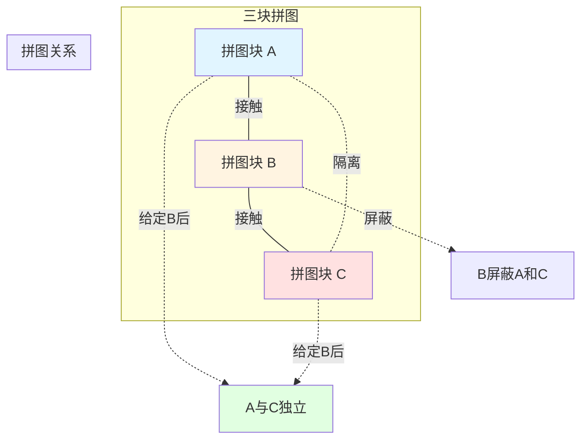
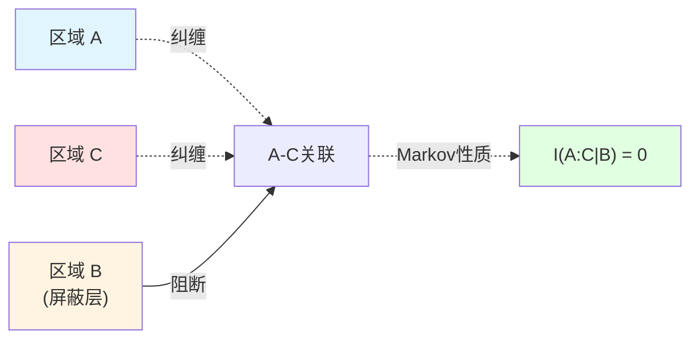
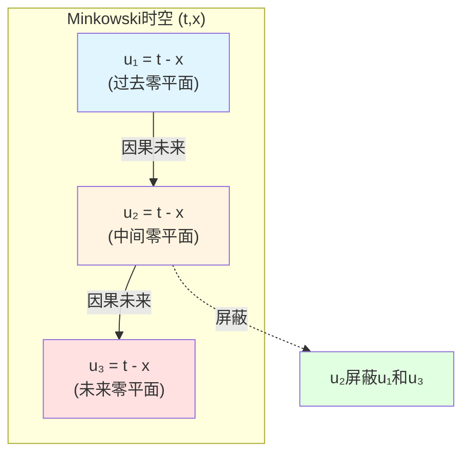
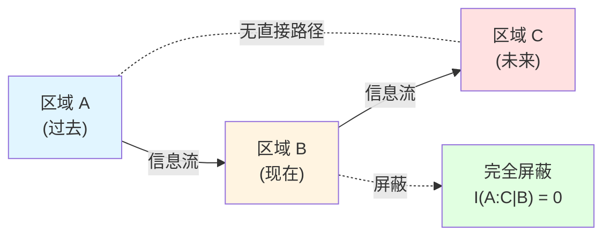
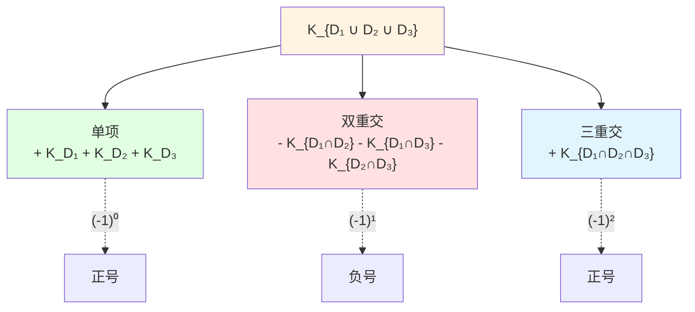
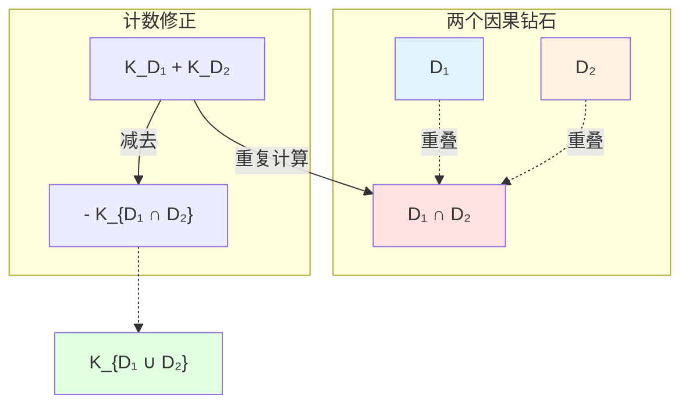
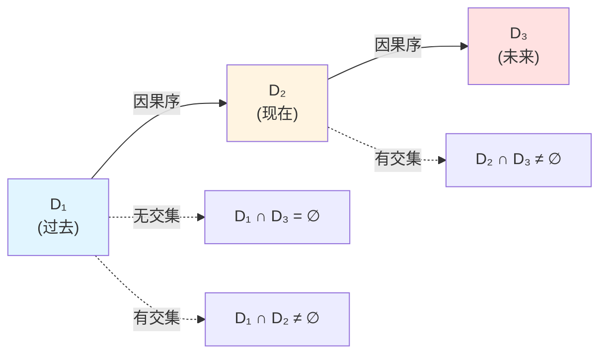
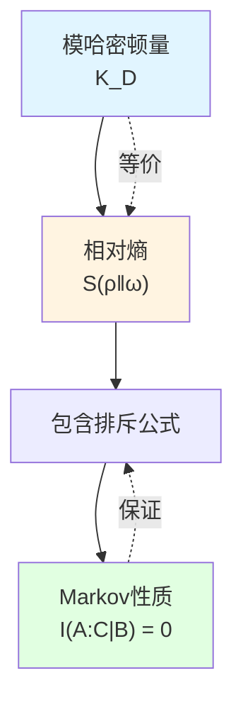

# Markov性质：因果钻石的独立性

> *"因果钻石链满足Markov性质，模哈密顿量服从包含排斥公式。"*

## 🎯 本文核心

在前一篇中，我们学到模哈密顿量在零类边界上局域化。现在的关键问题是：

**多个因果钻石如何组合？它们的模哈密顿量如何相加？**

答案：通过**Markov性质**！

$$
\boxed{I(A:C|B) = 0}
$$

这个看似简单的公式，揭示了因果结构的深刻性质：

**定理**（包含排斥公式）：对于因果钻石族 $\{D_j\}$，模哈密顿量满足：

$$
K_{\bigcup_j D_j} = \sum_{k \geq 1} (-1)^{k-1} \sum_{j_1 < \cdots < j_k} K_{D_{j_1} \cap \cdots \cap D_{j_k}}
$$

这是**量子信息与因果几何的完美结合**！

## 🧊 比喻：拼图的独立性

想象你在拼一个巨大的拼图：

**拼图类比**：
- **拼图块A**：因果钻石 $D_A$
- **拼图块B**：因果钻石 $D_B$（在A和C之间）
- **拼图块C**：因果钻石 $D_C$
- **接触**：因果钻石有重叠区域
- **独立性**：给定B后，A和C的信息独立

**关键洞察**：
- 如果B在A和C之间，且B"屏蔽"了A到C的所有路径
- 则给定B的信息后，A和C**条件独立**
- 这就是**Markov性质**的直观意义！

## 📐 条件互信息与Markov性质

### 互信息回顾

对于量子态 $\rho_{ABC}$（定义在区域 $A \cup B \cup C$ 上），定义**互信息**：

$$
I(A:C) := S(A) + S(C) - S(AC)
$$

其中 $S(A) = -\operatorname{tr}(\rho_A \log \rho_A)$ 是von Neumann熵。

**物理意义**：$I(A:C)$ 度量 $A$ 和 $C$ 之间的**量子关联**（纠缠 + 经典关联）。

### 条件互信息

**条件互信息**定义为：

$$
I(A:C|B) := S(AB) + S(BC) - S(B) - S(ABC)
$$

**物理意义**：给定 $B$ 的信息后，$A$ 和 $C$ 之间的**剩余关联**。

### Markov性质

如果：

$$
I(A:C|B) = 0
$$

则称 $A$ 和 $C$ 在给定 $B$ 后**条件独立**，或者说 $(A, B, C)$ 满足**Markov性质**。

### 强次可加性（SSA）

Markov性质等价于熵的**强次可加性**（Strong Subadditivity, SSA）：

$$
S(ABC) + S(B) \leq S(AB) + S(BC)
$$

**SSA是量子信息论的基石**，由Lieb-Ruskai于1973年证明。

重新整理SSA即得Markov性质：

$$
I(A:C|B) = S(AB) + S(BC) - S(B) - S(ABC) \geq 0
$$

等号成立当且仅当Markov性质成立。

## 🔗 因果钻石的Markov性质

### 零平面区域

考虑**零平面**（null plane）区域：

在Minkowski时空中，零平面由方程定义：

$$
\mathcal{N}^+ = \{x \mid u := t - x = \text{const}\}
$$

这是一个**零类超曲面**（$u = $ 常数定义光前锥）。

### Casini-Teste-Torroba定理

**定理**（Casini-Teste-Torroba, 2017）：对于量子场论中的**零平面区域族**，Markov性质成立。

具体地，设：
- $A$：零平面 $\mathcal{N}_1$ 后方的区域
- $B$：零平面 $\mathcal{N}_1$ 与 $\mathcal{N}_2$ 之间的区域
- $C$：零平面 $\mathcal{N}_2$ 前方的区域

其中 $\mathcal{N}_1 \prec \mathcal{N}_2$（因果序）。

**则**：

$$
I(A:C|B) = 0
$$

**证明思路**：
1. 利用Null-Modular双覆盖（上篇）
2. 模哈密顿量完全局域化在零平面边界上
3. 零平面之间无直接"连接"（除了通过中间区域）
4. 因此条件互信息为零

### 物理意义

**Markov性质的物理含义**：
- **因果屏蔽**：中间零平面 $B$ 完全屏蔽了 $A$ 和 $C$ 之间的因果联系
- **信息流动**：信息只能通过 $B$ 从 $A$ 流向 $C$，没有"捷径"
- **独立性**：给定 $B$ 的完整信息后，$A$ 和 $C$ 不再有额外关联

## 🧮 包含排斥公式

### 模哈密顿量的可加性

对于两个**不相交**的区域 $A$ 和 $B$（$A \cap B = \emptyset$）：

$$
K_{A \cup B} = K_A + K_B
$$

这是模哈密顿量的**可加性**（additivity）。

但如果 $A$ 和 $B$ **有重叠**呢？

### 包含排斥原理

**定理**（Inclusion-Exclusion）：对于任意有限族因果钻石 $\{D_1, D_2, \ldots, D_n\}$：

$$
K_{\bigcup_{j=1}^n D_j} = \sum_{k=1}^n (-1)^{k-1} \sum_{1 \leq j_1 < \cdots < j_k \leq n} K_{D_{j_1} \cap \cdots \cap D_{j_k}}
$$

**展开形式**（$n=3$ 的情况）：

$$
K_{D_1 \cup D_2 \cup D_3} = K_{D_1} + K_{D_2} + K_{D_3} - K_{D_1 \cap D_2} - K_{D_1 \cap D_3} - K_{D_2 \cap D_3} + K_{D_1 \cap D_2 \cap D_3}
$$

### 证明思路

**关键工具**：Markov性质 + 模流的代数性质

**步骤**：
1. 利用模哈密顿量与相对熵的关系：
   $$
   K_D \sim S_{\mathrm{rel}}(\\rho_D \| \omega_D)
   $$
2. 相对熵满足包含排斥公式（信息论基本定理）
3. Markov性质保证交叉项正确抵消
4. 归纳法推广到任意 $n$

### 几何直观

包含排斥公式的几何意义：

**问题**：如何计算 $K_{D_1 \cup D_2}$？

**朴素想法**：$K_{D_1} + K_{D_2}$

**问题**：重叠区域 $D_1 \cap D_2$ 被计算了**两次**！

**修正**：$K_{D_1} + K_{D_2} - K_{D_1 \cap D_2}$

这正是包含排斥公式的 $n=2$ 情况：

$$
K_{D_1 \cup D_2} = K_{D_1} + K_{D_2} - K_{D_1 \cap D_2}
$$

## 📊 例子：因果钻石链

### 场景：三个串联因果钻石

设有三个因果钻石按时间顺序排列：

$$
D_1 \prec D_2 \prec D_3
$$

其中 $D_i \prec D_j$ 表示 $D_i$ 在 $D_j$ 的因果过去。

### 模哈密顿量计算

#### 并集

$$
K_{D_1 \cup D_2 \cup D_3} = ?
$$

#### 应用包含排斥公式

$$
\begin{aligned}
K_{D_1 \cup D_2 \cup D_3} &= K_{D_1} + K_{D_2} + K_{D_3} \\
&\quad - K_{D_1 \cap D_2} - K_{D_2 \cap D_3} - K_{D_1 \cap D_3} \\
&\quad + K_{D_1 \cap D_2 \cap D_3}
\end{aligned}
$$

#### 简化

由于 $D_1 \cap D_3 = \emptyset$（因果序保证无交集）：

$$
K_{D_1 \cap D_3} = 0, \quad K_{D_1 \cap D_2 \cap D_3} = 0
$$

因此：

$$
K_{D_1 \cup D_2 \cup D_3} = K_{D_1} + K_{D_2} + K_{D_3} - K_{D_1 \cap D_2} - K_{D_2 \cap D_3}
$$

### Markov验证

**Markov性质**要求：

$$
I(D_1 : D_3 | D_2) = 0
$$

即：给定 $D_2$ 后，$D_1$ 和 $D_3$ 条件独立。

**验证**：
1. $D_2$ 在 $D_1$ 和 $D_3$ 之间
2. $D_2$ 的零类边界屏蔽了 $D_1$ 到 $D_3$ 的所有因果路径
3. 因此 Markov性质成立

**结论**：包含排斥公式与Markov性质**完全一致**！

## 🔬 相对熵与模哈密顿量

### 相对熵定义

对于区域 $D$ 和态 $\rho_D$（相对于参考态 $\omega_D$），定义**相对熵**：

$$
S(\rho_D \| \omega_D) := \operatorname{tr}(\rho_D \log \rho_D) - \operatorname{tr}(\rho_D \log \omega_D)
$$

### 与模哈密顿量的关系

对于**真空态** $\omega_D = |0\rangle\langle 0|$：

$$
S(\rho_D \| \omega_D) = \langle K_D \rangle_\rho - S(\rho_D)
$$

其中：
- $\langle K_D \rangle_\rho = \operatorname{tr}(\rho_D K_D)$：模哈密顿量的期望值
- $S(\rho_D) = -\operatorname{tr}(\rho_D \log \rho_D)$：von Neumann熵

**物理意义**：
- 相对熵度量 $\rho_D$ 与 $\omega_D$ 的"区别度"
- 模哈密顿量是相对熵的生成元

### 包含排斥的信息论起源

**定理**（信息论）：相对熵满足：

$$
S(\rho_{A \cup B} \| \omega_{A \cup B}) = S(\rho_A \| \omega_A) + S(\rho_B \| \omega_B) - S(\rho_{A \cap B} \| \omega_{A \cap B}) + \Delta
$$

其中 $\Delta \geq 0$ 是**条件互信息项**，在Markov性质成立时 $\Delta = 0$。

**因果钻石情况**：由于Markov性质，$\Delta = 0$，因此：

$$
S(\rho_D \| \omega_D) \quad \text{满足包含排斥公式}
$$

由 $K_D \sim S(\rho_D \| \omega_D)$，模哈密顿量也满足包含排斥！

## 🌐 推广：一般区域

### 超越因果钻石

包含排斥公式不仅对因果钻石成立，对**任意满足Markov性质的区域族**都成立。

**一般定理**：对于量子场论中的区域族 $\{A_j\}$，如果满足：
- **局域性**（locality）：类空分离区域可交换
- **Markov性质**：适当的条件独立性

则模哈密顿量满足包含排斥公式。

### 球面区域

**例**：在CFT（共形场论）中，考虑球面区域 $B_r$（半径 $r$ 的球）。

对于两个同心球 $B_{r_1}$ 和 $B_{r_2}$（$r_1 < r_2$）：

$$
K_{B_{r_2}} \neq K_{B_{r_1}} + K_{B_{r_2} \setminus B_{r_1}}
$$

**原因**：球面区域**不满足Markov性质**！

球面区域的模哈密顿量需要**额外的几何项**，不能简单地分解为边界贡献。

### 零平面 vs 球面

**对比**：

| 性质 | 零平面区域 | 球面区域 |
|------|-----------|---------|
| Markov性质 | ✓ 成立 | ✗ 不成立 |
| 包含排斥公式 | ✓ 精确成立 | ✗ 有修正项 |
| 模哈密顿量局域化 | ✓ 完全在边界 | ✗ 部分在体域 |
| 物理原因 | 因果结构自然 | 人为几何切割 |

**结论**：**零平面区域是因果结构的自然选择**，球面区域是人为的！

## 💡 关键要点总结

### 1. Markov性质

$$
I(A:C|B) = 0
$$

给定中间区域 $B$ 后，$A$ 和 $C$ 条件独立。

### 2. 因果屏蔽

零平面区域自然满足Markov性质，因为：
- 中间零平面屏蔽了所有因果路径
- 信息流动必须通过中间区域

### 3. 包含排斥公式

$$
K_{\bigcup_j D_j} = \sum_{k \geq 1} (-1)^{k-1} \sum_{j_1 < \cdots < j_k} K_{D_{j_1} \cap \cdots \cap D_{j_k}}
$$

模哈密顿量满足包含排斥，修正重叠区域的重复计算。

### 4. Casini-Teste-Torroba定理

零平面区域族满足Markov性质（量子场论中）。

### 5. 与相对熵的联系

$$
K_D \sim S(\rho_D \| \omega_D)
$$

模哈密顿量的包含排斥源于相对熵的信息论性质。

## 🤔 思考题

### 问题1：为什么球面区域不满足Markov性质？

**提示**：考虑两个同心球之间的"环形"区域。

**答案**：球面区域的边界是**类空超曲面**，不是零类超曲面。类空超曲面无法完全"屏蔽"因果联系，因为：
- 量子涨落可以在类空分离点之间产生关联（虽然无法传递信号）
- 纠缠可以跨越类空分离的区域
- 因此球面区域的Markov性质**不成立**

### 问题2：如果因果钻石不满足 $D_i \prec D_j$（因果序），包含排斥公式还成立吗？

**提示**：考虑两个因果钻石"并排"的情况。

**答案**：**仍然成立**！包含排斥公式对**任意**因果钻石族都成立，不要求因果序。关键是：
- 每个因果钻石的模哈密顿量都在其零类边界上局域化
- 重叠区域的模哈密顿量通过包含排斥正确计算
- Markov性质保证没有"隐藏的"交叉关联项

### 问题3：在AdS/CFT中，Markov性质如何体现？

**提示**：考虑边界CFT的子区域。

**答案**：在AdS/CFT对应中：
- **体域AdS**：因果钻石 → 纠缠楔形（entanglement wedge）
- **边界CFT**：子区域 → 边界区域
- **Markov性质**：体现为边界子区域的Markov链结构

具体地，如果边界区域 $A$、$B$、$C$ 满足因果序，则它们的纠缠楔形满足Markov性质：
$$
I_{\mathrm{bulk}}(A:C|B) = 0
$$

这通过RT公式（Ryu-Takayanagi）和量子极值曲面实现！

### 问题4：包含排斥公式的符号 $(-1)^{k-1}$ 的物理意义是什么？

**提示**：考虑"重复计算"的修正。

**答案**：符号 $(-1)^{k-1}$ 体现**计数的奇偶性**：
- $k=1$（单项）：正号，直接贡献
- $k=2$（双重交）：负号，减去重复计算的部分
- $k=3$（三重交）：正号，之前减多了，补回来
- $k=4$：负号，再次修正...

这是**容斥原理**（inclusion-exclusion principle）的量子版本，源于集合论的基本恒等式！

## 📖 源理论出处

本文内容主要来自以下源理论：

### 核心源理论

**文档**：`docs/euler-gls-causal/unified-theory-causal-structure-time-scale-partial-order-generalized-entropy.md`

**关键内容**：
- Markov性质的定义与因果意义
- 包含排斥公式的完整陈述
- 零平面区域的Markov性
- 与相对熵的联系

**重要定理**（原文）：
> "对于零平面区域族，Markov性质成立，模哈密顿量满足包含排斥公式：
> 
> $$K_{\cup D_j} = \sum_{k \geq 1} (-1)^{k-1} \sum_{j_1 < \cdots < j_k} K_{D_{j_1} \cap \cdots \cap D_{j_k}}$$
> "

### 经典文献

**Casini-Teste-Torroba (2017)**：
- 零平面区域的Markov性质证明
- 包含排斥公式的量子场论实现
- 与QNEC的联系

**Lieb-Ruskai (1973)**：
- 强次可加性（SSA）定理
- 量子熵不等式的基础

**Petz (1986)**：
- 相对熵的性质
- 模理论与量子信息

## 🎯 下一步

我们已经理解了**Markov性质**如何保证因果钻石的"独立性"。下一篇将探讨多观察者如何通过因果结构达成**共识**。

**下一篇**：[06-观察者共识](./06-observer-consensus.md) - 共识几何与因果网络

在那里，我们将看到：
- 观察者的完整形式化（九元组）
- 三层共识：因果、状态、模型
- 相对熵Lyapunov函数的收敛
- 通信图与信息传播
- 从局域观察者到全局时空

**返回**：[因果结构篇总览](./00-causal-overview.md)

**上一篇**：[04-Null-Modular双覆盖](./04-null-modular-cover.md)
