# Markov Property: Independence of Causal Diamonds

> *"Causal diamond chains satisfy Markov property; modular Hamiltonian obeys inclusion-exclusion formula."*

## 🎯 Core of This Article

In previous article, we learned modular Hamiltonian is localized on null boundaries. Now the key question is:

**How do multiple causal diamonds combine? How do their modular Hamiltonians add?**

Answer: Through **Markov property**!

$$\boxed{I(A:C|B) = 0}$$

This seemingly simple formula reveals profound nature of causal structure:

**Theorem** (Inclusion-Exclusion Formula): For causal diamond family $\{D_j\}$, modular Hamiltonian satisfies:

$$K_{\bigcup_j D_j} = \sum_{k \geq 1} (-1)^{k-1} \sum_{j_1 < \cdots < j_k} K_{D_{j_1} \cap \cdots \cap D_{j_k}}$$

This is **perfect union of quantum information and causal geometry**!

## 🧊 Analogy: Independence of Puzzle Pieces

Imagine you are assembling a huge jigsaw puzzle:

**Puzzle Analogy**:
- **Piece A**: Causal diamond $D_A$
- **Piece B**: Causal diamond $D_B$ (between A and C)
- **Piece C**: Causal diamond $D_C$
- **Contact**: Causal diamonds have overlapping regions
- **Independence**: Given B, information of A and C is independent

**Key Insight**:
- If B is between A and C, and B "screens" all paths from A to C
- Then given B's information, A and C are **conditionally independent**
- This is intuitive meaning of **Markov property**!

## 📐 Conditional Mutual Information and Markov Property

### Review: Mutual Information

For quantum state $\rho_{ABC}$ (defined on region $A \cup B \cup C$), define **mutual information**:

$$I(A:C) := S(A) + S(C) - S(AC)$$

where $S(A) = -\operatorname{tr}(\rho_A \log \rho_A)$ is von Neumann entropy.

**Physical Meaning**: $I(A:C)$ measures **quantum correlation** (entanglement + classical correlation) between $A$ and $C$.

### Conditional Mutual Information

**Conditional mutual information** is defined as:

$$I(A:C|B) := S(AB) + S(BC) - S(B) - S(ABC)$$

**Physical Meaning**: **Remaining correlation** between $A$ and $C$ given information of $B$.

### Markov Property

If:

$$I(A:C|B) = 0$$

then $A$ and $C$ are **conditionally independent** given $B$, or $(A, B, C)$ satisfies **Markov property**.

### Strong Subadditivity (SSA)

Markov property is equivalent to **strong subadditivity** (SSA) of entropy:

$$S(ABC) + S(B) \leq S(AB) + S(BC)$$

**SSA is cornerstone of quantum information theory**, proved by Lieb-Ruskai in 1973.

Rearranging SSA gives Markov property:

$$I(A:C|B) = S(AB) + S(BC) - S(B) - S(ABC) \geq 0$$

Equality holds if and only if Markov property holds.

## 🔗 Markov Property of Causal Diamonds

### Null Plane Regions

Consider **null plane** regions:

In Minkowski spacetime, null plane is defined by equation:

$$\mathcal{N}^+ = \{x \mid u := t - x = \text{const}\}$$

This is a **null hypersurface** ($u = $ constant defines light front cone).

```mermaid
graph TB
    subgraph "Minkowski Spacetime (t,x)"
        PAST["u₁ = t - x<br/>(Past Null Plane)"]
        MID["u₂ = t - x<br/>(Middle Null Plane)"]
        FUTURE["u₃ = t - x<br/>(Future Null Plane)"]
    end

    PAST -->|"Causal Future"| MID
    MID -->|"Causal Future"| FUTURE

    MID -.->|"Screens"| SCREEN["u₂ Screens u₁ and u₃"]

    style PAST fill:#e1f5ff
    style MID fill:#fff4e1
    style FUTURE fill:#ffe1e1
    style SCREEN fill:#e1ffe1
```

### Casini-Teste-Torroba Theorem

**Theorem** (Casini-Teste-Torroba, 2017): For **null plane region families** in quantum field theory, Markov property holds.

Specifically, let:
- $A$: Region behind null plane $\mathcal{N}_1$
- $B$: Region between null planes $\mathcal{N}_1$ and $\mathcal{N}_2$
- $C$: Region ahead of null plane $\mathcal{N}_2$

where $\mathcal{N}_1 \prec \mathcal{N}_2$ (causal order).

**Then**:

$$I(A:C|B) = 0$$

**Proof Idea**:
1. Use Null-Modular double cover (previous article)
2. Modular Hamiltonian completely localized on null plane boundaries
3. No direct "connection" between null planes (except through middle region)
4. Therefore conditional mutual information is zero

### Physical Meaning

**Physical Meaning of Markov Property**:
- **Causal Screening**: Middle null plane $B$ completely screens causal connection between $A$ and $C$
- **Information Flow**: Information can only flow from $A$ to $C$ through $B$, no "shortcuts"
- **Independence**: Given complete information of $B$, $A$ and $C$ have no additional correlation

## 🧮 Inclusion-Exclusion Formula

### Additivity of Modular Hamiltonian

For two **disjoint** regions $A$ and $B$ ($A \cap B = \emptyset$):

$$K_{A \cup B} = K_A + K_B$$

This is **additivity** of modular Hamiltonian.

But what if $A$ and $B$ **overlap**?

### Inclusion-Exclusion Principle

**Theorem** (Inclusion-Exclusion): For arbitrary finite family of causal diamonds $\{D_1, D_2, \ldots, D_n\}$:

$$K_{\bigcup_{j=1}^n D_j} = \sum_{k=1}^n (-1)^{k-1} \sum_{1 \leq j_1 < \cdots < j_k \leq n} K_{D_{j_1} \cap \cdots \cap D_{j_k}}$$

**Expanded Form** (case $n=3$):

$$K_{D_1 \cup D_2 \cup D_3} = K_{D_1} + K_{D_2} + K_{D_3} - K_{D_1 \cap D_2} - K_{D_1 \cap D_3} - K_{D_2 \cap D_3} + K_{D_1 \cap D_2 \cap D_3}$$

```mermaid
graph TB
    UNION["K_{D₁ ∪ D₂ ∪ D₃}"] --> SINGLE["Single Terms<br/>+ K_D₁ + K_D₂ + K_D₃"]
    UNION --> DOUBLE["Double Intersections<br/>- K_{D₁∩D₂} - K_{D₁∩D₃} - K_{D₂∩D₃}"]
    UNION --> TRIPLE["Triple Intersection<br/>+ K_{D₁∩D₂∩D₃}"]

    SINGLE -.->|"(-1)⁰"| SIGN1["Positive Sign"]
    DOUBLE -.->|"(-1)¹"| SIGN2["Negative Sign"]
    TRIPLE -.->|"(-1)²"| SIGN3["Positive Sign"]

    style UNION fill:#fff4e1
    style SINGLE fill:#e1ffe1
    style DOUBLE fill:#ffe1e1
    style TRIPLE fill:#e1f5ff
```

### Proof Idea

**Key Tool**: Markov property + algebraic properties of modular flow

**Steps**:
1. Use relationship between modular Hamiltonian and relative entropy:
   $$K_D \sim S_{\mathrm{rel}}(\rho_D \| \omega_D)$$
2. Relative entropy satisfies inclusion-exclusion formula (fundamental theorem of information theory)
3. Markov property ensures cross terms cancel correctly
4. Induction generalizes to arbitrary $n$

### Geometric Intuition

Geometric meaning of inclusion-exclusion formula:

**Question**: How to calculate $K_{D_1 \cup D_2}$?

**Naive Idea**: $K_{D_1} + K_{D_2}$

**Problem**: Overlapping region $D_1 \cap D_2$ is counted **twice**!

**Correction**: $K_{D_1} + K_{D_2} - K_{D_1 \cap D_2}$

This is exactly $n=2$ case of inclusion-exclusion formula:

$$K_{D_1 \cup D_2} = K_{D_1} + K_{D_2} - K_{D_1 \cap D_2}$$

```mermaid
graph TB
    subgraph "Two Causal Diamonds"
        D1["D₁"] -.->|"Overlap"| OVERLAP["D₁ ∩ D₂"]
        D2["D₂"] -.->|"Overlap"| OVERLAP
    end

    subgraph "Counting Correction"
        COUNT["K_D₁ + K_D₂"] -->|"Double Count"| OVERLAP
        COUNT -->|"Subtract"| CORRECT["- K_{D₁ ∩ D₂}"]
    end

    CORRECT -.-> RESULT["K_{D₁ ∪ D₂}"]

    style D1 fill:#e1f5ff
    style D2 fill:#fff4e1
    style OVERLAP fill:#ffe1e1
    style RESULT fill:#e1ffe1
```

## 📊 Example: Causal Diamond Chain

### Scenario: Three Causal Diamonds in Series

Consider three causal diamonds arranged in temporal order:

$$D_1 \prec D_2 \prec D_3$$

where $D_i \prec D_j$ means $D_i$ is in causal past of $D_j$.

```mermaid
graph LR
    D1["D₁<br/>(Past)"] -->|"Causal Order"| D2["D₂<br/>(Present)"]
    D2 -->|"Causal Order"| D3["D₃<br/>(Future)"]

    D1 -.->|"No Intersection"| NOTE1["D₁ ∩ D₃ = ∅"]
    D1 -.->|"Intersect"| OVERLAP12["D₁ ∩ D₂ ≠ ∅"]
    D2 -.->|"Intersect"| OVERLAP23["D₂ ∩ D₃ ≠ ∅"]

    style D1 fill:#e1f5ff
    style D2 fill:#fff4e1
    style D3 fill:#ffe1e1
```

### Modular Hamiltonian Calculation

#### Union

$$K_{D_1 \cup D_2 \cup D_3} = ?$$

#### Apply Inclusion-Exclusion Formula

$$\begin{aligned}
K_{D_1 \cup D_2 \cup D_3} &= K_{D_1} + K_{D_2} + K_{D_3} \\
&\quad - K_{D_1 \cap D_2} - K_{D_2 \cap D_3} - K_{D_1 \cap D_3} \\
&\quad + K_{D_1 \cap D_2 \cap D_3}
\end{aligned}$$

#### Simplification

Since $D_1 \cap D_3 = \emptyset$ (causal order ensures no intersection):

$$K_{D_1 \cap D_3} = 0, \quad K_{D_1 \cap D_2 \cap D_3} = 0$$

Therefore:

$$K_{D_1 \cup D_2 \cup D_3} = K_{D_1} + K_{D_2} + K_{D_3} - K_{D_1 \cap D_2} - K_{D_2 \cap D_3}$$

### Markov Verification

**Markov Property** requires:

$$I(D_1 : D_3 | D_2) = 0$$

That is: Given $D_2$, $D_1$ and $D_3$ are conditionally independent.

**Verification**:
1. $D_2$ is between $D_1$ and $D_3$
2. Null boundaries of $D_2$ screen all causal paths from $D_1$ to $D_3$
3. Therefore Markov property holds

**Conclusion**: Inclusion-exclusion formula is **completely consistent** with Markov property!

## 🔬 Relative Entropy and Modular Hamiltonian

### Relative Entropy Definition

For region $D$ and state $\rho_D$ (relative to reference state $\omega_D$), define **relative entropy**:

$$S(\rho_D \| \omega_D) := \operatorname{tr}(\rho_D \log \rho_D) - \operatorname{tr}(\rho_D \log \omega_D)$$

### Relationship with Modular Hamiltonian

For **vacuum state** $\omega_D = |0\rangle\langle 0|$:

$$S(\rho_D \| \omega_D) = \langle K_D \rangle_\rho - S(\rho_D)$$

where:
- $\langle K_D \rangle_\rho = \operatorname{tr}(\rho_D K_D)$: Expectation value of modular Hamiltonian
- $S(\rho_D) = -\operatorname{tr}(\rho_D \log \rho_D)$: von Neumann entropy

**Physical Meaning**:
- Relative entropy measures "distinguishability" between $\rho_D$ and $\omega_D$
- Modular Hamiltonian is generator of relative entropy

### Information-Theoretic Origin of Inclusion-Exclusion

**Theorem** (Information Theory): Relative entropy satisfies:

$$S(\rho_{A \cup B} \| \omega_{A \cup B}) = S(\rho_A \| \omega_A) + S(\rho_B \| \omega_B) - S(\rho_{A \cap B} \| \omega_{A \cap B}) + \Delta$$

where $\Delta \geq 0$ is **conditional mutual information term**, and $\Delta = 0$ when Markov property holds.

**Causal Diamond Case**: Due to Markov property, $\Delta = 0$, therefore:

$$S(\rho_D \| \omega_D) \quad \text{satisfies inclusion-exclusion formula}$$

From $K_D \sim S(\rho_D \| \omega_D)$, modular Hamiltonian also satisfies inclusion-exclusion!

```mermaid
graph TB
    REL["Relative Entropy<br/>S(ρ‖ω)"] --> IE["Inclusion-Exclusion Formula"]
    MOD["Modular Hamiltonian<br/>K_D"] --> REL

    IE --> MARKOV["Markov Property<br/>I(A:C|B) = 0"]
    MOD -.->|"Equivalent"| REL

    MARKOV -.->|"Ensures"| IE

    style REL fill:#fff4e1
    style MOD fill:#e1f5ff
    style MARKOV fill:#e1ffe1
```

## 🌐 Generalization: General Regions

### Beyond Causal Diamonds

Inclusion-exclusion formula holds not only for causal diamonds, but for **any region family satisfying Markov property**.

**General Theorem**: For region family $\{A_j\}$ in quantum field theory, if it satisfies:
- **Locality**: Spacelike separated regions commute
- **Markov Property**: Appropriate conditional independence

then modular Hamiltonian satisfies inclusion-exclusion formula.

### Spherical Regions

**Example**: In CFT (conformal field theory), consider spherical regions $B_r$ (sphere of radius $r$).

For two concentric spheres $B_{r_1}$ and $B_{r_2}$ ($r_1 < r_2$):

$$K_{B_{r_2}} \neq K_{B_{r_1}} + K_{B_{r_2} \setminus B_{r_1}}$$

**Reason**: Spherical regions **do not satisfy Markov property**!

Modular Hamiltonian of spherical regions requires **additional geometric terms**, cannot be simply decomposed into boundary contributions.

### Null Planes vs Spheres

**Comparison**:

| Property | Null Plane Regions | Spherical Regions |
|----------|-------------------|-------------------|
| Markov Property | ✓ Holds | ✗ Does not hold |
| Inclusion-Exclusion | ✓ Exact | ✗ Has correction terms |
| Modular Hamiltonian Localization | ✓ Completely on boundary | ✗ Partially in bulk |
| Physical Reason | Natural causal structure | Artificial geometric cut |

**Conclusion**: **Null plane regions are natural choice of causal structure**, spherical regions are artificial!

## 💡 Key Points Summary

### 1. Markov Property

$$I(A:C|B) = 0$$

Given middle region $B$, $A$ and $C$ are conditionally independent.

### 2. Causal Screening

Null plane regions naturally satisfy Markov property because:
- Middle null plane screens all causal paths
- Information flow must pass through middle region

### 3. Inclusion-Exclusion Formula

$$K_{\bigcup_j D_j} = \sum_{k \geq 1} (-1)^{k-1} \sum_{j_1 < \cdots < j_k} K_{D_{j_1} \cap \cdots \cap D_{j_k}}$$

Modular Hamiltonian satisfies inclusion-exclusion, correcting double counting of overlapping regions.

### 4. Casini-Teste-Torroba Theorem

Null plane region families satisfy Markov property (in quantum field theory).

### 5. Connection with Relative Entropy

$$K_D \sim S(\rho_D \| \omega_D)$$

Inclusion-exclusion of modular Hamiltonian originates from information-theoretic properties of relative entropy.

## 🤔 Thought Questions

### Question 1: Why Don't Spherical Regions Satisfy Markov Property?

**Hint**: Consider "annular" region between two concentric spheres.

**Answer**: Boundaries of spherical regions are **spacelike hypersurfaces**, not null hypersurfaces. Spacelike hypersurfaces cannot completely "screen" causal connections because:
- Quantum fluctuations can create correlations between spacelike separated points (though cannot transmit signals)
- Entanglement can span spacelike separated regions
- Therefore Markov property of spherical regions **does not hold**

### Question 2: If Causal Diamonds Don't Satisfy $D_i \prec D_j$ (Causal Order), Does Inclusion-Exclusion Still Hold?

**Hint**: Consider case where two causal diamonds are "side by side".

**Answer**: **Still holds**! Inclusion-exclusion formula holds for **arbitrary** causal diamond families, does not require causal order. Key points:
- Modular Hamiltonian of each causal diamond is localized on its null boundaries
- Modular Hamiltonian of overlapping regions is correctly calculated through inclusion-exclusion
- Markov property ensures no "hidden" cross correlation terms

### Question 3: How Is Markov Property Manifested in AdS/CFT?

**Hint**: Consider subregions of boundary CFT.

**Answer**: In AdS/CFT correspondence:
- **Bulk AdS**: Causal diamonds → Entanglement wedges
- **Boundary CFT**: Subregions → Boundary regions
- **Markov Property**: Manifested as Markov chain structure of boundary subregions

Specifically, if boundary regions $A$, $B$, $C$ satisfy causal order, then their entanglement wedges satisfy Markov property:
$$I_{\mathrm{bulk}}(A:C|B) = 0$$

This is realized through RT formula (Ryu-Takayanagi) and quantum extremal surfaces!

### Question 4: What Is Physical Meaning of Sign $(-1)^{k-1}$ in Inclusion-Exclusion Formula?

**Hint**: Consider correction for "double counting".

**Answer**: Sign $(-1)^{k-1}$ reflects **parity of counting**:
- $k=1$ (single term): Positive sign, direct contribution
- $k=2$ (double intersection): Negative sign, subtract double counted part
- $k=3$ (triple intersection): Positive sign, compensate for over-subtraction
- $k=4$: Negative sign, correct again...

This is quantum version of **inclusion-exclusion principle**, originating from fundamental identity of set theory!

## 📖 Source Theory References

Content of this article mainly from following source theories:

### Core Source Theory

**Document**: `docs/euler-gls-causal/unified-theory-causal-structure-time-scale-partial-order-generalized-entropy.md`

**Key Content**:
- Definition and causal meaning of Markov property
- Complete statement of inclusion-exclusion formula
- Markov property of null plane regions
- Connection with relative entropy

**Important Theorem** (original text):
> "For null plane region families, Markov property holds, modular Hamiltonian satisfies inclusion-exclusion formula:
> 
> $$K_{\cup D_j} = \sum_{k \geq 1} (-1)^{k-1} \sum_{j_1 < \cdots < j_k} K_{D_{j_1} \cap \cdots \cap D_{j_k}}$$
> "

### Classical Literature

**Casini-Teste-Torroba (2017)**:
- Proof of Markov property for null plane regions
- Quantum field theory realization of inclusion-exclusion formula
- Connection with QNEC

**Lieb-Ruskai (1973)**:
- Strong subadditivity (SSA) theorem
- Foundation of quantum entropy inequalities

**Petz (1986)**:
- Properties of relative entropy
- Modular theory and quantum information

## 🎯 Next Steps

We've understood how **Markov property** ensures "independence" of causal diamonds. Next article will explore how multiple observers reach **consensus** through causal structure.

**Next Article**: [06-observer-consensus_en.md](06-observer-consensus_en.md) - Consensus Geometry and Causal Networks

There, we will see:
- Complete formalization of observers (nine-tuple)
- Three levels of consensus: causal, state, model
- Convergence of relative entropy Lyapunov function
- Communication graph and information propagation
- From local observers to global spacetime

**Back**: [Causal Structure Chapter Overview](00-causal-overview_en.md)

**Previous**: [04-null-modular-cover_en.md](04-null-modular-cover_en.md)

