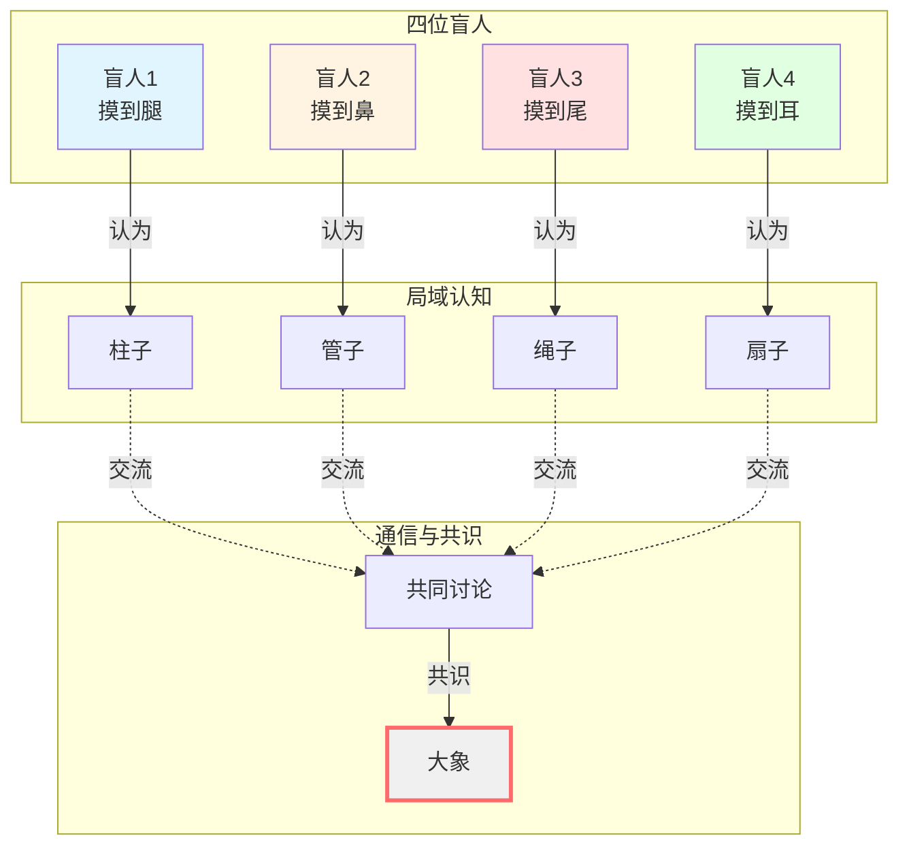
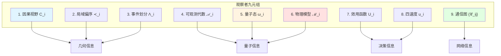
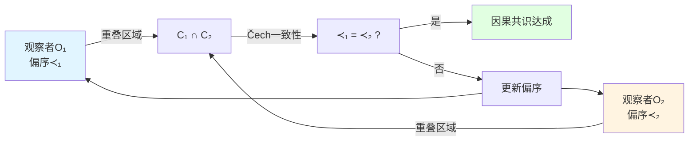
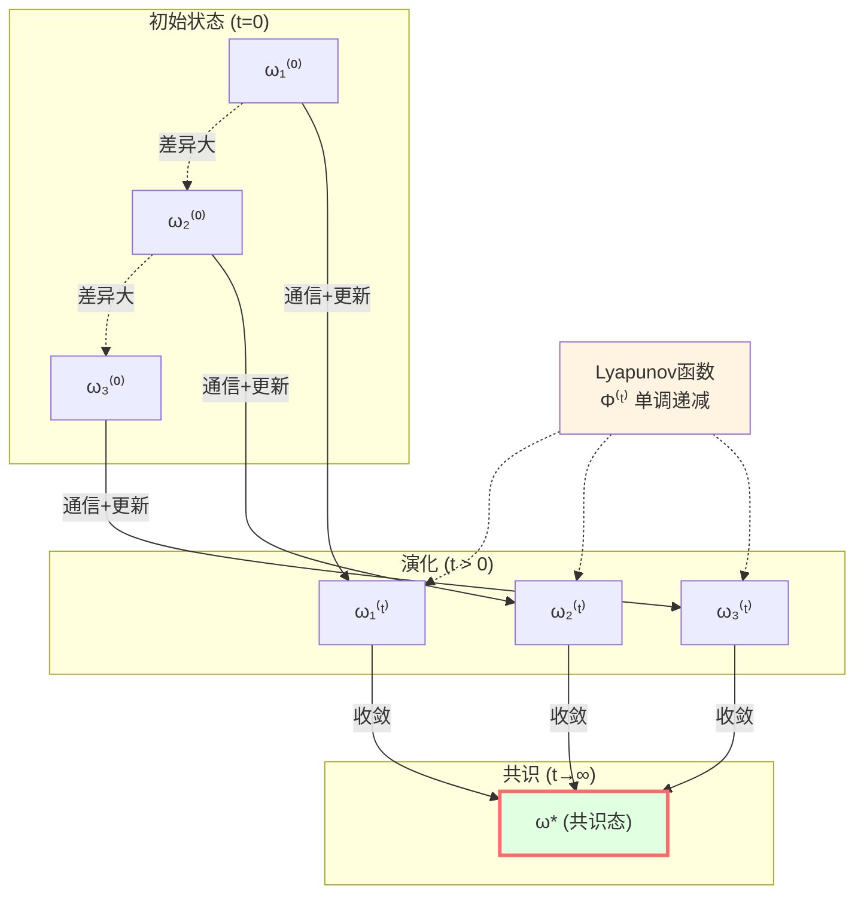
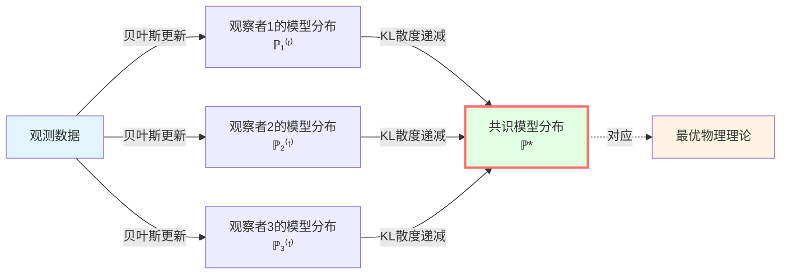
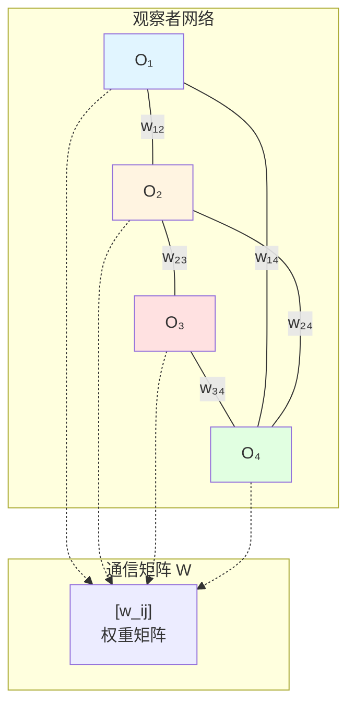
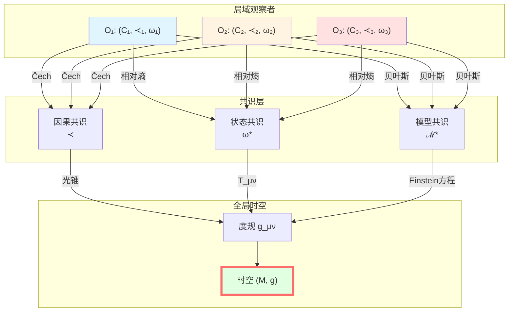
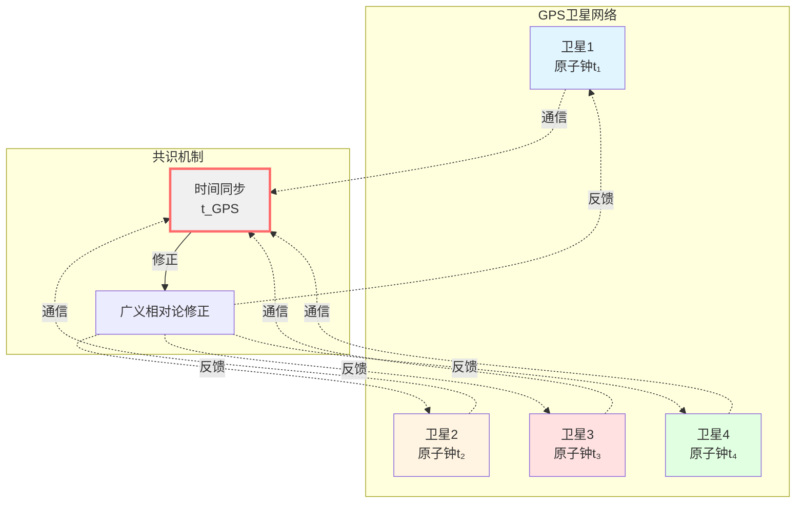

# 观察者共识：从局域到全局

> *"多个局域观察者通过因果结构达成共识，浮现出全局时空。"*

## 🎯 本文核心

在前面的文章中，我们从几何角度理解了因果结构。现在我们要回答一个深刻的问题：

**时空是客观的还是主观的？**

答案既不是纯粹客观，也不是纯粹主观，而是：

$$
\boxed{\text{时空} = \text{多观察者的共识几何}}
$$

**核心思想**：
- 每个观察者只能访问**局域因果视野**
- 不同观察者通过**通信**交换信息
- 观察者通过**三层共识机制**达成一致
- 共识收敛形成**全局时空结构**

这是**从局域到全局**的范式！

## 👥 比喻：盲人摸象

经典故事"盲人摸象"的现代版：

**类比GLS理论**：
- **盲人**：局域观察者（只能看到因果视野内的事件）
- **大象的部位**：局域因果钻石
- **交流**：通过光信号通信
- **共识**：Čech一致性 + 状态收敛 + 模型统一
- **大象全貌**：全局时空流形

**关键洞察**：
- 没有"上帝视角"直接看到完整时空
- 全局时空是从局域观察者的共识中**浮现**（emerge）的
- 这是**演生引力**（emergent gravity）的观察者版本

## 📐 观察者的形式化定义

### 观察者九元组

在GLS理论中，一个**观察者** $O_i$ 被形式化为**九元组**：

$$
O_i = (C_i, \prec_i, \Lambda_i, \mathcal{A}_i, \omega_i, \mathcal{M}_i, U_i, u_i, \{\mathcal{C}_{ij}\})
$$

让我们逐个解释：

#### 1. 因果视野 $C_i \subset M$

观察者能够**访问的时空区域**，通常是其**过去光锥**：

$$
C_i = J^-(O_i) = \{p \in M \mid p \prec O_i\}
$$

**物理意义**：观察者只能知道自己过去光锥内发生的事件。

#### 2. 局域偏序 $\prec_i \subset C_i \times C_i$

观察者在其视野内定义的**因果关系**（满足自反、传递、反对称）。

**回忆**：第3篇讨论的局域偏序粘合。

#### 3. 事件划分 $\Lambda_i$

观察者对事件的**分辨率**或**粗粒化**。

例：
- 经典观察者：$\Lambda_i$ 可能是宏观事件（"看到光"）
- 量子观察者：$\Lambda_i$ 可能是测量投影算符的集合

**数学结构**：$\Lambda_i$ 是 $C_i$ 的一个**σ-代数**（测度论意义）或**格**（格论意义）。

#### 4. 可观测代数 $\mathcal{A}_i$

观察者能够**测量的物理量**构成的算符代数。

**量子场论**：$\mathcal{A}_i$ 是**von Neumann代数**，由局域场算符生成：

$$
\mathcal{A}_i = \langle \{\phi(x)\}_{x \in C_i} \rangle''
$$

（双撇表示"双换位"，生成von Neumann代数）

#### 5. 量子态 $\omega_i$

观察者对系统的**知识状态**，表示为可观测代数上的**态**（state）：

$$
\omega_i: \mathcal{A}_i \to \mathbb{C}, \quad \omega_i(A) = \langle A \rangle
$$

满足：
- 线性性：$\omega_i(\alpha A + \beta B) = \alpha \omega_i(A) + \beta \omega_i(B)$
- 正性：$\omega_i(A^* A) \geq 0$
- 归一性：$\omega_i(\mathbb{I}) = 1$

#### 6. 物理模型 $\mathcal{M}_i$

观察者对物理规律的**先验假设**，包括：
- 哈密顿量（或作用量）
- 场方程
- 对称性

**贝叶斯视角**：$\mathcal{M}_i$ 是观察者的"理论空间"。

#### 7. 效用函数 $U_i$

观察者的**目标函数**或**偏好**。

例：
- 最大化信息获取：$U_i = S(\rho_i)$（熵最大化）
- 最小化能量：$U_i = -\langle H_i \rangle$
- 最大化准确性：$U_i = -D(\rho_{\mathrm{true}} \| \rho_i)$（最小化相对熵）

**决策理论**：观察者根据 $U_i$ 选择测量策略。

#### 8. 四速度 $u_i^\mu$

观察者的**运动状态**（类时单位矢量）：

$$
u_i^\mu u_{i\mu} = -1
$$

**物理意义**：定义观察者的"时间方向"和参考系。

#### 9. 通信图 $\{\mathcal{C}_{ij}\}$

观察者之间的**通信渠道**：

$$
\mathcal{C}_{ij}: O_i \to O_j
$$

包括：
- 通信延迟（光速限制）
- 通信带宽
- 通信可靠性（噪声）

## 🔗 三层共识机制

观察者通过**三个层次**的共识达成一致：

### 层次1：因果共识（Causal Consensus）

**目标**：不同观察者对**因果关系**的判断一致。

**机制**：Čech一致性条件（第3篇详述）

$$
\prec_i\,|_{C_i \cap C_j} = \prec_j\,|_{C_i \cap C_j}
$$

**收敛准则**：
- 所有观察者在重叠区域对因果序达成共识
- 局域偏序可以粘合成全局偏序

### 层次2：状态共识（State Consensus）

**目标**：不同观察者的**量子态**在共同区域趋于一致。

**机制**：相对熵Lyapunov函数

定义**共识态** $\omega_* \in \mathcal{S}(\mathcal{A}_{\mathrm{com}})$（在共同可观测代数 $\mathcal{A}_{\mathrm{com}} = \bigcap_i \mathcal{A}_i$ 上）。

**Lyapunov函数**：

$$
\Phi^{(t)} := \sum_{i} \lambda_i\, D(\omega_i^{(t)} \| \omega_*)
$$

其中：
- $D(\omega_i \| \omega_*) = \operatorname{tr}(\omega_i \log \omega_i) - \operatorname{tr}(\omega_i \log \omega_*)$：相对熵
- $\lambda_i \geq 0$：权重（$\sum_i \lambda_i = 1$）

**收敛定理**：

在合理假设下（通信、测量、更新），$\Phi^{(t)}$ 单调递减：

$$
\frac{\mathrm{d}\Phi^{(t)}}{\mathrm{d}t} \leq 0
$$

最终：

$$
\omega_i^{(t \to \infty)} \to \omega_*
$$

**物理意义**：
- 相对熵度量态的"差异度"
- Lyapunov函数递减 → 观察者的认知趋同
- 最终达成共识态

### 层次3：模型共识（Model Consensus）

**目标**：不同观察者的**物理模型**（理论）趋于一致。

**机制**：贝叶斯更新 + 大偏差理论

每个观察者维护一个**模型分布** $\mathbb{P}_i^{(t)}$（在模型空间 $\mathcal{M}$ 上）。

**贝叶斯更新**：

$$
\mathbb{P}_i^{(t+1)}(\mathcal{M} | \text{data}) \propto \mathbb{P}_i^{(t)}(\mathcal{M}) \cdot \mathcal{L}(\text{data} | \mathcal{M})
$$

其中 $\mathcal{L}$ 是似然函数。

**收敛准则**（Donsker-Varadhan大偏差原理）：

$$
D_{\mathrm{KL}}(\mathbb{P}_i^{(t)} \| \mathbb{P}_*) \to 0 \quad \text{当} \quad t \to \infty
$$

其中 $\mathbb{P}_*$ 是**共识模型分布**，由数据的真实统计决定。

**物理意义**：
- 观察者通过实验数据更新理论
- 不同观察者最终收敛到同一理论
- 这是**科学共识形成**的数学化

## 🌐 通信图与信息传播

### 通信图结构

观察者网络 $\mathcal{N} = \{O_1, \ldots, O_N\}$ 的通信由**图** $G = (V, E)$ 描述：

- **顶点** $V = \{O_1, \ldots, O_N\}$：观察者
- **边** $E = \{\mathcal{C}_{ij}\}$：通信渠道

**邻接矩阵** $W = (w_{ij})$：

$$
w_{ij} = \begin{cases}
> 0 & \text{如果} \, O_i \text{能与} \, O_j \text{通信} \\
0 & \text{否则}
\end{cases}
$$

**物理约束**：
- **因果性**：只有在 $C_i \cap C_j \neq \emptyset$ 时，$w_{ij} > 0$
- **对称性**（可选）：$w_{ij} = w_{ji}$（双向通信）
- **光速限制**：通信延迟 $\geq$ 光速传播时间

### 共识算法

**离散时间更新**（例如，线性共识算法）：

$$
\omega_i^{(t+1)} = (1 - \epsilon) \omega_i^{(t)} + \epsilon \sum_{j} w_{ij}\, \omega_j^{(t)}
$$

其中：
- $\epsilon \in (0,1)$：学习率
- $w_{ij}$：来自观察者 $j$ 的信息权重（归一化：$\sum_j w_{ij} = 1$）

**收敛条件**（图论）：
- 图 $G$ **连通**（任意两个观察者可通过路径连接）
- 权重矩阵 $W$ 是**双随机矩阵**（行和列和均为1）

**收敛速度**：由 $W$ 的**第二大特征值** $\lambda_2(W)$ 控制：

$$
\|\omega_i^{(t)} - \omega_*\| \leq C \cdot \lambda_2(W)^t
$$

（$\lambda_2 < 1$，越小收敛越快）

## 📊 从局域到全局的浮现

### 全局时空的构造

**步骤1**：局域观察者定义局域因果钻石 $\{D_i\}$

每个观察者 $O_i$ 在其视野 $C_i$ 内定义因果钻石族。

**步骤2**：因果共识达成全局偏序

通过Čech一致性，局域偏序粘合成全局偏序 $(M, \prec)$。

**步骤3**：状态共识确定全局态

通过相对熵收敛，局域态 $\{\omega_i\}$ 收敛到共识态 $\omega_*$。

**步骤4**：模型共识确定物理规律

通过贝叶斯更新，局域模型 $\{\mathcal{M}_i\}$ 收敛到共识理论。

**步骤5**：度规的浮现

从共识偏序 $\prec$ 和共识态 $\omega_*$，可以重建**时空度规** $g_{\mu\nu}$：

$$
g_{\mu\nu} = \text{函数}(\prec, \omega_*, \mathcal{M}_*)
$$

具体构造：
- 偏序 $\prec$ → 光锥结构 → 共形类 $[g]$
- 态 $\omega_*$ → 能量-动量张量 $T_{\mu\nu}$（通过模哈密顿量）
- Einstein方程 → 完整度规 $g_{\mu\nu}$

### 演生引力的观察者诠释

**传统观点**：时空度规 $g_{\mu\nu}$ 是基本的，观察者在其中运动。

**GLS观点**：时空度规是从观察者共识中**演生**的：

$$
\text{观察者网络} \xrightarrow{\text{因果+状态+模型共识}} \text{时空度规}
$$

**类比**：
- **温度**（宏观）← **分子运动**（微观）
- **时空度规**（宏观）← **观察者共识**（微观）

这是**演生引力**（emergent gravity）的具体实现！

## 🔍 例子：GPS卫星网络

### 场景

地球周围有 $N \sim 30$ 颗GPS卫星，每颗都是一个观察者：

$$
O_i = (\text{轨道}, \text{原子钟}, \text{信号接收器}, \ldots)
$$

### 局域视野

每颗卫星只能看到：
- 自己的过去光锥 $C_i = J^-(O_i)$
- 接收到其他卫星的信号

### 通信图

$$
w_{ij} = \begin{cases}
> 0 & \text{如果卫星} \, i \text{和} \, j \text{可视} \\
0 & \text{否则}
\end{cases}
$$

### 因果共识

卫星通过交换信号确认**事件顺序**：
- 事件A发生在事件B之前吗？
- 需要修正相对论效应（引力时间膨胀、运动时间膨胀）

### 状态共识

卫星同步**时间**：
- 每颗卫星有原子钟（局域时间 $t_i$）
- 通过共识算法同步到GPS时间 $t_{\mathrm{GPS}}$

**Lyapunov函数**：

$$
\Phi^{(t)} = \sum_i (t_i^{(t)} - t_{\mathrm{GPS}})^2
$$

递减到零 → 时间同步完成！

### 模型共识

所有卫星使用**同一理论**：
- 广义相对论
- Schwarzschild度规（地球引力场）

如果某颗卫星的模型错误（例如忘记广义相对论修正），其预测会系统性偏离，最终被其他卫星"纠正"（通过贝叶斯更新）。

**GPS即GLS理论的日常实现**！

## 💡 关键要点总结

### 1. 观察者九元组

$$
O_i = (C_i, \prec_i, \Lambda_i, \mathcal{A}_i, \omega_i, \mathcal{M}_i, U_i, u_i, \{\mathcal{C}_{ij}\})
$$

包含因果、量子、模型、决策、运动、通信信息。

### 2. 三层共识

- **因果共识**：Čech一致性，$\prec_i = \prec_j$ 在重叠区域
- **状态共识**：相对熵Lyapunov函数，$\omega_i \to \omega_*$
- **模型共识**：贝叶斯更新，$\mathbb{P}_i \to \mathbb{P}_*$

### 3. 相对熵Lyapunov函数

$$
\Phi^{(t)} = \sum_i \lambda_i\, D(\omega_i^{(t)} \| \omega_*), \quad \frac{\mathrm{d}\Phi}{\mathrm{d}t} \leq 0
$$

保证共识收敛。

### 4. 通信图

权重矩阵 $W = (w_{ij})$，连通性保证共识达成。

### 5. 演生时空

$$
\text{观察者共识} \Longrightarrow \text{时空度规}
$$

全局时空从局域观察者的共识中浮现。

## 🤔 思考题

### 问题1：如果观察者之间无法通信（$w_{ij} = 0$ 对所有 $i \neq j$），会怎样？

**提示**：考虑图的连通性。

**答案**：**无法达成共识**！每个观察者都有自己的"主观时空"，无法形成统一的全局几何。这类似于多个**因果隔离的宇宙岛**。物理上，这对应**宇宙学视界**之外的区域：无法通信，因此无法验证因果一致性。

### 问题2：Lyapunov函数的权重 $\lambda_i$ 应该如何选择？

**提示**：考虑观察者的"可信度"或"测量精度"。

**答案**：$\lambda_i$ 应该反映观察者的**信息质量**。例如：
- 测量精度高的观察者 → 较大的 $\lambda_i$
- 观测数据多的观察者 → 较大的 $\lambda_i$
- 可以动态调整：$\lambda_i^{(t)} \propto (\text{信息熵的倒数})^{-1}$

这类似于**加权平均**，更可靠的观察者有更大影响力。

### 问题3：如果某个观察者是"恶意"的（提供错误信息），共识算法会怎样？

**提示**：考虑拜占庭将军问题。

**答案**：这是**拜占庭共识**（Byzantine consensus）问题！在量子信息中，如果：
- 恶意观察者数量 $\leq N/3$（$N$ 是总数）
- 其他观察者能够验证信息一致性（例如通过Markov性质检验）

则共识仍然可以达成，但需要更复杂的算法（例如，拜占庭容错共识）。

在GLS理论中，**因果一致性**（Čech条件）提供了天然的验证机制！

### 问题4：观察者共识与AdS/CFT有何联系？

**提示**：考虑边界CFT的多个"观察者区域"。

**答案**：在AdS/CFT中：
- **体域AdS**：全局时空
- **边界CFT**：可以分为多个子区域（对应不同"观察者"）
- **纠缠楔形**：每个边界区域的因果视野
- **共识**：子区域的纠缠结构必须一致，才能重建完整体域

观察者共识的GLS理论可以看作**AdS/CFT的观察者诠释**！

## 📖 源理论出处

本文内容主要来自以下源理论：

### 核心源理论

**文档**：`docs/euler-gls-causal/observer-properties-consensus-geometry-causal-network.md`

**关键内容**：
- 观察者的九元组形式化
- Čech型一致性条件（因果共识）
- 相对熵Lyapunov函数（状态共识）
- 贝叶斯更新与大偏差（模型共识）
- 通信图与信息传播
- 从局域到全局的时空浮现

**重要定理**（原文）：
> "观察者通过三层共识（因果、状态、模型）达成一致，形成全局时空结构。相对熵Lyapunov函数保证共识收敛。"

### 相关文献

**量子网络共识**：
- Olfati-Saber & Murray (2004)：经典共识算法
- Boyd et al. (2006)：分布式优化
- 量子推广：量子态的共识（近期研究）

**贝叶斯推断**：
- Jaynes (1957)：最大熵原理
- MacKay (2003)：贝叶斯机器学习

**拜占庭共识**：
- Lamport et al. (1982)：拜占庭将军问题
- 区块链：去中心化共识（比特币、以太坊）

## 🎯 下一步

我们已经完成了因果结构篇的核心内容！下一篇是本篇的**总结**，将把所有概念串联起来，形成完整图景。

**下一篇**：[07-因果结构总结](./07-causal-summary.md) - 因果结构的完整图景

在那里，我们将看到：
- 因果结构的七篇文章回顾
- 三位一体的完整联系（几何-时间-熵）
- 与前篇（边界理论、统一时间）的关系
- 引向下一篇（拓扑约束）
- 因果结构在GLS理论中的核心地位

**返回**：[因果结构篇总览](./00-causal-overview.md)

**上一篇**：[05-Markov性质](./05-markov-property.md)
