# Observer Consensus: From Local to Global

> *"Multiple local observers reach consensus through causal structure, emerging global spacetime."*

## 🎯 Core of This Article

In previous articles, we understood causal structure from geometric perspective. Now we answer a profound question:

**Is spacetime objective or subjective?**

Answer is neither purely objective nor purely subjective, but:

$$\boxed{\text{Spacetime} = \text{Consensus Geometry of Multiple Observers}}$$

**Core Idea**:
- Each observer can only access **local causal horizon**
- Different observers exchange information through **communication**
- Observers reach agreement through **three-level consensus mechanism**
- Consensus convergence forms **global spacetime structure**

This is **from local to global** paradigm!

## 👥 Analogy: Blind Men and Elephant

Modern version of classic story "Blind Men and Elephant":

**Analogy to GLS Theory**:
- **Blind Men**: Local observers (can only see events within causal horizon)
- **Elephant Parts**: Local causal diamonds
- **Exchange**: Communication through light signals
- **Consensus**: Čech consistency + state convergence + model unification
- **Complete Elephant**: Global spacetime manifold

**Key Insight**:
- No "God's eye view" directly seeing complete spacetime
- Global spacetime **emerges** from consensus of local observers
- This is observer version of **emergent gravity**

## 📐 Formal Definition of Observer

### Observer Nine-Tuple

In GLS theory, an **observer** $O_i$ is formalized as **nine-tuple**:

$$O_i = (C_i, \prec_i, \Lambda_i, \mathcal{A}_i, \omega_i, \mathcal{M}_i, U_i, u_i, \{\mathcal{C}_{ij}\})$$

Let's explain one by one:

#### 1. Causal Horizon $C_i \subset M$

Spacetime region that observer can **access**, usually their **past light cone**:

$$C_i = J^-(O_i) = \{p \in M \mid p \prec O_i\}$$

**Physical Meaning**: Observer can only know events in their past light cone.

#### 2. Local Partial Order $\prec_i \subset C_i \times C_i$

**Causal relation** defined by observer in their horizon (satisfies reflexivity, transitivity, antisymmetry).

**Recall**: Local partial order gluing discussed in Article 3.

#### 3. Event Partition $\Lambda_i$

Observer's **resolution** or **coarse-graining** of events.

Examples:
- Classical observer: $\Lambda_i$ might be macroscopic events ("see light")
- Quantum observer: $\Lambda_i$ might be set of measurement projection operators

**Mathematical Structure**: $\Lambda_i$ is a **σ-algebra** (measure theory) or **lattice** (lattice theory) on $C_i$.

#### 4. Observable Algebra $\mathcal{A}_i$

Operator algebra formed by physical quantities observer can **measure**.

**Quantum Field Theory**: $\mathcal{A}_i$ is **von Neumann algebra**, generated by local field operators:

$$\mathcal{A}_i = \langle \{\phi(x)\}_{x \in C_i} \rangle''$$

(Double prime means "double commutant", generating von Neumann algebra)

#### 5. Quantum State $\omega_i$

Observer's **knowledge state** of system, represented as **state** on observable algebra:

$$\omega_i: \mathcal{A}_i \to \mathbb{C}, \quad \omega_i(A) = \langle A \rangle$$

Satisfying:
- Linearity: $\omega_i(\alpha A + \beta B) = \alpha \omega_i(A) + \beta \omega_i(B)$
- Positivity: $\omega_i(A^* A) \geq 0$
- Normalization: $\omega_i(\mathbb{I}) = 1$

#### 6. Physical Model $\mathcal{M}_i$

Observer's **prior assumptions** about physical laws, including:
- Hamiltonian (or action)
- Field equations
- Symmetries

**Bayesian Perspective**: $\mathcal{M}_i$ is observer's "theory space".

#### 7. Utility Function $U_i$

Observer's **objective function** or **preference**.

Examples:
- Maximize information acquisition: $U_i = S(\rho_i)$ (entropy maximization)
- Minimize energy: $U_i = -\langle H_i \rangle$
- Maximize accuracy: $U_i = -D(\rho_{\mathrm{true}} \| \rho_i)$ (minimize relative entropy)

**Decision Theory**: Observer chooses measurement strategy according to $U_i$.

#### 8. Four-Velocity $u_i^\mu$

Observer's **motion state** (timelike unit vector):

$$u_i^\mu u_{i\mu} = -1$$

**Physical Meaning**: Defines observer's "time direction" and reference frame.

#### 9. Communication Graph $\{\mathcal{C}_{ij}\}$

**Communication channels** between observers:

$$\mathcal{C}_{ij}: O_i \to O_j$$

Including:
- Communication delay (light speed limit)
- Communication bandwidth
- Communication reliability (noise)

```mermaid
graph TB
    subgraph "Observer Nine-Tuple"
        CI["Step 1: Causal Horizon C_i"]
        PREC["Step 2: Local Partial Order ≺_i"]
        LAMBDA["Step 3: Event Partition Λ_i"]
        ALG["Step 4: Observable Algebra 𝒜_i"]
        STATE["Step 5: Quantum State ω_i"]
        MODEL["Step 6: Physical Model ℳ_i"]
        UTIL["Step 7: Utility Function U_i"]
        VEL["Step 8: Four-Velocity u_i"]
        COM["Step 9: Communication Graph {𝒞_ij}"]
    end

    CI --> GEO["Geometric Information"]
    PREC --> GEO
    LAMBDA --> GEO

    ALG --> QM["Quantum Information"]
    STATE --> QM
    MODEL --> QM

    UTIL --> DEC["Decision Information"]
    VEL --> DEC

    COM --> NET["Network Information"]

    style CI fill:#e1f5ff
    style STATE fill:#fff4e1
    style MODEL fill:#ffe1e1
    style COM fill:#e1ffe1
```

## 🔗 Three-Level Consensus Mechanism

Observers reach agreement through **three levels** of consensus:

### Level 1: Causal Consensus

**Goal**: Different observers agree on **causal relations**.

**Mechanism**: Čech consistency condition (detailed in Article 3)

$$\prec_i\,|_{C_i \cap C_j} = \prec_j\,|_{C_i \cap C_j}$$

**Convergence Criterion**:
- All observers agree on causal order in overlapping regions
- Local partial orders can be glued into global partial order

```mermaid
graph LR
    O1["Observer O₁<br/>Partial Order ≺₁"] -->|"Overlapping Region"| OVERLAP["C₁ ∩ C₂"]
    O2["Observer O₂<br/>Partial Order ≺₂"] -->|"Overlapping Region"| OVERLAP

    OVERLAP -->|"Čech Consistency"| CHECK["≺₁ = ≺₂ ?"]
    CHECK -->|"Yes"| CONSENSUS["Causal Consensus Reached"]
    CHECK -->|"No"| UPDATE["Update Partial Order"]
    UPDATE --> O1
    UPDATE --> O2

    style O1 fill:#e1f5ff
    style O2 fill:#fff4e1
    style CONSENSUS fill:#e1ffe1
```

### Level 2: State Consensus

**Goal**: **Quantum states** of different observers converge in common region.

**Mechanism**: Relative entropy Lyapunov function

Define **consensus state** $\omega_* \in \mathcal{S}(\mathcal{A}_{\mathrm{com}})$ (on common observable algebra $\mathcal{A}_{\mathrm{com}} = \bigcap_i \mathcal{A}_i$).

**Lyapunov Function**:

$$\Phi^{(t)} := \sum_{i} \lambda_i\, D(\omega_i^{(t)} \| \omega_*)$$

where:
- $D(\omega_i \| \omega_*) = \operatorname{tr}(\omega_i \log \omega_i) - \operatorname{tr}(\omega_i \log \omega_*)$: Relative entropy
- $\lambda_i \geq 0$: Weights ($\sum_i \lambda_i = 1$)

**Convergence Theorem**:

Under reasonable assumptions (communication, measurement, update), $\Phi^{(t)}$ monotonically decreases:

$$\frac{\mathrm{d}\Phi^{(t)}}{\mathrm{d}t} \leq 0$$

Finally:

$$\omega_i^{(t \to \infty)} \to \omega_*$$

**Physical Meaning**:
- Relative entropy measures "difference" between states
- Lyapunov function decreasing → observers' cognition converges
- Finally reach consensus state

```mermaid
graph TB
    subgraph "Initial State (t=0)"
        W1["ω₁⁽⁰⁾"] -.->|"Large Difference"| W2["ω₂⁽⁰⁾"]
        W2 -.->|"Large Difference"| W3["ω₃⁽⁰⁾"]
    end

    subgraph "Evolution (t > 0)"
        W1 -->|"Communication+Update"| W1T["ω₁⁽ᵗ⁾"]
        W2 -->|"Communication+Update"| W2T["ω₂⁽ᵗ⁾"]
        W3 -->|"Communication+Update"| W3T["ω₃⁽ᵗ⁾"]
    end

    subgraph "Consensus (t→∞)"
        W1T -->|"Converge"| WSTAR["ω* (Consensus State)"]
        W2T -->|"Converge"| WSTAR
        W3T -->|"Converge"| WSTAR
    end

    LYAP["Lyapunov Function<br/>Φ⁽ᵗ⁾ Monotonically Decreasing"] -.-> W1T
    LYAP -.-> W2T
    LYAP -.-> W3T

    style WSTAR fill:#e1ffe1,stroke:#ff6b6b,stroke-width:3px
    style LYAP fill:#fff4e1
```

### Level 3: Model Consensus

**Goal**: **Physical models** (theories) of different observers converge.

**Mechanism**: Bayesian update + large deviation theory

Each observer maintains a **model distribution** $\mathbb{P}_i^{(t)}$ (on model space $\mathcal{M}$).

**Bayesian Update**:

$$\mathbb{P}_i^{(t+1)}(\mathcal{M} | \text{data}) \propto \mathbb{P}_i^{(t)}(\mathcal{M}) \cdot \mathcal{L}(\text{data} | \mathcal{M})$$

where $\mathcal{L}$ is likelihood function.

**Convergence Criterion** (Donsker-Varadhan large deviation principle):

$$D_{\mathrm{KL}}(\mathbb{P}_i^{(t)} \| \mathbb{P}_*) \to 0 \quad \text{as} \quad t \to \infty$$

where $\mathbb{P}_*$ is **consensus model distribution**, determined by true statistics of data.

**Physical Meaning**:
- Observers update theory through experimental data
- Different observers eventually converge to same theory
- This is mathematicalization of **scientific consensus formation**

```mermaid
graph LR
    DATA["Observation Data"] -->|"Bayesian Update"| P1["Observer 1's Model Distribution<br/>ℙ₁⁽ᵗ⁾"]
    DATA -->|"Bayesian Update"| P2["Observer 2's Model Distribution<br/>ℙ₂⁽ᵗ⁾"]
    DATA -->|"Bayesian Update"| P3["Observer 3's Model Distribution<br/>ℙ₃⁽ᵗ⁾"]

    P1 -->|"KL Divergence Decreasing"| PSTAR["Consensus Model Distribution<br/>ℙ*"]
    P2 -->|"KL Divergence Decreasing"| PSTAR
    P3 -->|"KL Divergence Decreasing"| PSTAR

    PSTAR -.->|"Corresponds to"| THEORY["Optimal Physical Theory"]

    style DATA fill:#e1f5ff
    style PSTAR fill:#e1ffe1,stroke:#ff6b6b,stroke-width:3px
    style THEORY fill:#fff4e1
```

## 🌐 Communication Graph and Information Propagation

### Communication Graph Structure

Communication of observer network $\mathcal{N} = \{O_1, \ldots, O_N\}$ is described by **graph** $G = (V, E)$:

- **Vertices** $V = \{O_1, \ldots, O_N\}$: Observers
- **Edges** $E = \{\mathcal{C}_{ij}\}$: Communication channels

**Adjacency Matrix** $W = (w_{ij})$:

$$w_{ij} = \begin{cases}
> 0 & \text{if} \, O_i \text{can communicate with} \, O_j \\
0 & \text{otherwise}
\end{cases}$$

**Physical Constraints**:
- **Causality**: Only when $C_i \cap C_j \neq \emptyset$, $w_{ij} > 0$
- **Symmetry** (optional): $w_{ij} = w_{ji}$ (bidirectional communication)
- **Light Speed Limit**: Communication delay $\geq$ light propagation time

```mermaid
graph TB
    subgraph "Observer Network"
        O1["O₁"] ---|"w₁₂"| O2["O₂"]
        O2 ---|"w₂₃"| O3["O₃"]
        O3 ---|"w₃₄"| O4["O₄"]
        O1 ---|"w₁₄"| O4
        O2 ---|"w₂₄"| O4
    end

    subgraph "Communication Matrix W"
        W["[w_ij]<br/>Weight Matrix"]
    end

    O1 -.-> W
    O2 -.-> W
    O3 -.-> W
    O4 -.-> W

    style O1 fill:#e1f5ff
    style O2 fill:#fff4e1
    style O3 fill:#ffe1e1
    style O4 fill:#e1ffe1
```

### Consensus Algorithm

**Discrete Time Update** (e.g., linear consensus algorithm):

$$\omega_i^{(t+1)} = (1 - \epsilon) \omega_i^{(t)} + \epsilon \sum_{j} w_{ij}\, \omega_j^{(t)}$$

where:
- $\epsilon \in (0,1)$: Learning rate
- $w_{ij}$: Information weight from observer $j$ (normalized: $\sum_j w_{ij} = 1$)

**Convergence Condition** (graph theory):
- Graph $G$ is **connected** (any two observers can be connected by path)
- Weight matrix $W$ is **doubly stochastic** (row and column sums are 1)

**Convergence Rate**: Controlled by **second largest eigenvalue** $\lambda_2(W)$ of $W$:

$$\|\omega_i^{(t)} - \omega_*\| \leq C \cdot \lambda_2(W)^t$$

($\lambda_2 < 1$, smaller means faster convergence)

## 📊 Emergence from Local to Global

### Construction of Global Spacetime

**Step 1**: Local observers define local causal diamonds $\{D_i\}$

Each observer $O_i$ defines causal diamond family in their horizon $C_i$.

**Step 2**: Causal consensus forms global partial order

Through Čech consistency, local partial orders glue into global partial order $(M, \prec)$.

**Step 3**: State consensus determines global state

Through relative entropy convergence, local states $\{\omega_i\}$ converge to consensus state $\omega_*$.

**Step 4**: Model consensus determines physical laws

Through Bayesian update, local models $\{\mathcal{M}_i\}$ converge to consensus theory.

**Step 5**: Emergence of Metric

From consensus partial order $\prec$ and consensus state $\omega_*$, can reconstruct **spacetime metric** $g_{\mu\nu}$:

$$g_{\mu\nu} = \text{function}(\prec, \omega_*, \mathcal{M}_*)$$

Specific construction:
- Partial order $\prec$ → light cone structure → conformal class $[g]$
- State $\omega_*$ → energy-momentum tensor $T_{\mu\nu}$ (through modular Hamiltonian)
- Einstein equation → complete metric $g_{\mu\nu}$

```mermaid
graph TB
    subgraph "Local Observers"
        O1["O₁: (C₁, ≺₁, ω₁)"]
        O2["O₂: (C₂, ≺₂, ω₂)"]
        O3["O₃: (C₃, ≺₃, ω₃)"]
    end

    subgraph "Consensus Layer"
        CAUSAL["Causal Consensus<br/>≺"]
        STATE["State Consensus<br/>ω*"]
        MODEL["Model Consensus<br/>ℳ*"]
    end

    subgraph "Global Spacetime"
        METRIC["Metric g_μν"]
        SPACETIME["Spacetime (M, g)"]
    end

    O1 -->|"Čech"| CAUSAL
    O2 -->|"Čech"| CAUSAL
    O3 -->|"Čech"| CAUSAL

    O1 -->|"Relative Entropy"| STATE
    O2 -->|"Relative Entropy"| STATE
    O3 -->|"Relative Entropy"| STATE

    O1 -->|"Bayesian"| MODEL
    O2 -->|"Bayesian"| MODEL
    O3 -->|"Bayesian"| MODEL

    CAUSAL -->|"Light Cone"| METRIC
    STATE -->|"T_μν"| METRIC
    MODEL -->|"Einstein Equation"| METRIC

    METRIC --> SPACETIME

    style O1 fill:#e1f5ff
    style O2 fill:#fff4e1
    style O3 fill:#ffe1e1
    style SPACETIME fill:#e1ffe1,stroke:#ff6b6b,stroke-width:4px
```

### Observer Interpretation of Emergent Gravity

**Traditional View**: Spacetime metric $g_{\mu\nu}$ is fundamental, observers move in it.

**GLS View**: Spacetime metric **emerges** from observer consensus:

$$\text{Observer Network} \xrightarrow{\text{Causal+State+Model Consensus}} \text{Spacetime Metric}$$

**Analogy**:
- **Temperature** (macroscopic) ← **Molecular Motion** (microscopic)
- **Spacetime Metric** (macroscopic) ← **Observer Consensus** (microscopic)

This is concrete realization of **emergent gravity**!

## 🔍 Example: GPS Satellite Network

### Scenario

Around Earth there are $N \sim 30$ GPS satellites, each is an observer:

$$O_i = (\text{orbit}, \text{atomic clock}, \text{signal receiver}, \ldots)$$

### Local Horizon

Each satellite can only see:
- Its own past light cone $C_i = J^-(O_i)$
- Signals received from other satellites

### Communication Graph

$$w_{ij} = \begin{cases}
> 0 & \text{if satellites} \, i \text{and} \, j \text{are visible} \\
0 & \text{otherwise}
\end{cases}$$

### Causal Consensus

Satellites confirm **event order** through signal exchange:
- Did event A occur before event B?
- Need to correct relativistic effects (gravitational time dilation, motion time dilation)

### State Consensus

Satellites synchronize **time**:
- Each satellite has atomic clock (local time $t_i$)
- Synchronize to GPS time $t_{\mathrm{GPS}}$ through consensus algorithm

**Lyapunov Function**:

$$\Phi^{(t)} = \sum_i (t_i^{(t)} - t_{\mathrm{GPS}})^2$$

Decreasing to zero → time synchronization complete!

### Model Consensus

All satellites use **same theory**:
- General relativity
- Schwarzschild metric (Earth's gravitational field)

If some satellite's model is wrong (e.g., forgets general relativistic correction), its predictions will systematically deviate, eventually "corrected" by other satellites (through Bayesian update).

**GPS is daily realization of GLS theory**!

```mermaid
graph TB
    subgraph "GPS Satellite Network"
        SAT1["Satellite 1<br/>Atomic Clock t₁"]
        SAT2["Satellite 2<br/>Atomic Clock t₂"]
        SAT3["Satellite 3<br/>Atomic Clock t₃"]
        SAT4["Satellite 4<br/>Atomic Clock t₄"]
    end

    subgraph "Consensus Mechanism"
        SYNC["Time Synchronization<br/>t_GPS"]
        GR["General Relativistic Correction"]
    end

    SAT1 -.->|"Communication"| SYNC
    SAT2 -.->|"Communication"| SYNC
    SAT3 -.->|"Communication"| SYNC
    SAT4 -.->|"Communication"| SYNC

    SYNC -->|"Correction"| GR
    GR -.->|"Feedback"| SAT1
    GR -.->|"Feedback"| SAT2
    GR -.->|"Feedback"| SAT3
    GR -.->|"Feedback"| SAT4

    style SAT1 fill:#e1f5ff
    style SAT2 fill:#fff4e1
    style SAT3 fill:#ffe1e1
    style SAT4 fill:#e1ffe1
    style SYNC fill:#f0f0f0,stroke:#ff6b6b,stroke-width:3px
```

## 💡 Key Points Summary

### 1. Observer Nine-Tuple

$$O_i = (C_i, \prec_i, \Lambda_i, \mathcal{A}_i, \omega_i, \mathcal{M}_i, U_i, u_i, \{\mathcal{C}_{ij}\})$$

Contains causal, quantum, model, decision, motion, communication information.

### 2. Three-Level Consensus

- **Causal Consensus**: Čech consistency, $\prec_i = \prec_j$ in overlapping regions
- **State Consensus**: Relative entropy Lyapunov function, $\omega_i \to \omega_*$
- **Model Consensus**: Bayesian update, $\mathbb{P}_i \to \mathbb{P}_*$

### 3. Relative Entropy Lyapunov Function

$$\Phi^{(t)} = \sum_i \lambda_i\, D(\omega_i^{(t)} \| \omega_*), \quad \frac{\mathrm{d}\Phi}{\mathrm{d}t} \leq 0$$

Ensures consensus convergence.

### 4. Communication Graph

Weight matrix $W = (w_{ij})$, connectivity ensures consensus.

### 5. Emergent Spacetime

$$\text{Observer Consensus} \Longrightarrow \text{Spacetime Metric}$$

Global spacetime emerges from consensus of local observers.

## 🤔 Thought Questions

### Question 1: What If Observers Cannot Communicate ($w_{ij} = 0$ for all $i \neq j$)?

**Hint**: Consider graph connectivity.

**Answer**: **Cannot reach consensus**! Each observer has their own "subjective spacetime", cannot form unified global geometry. This is similar to multiple **causally isolated universe islands**. Physically, this corresponds to regions **beyond cosmological horizon**: cannot communicate, therefore cannot verify causal consistency.

### Question 2: How Should Weights $\lambda_i$ of Lyapunov Function Be Chosen?

**Hint**: Consider observer's "credibility" or "measurement precision".

**Answer**: $\lambda_i$ should reflect observer's **information quality**. For example:
- Observers with high measurement precision → larger $\lambda_i$
- Observers with more observation data → larger $\lambda_i$
- Can dynamically adjust: $\lambda_i^{(t)} \propto (\text{inverse of information entropy})^{-1}$

This is similar to **weighted average**, more reliable observers have greater influence.

### Question 3: What If Some Observer Is "Malicious" (Provides Wrong Information)?

**Hint**: Consider Byzantine generals problem.

**Answer**: This is **Byzantine consensus** problem! In quantum information, if:
- Number of malicious observers $\leq N/3$ ($N$ is total number)
- Other observers can verify information consistency (e.g., through Markov property test)

then consensus can still be reached, but requires more complex algorithms (e.g., Byzantine fault-tolerant consensus).

In GLS theory, **causal consistency** (Čech condition) provides natural verification mechanism!

### Question 4: What Is Connection Between Observer Consensus and AdS/CFT?

**Hint**: Consider multiple "observer regions" of boundary CFT.

**Answer**: In AdS/CFT:
- **Bulk AdS**: Global spacetime
- **Boundary CFT**: Can be divided into multiple subregions (corresponding to different "observers")
- **Entanglement Wedges**: Causal horizon of each boundary region
- **Consensus**: Entanglement structure of subregions must be consistent to reconstruct complete bulk

GLS theory of observer consensus can be seen as **observer interpretation of AdS/CFT**!

## 📖 Source Theory References

Content of this article mainly from following source theories:

### Core Source Theory

**Document**: `docs/euler-gls-causal/observer-properties-consensus-geometry-causal-network.md`

**Key Content**:
- Nine-tuple formalization of observers
- Čech-type consistency conditions (causal consensus)
- Relative entropy Lyapunov function (state consensus)
- Bayesian update and large deviation (model consensus)
- Communication graph and information propagation
- Spacetime emergence from local to global

**Important Theorem** (original text):
> "Observers reach agreement through three-level consensus (causal, state, model), forming global spacetime structure. Relative entropy Lyapunov function ensures consensus convergence."

### Related Literature

**Quantum Network Consensus**:
- Olfati-Saber & Murray (2004): Classical consensus algorithms
- Boyd et al. (2006): Distributed optimization
- Quantum generalization: Consensus of quantum states (recent research)

**Bayesian Inference**:
- Jaynes (1957): Maximum entropy principle
- MacKay (2003): Bayesian machine learning

**Byzantine Consensus**:
- Lamport et al. (1982): Byzantine generals problem
- Blockchain: Decentralized consensus (Bitcoin, Ethereum)

## 🎯 Next Steps

We've completed core content of Causal Structure chapter! Next article is **summary** of this chapter, connecting all concepts to form complete picture.

**Next Article**: [07-causal-summary_en.md](07-causal-summary_en.md) - Complete Picture of Causal Structure

There, we will see:
- Review of seven articles on causal structure
- Complete connection of trinity (geometry-time-entropy)
- Relationship with previous chapters (boundary theory, unified time)
- Leading to next chapter (topological constraints)
- Core position of causal structure in GLS theory

**Back**: [Causal Structure Chapter Overview](00-causal-overview_en.md)

**Previous**: [05-markov-property_en.md](05-markov-property_en.md)

