# Causal Structure Summary: Complete Picture

> *"Causality, time, entropy, boundary, observers—five in one, constituting complete structure of spacetime."*

## 🎯 Chapter Review

We've completed all content of Causal Structure chapter! Let's review this journey and weave all concepts into a **complete picture**.

### Seven Articles in This Chapter


Now, let's combine these puzzle pieces into complete picture.

## 📖 Review of Seven Articles

### 01-What is Causality?

**Core Idea**: Causality has three equivalent definitions

$$\text{Geometric Causality} \Longleftrightarrow \text{Temporal Causality} \Longleftrightarrow \text{Entropic Causality}$$

**Key Formulas**:

$$\begin{aligned}
&\text{Geometry:} \quad p \prec q \Leftrightarrow q \in J^+(p) \\
&\text{Time:} \quad p \prec q \Leftrightarrow \tau(q) > \tau(p) \\
&\text{Entropy:} \quad p \prec q \Rightarrow S_{\mathrm{gen}}[\Sigma_q] \geq S_{\mathrm{gen}}[\Sigma_p]
\end{aligned}$$

**Insight**:
- Causality is not a relation, but a structure
- Three definitions are different projections of same structure
- Geroch theorem, Wall theorem, IGVP variational principle form complete cycle

### 02-Causal Diamond

**Core Idea**: Causal diamond is atom of spacetime

$$D(p,q) = J^+(p) \cap J^-(q)$$

**Key Structure**:
- Boundary: $\partial D = E^+(p,q) \cup E^-(p,q)$ (null hypersurfaces)
- Holographic scaling: $V(D) / A(\partial D) \sim \tau$
- Modular Hamiltonian completely on boundary

**Insight**:
- All physics defined within causal diamond
- Boundary ($E^+ \cup E^-$) encodes complete information
- Bulk is reconstruction of boundary data

### 03-Partial Order Structure and Gluing

**Core Idea**: Local partial orders glue into global partial order through Čech consistency

$$\prec_i\,|_{C_i \cap C_j} = \prec_j\,|_{C_i \cap C_j}$$

**Key Theorems**:
- Gluing theorem: Local partial order family → unique global partial order
- Three axioms: Reflexivity, transitivity, antisymmetry
- Čech consistency ensures gluing is well-defined

**Insight**:
- Global spacetime emerges from local gluing
- Similar to sheaf gluing in topology
- Mathematical foundation of observer consensus

### 04-Null-Modular Double Cover (Core)

**Core Idea**: Modular Hamiltonian completely localized on null boundaries

$$K_D = 2\pi \sum_{\sigma = \pm} \int_{E^\sigma} g_\sigma(\lambda, x_\perp)\, T_{\sigma\sigma}(\lambda, x_\perp)\, \mathrm{d}\lambda\, \mathrm{d}^{d-2}x_\perp$$

**Key Concepts**:
- **Double Cover**: $\widetilde{E}_D = E^+ \sqcup E^-$ (two boundaries together encode)
- **Modulation Function**: $g_\sigma$ encodes geometry (Jacobi fields)
- **Null-Direction Stress**: Only $T_{\sigma\sigma}$ contributes

**Insight**:
- This is heart formula of GLS theory
- Concrete realization of physics on boundary
- Connects boundary theory (GHY), unified time ($\kappa$), causal structure

### 05-Markov Property

**Core Idea**: Causal diamonds satisfy Markov property

$$I(A:C|B) = 0$$

**Key Formula**: Inclusion-Exclusion

$$K_{\bigcup_j D_j} = \sum_{k \geq 1} (-1)^{k-1} \sum_{j_1 < \cdots < j_k} K_{D_{j_1} \cap \cdots \cap D_{j_k}}$$

**Insight**:
- Null plane regions naturally satisfy Markov property (Casini-Teste-Torroba)
- Middle region screens causal connection
- Additivity and correction of modular Hamiltonian

### 06-Observer Consensus

**Core Idea**: Spacetime emerges from observer consensus

$$O_i = (C_i, \prec_i, \Lambda_i, \mathcal{A}_i, \omega_i, \mathcal{M}_i, U_i, u_i, \{\mathcal{C}_{ij}\})$$

**Three-Level Consensus**:
- **Causal Consensus**: Čech consistency
- **State Consensus**: Relative entropy Lyapunov function $\Phi^{(t)} \downarrow$
- **Model Consensus**: Bayesian update

**Insight**:
- Observers are local, spacetime is global consensus
- GPS system is daily realization of GLS theory
- Observer interpretation of emergent gravity

## 🌟 Complete Picture: Five in One

Now, let's connect Causal Structure chapter with previous chapters to form **five-in-one** complete picture:

```mermaid
graph TB
    subgraph "Causal Structure (Chapter 7)"
        CAUSAL["Causal Partial Order<br/>(M, ≺)"]
    end

    subgraph "Unified Time (Chapter 5)"
        TIME["Unified Time Scale<br/>κ(ω)"]
    end

    subgraph "Boundary Theory (Chapter 6)"
        BOUNDARY["Boundary Triple<br/>(∂M, 𝒜_∂, ω_∂)"]
    end

    subgraph "IGVP Framework (Chapter 4)"
        IGVP["Generalized Entropy Variation<br/>δS_gen = 0"]
    end

    subgraph "Core Ideas (Chapter 2)"
        CORE["Five in One"]
    end

    CAUSAL -->|"Determines"| TIME
    TIME -->|"Produces"| BOUNDARY
    BOUNDARY -->|"Defines"| IGVP
    IGVP -->|"Derives"| CAUSAL

    CAUSAL -.-> CORE
    TIME -.-> CORE
    BOUNDARY -.-> CORE
    IGVP -.-> CORE

    style CORE fill:#fff4e1,stroke:#ff6b6b,stroke-width:4px
    style CAUSAL fill:#e1f5ff
    style TIME fill:#ffe1e1
    style BOUNDARY fill:#e1ffe1
```



### Connection 1: Causality → Time

**Mechanism**: Expansion $\theta$ of null boundaries of causal diamond determines time scale $\kappa(\omega)$

$$\kappa(\omega) \longleftrightarrow \theta + \kappa_{\mathrm{surf}}$$

**Complete Chain**:
1. Causal diamond $D(p,q)$ → null boundaries $E^+ \cup E^-$
2. Null boundaries → expansion $\theta = \nabla_\mu \ell^\mu$
3. Expansion → time scale $\kappa(\omega)$
4. Time scale → all physical times (scattering, spectral shift, modular flow, geometry)

**Recall**: Core formula of Unified Time chapter (Chapter 5)

$$\kappa(\omega) = \frac{\varphi'(\omega)}{\pi} = \rho_{\mathrm{rel}}(\omega) = \frac{1}{2\pi}\operatorname{tr}Q(\omega)$$

### Connection 2: Causality + Time → Boundary

**Mechanism**: Null boundaries of causal diamond define boundary triple

$$(\partial D, \mathcal{A}_\partial, \omega_\partial) = (E^+ \cup E^-, \mathcal{A}_{E^+ \cup E^-}, \omega_D|_{\partial})$$

**Null-Modular Double Cover Theorem**:

$$K_D = 2\pi \sum_{\sigma = \pm} \int_{E^\sigma} g_\sigma\, T_{\sigma\sigma}$$

**Connection with GHY Boundary Term**:

$$S_{\mathrm{GHY}}|_{\text{null}} = \frac{1}{8\pi G}\int_{E} (\theta + \kappa)\, \mathrm{d}A \longleftrightarrow K_D$$

**Connection with Brown-York Energy**:

$$E_{\mathrm{BY}} \sim \int \theta\, \mathrm{d}A \sim K_D$$

**Trinity**:

$$\text{Modular Hamiltonian} \longleftrightarrow \text{GHY Boundary Term} \longleftrightarrow \text{Brown-York Energy}$$

### Connection 3: Boundary → IGVP → Causality

**Mechanism**: Generalized entropy variation on boundary derives Einstein equation, determining causal structure

**Complete Cycle**:
1. Boundary generalized entropy: $S_{\mathrm{gen}}[\partial D] = \frac{A(\partial D)}{4G} + S_{\mathrm{matter}}[\partial D]$
2. IGVP variation: $\delta S_{\mathrm{gen}} = 0$
3. First-order condition: Einstein equation $G_{\mu\nu} = 8\pi G\, T_{\mu\nu}$
4. Einstein equation → metric $g_{\mu\nu}$
5. Metric → light cone structure $J^\pm(p)$
6. Light cone structure → causal partial order $\prec$

**Back to Origin**:

$$\text{Causality} \xrightarrow{\text{Time}} \text{Boundary} \xrightarrow{\text{IGVP}} \text{Einstein Equation} \xrightarrow{\text{Metric}} \text{Causality}$$

This is a **self-consistent cycle**!

## 🎨 Grand Unification Formulas

Gathering all core formulas together:

### Trinity Causality

$$\boxed{
\begin{aligned}
&\text{Geometry:} \quad p \prec q \Leftrightarrow q \in J^+(p) \\
&\text{Time:} \quad p \prec q \Leftrightarrow \tau(q) > \tau(p) \\
&\text{Entropy:} \quad p \prec q \Rightarrow S_{\mathrm{gen}}[\Sigma_q] \geq S_{\mathrm{gen}}[\Sigma_p]
\end{aligned}
}$$

### Causal Diamond and Boundary

$$\boxed{
\begin{aligned}
&D(p,q) = J^+(p) \cap J^-(q) \\
&\partial D = E^+(p,q) \sqcup E^-(p,q) \\
&\text{Physics on Boundary:} \quad K_D = 2\pi \sum_{\sigma} \int_{E^\sigma} g_\sigma\, T_{\sigma\sigma}
\end{aligned}
}$$

### Partial Order Gluing and Consensus

$$\boxed{
\begin{aligned}
&\text{Čech Consistency:} \quad \prec_i\,|_{C_i \cap C_j} = \prec_j\,|_{C_i \cap C_j} \\
&\text{State Consensus:} \quad \Phi^{(t)} = \sum_i \lambda_i\, D(\omega_i^{(t)} \| \omega_*) \downarrow 0 \\
&\text{Emergent Spacetime:} \quad \{\text{Observers}\} \to (M, g_{\mu\nu})
\end{aligned}
}$$

### Markov Property and Inclusion-Exclusion

$$\boxed{
\begin{aligned}
&I(A:C|B) = 0 \\
&K_{\bigcup_j D_j} = \sum_{k} (-1)^{k-1} \sum_{j_1 < \cdots < j_k} K_{D_{j_1} \cap \cdots \cap D_{j_k}}
\end{aligned}
}$$

### Unified Time Scale

$$\boxed{
\kappa(\omega) = \frac{\varphi'(\omega)}{\pi} = \rho_{\mathrm{rel}}(\omega) = \frac{1}{2\pi}\operatorname{tr}Q(\omega) \longleftrightarrow \theta + \kappa_{\mathrm{surf}}
}$$

## 🔍 Core Insights Summary

### Insight 1: Causality = Partial Order = Time = Entropy

These are not three different concepts, but **three perspectives of same mathematical structure**.

**Analogy**: Just as cube has three orthogonal directions, causal structure also has three "orthogonal dimensions".

### Insight 2: Atom of Spacetime is Causal Diamond

**Traditional**: Spacetime consists of **point events**

**GLS**: Spacetime consists of **causal diamonds**

**Reasons**:
- Point events too small (uncertainty principle)
- Causal diamond is smallest **causally complete region**, can define observables
- Holographic principle: Boundary of causal diamond ($d-1$ dim) encodes bulk ($d$ dim) information
- Modular Hamiltonian: Can only define modular flow on causal diamond

**Conclusion**: Causal diamond is **natural unit of quantum gravity**.

### Insight 3: Physics is on Boundary

**Traditional**: Physics defined in bulk

**GLS**: Physics defined on boundary, bulk is reconstruction

**Evidence**:
- Null-Modular double cover theorem: $K_D$ completely on $E^+ \cup E^-$
- GHY boundary term: Einstein-Hilbert action needs boundary term to be well-defined
- Brown-York energy: Quasilocal energy defined on boundary

This is **realization of holographic principle at causal level**!

### Insight 4: Global Spacetime Emerges from Local Observers

**Traditional**: Spacetime is a priori, observers move in it

**GLS**: Spacetime **emerges** from observer consensus

**Mechanism**:
- Observer network + communication graph
- Three-level consensus (causal, state, model)
- Čech gluing + relative entropy convergence

This is observer version of **emergent gravity**!

### Insight 5: Markov Property is Independence of Causality

Causal diamond chains satisfy Markov property:

$$I(A:C|B) = 0$$

**Physical Meaning**:
- Middle region screens causal connection
- Information can only propagate sequentially, no "shortcuts"
- Information-theoretic origin of inclusion-exclusion formula

## 🔗 Complete Connections with Other Chapters


### Leading to Topological Constraints Chapter (Chapter 8)

**Causal Structure → Topological Constraints**:

Causal structure is not arbitrary, it is constrained by **topology**:

1. **Topology of Causal Diamonds**:
   - Causal diamond homeomorphic to $D^4$ (4D ball)
   - Boundary $\partial D$ homeomorphic to $S^3$ (3D sphere)

2. **Euler Characteristic Constraint**:
   - $\chi(M)$ restricts gluing way of causal diamonds
   - Causal version of Gauss-Bonnet theorem

3. **Causal Set Theory**:
   - Topological properties of discrete causal networks
   - Emergence of continuous limit

In next chapter, we will explore how these topological constraints limit physics!

## 💡 Learning Suggestions

### Quick Review Path

If you want quick review of this chapter, suggest reading:

1. **00-Causal Structure Overview**: Overall picture
2. **04-Null-Modular Double Cover**: Core theorem
3. **07-Summary** (this article): Complete connections

These three articles can give you 80% of core content.

### Deep Learning Path

If you want deep understanding, suggest reading all seven articles in order:

```
01 → 02 → 03 → 04 → 05 → 06 → 07
```

Each article builds on previous one, gradually deepening.

### Comparison with Source Theory

After reading this chapter, suggest comparing with source theory:

**Core Documents**:
- `unified-theory-causal-structure-time-scale-partial-order-generalized-entropy.md`
- `observer-properties-consensus-geometry-causal-network.md`

See how popular explanations of this chapter correspond to rigorous mathematical proofs.

## 🤔 Comprehensive Thought Questions

### Question 1: Why Does GLS Theory Choose Causal Diamond as Basic Unit, Not Point Events?

**Hint**: Consider quantum uncertainty principle and observability.

**Answer**:
1. **Uncertainty Principle**: Precise measurement of point events impossible ($\Delta x \Delta p \geq \hbar/2$)
2. **Observability**: Causal diamond is smallest **causally complete region**, can define observables
3. **Holographic Principle**: Boundary of causal diamond ($d-1$ dim) encodes bulk ($d$ dim) information
4. **Modular Hamiltonian**: Can only define modular flow on causal diamond

**Conclusion**: Causal diamond is **natural unit of quantum gravity**.

### Question 2: If There Is Only One Observer in Universe, Does Spacetime Still Exist?

**Hint**: Consider necessity of observer consensus.

**Answer**: This is a profound philosophical-physical question!

**GLS View**:
- **Single Observer**: Can define local causal structure $(C_i, \prec_i, \omega_i)$
- **But Cannot Verify**: No other observers to test Čech consistency
- **Subjective Spacetime**: Only observer's "subjective" spacetime, no "objective" spacetime
- **Quantum Fluctuations**: Observer's own quantum fluctuations provide "internal diversity", like "self-dialogue"

**Analogy**: Single-player game vs multiplayer game
- Single: Rules can be arbitrary, no need to verify
- Multiplayer: Rules must be consistent, otherwise game cannot proceed

**Conclusion**: **Objectivity of spacetime originates from consensus between observers**. Single-observer universe has "spacetime", but cannot be called "objective".

### Question 3: How Is Null-Modular Double Cover Theorem Modified in Quantum Gravity?

**Hint**: Consider quantum effects at Planck scale.

**Answer**: In complete quantum gravity theory, possible modifications include:

1. **Quantization of Modulation Function**:
   $$g_\sigma(\lambda, x_\perp) \to \hat{g}_\sigma$$
   Becomes operator, no longer classical function

2. **Non-Commutative Geometry of Boundary**:
   $$[x^\mu, x^\nu] = i\ell_P^2 \Theta^{\mu\nu}$$
   Null boundaries no longer classical manifolds

3. **Topological Fluctuations**:
   Causal diamonds may have wormholes, bubbles, etc.

4. **Holographic Entropy Corrections**:
   $$S = \frac{A}{4G} + \alpha \log\left(\frac{A}{\ell_P^2}\right) + \cdots$$
   Higher-order correction terms

**Frontier Research**: These are core problems of quantum gravity, no definitive answer yet!

### Question 4: Can Observer Consensus Mechanism Explain Quantum Measurement Problem?

**Hint**: Consider Wigner's friend paradox.

**Answer**: **Possibly**! This is a highly promising direction:

**Traditional Quantum Measurement**:
- Wave function $|\psi\rangle$ → measurement → collapse to $|a_i\rangle$
- "Collapse" mechanism unclear (difficulty of Copenhagen interpretation)

**Observer Consensus Interpretation**:
1. Each observer has own quantum state $\omega_i$
2. Through communication and interaction, observers reach **state consensus** $\omega_*$
3. **"Collapse" is result of consensus, not sudden change of wave function**
4. Wigner's friend: Different observers can have different state descriptions before reaching consensus

**Lyapunov Function**:
$$\Phi^{(t)} = \sum_i \lambda_i\, D(\omega_i^{(t)} \| \omega_*) \to 0$$

Consensus convergence process may correspond to "decoherence"!

**Conclusion**: Observer consensus provides mathematical framework for **relational quantum mechanics** (relational QM).

## 🎓 Core Achievements of This Chapter

After completing Causal Structure chapter, you have mastered:

### Conceptual Level
- ✅ Trinity definition of causality (geometry, time, entropy)
- ✅ Causal diamond as atom of spacetime
- ✅ Partial order structure and Čech gluing
- ✅ Principle of physics on boundary
- ✅ Markov property and information independence
- ✅ Observer consensus and emergent spacetime

### Mathematical Level
- ✅ Null-Modular double cover theorem
- ✅ Inclusion-exclusion formula
- ✅ Relative entropy Lyapunov function
- ✅ Bayesian update and model consensus
- ✅ Geometry of null boundaries

### Physical Level
- ✅ How causal structure determines time
- ✅ How time produces boundary
- ✅ How boundary derives Einstein equation
- ✅ How Einstein equation determines causality
- ✅ Self-consistency of entire cycle

## 🌟 Acknowledgments and Outlook

### Acknowledgments

Content of Causal Structure chapter comes from work of many physicists:

- **Geroch (1970)**: Time function existence theorem
- **Hawking & Penrose (1970s)**: Singularity theorems and causal theory
- **Bisognano & Wichmann (1975)**: Modular flow in Minkowski spacetime
- **Wall (2011)**: Generalized second law
- **Casini, Huerta, Myers (2011)**: Modular Hamiltonian in curved spacetime
- **Casini, Teste, Torroba (2017)**: Markov property
- **Many contributors to GLS theory**

### Outlook

Causal structure is **one pillar** of GLS theory, but there is more exciting content to explore:

**Next Stop**: [08-Topological Constraints Chapter](../08-topological-constraints/00-topological-overview_en.md)

We will explore:
- Topological properties of causal diamonds
- Euler characteristic constraints
- Causal version of Gauss-Bonnet theorem
- Causal set theory and discrete spacetime

**Final Goal**: [11-Final Unification Chapter](../11-final-unification/00-intro_en.md)

All content will converge to **single variational principle**, achieving true grand unification!

---

**Congratulations on Completing Causal Structure Chapter!**

You have mastered one of the most profound structures of GLS theory.

Continue forward, explore more mysteries!

**Back**: [Causal Structure Chapter Overview](00-causal-overview_en.md)

**Next Chapter**: [08-Topological Constraints Chapter](../08-topological-constraints/00-topological-overview_en.md)

**Previous**: [06-observer-consensus_en.md](06-observer-consensus_en.md)

**Home**: [GLS Theory Complete Tutorial](../index_en.md)

