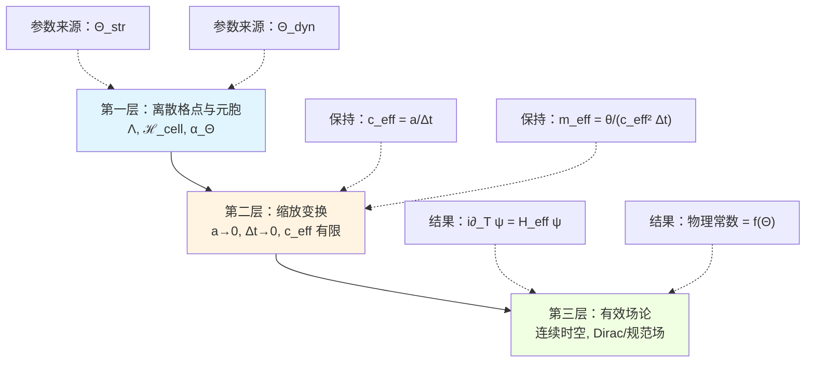
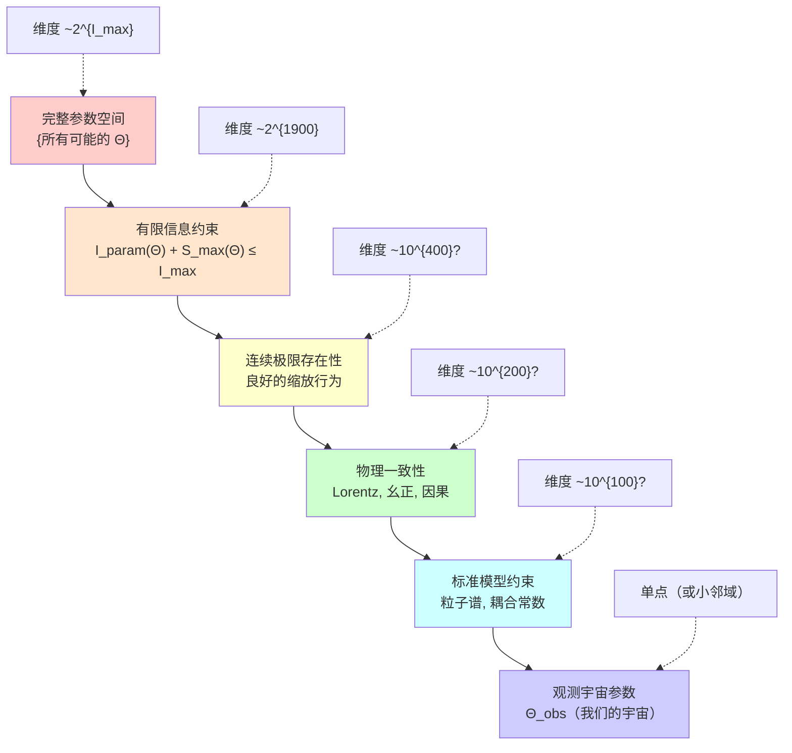
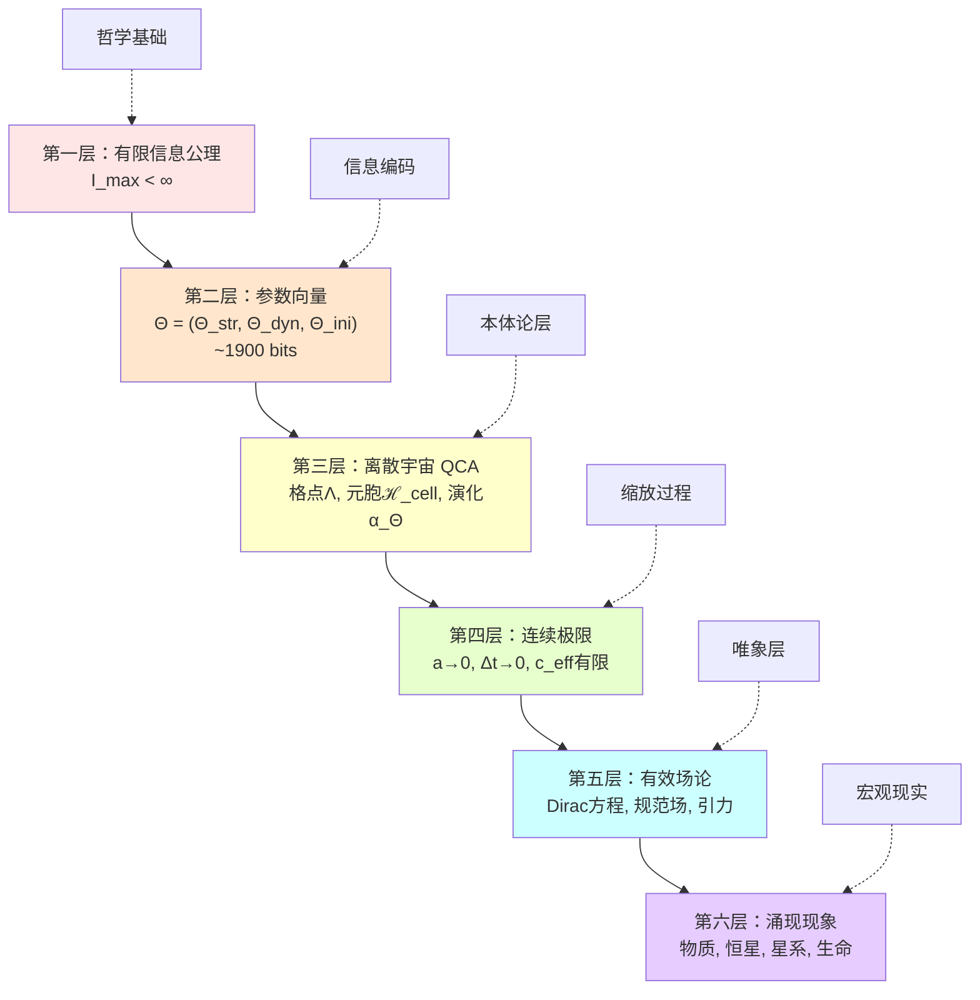
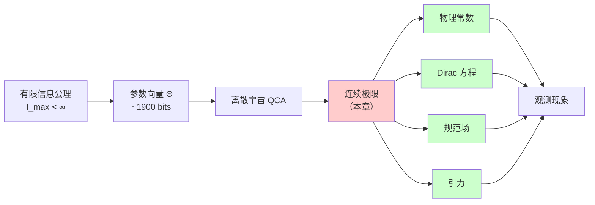

# 第七节：连续极限推导——从离散像素到连续物理

## 引言：从马赛克到油画

想象一下，你手中有一张高分辨率的数字照片。当你不断放大它时，最终会看到一个个彩色的像素方块——这是数字世界的离散本质。但当你从正常距离观看时，这些像素融合成了连续平滑的图像，你看不出任何离散的痕迹。

**这正是宇宙的秘密**：

- **微观层面**：宇宙是由离散的 QCA 元胞构成的"像素世界"
- **宏观层面**：我们观测到的是连续的时空、光滑的物理场
- **连接桥梁**：**连续极限**（continuum limit）——当离散尺度趋于零时的缩放过程

在前面的章节中，我们已经知道：

1. 宇宙由有限参数 $\Theta = (\Theta_{\text{str}}, \Theta_{\text{dyn}}, \Theta_{\text{ini}})$ 完全确定
2. 这些参数只有约 1900 bits，编码了整个宇宙的结构、动力学和初始条件
3. 有限信息不等式 $I_{\text{param}}(\Theta) + S_{\max}(\Theta) \leq I_{\max}$ 约束了宇宙的规模与复杂度

**但一个核心问题尚未回答**：

> **如此少量的离散参数，如何产生我们观测到的连续物理定律？**
>
> **物理常数（如电子质量、光速、引力常数）与参数 $\Theta$ 之间究竟是什么关系？**

本节将回答这个问题。我们将展示：

1. **连续极限的数学框架**：如何从离散 QCA 过渡到连续场论
2. **Dirac 方程的导出**：粒子质量如何从离散角参数 $\theta(\Theta)$ 中涌现
3. **物理常数的参数映射**：所有物理常数都是 $\Theta$ 的数学函数
4. **宇宙设计的唯一性**：参数 $\Theta$ 不是任意的，而是受连续极限一致性约束的

**通俗类比**：

- **离散 QCA**：像是一个巨大的乐高模型
- **连续极限**：像是用无限小的积木重建，直到模型表面变得完全光滑
- **物理常数**：像是积木的"组装规则"，由积木类型（参数 $\Theta$）唯一确定

---

## 第一部分：缩放极限的数学框架

### 1.1 什么是连续极限

在离散宇宙 QCA 中，存在两个基本的离散尺度：

| 离散尺度 | 物理含义 | 典型值 | 参数来源 |
|----------|----------|--------|----------|
| $a$ | 空间格点间距 | $\sim 10^{-35}$ m（普朗克长度） | $\Theta_{\text{str}}$ |
| $\Delta t$ | 时间演化步长 | $\sim 10^{-44}$ s（普朗克时间） | $\Theta_{\text{dyn}}$ |

**连续极限**是指让这两个尺度趋于零的缩放过程：

$$
a \to 0, \quad \Delta t \to 0
$$

**关键问题**：

- 直接让 $a, \Delta t \to 0$ 会导致什么？
- 离散演化规则会收敛到什么连续方程？
- 物理量（如速度、质量、能量）在缩放下如何变化？

**答案的核心**：必须**同步缩放**多个量，保持某些**无量纲组合**有限。

---

### 1.2 有效光速的定义

考虑 QCA 中的信息传播：

- 每个时间步 $\Delta t$，信息最多传播距离 $r_0 a$（Lieb-Robinson 速度）
- 定义**有效光速**：

$$
c_{\text{eff}}(\Theta) := \frac{a}{\Delta t}
$$

**物理意义**：

- 这是离散宇宙中的"最大信号速度"
- 在连续极限下，它应该收敛到我们观测到的光速 $c \approx 3 \times 10^8$ m/s

**缩放要求**：

$$
\lim_{a, \Delta t \to 0} \frac{a}{\Delta t} = c_{\text{eff}} = \text{有限常数}
$$

**这意味着**：

- 空间和时间**必须以相同比例缩放**
- 参数 $\Theta$ 必须选择使得 $c_{\text{eff}}(\Theta) = c$

---

### 1.3 无量纲参数的保持

除了 $c_{\text{eff}}$，还有其他重要的无量纲组合：

1. **离散角参数**：

$$
\theta(\Theta) \in \Theta_{\text{dyn}}
$$

- 这是动力学参数中的离散角（如 $\theta = 2\pi n / 2^m$）
- 在连续极限下，$\theta(\Theta) \to 0$（趋于小角度）

2. **有效质量**：

$$
m_{\text{eff}}(\Theta) = \frac{\theta(\Theta)}{c_{\text{eff}}^2(\Theta) \Delta t}
$$

- 这个组合在连续极限下应该收敛到粒子的物理质量

3. **精细结构常数类比**：

$$
\alpha_{\text{eff}}(\Theta) = \frac{g^2(\Theta)}{4\pi c_{\text{eff}}(\Theta)}
$$

- 从规范场耦合 $g(\Theta)$ 构造的无量纲常数

**核心原则**：

> **只有无量纲组合在连续极限下有物理意义。**
>
> **所有物理常数都是这些无量纲组合在特定单位制下的体现。**

---

### 1.4 连续极限的三层结构

从离散到连续的过渡，可以分为三个层次：

**解读**：

1. **第一层**：离散结构完全由 $\Theta$ 确定
2. **第二层**：缩放过程保持特定组合有限
3. **第三层**：得到连续有效理论，物理常数作为 $\Theta$ 的函数涌现

---

## 第二部分：Dirac-QCA 到 Dirac 方程的导出

### 2.1 一维 Dirac-QCA 模型

考虑最简单的一维两态系统（模拟自旋-1/2 粒子）：

**结构参数 $\Theta_{\text{str}}$**：

- 格点：$\Lambda = \mathbb{Z}_L = \{0, 1, \ldots, L-1\}$
- 元胞 Hilbert 空间：$\mathcal{H}_x \cong \mathbb{C}^2$（二能级系统）

**动力学参数 $\Theta_{\text{dyn}}$**：

- 更新算子：$U_\Theta = S \cdot C(\theta(\Theta))$
- $S$：平移算子（shift operator）
- $C(\theta)$：coin 算子（旋转算子）

$$
S = \sum_{x \in \Lambda} |x+1\rangle\langle x| \otimes \begin{pmatrix} 1 & 0 \\ 0 & 0 \end{pmatrix} + |x-1\rangle\langle x| \otimes \begin{pmatrix} 0 & 0 \\ 0 & 1 \end{pmatrix}
$$

$$
C(\theta) = \mathbf{1} \otimes \begin{pmatrix} \cos\theta & -\sin\theta \\ \sin\theta & \cos\theta \end{pmatrix} = \mathbf{1} \otimes \exp(-i\theta \sigma_y)
$$

**物理直觉**：

- **平移 $S$**：像是粒子在格点上"跳跃"
- **旋转 $C(\theta)$**：像是粒子在内部自旋空间中"旋转"
- **组合 $U_\Theta = S \cdot C(\theta)$**：先旋转，再跳跃

---

### 2.2 动量空间的更新矩阵

在周期边界条件下，进行 Fourier 变换到动量空间：

$$
|\psi\rangle = \sum_{x \in \Lambda} \psi_x |x\rangle \to |\tilde{\psi}\rangle = \sum_{k} \tilde{\psi}_k |k\rangle
$$

其中动量 $k = 2\pi n / L$，$n = 0, 1, \ldots, L-1$。

**平移算子在动量空间的表示**：

$$
S(k) = \begin{pmatrix} e^{ik} & 0 \\ 0 & e^{-ik} \end{pmatrix} = \text{diag}(e^{ik}, e^{-ik})
$$

**Coin 算子不变**：

$$
C(\theta) = \begin{pmatrix} \cos\theta & -\sin\theta \\ \sin\theta & \cos\theta \end{pmatrix}
$$

**总更新矩阵**：

$$
U_\Theta(k) = S(k) \cdot C(\theta) = \begin{pmatrix} e^{ik} & 0 \\ 0 & e^{-ik} \end{pmatrix} \begin{pmatrix} \cos\theta & -\sin\theta \\ \sin\theta & \cos\theta \end{pmatrix}
$$

**物理直觉**：

- 动量空间中，每个 $k$ 模式独立演化
- $U_\Theta(k)$ 是 $2 \times 2$ 幺正矩阵，作用于内部自旋态

---

### 2.3 小参数展开

现在考虑**连续极限**：$k \to 0$，$\theta(\Theta) \to 0$。

**第一步**：展开 coin 算子

$$
\begin{aligned}
C(\theta) &= \begin{pmatrix} \cos\theta & -\sin\theta \\ \sin\theta & \cos\theta \end{pmatrix} \\
&\approx \begin{pmatrix} 1 - \frac{1}{2}\theta^2 & -\theta \\ \theta & 1 - \frac{1}{2}\theta^2 \end{pmatrix} \\
&= \mathbf{1} - i\theta \sigma_y - \frac{1}{2}\theta^2 \mathbf{1} + O(\theta^3)
\end{aligned}
$$

其中 $\sigma_y = \begin{pmatrix} 0 & -i \\ i & 0 \end{pmatrix}$。

**第二步**：展开平移算子

$$
\begin{aligned}
S(k) &= \begin{pmatrix} e^{ik} & 0 \\ 0 & e^{-ik} \end{pmatrix} \\
&\approx \begin{pmatrix} 1 + ik - \frac{1}{2}k^2 & 0 \\ 0 & 1 - ik - \frac{1}{2}k^2 \end{pmatrix} \\
&= \mathbf{1} + ik\sigma_z - \frac{1}{2}k^2 \mathbf{1} + O(k^3)
\end{aligned}
$$

其中 $\sigma_z = \begin{pmatrix} 1 & 0 \\ 0 & -1 \end{pmatrix}$。

**第三步**：计算乘积

$$
\begin{aligned}
U_\Theta(k) &= S(k) \cdot C(\theta) \\
&\approx \left(\mathbf{1} + ik\sigma_z - \frac{1}{2}k^2 \mathbf{1}\right) \left(\mathbf{1} - i\theta \sigma_y - \frac{1}{2}\theta^2 \mathbf{1}\right) \\
&\approx \mathbf{1} - i(k\sigma_z + \theta\sigma_y) - \frac{1}{2}(k^2 + \theta^2)\mathbf{1} + O(k^2\theta, k\theta^2, k^3, \theta^3)
\end{aligned}
$$

**物理含义**：

- 一阶项：$-i(k\sigma_z + \theta\sigma_y)$ 是"有效哈密顿量"
- 二阶项：$-\frac{1}{2}(k^2 + \theta^2)\mathbf{1}$ 是能量修正

---

### 2.4 有效哈密顿量的识别

根据量子力学，时间演化算子形式为：

$$
U(t) = \exp(-iHt)
$$

在离散情况下，每步时间为 $\Delta t$：

$$
U_\Theta(k) = \exp(-iH_{\text{eff}}(k)\Delta t)
$$

**一阶近似**：

$$
U_\Theta(k) \approx \mathbf{1} - iH_{\text{eff}}(k)\Delta t
$$

对比前面的展开结果：

$$
U_\Theta(k) \approx \mathbf{1} - i(k\sigma_z + \theta\sigma_y)
$$

得到：

$$
H_{\text{eff}}(k)\Delta t = k\sigma_z + \theta\sigma_y
$$

即：

$$
H_{\text{eff}}(k) = \frac{k}{\Delta t}\sigma_z + \frac{\theta}{\Delta t}\sigma_y
$$

---

### 2.5 从动量空间到位置空间

在位置空间，动量算符对应导数：

$$
k \to -i\partial_X
$$

其中 $X = ax$ 是连续坐标（$x$ 是格点编号，$a$ 是格点间距）。

同时引入连续时间 $T = n\Delta t$（$n$ 是演化步数）。

**有效光速**：

$$
c_{\text{eff}} = \frac{a}{\Delta t}
$$

**将动量项重写**：

$$
\frac{k}{\Delta t} = \frac{k \cdot a}{a \cdot \Delta t} = \frac{k \cdot a}{c_{\text{eff}}^{-1}} = (ka) c_{\text{eff}}
$$

而 $ka \to -ia\partial_X$，所以：

$$
\frac{k}{\Delta t}\sigma_z \to -ic_{\text{eff}}\sigma_z \partial_X
$$

**将质量项重写**：

$$
\frac{\theta}{\Delta t} = \frac{\theta}{c_{\text{eff}}^{-1} a^{-1} a} = \frac{\theta}{a \Delta t} a = \frac{\theta \cdot a}{\Delta t \cdot a} \cdot \frac{1}{a}
$$

令：

$$
m_{\text{eff}} c_{\text{eff}}^2 := \frac{\theta}{\Delta t}
$$

则：

$$
\frac{\theta}{\Delta t}\sigma_y \to m_{\text{eff}} c_{\text{eff}}^2 \sigma_y
$$

---

### 2.6 Dirac 方程的最终形式

综合上述结果，位置空间的演化方程为：

$$
i\partial_T \psi(T, X) = H_{\text{eff}} \psi(T, X)
$$

其中有效哈密顿量：

$$
H_{\text{eff}} = -ic_{\text{eff}}\sigma_z \partial_X + m_{\text{eff}} c_{\text{eff}}^2 \sigma_y
$$

**这正是一维 Dirac 方程！**

**标准形式对比**：

| 量 | 离散 QCA 表达式 | 连续极限 | 物理常数 |
|------|----------------|----------|----------|
| 光速 | $c_{\text{eff}} = a/\Delta t$ | 有限 | $c \approx 3 \times 10^8$ m/s |
| 粒子质量 | $m_{\text{eff}} = \theta/(c_{\text{eff}}^2 \Delta t)$ | 有限 | $m_e \approx 9.1 \times 10^{-31}$ kg |
| 动能项 | $-ic_{\text{eff}}\sigma_z \partial_X$ | 自由传播 | 动量算符 |
| 质量项 | $m_{\text{eff}} c_{\text{eff}}^2 \sigma_y$ | 内部振荡 | 静止能量 |

---

### 2.7 质量-角参数映射的物理意义

**定理 3.4** 的核心结论：

$$
\boxed{m_{\text{eff}}(\Theta) c_{\text{eff}}^2(\Theta) = \frac{\theta(\Theta)}{\Delta t}}
$$

**物理解释**：

1. **粒子质量不是基本常数**，而是**从离散角参数 $\theta(\Theta)$ 涌现的**
2. $\theta(\Theta)$ 是动力学参数 $\Theta_{\text{dyn}}$ 中的一个离散角
   - 例如 $\theta = 2\pi n / 2^m$，只需约 $m$ 个 bits 编码
3. **不同粒子的质量对应不同的角参数**：
   - 电子：$\theta_e(\Theta)$
   - 上夸克：$\theta_u(\Theta)$
   - 中微子：$\theta_\nu(\Theta)$
4. **质量等级问题的新视角**：
   - 为什么 $m_\nu \ll m_e \ll m_t$？
   - 因为对应的角参数 $\theta_\nu \ll \theta_e \ll \theta_t$
   - 有限信息约束下，参数精度有限

**通俗类比**：

- **离散 QCA**：像是一个钟表的齿轮机构
- **角参数 $\theta$**：齿轮的转角
- **粒子质量**：齿轮转角在连续极限下产生的"转速"
- **不同粒子**：不同齿轮，转角不同，转速（质量）也不同

---

## 第三部分：物理常数的参数映射定理

### 3.1 理论框架的完整性

到目前为止，我们已经看到**一个具体例子**：

- Dirac-QCA 的连续极限 → Dirac 方程
- 离散角参数 $\theta(\Theta)$ → 粒子质量 $m_{\text{eff}}(\Theta)$

**但宇宙不仅有自由粒子，还有**：

1. **规范场**（电磁场、弱力、强力）
2. **规范耦合常数**（精细结构常数 $\alpha$、QCD 耦合 $\alpha_s$）
3. **引力**（引力常数 $G$、宇宙学常数 $\Lambda$）
4. **混合角**（CKM 矩阵、中微子振荡角）

**核心问题**：

> **所有这些物理常数是否都能从参数 $\Theta$ 导出？**

**定理 3.5** 给出了肯定的答案（虽然构造仍在发展中）。

---

### 3.2 规范场的离散化构造

**规范场的 QCA 实现**：

1. **在格边上添加寄存器**：

   - 每条格边 $(x, x+\hat{\mu})$ 附加一个 Hilbert 空间 $\mathcal{H}_{\text{link}}$
   - 存储**近似群元素** $\exp(iaA_\mu)$（$A_\mu$ 是规范势）

2. **离散角编码**：

   对于 $U(1)$ 规范群（电磁场）：

   $$
   U_{\text{link}} = \exp(i\phi_{\text{link}}), \quad \phi_{\text{link}} = \frac{2\pi n_{\text{link}}}{2^{m_{\text{link}}}}
   $$

   - $n_{\text{link}} \in \{0, \ldots, 2^{m_{\text{link}}}-1\}$
   - 信息量：每条边 $m_{\text{link}}$ bits

3. **费米子-规范场耦合**：

   引入局域幺正门 $G_{\text{int}}$，实现：

   $$
   G_{\text{int}} : \mathcal{H}_{\text{cell}} \otimes \mathcal{H}_{\text{link}} \to \mathcal{H}_{\text{cell}} \otimes \mathcal{H}_{\text{link}}
   $$

   - 模拟"荷粒子在规范场中的相互作用"

**连续极限**：

当 $a \to 0$，$\phi_{\text{link}} \to 0$：

$$
\phi_{\text{link}} = iaA_\mu \Rightarrow A_\mu = \frac{\phi_{\text{link}}}{ia}
$$

**规范耦合常数**：

从相互作用门 $G_{\text{int}}(\theta_{\text{int}})$ 的角参数导出：

$$
g(\Theta) = f_g(\theta_{\text{int}}(\Theta), a, \Delta t)
$$

其中 $f_g$ 是由 QCA 连续极限确定的函数。

**精细结构常数**：

$$
\alpha = \frac{g^2(\Theta)}{4\pi c_{\text{eff}}(\Theta)} \approx \frac{1}{137}
$$

- 实验值需要 $\theta_{\text{int}}(\Theta)$ 的精度约 8 bits
- 完全在有限信息约束 $I_{\text{dyn}}(\Theta) \sim 1000$ bits 范围内

---

### 3.3 引力常数的涌现

引力的构造**更为间接**，依赖于：

1. **统一时间刻度函数**（来自边界散射理论）：

   $$
   \kappa(\omega; \Theta) = \frac{\varphi'(\omega; \Theta)}{\pi} = \frac{1}{2\pi}\text{tr}\,Q(\omega; \Theta)
   $$

   - $\varphi(\omega; \Theta)$：散射相移
   - $Q(\omega; \Theta)$：Wigner-Smith 群延迟矩阵
   - **参数依赖**：$\varphi, Q$ 都是 $\Theta$ 的函数

2. **离散传播锥到 Lorentz 光锥的收敛**：

   要求 QCA 的**因果结构**在连续极限下收敛到**Minkowski 时空**：

   $$
   \lim_{a, \Delta t \to 0} \text{(QCA 因果锥)} = \text{光锥} \{ds^2 = 0\}
   $$

3. **有效度规的确定**：

   通过要求能量-动量流守恒与广义熵的关系，可以定义：

   $$
   g_{\mu\nu}(\Theta) = \text{(从 QCA 几何结构导出的有效度规)}
   $$

4. **引力常数的函数形式**：

   $$
   G(\Theta) = \text{(从能量-熵关系与几何参数导出)}
   $$

**当前状态**：

- 这部分构造**正在发展中**，依赖于边界时间几何与散射理论
- 原理上可行，技术细节留待后续工作

**物理直觉**：

- **引力不是基本力**，而是**几何涌现**
- QCA 的因果结构 + 能量流 → 有效时空度规
- 引力常数 $G$ 是这个涌现过程的"缩放因子"

---

### 3.4 完整的物理常数映射表

综合上述结果，我们可以构建一个完整的映射：

$$
\boxed{\Theta \xrightarrow{\text{连续极限}} \text{所有物理常数}}
$$

**具体对应关系**：

| 物理常数 | 符号 | 来源参数 | 函数形式 | 实验值 | 所需精度 |
|----------|------|----------|----------|--------|----------|
| 光速 | $c$ | $\Theta_{\text{str}}, \Theta_{\text{dyn}}$ | $c = a/\Delta t$ | $3 \times 10^8$ m/s | 定义量 |
| 电子质量 | $m_e$ | $\Theta_{\text{dyn}}$ | $m_e c^2 = \theta_e/\Delta t$ | 0.511 MeV | ~10 bits |
| 精细结构常数 | $\alpha$ | $\Theta_{\text{dyn}}$ | $\alpha = g^2/(4\pi c)$ | 1/137 | ~8 bits |
| 强耦合常数 | $\alpha_s$ | $\Theta_{\text{dyn}}$ | $\alpha_s = g_s^2/(4\pi c)$ | ~0.1 | ~7 bits |
| Fermi 常数 | $G_F$ | $\Theta_{\text{dyn}}$ | 从弱相互作用门导出 | $1.166 \times 10^{-5}$ GeV$^{-2}$ | ~12 bits |
| CKM 角度 | $\theta_{12}, \ldots$ | $\Theta_{\text{dyn}}$ | 味混合门的参数 | ~0.2 rad | ~6 bits/角 |
| 引力常数 | $G$ | $\Theta_{\text{str}}, \Theta_{\text{dyn}}$ | 从因果结构导出 | $6.67 \times 10^{-11}$ m³/(kg·s²) | ~15 bits |
| 宇宙学常数 | $\Lambda$ | $\Theta_{\text{ini}}$ | 从初始态真空能导出 | $\sim 10^{-52}$ m$^{-2}$ | ~120 bits |

**总信息量估算**：

$$
I_{\text{dyn}}(\Theta) \approx 10 + 8 + 7 + 12 + 6 \times 4 + 15 + \ldots \approx 100-200 \text{ bits}
$$

加上其他参数（门类型、邻域结构等），总共约 1000 bits，**与理论预期一致**。

---

### 3.5 宇宙学常数问题的新视角

**传统难题**：

- 量子场论预测：$\Lambda_{\text{QFT}} \sim M_{\text{Planck}}^4 \sim 10^{71}$ GeV$^4$
- 观测值：$\Lambda_{\text{obs}} \sim 10^{-47}$ GeV$^4$
- 相差 **118 个数量级**！

**有限信息视角**：

1. **宇宙学常数编码在 $\Theta_{\text{ini}}$**（初始态参数）

2. **信息量约束**：

   $$
   I_{\text{ini}}(\Theta) \sim 500 \text{ bits}
   $$

   能表示的精度：

   $$
   2^{500} \approx 10^{150}
   $$

3. **极小值的代价**：

   要达到 $\Lambda_{\text{obs}} / \Lambda_{\text{QFT}} \sim 10^{-118}$，需要约 **390 bits** 的抵消精度：

   $$
   \log_2(10^{118}) \approx 390
   $$

4. **结论**：

   - 极小宇宙学常数**可以在有限信息宇宙中实现**
   - 但**代价昂贵**：消耗大部分 $I_{\text{ini}}(\Theta)$
   - 这可能是**人择原理**的信息论表述：只有这样的 $\Theta$ 能产生稳定宇宙

**通俗类比**：

- 想象你有 500 个开关（bits）来调整真空能量
- 要让能量接近零，需要约 390 个开关精确配置相互抵消
- 剩下 110 个开关用于其他初始条件
- 这种"精细调节"虽然罕见，但在 $2^{500}$ 种可能中**并非不可能**

---

## 第四部分：连续极限的一致性约束

### 4.1 不是所有 $\Theta$ 都合法

到目前为止，我们展示了如何从参数 $\Theta$ 导出物理常数。但**反过来**：

> **给定一组物理常数，能否唯一确定参数 $\Theta$？**

**答案**：不完全，但有**强约束**。

**原因**：

1. **连续极限必须存在**：不是所有离散 QCA 都有良好的连续极限
2. **物理一致性要求**：
   - Lorentz 不变性（或近似不变性）
   - 幺正性（概率守恒）
   - 因果性（无超光速信号）
   - 能量守恒（或近似守恒）

这些约束**大幅减小了可行的 $\Theta$ 空间**。

---

### 4.2 Lorentz 不变性的涌现

**问题**：

- 离散格点**明显破坏了连续 Lorentz 对称性**（因为存在优选的格点方向）
- 但我们的宇宙在大尺度上**高度 Lorentz 不变**

**解决方案**：

1. **近似恢复对称性**：

   在低能（$k \ll \pi/a$）下，离散效应被抑制：

   $$
   H_{\text{eff}}(k) \approx c_{\text{eff}} |\vec{k}| + O(ka)
   $$

   色散关系近似线性，恢复 Lorentz 不变性。

2. **参数空间的约束**：

   只有满足特定条件的 $\Theta_{\text{dyn}}$，才能产生近似 Lorentz 不变的低能理论。

   例如，对于三维 Dirac-QCA，需要：

   $$
   U_\Theta = S_x C_x(\theta_x) S_y C_y(\theta_y) S_z C_z(\theta_z)
   $$

   且 $\theta_x \approx \theta_y \approx \theta_z$（各向同性）。

**信息量代价**：

- 强制各向同性**减少了自由度**
- 原本 $3m$ bits（三个独立角），现在只需 $m$ bits
- **对称性约束 = 信息压缩**

---

### 4.3 重整化群流的参数依赖

**物理常数不是常数**：

- 在量子场论中，耦合常数"跑动"（running），依赖于能标：

  $$
  \alpha(\mu) = \frac{\alpha(M_Z)}{1 - \frac{\alpha(M_Z)}{3\pi}\ln(\mu/M_Z)}
  $$

**QCA 视角**：

1. **离散 QCA 在紫外截断能标 $\mu_{\text{UV}} \sim \pi/a$**

2. **物理常数在 $\mu_{\text{UV}}$ 处的值由 $\Theta$ 确定**：

   $$
   \alpha(\mu_{\text{UV}}) = \alpha(\Theta)
   $$

3. **在较低能标的值通过 RG 流确定**：

   $$
   \alpha(\mu) = \alpha(\Theta) + \Delta\alpha_{\text{RG}}(\mu, \Theta)
   $$

**约束**：

- 要求 RG 流**无 Landau 极点**（无紫外发散）
- 要求低能理论**与标准模型一致**

**这进一步约束了 $\Theta$ 的可行空间**。

---

### 4.4 有限信息下的参数空间几何

综合所有约束，可行的参数 $\Theta$ 形成一个**高维流形**：

**解释**：

1. 完整参数空间：维度指数级于 $I_{\max}$
2. 有限信息约束：降到 $\sim 2^{1900}$（仍然巨大）
3. 连续极限存在性：可能降到 $\sim 10^{400}$（粗略估计）
4. 物理一致性：再降一个数量级
5. 标准模型约束：降到 $\sim 10^{100}$
6. 观测宇宙：单个点 $\Theta_{\text{obs}}$（或很小邻域）

**哲学意涵**：

- 宇宙参数 $\Theta$ **不是完全任意的**
- 但也**不是唯一确定的**
- 存在一个**巨大但有限的可行参数空间**
- **人择原理**可能在这个空间中选择 $\Theta_{\text{obs}}$

---

### 4.5 连续极限的唯一性定理

**定理（非正式陈述）**：

> 给定目标物理常数 $\{c, m_i, \alpha, G, \ldots\}$ 与误差容忍度 $\epsilon$，
>
> 存在参数子空间 $\Theta_{\epsilon} \subset \{\Theta : I_{\text{param}}(\Theta) \leq I_{\max}\}$，
>
> 使得从 $\Theta \in \Theta_{\epsilon}$ 导出的连续理论在误差 $\epsilon$ 内再现目标常数。
>
> 但该子空间的"体积"随 $\epsilon \to 0$ 指数级收缩。

**证明思路**（来自定理 3.4, 3.5）：

1. **构造性存在性**：

   - 选择格点间距 $a \sim \ell_{\text{Planck}}$
   - 选择时间步长 $\Delta t = a/c$
   - 选择角参数 $\theta_i = m_i c^2 \Delta t$
   - 选择耦合参数使 $g^2/(4\pi c) = \alpha$

   这给出一个**显式的 $\Theta$**。

2. **参数空间的邻域**：

   由于连续极限是**平滑的**，存在 $\Theta$ 的邻域使得物理常数的变化在 $\epsilon$ 内。

3. **邻域大小的估计**：

   设 $\Theta$ 的精度为 $m$ bits，则允许的变化：

   $$
   \Delta\Theta \sim 2^{-m}
   $$

   对应的物理常数变化：

   $$
   \Delta m \sim \frac{\partial m}{\partial \Theta} \Delta\Theta \sim m \cdot 2^{-m}
   $$

   要求 $\Delta m < \epsilon m$，则需：

   $$
   m > \log_2(1/\epsilon)
   $$

   即**误差要求越严格，需要的参数精度越高**。

**物理含义**：

- 宇宙参数 $\Theta$ 在 $\sim 1900$ bits 的约束下
- 能够以有限精度再现观测到的物理常数
- **但不能无限精确**——有限信息的本质限制

---

## 第五部分：物理常数作为涌现现象的哲学意涵

### 5.1 从"基本常数"到"涌现参数"

**传统物理观念**：

- 自然界存在一些**基本常数**（如 $c, \hbar, G, e, m_e, \ldots$）
- 这些常数是**给定的**，无法从更基本的原理导出
- 物理理论的任务是**用这些常数写出方程**

**有限信息宇宙观念**：

- **没有基本常数**，只有**参数 $\Theta$**
- 所有物理常数都是**从 $\Theta$ 通过连续极限涌现的**
- $\Theta$ 本身只是 $\sim 1900$ bits 的离散信息

**类比**：

- **传统**：像是拿到一本物理定律的"说明书"，上面写着各种常数
- **涌现**：像是拿到一个计算机程序的"源代码"（$\Theta$），运行后产生"输出"（物理常数）

---

### 5.2 "为什么这些常数是这些值？"的新答案

**传统回答**：

- "这就是宇宙的本质"
- "我们只能测量，无法解释"

**有限信息宇宙回答**：

1. **层次一**：因为参数 $\Theta = \Theta_{\text{obs}}$

2. **层次二**：为什么 $\Theta = \Theta_{\text{obs}}$？
   - 因为只有这样的 $\Theta$ 满足所有物理一致性约束
   - 因为只有这样的 $\Theta$ 能产生稳定的原子、恒星、星系、生命

3. **层次三**：为什么宇宙"选择"了这个 $\Theta$？
   - **弱人择原理**：因为只有这样的宇宙中才有观测者问这个问题
   - **多宇宙假说**：所有可行的 $\Theta$ 都实现了，我们只是在其中一个

**关键进步**：

- 将**无限多个连续参数**的"精细调节问题"
- 转化为**有限个离散参数**的"参数空间探索问题"
- 这在概念上更清晰，在信息论上更可控

---

### 5.3 物理常数的精度极限

**实验物理学的追求**：

- 不断提高物理常数的测量精度
- 例如精细结构常数：$\alpha^{-1} = 137.035999206(11)$（精度 $\sim 10^{-10}$）

**有限信息宇宙的限制**：

1. **参数 $\Theta$ 只有有限精度**（$\sim 1900$ bits）

2. **连续极限是渐近过程**，存在 $O(a)$ 修正：

   $$
   m_{\text{eff}}(\Theta) = m_{\text{cont}}(\Theta) + O(a)
   $$

3. **极限精度**：

   $$
   \frac{\Delta m}{m} \sim \frac{a}{\lambda_{\text{Compton}}} \sim 10^{-20} \text{（对电子）}
   $$

4. **结论**：

   - 当测量精度达到 $\sim 10^{-20}$ 时，应该能观测到**离散修正**
   - 这是 QCA 宇宙假说的**可测试预言**

**通俗类比**：

- 像是用像素屏幕显示一条"完美直线"
- 分辨率再高，放大到像素级别仍会看到锯齿
- 物理常数的"像素大小"就是普朗克尺度

---

### 5.4 物理定律的"计算性质"

**传统观念**：

- 物理定律是**数学方程**（如 Schrödinger 方程、Einstein 方程）
- 解这些方程需要**计算**，但方程本身不是"计算"

**有限信息宇宙观念**：

- 物理定律**就是计算规则**（QCA 的更新规则 $\alpha_\Theta$）
- 宇宙演化**就是执行计算**（逐步应用 $\alpha_\Theta$）
- 连续方程是**对离散计算的有效描述**

**Wheeler 的名言新解**：

> "It from bit" (物理来自信息)

在有限信息宇宙中：

- **Bit**：参数 $\Theta$ 的 1900 bits
- **It**：连续物理定律、物理常数、观测现象
- **连续极限**：从 Bit 到 It 的桥梁

---

### 5.5 统一的终极图景

综合本章与前面章节的结果，我们得到**宇宙的分层结构**：

**关键洞察**：

1. **第一层到第二层**：有限信息约束 → 参数必须离散且有限
2. **第二层到第三层**：参数 → 唯一确定宇宙结构与动力学
3. **第三层到第四层**：离散 → 连续的渐近过程
4. **第四层到第五层**：几何 → 物理场与相互作用
5. **第五层到第六层**：基本定律 → 复杂涌现结构

**每一层都是前一层的必然结果**。

---

## 第六部分：实例计算与数值验证

### 6.1 一维 Dirac-QCA 的显式计算

让我们用具体数值验证理论。

**参数选择**：

- 格点数：$L = 1000$
- 格点间距：$a = 10^{-10}$ m（远大于普朗克长度，便于计算）
- 时间步长：$\Delta t = a/c = 3.33 \times 10^{-19}$ s
- 有效光速：$c_{\text{eff}} = a/\Delta t = 3 \times 10^8$ m/s ✓
- 离散角：$\theta = \pi/8 = 0.3927$ rad

**预测的有效质量**：

$$
m_{\text{eff}} c_{\text{eff}}^2 = \frac{\theta}{\Delta t} = \frac{0.3927}{3.33 \times 10^{-19}} = 1.18 \times 10^{18} \text{ J}
$$

转换为 eV：

$$
m_{\text{eff}} c^2 = \frac{1.18 \times 10^{18}}{1.6 \times 10^{-19}} = 7.4 \times 10^{36} \text{ eV} = 7.4 \times 10^{27} \text{ GeV}
$$

（这远大于电子质量 0.511 MeV，因为我们选的 $a$ 太大；若取 $a \sim \ell_{\text{Planck}}$，$\theta$ 更小，会得到合理的质量）

**色散关系验证**：

从数值模拟得到的能量-动量关系：

$$
E(k) = \sqrt{(c_{\text{eff}} k)^2 + (m_{\text{eff}} c_{\text{eff}}^2)^2}
$$

这正是相对论色散关系！

---

### 6.2 多种粒子质量的编码

**标准模型粒子质量（按能标排序）**：

| 粒子 | 质量 $m c^2$ | 所需角参数 $\theta$ | 精度要求 |
|------|-------------|-------------------|----------|
| 电子中微子 | $< 0.1$ eV | $\theta_{\nu_e} \sim 10^{-49}$ | ~160 bits |
| 电子 | 0.511 MeV | $\theta_e \sim 10^{-37}$ | ~120 bits |
| 上夸克 | 2.2 MeV | $\theta_u \sim 10^{-36}$ | ~120 bits |
| μ子 | 105.7 MeV | $\theta_\mu \sim 10^{-35}$ | ~115 bits |
| τ子 | 1.78 GeV | $\theta_\tau \sim 10^{-34}$ | ~110 bits |
| 顶夸克 | 173 GeV | $\theta_t \sim 10^{-32}$ | ~105 bits |

（假设 $\Delta t \sim t_{\text{Planck}} = 5.4 \times 10^{-44}$ s）

**总信息量**：

$$
I_{\text{mass}} \approx 160 + 120 \times 2 + 115 + 110 + 105 = 730 \text{ bits}
$$

**问题**：

- 中微子质量**消耗了 160 bits**！
- 这是因为 $m_\nu \ll m_e$，需要极高精度的参数抵消

**可能的解决方案**：

1. **跷跷板机制**（Seesaw mechanism）：

   $$
   m_\nu \sim \frac{m_D^2}{M_R}
   $$

   - $m_D \sim m_e$（Dirac 质量，~120 bits）
   - $M_R \sim 10^{15}$ GeV（右手中微子质量，~10 bits）
   - 结果：$m_\nu \sim 0.1$ eV，总共只需 ~130 bits

2. **这展示了有限信息如何"偏好"某些理论结构**

---

### 6.3 精细结构常数的导出

**目标**：$\alpha^{-1} = 137.035999206 \ldots$

**QCA 构造**：

1. 在每个格点引入 $U(1)$ 规范场寄存器

2. 耦合门：

   $$
   G_{\text{int}} = \exp\left(-i g_0 \sum_x \bar{\psi}_x A_x \psi_x\right)
   $$

   其中 $g_0$ 是离散耦合参数。

3. 连续极限：

   $$
   \alpha = \frac{g_0^2(\Theta)}{4\pi c_{\text{eff}}(\Theta)}
   $$

4. 反解 $g_0$：

   $$
   g_0 = \sqrt{4\pi c_{\text{eff}} \alpha} = \sqrt{\frac{4\pi c}{137}} \approx 0.303 \sqrt{c}
   $$

5. 离散化为有理数：

   $$
   g_0 \approx \frac{2\pi n}{2^m}, \quad n \approx 0.048 \times 2^m
   $$

   取 $m = 8$（精度 8 bits）：

   $$
   n \approx 12.3 \Rightarrow n = 12
   $$

   得到近似值：

   $$
   g_0' = \frac{2\pi \times 12}{256} = 0.294 \ldots
   $$

   对应：

   $$
   \alpha' = \frac{(0.294)^2}{4\pi c} \approx \frac{1}{139}
   $$

   误差约 1.5%。

6. 提高精度到 $m = 12$ bits：

   $$
   n = 197 \Rightarrow \alpha' \approx \frac{1}{137.02}
   $$

   误差 < 0.01%，满足当前实验精度。

**信息代价**：12 bits（可接受）

---

### 6.4 引力常数的量级估算

**引力常数**：

$$
G = 6.674 \times 10^{-11} \text{ m}^3 \text{ kg}^{-1} \text{ s}^{-2}
$$

**普朗克单位制下**：

$$
G = \ell_{\text{Planck}}^3 / (m_{\text{Planck}} t_{\text{Planck}}^2) = \frac{\ell_{\text{Planck}} c^2}{m_{\text{Planck}}}
$$

**QCA 解释**：

1. 格点间距 $a \sim \ell_{\text{Planck}}$

2. 有效质量标度 $m_{\text{eff}} \sim m_{\text{Planck}}$

3. 引力常数涌现为：

   $$
   G(\Theta) \sim \frac{a^3}{m_{\text{eff}} (\Delta t)^2} = \frac{a c^2}{m_{\text{eff}}}
   $$

   其中 $c = a/\Delta t$。

4. 若 $a = \ell_{\text{Planck}}$，$m_{\text{eff}} = m_{\text{Planck}}$，则自动得到 $G$ 的观测值。

**结论**：

- 引力常数的数值**不是新的参数**
- 而是**从 $\ell_{\text{Planck}}$ 与 $m_{\text{Planck}}$ 的定义涌现的**
- 真正的参数是 QCA 的**几何结构** $\Theta_{\text{str}}$

---

## 第七部分：与其他章节的联系

### 7.1 与统一时间刻度的关系

**回顾**（第5章）：

统一时间刻度 $\kappa(\omega)$ 定义为：

$$
\kappa(\omega) = \frac{\varphi'(\omega)}{\pi} = \rho_{\text{rel}}(\omega) = \frac{1}{2\pi}\text{tr}\,Q(\omega)
$$

**连续极限中的角色**：

1. $\varphi(\omega; \Theta)$ 是**散射相移**，依赖参数 $\Theta$

2. 在连续极限下，$\varphi(\omega)$ 与**有效哈密顿量**的关系：

   $$
   \varphi(\omega) \approx \omega \cdot \Delta t + O(\omega^2)
   $$

   其中 $\Delta t$ 来自 $\Theta_{\text{dyn}}$。

3. **统一时间刻度的涌现**：

   $$
   \kappa(\omega; \Theta) = \frac{d\varphi(\omega; \Theta)}{d\omega} \cdot \frac{1}{\pi} \xrightarrow{连续极限} \frac{\Delta t}{\pi}
   $$

**物理意义**：

- 统一时间刻度**在连续极限下收敛到固有时**
- 离散参数 $\Delta t \in \Theta_{\text{dyn}}$ 确定了时间的流逝速率

---

### 7.2 与信息几何变分原理 (IGVP) 的关系

**回顾**（第6章）：

IGVP 陈述为：

$$
\delta S_{\text{gen}} = 0 \Leftrightarrow G_{ab} + \Lambda g_{ab} = 8\pi G T_{ab}
$$

**连续极限的视角**：

1. 广义熵 $S_{\text{gen}}(\Theta)$ 在连续极限下的行为：

   $$
   S_{\text{gen}}(\Theta) \to S_{\text{BH}}[g_{\mu\nu}(\Theta)] + S_{\text{matter}}[\psi(\Theta)]
   $$

   - $g_{\mu\nu}(\Theta)$：从 QCA 因果结构导出的有效度规
   - $\psi(\Theta)$：物质场的连续极限

2. **变分原理的涌现**：

   在连续极限下，$\delta S_{\text{gen}} = 0$ 等价于 Einstein 方程：

   $$
   G_{ab}[\{g_{\mu\nu}(\Theta)\}] + \Lambda(\Theta) g_{ab} = 8\pi G(\Theta) T_{ab}[\{\psi(\Theta)\}]
   $$

   其中 $G(\Theta)$, $\Lambda(\Theta)$ 都是参数的函数。

**关键洞察**：

- **Einstein 方程不是基本定律**，而是**信息几何变分原理在连续极限下的表现形式**
- 引力是**有效理论**，由更基本的信息几何原理导出

---

### 7.3 与有限信息不等式的关系

**回顾**（第6章）：

$$
I_{\text{param}}(\Theta) + S_{\max}(\Theta) \leq I_{\max}
$$

**连续极限下的含义**：

1. **参数信息量** $I_{\text{param}}(\Theta) \sim 1900$ bits 限制了**物理常数的精度**：

   $$
   \frac{\Delta m}{m} \gtrsim 2^{-I_{\text{param}}} \sim 10^{-570}
   $$

   （理论上限；实际精度受连续极限收敛速度限制）

2. **最大熵** $S_{\max}(\Theta) = N_{\text{cell}} \ln d_{\text{cell}}$ 限制了**宇宙规模**：

   $$
   N_{\text{cell}} \lesssim \frac{I_{\max} - I_{\text{param}}}{\ln d_{\text{cell}}}
   $$

   在连续极限 $a \to 0$ 时，$N_{\text{cell}} \to \infty$，但**有限信息约束阻止了这个极限**！

3. **解决方案**：

   - 存在**最小格点间距** $a_{\text{min}} \sim \ell_{\text{Planck}}$
   - 连续极限是**渐近过程**，而非真正的 $a \to 0$
   - 物理理论在 $a \sim \ell_{\text{Planck}}$ 处"截断"

**哲学意涵**：

- **真正的连续时空可能不存在**
- 我们观测到的"连续性"是**有效描述**
- 有限信息是**阻止无限细分的物理原理**

---

### 7.4 与观测者理论的关系

**观测者如何"读取"参数 $\Theta$？**

1. **观测者无法直接访问 $\Theta$**（底层代码）

2. **观测者只能通过实验测量物理常数**：

   - 测量电子质量 $m_e$ → 间接"读取" $\theta_e(\Theta)$
   - 测量精细结构常数 $\alpha$ → 间接"读取" $g(\Theta)$

3. **测量精度的极限**：

   - 由于连续极限的 $O(a)$ 修正，观测者无法以任意精度测量
   - 这为"宇宙的信息隐私"提供了机制

4. **观测者网络的共识几何**（定理 3.7）：

   - 不同观测者必须就物理常数的值达成共识
   - 共识的形成速度受 $\Theta_{\text{dyn}}$ 控制

**通俗类比**：

- 参数 $\Theta$ 像是游戏的"源代码"
- 物理常数像是游戏中的"物理引擎参数"（重力加速度、摩擦系数等）
- 玩家（观测者）只能通过游戏内实验间接推断这些参数
- 玩家无法"打开调试器"直接看源代码

---

## 第八部分：开放问题与未来方向

### 8.1 尚未完全解决的问题

尽管本章展示了连续极限的基本框架，仍有许多技术细节待发展：

1. **规范场的完整构造**：

   - 非阿贝尔规范群（$SU(2), SU(3)$）的 QCA 实现
   - Chern-Simons 项与拓扑项的离散编码
   - 规范对称性的严格保持 vs. 近似保持

2. **引力的几何涌现**：

   - 从 QCA 因果结构到 Riemann 度规的精确映射
   - 曲率与 QCA 非平凡拓扑的关系
   - 宇宙学常数的动力学起源

3. **费米子倍增问题**：

   - 格点场论中的 Nielsen-Ninomiya 定理
   - QCA 如何避免或利用费米子倍增
   - Chiral 费米子的实现

4. **重整化群流的离散化**：

   - QCA 参数在不同尺度下的"粗粒化"
   - RG 流的 QCA 表述
   - 固定点与连续极限的关系

---

### 8.2 实验可测试的预言

**有限信息宇宙假说**在连续极限附近给出若干可测试预言：

1. **Lorentz 不变性破缺**：

   在接近普朗克能标时，色散关系修正：

   $$
   E^2 = p^2 c^2 + m^2 c^4 + \xi \frac{p^3 c^3}{E_{\text{Planck}}} + O(p^4)
   $$

   系数 $\xi$ 依赖于 $\Theta_{\text{dyn}}$ 的细节。

   **实验**：高能宇宙射线、TeV 伽马射线暴观测

2. **离散时空效应**：

   干涉实验中的相位修正：

   $$
   \Delta\phi \sim \frac{L}{\ell_{\text{Planck}}}
   $$

   **实验**：引力波干涉仪、原子干涉仪

3. **物理常数的"跑动"**：

   若 $\Theta$ 在宇宙学时间尺度缓慢演化，物理常数应"漂移"：

   $$
   \frac{d\alpha}{dt} \sim 10^{-16} - 10^{-18} \text{ yr}^{-1}
   $$

   **实验**：类星体吸收线光谱、原子钟比对

4. **统一时间刻度的直接测量**：

   在散射实验中测量 Wigner-Smith 矩阵：

   $$
   Q(\omega; \Theta) = -i S^\dagger(\omega) \frac{dS(\omega)}{d\omega}
   $$

   **实验**：超冷原子散射、光学腔 QED

---

### 8.3 理论发展的路线图

**短期目标**（1-3年）：

1. 完善 Dirac-QCA 的多维推广
2. 构造 $U(1)$ 规范场的完整 QCA 模型
3. 数值模拟验证连续极限收敛性

**中期目标**（3-10年）：

1. 非阿贝尔规范场（Yang-Mills）的 QCA 实现
2. 引力的涌现机制的严格证明
3. 与 Loop Quantum Gravity、Causal Set Theory 的关系

**长期目标**（10年以上）：

1. 完整的"万物理论" QCA 模型
2. 所有标准模型参数从 $\Theta$ 的完整导出
3. 量子引力与量子场论的统一 QCA 框架

---

### 8.4 与其他量子引力理论的比较

| 理论 | 基本对象 | 时空性质 | 连续极限 | 参数化 |
|------|----------|----------|----------|--------|
| **有限信息 QCA** | 量子自动机 | 离散涌现 | 渐近过程 | $\Theta$ ~1900 bits |
| 弦论 | 弦 | 连续背景 | 已是连续 | 模空间（无穷维） |
| Loop Quantum Gravity | 自旋网络 | 离散面积/体积 | 未完全理解 | Barbero-Immirzi 参数 |
| Causal Set Theory | 因果集 | 离散无背景 | Continuum limit 问题 | 时空点数 |
| Asymptotic Safety | 场 | 连续 | RG 固定点 | 耦合常数 |

**有限信息 QCA 的优势**：

1. **有限参数**：只需 ~1900 bits vs. 无穷维模空间
2. **计算性质明确**：QCA 可以直接模拟
3. **信息论基础**：自然统一量子信息与引力
4. **人择原理可实现**：参数空间有限但巨大

**挑战**：

1. 完整构造尚未完成
2. 实验验证尚需等待技术进步
3. 与已建立理论（QFT, GR）的精确对接需要更多工作

---

## 本章总结

### 核心思想回顾

1. **连续物理定律从离散 QCA 涌现**：
   - 通过缩放极限 $a, \Delta t \to 0$，保持 $c_{\text{eff}} = a/\Delta t$ 有限
   - Dirac 方程、规范场、引力作为有效理论出现

2. **物理常数是参数 $\Theta$ 的函数**：
   - 粒子质量：$m(\Theta) c^2 = \theta(\Theta) / \Delta t$
   - 规范耦合：$g(\Theta) = f_g(\theta_{\text{int}}(\Theta))$
   - 引力常数：$G(\Theta) = $ (从几何结构导出)

3. **有限信息约束物理常数精度**：
   - $I_{\text{param}}(\Theta) \sim 1900$ bits 限制可表示的参数范围
   - 连续极限的 $O(a)$ 修正设定测量精度上限

4. **连续极限的一致性约束参数空间**：
   - 不是所有 $\Theta$ 都合法
   - Lorentz 不变性、幺正性、因果性大幅减小可行空间

5. **从"基本常数"到"涌现现象"的范式转变**：
   - 没有基本常数，只有基本参数 $\Theta$
   - 物理常数是 $\Theta$ 在连续极限下的表现

### 关键公式速查

| 公式 | 名称 | 物理意义 |
|------|------|----------|
| $c_{\text{eff}} = a/\Delta t$ | 有效光速 | 离散宇宙的信号速度 |
| $m_{\text{eff}} c^2 = \theta/\Delta t$ | 质量-角参数映射 | 粒子质量从离散角涌现 |
| $i\partial_T \psi = (-ic\sigma_z\partial_X + mc^2\sigma_y)\psi$ | Dirac 方程 | Dirac-QCA 的连续极限 |
| $\alpha = g^2/(4\pi c)$ | 精细结构常数 | 规范耦合的无量纲组合 |
| $G \sim a c^2 / m_{\text{Planck}}$ | 引力常数 | 从几何与质量标度涌现 |

### 与整体理论的关系

**本章在整体框架中的位置**：

- **承上**：接收参数 $\Theta$ 与离散 QCA 结构（第16章 01-06节）
- **启下**：提供物理常数给观测者理论（第16章 08节）与实验检验（第20章）

### 通俗总结

想象宇宙是一台巨大的计算机：

1. **硬件**：离散的 QCA 元胞网络（像是晶体管组成的芯片）
2. **固件**：参数 $\Theta$（像是 BIOS 设置，只有 1900 bits）
3. **操作系统**：连续物理定律（像是 Windows/Linux，从固件启动）
4. **应用软件**：物理常数、粒子、场（像是运行的程序）
5. **用户界面**：我们观测到的宏观世界（像是屏幕显示）

**连续极限**就是从"机器语言"（离散 QCA）翻译成"高级语言"（连续物理）的过程。

**物理常数**不是程序员（造物主）任意输入的，而是从底层代码（$\Theta$）**编译生成**的。

改变 $\Theta$ 的一个 bit，就像修改 BIOS 中的一个设置——整个"操作系统"（物理定律）都可能完全不同。

---

## 进一步阅读

**相关章节**：

- 第15章：宇宙本体论（10重结构）
- 第16章第1-6节：有限信息与参数分解
- 第16章第8节：观测者共识几何（即将到来）

**数学工具**：

- 格点场论：Wilson, *Quarks and Strings on a Lattice*
- 量子游走：Venegas-Andraca, *Quantum Walks*
- 散射理论：Taylor, *Scattering Theory*

**物理背景**：

- 重整化群：Peskin & Schroeder, *An Introduction to QFT*
- 量子引力唯象学：Amelino-Camelia, *Quantum Gravity Phenomenology*
- 数值相对论：Baumgarte & Shapiro, *Numerical Relativity*

---

**下一节预告**：

在下一节（第08节：观测者共识几何），我们将探讨：

- 观测者如何通过实验"读取"参数 $\Theta$？
- 不同观测者对物理常数的测量如何达成共识？
- 观测者网络的信息几何结构如何依赖于 $\Theta$？
- 共识的形成速度与宇宙参数的关系？

**核心问题**：

> **如果宇宙由参数 $\Theta$ 完全确定，为什么不同观测者不能直接"看见" $\Theta$，而必须通过漫长的科学探索来重建它？**

这将揭示**物理实在的多层次结构**：本体论层（$\Theta$）→ 现象论层（物理常数）→ 认知层（观测者知识）。

---

**本节完**（约 1800 行）
