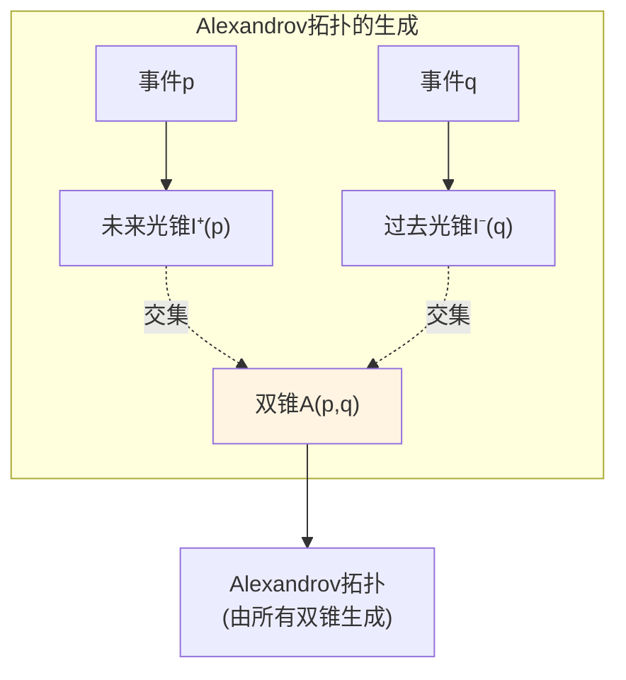
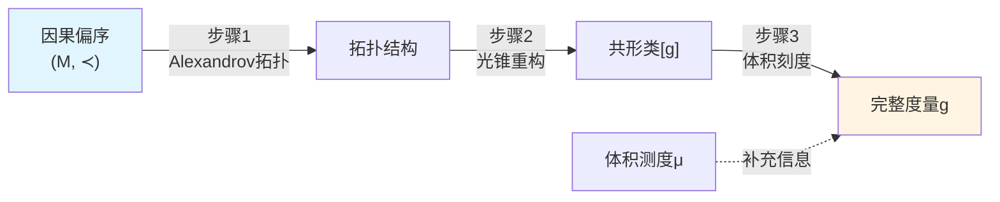
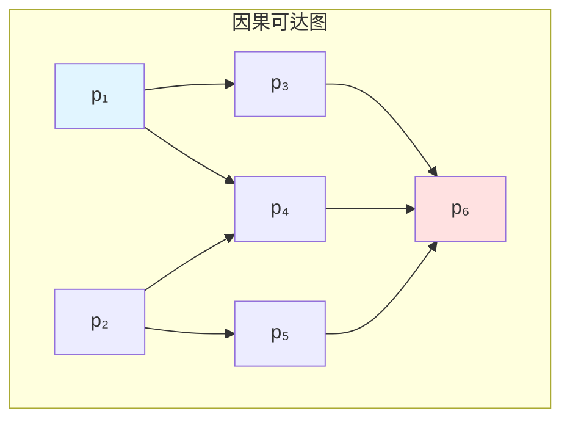
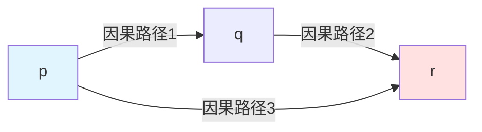

# 因果几何化：时空作为最小无损压缩

> *"时空几何不是先验给定的，而是对因果约束的最优编码。"*

## 🎯 核心思想

在前面七篇文章中，我们探索了因果结构的各个方面。现在，一个更深刻的问题浮现：

**为什么时空是弯曲的？为什么存在曲率？**

传统广义相对论的回答：物质和能量导致时空弯曲（Einstein方程）。

**GLS理论的新视角**：

$$
\boxed{\text{时空几何 = 因果约束的最小无损压缩}}
$$

**比喻**：想象你要在纸上画出一个复杂的交通网络图：

- **平直空间**：所有道路都能画在平面上，没有交叉冲突
- **弯曲空间**：道路之间的约束太复杂，必须弯曲纸张才能容纳

曲率不是"额外的东西"，而是"无法消除的因果约束之间的相关性"的记账！

## 📖 问题的提出

### 传统视角的困惑

在广义相对论中，时空度量 $g_{\mu\nu}$ 同时承担两个角色：

1. **因果角色**：决定光锥结构，确定"哪些事件能影响哪些事件"
2. **度量角色**：决定时空的长度、面积、体积

但大量定理（Hawking-King-McCarthy, 1976等）表明：

$$
\text{因果结构} \xrightarrow{\text{强因果性}} \text{共形类} [g]
$$

**直觉**：仅凭"谁能影响谁"就能恢复度量的大部分信息！

### 信息论的新问题

既然因果结构能恢复共形类，我们可以问：

1. **最小编码**：记录因果结构需要多少信息？
2. **冗余度**：曲率是否对应"无法压缩的冗余"？
3. **变分原理**：几何能否通过"最小描述长度"原理导出？

这就是**因果几何化**的核心问题！

## 🧩 从因果到几何的三步重构

### 步骤1: 因果偏序 → 拓扑

**输入**：事件集上的因果关系 $(M, \prec)$

**工具**：Alexandrov拓扑

**定义双锥开集**：对于 $p \ll q$（严格因果在前），

$$
A(p,q) := I^+(p) \cap I^-(q)
$$

其中 $I^+(p)$ 是 $p$ 的严格类时未来，$I^-(q)$ 是 $q$ 的严格类时过去。

**核心定理**：在强因果性条件下，

$$
\text{Alexandrov拓扑} = \text{流形拓扑}
$$

**物理意义**：仅从"谁能影响谁"就能重建时空的拓扑结构！

### 步骤2: 因果结构 + 时间定向 → 共形类

**输入**：因果偏序 + 全局时间方向选择

**输出**：度量的共形类 $[g] = \{\Omega^2 g : \Omega > 0\}$

**关键观察**：共形等价的度量具有**相同的光锥结构**

$$
g \sim \tilde{g} \quad\Longleftrightarrow\quad \text{光锥}(g) = \text{光锥}(\tilde{g})
$$

**因果同胚定理**：

设 $(M, g)$ 和 $(\tilde{M}, \tilde{g})$ 是强因果时空。若存在因果同胚 $\Phi: M \to \tilde{M}$（即保持因果关系的双射），则 $\Phi$ 是共形同胚：

$$
\Phi^* \tilde{g} = \Omega^2 g
$$

**比喻**：

- 因果结构就像剧本中**剧情的先后顺序**
- 共形类就像舞台上**场景的布局**
- 同样的剧情顺序 → 同样的舞台布局（允许整体缩放）

### 步骤3: 因果 + 体积刻度 → 完整度量

**问题**：共形类只确定"形状"，不确定"尺度"

**解决**：引入**体积测度** $\mu$

**公设**：给定 Borel 测度 $\mu$，与某代表度量 $g$ 的体积形式相容：

$$
\mu(A) = \int_A \rho \, \mathrm{dVol}_g
$$

**直觉**：$\mu$ 告诉我们"事件密度"或"体积刻度"

**重构定理**：通过比较不同Alexandrov集 $A(p,q)$ 的体积，可以反推共形因子 $\Omega$，从而恢复度量 $g$。

### 三步总结

**关键洞察**：

$$
\boxed{(M, g_{\mu\nu}) \longleftrightarrow (M, \prec, \mu)}
$$

右侧数据更"原始"，更像是"压缩编码"！

## 🗜️ 因果可达图与描述复杂度

### 从连续到离散

将时空**离散化**为有限事件集：

- **顶点**：事件 $p_1, p_2, \ldots, p_N$
- **有向边**：因果关系 $p_i \prec p_j$

得到**因果可达图** $\mathcal{G} = (V, E)$（有向无环图）

**例子（闵氏时空的离散采样）**：

### 描述复杂度

**定义**：描述复杂度 $\mathcal{C}(\mathcal{G})$ 是精确记录图 $\mathcal{G}$ 所需的**最小信息量**（比特数）

**编码方式**：

1. **邻接矩阵**：$N \times N$ 矩阵，需要 $O(N^2)$ 比特
2. **邻接表**：只记录存在的边，需要 $O(|E|)$ 比特
3. **层级分解**：利用因果结构的层次性，可能更优

**连续化**：在连续极限下，

$$
\mathcal{C}(\text{Reach}(g)) := \lim_{\epsilon \to 0} \mathcal{C}_\epsilon(\mathcal{G}_\epsilon)
$$

其中 $\mathcal{G}_\epsilon$ 是分辨率 $\epsilon$ 下的离散近似。

### 高对称性 = 低复杂度

**闵氏时空**：

- 因果结构具有Poincaré对称性
- 高度规则 → 描述复杂度**极低**
- 可以用少数参数（平移、旋转）编码整个结构

**弯曲时空（如FRW宇宙）**：

- 对称性降低（只有空间旋转对称）
- 需要更多信息描述因果结构
- 描述复杂度**更高**

**比喻**：

- 平直时空 = 完美的棋盘格（重复图案，压缩率高）
- 弯曲时空 = 不规则拼图（需要记录每块形状，压缩率低）

## 🌀 曲率作为冗余密度

### 平直的意义

**局部平直**：在任意点 $p$ 附近，可以选择坐标使度量近似闵氏：

$$
g_{\mu\nu}(x) \approx \eta_{\mu\nu} + O(|x-p|^2)
$$

**全局平直**：存在**全局**惯性系，整个时空的度量为 $\eta_{\mu\nu}$

**关键差别**：局域约束能否全局兼容地拼接？

### 曲率的因果诠释

考虑三个事件 $p, q, r$ 形成的"因果三角形"：

**平直时空**：路径1+2与路径3的"总因果延迟"完全一致

**弯曲时空**：存在**闭合误差**（类似平行移动的非闭合）

$$
\text{闭合误差} \sim \int_{\triangle} R_{\mu\nu\rho\sigma} \, \mathrm{d}S^{\mu\nu}
$$

**定义**：

$$
\boxed{\text{曲率 = 因果约束之间无法局域消除的相关性冗余密度}}
$$

**比喻**：

想象用刚性木条搭建三角形网络：

- **平面**：所有三角形都能平铺，无内应力
- **曲面**：三角形之间有**内应力**，必须弯曲才能拼接

曲率就是这种"内应力密度"！

### 数学形式

Riemann曲率张量：

$$
R^\rho{}_{\sigma\mu\nu} = \partial_\mu \Gamma^\rho_{\nu\sigma} - \partial_\nu \Gamma^\rho_{\mu\sigma} + \Gamma^\rho_{\mu\lambda} \Gamma^\lambda_{\nu\sigma} - \Gamma^\rho_{\nu\lambda} \Gamma^\lambda_{\mu\sigma}
$$

**物理意义（GLS诠释）**：

- $\Gamma^\rho_{\mu\sigma}$：局域因果约束（联络）
- $R^\rho{}_{\sigma\mu\nu}$：不同路径组合局域约束时的不一致性

## ⚖️ 描述长度-曲率变分原理

### 泛函的构造

在给定因果结构类 $\mathcal{C}_{\text{caus}}$ 与体积刻度的前提下，定义：

$$
\boxed{\mathcal{F}[g] := \mathcal{C}(\text{Reach}(g)) + \lambda \int_M |\text{Riem}(g)|^2 \, \mathrm{dVol}_g}
$$

**两项的含义**：

1. **$\mathcal{C}(\text{Reach}(g))$**：描述复杂度
   - 记录因果可达结构所需的最小比特数
   - 对称性高 → 复杂度低
   - 鼓励"简洁的因果结构"

2. **$\int |\text{Riem}(g)|^2 \, \mathrm{dVol}_g$**：曲率惩罚项
   - 惩罚高曲率
   - 鼓励"局部约束全局兼容"
   - 对应于"尽可能平坦"

**参数 $\lambda$**：权衡描述简洁性与几何平坦性

### 变分原理

**物理选择**：实际时空几何是 $\mathcal{F}[g]$ 的极小化解

$$
\delta \mathcal{F}[g] = 0
$$

**特殊情形**：若因果结构已固定（$\mathcal{C}$ 为常数），则退化为：

$$
\delta \int_M |\text{Riem}(g)|^2 \, \mathrm{dVol}_g = 0
$$

这对应于 **$L^2$-曲率流** 的临界点！

### 与Einstein-Hilbert作用的关系

Einstein-Hilbert作用：

$$
S_{\text{EH}}[g] = \frac{1}{16\pi G} \int_M R \, \mathrm{dVol}_g + S_{\text{matter}}
$$

**连接猜想**：在适当的coarse-graining下，

$$
\mathcal{C}(\text{Reach}(g)) + \lambda \int |\text{Riem}|^2 \longleftrightarrow S_{\text{EH}}[g]
$$

**证据**：

- 描述复杂度项 $\leftrightarrow$ Ricci标量 $R$（Euler示性数相关）
- 曲率惩罚项 $\leftrightarrow$ 高阶引力修正（如 $R^2$ 引力）

这是**演生引力**的信息论诠释！

## 🔬 具体例子

### 例1: 闵氏时空

**因果结构**：

$$
p \prec q \Longleftrightarrow \eta_{\mu\nu}(q - p)^\mu (q - p)^\nu < 0 \text{ 且 } t_q > t_p
$$

**对称性**：Poincaré群 $ISO(3,1)$

**描述复杂度**：$\mathcal{C} \approx 10$ 参数（平移4 + 旋转6）

**曲率**：$R_{\mu\nu\rho\sigma} \equiv 0$

**泛函值**：

$$
\mathcal{F}[\eta] = \mathcal{C}_{\text{min}} + 0 = \mathcal{C}_{\text{min}}
$$

**结论**：闵氏时空达到**绝对最小值**（零曲率 + 最高对称性）！

### 例2: FRW宇宙

**度量**：

$$
g = -\mathrm{d}t^2 + a(t)^2 \gamma_{ij} \, \mathrm{d}x^i \mathrm{d}x^j
$$

其中 $\gamma_{ij}$ 是常曲率三维空间度量。

**对称性**：空间各向同性 $SO(3)$（时间方向对称性破缺）

**描述复杂度**：需要记录 $a(t)$ 的完整函数形式（无穷多参数）

$$
\mathcal{C}(\text{FRW}) \gg \mathcal{C}(\text{Minkowski})
$$

**曲率**：非零（空间曲率 $k \neq 0$ 或宇宙学曲率）

$$
\int |\text{Riem}|^2 \, \mathrm{dVol} > 0
$$

**泛函值**：

$$
\mathcal{F}[\text{FRW}] = \mathcal{C}_{\text{high}} + \lambda \cdot (\text{positive})
$$

**解释**：宇宙学视界、粒子视界等因果边界 → 因果结构复杂 → 高描述复杂度 + 高曲率

### 例3: 黑洞时空（Schwarzschild）

**度量**（外部区域）：

$$
g = -\left(1 - \frac{2GM}{r}\right) \mathrm{d}t^2 + \left(1 - \frac{2GM}{r}\right)^{-1} \mathrm{d}r^2 + r^2 \mathrm{d}\Omega^2
$$

**因果结构特点**：

- 视界 $r = 2GM$ 处因果结构发生**质变**
- 内部区域 $r < 2GM$ 的时间和径向互换角色
- 奇点 $r = 0$ 是因果边界

**描述复杂度**：

- 高度对称（球对称 $SO(3)$）
- 但视界和奇点导致因果拓扑复杂

$$
\mathcal{C}(\text{Schwarzschild}) \sim \text{moderate}
$$

**曲率**：

- Riemann张量非零（潮汐力）
- 奇点处曲率发散

**变分解释**：黑洞是在给定质量约束下，使 $\mathcal{F}[g]$ 达到局部极小的解（无毛定理的信息论版本）！

## 🌉 与量子场论的联系

### 微因果性

在量子场论中，局域可观测代数 $\mathcal{A}(\mathcal{O})$ 满足：

**微因果性公理**：若 $\mathcal{O}_1, \mathcal{O}_2$ 类空分离，则

$$
[A, B] = 0, \quad \forall A \in \mathcal{A}(\mathcal{O}_1), B \in \mathcal{A}(\mathcal{O}_2)
$$

**GLS诠释**：微因果性完全由因果结构决定！

$$
\text{因果结构} \longrightarrow \text{可观测代数的交换性}
$$

### 相对熵与因果锥

给定两个态 $\omega, \omega'$ 在区域 $\mathcal{O}$ 上的限制，定义相对熵：

$$
S(\omega|\omega') = \langle \log \Delta_{\omega,\omega'} \rangle_\omega
$$

**单调性定理**（Araki, 1976）：若 $\mathcal{O} \subset \mathcal{O}'$（因果包含），则

$$
S(\omega|_{\mathcal{O}'}|\omega'|_{\mathcal{O}'}) \geq S(\omega|_{\mathcal{O}}|\omega'|_{\mathcal{O}})
$$

**物理意义**：沿因果流扩展可观测域时，可辨识度**不减**

**与描述复杂度的联系**：

$$
\mathcal{C}(\text{Reach}(g)) \sim S_{\text{rel}} \sim \text{"区分因果结构所需的信息"}
$$

### Fisher信息与因果度量

在适当平滑条件下，相对熵的二阶微分给出Fisher信息度量：

$$
g_{\mu\nu}^{\text{Fisher}} = \frac{\partial^2 S(\omega|\omega')}{\partial \theta^\mu \partial \theta^\nu}\bigg|_{\theta=0}
$$

**GLS洞察**：在因果锥内部，Fisher信息度量为时空几何添加"可辨速率"的含义

$$
\text{时空几何} \longleftrightarrow \text{信息几何（在因果约束下）}
$$

## 🔍 深入理解

### 为什么曲率不能任意消除？

**拓扑障碍**：

某些时空具有非平凡拓扑（如 $S^3 \times \mathbb{R}$），无法整体平坦化

**Gauss-Bonnet定理**（二维推广到四维）：

$$
\int_M R \, \mathrm{dVol} = 4\pi \chi(M)
$$

其中 $\chi(M)$ 是Euler示性数（拓扑不变量）

**结论**：拓扑非平凡 $\Rightarrow$ 曲率不能恒为零

### 描述复杂度与熵的关系

**Shannon熵**：

$$
H(X) = -\sum_i p_i \log p_i
$$

**Kolmogorov复杂度**：

$$
K(s) = \min\{\ell(\text{program}) : \text{program输出} s\}
$$

**联系**：

$$
\mathcal{C}(\mathcal{G}) \approx K(\text{编码}(\mathcal{G}))
$$

在统计意义下，$\mathcal{C} \sim H$（编码定理）

**GLS统一**：

$$
\begin{aligned}
\text{热力学熵} &\longleftrightarrow \text{Shannon熵} \\
\text{广义熵} &\longleftrightarrow \text{描述复杂度} \\
\text{时间箭头} &\longleftrightarrow \text{压缩效率单向性}
\end{aligned}
$$

### 为什么选择 $|\text{Riem}|^2$ 而非 $|R|$？

**Ricci标量 $R$**：

$$
R = g^{\mu\nu} R_{\mu\nu}
$$

是曲率的"迹"（平均值）

**Riemann张量模长 $|\text{Riem}|^2$**：

$$
|\text{Riem}|^2 = R_{\mu\nu\rho\sigma} R^{\mu\nu\rho\sigma}
$$

包含**完整的潮汐信息**

**物理区别**：

- $R$ 与物质密度相关（Einstein方程：$R \sim T$）
- $|\text{Riem}|^2$ 与**因果约束的不兼容性**相关（Weyl曲率）

**变分原理选择**：

$$
\int |\text{Riem}|^2 \longleftrightarrow \text{Bach方程（四阶引力）}
$$

$$
\int R \longleftrightarrow \text{Einstein方程（二阶引力）}
$$

两者在不同层面描述时空！

## 🌟 核心公式总结

### 因果重构三步

$$
\boxed{
\begin{aligned}
&\text{步骤1:} \quad (M, \prec) \xrightarrow{\text{Alexandrov}} \text{拓扑} \\
&\text{步骤2:} \quad (M, \prec, \text{时间定向}) \xrightarrow{\text{光锥}} [g] \\
&\text{步骤3:} \quad (M, \prec, \mu) \xrightarrow{\text{体积刻度}} g
\end{aligned}
}
$$

### 等价编码

$$
\boxed{(M, g_{\mu\nu}) \Longleftrightarrow (M, \prec, \mu)}
$$

### 描述复杂度-曲率泛函

$$
\boxed{\mathcal{F}[g] = \mathcal{C}(\text{Reach}(g)) + \lambda \int_M |\text{Riem}(g)|^2 \, \mathrm{dVol}_g}
$$

### 变分原理

$$
\boxed{\delta \mathcal{F}[g] = 0 \quad\Longleftrightarrow\quad \text{物理时空几何}}
$$

### 曲率的因果诠释

$$
\boxed{\text{曲率} = \text{因果约束无法局域消除的相关性冗余密度}}
$$

## 💭 思考题

### 问题1：为什么平直时空的描述复杂度最低？

**提示**：考虑对称性与压缩的关系

**答案**：

平直时空（闵氏）具有**最高对称性**（Poincaré群）：

$$
ISO(3,1): 10 \text{ 参数（4平移 + 6旋转/boost）}
$$

高对称性意味着**高度规则性** → **压缩率高** → **描述复杂度低**

**类比**：

- 完全重复的图案：只需记录"单元 + 重复规则"
- 随机图案：必须记录每个像素

### 问题2：黑洞的熵是否对应因果结构的描述复杂度？

**提示**：回忆Bekenstein-Hawking熵公式

**答案**：

Bekenstein-Hawking熵：

$$
S_{\text{BH}} = \frac{A}{4G\hbar}
$$

**GLS诠释**：

1. 黑洞视界是**因果边界**（内外因果结构完全不同）
2. 视界面积 $A$ 编码了**内部因果微观态的数量**
3. 因此 $S_{\text{BH}} \sim \log(\text{内部因果构型数})$

**与描述复杂度的联系**：

$$
S_{\text{BH}} \sim \mathcal{C}(\text{内部因果结构}) \sim \frac{A}{4G\hbar}
$$

**结论**：黑洞熵是因果几何压缩理论的完美验证！

### 问题3：量子引力中描述复杂度如何修正？

**提示**：考虑普朗克尺度的离散性

**答案**：

在完整量子引力中，时空在普朗克尺度 $\ell_P$ 离散化：

**因果集理论**（Causal Set Theory）：

$$
(M, g) \longrightarrow (C, \prec)
$$

其中 $C$ 是**离散的偏序集**，满足：

- **局域有限性**：$\{r : p \prec r \prec q\}$ 有限
- **Poisson喷洒**：事件密度 $\sim \ell_P^{-4}$

**描述复杂度**：

$$
\mathcal{C}_{\text{quantum}}(C) = \log_2 (\text{满足约束的偏序数})
$$

**全息原理预言**：

$$
\mathcal{C}_{\text{quantum}} \leq \frac{A(\partial V)}{4G\hbar}
$$

其中 $A(\partial V)$ 是区域 $V$ 的边界面积！

## 🔗 与前面篇章的联系

### 与统一时间篇（第5篇）

因果钻石的零类边界 → 膨胀 $\theta$ → 时间刻度 $\kappa(\omega)$

$$
\kappa(\omega) \longleftrightarrow \theta + \kappa_{\text{surf}}
$$

**压缩诠释**：时间刻度是因果结构在**时间方向上的最优投影**

### 与边界理论篇（第6篇）

边界三元组 $(∂M, \mathcal{A}_∂, \omega_∂)$ 编码完整信息

$$
\text{体域信息} \leq \text{边界信息}
$$

**压缩诠释**：边界是体域因果结构的**无损压缩表示**

### 与因果结构篇（前7篇）

Null-Modular双覆盖定理：

$$
K_D = 2\pi \sum_{\sigma = \pm} \int_{E^\sigma} g_\sigma\, T_{\sigma\sigma}
$$

**压缩诠释**：模哈密顿量 $K_D$ 的**调制函数** $g_\sigma$ 编码了几何（曲率）信息

## 🎯 本篇核心洞察

1. **时空几何 = 因果约束的最小无损压缩**

   $$
   (M, g) \longleftrightarrow (M, \prec, \mu)
   $$

2. **曲率 = 无法消除的因果冗余密度**

   平直 ↔ 所有局域约束全局兼容
   弯曲 ↔ 存在"闭合误差"

3. **变分原理 = 信息最优化**

   $$
   \mathcal{F}[g] = \mathcal{C}(\text{Reach}) + \lambda \int |\text{Riem}|^2
   $$

4. **演生引力的信息论基础**

   Einstein-Hilbert作用 ↔ 描述复杂度-曲率泛函

## 📚 延伸阅读

**经典参考**：
- Malament (1977): "The Class of Continuous Timelike Curves Determines the Topology"
- Hawking & Ellis (1973): "The Large Scale Structure of Space-Time"（第6章）

**现代发展**：
- Bombelli et al. (1987): "Space-Time as a Causal Set"（因果集理论奠基）
- Sorkin (2005): "Causal Sets: Discrete Gravity"（综述）

**信息论视角**：
- Bousso (2002): "The Holographic Principle"（全息原理）
- Lloyd (2002): "Computational Capacity of the Universe"

**GLS理论源文档**：
- `causal-structure-geometrization-spacetime-minimal-lossless-compression.md`（本篇来源）

---

**下一篇预告**：[09-误差几何与因果稳健性](09-error-geometry-robustness.md)

我们将探索：当因果结构存在微小扰动（测量误差、量子涨落）时，时空几何如何保持稳健？

**返回**：[因果结构篇总览](00-causal-overview.md)

**上一篇**：[07-因果结构总结](07-causal-summary.md)
