# Causal Geometrization: Spacetime as Minimal Lossless Compression

> *"Spacetime geometry is not given a priori, but is the optimal encoding of causal constraints."*

## 🎯 Core Ideas

In the previous seven articles, we explored various aspects of causal structure. Now, a deeper question emerges:

**Why is spacetime curved? Why does curvature exist?**

Traditional general relativity answer: Matter and energy cause spacetime to curve (Einstein equation).

**GLS Theory New Perspective**:

$$
\boxed{\text{Spacetime Geometry = Minimal Lossless Compression of Causal Constraints}}
$$

**Analogy**: Imagine drawing a complex traffic network on paper:

- **Flat Space**: All roads can be drawn on a plane without crossing conflicts
- **Curved Space**: Constraints between roads are too complex, must bend the paper to accommodate

Curvature is not "extra stuff", but accounting for correlations between causal constraints that cannot be eliminated!

## 📖 Problem Formulation

### Confusion from Traditional Perspective

In general relativity, spacetime metric $g_{\mu\nu}$ simultaneously plays two roles:

1. **Causal Role**: Determines light cone structure, determines "which events can affect which events"
2. **Metric Role**: Determines spacetime lengths, areas, volumes

But numerous theorems (Hawking-King-McCarthy, 1976, etc.) show:

$$
\text{Causal Structure} \xrightarrow{\text{Strong Causality}} \text{Conformal Class} [g]
$$

**Intuition**: Just from "who can affect whom" we can recover most information about the metric!

### New Questions from Information Theory

Since causal structure can recover conformal class, we can ask:

1. **Minimal Encoding**: How much information is needed to record causal structure?
2. **Redundancy**: Does curvature correspond to "incompressible redundancy"?
3. **Variational Principle**: Can geometry be derived from "minimum description length" principle?

This is the core question of **causal geometrization**!

## 🧩 Three-Step Reconstruction from Causality to Geometry

### Step 1: Causal Partial Order → Topology

**Input**: Causal relation $(M, \prec)$ on event set

**Tool**: Alexandrov topology

**Define Double Cone Open Sets**: For $p \ll q$ (strictly causally before),

$$
A(p,q) := I^+(p) \cap I^-(q)
$$

where $I^+(p)$ is the strict timelike future of $p$, $I^-(q)$ is the strict timelike past of $q$.

```mermaid
graph TB
    subgraph "Generation of Alexandrov Topology"
        P["Event p"] --> FUTURE["Future Light Cone I⁺(p)"]
        Q["Event q"] --> PAST["Past Light Cone I⁻(q)"]
        FUTURE -.->|"Intersection"| DIAMOND["Double Cone A(p,q)"]
        PAST -.->|"Intersection"| DIAMOND
    end

    DIAMOND --> TOPOLOGY["Alexandrov Topology<br/>(Generated by all double cones)"]

    style DIAMOND fill:#fff4e1
```

**Core Theorem**: Under strong causality conditions,

$$
\text{Alexandrov Topology} = \text{Manifold Topology}
$$

**Physical Meaning**: Can reconstruct spacetime topology structure just from "who can affect whom"!

### Step 2: Causal Structure + Time Orientation → Conformal Class

**Input**: Causal partial order + global time direction choice

**Output**: Conformal class of metric $[g] = \{\Omega^2 g : \Omega > 0\}$

**Key Observation**: Conformally equivalent metrics have **the same light cone structure**

$$
g \sim \tilde{g} \quad\Longleftrightarrow\quad \text{Light Cone}(g) = \text{Light Cone}(\tilde{g})
$$

**Causal Homeomorphism Theorem**:

Let $(M, g)$ and $(\tilde{M}, \tilde{g})$ be strongly causal spacetimes. If there exists a causal homeomorphism $\Phi: M \to \tilde{M}$ (i.e., bijection preserving causal relations), then $\Phi$ is a conformal homeomorphism:

$$
\Phi^* \tilde{g} = \Omega^2 g
$$

**Analogy**:

- Causal structure is like the **temporal order of plot** in a script
- Conformal class is like the **layout of scenes** on stage
- Same plot order → Same stage layout (allowing overall scaling)

### Step 3: Causality + Volume Scale → Complete Metric

**Problem**: Conformal class only determines "shape", not "scale"

**Solution**: Introduce **volume measure** $\mu$

**Postulate**: Given Borel measure $\mu$, compatible with volume form of some representative metric $g$:

$$
\mu(A) = \int_A \rho \, \mathrm{dVol}_g
$$

**Intuition**: $\mu$ tells us "event density" or "volume scale"

**Reconstruction Theorem**: By comparing volumes of different Alexandrov sets $A(p,q)$, we can invert the conformal factor $\Omega$, thus recovering metric $g$.

### Three-Step Summary

**Key Insight**:

$$
\boxed{(M, g_{\mu\nu}) \longleftrightarrow (M, \prec, \mu)}
$$

Right side data is more "primitive", more like "compressed encoding"!

## 🗜️ Causal Reachability Graph and Description Complexity

### From Continuous to Discrete

Discretize spacetime into finite event set:

- **Vertices**: Events $p_1, p_2, \ldots, p_N$
- **Directed Edges**: Causal relations $p_i \prec p_j$

Obtain **causal reachability graph** $\mathcal{G} = (V, E)$ (directed acyclic graph)

**Example (Discrete Sampling of Minkowski Spacetime)**:

```mermaid
graph TB
    subgraph "Causal Reachability Graph"
        P1["p₁"] --> P3["p₃"]
        P1 --> P4["p₄"]
        P2["p₂"] --> P4
        P2 --> P5["p₅"]
        P3 --> P6["p₆"]
        P4 --> P6
        P5 --> P6
    end

    style P1 fill:#e1f5ff
    style P6 fill:#ffe1e1
```

### Description Complexity

**Definition**: Description complexity $\mathcal{C}(\mathcal{G})$ is the **minimum information** (bits) needed to precisely record graph $\mathcal{G}$

**Encoding Methods**:

1. **Adjacency Matrix**: $N \times N$ matrix, requires $O(N^2)$ bits
2. **Adjacency List**: Only record existing edges, requires $O(|E|)$ bits
3. **Hierarchical Decomposition**: Exploit hierarchical nature of causal structure, possibly more optimal

**Continuum Limit**: In continuous limit,

$$
\mathcal{C}(\text{Reach}(g)) := \lim_{\epsilon \to 0} \mathcal{C}_\epsilon(\mathcal{G}_\epsilon)
$$

where $\mathcal{G}_\epsilon$ is discrete approximation at resolution $\epsilon$.

### High Symmetry = Low Complexity

**Minkowski Spacetime**:

- Causal structure has Poincaré symmetry
- Highly regular → Description complexity **extremely low**
- Can encode entire structure with few parameters (translations, rotations)

**Curved Spacetime (e.g., FRW Universe)**:

- Reduced symmetry (only spatial rotational symmetry)
- Need more information to describe causal structure
- Description complexity **higher**

**Analogy**:

- Flat spacetime = Perfect checkerboard (repeating pattern, high compression ratio)
- Curved spacetime = Irregular jigsaw puzzle (must record shape of each piece, low compression ratio)

## 🌀 Curvature as Redundancy Density

### Meaning of Flatness

**Locally Flat**: Near any point $p$, can choose coordinates such that metric approximates Minkowski:

$$
g_{\mu\nu}(x) \approx \eta_{\mu\nu} + O(|x-p|^2)
$$

**Globally Flat**: Exists **global** inertial frame, entire spacetime metric is $\eta_{\mu\nu}$

**Key Difference**: Can local constraints be globally compatibly patched?

### Causal Interpretation of Curvature

Consider three events $p, q, r$ forming a "causal triangle":

**Flat Spacetime**: "Total causal delay" of paths 1+2 completely matches path 3

**Curved Spacetime**: Exists **closure error** (similar to non-closure of parallel transport)

$$
\text{Closure Error} \sim \int_{\triangle} R_{\mu\nu\rho\sigma} \, \mathrm{d}S^{\mu\nu}
$$

**Definition**:

$$
\boxed{\text{Curvature = Incompressible Correlation Redundancy Density Between Causal Constraints}}
$$

**Analogy**:

Imagine building triangular network with rigid sticks:

- **Plane**: All triangles can tile flat, no internal stress
- **Surface**: Triangles have **internal stress**, must bend to patch

Curvature is this "internal stress density"!

### Mathematical Form

Riemann curvature tensor:

$$
R^\rho{}_{\sigma\mu\nu} = \partial_\mu \Gamma^\rho_{\nu\sigma} - \partial_\nu \Gamma^\rho_{\mu\sigma} + \Gamma^\rho_{\mu\lambda} \Gamma^\lambda_{\nu\sigma} - \Gamma^\rho_{\nu\lambda} \Gamma^\lambda_{\mu\sigma}
$$

**Physical Meaning (GLS Interpretation)**:

- $\Gamma^\rho_{\mu\sigma}$: Local causal constraints (connection)
- $R^\rho{}_{\sigma\mu\nu}$: Inconsistency when combining local constraints along different paths

## ⚖️ Description Length-Curvature Variational Principle

### Functional Construction

Given causal structure class $\mathcal{C}_{\text{caus}}$ and volume scale, define:

$$
\boxed{\mathcal{F}[g] := \mathcal{C}(\text{Reach}(g)) + \lambda \int_M |\text{Riem}(g)|^2 \, \mathrm{dVol}_g}
$$

**Meaning of Two Terms**:

1. **$\mathcal{C}(\text{Reach}(g))$**: Description complexity
   - Minimum bits needed to record causal reachability structure
   - High symmetry → Low complexity
   - Encourages "concise causal structure"

2. **$\int |\text{Riem}(g)|^2 \, \mathrm{dVol}_g$**: Curvature penalty term
   - Penalizes high curvature
   - Encourages "local constraints globally compatible"
   - Corresponds to "as flat as possible"

**Parameter $\lambda$**: Trade-off between description conciseness and geometric flatness

### Variational Principle

**Physical Selection**: Actual spacetime geometry is minimizer of $\mathcal{F}[g]$

$$
\delta \mathcal{F}[g] = 0
$$

**Special Case**: If causal structure is fixed ($\mathcal{C}$ constant), reduces to:

$$
\delta \int_M |\text{Riem}(g)|^2 \, \mathrm{dVol}_g = 0
$$

This corresponds to critical points of **$L^2$-curvature flow**!

### Relation to Einstein-Hilbert Action

Einstein-Hilbert action:

$$
S_{\text{EH}}[g] = \frac{1}{16\pi G} \int_M R \, \mathrm{dVol}_g + S_{\text{matter}}
$$

**Connection Conjecture**: Under appropriate coarse-graining,

$$
\mathcal{C}(\text{Reach}(g)) + \lambda \int |\text{Riem}|^2 \longleftrightarrow S_{\text{EH}}[g]
$$

**Evidence**:

- Description complexity term $\leftrightarrow$ Ricci scalar $R$ (related to Euler characteristic)
- Curvature penalty term $\leftrightarrow$ Higher-order gravitational corrections (e.g., $R^2$ gravity)

This is the information-theoretic interpretation of **emergent gravity**!

## 🔬 Concrete Examples

### Example 1: Minkowski Spacetime

**Causal Structure**:

$$
p \prec q \Longleftrightarrow \eta_{\mu\nu}(q - p)^\mu (q - p)^\nu < 0 \text{ and } t_q > t_p
$$

**Symmetry**: Poincaré group $ISO(3,1)$

**Description Complexity**: $\mathcal{C} \approx 10$ parameters (4 translations + 6 rotations)

**Curvature**: $R_{\mu\nu\rho\sigma} \equiv 0$

**Functional Value**:

$$
\mathcal{F}[\eta] = \mathcal{C}_{\text{min}} + 0 = \mathcal{C}_{\text{min}}
$$

**Conclusion**: Minkowski spacetime achieves **absolute minimum** (zero curvature + highest symmetry)!

### Example 2: FRW Universe

**Metric**:

$$
g = -\mathrm{d}t^2 + a(t)^2 \gamma_{ij} \, \mathrm{d}x^i \mathrm{d}x^j
$$

where $\gamma_{ij}$ is constant curvature three-dimensional spatial metric.

**Symmetry**: Spatial isotropy $SO(3)$ (time direction symmetry broken)

**Description Complexity**: Need to record complete functional form of $a(t)$ (infinitely many parameters)

$$
\mathcal{C}(\text{FRW}) \gg \mathcal{C}(\text{Minkowski})
$$

**Curvature**: Non-zero (spatial curvature $k \neq 0$ or cosmological curvature)

$$
\int |\text{Riem}|^2 \, \mathrm{dVol} > 0
$$

**Functional Value**:

$$
\mathcal{F}[\text{FRW}] = \mathcal{C}_{\text{high}} + \lambda \cdot (\text{positive})
$$

**Explanation**: Cosmological horizon, particle horizon, etc. causal boundaries → Complex causal structure → High description complexity + High curvature

### Example 3: Black Hole Spacetime (Schwarzschild)

**Metric** (exterior region):

$$
g = -\left(1 - \frac{2GM}{r}\right) \mathrm{d}t^2 + \left(1 - \frac{2GM}{r}\right)^{-1} \mathrm{d}r^2 + r^2 \mathrm{d}\Omega^2
$$

**Causal Structure Features**:

- Horizon $r = 2GM$ where causal structure undergoes **qualitative change**
- Interior region $r < 2GM$ has time and radial roles swapped
- Singularity $r = 0$ is causal boundary

**Description Complexity**:

- Highly symmetric (spherical symmetry $SO(3)$)
- But horizon and singularity cause complex causal topology

$$
\mathcal{C}(\text{Schwarzschild}) \sim \text{moderate}
$$

**Curvature**:

- Riemann tensor non-zero (tidal forces)
- Curvature diverges at singularity

**Variational Interpretation**: Black hole is solution achieving local minimum of $\mathcal{F}[g]$ under given mass constraint (information-theoretic version of no-hair theorem)!

## 🌉 Connection with Quantum Field Theory

### Microcausality

In quantum field theory, local observable algebras $\mathcal{A}(\mathcal{O})$ satisfy:

**Microcausality Axiom**: If $\mathcal{O}_1, \mathcal{O}_2$ are spacelike separated, then

$$
[A, B] = 0, \quad \forall A \in \mathcal{A}(\mathcal{O}_1), B \in \mathcal{A}(\mathcal{O}_2)
$$

**GLS Interpretation**: Microcausality completely determined by causal structure!

$$
\text{Causal Structure} \longrightarrow \text{Commutativity of Observable Algebras}
$$

### Relative Entropy and Causal Cone

Given two states $\omega, \omega'$ restricted to region $\mathcal{O}$, define relative entropy:

$$
S(\omega|\omega') = \langle \log \Delta_{\omega,\omega'} \rangle_\omega
$$

**Monotonicity Theorem** (Araki, 1976): If $\mathcal{O} \subset \mathcal{O}'$ (causal inclusion), then

$$
S(\omega|_{\mathcal{O}'}|\omega'|_{\mathcal{O}'}) \geq S(\omega|_{\mathcal{O}}|\omega'|_{\mathcal{O}})
$$

**Physical Meaning**: When extending observable domain along causal flow, distinguishability **non-decreasing**

**Connection with Description Complexity**:

$$
\mathcal{C}(\text{Reach}(g)) \sim S_{\text{rel}} \sim \text{"Information Needed to Distinguish Causal Structures"}
$$

### Fisher Information and Causal Metric

Under appropriate smoothness conditions, second-order differential of relative entropy gives Fisher information metric:

$$
g_{\mu\nu}^{\text{Fisher}} = \frac{\partial^2 S(\omega|\omega')}{\partial \theta^\mu \partial \theta^\nu}\bigg|_{\theta=0}
$$

**GLS Insight**: Inside causal cone, Fisher information metric adds meaning of "distinguishability rate" to spacetime geometry

$$
\text{Spacetime Geometry} \longleftrightarrow \text{Information Geometry (under causal constraints)}
$$

## 🔍 Deep Understanding

### Why Can't Curvature Be Arbitrarily Eliminated?

**Topological Obstacle**:

Some spacetimes have non-trivial topology (e.g., $S^3 \times \mathbb{R}$), cannot be globally flattened

**Gauss-Bonnet Theorem** (2D generalization to 4D):

$$
\int_M R \, \mathrm{dVol} = 4\pi \chi(M)
$$

where $\chi(M)$ is Euler characteristic (topological invariant)

**Conclusion**: Non-trivial topology $\Rightarrow$ Curvature cannot be identically zero

### Relation Between Description Complexity and Entropy

**Shannon Entropy**:

$$
H(X) = -\sum_i p_i \log p_i
$$

**Kolmogorov Complexity**:

$$
K(s) = \min\{\ell(\text{program}) : \text{program outputs } s\}
$$

**Connection**:

$$
\mathcal{C}(\mathcal{G}) \approx K(\text{encoding}(\mathcal{G}))
$$

In statistical sense, $\mathcal{C} \sim H$ (coding theorem)

**GLS Unification**:

$$
\begin{aligned}
\text{Thermodynamic Entropy} &\longleftrightarrow \text{Shannon Entropy} \\
\text{Generalized Entropy} &\longleftrightarrow \text{Description Complexity} \\
\text{Time Arrow} &\longleftrightarrow \text{Compression Efficiency Unidirectionality}
\end{aligned}
$$

### Why Choose $|\text{Riem}|^2$ Instead of $|R|$?

**Ricci Scalar $R$**:

$$
R = g^{\mu\nu} R_{\mu\nu}
$$

is "trace" (average) of curvature

**Riemann Tensor Norm $|\text{Riem}|^2$**:

$$
||\text{Riem}|^2 = R_{\mu\nu\rho\sigma} R^{\mu\nu\rho\sigma}
$$

contains **complete tidal information**

**Physical Difference**:

- $R$ related to matter density (Einstein equation: $R \sim T$)
- $|\text{Riem}|^2$ related to **incompatibility of causal constraints** (Weyl curvature)

**Variational Principle Choice**:

$$
\int |\text{Riem}|^2 \longleftrightarrow \text{Bach Equation (Fourth-Order Gravity)}
$$

$$
\int R \longleftrightarrow \text{Einstein Equation (Second-Order Gravity)}
$$

The two describe spacetime at different levels!

## 🌟 Core Formula Summary

### Three Steps of Causal Reconstruction

$$
\boxed{
\begin{aligned}
&\text{Step 1:} \quad (M, \prec) \xrightarrow{\text{Alexandrov}} \text{Topology} \\
&\text{Step 2:} \quad (M, \prec, \text{Time Orientation}) \xrightarrow{\text{Light Cone}} [g] \\
&\text{Step 3:} \quad (M, \prec, \mu) \xrightarrow{\text{Volume Scale}} g
\end{aligned}
}
$$

### Equivalent Encoding

$$
\boxed{(M, g_{\mu\nu}) \Longleftrightarrow (M, \prec, \mu)}
$$

### Description Complexity-Curvature Functional

$$
\boxed{\mathcal{F}[g] = \mathcal{C}(\text{Reach}(g)) + \lambda \int_M |\text{Riem}(g)|^2 \, \mathrm{dVol}_g}
$$

### Variational Principle

$$
\boxed{\delta \mathcal{F}[g] = 0 \quad\Longleftrightarrow\quad \text{Physical Spacetime Geometry}}
$$

### Causal Interpretation of Curvature

$$
\boxed{\text{Curvature} = \text{Incompressible Correlation Redundancy Density Between Causal Constraints}}
$$

## 💭 Thinking Questions

### Question 1: Why Does Flat Spacetime Have Lowest Description Complexity?

**Hint**: Consider relation between symmetry and compression

**Answer**:

Flat spacetime (Minkowski) has **highest symmetry** (Poincaré group):

$$
ISO(3,1): 10 \text{ parameters (4 translations + 6 rotations/boosts)}
$$

High symmetry means **high regularity** → **high compression ratio** → **low description complexity**

**Analogy**:

- Completely repeating pattern: Only need to record "unit + repetition rule"
- Random pattern: Must record every pixel

### Question 2: Does Black Hole Entropy Correspond to Description Complexity of Causal Structure?

**Hint**: Recall Bekenstein-Hawking entropy formula

**Answer**:

Bekenstein-Hawking entropy:

$$
S_{\text{BH}} = \frac{A}{4G\hbar}
$$

**GLS Interpretation**:

1. Black hole horizon is **causal boundary** (interior and exterior causal structures completely different)
2. Horizon area $A$ encodes **number of interior causal microstates**
3. Therefore $S_{\text{BH}} \sim \log(\text{number of interior causal configurations})$

**Connection with Description Complexity**:

$$
S_{\text{BH}} \sim \mathcal{C}(\text{interior causal structure}) \sim \frac{A}{4G\hbar}
$$

**Conclusion**: Black hole entropy is perfect verification of causal geometric compression theory!

### Question 3: How Is Description Complexity Modified in Quantum Gravity?

**Hint**: Consider discreteness at Planck scale

**Answer**:

In full quantum gravity, spacetime is discretized at Planck scale $\ell_P$:

**Causal Set Theory**:

$$
(M, g) \longrightarrow (C, \prec)
$$

where $C$ is **discrete partially ordered set**, satisfying:

- **Local Finiteness**: $\{r : p \prec r \prec q\}$ is finite
- **Poisson Sprinkling**: Event density $\sim \ell_P^{-4}$

**Description Complexity**:

$$
\mathcal{C}_{\text{quantum}}(C) = \log_2 (\text{number of partial orders satisfying constraints})
$$

**Holographic Principle Prediction**:

$$
\mathcal{C}_{\text{quantum}} \leq \frac{A(\partial V)}{4G\hbar}
$$

where $A(\partial V)$ is boundary area of region $V$!

## 🔗 Connections with Previous Chapters

### With Unified Time Chapter (Chapter 5)

Null boundary of causal diamond → Expansion $\theta$ → Time scale $\kappa(\omega)$

$$
\kappa(\omega) \longleftrightarrow \theta + \kappa_{\text{surf}}
$$

**Compression Interpretation**: Time scale is **optimal projection** of causal structure in **time direction**

### With Boundary Theory Chapter (Chapter 6)

Boundary triplet $(∂M, \mathcal{A}_∂, \omega_∂)$ encodes complete information

$$
\text{Bulk Information} \leq \text{Boundary Information}
$$

**Compression Interpretation**: Boundary is **lossless compressed representation** of bulk causal structure

### With Causal Structure Chapter (Previous 7 Articles)

Null-Modular Double Cover Theorem:

$$
K_D = 2\pi \sum_{\sigma = \pm} \int_{E^\sigma} g_\sigma\, T_{\sigma\sigma}
$$

**Compression Interpretation**: **Modulation function** $g_\sigma$ of modular Hamiltonian $K_D$ encodes geometric (curvature) information

## 🎯 Core Insights of This Chapter

1. **Spacetime Geometry = Minimal Lossless Compression of Causal Constraints**

   $$
   (M, g) \longleftrightarrow (M, \prec, \mu)
   $$

2. **Curvature = Incompressible Causal Redundancy Density**

   Flat ↔ All local constraints globally compatible
   Curved ↔ Exists "closure error"

3. **Variational Principle = Information Optimization**

   $$
   \mathcal{F}[g] = \mathcal{C}(\text{Reach}) + \lambda \int |\text{Riem}|^2
   $$

4. **Information-Theoretic Foundation of Emergent Gravity**

   Einstein-Hilbert action ↔ Description complexity-curvature functional

## 📚 Further Reading

**Classical References**:
- Malament (1977): "The Class of Continuous Timelike Curves Determines the Topology"
- Hawking & Ellis (1973): "The Large Scale Structure of Space-Time" (Chapter 6)

**Modern Developments**:
- Bombelli et al. (1987): "Space-Time as a Causal Set" (foundation of causal set theory)
- Sorkin (2005): "Causal Sets: Discrete Gravity" (review)

**Information-Theoretic Perspective**:
- Bousso (2002): "The Holographic Principle" (holographic principle)
- Lloyd (2002): "Computational Capacity of the Universe"

**GLS Theory Source Documents**:
- `causal-structure-geometrization-spacetime-minimal-lossless-compression.md` (source of this chapter)

---

**Next Chapter Preview**: [09-Error Geometry and Causal Robustness](09-error-geometry-robustness_en.md)

We will explore: When causal structure has small perturbations (measurement errors, quantum fluctuations), how does spacetime geometry remain robust?

**Return**: [Causal Structure Overview](00-causal-overview.md)

**Previous Chapter**: [07-Causal Structure Summary](07-causal-summary.md)

