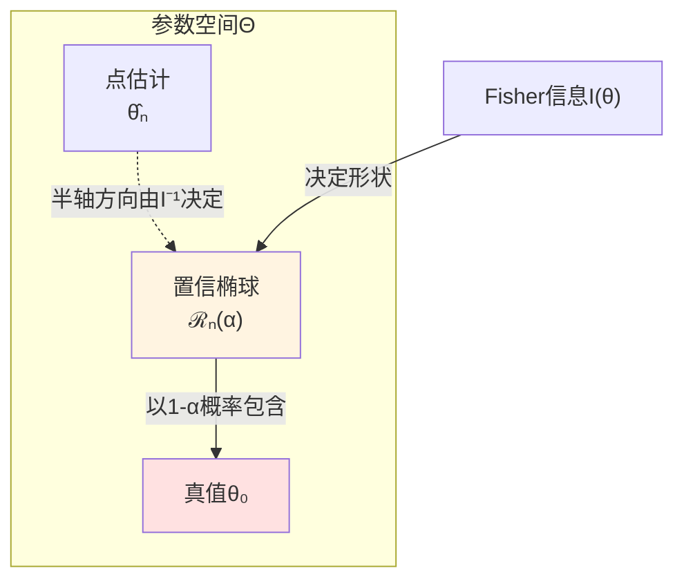
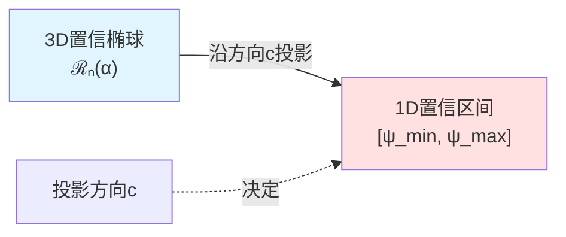
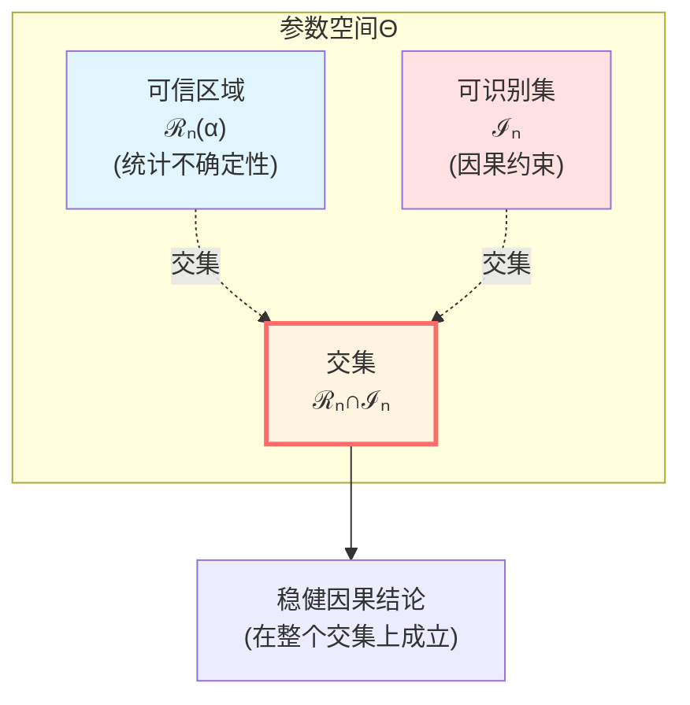
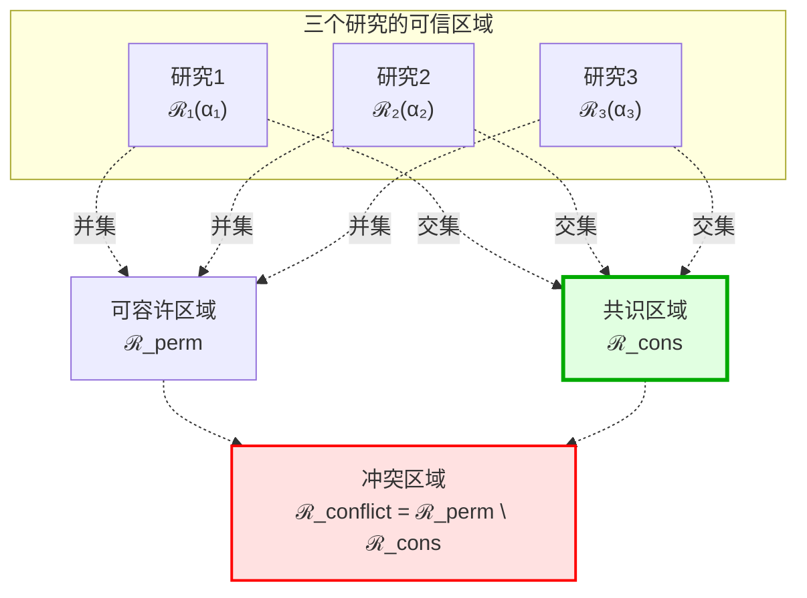
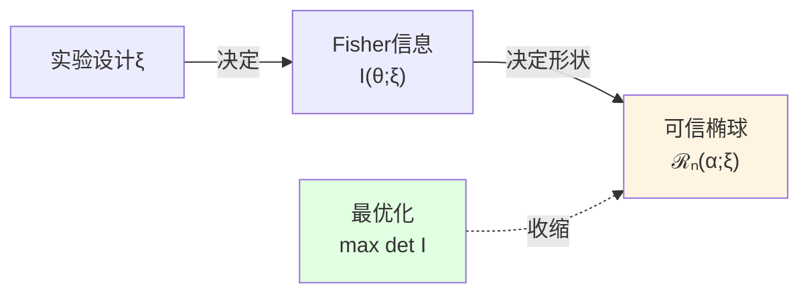

# 误差几何与因果稳健性

> *"误差不是噪音，而是几何边界；稳健性不是运气,而是几何不变量。"*

## 🎯 核心思想

在上一篇中，我们学习了时空几何如何作为因果约束的最小无损压缩。现在面对一个实际问题：

**当因果结构存在不确定性（测量误差、量子涨落、有限样本）时，我们的结论还稳健吗？**

传统方法："点估计 + 误差棒"

**GLS的新视角**：

$$
\boxed{\text{误差 = 参数空间中的几何区域（可信区域）}}
$$

$$
\boxed{\text{稳健性 = 结论在整个可信区域上成立}}
$$

**比喻**：

传统方法就像给朋友描述路线：
- "从这里直走500米，左转"

如果你的GPS有±50米误差呢？可能走到完全不同的地方！

**几何方法**：
- "在以我为中心、半径50米的圆内，无论你在哪个点，左转后都能到目标"

这才是真正的稳健！

## 📖 从点估计到区域估计

### 传统统计推断的局限

**经典流程**：

1. 收集数据 $\{X_1, \ldots, X_n\}$
2. 估计参数 $\hat{\theta}_n$
3. 计算标准误 $\text{SE}(\hat{\theta}_n)$
4. 给出置信区间 $[\hat{\theta}_n - 2\text{SE}, \hat{\theta}_n + 2\text{SE}]$

**问题**：

- 置信区间是**一维的**（对于标量参数）
- 多维参数时，单独的置信区间**忽略相关性**
- 因果结论往往依赖参数的**复杂组合**

**例子（线性回归）**：

$$
Y_i = \beta_0 + \beta_1 X_i + \epsilon_i
$$

我们关心的可能是**条件效应**：

$$
\psi(\beta) = \beta_1 + \beta_0 / \bar{X}
$$

仅凭 $\beta_0, \beta_1$ 各自的置信区间，**无法**准确推断 $\psi(\beta)$ 的置信区间！

### 几何视角：置信椭球

**新方法**：把误差视为参数空间 $\Theta$ 中的**几何区域**

**Fisher信息度量**：

在每个参数点 $\theta$ 定义局部度量：

$$
g_\theta(u, v) := u^\top I(\theta) v
$$

其中 $I(\theta)$ 是Fisher信息矩阵。

**直觉**：

- $I(\theta)$ 的特征值大 → 该方向上参数"容易辨识"
- $I(\theta)$ 的特征值小 → 该方向上参数"难以辨识"

**置信椭球**：

$$
\mathcal{R}_n(\alpha) := \left\{\theta \in \Theta : n(\theta - \hat{\theta}_n)^\top I(\hat{\theta}_n) (\theta - \hat{\theta}_n) \leq \chi^2_{d, 1-\alpha}\right\}
$$

**关键性质**：

**渐近覆盖定理**：

$$
P_{\theta_0}(\theta_0 \in \mathcal{R}_n(\alpha)) \to 1 - \alpha, \quad n \to \infty
$$

即：真参数以 $1-\alpha$ 概率落在椭球内！

## 🎨 可信区域的几何运算

### 线性函数的投影

设我们关心的因果效应是参数的线性函数：

$$
\psi(\theta) = c^\top \theta
$$

**问题**：$\psi$ 在可信区域 $\mathcal{R}_n(\alpha)$ 上的取值范围？

**几何解答**：

$$
\Psi_n(\alpha) := \{\psi(\theta) : \theta \in \mathcal{R}_n(\alpha)\}
$$

这是椭球在方向 $c$ 上的**投影**！

**解析解**：

$$
\psi_{\max} = c^\top \hat{\theta}_n + \sqrt{\frac{\chi^2_{d,1-\alpha}}{n} c^\top I(\hat{\theta}_n)^{-1} c}
$$

$$
\psi_{\min} = c^\top \hat{\theta}_n - \sqrt{\frac{\chi^2_{d,1-\alpha}}{n} c^\top I(\hat{\theta}_n)^{-1} c}
$$

**比喻**：

想象椭球是一个西瓜，$c$ 是切刀的方向：

- 切开后，截面（投影）是一个椭圆
- 椭圆的长轴和短轴由西瓜的形状和刀的角度共同决定

### 非线性函数的局部线性化

若因果效应是**非线性**函数 $\psi:\Theta \to \mathbb{R}^k$，怎么办？

**Delta方法**（一阶近似）：

在 $\hat{\theta}_n$ 附近：

$$
\psi(\theta) \approx \psi(\hat{\theta}_n) + D\psi(\hat{\theta}_n) \cdot (\theta - \hat{\theta}_n)
$$

其中 $D\psi$ 是Jacobian矩阵。

**投影椭球**：

$$
\mathcal{S}_n(\alpha) := \left\{ y \in \mathbb{R}^k : n(y - \psi(\hat{\theta}_n))^\top \Sigma^{-1} (y - \psi(\hat{\theta}_n)) \leq \chi^2_{k,1-\alpha} \right\}
$$

其中

$$
\Sigma := D\psi(\hat{\theta}_n) \cdot I(\hat{\theta}_n)^{-1} \cdot D\psi(\hat{\theta}_n)^\top
$$

**物理意义**：非线性效应的不确定性椭球！

## 🔍 因果推断中的可识别集

### 什么是可识别集？

在许多因果问题中，即使有无穷多数据，我们也**无法唯一确定**某些参数。

**定义（可识别集）**：

$$
\mathcal{I} := \{\theta \in \Theta : \theta \text{ 与观测分布及因果假设相容}\}
$$

**例子1（遗漏变量偏误）**：

真实模型：$Y = \beta_1 X + \beta_2 Z + \epsilon$

但 $Z$ 不可观测！

可识别集：

$$
\mathcal{I} = \{(\beta_1, \beta_2) : \beta_1^{\text{obs}} = \beta_1 + \beta_2 \gamma_{ZX}\}
$$

其中 $\beta_1^{\text{obs}}$ 是观测回归系数，$\gamma_{ZX}$ 是 $Z$ 对 $X$ 的回归系数。

**几何**：这是一条**直线**，而非单点！

**例子2（工具变量弱识别）**：

当工具变量"弱"时，结构参数的可识别集可能是**无界的**或非常"扁平"的区域。

### 可信区域与可识别集的交集

**GLS核心洞察**：

**因果结论应基于**：

$$
\boxed{\mathcal{R}_n(\alpha) \cap \mathcal{I}_n}
$$

而**不是**仅仅基于点估计 $\hat{\theta}_n$！

其中 $\mathcal{I}_n$ 是可识别集的数据驱动估计。

**定义（几何稳健性）**：

设 $\psi: \Theta \to \mathbb{R}$ 是因果效应。若存在区间 $[L, U]$ 使得

$$
\{\psi(\theta) : \theta \in \mathcal{R}_n(\alpha) \cap \mathcal{I}_n\} \subset [L, U]
$$

则称"因果结论 $\psi(\theta) \in [L, U]$ 在水平 $\alpha$ 下是**几何稳健**的"。

**特别地**：若 $L > 0$（或 $U < 0$），则可以稳健地断言效应的**方向**！

### 线性可识别集的凸优化

**常见情形**：可识别集可表示为线性不等式：

$$
\mathcal{I} = \{\theta : A\theta \leq b\}
$$

则 $\mathcal{R}_n(\alpha) \cap \mathcal{I}$ 是**椭球与多面体的交集**（凸集）。

**因果效应的极值**：

对于线性效应 $\psi(\theta) = c^\top \theta$：

$$
\psi_{\max}^* := \sup\{c^\top \theta : \theta \in \mathcal{R}_n(\alpha), A\theta \leq b\}
$$

$$
\psi_{\min}^* := \inf\{c^\top \theta : \theta \in \mathcal{R}_n(\alpha), A\theta \leq b\}
$$

这是一个**二次规划问题**（Quadratic Programming），可高效求解！

**几何稳健判据定理**：

若 $\psi_{\min}^* \geq \delta > 0$，则可以稳健地断言：

$$
\text{因果效应为正，且至少为 } \delta
$$

且该结论对**所有** $\theta \in \mathcal{R}_n(\alpha) \cap \mathcal{I}$ 成立！

## 🌐 多实验汇总：区域的交并运算

### 问题场景

现实中，我们常有多个数据源：

- **实验1**：随机对照试验（RCT），样本 $n_1 = 500$
- **实验2**：观测研究，样本 $n_2 = 5000$
- **实验3**：另一地区的RCT，样本 $n_3 = 300$

**传统元分析**：

计算各研究的点估计 $\hat{\theta}_1, \hat{\theta}_2, \hat{\theta}_3$，然后加权平均。

**问题**：

- 如何判断研究间是否**真正一致**？
- 如何系统识别**冲突**？
- 点估计差异可能源于采样误差，而非真实效应差异！

### 几何元分析

**思路**：每个研究给出一个可信区域 $\mathcal{R}_k(\alpha_k)$，$k=1,2,3$

**共识区域**（交集）：

$$
\mathcal{R}_{\text{cons}} := \bigcap_{k=1}^K \mathcal{R}_k(\alpha_k)
$$

**物理意义**：所有研究**同时支持**的参数范围

**可容许区域**（并集）：

$$
\mathcal{R}_{\text{perm}} := \bigcup_{k=1}^K \mathcal{R}_k(\alpha_k)
$$

**物理意义**：**至少被某一研究支持**的参数范围

**冲突区域**（对称差）：

$$
\mathcal{R}_{\text{conflict}} := \mathcal{R}_{\text{perm}} \setminus \mathcal{R}_{\text{cons}}
$$

**物理意义**：只被**部分研究支持**、存在争议的参数范围

### 一致性判断

**强一致性**：$\mathcal{R}_{\text{cons}} \neq \emptyset$（共识区域非空）

**弱一致性**：$\mathcal{R}_{\text{conflict}}$ 的"体积"相对较小

**显著冲突**：$\mathcal{R}_{\text{cons}} = \emptyset$（共识区域为空！）

这时可以**明确断言**：研究间存在根本矛盾，而非模糊地说"结果有些不同"。

### 因果效应的共识区间

对于感兴趣的效应 $\psi(\theta)$：

$$
\Psi_{\text{cons}} := \{\psi(\theta) : \theta \in \mathcal{R}_{\text{cons}}\}
$$

**稳健结论**：只有当 $\psi(\theta) \in \Psi_{\text{cons}}$ 时，才能说该效应值**被所有研究支持**。

**例子**：

- $\Psi_{\text{cons}} = [0.2, 0.5]$：所有研究一致支持效应在0.2到0.5之间
- $\Psi_{\text{cons}} = [-0.1, 0.3]$：包含0，**无法稳健断言方向**！
- $\Psi_{\text{cons}} = \emptyset$：研究间冲突，无共识

## ⚙️ 实验设计：塑造未来的可信区域

### 新视角

传统实验设计目标：最小化方差

**GLS几何视角**：

$$
\boxed{\text{实验设计 = 塑造未来可信区域的几何形状}}
$$

**关键洞察**：通过选择实验方案（样本分配、协变量设计等），我们可以**主动塑造** Fisher信息矩阵 $I(\theta; \xi)$，从而塑造可信椭球的形状！

### Fisher信息与区域体积

可信椭球的体积：

$$
\text{Vol}(\mathcal{R}_n(\alpha; \xi)) = C_{d,\alpha} \cdot \det(I_n(\theta_0; \xi))^{-1/2}
$$

其中：
- $\xi$ 是设计变量（如样本分配方案）
- $C_{d,\alpha}$ 是常数

**D-最优设计**：

$$
\xi^* = \arg\max_\xi \det I_n(\theta_0; \xi)
$$

**几何意义**：最小化可信椭球的体积，使参数估计"整体上最紧"！

### 定向可辨率：c-最优设计

若我们**只关心**特定因果效应 $\psi(\theta) = c^\top \theta$，不需要整体最优！

**c-最优设计**：

$$
\xi^* = \arg\min_\xi c^\top I_n(\theta_0; \xi)^{-1} c
$$

**几何意义**：

- **不追求**整体椭球体积最小
- **专门压缩**在方向 $c$ 上的半轴
- 集中资源提升**该特定因果效应**的分辨率

**比喻**：

- D-最优 = 全面发展（各科成绩都要好）
- c-最优 = 专业化（只需数学好，用于申请数学系）

### 例子：线性回归中的样本分配

**模型**：

$$
Y_i = \beta_0 + \beta_1 X_i + \epsilon_i, \quad \epsilon_i \sim \mathcal{N}(0, \sigma^2)
$$

**设计问题**：在 $X \in \{x_1, x_2\}$ 两个水平上，如何分配 $n$ 个样本？

设分配比例为 $\xi = (p, 1-p)$，即 $np$ 个样本在 $x_1$，$n(1-p)$ 个样本在 $x_2$。

**Fisher信息矩阵**：

$$
I(\beta; \xi) = \frac{n}{\sigma^2} \begin{pmatrix} 1 & \bar{x}(\xi) \\ \bar{x}(\xi) & \overline{x^2}(\xi) \end{pmatrix}
$$

其中 $\bar{x}(\xi) = p x_1 + (1-p) x_2$。

**D-最优设计**（最小化行列式的逆）：

$$
\det I(\beta; \xi) \propto \overline{x^2}(\xi) - \bar{x}(\xi)^2 = \text{Var}(X)
$$

最大化方差 $\Rightarrow$ 两端均分：$p^* = 1/2$

**c-最优设计**（只关心斜率 $\beta_1$）：

$$
c = (0, 1)^\top, \quad c^\top I^{-1} c \propto \frac{1}{\text{Var}(X)}
$$

同样得到 $p^* = 1/2$（两端均分最大化 $X$ 的方差）

## 🔗 与GLS理论的联系

### 与因果钻石的联系

在GLS理论中，因果钻石 $D(p,q)$ 的边界 $\partial D = E^+ \cup E^-$ 编码完整信息。

**类比**：

- **因果钻石** ↔ **可信区域** $\mathcal{R}_n(\alpha)$
- **边界** $\partial D$ ↔ **椭球边界**
- **体域重建** ↔ **从边界推断内部参数**

都体现了**边界编码完整信息**的思想！

### 与时间刻度的联系

统一时间刻度 $\kappa(\omega)$ 的不确定性可以几何化：

$$
\kappa(\omega) \in \mathcal{R}_\kappa := [\kappa_{\min}(\omega), \kappa_{\max}(\omega)]
$$

**稳健因果结论**：只有当基于 $\mathcal{R}_\kappa$ 内所有 $\kappa$ 值的结论一致时，才是稳健的！

### 与Null-Modular双覆盖的联系

调制函数 $g_\sigma(\lambda, x_\perp)$ 的估计误差可以用置信区域表示：

$$
g_\sigma \in \mathcal{R}_g
$$

**稳健性**：模哈密顿量 $K_D$ 在整个 $\mathcal{R}_g$ 上的取值范围：

$$
K_D[\mathcal{R}_g] = \left\{ 2\pi \sum_\sigma \int_{E^\sigma} g_\sigma T_{\sigma\sigma} : g_\sigma \in \mathcal{R}_g \right\}
$$

## 🌟 核心公式总结

### Fisher信息度量

$$
\boxed{g_\theta(u, v) := u^\top I(\theta) v}
$$

### 置信椭球（可信区域）

$$
\boxed{\mathcal{R}_n(\alpha) := \left\{ \theta : n(\theta - \hat{\theta}_n)^\top I(\hat{\theta}_n) (\theta - \hat{\theta}_n) \leq \chi^2_{d,1-\alpha} \right\}}
$$

### 线性效应的投影区间

$$
\boxed{\Psi_n(\alpha) = \left[ c^\top \hat{\theta}_n - \sqrt{\frac{\chi^2_{d,1-\alpha}}{n} c^\top I^{-1} c}, \, c^\top \hat{\theta}_n + \sqrt{\frac{\chi^2_{d,1-\alpha}}{n} c^\top I^{-1} c} \right]}
$$

### 几何稳健性

$$
\boxed{\mathcal{C}_n(\alpha) := \{\psi(\theta) : \theta \in \mathcal{R}_n(\alpha) \cap \mathcal{I}_n\}}
$$

### 多实验共识区域

$$
\boxed{\mathcal{R}_{\text{cons}} := \bigcap_{k=1}^K \mathcal{R}_k(\alpha_k)}
$$

### D-最优设计

$$
\boxed{\xi^* = \arg\max_\xi \det I_n(\theta_0; \xi)}
$$

## 💭 思考题

### 问题1：为什么椭球而不是球？

**提示**：考虑参数间的相关性

**答案**：

如果参数完全独立（$I(\theta)$ 对角），则置信区域是**球**（各方向不确定性相同）。

但实际中，参数往往**相关**：

- 截距 $\beta_0$ 和斜率 $\beta_1$ 通常负相关（跷跷板效应）
- Fisher信息矩阵 $I(\theta)$ 非对角
- 置信区域是**椭球**（不同方向不确定性不同）

**几何直觉**：

- 椭球的长轴 → 参数"难辨识"的方向
- 椭球的短轴 → 参数"易辨识"的方向

### 问题2：共识区域为空意味着什么？

**提示**：想想量子测不准原理

**答案**：

$$
\mathcal{R}_{\text{cons}} = \bigcap_{k=1}^K \mathcal{R}_k = \emptyset
$$

**物理意义**：

1. **显著冲突**：研究间存在根本矛盾，无法同时满足所有约束
2. **模型失配**：某些研究的假设可能错误
3. **异质性**：不同研究测量的可能是**不同的参数**（如不同人群的效应）

**量子类比**：

就像同时精确测量位置和动量 → 测不准原理禁止！

多个研究的可信区域交集为空 → 参数空间的"几何不相容性"！

### 问题3：如何在量子引力中定义误差几何？

**提示**：回想因果钻石的量子涨落

**答案**：

在量子引力中，时空几何本身有量子涨落！

**经典GLS**：

$$
\mathcal{R}_{\text{classical}} = \{g_{\mu\nu} : \text{满足因果约束}\}
$$

**量子GLS**（路径积分）：

$$
\mathcal{R}_{\text{quantum}} = \int \mathcal{D}g_{\mu\nu} \, e^{iS[g]} \, \delta(\text{因果约束})
$$

**几何不确定性**：

- 普朗克尺度 $\ell_P$ 下，时空有"泡沫"涨落
- 可信区域变成**函数空间中的测度**
- 稳健性 → 在量子涨落下的**拓扑不变性**

**例子**：

Bekenstein-Hawking熵的修正项：

$$
S = \frac{A}{4G} + \alpha \log\left(\frac{A}{\ell_P^2}\right) + \cdots
$$

$\alpha$ 的可信区域 $\mathcal{R}_\alpha$ 决定了量子引力修正的稳健预言！

## 🎯 核心洞察

1. **误差即几何边界**

   传统：误差 = 附属信息

   GLS：误差 = 参数空间中的几何区域（可信区域）

2. **稳健性即几何不变性**

   传统：稳健性 = "结果差不多"

   GLS：稳健性 = 结论在整个可信区域上成立

3. **因果推断 = 可信区域 ∩ 可识别集**

   $$
   \text{稳健因果结论} \longleftrightarrow \mathcal{R}_n(\alpha) \cap \mathcal{I}_n
   $$

4. **元分析 = 区域的交并运算**

   - 共识 = 交集 $\bigcap \mathcal{R}_k$
   - 冲突 = 对称差 $\bigcup \mathcal{R}_k \setminus \bigcap \mathcal{R}_k$

5. **实验设计 = 塑造几何形状**

   通过 Fisher 信息 $I(\theta; \xi)$ 主动塑造可信椭球

## 📚 与其他篇章的联系

### 与因果几何化（第8篇）

- 第8篇：时空几何 = 因果约束的压缩
- 本篇：参数几何 = 统计约束的压缩

**统一视角**：

$$
\text{几何} = \text{约束的最优编码} + \text{误差边界}
$$

### 与边界理论（第6篇）

- 边界编码体域信息 ↔ 椭球边界编码参数不确定性
- Brown-York能量的不确定性 ↔ Fisher信息决定的椭球形状

### 与统一时间（第5篇）

时间刻度 $\kappa(\omega)$ 的不确定性：

$$
\kappa \in [\kappa_{\min}, \kappa_{\max}]
$$

**稳健因果箭头**：只有当所有 $\kappa \in [\kappa_{\min}, \kappa_{\max}]$ 都给出相同因果方向时，箭头才稳健！

## 📖 延伸阅读

**经典统计**：
- van der Vaart (1998): *Asymptotic Statistics*（渐近理论）
- Bickel & Doksum (2015): *Mathematical Statistics*（置信区域）

**因果推断**：
- Manski (2003): *Partial Identification*（可识别集）
- Imbens & Rubin (2015): *Causal Inference*（稳健性分析）

**实验设计**：
- Pukelsheim (2006): *Optimal Design of Experiments*（Fisher信息与设计）

**GLS理论源文档**：
- `error-geometry-causal-robustness.md`（本篇来源）

---

**下一篇预告**：[10-因果-时间-熵统一定理完整证明](10-unified-theorem-proof.md)

我们将看到因果、时间、熵三者如何通过严格数学证明统一！

**返回**：[因果结构篇总览](00-causal-overview.md)

**上一篇**：[08-因果几何化](08-causal-geometry-compression.md)
