# Error Geometry and Causal Robustness

> *"Error is not noise, but geometric boundary; robustness is not luck, but geometric invariant."*

## 🎯 Core Ideas

In the previous chapter, we learned how spacetime geometry serves as minimal lossless compression of causal constraints. Now we face a practical question:

**When causal structure has uncertainty (measurement errors, quantum fluctuations, finite samples), are our conclusions still robust?**

Traditional method: "Point estimate + error bars"

**GLS New Perspective**:

$$
\boxed{\text{Error = Geometric Region in Parameter Space (Credible Region)}}
$$

$$
\boxed{\text{Robustness = Conclusion Holds Over Entire Credible Region}}
$$

**Analogy**:

Traditional method is like describing a route to a friend:
- "Go straight 500 meters from here, then turn left"

What if your GPS has ±50 meter error? You might end up in a completely different place!

**Geometric Method**:
- "Within a circle centered on me with radius 50 meters, no matter which point you're at, turning left will get you to the destination"

This is true robustness!

## 📖 From Point Estimation to Region Estimation

### Limitations of Traditional Statistical Inference

**Classical Procedure**:

1. Collect data $\{X_1, \ldots, X_n\}$
2. Estimate parameter $\hat{\theta}_n$
3. Calculate standard error $\text{SE}(\hat{\theta}_n)$
4. Give confidence interval $[\hat{\theta}_n - 2\text{SE}, \hat{\theta}_n + 2\text{SE}]$

**Problems**:

- Confidence interval is **one-dimensional** (for scalar parameters)
- For multi-dimensional parameters, separate confidence intervals **ignore correlations**
- Causal conclusions often depend on **complex combinations** of parameters

**Example (Linear Regression)**:

$$
Y_i = \beta_0 + \beta_1 X_i + \epsilon_i
$$

We might care about **conditional effect**:

$$
\psi(\beta) = \beta_1 + \beta_0 / \bar{X}
$$

From confidence intervals of $\beta_0, \beta_1$ alone, we **cannot** accurately infer confidence interval of $\psi(\beta)$!

### Geometric Perspective: Confidence Ellipsoid

**New Method**: Treat error as **geometric region** in parameter space $\Theta$

**Fisher Information Metric**:

At each parameter point $\theta$, define local metric:

$$
g_\theta(u, v) := u^\top I(\theta) v
$$

where $I(\theta)$ is Fisher information matrix.

**Intuition**:

- Large eigenvalue of $I(\theta)$ → Parameter "easily identifiable" in that direction
- Small eigenvalue of $I(\theta)$ → Parameter "hard to identify" in that direction

**Confidence Ellipsoid**:

$$
\mathcal{R}_n(\alpha) := \left\{\theta \in \Theta : n(\theta - \hat{\theta}_n)^\top I(\hat{\theta}_n) (\theta - \hat{\theta}_n) \leq \chi^2_{d, 1-\alpha}\right\}
$$

```mermaid
graph TB
    subgraph "Parameter Space Θ"
        CENTER["Point Estimate<br/>θ̂ₙ"]
        ELLIPSE["Confidence Ellipsoid<br/>ℛₙ(α)"]
        TRUE["True Value θ₀"]

        CENTER -.->|"Semi-axis Directions Determined by I⁻¹"| ELLIPSE
        ELLIPSE -->|"Contains with Probability 1-α"| TRUE
    end

    INFO["Fisher Information I(θ)"] -->|"Determines Shape"| ELLIPSE

    style ELLIPSE fill:#fff4e1
    style TRUE fill:#ffe1e1
```

**Key Property**:

**Asymptotic Coverage Theorem**:

$$
P_{\theta_0}(\theta_0 \in \mathcal{R}_n(\alpha)) \to 1 - \alpha, \quad n \to \infty
$$

That is: True parameter falls inside ellipsoid with probability $1-\alpha$!

## 🎨 Geometric Operations on Credible Regions

### Projection of Linear Functions

Suppose causal effect we care about is linear function of parameters:

$$
\psi(\theta) = c^\top \theta
$$

**Question**: Range of $\psi$ on credible region $\mathcal{R}_n(\alpha)$?

**Geometric Answer**:

$$
\Psi_n(\alpha) := \{\psi(\theta) : \theta \in \mathcal{R}_n(\alpha)\}
$$

This is **projection** of ellipsoid in direction $c$!

**Analytic Solution**:

$$
\psi_{\max} = c^\top \hat{\theta}_n + \sqrt{\frac{\chi^2_{d,1-\alpha}}{n} c^\top I(\hat{\theta}_n)^{-1} c}
$$

$$
\psi_{\min} = c^\top \hat{\theta}_n - \sqrt{\frac{\chi^2_{d,1-\alpha}}{n} c^\top I(\hat{\theta}_n)^{-1} c}
$$

**Analogy**:

Imagine ellipsoid is a watermelon, $c$ is direction of cutting knife:

- After cutting, cross-section (projection) is an ellipse
- Major and minor axes of ellipse determined jointly by watermelon shape and knife angle

```mermaid
graph LR
    ELLIPSOID["3D Confidence Ellipsoid<br/>ℛₙ(α)"] -->|"Project Along Direction c"| INTERVAL["1D Confidence Interval<br/>[ψ_min, ψ_max]"]

    DIRECTION["Projection Direction c"] -.->|"Determines"| INTERVAL

    style ELLIPSOID fill:#e1f5ff
    style INTERVAL fill:#ffe1e1
```

### Local Linearization of Nonlinear Functions

If causal effect is **nonlinear** function $\psi:\Theta \to \mathbb{R}^k$, what to do?

**Delta Method** (first-order approximation):

Near $\hat{\theta}_n$:

$$
\psi(\theta) \approx \psi(\hat{\theta}_n) + D\psi(\hat{\theta}_n) \cdot (\theta - \hat{\theta}_n)
$$

where $D\psi$ is Jacobian matrix.

**Projected Ellipsoid**:

$$
\mathcal{S}_n(\alpha) := \left\{ y \in \mathbb{R}^k : n(y - \psi(\hat{\theta}_n))^\top \Sigma^{-1} (y - \psi(\hat{\theta}_n)) \leq \chi^2_{k,1-\alpha} \right\}
$$

where

$$
\Sigma := D\psi(\hat{\theta}_n) \cdot I(\hat{\theta}_n)^{-1} \cdot D\psi(\hat{\theta}_n)^\top
$$

**Physical Meaning**: Uncertainty ellipsoid of nonlinear effect!

## 🔍 Identifiable Sets in Causal Inference

### What Is Identifiable Set?

In many causal problems, even with infinite data, we **cannot uniquely determine** certain parameters.

**Definition (Identifiable Set)**:

$$
\mathcal{I} := \{\theta \in \Theta : \theta \text{ compatible with observed distribution and causal assumptions}\}
$$

**Example 1 (Omitted Variable Bias)**:

True model: $Y = \beta_1 X + \beta_2 Z + \epsilon$

But $Z$ is unobservable!

Identifiable set:

$$
\mathcal{I} = \{(\beta_1, \beta_2) : \beta_1^{\text{obs}} = \beta_1 + \beta_2 \gamma_{ZX}\}
$$

where $\beta_1^{\text{obs}}$ is observed regression coefficient, $\gamma_{ZX}$ is regression coefficient of $Z$ on $X$.

**Geometry**: This is a **line**, not a single point!

**Example 2 (Weak Identification of Instrumental Variables)**:

When instrumental variable is "weak", identifiable set of structural parameters may be **unbounded** or very "flat" region.

### Intersection of Credible Region and Identifiable Set

**GLS Core Insight**:

**Causal conclusions should be based on**:

$$
\boxed{\mathcal{R}_n(\alpha) \cap \mathcal{I}_n}
$$

**not** just point estimate $\hat{\theta}_n$!

where $\mathcal{I}_n$ is data-driven estimate of identifiable set.

```mermaid
graph TB
    subgraph "Parameter Space Θ"
        TRUST["Credible Region<br/>ℛₙ(α)<br/>(Statistical Uncertainty)"]
        IDENT["Identifiable Set<br/>ℐₙ<br/>(Causal Constraints)"]
        INTER["Intersection<br/>ℛₙ∩ℐₙ"]

        TRUST -.->|"Intersection"| INTER
        IDENT -.->|"Intersection"| INTER
    end

    INTER --> ROBUST["Robust Causal Conclusion<br/>(Holds Over Entire Intersection)"]

    style TRUST fill:#e1f5ff
    style IDENT fill:#ffe1e1
    style INTER fill:#fff4e1,stroke:#ff6b6b,stroke-width:3px
```

**Definition (Geometric Robustness)**:

Let $\psi: \Theta \to \mathbb{R}$ be causal effect. If there exists interval $[L, U]$ such that

$$
\{\psi(\theta) : \theta \in \mathcal{R}_n(\alpha) \cap \mathcal{I}_n\} \subset [L, U]
$$

then we say "causal conclusion $\psi(\theta) \in [L, U]$ is **geometrically robust** at level $\alpha$".

**In Particular**: If $L > 0$ (or $U < 0$), we can robustly assert **direction** of effect!

### Convex Optimization for Linear Identifiable Sets

**Common Case**: Identifiable set can be represented as linear inequalities:

$$
\mathcal{I} = \{\theta : A\theta \leq b\}
$$

Then $\mathcal{R}_n(\alpha) \cap \mathcal{I}$ is **intersection of ellipsoid and polyhedron** (convex set).

**Extrema of Causal Effect**:

For linear effect $\psi(\theta) = c^\top \theta$:

$$
\psi_{\max}^* := \sup\{c^\top \theta : \theta \in \mathcal{R}_n(\alpha), A\theta \leq b\}
$$

$$
\psi_{\min}^* := \inf\{c^\top \theta : \theta \in \mathcal{R}_n(\alpha), A\theta \leq b\}
$$

This is a **Quadratic Programming** problem, can be solved efficiently!

**Geometric Robustness Criterion Theorem**:

If $\psi_{\min}^* \geq \delta > 0$, then we can robustly assert:

$$
\text{Causal effect is positive, and at least } \delta
$$

And this conclusion holds for **all** $\theta \in \mathcal{R}_n(\alpha) \cap \mathcal{I}$!

## 🌐 Multi-Experiment Aggregation: Intersection and Union of Regions

### Problem Scenario

In reality, we often have multiple data sources:

- **Experiment 1**: Randomized controlled trial (RCT), sample $n_1 = 500$
- **Experiment 2**: Observational study, sample $n_2 = 5000$
- **Experiment 3**: RCT from another region, sample $n_3 = 300$

**Traditional Meta-Analysis**:

Calculate point estimates $\hat{\theta}_1, \hat{\theta}_2, \hat{\theta}_3$ of each study, then weighted average.

**Problems**:

- How to judge whether studies are **truly consistent**?
- How to systematically identify **conflicts**?
- Point estimate differences may come from sampling error, not real effect differences!

### Geometric Meta-Analysis

**Idea**: Each study gives a credible region $\mathcal{R}_k(\alpha_k)$, $k=1,2,3$

**Consensus Region** (intersection):

$$
\mathcal{R}_{\text{cons}} := \bigcap_{k=1}^K \mathcal{R}_k(\alpha_k)
$$

**Physical Meaning**: Parameter range **simultaneously supported** by all studies

**Permissible Region** (union):

$$
\mathcal{R}_{\text{perm}} := \bigcup_{k=1}^K \mathcal{R}_k(\alpha_k)
$$

**Physical Meaning**: Parameter range **supported by at least one study**

**Conflict Region** (symmetric difference):

$$
\mathcal{R}_{\text{conflict}} := \mathcal{R}_{\text{perm}} \setminus \mathcal{R}_{\text{cons}}
$$

**Physical Meaning**: Parameter range supported by **only some studies**, where controversy exists

```mermaid
graph TB
    subgraph "Credible Regions of Three Studies"
        R1["Study 1<br/>ℛ₁(α₁)"]
        R2["Study 2<br/>ℛ₂(α₂)"]
        R3["Study 3<br/>ℛ₃(α₃)"]
    end

    R1 -.->|"Intersection"| CONS["Consensus Region<br/>ℛ_cons"]
    R2 -.->|"Intersection"| CONS
    R3 -.->|"Intersection"| CONS

    R1 -.->|"Union"| PERM["Permissible Region<br/>ℛ_perm"]
    R2 -.->|"Union"| PERM
    R3 -.->|"Union"| PERM

    PERM -.-> CONFLICT["Conflict Region<br/>ℛ_conflict = ℛ_perm \ ℛ_cons"]
    CONS -.-> CONFLICT

    style CONS fill:#e1ffe1,stroke:#00aa00,stroke-width:3px
    style CONFLICT fill:#ffe1e1,stroke:#ff0000,stroke-width:2px
```

### Consistency Judgment

**Strong Consistency**: $\mathcal{R}_{\text{cons}} \neq \emptyset$ (consensus region non-empty)

**Weak Consistency**: "Volume" of $\mathcal{R}_{\text{conflict}}$ relatively small

**Significant Conflict**: $\mathcal{R}_{\text{cons}} = \emptyset$ (consensus region empty!)

Then we can **clearly assert**: Studies have fundamental contradiction, not vaguely say "results somewhat different".

### Consensus Interval for Causal Effect

For effect of interest $\psi(\theta)$:

$$
\Psi_{\text{cons}} := \{\psi(\theta) : \theta \in \mathcal{R}_{\text{cons}}\}
$$

**Robust Conclusion**: Only when $\psi(\theta) \in \Psi_{\text{cons}}$ can we say this effect value is **supported by all studies**.

**Examples**:

- $\Psi_{\text{cons}} = [0.2, 0.5]$: All studies consistently support effect between 0.2 and 0.5
- $\Psi_{\text{cons}} = [-0.1, 0.3]$: Contains 0, **cannot robustly assert direction**!
- $\Psi_{\text{cons}} = \emptyset$: Studies conflict, no consensus

## ⚙️ Experimental Design: Shaping Future Credible Regions

### New Perspective

Traditional experimental design goal: Minimize variance

**GLS Geometric Perspective**:

$$
\boxed{\text{Experimental Design = Shaping Geometric Shape of Future Credible Region}}
$$

**Key Insight**: By choosing experimental scheme (sample allocation, covariate design, etc.), we can **actively shape** Fisher information matrix $I(\theta; \xi)$, thus shaping shape of credible ellipsoid!

### Fisher Information and Region Volume

Volume of credible ellipsoid:

$$
\text{Vol}(\mathcal{R}_n(\alpha; \xi)) = C_{d,\alpha} \cdot \det(I_n(\theta_0; \xi))^{-1/2}
$$

where:
- $\xi$ is design variable (e.g., sample allocation scheme)
- $C_{d,\alpha}$ is constant

**D-Optimal Design**:

$$
\xi^* = \arg\max_\xi \det I_n(\theta_0; \xi)
$$

**Geometric Meaning**: Minimize volume of credible ellipsoid, make parameter estimation "tightest overall"!

```mermaid
graph LR
    DESIGN["Experimental Design ξ"] -->|"Determines"| FISHER["Fisher Information<br/>I(θ;ξ)"]
    FISHER -->|"Determines Shape"| ELLIPSE["Credible Ellipsoid<br/>ℛₙ(α;ξ)"]

    OPT["Optimization<br/>max det I"] -.->|"Shrinks"| ELLIPSE

    style ELLIPSE fill:#fff4e1
    style OPT fill:#e1ffe1
```

### Directional Distinguishability: c-Optimal Design

If we **only care about** specific causal effect $\psi(\theta) = c^\top \theta$, don't need overall optimal!

**c-Optimal Design**:

$$
\xi^* = \arg\min_\xi c^\top I_n(\theta_0; \xi)^{-1} c
$$

**Geometric Meaning**:

- **Don't pursue** minimum overall ellipsoid volume
- **Specifically compress** semi-axis in direction $c$
- Concentrate resources to improve resolution of **this specific causal effect**

**Analogy**:

- D-optimal = All-round development (all subjects must be good)
- c-optimal = Specialization (only need math good, for math department application)

### Example: Sample Allocation in Linear Regression

**Model**:

$$
Y_i = \beta_0 + \beta_1 X_i + \epsilon_i, \quad \epsilon_i \sim \mathcal{N}(0, \sigma^2)
$$

**Design Problem**: How to allocate $n$ samples at two levels $X \in \{x_1, x_2\}$?

Let allocation proportion be $\xi = (p, 1-p)$, i.e., $np$ samples at $x_1$, $n(1-p)$ samples at $x_2$.

**Fisher Information Matrix**:

$$
I(\beta; \xi) = \frac{n}{\sigma^2} \begin{pmatrix} 1 & \bar{x}(\xi) \\ \bar{x}(\xi) & \overline{x^2}(\xi) \end{pmatrix}
$$

where $\bar{x}(\xi) = p x_1 + (1-p) x_2$.

**D-Optimal Design** (minimize inverse of determinant):

$$
\det I(\beta; \xi) \propto \overline{x^2}(\xi) - \bar{x}(\xi)^2 = \text{Var}(X)
$$

Maximize variance $\Rightarrow$ Equal allocation at extremes: $p^* = 1/2$

**c-Optimal Design** (only care about slope $\beta_1$):

$$
c = (0, 1)^\top, \quad c^\top I^{-1} c \propto \frac{1}{\text{Var}(X)}
$$

Also get $p^* = 1/2$ (equal allocation at extremes maximizes variance of $X$)

## 🔗 Connections with GLS Theory

### Connection with Causal Diamond

In GLS theory, boundary $\partial D = E^+ \cup E^-$ of causal diamond $D(p,q)$ encodes complete information.

**Analogy**:

- **Causal Diamond** ↔ **Credible Region** $\mathcal{R}_n(\alpha)$
- **Boundary** $\partial D$ ↔ **Ellipsoid Boundary**
- **Bulk Reconstruction** ↔ **Inferring Interior Parameters from Boundary**

All reflect idea that **boundary encodes complete information**!

### Connection with Time Scale

Uncertainty of unified time scale $\kappa(\omega)$ can be geometrized:

$$
\kappa(\omega) \in \mathcal{R}_\kappa := [\kappa_{\min}(\omega), \kappa_{\max}(\omega)]
$$

**Robust Causal Conclusion**: Only when conclusions based on all $\kappa$ values in $\mathcal{R}_\kappa$ are consistent, are they robust!

### Connection with Null-Modular Double Cover

Estimation error of modulation function $g_\sigma(\lambda, x_\perp)$ can be represented as confidence region:

$$
g_\sigma \in \mathcal{R}_g
$$

**Robustness**: Range of modular Hamiltonian $K_D$ over entire $\mathcal{R}_g$:

$$
K_D[\mathcal{R}_g] = \left\{ 2\pi \sum_\sigma \int_{E^\sigma} g_\sigma T_{\sigma\sigma} : g_\sigma \in \mathcal{R}_g \right\}
$$

## 🌟 Core Formula Summary

### Fisher Information Metric

$$
\boxed{g_\theta(u, v) := u^\top I(\theta) v}
$$

### Confidence Ellipsoid (Credible Region)

$$
\boxed{\mathcal{R}_n(\alpha) := \left\{ \theta : n(\theta - \hat{\theta}_n)^\top I(\hat{\theta}_n) (\theta - \hat{\theta}_n) \leq \chi^2_{d,1-\alpha} \right\}}
$$

### Projection Interval for Linear Effect

$$
\boxed{\Psi_n(\alpha) = \left[ c^\top \hat{\theta}_n - \sqrt{\frac{\chi^2_{d,1-\alpha}}{n} c^\top I^{-1} c}, \, c^\top \hat{\theta}_n + \sqrt{\frac{\chi^2_{d,1-\alpha}}{n} c^\top I^{-1} c} \right]}
$$

### Geometric Robustness

$$
\boxed{\mathcal{C}_n(\alpha) := \{\psi(\theta) : \theta \in \mathcal{R}_n(\alpha) \cap \mathcal{I}_n\}}
$$

### Multi-Experiment Consensus Region

$$
\boxed{\mathcal{R}_{\text{cons}} := \bigcap_{k=1}^K \mathcal{R}_k(\alpha_k)}
$$

### D-Optimal Design

$$
\boxed{\xi^* = \arg\max_\xi \det I_n(\theta_0; \xi)}
$$

## 💭 Thinking Questions

### Question 1: Why Ellipsoid Instead of Sphere?

**Hint**: Consider correlations between parameters

**Answer**:

If parameters are completely independent ($I(\theta)$ diagonal), confidence region is a **sphere** (same uncertainty in all directions).

But in practice, parameters are often **correlated**:

- Intercept $\beta_0$ and slope $\beta_1$ usually negatively correlated (seesaw effect)
- Fisher information matrix $I(\theta)$ non-diagonal
- Confidence region is **ellipsoid** (different uncertainty in different directions)

**Geometric Intuition**:

- Long axis of ellipsoid → Direction where parameters "hard to identify"
- Short axis of ellipsoid → Direction where parameters "easy to identify"

### Question 2: What Does Empty Consensus Region Mean?

**Hint**: Think of quantum uncertainty principle

**Answer**:

$$
\mathcal{R}_{\text{cons}} = \bigcap_{k=1}^K \mathcal{R}_k = \emptyset
$$

**Physical Meaning**:

1. **Significant Conflict**: Studies have fundamental contradiction, cannot simultaneously satisfy all constraints
2. **Model Mismatch**: Assumptions of some studies may be wrong
3. **Heterogeneity**: Different studies may measure **different parameters** (e.g., effects in different populations)

**Quantum Analogy**:

Like simultaneously precisely measuring position and momentum → Uncertainty principle forbids!

Intersection of credible regions of multiple studies empty → "Geometric incompatibility" in parameter space!

### Question 3: How to Define Error Geometry in Quantum Gravity?

**Hint**: Recall quantum fluctuations of causal diamond

**Answer**:

In quantum gravity, spacetime geometry itself has quantum fluctuations!

**Classical GLS**:

$$
\mathcal{R}_{\text{classical}} = \{g_{\mu\nu} : \text{satisfies causal constraints}\}
$$

**Quantum GLS** (path integral):

$$
\mathcal{R}_{\text{quantum}} = \int \mathcal{D}g_{\mu\nu} \, e^{iS[g]} \, \delta(\text{causal constraints})
$$

**Geometric Uncertainty**:

- At Planck scale $\ell_P$, spacetime has "foam" fluctuations
- Credible region becomes **measure in function space**
- Robustness → **Topological invariance** under quantum fluctuations

**Example**:

Correction terms to Bekenstein-Hawking entropy:

$$
S = \frac{A}{4G} + \alpha \log\left(\frac{A}{\ell_P^2}\right) + \cdots
$$

Credible region $\mathcal{R}_\alpha$ of $\alpha$ determines robust predictions of quantum gravitational corrections!

## 🎯 Core Insights

1. **Error = Geometric Boundary**

   Traditional: Error = Supplementary information

   GLS: Error = Geometric region in parameter space (credible region)

2. **Robustness = Geometric Invariance**

   Traditional: Robustness = "Results similar"

   GLS: Robustness = Conclusion holds over entire credible region

3. **Causal Inference = Credible Region ∩ Identifiable Set**

   $$
   \text{Robust Causal Conclusion} \longleftrightarrow \mathcal{R}_n(\alpha) \cap \mathcal{I}_n
   $$

4. **Meta-Analysis = Intersection and Union of Regions**

   - Consensus = Intersection $\bigcap \mathcal{R}_k$
   - Conflict = Symmetric difference $\bigcup \mathcal{R}_k \setminus \bigcap \mathcal{R}_k$

5. **Experimental Design = Shaping Geometric Shape**

   Actively shape credible ellipsoid through Fisher information $I(\theta; \xi)$

## 📚 Connections with Other Chapters

### With Causal Geometrization (Chapter 8)

- Chapter 8: Spacetime geometry = Compression of causal constraints
- This chapter: Parameter geometry = Compression of statistical constraints

**Unified Perspective**:

$$
\text{Geometry} = \text{Optimal Encoding of Constraints} + \text{Error Boundary}
$$

### With Boundary Theory (Chapter 6)

- Boundary encodes bulk information ↔ Ellipsoid boundary encodes parameter uncertainty
- Uncertainty of Brown-York energy ↔ Ellipsoid shape determined by Fisher information

### With Unified Time (Chapter 5)

Uncertainty of time scale $\kappa(\omega)$:

$$
\kappa \in [\kappa_{\min}, \kappa_{\max}]
$$

**Robust Causal Arrow**: Only when all $\kappa \in [\kappa_{\min}, \kappa_{\max}]$ give same causal direction, is arrow robust!

## 📖 Further Reading

**Classical Statistics**:
- van der Vaart (1998): *Asymptotic Statistics* (asymptotic theory)
- Bickel & Doksum (2015): *Mathematical Statistics* (confidence regions)

**Causal Inference**:
- Manski (2003): *Partial Identification* (identifiable sets)
- Imbens & Rubin (2015): *Causal Inference* (robustness analysis)

**Experimental Design**:
- Pukelsheim (2006): *Optimal Design of Experiments* (Fisher information and design)

**GLS Theory Source Documents**:
- `error-geometry-causal-robustness.md` (source of this chapter)

---

**Next Chapter Preview**: [10-Unified Theorem Complete Proof of Causality-Time-Entropy](10-unified-theorem-proof.md)

We will see how causality, time, and entropy are unified through rigorous mathematical proof!

**Return**: [Causal Structure Overview](00-causal-overview.md)

**Previous Chapter**: [08-Causal Geometrization](08-causal-geometry-compression_en.md)

