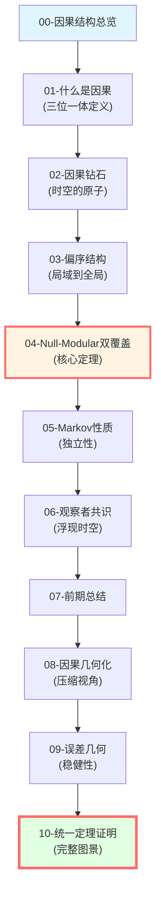
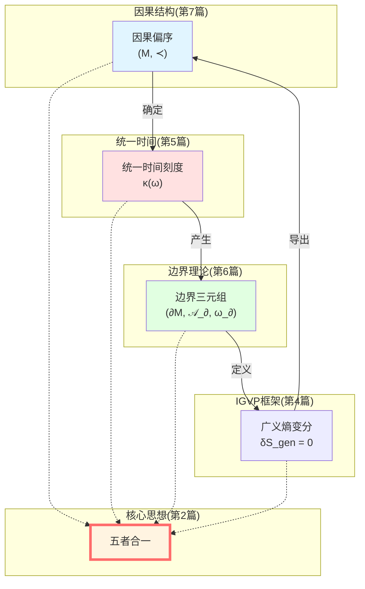
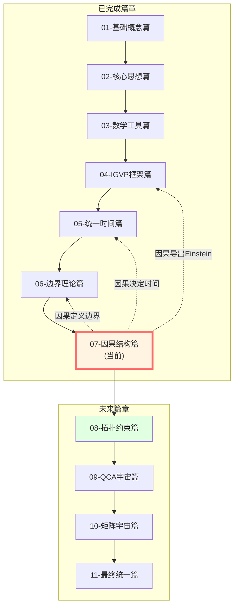

# 因果结构总结：完整图景

> *"因果、时间、熵、边界、观察者——五位一体，构成时空的完整结构。"*

## 🎯 本篇回顾

我们已经完成了因果结构篇的全部内容！让我们回顾这段旅程，并将所有概念编织成一个**完整的图景**。

### 本篇十篇文章



现在，让我们把这些拼图块组合成完整的画面。

## 📖 十篇文章精要回顾

### 01-什么是因果？

**核心思想**：因果有三个等价定义

$$
\text{几何因果} \Longleftrightarrow \text{时间因果} \Longleftrightarrow \text{熵因果}
$$

**关键公式**：

$$
\begin{aligned}
&\text{几何:} \quad p \prec q \Leftrightarrow q \in J^+(p) \\
&\text{时间:} \quad p \prec q \Leftrightarrow \tau(q) > \tau(p) \\
&\text{熵:} \quad p \prec q \Rightarrow S_{\mathrm{gen}}[\Sigma_q] \geq S_{\mathrm{gen}}[\Sigma_p]
\end{aligned}
$$

**洞察**：
- 因果不是关系，而是结构
- 三个定义是同一结构的不同投影
- Geroch定理、Wall定理、IGVP变分原理构成完整循环

### 02-因果钻石

**核心思想**：因果钻石是时空的原子

$$
D(p,q) = J^+(p) \cap J^-(q)
$$

**关键结构**：
- 边界：$\partial D = E^+(p,q) \cup E^-(p,q)$（零类超曲面）
- 全息缩放：$V(D) / A(\partial D) \sim \tau$
- 模哈密顿量完全在边界上

**洞察**：
- 所有物理都定义在因果钻石内
- 边界（$E^+ \cup E^-$）编码完整信息
- 体域是边界数据的重建

### 03-偏序结构与粘合

**核心思想**：局域偏序通过Čech一致性粘合成全局偏序

$$
\prec_i\,|_{C_i \cap C_j} = \prec_j\,|_{C_i \cap C_j}
$$

**关键定理**：
- 粘合定理：局域偏序族 → 唯一全局偏序
- 三个公理：自反性、传递性、反对称性
- Čech一致性保证粘合良定

**洞察**：
- 全局时空从局域粘合浮现
- 类似拓扑学的层粘合（sheaf gluing）
- 观察者共识的数学基础

### 04-Null-Modular双覆盖（核心）

**核心思想**：模哈密顿量完全局域化在零类边界上

$$
K_D = 2\pi \sum_{\sigma = \pm} \int_{E^\sigma} g_\sigma(\lambda, x_\perp)\, T_{\sigma\sigma}(\lambda, x_\perp)\, \mathrm{d}\lambda\, \mathrm{d}^{d-2}x_\perp
$$

**关键概念**：
- **双覆盖**：$\widetilde{E}_D = E^+ \sqcup E^-$（两个边界共同编码）
- **调制函数**：$g_\sigma$ 编码几何（Jacobi场）
- **零方向应力**：只有 $T_{\sigma\sigma}$ 贡献

**洞察**：
- 这是GLS理论的心脏公式
- 物理在边界上的具体实现
- 连接边界理论（GHY）、统一时间（$\kappa$）、因果结构

### 05-Markov性质

**核心思想**：因果钻石满足Markov性质

$$
I(A:C|B) = 0
$$

**关键公式**：包含排斥

$$
K_{\bigcup_j D_j} = \sum_{k \geq 1} (-1)^{k-1} \sum_{j_1 < \cdots < j_k} K_{D_{j_1} \cap \cdots \cap D_{j_k}}
$$

**洞察**：
- 零平面区域自然满足Markov性质（Casini-Teste-Torroba）
- 中间区域屏蔽因果联系
- 模哈密顿量的可加性与修正

### 06-观察者共识

**核心思想**：时空从观察者共识中浮现

$$
O_i = (C_i, \prec_i, \Lambda_i, \mathcal{A}_i, \omega_i, \mathcal{M}_i, U_i, u_i, \{\mathcal{C}_{ij}\})
$$

**三层共识**：
- **因果共识**：Čech一致性
- **状态共识**：相对熵Lyapunov函数 $\Phi^{(t)} \downarrow$
- **模型共识**：贝叶斯更新

**洞察**：
- 观察者是局域的，时空是全局共识
- GPS系统是GLS理论的日常实现
- 演生引力的观察者诠释

### 07-前期总结

**在第7篇**，我们对前6篇内容进行了第一次总结，建立了因果-时间-熵-边界的初步联系。

### 08-因果几何化

**核心思想**：时空几何是因果约束的最小无损压缩

$$
\text{时空几何} = \text{因果约束的最小无损压缩}
$$

**三步重构**：
1. **因果偏序 → 拓扑**：Alexandrov拓扑
2. **因果 + 时间定向 → 共形类**：光锥重构
3. **因果 + 体积刻度 → 完整度规**：$(M, g) \leftrightarrow (M, \prec, \mu)$

**描述复杂度-曲率泛函**：

$$
\mathcal{F}[g] = \mathcal{C}(\text{Reach}(g)) + \lambda \int_M |\text{Riem}(g)|^2 \, \mathrm{dVol}_g
$$

**曲率的因果诠释**：曲率 = 因果约束无法局域消除的相关性冗余密度

**洞察**：
- 平直时空 = 无冗余（因果约束全局兼容）
- 弯曲时空 = 有冗余（因果约束无法展平）
- 演生引力的信息论基础

### 09-误差几何与稳健性

**核心思想**：误差即几何边界，稳健性即几何不变性

$$
\text{误差} = \text{参数空间中的可信区域}
$$

**置信椭球（可信区域）**：

$$
\mathcal{R}_n(\alpha) = \left\{ \theta : n(\theta - \hat{\theta}_n)^\top I(\hat{\theta}_n) (\theta - \hat{\theta}_n) \leq \chi^2_{d,1-\alpha} \right\}
$$

**几何稳健性**：

$$
\mathcal{C}_n(\alpha) := \{\psi(\theta) : \theta \in \mathcal{R}_n(\alpha) \cap \mathcal{I}_n\}
$$

因果结论应基于可信区域与可识别集的**交集**！

**多实验共识**：

$$
\mathcal{R}_{\text{cons}} := \bigcap_{k=1}^K \mathcal{R}_k(\alpha_k)
$$

**洞察**：
- 参数几何 = 统计约束的压缩
- 共识区域为空 → 研究间显著冲突
- 实验设计 = 塑造未来可信区域的几何形状

### 10-统一定理完整证明（本篇）

**核心定理**：在半经典-全息窗口内，三者完全等价：

$$
\boxed{
\begin{aligned}
&\text{几何因果: } q \in J^+(p) \\
&\text{时间单调: } \tau(q) > \tau(p) \\
&\text{熵箭头: } S_{\text{gen}}[\Sigma_q] \geq S_{\text{gen}}[\Sigma_p]
\end{aligned}
}
$$

**统一时间刻度等价类**：

$$
[\tau] = \{\tau_{\text{scatt}}, \tau_{\text{mod}}, \tau_{\text{geom}}\} / \sim
$$

**IGVP与Einstein方程**：

$$
\delta S_{\text{gen}} = 0 \Longleftrightarrow G_{\mu\nu} + \Lambda g_{\mu\nu} = 8\pi G T_{\mu\nu}
$$

**Markov性质与包含-排斥**：

$$
K_{\cup_j D_j} = \sum_{k \geq 1} (-1)^{k-1} \sum_{j_1 < \cdots < j_k} K_{D_{j_1} \cap \cdots \cap D_{j_k}}
$$

**洞察**：
- 因果-时间-熵三位一体的严格数学证明
- 引力是广义熵极值条件的推论
- 因果链是无记忆的Markov过程
- 拓扑无异常保证全局一致性

## 🌟 完整图景：五者合一

现在，让我们把因果结构篇与之前各篇联系起来，形成**五者合一**的完整图景：



### 联系1：因果 → 时间

**机制**：因果钻石的零类边界膨胀 $\theta$ 决定时间刻度 $\kappa(\omega)$

$$
\kappa(\omega) \longleftrightarrow \theta + \kappa_{\mathrm{surf}}
$$

**完整链条**：
1. 因果钻石 $D(p,q)$ → 零类边界 $E^+ \cup E^-$
2. 零类边界 → 膨胀 $\theta = \nabla_\mu \ell^\mu$
3. 膨胀 → 时间刻度 $\kappa(\omega)$
4. 时间刻度 → 所有物理时间（散射、谱移、模流、几何）

**回忆**：统一时间篇（第5篇）的核心公式

$$
\kappa(\omega) = \frac{\varphi'(\omega)}{\pi} = \rho_{\mathrm{rel}}(\omega) = \frac{1}{2\pi}\operatorname{tr}Q(\omega)
$$

### 联系2：因果 + 时间 → 边界

**机制**：因果钻石的零类边界定义边界三元组

$$
(\partial D, \mathcal{A}_\partial, \omega_\partial) = (E^+ \cup E^-, \mathcal{A}_{E^+ \cup E^-}, \omega_D|_{\partial})
$$

**Null-Modular双覆盖定理**：

$$
K_D = 2\pi \sum_{\sigma = \pm} \int_{E^\sigma} g_\sigma\, T_{\sigma\sigma}
$$

**与GHY边界项的联系**：

$$
S_{\mathrm{GHY}}|_{\text{null}} = \frac{1}{8\pi G}\int_{E} (\theta + \kappa)\, \mathrm{d}A \longleftrightarrow K_D
$$

**与Brown-York能量的联系**：

$$
E_{\mathrm{BY}} \sim \int \theta\, \mathrm{d}A \sim K_D
$$

**三位一体**：

$$
\text{模哈密顿量} \longleftrightarrow \text{GHY边界项} \longleftrightarrow \text{Brown-York能量}
$$

### 联系3：边界 → IGVP → 因果

**机制**：边界上的广义熵变分导出Einstein方程，确定因果结构

**完整循环**：
1. 边界广义熵：$S_{\mathrm{gen}}[\partial D] = \frac{A(\partial D)}{4G} + S_{\mathrm{matter}}[\partial D]$
2. IGVP变分：$\delta S_{\mathrm{gen}} = 0$
3. 一阶条件：Einstein方程 $G_{\mu\nu} = 8\pi G\, T_{\mu\nu}$
4. Einstein方程 → 度规 $g_{\mu\nu}$
5. 度规 → 光锥结构 $J^\pm(p)$
6. 光锥结构 → 因果偏序 $\prec$

**回到原点**：

$$
\text{因果} \xrightarrow{\text{时间}} \text{边界} \xrightarrow{\text{IGVP}} \text{Einstein方程} \xrightarrow{\text{度规}} \text{因果}
$$

这是一个**自洽的循环**！

## 🎨 大一统公式

将所有核心公式集中在一起：

### 三位一体因果

$$
\boxed{
\begin{aligned}
&\text{几何:} \quad p \prec q \Leftrightarrow q \in J^+(p) \\
&\text{时间:} \quad p \prec q \Leftrightarrow \tau(q) > \tau(p) \\
&\text{熵:} \quad p \prec q \Rightarrow S_{\mathrm{gen}}[\Sigma_q] \geq S_{\mathrm{gen}}[\Sigma_p]
\end{aligned}
}
$$

### 因果钻石与边界

$$
\boxed{
\begin{aligned}
&D(p,q) = J^+(p) \cap J^-(q) \\
&\partial D = E^+(p,q) \sqcup E^-(p,q) \\
&\text{物理在边界:} \quad K_D = 2\pi \sum_{\sigma} \int_{E^\sigma} g_\sigma\, T_{\sigma\sigma}
\end{aligned}
}
$$

### 偏序粘合与共识

$$
\boxed{
\begin{aligned}
&\text{Čech一致性:} \quad \prec_i\,|_{C_i \cap C_j} = \prec_j\,|_{C_i \cap C_j} \\
&\text{状态共识:} \quad \Phi^{(t)} = \sum_i \lambda_i\, D(\omega_i^{(t)} \| \omega_*) \downarrow 0 \\
&\text{浮现时空:} \quad \{\text{观察者}\} \to (M, g_{\mu\nu})
\end{aligned}
}
$$

### Markov性质与包含排斥

$$
\boxed{
\begin{aligned}
&I(A:C|B) = 0 \\
&K_{\bigcup_j D_j} = \sum_{k} (-1)^{k-1} \sum_{j_1 < \cdots < j_k} K_{D_{j_1} \cap \cdots \cap D_{j_k}}
\end{aligned}
}
$$

### 统一时间刻度

$$
\boxed{
\kappa(\omega) = \frac{\varphi'(\omega)}{\pi} = \rho_{\mathrm{rel}}(\omega) = \frac{1}{2\pi}\operatorname{tr}Q(\omega) \longleftrightarrow \theta + \kappa_{\mathrm{surf}}
}
$$

## 🔍 核心洞察总结

### 洞察1：因果=偏序=时间=熵

这不是三个不同的概念，而是**同一数学结构的三个视角**。

**比喻**：就像立方体有三个正交方向，因果结构也有三个"正交维度"。

### 洞察2：时空的原子是因果钻石

传统：时空由**点事件**组成

GLS：时空由**因果钻石**组成

**原因**：
- 点事件太小（测不准）
- 因果钻石是最小**可观测单元**
- 零类边界编码完整信息

### 洞察3：物理在边界上

**传统**：物理定义在体域中

**GLS**：物理定义在边界上，体域是重建

**证据**：
- Null-Modular双覆盖定理：$K_D$ 完全在 $E^+ \cup E^-$ 上
- GHY边界项：Einstein-Hilbert作用需要边界项才良定
- Brown-York能量：准局域能在边界定义

这是**全息原理在因果层次的实现**！

### 洞察4：全局时空从局域观察者浮现

**传统**：时空是先验的，观察者在其中运动

**GLS**：时空是从观察者共识中**演生**的

**机制**：
- 观察者网络 + 通信图
- 三层共识（因果、状态、模型）
- Čech粘合 + 相对熵收敛

这是**演生引力**的观察者版本！

### 洞察5：Markov性质是因果的独立性

因果钻石链满足Markov性质：

$$
I(A:C|B) = 0
$$

**物理意义**：
- 中间区域屏蔽因果联系
- 信息只能顺序传播，无"捷径"
- 包含排斥公式的信息论起源

## 🔗 与其他篇的完整联系



### 引向拓扑约束篇（第8篇）

**因果结构 → 拓扑约束**：

因果结构不是任意的，它受到**拓扑约束**：

1. **因果钻石的拓扑**：
   - 因果钻石同胚于 $D^4$（四维球）
   - 边界 $\partial D$ 同胚于 $S^3$（三维球面）

2. **Euler示性数约束**：
   - $\chi(M)$ 限制因果钻石的粘合方式
   - Gauss-Bonnet定理的因果版本

3. **因果集理论**：
   - 离散因果网络的拓扑性质
   - 连续极限的浮现

在下一篇中，我们将探索这些拓扑约束如何限制物理！

## 💡 学习建议

### 快速回顾路径

如果你想快速回顾本篇，建议阅读：

1. **00-因果结构总览**：整体图景
2. **04-Null-Modular双覆盖**：核心定理
3. **10-统一定理证明**：严格数学证明
4. **10-总结**（本文）：完整联系

这四篇能让你掌握80%的核心内容。

### 深入学习路径

如果你想深入理解，建议按顺序阅读全部十篇：

```
01 → 02 → 03 → 04 → 05 → 06 → 07 → 08 → 09 → 10
```

每篇都承接上一篇，逐步深入。

### 与源理论对照

阅读本篇后，建议对照源理论：

**核心文档**：
- `unified-theory-causal-structure-time-scale-partial-order-generalized-entropy.md`
- `observer-properties-consensus-geometry-causal-network.md`

看看本篇的通俗解释如何对应严格数学证明。

## 🤔 综合思考题

### 问题1：为什么GLS理论选择因果钻石作为基本单元，而不是点事件？

**提示**：考虑量子测不准原理和可观测性。

**答案**：
1. **测不准原理**：点事件的精确测量不可能（$\Delta x \Delta p \geq \hbar/2$）
2. **可观测性**：因果钻石是最小的**因果完备区域**，可以定义可观测量
3. **全息原理**：因果钻石的边界（$d-1$ 维）编码体域（$d$ 维）信息
4. **模哈密顿量**：只有在因果钻石上才能定义模流

**结论**：因果钻石是**量子引力的自然单元**。

### 问题2：如果宇宙中只有一个观察者，时空还存在吗？

**提示**：考虑观察者共识的必要性。

**答案**：这是一个深刻的哲学-物理问题！

**GLS观点**：
- **单观察者**：可以定义局域因果结构 $(C_i, \prec_i, \omega_i)$
- **但无法验证**：没有其他观察者来检验Čech一致性
- **主观时空**：只有观察者的"主观"时空，无"客观"时空
- **量子涨落**：观察者本身的量子涨落提供"内部多样性"，类似"自我对话"

**类比**：单人游戏 vs 多人游戏
- 单人：规则可以任意，无需验证
- 多人：规则必须一致，否则游戏无法进行

**结论**：**时空的客观性源于观察者间的共识**。单观察者宇宙有"时空"，但无法称为"客观"。

### 问题3：Null-Modular双覆盖定理在量子引力中如何修正？

**提示**：考虑普朗克尺度的量子效应。

**答案**：在完整量子引力理论中，可能的修正包括：

1. **调制函数量子化**：
   $$g_\sigma(\lambda, x_\perp) \to \hat{g}_\sigma$$
   成为算符，不再是经典函数

2. **边界非交换几何**：
   $$[x^\mu, x^\nu] = i\ell_P^2 \Theta^{\mu\nu}$$
   零类边界不再是经典流形

3. **拓扑涨落**：
   因果钻石可能有虫洞、泡沫等拓扑涨落

4. **全息熵修正**：
   $$S = \frac{A}{4G} + \alpha \log\left(\frac{A}{\ell_P^2}\right) + \cdots$$
   高阶修正项

**前沿研究**：这些是量子引力的核心问题，尚无定论！

### 问题4：观察者共识机制能否解释量子测量问题？

**提示**：考虑Wigner的友人悖论。

**答案**：**可能**！这是一个极具潜力的方向：

**传统量子测量**：
- 波函数 $|\psi\rangle$ → 测量 → 坍缩到 $|a_i\rangle$
- "坍缩"机制不明（哥本哈根诠释的困难）

**观察者共识诠释**：
1. 每个观察者有自己的量子态 $\omega_i$
2. 通过通信和交互，观察者达成**状态共识** $\omega_*$
3. **"坍缩"是共识的结果，不是波函数的突变**
4. Wigner的友人：不同观察者在达成共识前，可以有不同的态描述

**Lyapunov函数**：
$$\Phi^{(t)} = \sum_i \lambda_i\, D(\omega_i^{(t)} \| \omega_*) \to 0$$

共识收敛过程可能对应"退相干"！

**结论**：观察者共识提供了**关系量子力学**（relational QM）的数学框架。

## 🎓 本篇核心成就

完成因果结构篇后，你已经掌握：

### 概念层面
- ✅ 因果的三位一体定义（几何、时间、熵）
- ✅ 因果钻石作为时空原子
- ✅ 偏序结构与Čech粘合
- ✅ 物理在边界上的原理
- ✅ Markov性质与信息独立性
- ✅ 观察者共识与演生时空

### 数学层面
- ✅ Null-Modular双覆盖定理
- ✅ 包含排斥公式
- ✅ 相对熵Lyapunov函数
- ✅ 贝叶斯更新与模型共识
- ✅ 零类边界的几何

### 物理层面
- ✅ 因果结构如何决定时间
- ✅ 时间如何产生边界
- ✅ 边界如何导出Einstein方程
- ✅ Einstein方程如何确定因果
- ✅ 整个循环的自洽性

## 🌟 致谢与前瞻

### 致谢

因果结构篇的内容来自众多物理学家的工作：

- **Geroch (1970)**：时间函数存在定理
- **Hawking & Penrose (1970s)**：奇点定理与因果理论
- **Bisognano & Wichmann (1975)**：Minkowski时空的模流
- **Wall (2011)**：广义第二定律
- **Casini, Huerta, Myers (2011)**：弯曲时空的模哈密顿量
- **Casini, Teste, Torroba (2017)**：Markov性质
- **众多GLS理论的贡献者**

### 前瞻

因果结构是GLS理论的**支柱之一**，但还有更多激动人心的内容等待探索：

**下一站**：[08-拓扑约束篇](../08-topological-constraints/00-topological-overview.md)

我们将探索：
- 因果钻石的拓扑性质
- Euler示性数约束
- Gauss-Bonnet定理的因果版本
- 因果集理论与离散时空

**最终目标**：[11-最终统一篇](../10-matrix-universe/00-intro.md)

所有内容将汇聚到**单一变分原理**，实现真正的大一统！

---

**恭喜你完成因果结构篇！**

你已经掌握了GLS理论最深刻的结构之一。

继续前进，探索更多奥秘！

**返回**：[因果结构篇总览](00-causal-overview.md)

**下一篇**：[08-拓扑约束篇](../08-topological-constraints/00-topological-overview.md)

**上一篇**：[10-统一定理证明](10-unified-theorem-proof.md)

**主页**：[GLS理论完整教程](../index.md)
