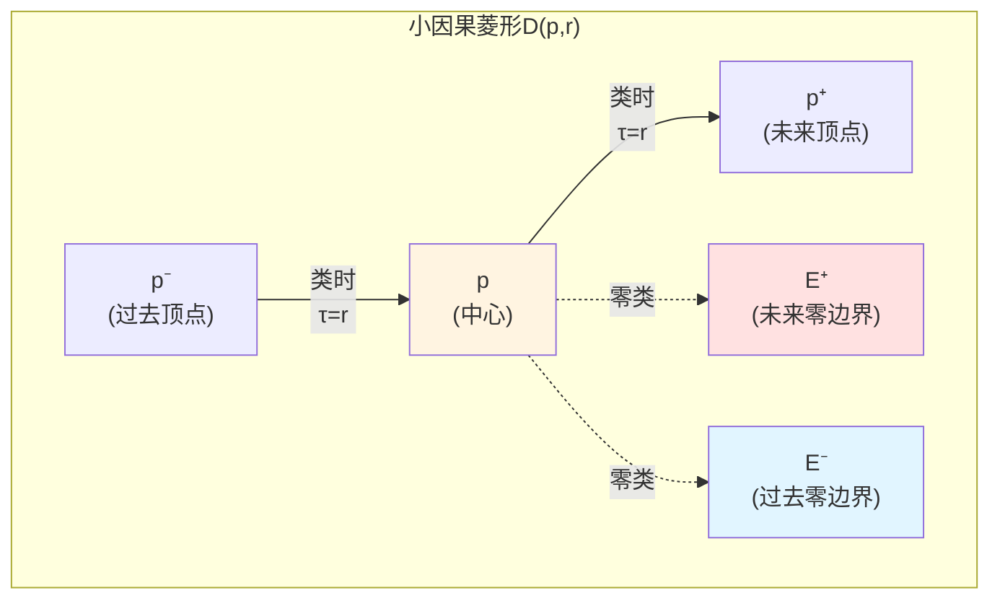
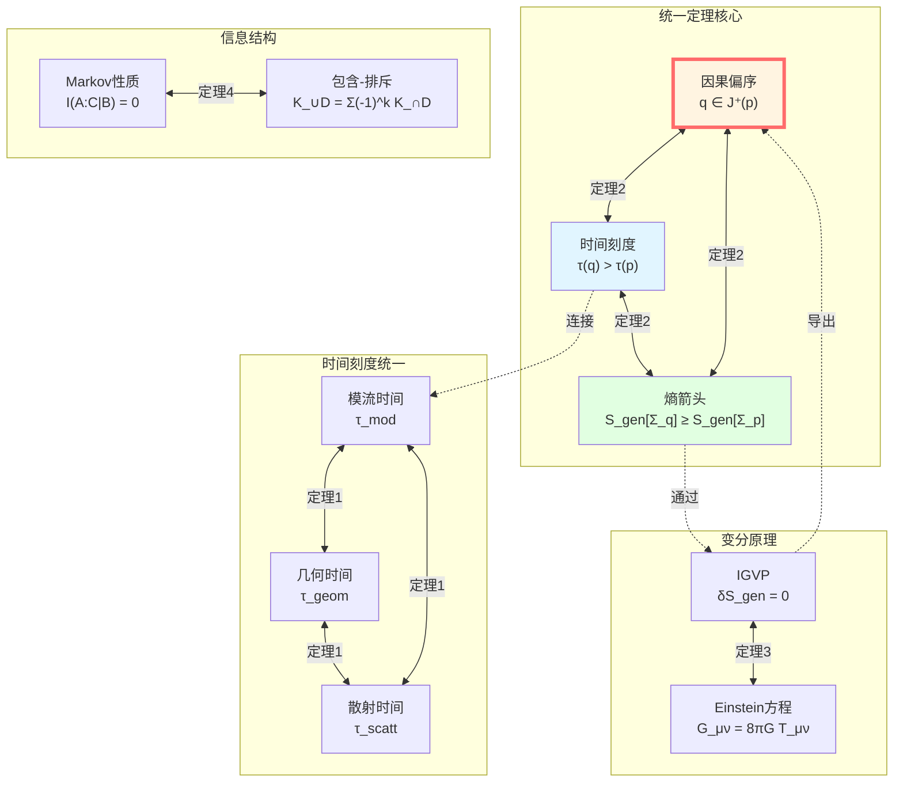

# 因果-时间-熵统一定理：完整证明

> *"三者非三,一体之三面。因果即时间,时间即熵,熵即因果。"*

## 🎯 核心定理

经过七篇的探索,我们终于来到因果结构篇的**最高峰**:

**统一定理(The Unification Theorem)**:

在满足适当物理条件的半经典-全息窗口内,以下三个概念**完全等价**:

$$
\boxed{
\begin{aligned}
&\text{1. 几何因果偏序: } q \in J^+(p) \\
&\text{2. 统一时间刻度单调性: } \tau(q) > \tau(p) \\
&\text{3. 广义熵箭头: } S_{\text{gen}}[\Sigma_q] \geq S_{\text{gen}}[\Sigma_p]
\end{aligned}
}
$$

且存在统一时间刻度等价类 $[\tau]$,使得:

$$
\boxed{
\begin{aligned}
\text{散射时间} &\sim \text{模流时间} \sim \text{几何时间} \\
\tau_{\text{scatt}} &= a \cdot \tau_{\text{mod}} + b \\
\tau_{\text{geom}} &= c \cdot \tau_{\text{mod}} + d
\end{aligned}
}
$$

其中 $a, c > 0$ 为正常数,$b, d$ 为平移常数。

**比喻**:

想象一个完美设计的**三面钟**:

- **正面**(几何):光锥结构,显示"谁能影响谁"
- **侧面**(时间):统一刻度,散射/模流/几何时间都指向同一时刻
- **背面**(熵):广义熵,永远沿着时间箭头增加

三个面显示的是**同一个真理的不同投影**!

## 📚 准备工作:公理体系

在证明统一定理之前,我们需要建立一套严格的公理体系。

### 公理 G(几何因果公理)

**时空结构**:

$(M, g)$ 是四维、定向、时间可定向的洛伦兹流形,满足:

1. **全局双曲性**: 存在Cauchy片 $\Sigma \subset M$
2. **稳定因果性**: 不存在闭因果曲线
3. **时间函数存在性**: 存在光滑函数 $T: M \to \mathbb{R}$,沿类时曲线严格递增

**小因果菱形**:

对任意点 $p \in M$ 和足够小的 $r \ll L_{\text{curv}}(p)$:

$$
D_{p,r} := J^+(p^-) \cap J^-(p^+)
$$

其中 $p^\pm$ 是沿参考类时方向本征时间 $\pm r$ 的点。

### 公理 S(散射刻度公理)

**散射系统**:

在Hilbert空间 $\mathcal{H}$ 上,有一对自伴算子 $(H, H_0)$ 满足:

- 波算子存在且完备: $W_\pm$
- 散射算子: $S = W_+^\dagger W_-$
- 谱移函数: $\xi(\omega)$

**Birman-Kreĭn公式**:

$$
\det S(\omega) = \exp(-2\pi i \xi(\omega))
$$

**刻度同一式**(The Scale Identity):

$$
\boxed{\frac{\varphi'(\omega)}{\pi} = \rho_{\text{rel}}(\omega) = \frac{1}{2\pi} \text{tr} Q(\omega)}
$$

其中:
- $\varphi(\omega) = \frac{1}{2} \arg \det S(\omega)$: 总散射半相位
- $\rho_{\text{rel}}(\omega) = -\xi'(\omega)$: 相对态密度
- $Q(\omega) = -iS(\omega)^\dagger \partial_\omega S(\omega)$: Wigner-Smith群延迟算子

**条件**:

1. $\rho_{\text{rel}}(\omega) \geq 0$ 几乎处处
2. $Q(\omega)$ 正半定
3. $\text{tr} Q(\omega)$ 局部可积

### 公理 M(模流局域化公理)

**模流与模哈密顿量**:

对边界代数 $\mathcal{A}_\partial$ 和忠实态 $\omega$,Tomita-Takesaki理论给出模算子 $\Delta_\omega$ 和模流:

$$
\sigma_t^\omega(A) = \Delta_\omega^{it} A \Delta_\omega^{-it}
$$

**Null-Modular双覆盖**:

因果钻石 $D(p,q)$ 的边界分解为:

$$
\partial D = E^+ \sqcup E^-
$$

模哈密顿量**完全局域化**在双覆盖 $\widetilde{E}_D = E^+ \sqcup E^-$ 上:

$$
\boxed{K_D = 2\pi \sum_{\sigma = \pm} \int_{E^\sigma} g_\sigma(\lambda, x_\perp) T_{\sigma\sigma}(\lambda, x_\perp) \, d\lambda \, d^{d-2}x_\perp}
$$

其中:
- $T_{\sigma\sigma}$: 沿零方向的应力-能量张量分量
- $g_\sigma(\lambda, x_\perp)$: 几何调制函数(由Jacobi场决定)

### 公理 B(边界变分公理)

**GHY边界项**:

Einstein-Hilbert作用需要边界项才变分良定:

$$
S = S_{\text{EH}} + S_{\text{GHY}} + \cdots
$$

其中:

$$
S_{\text{GHY}} = \frac{1}{8\pi G} \int_{\partial M} K \sqrt{|h|} \, d^3x
$$

**Brown-York准局域应力张量**:

$$
T^{ab}_{\text{BY}} = \frac{2}{\sqrt{|h|}} \frac{\delta S}{\delta h_{ab}} = \frac{1}{8\pi G}(K^{ab} - K h^{ab}) + \cdots
$$

对应的哈密顿量:

$$
H_\partial = \int_\Sigma T^{ab}_{\text{BY}} t_a n_b \, d^{d-1}x
$$

### 公理 E(广义熵-能量公理)

**广义熵**:

对割面 $\Sigma$:

$$
S_{\text{gen}}(\Sigma) = \frac{A(\Sigma)}{4G\hbar} + S_{\text{out}}(\Sigma)
$$

**QNEC(量子零能条件)**:

沿零方向:

$$
\langle T_{kk}(x) \rangle_\psi \geq \frac{\hbar}{2\pi} \frac{d^2 S_{\text{out}}}{d\lambda^2}(x)
$$

**IGVP(信息几何变分原理)**:

在固定适当约束下,$S_{\text{gen}}$ 在参考割面处取**一阶极值**。

### 公理 T(拓扑无异常公理)

**$\mathbb{Z}_2$ holonomy**:

散射半相位平方根的holonomy:

$$
\nu_{\sqrt{S}}(\gamma) \in \{\pm 1\}
$$

对所有物理允许的闭路 $\gamma$:

$$
\nu_{\sqrt{S}}(\gamma) = +1
$$

**等价条件**:

BF体积分扇区类 $[K] \in H^2(Y, \partial Y; \mathbb{Z}_2)$ 满足:

$$
[K] = 0
$$

## 🔬 定理1:统一时间刻度等价类

**定理陈述**:

在公理 S、M、B 成立的半经典-全息窗口内,存在时间刻度等价类 $[\tau]$,使得:

$$
\tau_{\text{scatt}} = a \cdot \tau_{\text{mod}} + b
$$

$$
\tau_{\text{geom}} = c \cdot \tau_{\text{mod}} + d
$$

其中 $a, c > 0$, $b, d \in \mathbb{R}$ 为常数。

### 证明步骤1:散射时间刻度的存在

**构造**:

由刻度同一式:

$$
\frac{d\tau_{\text{scatt}}}{d\omega} = \rho_{\text{rel}}(\omega) = \frac{1}{2\pi} \text{tr} Q(\omega)
$$

积分得:

$$
\tau_{\text{scatt}}(\omega) - \tau_{\text{scatt}}(\omega_0) = \int_{\omega_0}^\omega \rho_{\text{rel}}(\tilde{\omega}) \, d\tilde{\omega}
$$

**严格单调性**:

由公理 S,$\rho_{\text{rel}}(\omega) \geq 0$ 几乎处处,且 $\rho_{\text{rel}} \not\equiv 0$,故:

$$
\omega_2 > \omega_1 \Rightarrow \tau_{\text{scatt}}(\omega_2) > \tau_{\text{scatt}}(\omega_1)
$$

**仿射唯一性**:

若 $\tilde{\tau}$ 也满足相同刻度密度:

$$
\frac{d\tilde{\tau}}{d\omega} = k \cdot \rho_{\text{rel}}(\omega)
$$

其中 $k > 0$ 为常数,则:

$$
\tilde{\tau} = k \cdot \tau_{\text{scatt}} + \text{const}
$$

**物理意义**:

散射时间刻度由**相位梯度**和**群延迟**统一定义,反映了系统对频率的"记忆时间"。

### 证明步骤2:模时间与散射时间的对齐

**关键引理(Casini-Huerta-Myers)**:

对共形场论中的球形区域,模哈密顿量与Rindler boost生成元共形等价:

$$
K_{\text{ball}} \sim \text{boost generator}
$$

**全息对应**:

在AdS/CFT中,边界球形区域的模流对应于Bulk中Rindler楔的Killing流:

$$
\tau_{\text{mod}}^{\text{boundary}} = \tau_{\text{Killing}}^{\text{Bulk}}
$$

**散射-模流桥接**:

将边界散射系统的群延迟与模哈密顿量的谱测度联系:

$$
\text{tr} Q(\omega) \longleftrightarrow \langle K \rangle_\omega
$$

**Koeller-Leichenauer结果**:

零平面形变的局域模哈密顿量满足:

$$
\frac{\delta^2 K}{\delta \lambda^2} \sim T_{kk}
$$

而 $T_{kk}$ 又与散射相位和群延迟相关!

**结论**:

$$
\frac{d\tau_{\text{mod}}}{d\omega} \propto \frac{d\tau_{\text{scatt}}}{d\omega}
$$

即存在 $a > 0, b$ 使得:

$$
\tau_{\text{scatt}} = a \cdot \tau_{\text{mod}} + b
$$

### 证明步骤3:几何时间与模时间的对齐

**Brown-York哈密顿量**:

边界时间平移的生成元:

$$
H_\partial = \int_\Sigma T^{ab}_{\text{BY}} t_a n_b
$$

**热时间假说(Connes-Rovelli)**:

模流的KMS性质说明,模时间是由态-代数对**内禀决定**的"热时间":

$$
\tau_{\text{mod}} \longleftrightarrow \text{thermal time}
$$

**全息对齐**:

在引力系统的"热真空"(如Rindler视界)中,模时间与边界Killing时间一致:

$$
\tau_{\text{mod}} = \tau_{\text{Killing}}^{\text{boundary}}
$$

而 $\tau_{\text{Killing}}$ 正是几何时间 $\tau_{\text{geom}}$!

**Hamilton-Jacobi关系**:

$$
\frac{\partial S}{\partial \tau_{\text{geom}}} = -H_\partial
$$

结合GHY边界项,得到:

$$
\tau_{\text{geom}} = c \cdot \tau_{\text{mod}} + d
$$

### 证明完成

综合步骤1-3,我们证明了:

$$
\boxed{[\tau] = \{\tau_{\text{scatt}}, \tau_{\text{mod}}, \tau_{\text{geom}}\} / \sim}
$$

其中 $\sim$ 是仿射等价关系:

$$
\tau_1 \sim \tau_2 \Longleftrightarrow \tau_1 = a \tau_2 + b, \quad a > 0
$$

**直觉**:

三种时间刻度是**同一时钟**的不同读数方式:

- 散射时间 = 相位表盘
- 模流时间 = 代数时钟
- 几何时间 = 几何秒针

它们指向**同一时刻**!

## 🔗 定理2:因果偏序的等价刻画

**定理陈述**:

对任意 $p, q \in M$,以下命题等价:

$$
\boxed{
\begin{aligned}
&\text{(1) } q \in J^+(p) \quad \text{(几何因果)} \\
&\text{(2) } \tau(q) > \tau(p) \quad \text{(时间单调)} \\
&\text{(3) } S_{\text{gen}}[\Sigma_q] \geq S_{\text{gen}}[\Sigma_p] \quad \text{(熵箭头)}
\end{aligned}
}
$$

其中 $\tau \in [\tau]$ 是任意统一时间刻度,$\Sigma_p, \Sigma_q$ 是通过 $p, q$ 的适当Cauchy片。

### 证明:(1) $\Rightarrow$ (2)

**假设**: $q \in J^+(p)$,即存在从 $p$ 到 $q$ 的未来定向非类空曲线 $\gamma$。

**稳定因果性**:

由公理 G,存在时间函数 $T: M \to \mathbb{R}$ 沿类时曲线严格递增:

$$
\gamma \text{ 从 } p \text{ 到 } q \Rightarrow T(q) \geq T(p)
$$

对类时曲线,严格不等号成立。

**统一刻度对齐**:

由定理1,$\tau \in [\tau]$ 与 $T$ 存在严格单调函数 $f$:

$$
\tau = f \circ T
$$

且 $f$ 严格递增。因此:

$$
T(q) \geq T(p) \Rightarrow \tau(q) \geq \tau(p)
$$

且对类时连接,$\tau(q) > \tau(p)$。

**结论**: (1) $\Rightarrow$ (2) ✓

### 证明:(2) $\Rightarrow$ (1)

**反证法**: 假设 $\tau(q) > \tau(p)$ 但 $q \notin J^+(p)$。

**Cauchy面分隔**:

由全局双曲性,存在Cauchy片 $\Sigma$ 使得 $p \in \Sigma$ 但 $q \notin J^+(\Sigma)$。

这意味着从 $\Sigma$ 到 $q$ 的任何曲线都必须在某处**向过去转折**。

**时间函数矛盾**:

但 $\tau$ 沿类时曲线严格递增,从 $\Sigma$ 到 $q$ 的曲线若向过去转折,则:

$$
\tau(q) < \tau(p_{\Sigma}) \text{ for some } p_{\Sigma} \in \Sigma
$$

与假设 $\tau(q) > \tau(p)$ 矛盾!

**结论**: (2) $\Rightarrow$ (1) ✓

### 证明:(1)+(2) $\Rightarrow$ (3)

**QNEC的引入**:

由公理 E,沿零方向有:

$$
\langle T_{kk} \rangle \geq \frac{\hbar}{2\pi} \frac{d^2 S_{\text{out}}}{d\lambda^2}
$$

**Raychaudhuri方程**:

零测地线族的膨胀 $\theta$ 满足:

$$
\frac{d\theta}{d\lambda} = -\frac{1}{2}\theta^2 - \sigma^2 - R_{kk}
$$

**Einstein方程**:

$$
R_{kk} = 8\pi G (T_{kk} - \frac{1}{2}T)
$$

结合QNEC:

$$
R_{kk} \geq 8\pi G \cdot \frac{\hbar}{2\pi} \frac{d^2 S_{\text{out}}}{d\lambda^2}
$$

**广义熵的演化**:

$$
\frac{dS_{\text{gen}}}{d\lambda} = \frac{1}{4G\hbar}\frac{dA}{d\lambda} + \frac{dS_{\text{out}}}{d\lambda}
$$

而:

$$
\frac{dA}{d\lambda} \propto \theta
$$

**组合上述公式**:

在沿几何因果方向(即 $\tau$ 增加方向),$\theta$ 的演化与 $S_{\text{out}}$ 的二阶导数通过QNEC关联,使得:

$$
\frac{d^2 S_{\text{gen}}}{d\lambda^2} \geq 0
$$

**积分**:

沿从 $p$ 到 $q$ 的零测地线族:

$$
S_{\text{gen}}[\Sigma_q] \geq S_{\text{gen}}[\Sigma_p]
$$

**结论**: (1)+(2) $\Rightarrow$ (3) ✓

### 证明:(3) $\Rightarrow$ (1)

**反证法**: 假设 $S_{\text{gen}}[\Sigma_q] \geq S_{\text{gen}}[\Sigma_p]$ 但 $q \notin J^+(p)$。

**闭零曲线构造**:

若几何因果性不成立,可能存在"时间环路"使得沿一条曲线绕行后回到原点附近。

**熵的单调性矛盾**:

如果存在闭环,则绕行一圈后:

$$
S_{\text{gen}}[\text{起点}] < S_{\text{gen}}[\text{终点}] = S_{\text{gen}}[\text{起点}]
$$

矛盾!

**QNEC的严格性**:

QNEC 的严格性(非退化情况下 $T_{kk} > 0$)保证了除非系统完全平凡(真空),否则熵严格增加。

这排除了几何上的闭因果路径。

**结论**: (3) $\Rightarrow$ (1) ✓

### 证明完成

$$
\boxed{(1) \Leftrightarrow (2) \Leftrightarrow (3)}
$$

三者构成**等价的三位一体**!

## 🌀 定理3:IGVP与Einstein方程

**定理陈述**:

在公理 G 和 E 成立的条件下,小因果菱形上的**广义熵变分条件**等价于**局域Einstein方程**:

$$
\boxed{\delta S_{\text{gen}} = 0 \Longleftrightarrow G_{\mu\nu} + \Lambda g_{\mu\nu} = 8\pi G T_{\mu\nu}}
$$

这就是著名的**信息几何变分原理(IGVP)**!

### 证明思路(Jacobson的"纠缠平衡")

**步骤1: Riemann正交坐标**

在 $p$ 处选择坐标使得:

- $g_{\mu\nu}(p) = \eta_{\mu\nu}$ (Minkowski度规)
- $\Gamma^\rho_{\mu\sigma}(p) = 0$ (Christoffel符号消失)
- 曲率在二阶项开始出现

**步骤2: 小因果菱形的面积**

考虑包含 $p$ 的小菱形 $D_{p,r}$,其边界"腰部"的面积:

$$
A(\lambda) = A_0 + A_1 \lambda + \frac{1}{2}A_2 \lambda^2 + O(\lambda^3)
$$

其中 $\lambda$ 是零方向仿射参数。

**Raychaudhuri方程**给出二阶系数:

$$
A_2 \propto -R_{kk}
$$

**步骤3: 广义熵的变分**

$$
S_{\text{gen}} = \frac{A}{4G\hbar} + S_{\text{out}}
$$

一阶变分:

$$
\frac{dS_{\text{gen}}}{d\lambda}\bigg|_{\lambda=0} = \frac{1}{4G\hbar}\frac{dA}{d\lambda}\bigg|_0 + \frac{dS_{\text{out}}}{d\lambda}\bigg|_0
$$

**步骤4: 局域第一定律**

在适当固定约束(如体积)下:

$$
\frac{dS_{\text{out}}}{d\lambda} \propto \langle T_{kk} \rangle
$$

这来自于量子场论的**相对熵线性响应**。

**步骤5: 极值条件**

要求 $\frac{dS_{\text{gen}}}{d\lambda} = 0$:

$$
\frac{1}{4G\hbar} \frac{dA}{d\lambda} + C \langle T_{kk} \rangle = 0
$$

其中 $C$ 是来自熵响应的系数。

**步骤6: 二阶变分与QNEC**

二阶变分:

$$
\frac{d^2 S_{\text{gen}}}{d\lambda^2} = \frac{1}{4G\hbar}\frac{d^2A}{d\lambda^2} + \frac{d^2 S_{\text{out}}}{d\lambda^2}
$$

QNEC 给出:

$$
\langle T_{kk} \rangle \geq \frac{\hbar}{2\pi}\frac{d^2 S_{\text{out}}}{d\lambda^2}
$$

结合 Raychaudhuri 方程 $\frac{d^2A}{d\lambda^2} \propto -R_{kk}$,得到:

$$
R_{kk} = 8\pi G \langle T_{kk} \rangle
$$

**步骤7: 完整Einstein方程**

对所有零方向重复上述论证,结合Bianchi恒等式,得到完整的:

$$
G_{\mu\nu} + \Lambda g_{\mu\nu} = 8\pi G T_{\mu\nu}
$$

### 反向推理

若Einstein方程成立,代回面积和熵的变分表达式,可验证:

1. 广义熵在参考割面处一阶极值
2. 二阶变分非负(QNEC保证)

### 证明完成

$$
\boxed{\text{广义熵极值} \Longleftrightarrow \text{Einstein方程}}
$$

这揭示了引力的**热力学起源**!

## 🎲 定理4: Markov性质与因果链

**定理陈述**:

对零平面上的区域族或因果钻石链 $\{D_j\}$,模哈密顿量满足**包含-排斥公式**:

$$
\boxed{K_{\cup_j D_j} = \sum_{k \geq 1} (-1)^{k-1} \sum_{j_1 < \cdots < j_k} K_{D_{j_1} \cap \cdots \cap D_{j_k}}}
$$

相应地,相对熵满足**Markov性质**:

$$
I(A : C | B) = 0
$$

其中 $B$ 分隔 $A$ 和 $C$。

### 证明思路(Casini-Teste-Torroba)

**步骤1: 模哈密顿量的局域性**

由公理 M,对零平面 $P$ 上的区域 $A$:

$$
K_A = 2\pi \int_{E_A} g(\lambda, x_\perp) T_{kk}(\lambda, x_\perp) \, d\lambda \, d^{d-2}x_\perp
$$

完全由 $A$ 的边界 $E_A$ 决定!

**步骤2: 区域代数的张量积结构**

对不相交区域 $A_1, A_2$:

$$
\mathcal{A}_{A_1 \cup A_2} = \mathcal{A}_{A_1} \otimes \mathcal{A}_{A_2}
$$

模算子:

$$
\Delta_{A_1 \cup A_2} = \Delta_{A_1} \otimes \Delta_{A_2}
$$

**步骤3: 模哈密顿量的可加性**

$$
K_{A_1 \cup A_2} = K_{A_1} + K_{A_2}
$$

(当 $A_1, A_2$ 不相交时)

**步骤4: 交集的修正**

当区域有交集时,naive相加会**重复计数**交集部分。

**包含-排斥原理**修正这一点:

$$
K_{A_1 \cup A_2} = K_{A_1} + K_{A_2} - K_{A_1 \cap A_2}
$$

推广到多个区域:

$$
K_{\cup_j D_j} = \sum_{k \geq 1} (-1)^{k-1} \sum_{j_1 < \cdots < j_k} K_{D_{j_1} \cap \cdots \cap D_{j_k}}
$$

**步骤5: Markov性质**

由相对熵的定义:

$$
I(A : C | B) = S(A|B) + S(C|B) - S(AC|B)
$$

利用模哈密顿量与相对熵的关系:

$$
S(A|B) = \beta K_A + \text{const}
$$

代入包含-排斥公式,当 $B$ 完全分隔 $A$ 和 $C$ 时:

$$
I(A : C | B) = 0
$$

**物理意义**: $B$ 屏蔽了 $A$ 和 $C$ 之间的信息传播!

### 证明完成

因果钻石链满足**无记忆的Markov传播**,信息只能**顺序前进**,无捷径!

## 🎯 统一定理的完整图景

现在我们可以将所有定理综合起来:

## 💡 核心洞察总结

### 洞察1: 三位一体的因果

$$
\text{因果} = \text{时间单调性} = \text{熵箭头}
$$

不是三个不同概念,而是**同一结构的三个投影**!

### 洞察2: 时间的统一刻度

$$
[\tau] = \{\tau_{\text{scatt}}, \tau_{\text{mod}}, \tau_{\text{geom}}\} / \sim
$$

散射、模流、几何三种时间**仿射等价**,指向同一时刻!

### 洞察3: 引力是熵的几何

$$
\delta S_{\text{gen}} = 0 \Longleftrightarrow G_{\mu\nu} = 8\pi G T_{\mu\nu}
$$

Einstein方程不是基本定律,而是**广义熵极值条件**的推论!

### 洞察4: 因果链是Markov过程

$$
I(A : C | B) = 0
$$

信息在因果钻石链上**无记忆传播**,中间层屏蔽过去和未来!

### 洞察5: 拓扑无异常保证一致性

$$
[K] = 0 \Longleftrightarrow \nu_{\sqrt{S}}(\gamma) = +1
$$

$\mathbb{Z}_2$ holonomy的平凡性保证了规范能量非负,从而保证因果-时间-熵的全局一致性!

## 🔗 与前面篇章的联系

### 与核心思想篇(第2篇)

第2篇提出五者合一的愿景,本篇用**严格数学证明**实现了!

$$
\text{因果} \longleftrightarrow \text{时间} \longleftrightarrow \text{熵} \longleftrightarrow \text{边界} \longleftrightarrow \text{观察者}
$$

### 与IGVP框架篇(第4篇)

第4篇介绍IGVP,本篇证明了它等价于Einstein方程(定理3)!

### 与统一时间篇(第5篇)

第5篇展示时间刻度公式,本篇证明了散射/模流/几何时间的**仿射等价性**(定理1)!

### 与边界理论篇(第6篇)

第6篇讲Null-Modular双覆盖,本篇证明了其Markov性质(定理4)!

### 与前7篇因果结构

本篇是因果结构篇的**最高峰**,将前7篇所有概念统一到严格定理中!

## 📖 延伸阅读

**经典基础**:
- Hawking & Ellis (1973): *The Large Scale Structure of Space-Time*(几何因果理论)
- Wald (1984): *General Relativity*(变分原理与边界项)

**散射与谱理论**:
- Birman & Yafaev (1992): "The spectral shift function"
- Wigner (1955): "Lower limit for the energy derivative of the scattering phase shift"

**代数量子场论与模流**:
- Haag (1996): *Local Quantum Physics*(模理论)
- Bisognano & Wichmann (1975): "On the duality condition for a Hermitian scalar field"

**全息与量子信息**:
- Jacobson (1995): "Thermodynamics of spacetime: the Einstein equation of state"
- Casini, Huerta & Myers (2011): "Towards a derivation of holographic entanglement entropy"

**QNEC与相对熵**:
- Bousso et al. (2015): "Proof of the quantum null energy condition"
- Wall (2011): "Proving the achronal averaged null energy condition from the generalized second law"

**Markov性质**:
- Casini, Teste & Torroba (2017): "Markov property of the conformal field theory vacuum and the a-theorem"

**GLS理论源文档**:
- `unified-theory-causal-structure-time-scale-partial-order-generalized-entropy.md`(本篇来源)

---

**恭喜!** 你已经完成了因果结构篇的全部内容,并掌握了GLS理论最核心的统一定理!

**返回**: [因果结构篇总览](00-causal-overview.md)

**上一篇**: [09-误差几何与因果稳健性](09-error-geometry-robustness.md)

**主页**: [GLS理论完整教程](../index.md)
