# Unified Theorem of Causality-Time-Entropy: Complete Proof

> *"Three are not three, but three aspects of one. Causality is time, time is entropy, entropy is causality."*

## 🎯 Core Theorem

After exploring seven chapters, we finally reach the **highest peak** of the Causal Structure chapter:

**Unification Theorem**:

Within the semiclassical-holographic window satisfying appropriate physical conditions, the following three concepts are **completely equivalent**:

$$
\boxed{
\begin{aligned}
&\text{1. Geometric Causal Partial Order: } q \in J^+(p) \\
&\text{2. Unified Time Scale Monotonicity: } \tau(q) > \tau(p) \\
&\text{3. Generalized Entropy Arrow: } S_{\text{gen}}[\Sigma_q] \geq S_{\text{gen}}[\Sigma_p]
\end{aligned}
}
$$

And there exists unified time scale equivalence class $[\tau]$ such that:

$$
\boxed{
\begin{aligned}
\text{Scattering Time} &\sim \text{Modular Flow Time} \sim \text{Geometric Time} \\
\tau_{\text{scatt}} &= a \cdot \tau_{\text{mod}} + b \\
\tau_{\text{geom}} &= c \cdot \tau_{\text{mod}} + d
\end{aligned}
}
$$

where $a, c > 0$ are positive constants, $b, d$ are translation constants.

**Analogy**:

Imagine a perfectly designed **three-faced clock**:

- **Front Face** (Geometry): Light cone structure, shows "who can affect whom"
- **Side Face** (Time): Unified scale, scattering/modular flow/geometric time all point to same moment
- **Back Face** (Entropy): Generalized entropy, always increases along time arrow

Three faces display **different projections of the same truth**!

## 📚 Preparation: Axiom System

Before proving the unification theorem, we need to establish a rigorous axiom system.

### Axiom G (Geometric Causality Axiom)

**Spacetime Structure**:

$(M, g)$ is a four-dimensional, oriented, time-orientable Lorentzian manifold satisfying:

1. **Global Hyperbolicity**: Exists Cauchy slice $\Sigma \subset M$
2. **Stable Causality**: No closed causal curves
3. **Time Function Existence**: Exists smooth function $T: M \to \mathbb{R}$, strictly increasing along timelike curves

**Small Causal Diamond**:

For any point $p \in M$ and sufficiently small $r \ll L_{\text{curv}}(p)$:

$$
D_{p,r} := J^+(p^-) \cap J^-(p^+)
$$

where $p^\pm$ are points at proper time $\pm r$ along reference timelike direction.

```mermaid
graph TB
    subgraph "Small Causal Diamond D(p,r)"
        PPLUS["p⁺<br/>(Future Vertex)"]
        CENTER["p<br/>(Center)"]
        PMINUS["p⁻<br/>(Past Vertex)"]

        PMINUS -->|"Timelike<br/>τ=r"| CENTER
        CENTER -->|"Timelike<br/>τ=r"| PPLUS

        EPLUS["E⁺<br/>(Future Null Boundary)"]
        EMINUS["E⁻<br/>(Past Null Boundary)"]

        CENTER -.->|"Null"| EPLUS
        CENTER -.->|"Null"| EMINUS
    end

    style CENTER fill:#fff4e1
    style EPLUS fill:#ffe1e1
    style EMINUS fill:#e1f5ff
```

### Axiom S (Scattering Scale Axiom)

**Scattering System**:

On Hilbert space $\mathcal{H}$, there is a pair of self-adjoint operators $(H, H_0)$ satisfying:

- Wave operators exist and complete: $W_\pm$
- Scattering operator: $S = W_+^\dagger W_-$
- Spectral shift function: $\xi(\omega)$

**Birman-Kreĭn Formula**:

$$
\det S(\omega) = \exp(-2\pi i \xi(\omega))
$$

**Scale Identity**:

$$
\boxed{\frac{\varphi'(\omega)}{\pi} = \rho_{\text{rel}}(\omega) = \frac{1}{2\pi} \text{tr} Q(\omega)}
$$

where:
- $\varphi(\omega) = \frac{1}{2} \arg \det S(\omega)$: Total scattering half-phase
- $\rho_{\text{rel}}(\omega) = -\xi'(\omega)$: Relative density of states
- $Q(\omega) = -iS(\omega)^\dagger \partial_\omega S(\omega)$: Wigner-Smith group delay operator

**Conditions**:

1. $\rho_{\text{rel}}(\omega) \geq 0$ almost everywhere
2. $Q(\omega)$ positive semi-definite
3. $\text{tr} Q(\omega)$ locally integrable

### Axiom M (Modular Flow Localization Axiom)

**Modular Flow and Modular Hamiltonian**:

For boundary algebra $\mathcal{A}_\partial$ and faithful state $\omega$, Tomita-Takesaki theory gives modular operator $\Delta_\omega$ and modular flow:

$$
\sigma_t^\omega(A) = \Delta_\omega^{it} A \Delta_\omega^{-it}
$$

**Null-Modular Double Cover**:

Boundary of causal diamond $D(p,q)$ decomposes as:

$$
\partial D = E^+ \sqcup E^-
$$

Modular Hamiltonian is **completely localized** on double cover $\widetilde{E}_D = E^+ \sqcup E^-$:

$$
\boxed{K_D = 2\pi \sum_{\sigma = \pm} \int_{E^\sigma} g_\sigma(\lambda, x_\perp) T_{\sigma\sigma}(\lambda, x_\perp) \, d\lambda \, d^{d-2}x_\perp}
$$

where:
- $T_{\sigma\sigma}$: Stress-energy tensor component along null direction
- $g_\sigma(\lambda, x_\perp)$: Geometric modulation function (determined by Jacobi fields)

### Axiom B (Boundary Variation Axiom)

**GHY Boundary Term**:

Einstein-Hilbert action needs boundary term to be variationally well-defined:

$$
S = S_{\text{EH}} + S_{\text{GHY}} + \cdots
$$

where:

$$
S_{\text{GHY}} = \frac{1}{8\pi G} \int_{\partial M} K \sqrt{|h|} \, d^3x
$$

**Brown-York Quasi-Local Stress Tensor**:

$$
T^{ab}_{\text{BY}} = \frac{2}{\sqrt{|h|}} \frac{\delta S}{\delta h_{ab}} = \frac{1}{8\pi G}(K^{ab} - K h^{ab}) + \cdots
$$

Corresponding Hamiltonian:

$$
H_\partial = \int_\Sigma T^{ab}_{\text{BY}} t_a n_b \, d^{d-1}x
$$

### Axiom E (Generalized Entropy-Energy Axiom)

**Generalized Entropy**:

For cut surface $\Sigma$:

$$
S_{\text{gen}}(\Sigma) = \frac{A(\Sigma)}{4G\hbar} + S_{\text{out}}(\Sigma)
$$

**QNEC (Quantum Null Energy Condition)**:

Along null direction:

$$
\langle T_{kk}(x) \rangle_\psi \geq \frac{\hbar}{2\pi} \frac{d^2 S_{\text{out}}}{d\lambda^2}(x)
$$

**IGVP (Information Geometric Variational Principle)**:

Under appropriate fixed constraints, $S_{\text{gen}}$ takes **first-order extremum** at reference cut surface.

### Axiom T (Topological Anomaly-Free Axiom)

**$\mathbb{Z}_2$ Holonomy**:

Holonomy of square root of scattering half-phase:

$$
\nu_{\sqrt{S}}(\gamma) \in \{\pm 1\}
$$

For all physically allowed closed loops $\gamma$:

$$
\nu_{\sqrt{S}}(\gamma) = +1
$$

**Equivalent Condition**:

BF volume integral sector class $[K] \in H^2(Y, \partial Y; \mathbb{Z}_2)$ satisfies:

$$
[K] = 0
$$

## 🔬 Theorem 1: Unified Time Scale Equivalence Class

**Theorem Statement**:

Within semiclassical-holographic window where Axioms S, M, B hold, there exists time scale equivalence class $[\tau]$ such that:

$$
\tau_{\text{scatt}} = a \cdot \tau_{\text{mod}} + b
$$

$$
\tau_{\text{geom}} = c \cdot \tau_{\text{mod}} + d
$$

where $a, c > 0$, $b, d \in \mathbb{R}$ are constants.

### Proof Step 1: Existence of Scattering Time Scale

**Construction**:

From scale identity:

$$
\frac{d\tau_{\text{scatt}}}{d\omega} = \rho_{\text{rel}}(\omega) = \frac{1}{2\pi} \text{tr} Q(\omega)
$$

Integrating:

$$
\tau_{\text{scatt}}(\omega) - \tau_{\text{scatt}}(\omega_0) = \int_{\omega_0}^\omega \rho_{\text{rel}}(\tilde{\omega}) \, d\tilde{\omega}
$$

**Strict Monotonicity**:

By Axiom S, $\rho_{\text{rel}}(\omega) \geq 0$ almost everywhere, and $\rho_{\text{rel}} \not\equiv 0$, therefore:

$$
\omega_2 > \omega_1 \Rightarrow \tau_{\text{scatt}}(\omega_2) > \tau_{\text{scatt}}(\omega_1)
$$

**Affine Uniqueness**:

If $\tilde{\tau}$ also satisfies same scale density:

$$
\frac{d\tilde{\tau}}{d\omega} = k \cdot \rho_{\text{rel}}(\omega)
$$

where $k > 0$ is constant, then:

$$
\tilde{\tau} = k \cdot \tau_{\text{scatt}} + \text{const}
$$

**Physical Meaning**:

Scattering time scale is uniformly defined by **phase gradient** and **group delay**, reflecting system's "memory time" for frequency.

### Proof Step 2: Alignment of Modular Time and Scattering Time

**Key Lemma (Casini-Huerta-Myers)**:

For spherical regions in conformal field theory, modular Hamiltonian is conformally equivalent to Rindler boost generator:

$$
K_{\text{ball}} \sim \text{boost generator}
$$

**Holographic Correspondence**:

In AdS/CFT, modular flow of boundary spherical region corresponds to Killing flow of Rindler wedge in Bulk:

$$
\tau_{\text{mod}}^{\text{boundary}} = \tau_{\text{Killing}}^{\text{Bulk}}
$$

**Scattering-Modular Flow Bridge**:

Relate group delay of boundary scattering system with spectral measure of modular Hamiltonian:

$$
\text{tr} Q(\omega) \longleftrightarrow \langle K \rangle_\omega
$$

**Koeller-Leichenauer Result**:

Local modular Hamiltonian of null plane deformation satisfies:

$$
\frac{\delta^2 K}{\delta \lambda^2} \sim T_{kk}
$$

And $T_{kk}$ is related to scattering phase and group delay!

**Conclusion**:

$$
\frac{d\tau_{\text{mod}}}{d\omega} \propto \frac{d\tau_{\text{scatt}}}{d\omega}
$$

That is, there exist $a > 0, b$ such that:

$$
\tau_{\text{scatt}} = a \cdot \tau_{\text{mod}} + b
$$

### Proof Step 3: Alignment of Geometric Time and Modular Time

**Brown-York Hamiltonian**:

Generator of boundary time translation:

$$
H_\partial = \int_\Sigma T^{ab}_{\text{BY}} t_a n_b
$$

**Thermal Time Hypothesis (Connes-Rovelli)**:

KMS property of modular flow shows modular time is **intrinsically determined** "thermal time" by state-algebra pair:

$$
\tau_{\text{mod}} \longleftrightarrow \text{thermal time}
$$

**Holographic Alignment**:

In "thermal vacuum" of gravitational system (e.g., Rindler horizon), modular time coincides with boundary Killing time:

$$
\tau_{\text{mod}} = \tau_{\text{Killing}}^{\text{boundary}}
$$

And $\tau_{\text{Killing}}$ is exactly geometric time $\tau_{\text{geom}}$!

**Hamilton-Jacobi Relation**:

$$
\frac{\partial S}{\partial \tau_{\text{geom}}} = -H_\partial
$$

Combining with GHY boundary term, we get:

$$
\tau_{\text{geom}} = c \cdot \tau_{\text{mod}} + d
$$

### Proof Completion

Combining steps 1-3, we have proved:

$$
\boxed{[\tau] = \{\tau_{\text{scatt}}, \tau_{\text{mod}}, \tau_{\text{geom}}\} / \sim}
$$

where $\sim$ is affine equivalence relation:

$$
\tau_1 \sim \tau_2 \Longleftrightarrow \tau_1 = a \tau_2 + b, \quad a > 0
$$

**Intuition**:

Three time scales are different ways of reading **the same clock**:

- Scattering time = Phase dial
- Modular flow time = Algebraic clock
- Geometric time = Geometric second hand

They point to **the same moment**!

## 🔗 Theorem 2: Equivalent Characterization of Causal Partial Order

**Theorem Statement**:

For any $p, q \in M$, the following propositions are equivalent:

$$
\boxed{
\begin{aligned}
&\text{(1) } q \in J^+(p) \quad \text{(Geometric Causality)} \\
&\text{(2) } \tau(q) > \tau(p) \quad \text{(Time Monotonicity)} \\
&\text{(3) } S_{\text{gen}}[\Sigma_q] \geq S_{\text{gen}}[\Sigma_p] \quad \text{(Entropy Arrow)}
\end{aligned}
}
$$

where $\tau \in [\tau]$ is any unified time scale, $\Sigma_p, \Sigma_q$ are appropriate Cauchy slices through $p, q$.

### Proof: (1) $\Rightarrow$ (2)

**Assumption**: $q \in J^+(p)$, i.e., exists future-directed non-spacelike curve $\gamma$ from $p$ to $q$.

**Stable Causality**:

By Axiom G, exists time function $T: M \to \mathbb{R}$ strictly increasing along timelike curves:

$$
\gamma \text{ from } p \text{ to } q \Rightarrow T(q) \geq T(p)
$$

For timelike curves, strict inequality holds.

**Unified Scale Alignment**:

By Theorem 1, $\tau \in [\tau]$ and $T$ have strictly monotonic function $f$:

$$
\tau = f \circ T
$$

and $f$ is strictly increasing. Therefore:

$$
T(q) \geq T(p) \Rightarrow \tau(q) \geq \tau(p)
$$

and for timelike connection, $\tau(q) > \tau(p)$.

**Conclusion**: (1) $\Rightarrow$ (2) ✓

### Proof: (2) $\Rightarrow$ (1)

**Proof by Contradiction**: Assume $\tau(q) > \tau(p)$ but $q \notin J^+(p)$.

**Cauchy Slice Separation**:

By global hyperbolicity, exists Cauchy slice $\Sigma$ such that $p \in \Sigma$ but $q \notin J^+(\Sigma)$.

This means any curve from $\Sigma$ to $q$ must **turn to past** somewhere.

**Time Function Contradiction**:

But $\tau$ is strictly increasing along timelike curves, if curve from $\Sigma$ to $q$ turns to past, then:

$$
\tau(q) < \tau(p_{\Sigma}) \text{ for some } p_{\Sigma} \in \Sigma
$$

Contradicts assumption $\tau(q) > \tau(p)$!

**Conclusion**: (2) $\Rightarrow$ (1) ✓

### Proof: (1)+(2) $\Rightarrow$ (3)

**Introduction of QNEC**:

By Axiom E, along null direction:

$$
\langle T_{kk} \rangle \geq \frac{\hbar}{2\pi} \frac{d^2 S_{\text{out}}}{d\lambda^2}
$$

**Raychaudhuri Equation**:

Expansion $\theta$ of null geodesic congruence satisfies:

$$
\frac{d\theta}{d\lambda} = -\frac{1}{2}\theta^2 - \sigma^2 - R_{kk}
$$

**Einstein Equation**:

$$
R_{kk} = 8\pi G (T_{kk} - \frac{1}{2}T)
$$

Combining with QNEC:

$$
R_{kk} \geq 8\pi G \cdot \frac{\hbar}{2\pi} \frac{d^2 S_{\text{out}}}{d\lambda^2}
$$

**Evolution of Generalized Entropy**:

$$
\frac{dS_{\text{gen}}}{d\lambda} = \frac{1}{4G\hbar}\frac{dA}{d\lambda} + \frac{dS_{\text{out}}}{d\lambda}
$$

And:

$$
\frac{dA}{d\lambda} \propto \theta
$$

**Combining Above Formulas**:

Along geometric causal direction (i.e., direction where $\tau$ increases), evolution of $\theta$ and second derivative of $S_{\text{out}}$ are related through QNEC, such that:

$$
\frac{d^2 S_{\text{gen}}}{d\lambda^2} \geq 0
$$

**Integration**:

Along null geodesic congruence from $p$ to $q$:

$$
S_{\text{gen}}[\Sigma_q] \geq S_{\text{gen}}[\Sigma_p]
$$

**Conclusion**: (1)+(2) $\Rightarrow$ (3) ✓

### Proof: (3) $\Rightarrow$ (1)

**Proof by Contradiction**: Assume $S_{\text{gen}}[\Sigma_q] \geq S_{\text{gen}}[\Sigma_p]$ but $q \notin J^+(p)$.

**Closed Null Curve Construction**:

If geometric causality doesn't hold, may exist "time loop" such that going around a curve returns near origin.

**Entropy Monotonicity Contradiction**:

If closed loop exists, after going around once:

$$
S_{\text{gen}}[\text{start}] < S_{\text{gen}}[\text{end}] = S_{\text{gen}}[\text{start}]
$$

Contradiction!

**Strictness of QNEC**:

Strictness of QNEC (in non-degenerate case $T_{kk} > 0$) ensures entropy strictly increases unless system is completely trivial (vacuum).

This excludes geometrically closed causal paths.

**Conclusion**: (3) $\Rightarrow$ (1) ✓

### Proof Completion

$$
\boxed{(1) \Leftrightarrow (2) \Leftrightarrow (3)}
$$

The three form **equivalent trinity**!

## 🌀 Theorem 3: IGVP and Einstein Equation

**Theorem Statement**:

Under conditions where Axioms G and E hold, **generalized entropy variation condition** on small causal diamond is equivalent to **local Einstein equation**:

$$
\boxed{\delta S_{\text{gen}} = 0 \Longleftrightarrow G_{\mu\nu} + \Lambda g_{\mu\nu} = 8\pi G T_{\mu\nu}}
$$

This is the famous **Information Geometric Variational Principle (IGVP)**!

### Proof Idea (Jacobson's "Entanglement Equilibrium")

**Step 1: Riemann Normal Coordinates**

At $p$, choose coordinates such that:

- $g_{\mu\nu}(p) = \eta_{\mu\nu}$ (Minkowski metric)
- $\Gamma^\rho_{\mu\sigma}(p) = 0$ (Christoffel symbols vanish)
- Curvature appears at second order

**Step 2: Area of Small Causal Diamond**

Consider small diamond $D_{p,r}$ containing $p$, area of boundary "waist":

$$
A(\lambda) = A_0 + A_1 \lambda + \frac{1}{2}A_2 \lambda^2 + O(\lambda^3)
$$

where $\lambda$ is null direction affine parameter.

**Raychaudhuri Equation** gives second-order coefficient:

$$
A_2 \propto -R_{kk}
$$

**Step 3: Variation of Generalized Entropy**

$$
S_{\text{gen}} = \frac{A}{4G\hbar} + S_{\text{out}}
$$

First-order variation:

$$
\frac{dS_{\text{gen}}}{d\lambda}\bigg|_{\lambda=0} = \frac{1}{4G\hbar}\frac{dA}{d\lambda}\bigg|_0 + \frac{dS_{\text{out}}}{d\lambda}\bigg|_0
$$

**Step 4: Local First Law**

Under appropriate fixed constraints (e.g., volume):

$$
\frac{dS_{\text{out}}}{d\lambda} \propto \langle T_{kk} \rangle
$$

This comes from **relative entropy linear response** of quantum field theory.

**Step 5: Extremum Condition**

Require $\frac{dS_{\text{gen}}}{d\lambda} = 0$:

$$
\frac{1}{4G\hbar} \frac{dA}{d\lambda} + C \langle T_{kk} \rangle = 0
$$

where $C$ is coefficient from entropy response.

**Step 6: Second-Order Variation and QNEC**

Second-order variation:

$$
\frac{d^2 S_{\text{gen}}}{d\lambda^2} = \frac{1}{4G\hbar}\frac{d^2A}{d\lambda^2} + \frac{d^2 S_{\text{out}}}{d\lambda^2}
$$

QNEC gives:

$$
\langle T_{kk} \rangle \geq \frac{\hbar}{2\pi}\frac{d^2 S_{\text{out}}}{d\lambda^2}
$$

Combining with Raychaudhuri equation $\frac{d^2A}{d\lambda^2} \propto -R_{kk}$, we get:

$$
R_{kk} = 8\pi G \langle T_{kk} \rangle
$$

**Step 7: Complete Einstein Equation**

Repeating above argument for all null directions, combining with Bianchi identity, we get complete:

$$
G_{\mu\nu} + \Lambda g_{\mu\nu} = 8\pi G T_{\mu\nu}
$$

### Reverse Reasoning

If Einstein equation holds, substituting back into area and entropy variation expressions, we can verify:

1. Generalized entropy takes first-order extremum at reference cut surface
2. Second-order variation non-negative (guaranteed by QNEC)

### Proof Completion

$$
\boxed{\text{Generalized Entropy Extremum} \Longleftrightarrow \text{Einstein Equation}}
$$

This reveals the **thermodynamic origin** of gravity!

## 🎲 Theorem 4: Markov Property and Causal Chain

**Theorem Statement**:

For region families on null planes or causal diamond chains $\{D_j\}$, modular Hamiltonian satisfies **inclusion-exclusion formula**:

$$
\boxed{K_{\cup_j D_j} = \sum_{k \geq 1} (-1)^{k-1} \sum_{j_1 < \cdots < j_k} K_{D_{j_1} \cap \cdots \cap D_{j_k}}}
$$

Correspondingly, relative entropy satisfies **Markov property**:

$$
I(A : C | B) = 0
$$

where $B$ separates $A$ and $C$.

### Proof Idea (Casini-Teste-Torroba)

**Step 1: Locality of Modular Hamiltonian**

By Axiom M, for region $A$ on null plane $P$:

$$
K_A = 2\pi \int_{E_A} g(\lambda, x_\perp) T_{kk}(\lambda, x_\perp) \, d\lambda \, d^{d-2}x_\perp
$$

Completely determined by boundary $E_A$ of $A$!

**Step 2: Tensor Product Structure of Region Algebras**

For disjoint regions $A_1, A_2$:

$$
\mathcal{A}_{A_1 \cup A_2} = \mathcal{A}_{A_1} \otimes \mathcal{A}_{A_2}
$$

Modular operator:

$$
\Delta_{A_1 \cup A_2} = \Delta_{A_1} \otimes \Delta_{A_2}
$$

**Step 3: Additivity of Modular Hamiltonian**

$$
K_{A_1 \cup A_2} = K_{A_1} + K_{A_2}
$$

(when $A_1, A_2$ are disjoint)

**Step 4: Correction for Intersections**

When regions have intersection, naive addition **double-counts** intersection part.

**Inclusion-Exclusion Principle** corrects this:

$$
K_{A_1 \cup A_2} = K_{A_1} + K_{A_2} - K_{A_1 \cap A_2}
$$

Generalizing to multiple regions:

$$
K_{\cup_j D_j} = \sum_{k \geq 1} (-1)^{k-1} \sum_{j_1 < \cdots < j_k} K_{D_{j_1} \cap \cdots \cap D_{j_k}}
$$

**Step 5: Markov Property**

From definition of relative entropy:

$$
I(A : C | B) = S(A|B) + S(C|B) - S(AC|B)
$$

Using relation between modular Hamiltonian and relative entropy:

$$
S(A|B) = \beta K_A + \text{const}
$$

Substituting inclusion-exclusion formula, when $B$ completely separates $A$ and $C$:

$$
I(A : C | B) = 0
$$

**Physical Meaning**: $B$ screens information propagation between $A$ and $C$!

### Proof Completion

Causal diamond chains satisfy **memoryless Markov propagation**, information can only **progress sequentially**, no shortcuts!

## 🎯 Complete Picture of Unification Theorem

Now we can synthesize all theorems:

```mermaid
graph TB
    subgraph "Unification Theorem Core"
        CAUSAL["Causal Partial Order<br/>q ∈ J⁺(p)"]
        TIME["Time Scale<br/>τ(q) > τ(p)"]
        ENTROPY["Entropy Arrow<br/>S_gen[Σ_q] ≥ S_gen[Σ_p]"]

        CAUSAL <-->|"Theorem 2"| TIME
        TIME <-->|"Theorem 2"| ENTROPY
        ENTROPY <-->|"Theorem 2"| CAUSAL
    end

    subgraph "Time Scale Unification"
        SCATT["Scattering Time<br/>τ_scatt"]
        MOD["Modular Flow Time<br/>τ_mod"]
        GEOM["Geometric Time<br/>τ_geom"]

        SCATT <-->|"Theorem 1"| MOD
        MOD <-->|"Theorem 1"| GEOM
        GEOM <-->|"Theorem 1"| SCATT
    end

    subgraph "Variational Principle"
        IGVP["IGVP<br/>δS_gen = 0"]
        EINSTEIN["Einstein Equation<br/>G_μν = 8πG T_μν"]

        IGVP <-->|"Theorem 3"| EINSTEIN
    end

    subgraph "Information Structure"
        MARKOV["Markov Property<br/>I(A:C|B) = 0"]
        INCLUSION["Inclusion-Exclusion<br/>K_∪D = Σ(-1)^k K_∩D"]

        MARKOV <-->|"Theorem 4"| INCLUSION
    end

    TIME -.->|"Connects"| MOD
    ENTROPY -.->|"Through"| IGVP
    IGVP -.->|"Derives"| CAUSAL

    style CAUSAL fill:#fff4e1,stroke:#ff6b6b,stroke-width:4px
    style TIME fill:#e1f5ff
    style ENTROPY fill:#e1ffe1
```

## 💡 Summary of Core Insights

### Insight 1: Trinity of Causality

$$
\text{Causality} = \text{Time Monotonicity} = \text{Entropy Arrow}
$$

Not three different concepts, but **three projections of the same structure**!

### Insight 2: Unified Time Scale

$$
[\tau] = \{\tau_{\text{scatt}}, \tau_{\text{mod}}, \tau_{\text{geom}}\} / \sim
$$

Scattering, modular flow, geometric three times are **affinely equivalent**, pointing to same moment!

### Insight 3: Gravity is Geometry of Entropy

$$
\delta S_{\text{gen}} = 0 \Longleftrightarrow G_{\mu\nu} = 8\pi G T_{\mu\nu}
$$

Einstein equation is not fundamental law, but corollary of **generalized entropy extremum condition**!

### Insight 4: Causal Chain is Markov Process

$$
I(A : C | B) = 0
$$

Information propagates **memorylessly** on causal diamond chain, middle layer screens past and future!

### Insight 5: Topological Anomaly-Free Guarantees Consistency

$$
[K] = 0 \Longleftrightarrow \nu_{\sqrt{S}}(\gamma) = +1
$$

Triviality of $\mathbb{Z}_2$ holonomy ensures gauge energy non-negative, thus guaranteeing global consistency of causality-time-entropy!

## 🔗 Connections with Previous Chapters

### With Core Ideas Chapter (Chapter 2)

Chapter 2 proposed vision of five-in-one, this chapter **rigorously proves** it mathematically!

$$
\text{Causality} \longleftrightarrow \text{Time} \longleftrightarrow \text{Entropy} \longleftrightarrow \text{Boundary} \longleftrightarrow \text{Observer}
$$

### With IGVP Framework Chapter (Chapter 4)

Chapter 4 introduced IGVP, this chapter proves it equivalent to Einstein equation (Theorem 3)!

### With Unified Time Chapter (Chapter 5)

Chapter 5 showed time scale formula, this chapter proves **affine equivalence** of scattering/modular flow/geometric times (Theorem 1)!

### With Boundary Theory Chapter (Chapter 6)

Chapter 6 discussed Null-Modular double cover, this chapter proves its Markov property (Theorem 4)!

### With Previous 7 Causal Structure Chapters

This chapter is the **highest peak** of Causal Structure chapter, unifying all concepts from previous 7 chapters into rigorous theorems!

## 📖 Further Reading

**Classical Foundations**:
- Hawking & Ellis (1973): *The Large Scale Structure of Space-Time* (geometric causality theory)
- Wald (1984): *General Relativity* (variational principles and boundary terms)

**Scattering and Spectral Theory**:
- Birman & Yafaev (1992): "The spectral shift function"
- Wigner (1955): "Lower limit for the energy derivative of the scattering phase shift"

**Algebraic Quantum Field Theory and Modular Flow**:
- Haag (1996): *Local Quantum Physics* (modular theory)
- Bisognano & Wichmann (1975): "On the duality condition for a Hermitian scalar field"

**Holography and Quantum Information**:
- Jacobson (1995): "Thermodynamics of spacetime: the Einstein equation of state"
- Casini, Huerta & Myers (2011): "Towards a derivation of holographic entanglement entropy"

**QNEC and Relative Entropy**:
- Bousso et al. (2015): "Proof of the quantum null energy condition"
- Wall (2011): "Proving the achronal averaged null energy condition from the generalized second law"

**Markov Property**:
- Casini, Teste & Torroba (2017): "Markov property of the conformal field theory vacuum and the a-theorem"

**GLS Theory Source Documents**:
- `unified-theory-causal-structure-time-scale-partial-order-generalized-entropy.md` (source of this chapter)

---

**Congratulations!** You have completed all content of the Causal Structure chapter and mastered the most core unification theorem of GLS theory!

**Return**: [Causal Structure Overview](00-causal-overview.md)

**Previous Chapter**: [09-Error Geometry and Causal Robustness](09-error-geometry-robustness_en.md)

**Home**: [GLS Theory Complete Tutorial](../index.md)

