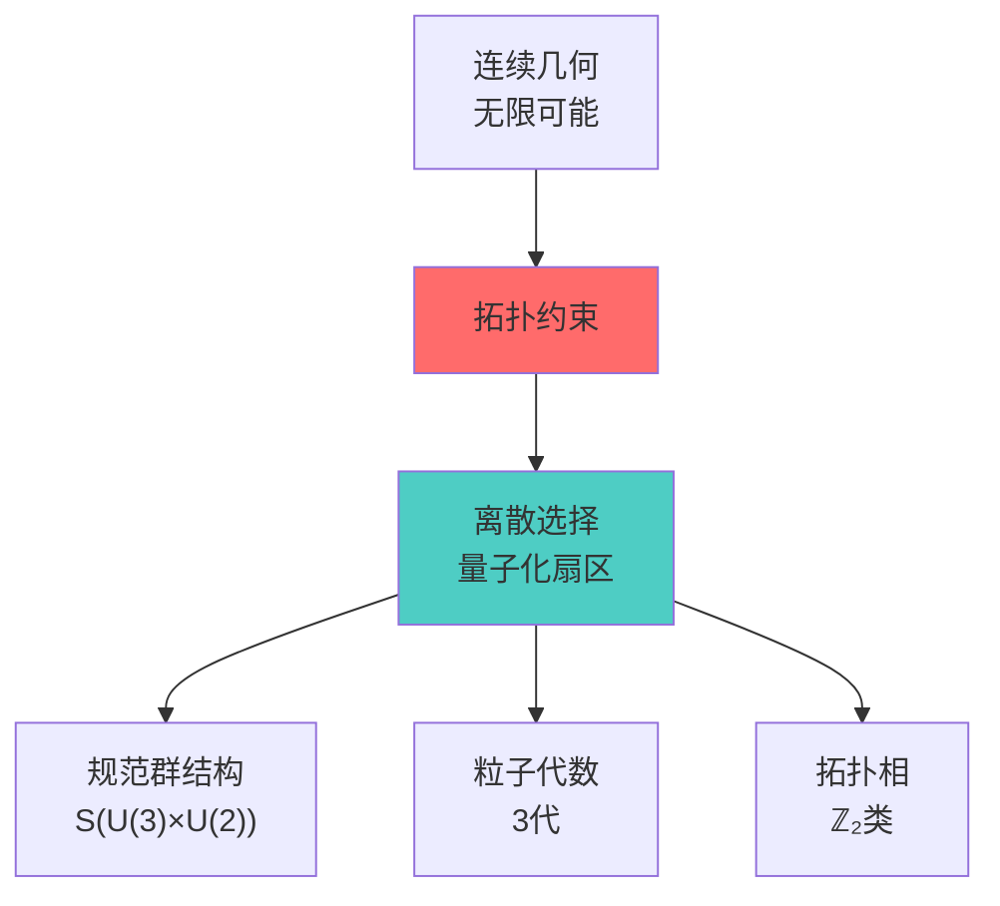
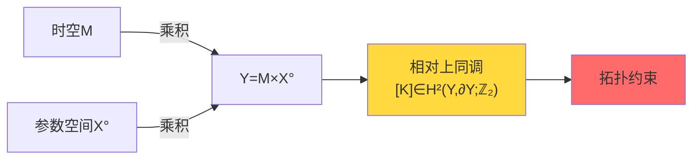
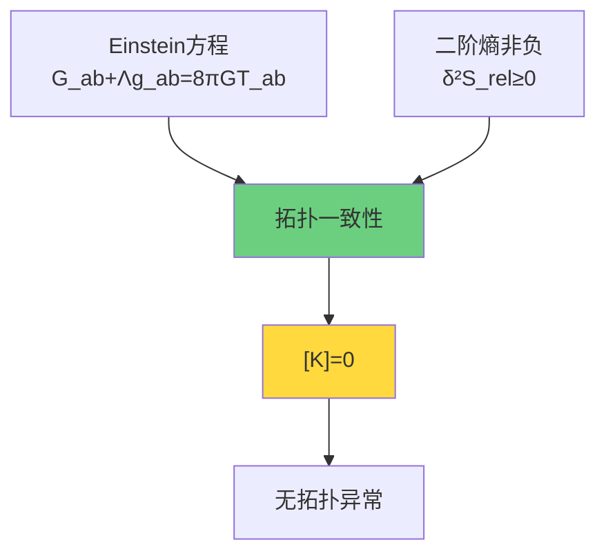
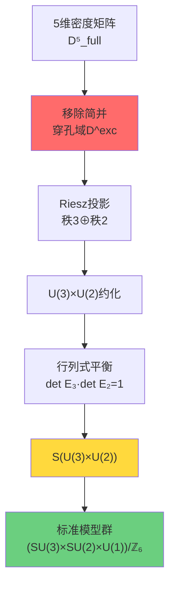

# 拓扑约束：统一理论的"量子化选择"

在建立了统一时间刻度、边界理论和因果结构之后，我们来到了一个关键问题：为什么物理宇宙呈现出我们观察到的特定结构？为什么是SU(3)×SU(2)×U(1)而不是其他规范群？为什么有三代粒子？这些问题的答案隐藏在**拓扑约束**之中。

## 从连续到离散：拓扑的量子化作用

在前面的章节中，我们看到：
- 统一时间刻度 $\kappa(\omega)$ 提供了"母尺"
- 边界理论给出了能量和熵的定义
- 因果结构决定了时空的几何

但这些都是**连续的结构**。拓扑约束的作用是将连续的可能性**离散化**、**量子化**，从无限多的理论候选中筛选出物理上可实现的那一个。

## 核心概念：相对上同调类[K]

拓扑约束的数学语言是**相对上同调**。在物理上，我们总是在某个"背景"或"边界"条件下工作。相对上同调类

$$
[K] \in H^2(Y,\partial Y;\mathbb{Z}_2)
$$

capture了这种"相对于边界"的拓扑信息。这里：
- $Y = M \times X^\circ$ 是时空与参数空间的乘积
- $M$ 是小因果钻石（局域时空片段）
- $X^\circ$ 是去除判别集后的参数域
- $\mathbb{Z}_2$ 系数意味着我们关注的是"模2"的性质

### 相对上同调类的物理意义

$[K]$不是抽象的数学对象，它有直接的物理意义：

1. **ℤ₂环量异常**：绕某些特殊回路，量子相位会获得π的跳变
2. **散射平方根分支**：散射矩阵的平方根在某些路径上可能改变分支
3. **时间的拓扑扇区**：时间晶体和模流的拓扑选择

$$
[K] = \pi_M^* w_2(TM) + \sum_j \pi_M^* \mu_j \smile \pi_X^* \mathfrak{w}_j + \pi_X^* \rho(c_1(\mathcal{L}_S))
$$

让我们逐项理解：

**第一项**：$w_2(TM)$ 是切丛的第二Stiefel-Whitney类
- 它描述了时空M的**不可定向性**
- 在四维时空中，它与**自旋结构**的存在性相关

**第二项**：$\mu_j \smile \mathfrak{w}_j$ 是几何与参数的耦合
- $\mu_j$ 来自时空M的拓扑
- $\mathfrak{w}_j$ 来自参数空间X的拓扑
- $\smile$ 是上同调的cup积

**第三项**：$c_1(\mathcal{L}_S)$ 是散射行列式线丛的第一陈类
- 它编码了**散射相位的绕数**
- $\rho$ 是从K理论到上同调的约化映射

## 拓扑约束的三个层次

### 层次一：几何-能量一致性

在小因果钻石上，如果我们要求：
1. **Einstein方程**成立：$G_{ab} + \Lambda g_{ab} = 8\pi G T_{ab}$
2. **二阶相对熵非负**：$\delta^2 S_{\mathrm{rel}} = \mathcal{E}_{\mathrm{can}} \geq 0$
3. **模块-散射对齐条件**：边界模流与散射刻度在模2意义上一致

那么这些几何-能量-对齐条件会**强制**拓扑约束$[K]=0$。

这是一个深刻的结果：**几何和能量的局域条件，推导出全局拓扑约束**。

### 层次二：ℤ₂环量判据

$[K]=0$ 等价于一个更直接的物理条件：

$$
[K] = 0 \iff \text{对所有允许的回路}\ \gamma:\ \nu_{\sqrt{\det_p S}}(\gamma) = +1
$$

这里 $\nu_{\sqrt{\det_p S}}(\gamma)$ 是散射行列式平方根沿回路的**ℤ₂环量**（±1值）。

物理解释：
- 如果绕某个回路，散射相位获得π的跳变，那么$\nu=-1$
- 这种跳变会导致"拓扑时间异常"
- $[K]=0$意味着**所有物理回路上都没有这种异常**

### 层次三：标准模型群结构

最令人惊讶的是，拓扑约束直接导出了**标准模型的规范群结构**！

从密度矩阵流形$\mathcal{D}_5^{\mathrm{full}}$出发，移除三-二能级简并集$\Sigma_{3|2}$，我们得到穿孔域$\mathcal{D}^{\mathrm{exc}}$。在这个穿孔域上，Riesz谱投影给出秩3和秩2子丛，诱导主丛结构群约化：

$$
U(5) \to U(3) \times U(2)
$$

加上行列式平衡条件（体积守恒），得到：

$$
S(U(3) \times U(2)) \cong \frac{SU(3) \times SU(2) \times U(1)}{\mathbb{Z}_6}
$$

这正是标准模型的规范群！ℤ₆商群解释了：
- **最小电荷**：1/6（夸克的分数电荷）
- **代数量子化**：超荷Y的离散谱

## 本章内容概览

在接下来的文章中，我们将深入探讨拓扑约束的各个方面：

### 第1节：为什么需要拓扑？
- 绝对vs相对拓扑
- 穿孔流形的必要性
- 从连续到离散的跳变

### 第2节：相对上同调类[K]
- 数学定义与性质
- 三项分解的物理意义
- 相对vs绝对上同调

### 第3节：ℤ₂环量与拓扑时间异常
- 散射平方根的分支选择
- 小半圆/折返规则
- 时间晶体的拓扑扇区

### 第4节：S(U(3)×U(2))结构（核心）
- 从5=3+2分拆到标准模型
- 群同构的严格证明
- ℤ₆商与最小电荷1/6

### 第5节：因果版Gauss-Bonnet定理
- Euler示性数的因果重构
- 从Alexandrov拓扑到共形类
- 曲率作为拓扑冗余密度

### 第6节：拓扑约束总结
- 三个层次的统一
- 从拓扑到物理的完整图景
- 下一步：QCA宇宙与终对象

## 拓扑约束的哲学意义

拓扑约束告诉我们一个深刻的哲学真理：

> **物理定律不是任意的选择，而是拓扑一致性的必然结果。**

我们观察到的宇宙——SU(3)×SU(2)×U(1)规范对称、三代粒子、分数电荷——不是"偶然"或"微调"，而是：

1. **几何-能量一致性** → 强制$[K]=0$
2. **$[K]=0$** → 无ℤ₂环量异常
3. **穿孔5维空间的约化** → S(U(3)×U(2))结构
4. **群论同构** → (SU(3)×SU(2)×U(1))/ℤ₆

这是一条**拓扑必然性链条**。

## 通俗类比：拓扑是宇宙的"DNA"

如果把宇宙比作一个复杂的生命体：

- **时间刻度κ(ω)** 是心跳和呼吸的节奏
- **边界理论** 是皮肤和感官，界定内外
- **因果结构** 是神经网络，传递信息
- **拓扑约束** 就是**DNA**，决定了这个生命体的基本形态

就像DNA的四个碱基（A、T、C、G）通过特定配对规则编码遗传信息，拓扑约束通过$[K]$这个"拓扑基因"，编码了宇宙的基本结构：
- 5=3+2的"碱基配对"
- ℤ₂的"双螺旋"对称
- ℤ₆的"密码子"周期

而且就像DNA的损伤会导致疾病，拓扑异常$[K]\neq 0$会导致物理不一致性——时间的拓扑病变、能量的非守恒、因果的破缺。

## 下一步

理解了拓扑约束的整体图景后，我们将在下一节深入探讨：**为什么拓扑必须是相对的？**为什么绝对拓扑不变量在完整密度矩阵流形上消失？穿孔到底移除了什么，保留了什么？

这些问题的答案将揭示拓扑约束的深层必然性。
