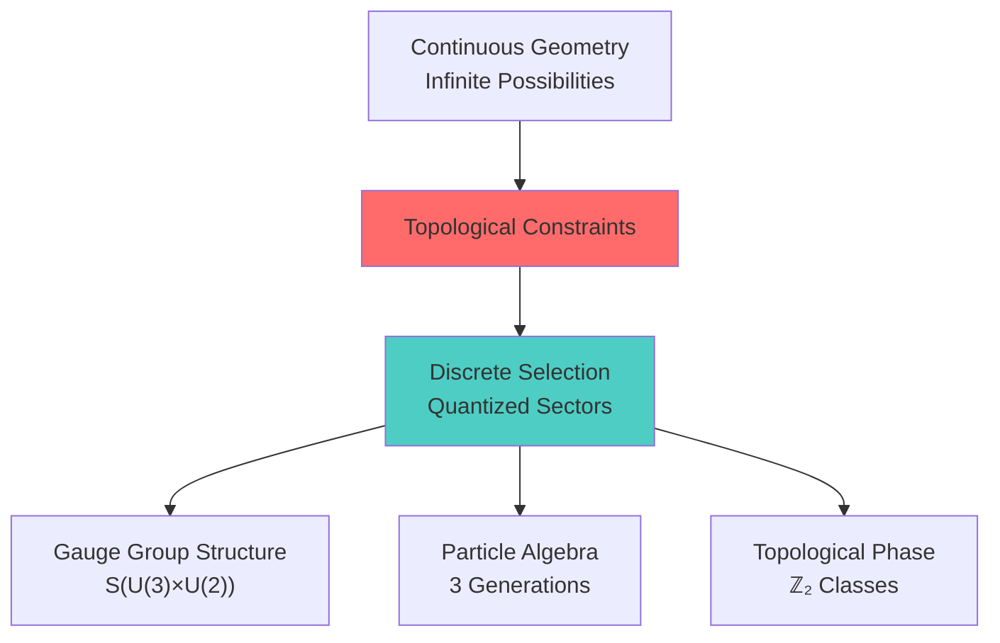
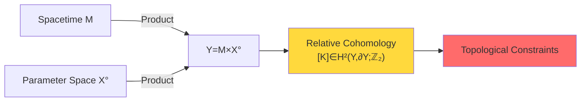
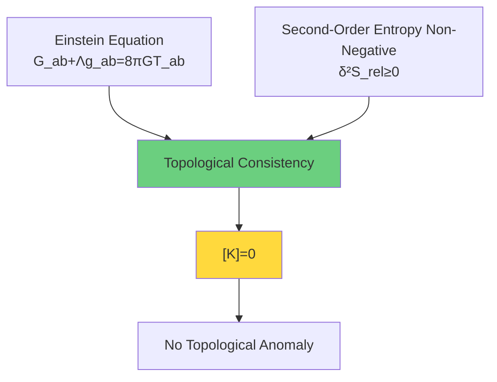
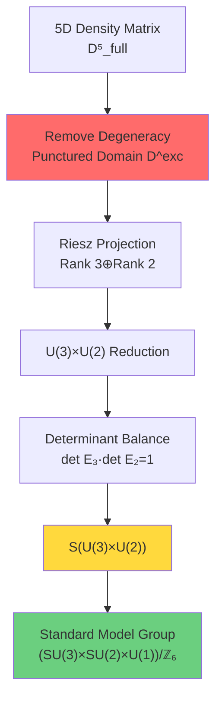
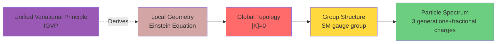

# Topological Constraints: "Quantization Selection" of Unified Theory

After establishing unified time scale, boundary theory, and causal structure, we arrive at a key question: Why does physical universe exhibit the specific structure we observe? Why SU(3)×SU(2)×U(1) instead of other gauge groups? Why three generations of particles? Answers to these questions lie hidden in **topological constraints**.

## From Continuous to Discrete: Quantizing Role of Topology

In previous chapters, we saw:
- Unified time scale $\kappa(\omega)$ provides "mother ruler"
- Boundary theory gives definitions of energy and entropy
- Causal structure determines geometry of spacetime

But these are all **continuous structures**. Role of topological constraints is to **discretize** and **quantize** continuous possibilities, selecting the physically realizable one from infinite theoretical candidates.

## Core Concept: Relative Cohomology Class [K]

Mathematical language of topological constraints is **relative cohomology**. In physics, we always work under some "background" or "boundary" conditions. Relative cohomology class

$$[K] \in H^2(Y,\partial Y;\mathbb{Z}_2)$$

captures this "relative to boundary" topological information. Here:
- $Y = M \times X^\circ$ is product of spacetime and parameter space
- $M$ is small causal diamond (local spacetime patch)
- $X^\circ$ is parameter domain with discriminant removed
- $\mathbb{Z}_2$ coefficients mean we focus on "mod 2" properties

### Physical Meaning of Relative Cohomology Class

$[K]$ is not abstract mathematical object, it has direct physical meaning:

1. **ℤ₂ Circulation Anomaly**: Around certain special loops, quantum phase acquires π jump
2. **Scattering Square Root Branch**: Square root of scattering matrix may change branch on certain paths
3. **Topological Sector of Time**: Topological selection of time crystals and modular flow

$$[K] = \pi_M^* w_2(TM) + \sum_j \pi_M^* \mu_j \smile \pi_X^* \mathfrak{w}_j + \pi_X^* \rho(c_1(\mathcal{L}_S))$$

Let's understand term by term:

**First Term**: $w_2(TM)$ is second Stiefel-Whitney class of tangent bundle
- It describes **non-orientability** of spacetime M
- In four-dimensional spacetime, it relates to existence of **spin structure**

**Second Term**: $\mu_j \smile \mathfrak{w}_j$ is coupling of geometry and parameters
- $\mu_j$ comes from topology of spacetime M
- $\mathfrak{w}_j$ comes from topology of parameter space X
- $\smile$ is cup product of cohomology

**Third Term**: $c_1(\mathcal{L}_S)$ is first Chern class of scattering determinant line bundle
- It encodes **winding number of scattering phase**
- $\rho$ is reduction map from K-theory to cohomology

## Three Levels of Topological Constraints

### Level 1: Geometry-Energy Consistency

On small causal diamonds, if we require:
1. **Einstein equation** holds: $G_{ab} + \Lambda g_{ab} = 8\pi G T_{ab}$
2. **Second-order relative entropy non-negative**: $\delta^2 S_{\mathrm{rel}} = \mathcal{E}_{\mathrm{can}} \geq 0$
3. **Modular-scattering alignment condition**: Boundary modular flow and scattering scale agree mod 2

then these geometry-energy-alignment conditions **force** topological constraint $[K]=0$.

This is a profound result: **Local conditions of geometry and energy derive global topological constraints**.

### Level 2: ℤ₂ Circulation Criterion

$[K]=0$ is equivalent to a more direct physical condition:

$$[K] = 0 \iff \text{For all allowed loops}\ \gamma:\ \nu_{\sqrt{\det_p S}}(\gamma) = +1$$

Here $\nu_{\sqrt{\det_p S}}(\gamma)$ is **ℤ₂ circulation** (±1 value) of square root of scattering determinant along loop.

Physical interpretation:
- If around some loop, scattering phase acquires π jump, then $\nu=-1$
- This jump causes "topological time anomaly"
- $[K]=0$ means **no such anomaly on all physical loops**

### Level 3: Standard Model Group Structure

Most surprisingly, topological constraints directly derive **gauge group structure of Standard Model**!

Starting from density matrix manifold $\mathcal{D}_5^{\mathrm{full}}$, removing three-two level degeneracy set $\Sigma_{3|2}$, we get punctured domain $\mathcal{D}^{\mathrm{exc}}$. On this punctured domain, Riesz spectral projection gives rank 3 and rank 2 subbundles, inducing principal bundle structure group reduction:

$$U(5) \to U(3) \times U(2)$$

Adding determinant balance condition (volume conservation), we get:

$$S(U(3) \times U(2)) \cong \frac{SU(3) \times SU(2) \times U(1)}{\mathbb{Z}_6}$$

This is exactly gauge group of Standard Model! ℤ₆ quotient explains:
- **Minimal charge**: 1/6 (fractional charge of quarks)
- **Algebraic quantization**: Discrete spectrum of hypercharge Y

## Chapter Content Overview

In following articles, we will deeply explore various aspects of topological constraints:

### Section 1: Why Topology?
- Absolute vs relative topology
- Necessity of punctured manifolds
- Jump from continuous to discrete

### Section 2: Relative Cohomology Class [K]
- Mathematical definition and properties
- Physical meaning of three-term decomposition
- Relative vs absolute cohomology

### Section 3: ℤ₂ Circulation and Topological Time Anomaly
- Branch selection of scattering square root
- Small semicircle/return rule
- Topological sectors of time crystals

### Section 4: S(U(3)×U(2)) Structure (Core)
- From 5=3+2 splitting to Standard Model
- Rigorous proof of group isomorphism
- ℤ₆ quotient and minimal charge 1/6

### Section 5: Causal Version of Gauss-Bonnet Theorem
- Causal reconstruction of Euler characteristic
- From Alexandrov topology to conformal class
- Curvature as topological redundancy density

### Section 6: Topological Constraints Summary
- Unification of three levels
- Complete picture from topology to physics
- Next step: QCA universe and terminal object

## Philosophical Meaning of Topological Constraints

Topological constraints tell us a profound philosophical truth:

> **Physical laws are not arbitrary choices, but inevitable results of topological consistency.**

Universe we observe—SU(3)×SU(2)×U(1) gauge symmetry, three generations of particles, fractional charges—is not "accidental" or "fine-tuned", but:

1. **Geometry-energy consistency** → Forces $[K]=0$
2. **$[K]=0$** → No ℤ₂ circulation anomaly
3. **Reduction of punctured 5D space** → S(U(3)×U(2)) structure
4. **Group isomorphism** → (SU(3)×SU(2)×U(1))/ℤ₆

This is a **chain of topological necessity**.

## Popular Analogy: Topology is "DNA" of Universe

If we compare universe to a complex living organism:

- **Time scale κ(ω)** is rhythm of heartbeat and breathing
- **Boundary theory** is skin and senses, defining inside and outside
- **Causal structure** is neural network, transmitting information
- **Topological constraints** is **DNA**, determining basic form of this organism

Just as four bases of DNA (A, T, C, G) encode genetic information through specific pairing rules, topological constraints encode basic structure of universe through $[K]$ this "topological gene":
- "Base pairing" of 5=3+2
- "Double helix" symmetry of ℤ₂
- "Codon" period of ℤ₆

And just as DNA damage causes disease, topological anomaly $[K]\neq 0$ causes physical inconsistency—topological pathology of time, non-conservation of energy, breaking of causality.

## Next Steps

After understanding overall picture of topological constraints, we will explore in next section: **Why must topology be relative?** Why do absolute topological invariants vanish on complete density matrix manifold? What does puncturing remove, what does it preserve?

Answers to these questions will reveal deep necessity of topological constraints.

