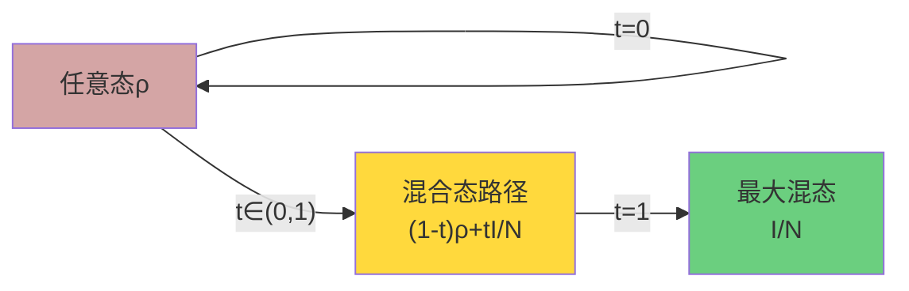
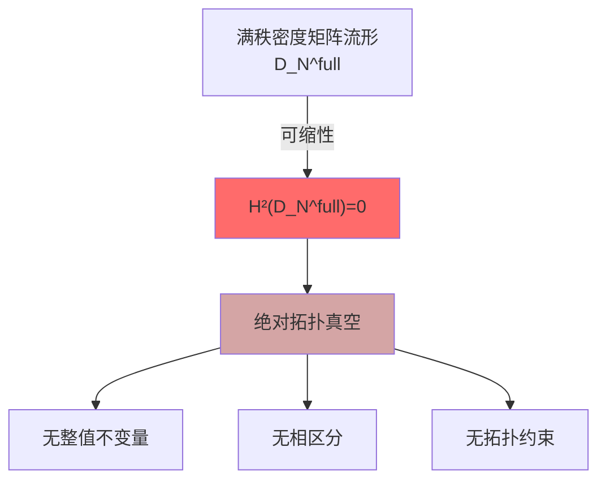
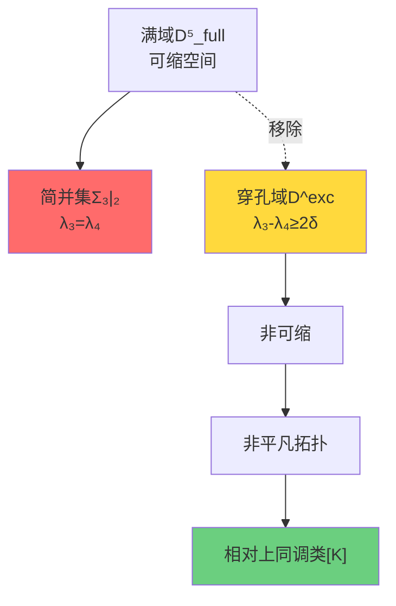
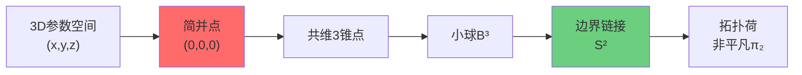
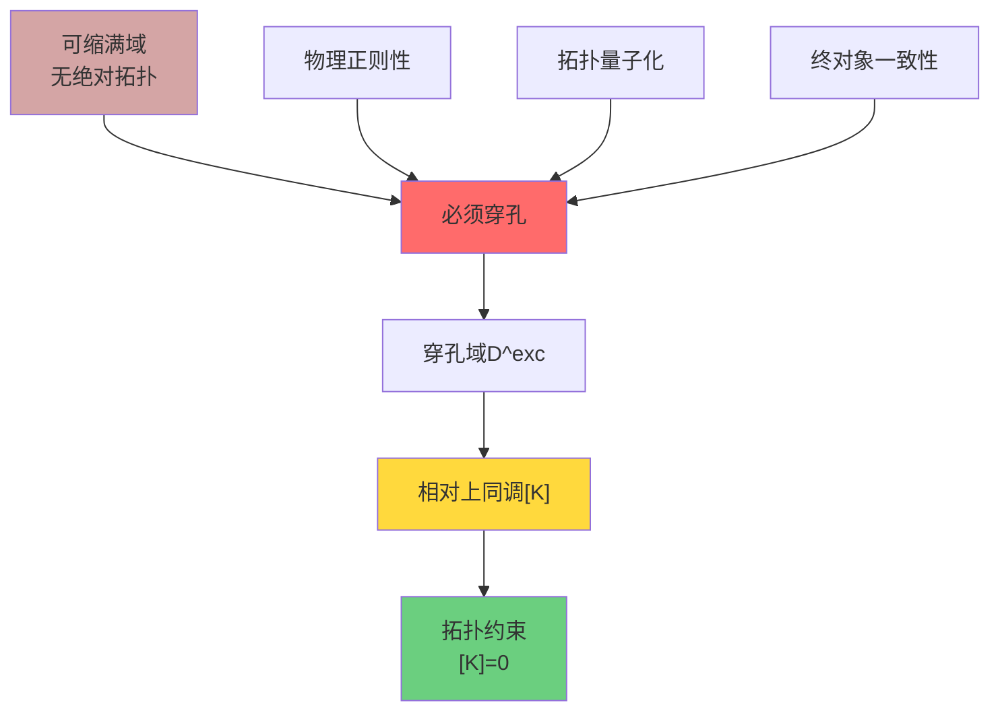
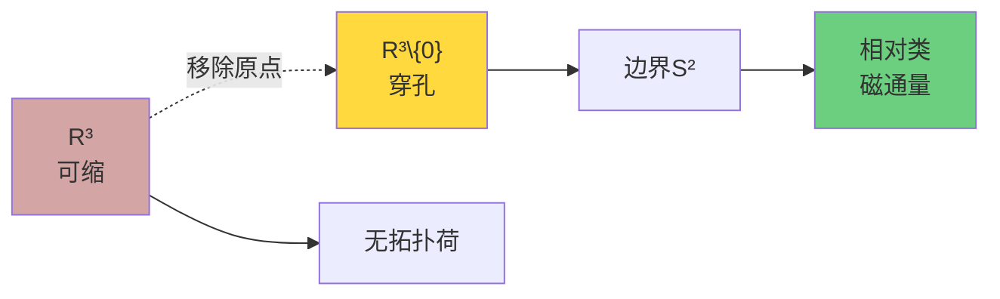

# 为什么需要拓扑？从"可缩"到"穿孔"的必然性

在上一节中，我们看到拓扑约束$[K]$在统一理论中扮演关键角色。但一个自然的问题是：**为什么需要相对拓扑？**为什么不能直接使用绝对拓扑不变量？

答案隐藏在一个数学事实中：**满秩密度矩阵流形是开凸可缩的**。

## 可缩空间的"拓扑平凡性"

### 什么是可缩空间？

一个拓扑空间$X$称为**可缩的**（contractible），如果它可以连续地"收缩"到一个点，数学上就是说恒等映射$\mathrm{id}_X$同伦于常值映射。

**关键事实**：可缩空间在同伦意义上等价于一个点，因此：
$$
H^n(X) = \begin{cases}
\mathbb{Z} & n=0 \\
0 & n \geq 1
\end{cases}
$$

换句话说，**可缩空间没有非平凡的绝对上同调类**！

### 密度矩阵流形的可缩性

考虑$N$维满秩密度矩阵流形：
$$
\mathcal{D}_N^{\mathrm{full}} = \{\rho \in \mathrm{Herm}_N^+ : \rho > 0,\ \mathrm{tr}\rho = 1\}
$$

**定理**：$\mathcal{D}_N^{\mathrm{full}}$是可缩的。

**证明思路**：构造明确的收缩映射
$$
H_t(\rho) = (1-t)\rho + t \cdot \frac{I}{N},\quad t \in [0,1]
$$

- 当$t=0$时：$H_0(\rho) = \rho$（恒等映射）
- 当$t=1$时：$H_1(\rho) = I/N$（最大混态，固定点）
- 对所有$t \in [0,1]$：$H_t(\rho) \in \mathcal{D}_N^{\mathrm{full}}$（凸组合保持正定性）

**物理意义**：任何量子态都可以通过与最大混态混合，连续地"退相干"到完全混态。

### 可缩性的灾难性后果

因为$\mathcal{D}_N^{\mathrm{full}}$可缩，所以：

$$
H^2(\mathcal{D}_N^{\mathrm{full}}; \mathbb{Z}_2) = 0
$$

这意味着：
- **没有非平凡的绝对上同调类**
- **没有整值拓扑不变量**
- **无法用绝对拓扑区分不同的物理相**

这是一个**拓扑真空**——所有态在拓扑上无法区分！

### Uhlmann主丛的全局截面

可缩性的另一个表现是：Uhlmann主丛在满域上**admit全局平方根截面**。

Uhlmann主丛定义为：
$$
P = \{w = \sqrt{\rho} U : \rho \in \mathcal{D}_N^{\mathrm{full}},\ U \in U(N)\}
$$
投影映射：
$$
\pi(w) = w w^\dagger = \rho
$$

在满域上，我们总可以选择一个**全局连续的平方根截面**：
$$
\sigma(\rho) = \sqrt{\rho}
$$

其中$\sqrt{\rho}$是正定厄米平方根（唯一且光滑）。

**拓扑含义**：主丛是**平凡的**，没有非平凡的示性类！

## 穿孔：打破可缩性的必要手术

### 物理动机：简并的不可避免

在物理过程中，某些**特殊配置**是不可避免的：

1. **能级简并**：两个或多个本征值相等
2. **相变点**：物理相之间的边界
3. **奇点**：某些物理量发散

这些特殊点形成**判别集**（discriminant locus），它们是物理上重要但拓扑上"病态"的地方。

### 移除判别集：穿孔操作

对于$N=5$的情况，考虑三-二能级简并集：
$$
\Sigma_{3|2} = \{\rho \in \mathcal{D}_5^{\mathrm{full}} : \lambda_3 = \lambda_4\}
$$

这里$\lambda_1 \geq \lambda_2 \geq \lambda_3 \geq \lambda_4 \geq \lambda_5 > 0$是本征值。

**穿孔操作**：移除$\Sigma_{3|2}$的管状邻域
$$
\mathcal{D}^{\mathrm{exc}} = \{\rho \in \mathcal{D}_5^{\mathrm{full}} : g(\rho) \geq 2\delta\}
$$
其中谱隙函数$g(\rho) = \lambda_3 - \lambda_4$。

### 简并集的几何：共维3与S²链接

**命题**：在保持$(\lambda_2, \lambda_5)$开隙且无额外对称性的三维横截切片中，$\Sigma_{3|2}$是**共维3**的正规子集，其小球边界链接同伦于$S^2$。

**证明思路**：
1. 将哈密顿量限制到近简并的2维本征子空间
2. 得到$h = x\sigma_x + y\sigma_y + z\sigma_z$
3. 简并条件：$(x,y,z) = (0,0,0)$（三个独立实约束）
4. 取法向小球$B^3$，其边界$S^2$为链接

**物理意义**：
- 简并点在参数空间中是**孤立的锥点**
- 绕简并点的小环路拓扑非平凡
- $S^2$链接编码了简并的**拓扑荷**

## 相对拓扑的诞生

### 配对空间$(Y, \partial Y)$

穿孔后，我们得到一个**配对空间**：
$$
Y = \mathcal{D}^{\mathrm{exc}},\quad \partial Y = \partial \mathrm{Tub}_\varepsilon(\Sigma_{3|2})
$$

- $Y$：穿孔域（内部）
- $\partial Y$：管状邻域边界

### 相对上同调长正合列

配对空间$(Y, \partial Y)$诱导相对上同调长正合列：
$$
\cdots \to H^1(Y) \to H^1(\partial Y) \xrightarrow{\partial} H^2(Y,\partial Y) \to H^2(Y) \to H^2(\partial Y) \to \cdots
$$

**关键观察**：
1. $H^2(Y) = 0$（$Y$仍然"几乎可缩"）
2. $H^2(\partial Y) \neq 0$（边界有非平凡拓扑）
3. $H^2(Y, \partial Y) \neq 0$（相对类存在！）

边界映射$\partial: H^1(\partial Y) \to H^2(Y,\partial Y)$是相对类的来源。

### 相对类的物理意义

相对上同调类$[K] \in H^2(Y,\partial Y;\mathbb{Z}_2)$编码了：

1. **边界条件的拓扑记忆**
   - 在边界$\partial Y$上，散射矩阵可能有相位跳变
   - 这些跳变沿内部路径"积分"成拓扑荷

2. **判别集的拓扑阴影**
   - 虽然移除了$\Sigma_{3|2}$，但它的"痕迹"保留在相对类中
   - 绕判别集的环路在$\partial Y$上留下ℤ₂印记

3. **物理过程的可实现性约束**
   - 如果$[K] \neq 0$，某些量子过程在回路上会累积不可消除的相位
   - 这种相位导致量子干涉的拓扑破坏

## 为什么必须穿孔？四个层面的理由

### 理由一：数学必然性

**可缩性定理**：满域$\mathcal{D}_N^{\mathrm{full}}$没有非平凡绝对拓扑类。

要获得拓扑约束，**必须破坏可缩性**，唯一的方法是移除某些子集。

### 理由二：物理正则性

简并点处，许多物理量**不正则**：
- Riesz谱投影不连续
- Berry相位可能发散
- 绝热近似失效

移除简并集确保物理过程在$\mathcal{D}^{\mathrm{exc}}$上**光滑且正则**。

### 理由三：拓扑量子化

只有在穿孔域上，我们才能定义：
- **统一围道族**：与余谱保持有限距离的闭曲线族
- **Riesz投影**：$P_3(\rho) = \frac{1}{2\pi i}\oint_{\gamma_3} (z-\rho)^{-1} dz$
- **主丛约化**：$U(5) \to U(3) \times U(2)$

这些构造在简并点处会奇异。

### 理由四：范畴终对象性

在统一理论的终对象构造中，$[K]=0$是**一致性公理**。如果$[K] \neq 0$，会导致：
- 散射-模流对齐的破坏
- 边界时间与几何时间的不兼容
- 广义熵变分的符号翻转

穿孔并要求$[K]=0$是**自洽性所迫**。

## 类比：光滑流形上的奇点移除

考虑一个物理类比：**电磁学中的点电荷**。

### 绝对情形：包含奇点

如果我们在全空间$\mathbb{R}^3$（包含原点）上考虑点电荷：
- 电势$\phi = 1/r$在原点**奇异**
- 电场$\mathbf{E} = -\nabla \phi$在原点**发散**
- Gauss定理在包含原点的任何闭曲面上给出**非零通量**

但如果我们问："$\mathbb{R}^3$的拓扑性质如何？"
- 答案：$\mathbb{R}^3$可缩，$H^1(\mathbb{R}^3) = 0$
- **矢势$\mathbf{A}$可以全局定义**（但在原点奇异）

### 相对情形：穿孔空间

如果移除原点，得到$\mathbb{R}^3 \setminus \{0\}$：
- 拓扑非平凡：$H^1(\mathbb{R}^3 \setminus \{0\}) = 0$但$H^2(\mathbb{R}^3 \setminus \{0\}) \neq 0$（通过Poincaré对偶）
- 边界$\partial(\mathrm{Tub}(0)) = S^2$（小球面）
- **相对类编码了通过$S^2$的磁通量**

这正是**磁单极子的Dirac弦构造**！移除奇点线后，磁单极子的拓扑荷以$H^2$相对类的形式出现。

## 小结：从绝对到相对的范式转变

| 层面 | 绝对拓扑（满域） | 相对拓扑（穿孔域） |
|------|-----------------|-------------------|
| **空间性质** | 可缩 | 非可缩 |
| **上同调类** | $H^2 = 0$ | $H^2(Y,\partial Y) \neq 0$ |
| **物理意义** | 无拓扑约束 | 有ℤ₂环量判据 |
| **Uhlmann主丛** | 平凡（全局截面） | 非平凡（约化结构） |
| **谱投影** | 不连续（简并处） | 光滑（统一围道） |
| **规范结构** | 无自然约化 | $U(5) \to S(U(3)\times U(2))$ |

**核心洞察**：

> 穿孔不是"技术修补"，而是**拓扑量子化的必然要求**。
>
> 就像磁单极子需要移除Dirac弦才能定义磁荷，密度矩阵流形需要移除简并集才能定义拓扑约束。

## 下一步：相对上同调类[K]的精确定义

现在我们理解了为什么需要相对拓扑。下一节将给出$[K]$的精确数学定义，并解析其三项分解的物理意义：

$$
[K] = \pi_M^* w_2(TM) + \sum_j \pi_M^* \mu_j \smile \pi_X^* \mathfrak{w}_j + \pi_X^* \rho(c_1(\mathcal{L}_S))
$$

每一项都有深刻的物理根源！
