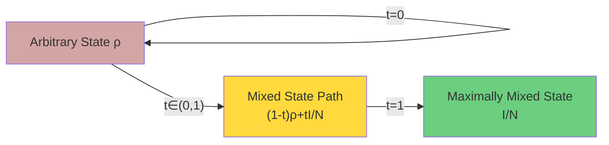
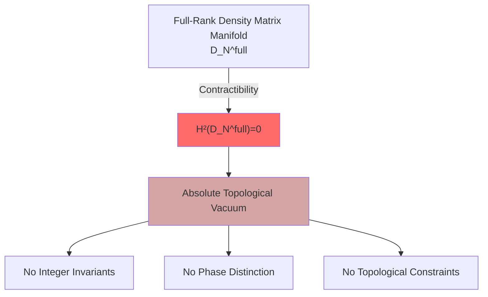
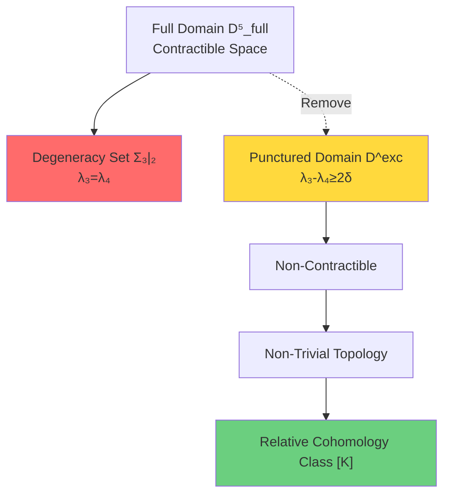
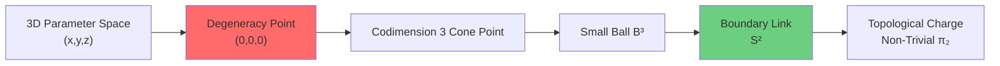
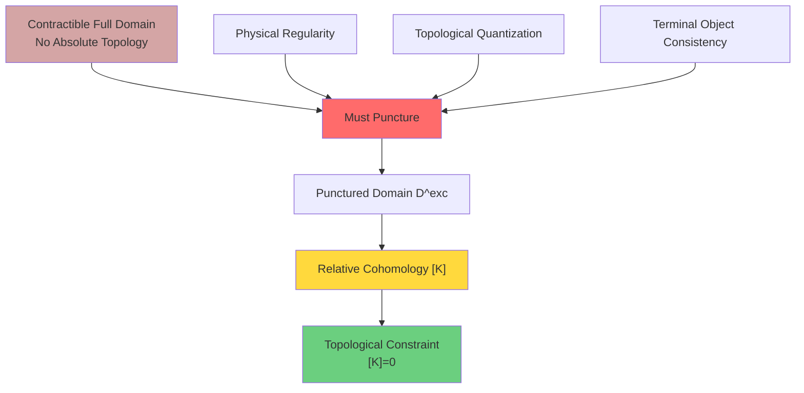
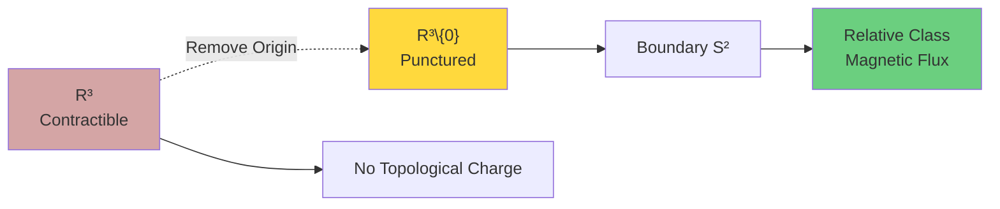

# Why Topology? Necessity from "Contractible" to "Punctured"

In previous section, we saw topological constraint $[K]$ plays key role in unified theory. But a natural question is: **Why do we need relative topology?** Why can't we directly use absolute topological invariants?

Answer lies hidden in a mathematical fact: **Full-rank density matrix manifold is open convex contractible**.

## "Topological Triviality" of Contractible Spaces

### What Is Contractible Space?

A topological space $X$ is called **contractible** if it can continuously "shrink" to a point, mathematically meaning identity map $\mathrm{id}_X$ is homotopic to constant map.

**Key Fact**: Contractible space is homotopy equivalent to a point, therefore:
$$H^n(X) = \begin{cases}
\mathbb{Z} & n=0 \\
0 & n \geq 1
\end{cases}$$

In other words, **contractible spaces have no non-trivial absolute cohomology classes**!

### Contractibility of Density Matrix Manifold

Consider $N$-dimensional full-rank density matrix manifold:
$$\mathcal{D}_N^{\mathrm{full}} = \{\rho \in \mathrm{Herm}_N^+ : \rho > 0,\ \mathrm{tr}\rho = 1\}$$

**Theorem**: $\mathcal{D}_N^{\mathrm{full}}$ is contractible.

**Proof Idea**: Construct explicit contraction map
$$H_t(\rho) = (1-t)\rho + t \cdot \frac{I}{N},\quad t \in [0,1]$$

- When $t=0$: $H_0(\rho) = \rho$ (identity map)
- When $t=1$: $H_1(\rho) = I/N$ (maximally mixed state, fixed point)
- For all $t \in [0,1]$: $H_t(\rho) \in \mathcal{D}_N^{\mathrm{full}}$ (convex combination preserves positivity)

**Physical Meaning**: Any quantum state can continuously "decohere" to completely mixed state by mixing with maximally mixed state.

### Catastrophic Consequences of Contractibility

Because $\mathcal{D}_N^{\mathrm{full}}$ is contractible, we have:

$$H^2(\mathcal{D}_N^{\mathrm{full}}; \mathbb{Z}_2) = 0$$

This means:
- **No non-trivial absolute cohomology classes**
- **No integer-valued topological invariants**
- **Cannot distinguish different physical phases using absolute topology**

This is a **topological vacuum**—all states are topologically indistinguishable!

### Global Section of Uhlmann Principal Bundle

Another manifestation of contractibility: Uhlmann principal bundle on full domain **admits global square root section**.

Uhlmann principal bundle is defined as:
$$P = \{w = \sqrt{\rho} U : \rho \in \mathcal{D}_N^{\mathrm{full}},\ U \in U(N)\}$$
Projection map:
$$\pi(w) = w w^\dagger = \rho$$

On full domain, we can always choose a **globally continuous square root section**:
$$\sigma(\rho) = \sqrt{\rho}$$

where $\sqrt{\rho}$ is positive definite Hermitian square root (unique and smooth).

**Topological Meaning**: Principal bundle is **trivial**, has no non-trivial characteristic classes!

## Puncturing: Necessary Surgery to Break Contractibility

### Physical Motivation: Inevitability of Degeneracy

In physical processes, certain **special configurations** are inevitable:

1. **Level Degeneracy**: Two or more eigenvalues equal
2. **Phase Transition Points**: Boundaries between physical phases
3. **Singularities**: Certain physical quantities diverge

These special points form **discriminant locus**, places that are physically important but topologically "pathological".

### Removing Discriminant Set: Puncturing Operation

For $N=5$ case, consider three-two level degeneracy set:
$$\Sigma_{3|2} = \{\rho \in \mathcal{D}_5^{\mathrm{full}} : \lambda_3 = \lambda_4\}$$

Here $\lambda_1 \geq \lambda_2 \geq \lambda_3 \geq \lambda_4 \geq \lambda_5 > 0$ are eigenvalues.

**Puncturing Operation**: Remove tubular neighborhood of $\Sigma_{3|2}$
$$\mathcal{D}^{\mathrm{exc}} = \{\rho \in \mathcal{D}_5^{\mathrm{full}} : g(\rho) \geq 2\delta\}$$
where spectral gap function $g(\rho) = \lambda_3 - \lambda_4$.

### Geometry of Degeneracy Set: Codimension 3 and S² Link

**Proposition**: In three-dimensional transverse slice maintaining open gap $(\lambda_2, \lambda_5)$ and no additional symmetry, $\Sigma_{3|2}$ is **codimension 3** normal subset, whose small ball boundary link is homotopic to $S^2$.

**Proof Idea**:
1. Restrict Hamiltonian to near-degenerate 2D eigenspace
2. Get $h = x\sigma_x + y\sigma_y + z\sigma_z$
3. Degeneracy condition: $(x,y,z) = (0,0,0)$ (three independent real constraints)
4. Take normal small ball $B^3$, its boundary $S^2$ is link

**Physical Meaning**:
- Degeneracy points are **isolated cone points** in parameter space
- Small loops around degeneracy points are topologically non-trivial
- $S^2$ link encodes **topological charge** of degeneracy

## Birth of Relative Topology

### Pair Space $(Y, \partial Y)$

After puncturing, we get a **pair space**:
$$Y = \mathcal{D}^{\mathrm{exc}},\quad \partial Y = \partial \mathrm{Tub}_\varepsilon(\Sigma_{3|2})$$

- $Y$: Punctured domain (interior)
- $\partial Y$: Tubular neighborhood boundary

### Long Exact Sequence of Relative Cohomology

Pair space $(Y, \partial Y)$ induces long exact sequence of relative cohomology:
$$\cdots \to H^1(Y) \to H^1(\partial Y) \xrightarrow{\partial} H^2(Y,\partial Y) \to H^2(Y) \to H^2(\partial Y) \to \cdots$$

**Key Observations**:
1. $H^2(Y) = 0$ ($Y$ still "almost contractible")
2. $H^2(\partial Y) \neq 0$ (boundary has non-trivial topology)
3. $H^2(Y, \partial Y) \neq 0$ (relative classes exist!)

Boundary map $\partial: H^1(\partial Y) \to H^2(Y,\partial Y)$ is source of relative classes.

### Physical Meaning of Relative Classes

Relative cohomology class $[K] \in H^2(Y,\partial Y;\mathbb{Z}_2)$ encodes:

1. **Topological Memory of Boundary Conditions**
   - On boundary $\partial Y$, scattering matrix may have phase jumps
   - These jumps "integrate" along interior paths into topological charges

2. **Topological Shadow of Discriminant Set**
   - Although $\Sigma_{3|2}$ is removed, its "trace" remains in relative classes
   - Loops around discriminant set leave ℤ₂ imprint on $\partial Y$

3. **Realizability Constraints of Physical Processes**
   - If $[K] \neq 0$, certain quantum processes accumulate non-eliminable phases on loops
   - This phase causes topological destruction of quantum interference

## Why Must We Puncture? Four Levels of Reasons

### Reason 1: Mathematical Necessity

**Contractibility Theorem**: Full domain $\mathcal{D}_N^{\mathrm{full}}$ has no non-trivial absolute topological classes.

To obtain topological constraints, **must break contractibility**, only method is to remove certain subsets.

### Reason 2: Physical Regularity

At degeneracy points, many physical quantities are **non-regular**:
- Riesz spectral projection discontinuous
- Berry phase may diverge
- Adiabatic approximation fails

Removing degeneracy set ensures physical processes are **smooth and regular** on $\mathcal{D}^{\mathrm{exc}}$.

### Reason 3: Topological Quantization

Only on punctured domain can we define:
- **Unified Contour Family**: Family of closed curves maintaining finite distance from co-spectrum
- **Riesz Projection**: $P_3(\rho) = \frac{1}{2\pi i}\oint_{\gamma_3} (z-\rho)^{-1} dz$
- **Principal Bundle Reduction**: $U(5) \to U(3) \times U(2)$

These constructions become singular at degeneracy points.

### Reason 4: Categorical Terminal Object Property

In terminal object construction of unified theory, $[K]=0$ is **consistency axiom**. If $[K] \neq 0$, it causes:
- Breaking of scattering-modular flow alignment
- Incompatibility of boundary time and geometric time
- Sign flip of generalized entropy variation

Puncturing and requiring $[K]=0$ is **forced by self-consistency**.

## Analogy: Singularity Removal on Smooth Manifolds

Consider a physical analogy: **Point charge in electromagnetism**.

### Absolute Case: Including Singularity

If we consider point charge on full space $\mathbb{R}^3$ (including origin):
- Potential $\phi = 1/r$ is **singular** at origin
- Electric field $\mathbf{E} = -\nabla \phi$ **diverges** at origin
- Gauss theorem on any closed surface containing origin gives **non-zero flux**

But if we ask: "What are topological properties of $\mathbb{R}^3$?"
- Answer: $\mathbb{R}^3$ is contractible, $H^1(\mathbb{R}^3) = 0$
- **Vector potential $\mathbf{A}$ can be globally defined** (but singular at origin)

### Relative Case: Punctured Space

If we remove origin, get $\mathbb{R}^3 \setminus \{0\}$:
- Topologically non-trivial: $H^1(\mathbb{R}^3 \setminus \{0\}) = 0$ but $H^2(\mathbb{R}^3 \setminus \{0\}) \neq 0$ (through Poincaré duality)
- Boundary $\partial(\mathrm{Tub}(0)) = S^2$ (small sphere)
- **Relative class encodes magnetic flux through $S^2$**

This is exactly **Dirac string construction of magnetic monopole**! After removing singularity line, topological charge of magnetic monopole appears as relative class in $H^2$.

## Summary: Paradigm Shift from Absolute to Relative

| Level | Absolute Topology (Full Domain) | Relative Topology (Punctured Domain) |
|-------|--------------------------------|--------------------------------------|
| **Space Property** | Contractible | Non-contractible |
| **Cohomology Class** | $H^2 = 0$ | $H^2(Y,\partial Y) \neq 0$ |
| **Physical Meaning** | No topological constraints | Has ℤ₂ circulation criterion |
| **Uhlmann Principal Bundle** | Trivial (global section) | Non-trivial (reduction structure) |
| **Spectral Projection** | Discontinuous (at degeneracy) | Smooth (unified contour) |
| **Gauge Structure** | No natural reduction | $U(5) \to S(U(3)\times U(2))$ |

**Core Insight**:

> Puncturing is not "technical patch", but **inevitable requirement of topological quantization**.
>
> Just as magnetic monopole needs to remove Dirac string to define magnetic charge, density matrix manifold needs to remove degeneracy set to define topological constraints.

## Next Step: Precise Definition of Relative Cohomology Class [K]

Now we understand why relative topology is needed. Next section will give precise mathematical definition of $[K]$ and analyze physical meaning of its three-term decomposition:

$$[K] = \pi_M^* w_2(TM) + \sum_j \pi_M^* \mu_j \smile \pi_X^* \mathfrak{w}_j + \pi_X^* \rho(c_1(\mathcal{L}_S))$$

Each term has profound physical origin!

