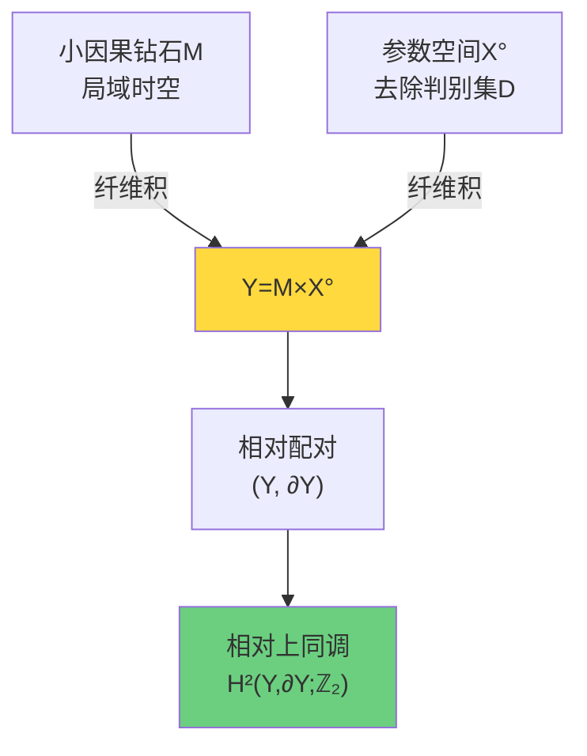
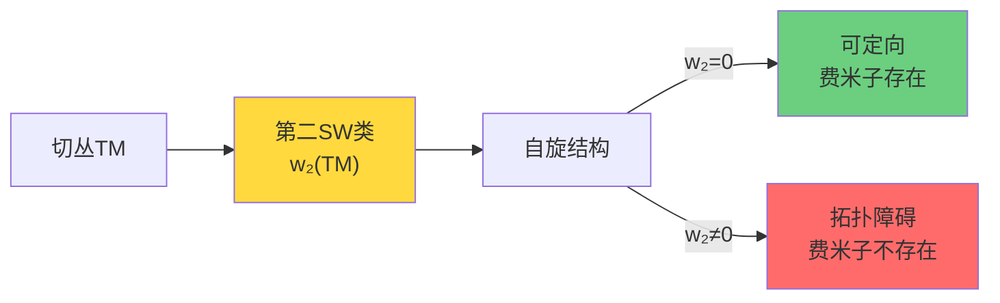
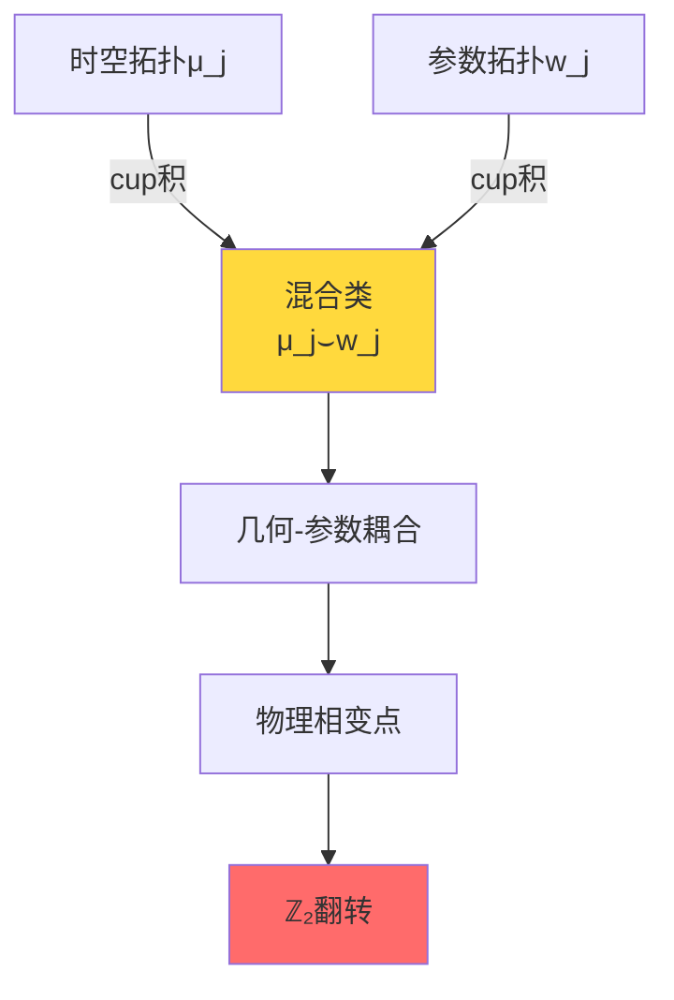
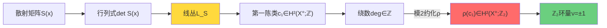
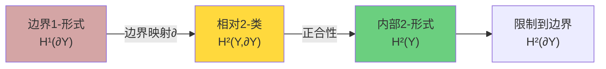
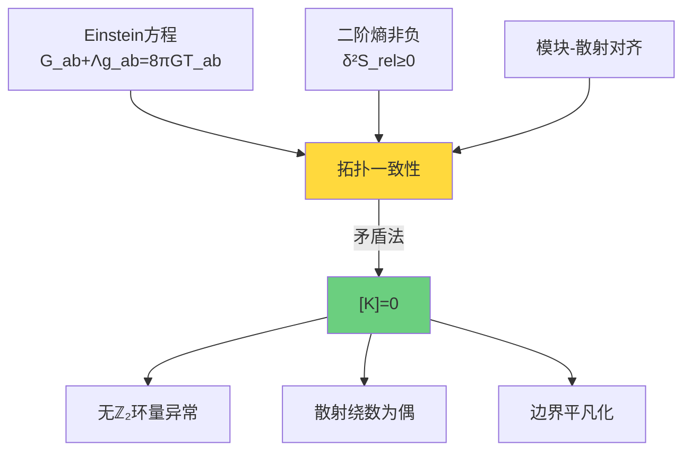

# 相对上同调类[K]：拓扑约束的精确语言

在上一节中，我们理解了为什么需要穿孔域和相对拓扑。现在我们给出拓扑约束的核心对象——相对上同调类$[K]$的精确定义。

## 配对空间的构造

### 总空间Y：时空与参数的纤维积

相对上同调类定义在配对空间$(Y, \partial Y)$上，其中：

$$
Y = M \times X^\circ
$$

这里：
- **$M$**：小因果钻石域，局域时空片段
  - 通常是因果未来$I^+(p)$与因果过去$I^-(q)$的交集
  - 边界分解为类时片与null片

- **$X^\circ$**：参数空间去除判别集
  - 对散射理论：频率/能量/动量参数
  - 对密度矩阵：去除简并集的态空间
  - $X^\circ = X \setminus D$，其中$D$是判别集

### 边界∂Y的结构

边界$\partial Y$由两部分贡献：

1. **时空边界**：$\partial M \times X^\circ$
   - null边界（光锥）
   - 类时边界（腰截面）

2. **参数边界**：$M \times \partial X^\circ$
   - 判别集的管状邻域边界
   - 例如：$\partial \mathrm{Tub}_\varepsilon(\Sigma_{3|2})$

完整边界：
$$
\partial Y = (\partial M \times X^\circ) \cup (M \times \partial X^\circ)
$$

在边界上，拓扑类可能"平凡化"，这正是"相对"的含义。

## 相对上同调类[K]的三项分解

### 完整表达式

相对上同调类$[K] \in H^2(Y, \partial Y; \mathbb{Z}_2)$具有三项分解：

$$
[K] = \pi_M^* w_2(TM) + \sum_j \pi_M^* \mu_j \smile \pi_X^* \mathfrak{w}_j + \pi_X^* \rho(c_1(\mathcal{L}_S))
$$

让我们逐项解析。

### 第一项：几何项 $\pi_M^* w_2(TM)$

**数学定义**：
- $w_2(TM)$：时空切丛$TM$的第二Stiefel-Whitney类
- $w_2 \in H^2(M; \mathbb{Z}_2)$
- $\pi_M: Y = M \times X^\circ \to M$：投影到时空因子
- $\pi_M^* w_2$：拉回到总空间$Y$

**物理意义**：

1. **自旋结构的存在性**
   - $w_2(TM) = 0$ $\iff$ $TM$可定向且存在自旋结构
   - 在四维时空中，这决定了费米子场是否可定义

2. **时空的全局拓扑**
   - 非定向流形：$w_2 \neq 0$
   - Möbius带是最简单的例子：$w_2(E) \neq 0$

3. **量子反常的拓扑根源**
   - 自旋流的反常与$w_2$相关
   - 手征反常部分编码在$w_2 \wedge \mathrm{tr}F^2$项中

**计算示例**：实射影平面$\mathbb{RP}^2$

在$\mathbb{RP}^2$上（二维不定向曲面）：
- 切丛$T\mathbb{RP}^2$的第一SW类$w_1 \neq 0$（不定向）
- 第二SW类：$w_2 = w_1 \smile w_1 = w_1^2 \neq 0$（ℤ₂系数）
- 因此$\mathbb{RP}^2$上**不存在自旋结构**

### 第二项：混合项 $\sum_j \pi_M^* \mu_j \smile \pi_X^* \mathfrak{w}_j$

**数学定义**：
- $\mu_j \in H^{a_j}(M; \mathbb{Z}_2)$：时空的上同调类
- $\mathfrak{w}_j \in H^{b_j}(X^\circ; \mathbb{Z}_2)$：参数空间的上同调类
- $a_j + b_j = 2$（度数匹配）
- $\smile$：cup积（上同调的乘法）

**物理意义**：

这一项编码了**时空拓扑与参数拓扑的耦合**。

**案例一**：磁单极子的ℤ₂指标

考虑Aharonov-Bohm效应的ℤ₂版本：
- $M$：二维空间平面（移除原点）
- $X^\circ$：磁通参数$\alpha \in [0,1) \setminus \{1/2\}$
- 当$\alpha = 1/2$时，ℤ₂环量翻转

混合项捕捉了：
$$
\mu_1 \smile \mathfrak{w}_1 \sim [\text{空间环路}] \smile [\text{通过}\ \alpha = 1/2\ \text{的路径}]
$$

**案例二**：QCD的θ角

在Yang-Mills理论中：
- 时空$M$有瞬子构型（$\pi_3(G) = \mathbb{Z}$）
- 参数$\theta \in [0, 2\pi)$（θ真空角）
- $\theta = \pi$处有ℤ₂对称性破缺

混合项与$\mathbb{CP}$破缺的拓扑结构相关。

### 第三项：散射项 $\pi_X^* \rho(c_1(\mathcal{L}_S))$

**数学定义**：
- $\mathcal{L}_S$：散射行列式线丛
- $c_1(\mathcal{L}_S) \in H^2(X^\circ; \mathbb{Z})$：第一陈类（整系数）
- $\rho: H^2(X^\circ; \mathbb{Z}) \to H^2(X^\circ; \mathbb{Z}_2)$：模2约化映射
- $\pi_X^* \rho(c_1)$：拉回到$Y$

**物理意义**：

这是最"物理"的一项，直接编码了**散射相位的绕数**。

#### 散射行列式线丛的构造

对参数$x \in X^\circ$（例如频率$\omega$），散射矩阵$S(x)$是幺正的，因此：
$$
\det S(x) \in U(1) \subset \mathbb{C}
$$

在$X^\circ$上，$\{\det S(x)\}$定义了一个$U(1)$主丛。其关联的复线丛记为$\mathcal{L}_S$。

**第一陈类的物理含义**：

对二维参数空间$X^\circ$上的闭曲面$\Sigma$：
$$
\langle c_1(\mathcal{L}_S), [\Sigma] \rangle = \frac{1}{2\pi} \int_\Sigma F_{\mathcal{L}_S} = \deg(\det S|_\Sigma) \in \mathbb{Z}
$$

这正是散射行列式沿$\Sigma$的**绕数**（winding number）！

#### 模2约化与ℤ₂环量

约化映射$\rho$将整绕数投影到ℤ₂：
$$
\rho(n) = n \mod 2 \in \{0, 1\}
$$

物理上，这对应于**散射平方根的分支选择**：
- 如果$\deg(\det S|_\gamma) = 2k$（偶数），平方根沿$\gamma$单值
- 如果$\deg(\det S|_\gamma) = 2k+1$（奇数），平方根翻转分支

定义ℤ₂环量：
$$
\nu_{\sqrt{\det S}}(\gamma) = (-1)^{\deg(\det S|_\gamma)} = \begin{cases}
+1 & \text{偶绕数} \\
-1 & \text{奇绕数}
\end{cases}
$$

#### 示例：一维散射的π相位跳变

考虑一维势散射，反射振幅$r(\omega)$在某频率$\omega_0$处有**π相位跳变**：
$$
\arg r(\omega) = \begin{cases}
0 & \omega < \omega_0 \\
\pi & \omega > \omega_0
\end{cases}
$$

散射矩阵$S = \begin{pmatrix} r & t' \\ t & r' \end{pmatrix}$，其行列式：
$$
\det S(\omega) = r(\omega) r'(\omega) - t(\omega) t'(\omega)
$$

如果$\det S(\omega)$在绕$\omega_0$的小环$\gamma$上绕一圈：
$$
\deg(\det S|_\gamma) = 1 \quad (\text{奇数})
$$

因此：
$$
\nu_{\sqrt{\det S}}(\gamma) = -1
$$

这个$-1$正是ℤ₂环量异常！

## 相对上同调长正合列

### 从绝对到相对

给定配对$(Y, \partial Y)$，相对上同调通过长正合列与绝对上同调联系：

$$
\cdots \to H^1(Y) \to H^1(\partial Y) \xrightarrow{\partial} H^2(Y,\partial Y) \to H^2(Y) \to H^2(\partial Y) \to \cdots
$$

**边界映射**$\partial$的物理意义：
- 在边界$\partial Y$上的1-形式（例如散射相位）
- 通过$\partial$映射到内部$Y$的相对2-类
- 这是**Stokes定理的上同调版本**

### 精确性条件

如果$[K] = 0$，意味着：
1. **存在内部原语**：$K = \delta A$对某个$A \in C^1(Y,\partial Y)$
2. **边界平凡化**：$K|_{\partial Y} = 0$

反之，如果$[K] \neq 0$：
- 在边界上有"源"
- 无法在内部找到一致的原语

## [K]=0的等价刻画

### 定理（相对类平凡化的三个等价条件）

以下三个条件等价：

**条件1（上同调）**：相对类平凡
$$
[K] = 0 \in H^2(Y,\partial Y; \mathbb{Z}_2)
$$

**条件2（回路）**：所有允许回路上ℤ₂环量平凡
$$
\forall \gamma \in \mathcal{C}_{\mathrm{adm}}:\ \nu_{\sqrt{\det S}}(\gamma) = +1
$$

**条件3（二维循环）**：所有允许二维循环上陈数为偶
$$
\forall \Sigma \in Z_2(Y,\partial Y):\ \langle c_1(\mathcal{L}_S), [\Sigma] \rangle = 0 \mod 2
$$

**证明思路**：
- 条件1 $\Rightarrow$ 条件2：Poincaré-Lefschetz对偶
- 条件2 $\Rightarrow$ 条件3：Stokes定理与边界积分
- 条件3 $\Rightarrow$ 条件1：相对上同调的定义

### 物理含义

三个等价条件对应三个物理层面：

| 条件 | 数学 | 物理 |
|------|------|------|
| 条件1 | 相对上同调类 | 拓扑一致性 |
| 条件2 | ℤ₂环量 | 量子相位单值 |
| 条件3 | 陈数模2 | 散射绕数量子化 |

## 计算示例：5维密度矩阵的[K]

### 设定

考虑$N=5$密度矩阵流形，穿孔域：
$$
\mathcal{D}^{\mathrm{exc}} = \{\rho : \lambda_3 - \lambda_4 \geq 2\delta\}
$$

边界：
$$
\partial \mathcal{D}^{\mathrm{exc}} = \{\rho : \lambda_3 - \lambda_4 = 2\delta\}
$$

### 第一项：w₂(TM) = 0

对于实密度矩阵流形，切丛$TM$是可定向的秩$d$实向量丛（$d = \dim \mathcal{D}^{\mathrm{exc}}$）。

由于流形可定向，第一Stiefel-Whitney类$w_1 = 0$。进一步，密度矩阵流形是对称空间，具有自然的正定度规，因此存在自旋结构：
$$
w_2(TM) = 0
$$

**物理结论**：时空几何项对[K]无贡献。

### 第二项：混合项（情况依赖）

混合项$\sum_j \mu_j \smile \mathfrak{w}_j$取决于具体的参数空间$X^\circ$。

**简化情况**：如果参数空间仅一维（如单一频率$\omega$），则：
$$
H^{b_j}(X^\circ; \mathbb{Z}_2) = 0 \quad \text{对}\ b_j \geq 2
$$

因此混合项消失。

### 第三项：散射绕数（主要贡献）

在密度矩阵流形上，"散射"可理解为**相位演化**。

考虑幺正演化$U(t) = e^{-iHt}$，散射矩阵为：
$$
S(\omega) = \lim_{t \to \infty} e^{i H_0 t} e^{-i H t}
$$

对密度矩阵$\rho$，其本征值演化在简并附近可能产生相位跳变。

**关键观察**：当参数路径绕$\Sigma_{3|2}$一周时，Riesz投影$P_3$的行列式可能获得$-1$因子：
$$
\det P_3|_{\gamma} = e^{i\pi} = -1
$$

这对应于奇绕数$\deg = 1$，因此：
$$
\rho(c_1) \neq 0 \in H^2(X^\circ; \mathbb{Z}_2)
$$

**物理结论**：穿孔导致的拓扑非平凡性主要来自散射项。

### 总结：密度矩阵流形的[K]

$$
[K] = \pi_X^* \rho(c_1(\mathcal{L}_{P_3}))
$$

其中$\mathcal{L}_{P_3}$是Riesz投影行列式的线丛。

$[K] = 0$当且仅当所有绕简并集的回路上，投影行列式绕偶数圈。

## 与IGVP的连接：几何-能量推导[K]=0

### 定理（几何-能量一致性蕴含拓扑平凡）

在小因果钻石上，如果满足：

1. **一阶条件**：Einstein方程
   $$G_{ab} + \Lambda g_{ab} = 8\pi G T_{ab}$$

2. **二阶条件**：相对熵非负
   $$\delta^2 S_{\mathrm{rel}} = \mathcal{E}_{\mathrm{can}} \geq 0$$

3. **对齐条件**：模块-散射的模2对齐

则必然有：
$$
[K] = 0
$$

**证明思路**（详见第08-04节）：

假设$[K] \neq 0$，即存在回路$\gamma$使得$\nu_{\sqrt{\det S}}(\gamma) = -1$。

1. 由模块-散射对齐，这个ℤ₂环量对应协变相空间上的线性泛函
2. 该泛函在二次型核中产生负方向
3. 因此$\mathcal{E}_{\mathrm{can}}[h,h] < 0$对某个$h$
4. 矛盾！

因此$[K] = 0$是几何-能量一致性的**必然结果**。

## 小结：[K]的三重身份

相对上同调类$[K]$具有三重身份：

1. **数学**：$H^2(Y,\partial Y;\mathbb{Z}_2)$的元素
2. **几何**：时空-参数的混合拓扑不变量
3. **物理**：ℤ₂环量异常的判据

它的三项分解：
$$
[K] = \underbrace{\pi_M^* w_2(TM)}_{\text{自旋结构}} + \underbrace{\sum_j \pi_M^* \mu_j \smile \pi_X^* \mathfrak{w}_j}_{\text{时空-参数耦合}} + \underbrace{\pi_X^* \rho(c_1(\mathcal{L}_S))}_{\text{散射绕数}}
$$

分别编码了三种拓扑障碍。

$[K] = 0$是物理一致性的标志：
- 无自旋反常
- 无混合拓扑跳变
- 无散射相位分支切换

## 下一步：ℤ₂环量的精确定义与计算

下一节将给出ℤ₂环量$\nu_{\sqrt{\det S}}(\gamma)$的精确定义，介绍"小半圆/折返"规则，并展示如何在实际系统中计算它。

这将把抽象的上同调类$[K]$翻译成可操作的物理判据。
